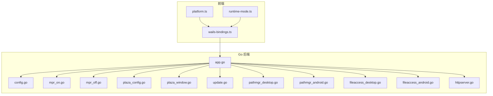
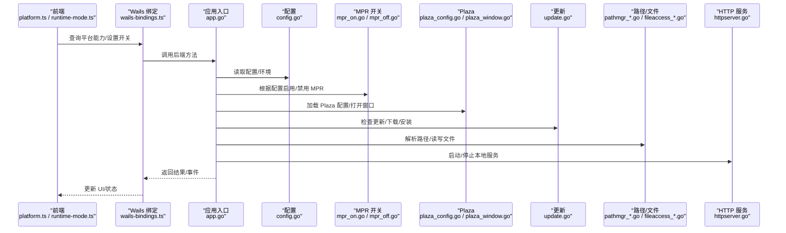
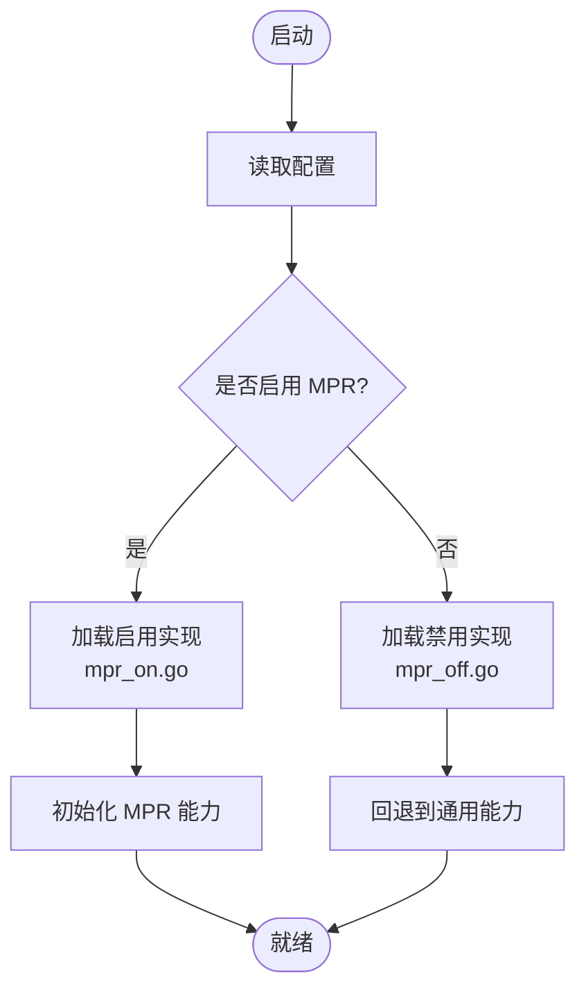
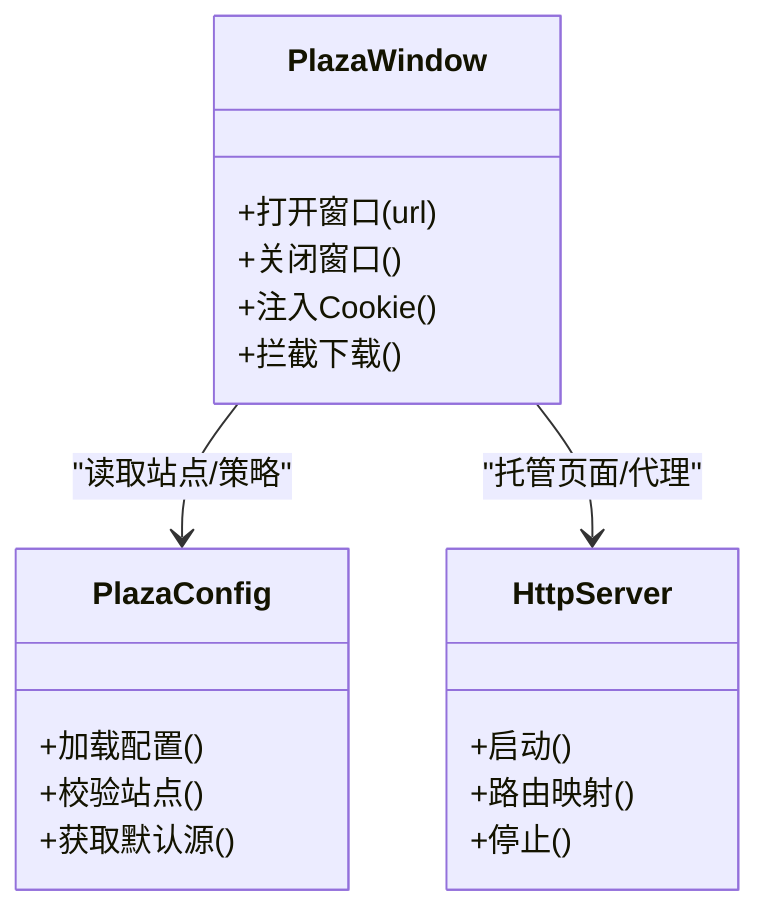
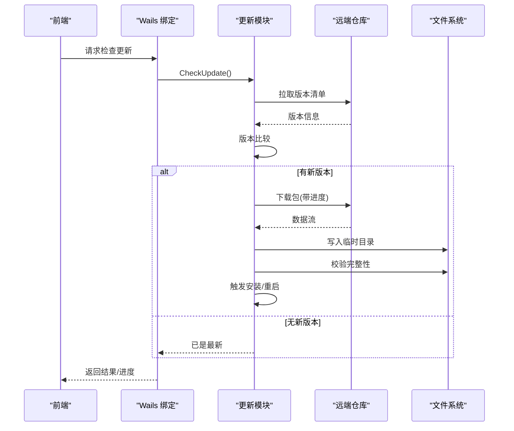
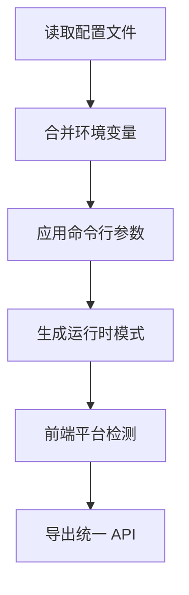
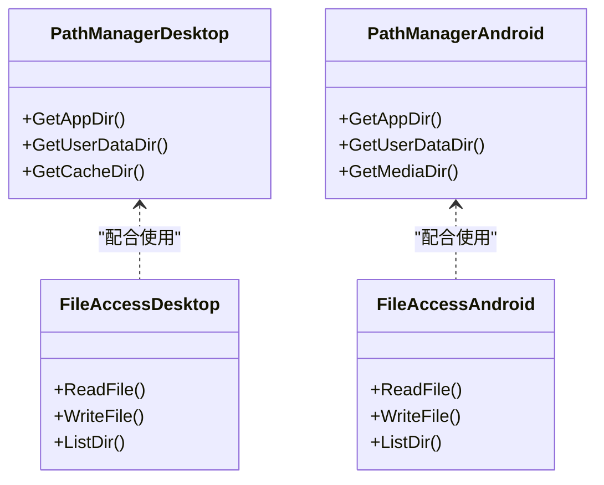
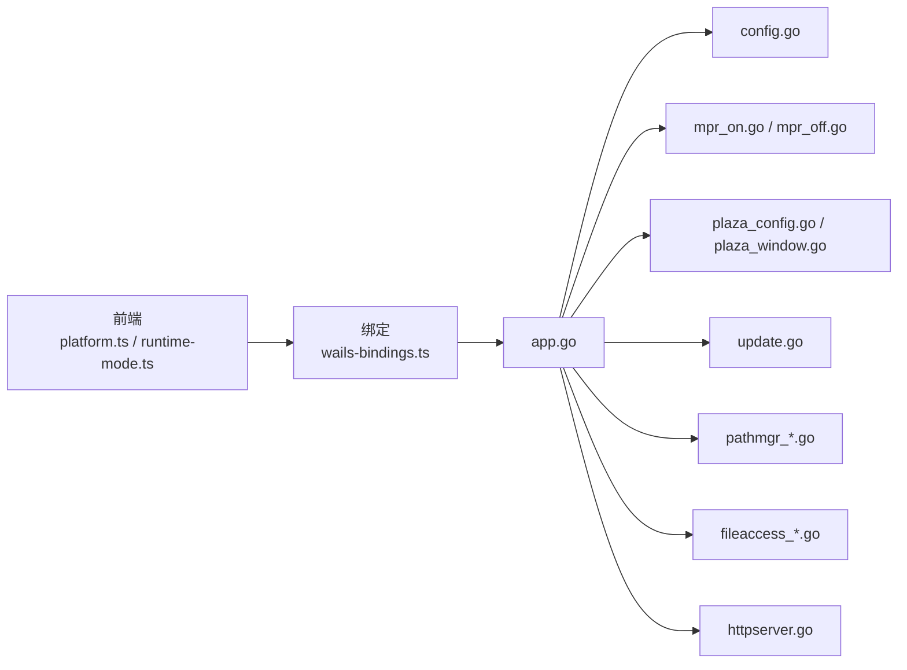

# 平台适配层

<cite>
**本文引用的文件**   
- [main.go](file://main.go)
- [app.go](file://internal/app/app.go)
- [config.go](file://internal/app/config.go)
- [mpr_on.go](file://internal/app/mpr_on.go)
- [mpr_off.go](file://internal/app/mpr_off.go)
- [plaza_config.go](file://internal/app/plaza_config.go)
- [plaza_window.go](file://internal/app/plaza_window.go)
- [update.go](file://internal/app/update.go)
- [pathmgr_desktop.go](file://internal/app/pathmgr_desktop.go)
- [pathmgr_android.go](file://internal/app/pathmgr_android.go)
- [fileaccess_desktop.go](file://internal/app/fileaccess_desktop.go)
- [fileaccess_android.go](file://internal/app/fileaccess_android.go)
- [httpserver.go](file://internal/app/httpserver.go)
- [platform.ts](file://frontend/src/core/platform.ts)
- [runtime-mode.ts](file://frontend/src/core/runtime-mode.ts)
- [wails-bindings.ts](file://frontend/src/core/wails-bindings.ts)
</cite>

## 目录
1. [简介](#简介)
2. [项目结构](#项目结构)
3. [核心组件](#核心组件)
4. [架构总览](#架构总览)
5. [详细组件分析](#详细组件分析)
6. [依赖关系分析](#依赖关系分析)
7. [性能考量](#性能考量)
8. [故障排查指南](#故障排查指南)
9. [结论](#结论)
10. [附录](#附录)

## 简介
本文件聚焦“平台适配层”，系统性说明多平台运行时环境的适配机制与关键能力，包括：
- MPR（MikuMikuAR Platform Runtime）的启用/禁用控制与条件编译策略
- 应用商店集成相关功能：Plaza 配置管理与窗口管理
- 自动更新检查：版本比较、下载进度、安装流程
- 平台特定的功能开关与配置选项
- 平台兼容性测试方法与工具使用指南

目标读者既包括需要理解整体架构的前端/后端开发者，也包括关注部署与发布流程的运维人员。

## 项目结构
平台适配层由 Go 后端（Wails 绑定侧）与前端桥接两部分组成：
- Go 后端负责平台差异实现、系统能力访问、构建期开关与运行期配置
- 前端通过 Wails 绑定调用后端能力，并在 UI 层暴露平台特性开关与状态

图表来源
- [platform.ts](file://frontend/src/core/platform.ts)
- [runtime-mode.ts](file://frontend/src/core/runtime-mode.ts)
- [wails-bindings.ts](file://frontend/src/core/wails-bindings.ts)
- [app.go](file://internal/app/app.go)
- [config.go](file://internal/app/config.go)
- [mpr_on.go](file://internal/app/mpr_on.go)
- [mpr_off.go](file://internal/app/mpr_off.go)
- [plaza_config.go](file://internal/app/plaza_config.go)
- [plaza_window.go](file://internal/app/plaza_window.go)
- [update.go](file://internal/app/update.go)
- [pathmgr_desktop.go](file://internal/app/pathmgr_desktop.go)
- [pathmgr_android.go](file://internal/app/pathmgr_android.go)
- [fileaccess_desktop.go](file://internal/app/fileaccess_desktop.go)
- [fileaccess_android.go](file://internal/app/fileaccess_android.go)
- [httpserver.go](file://internal/app/httpserver.go)

章节来源
- [main.go](file://main.go)
- [app.go](file://internal/app/app.go)
- [config.go](file://internal/app/config.go)
- [platform.ts](file://frontend/src/core/platform.ts)
- [runtime-mode.ts](file://frontend/src/core/runtime-mode.ts)
- [wails-bindings.ts](file://frontend/src/core/wails-bindings.ts)

## 核心组件
- 平台运行时入口与初始化
  - 负责加载配置、注册平台能力、启动内置服务（如本地 HTTP 服务器）、初始化 MPR 模式等
- MPR 运行时开关
  - 基于构建标签或运行期配置在“启用/禁用”两种实现间切换
- Plaza 配置与窗口管理
  - 提供商店资源站点配置、打开/关闭外部浏览窗口、与 WebView 交互等
- 自动更新模块
  - 检查新版本、解析版本信息、下载增量/全量包、触发安装
- 路径与文件系统抽象
  - 桌面与 Android 平台差异化路径解析与文件访问
- 前端桥接
  - 将平台能力以统一 API 暴露给前端，屏蔽平台差异

章节来源
- [app.go](file://internal/app/app.go)
- [config.go](file://internal/app/config.go)
- [mpr_on.go](file://internal/app/mpr_on.go)
- [mpr_off.go](file://internal/app/mpr_off.go)
- [plaza_config.go](file://internal/app/plaza_config.go)
- [plaza_window.go](file://internal/app/plaza_window.go)
- [update.go](file://internal/app/update.go)
- [pathmgr_desktop.go](file://internal/app/pathmgr_desktop.go)
- [pathmgr_android.go](file://internal/app/pathmgr_android.go)
- [fileaccess_desktop.go](file://internal/app/fileaccess_desktop.go)
- [fileaccess_android.go](file://internal/app/fileaccess_android.go)
- [httpserver.go](file://internal/app/httpserver.go)
- [platform.ts](file://frontend/src/core/platform.ts)
- [runtime-mode.ts](file://frontend/src/core/runtime-mode.ts)
- [wails-bindings.ts](file://frontend/src/core/wails-bindings.ts)

## 架构总览
下图展示从前端到后端的调用链路与平台差异点：

图表来源
- [platform.ts](file://frontend/src/core/platform.ts)
- [runtime-mode.ts](file://frontend/src/core/runtime-mode.ts)
- [wails-bindings.ts](file://frontend/src/core/wails-bindings.ts)
- [app.go](file://internal/app/app.go)
- [config.go](file://internal/app/config.go)
- [mpr_on.go](file://internal/app/mpr_on.go)
- [mpr_off.go](file://internal/app/mpr_off.go)
- [plaza_config.go](file://internal/app/plaza_config.go)
- [plaza_window.go](file://internal/app/plaza_window.go)
- [update.go](file://internal/app/update.go)
- [pathmgr_desktop.go](file://internal/app/pathmgr_desktop.go)
- [pathmgr_android.go](file://internal/app/pathmgr_android.go)
- [fileaccess_desktop.go](file://internal/app/fileaccess_desktop.go)
- [fileaccess_android.go](file://internal/app/fileaccess_android.go)
- [httpserver.go](file://internal/app/httpserver.go)

## 详细组件分析

### MPR（MikuMikuAR Platform Runtime）启用/禁用控制
- 设计要点
  - 通过构建标签或运行期配置选择启用或禁用 MPR 的实现
  - 启用时提供 AR 相机、传感器、渲染管线等能力；禁用时回退到标准桌面/通用模式
- 关键文件
  - 启用实现：[mpr_on.go](file://internal/app/mpr_on.go)
  - 禁用实现：[mpr_off.go](file://internal/app/mpr_off.go)
  - 入口与装配：[app.go](file://internal/app/app.go)、[config.go](file://internal/app/config.go)
- 行为说明
  - 启动阶段依据配置决定加载哪套实现
  - 对外暴露统一的接口，上层无需感知差异
  - 错误处理与降级：当 MPR 不可用时，自动回退并记录日志

图表来源
- [app.go](file://internal/app/app.go)
- [config.go](file://internal/app/config.go)
- [mpr_on.go](file://internal/app/mpr_on.go)
- [mpr_off.go](file://internal/app/mpr_off.go)

章节来源
- [app.go](file://internal/app/app.go)
- [config.go](file://internal/app/config.go)
- [mpr_on.go](file://internal/app/mpr_on.go)
- [mpr_off.go](file://internal/app/mpr_off.go)

### 应用商店集成：Plaza 配置管理与窗口管理
- 配置管理
  - 提供站点列表、默认源、缓存策略等配置项
  - 支持动态刷新与校验
- 窗口管理
  - 打开/关闭外部浏览器或内嵌 WebView 窗口
  - 与页面通信（如 Cookie 中继、下载拦截等）
- 关键文件
  - 配置：[plaza_config.go](file://internal/app/plaza_config.go)
  - 窗口：[plaza_window.go](file://internal/app/plaza_window.go)
  - 本地服务（用于承载页面/代理）：[httpserver.go](file://internal/app/httpserver.go)

图表来源
- [plaza_config.go](file://internal/app/plaza_config.go)
- [plaza_window.go](file://internal/app/plaza_window.go)
- [httpserver.go](file://internal/app/httpserver.go)

章节来源
- [plaza_config.go](file://internal/app/plaza_config.go)
- [plaza_window.go](file://internal/app/plaza_window.go)
- [httpserver.go](file://internal/app/httpserver.go)

### 自动更新检查：版本比较、下载进度、安装流程
- 版本比较
  - 解析远程版本信息，进行语义化比较
- 下载进度
  - 分块下载、断点续传、进度回调
- 安装流程
  - 校验完整性、替换二进制/资源、重启应用
- 关键文件
  - 更新逻辑：[update.go](file://internal/app/update.go)
  - 配置与路径：[config.go](file://internal/app/config.go)、[pathmgr_desktop.go](file://internal/app/pathmgr_desktop.go)、[pathmgr_android.go](file://internal/app/pathmgr_android.go)

图表来源
- [update.go](file://internal/app/update.go)
- [config.go](file://internal/app/config.go)
- [pathmgr_desktop.go](file://internal/app/pathmgr_desktop.go)
- [pathmgr_android.go](file://internal/app/pathmgr_android.go)

章节来源
- [update.go](file://internal/app/update.go)
- [config.go](file://internal/app/config.go)
- [pathmgr_desktop.go](file://internal/app/pathmgr_desktop.go)
- [pathmgr_android.go](file://internal/app/pathmgr_android.go)

### 平台特定功能开关与配置选项
- 配置来源
  - 全局配置、平台环境变量、命令行参数
- 典型开关
  - MPR 启用标志、Plaza 站点开关、更新通道、调试日志级别
- 关键文件
  - 配置加载与合并：[config.go](file://internal/app/config.go)
  - 运行时模式（前端）：[runtime-mode.ts](file://frontend/src/core/runtime-mode.ts)
  - 平台检测（前端）：[platform.ts](file://frontend/src/core/platform.ts)
  - 绑定封装（前端）：[wails-bindings.ts](file://frontend/src/core/wails-bindings.ts)

图表来源
- [config.go](file://internal/app/config.go)
- [runtime-mode.ts](file://frontend/src/core/runtime-mode.ts)
- [platform.ts](file://frontend/src/core/platform.ts)
- [wails-bindings.ts](file://frontend/src/core/wails-bindings.ts)

章节来源
- [config.go](file://internal/app/config.go)
- [runtime-mode.ts](file://frontend/src/core/runtime-mode.ts)
- [platform.ts](file://frontend/src/core/platform.ts)
- [wails-bindings.ts](file://frontend/src/core/wails-bindings.ts)

### 路径与文件系统抽象（桌面 vs Android）
- 职责
  - 桌面：用户目录、程序目录、可写路径
  - Android：沙箱目录、共享存储、媒体目录
- 关键文件
  - 路径管理：[pathmgr_desktop.go](file://internal/app/pathmgr_desktop.go)、[pathmgr_android.go](file://internal/app/pathmgr_android.go)
  - 文件访问：[fileaccess_desktop.go](file://internal/app/fileaccess_desktop.go)、[fileaccess_android.go](file://internal/app/fileaccess_android.go)

图表来源
- [pathmgr_desktop.go](file://internal/app/pathmgr_desktop.go)
- [pathmgr_android.go](file://internal/app/pathmgr_android.go)
- [fileaccess_desktop.go](file://internal/app/fileaccess_desktop.go)
- [fileaccess_android.go](file://internal/app/fileaccess_android.go)

章节来源
- [pathmgr_desktop.go](file://internal/app/pathmgr_desktop.go)
- [pathmgr_android.go](file://internal/app/pathmgr_android.go)
- [fileaccess_desktop.go](file://internal/app/fileaccess_desktop.go)
- [fileaccess_android.go](file://internal/app/fileaccess_android.go)

## 依赖关系分析
- 组件耦合
  - app.go 作为装配中心，聚合配置、MPR、Plaza、更新、路径/文件、HTTP 服务等
  - 前端 platform.ts 与 runtime-mode.ts 仅依赖 wails-bindings.ts，避免直接耦合后端细节
- 外部依赖
  - Wails 运行时、操作系统 API、网络库、文件系统
- 潜在循环依赖
  - 通过分层与接口隔离降低风险；确保更新与 Plaza 不反向依赖 UI

图表来源
- [platform.ts](file://frontend/src/core/platform.ts)
- [runtime-mode.ts](file://frontend/src/core/runtime-mode.ts)
- [wails-bindings.ts](file://frontend/src/core/wails-bindings.ts)
- [app.go](file://internal/app/app.go)
- [config.go](file://internal/app/config.go)
- [mpr_on.go](file://internal/app/mpr_on.go)
- [mpr_off.go](file://internal/app/mpr_off.go)
- [plaza_config.go](file://internal/app/plaza_config.go)
- [plaza_window.go](file://internal/app/plaza_window.go)
- [update.go](file://internal/app/update.go)
- [pathmgr_desktop.go](file://internal/app/pathmgr_desktop.go)
- [pathmgr_android.go](file://internal/app/pathmgr_android.go)
- [fileaccess_desktop.go](file://internal/app/fileaccess_desktop.go)
- [fileaccess_android.go](file://internal/app/fileaccess_android.go)
- [httpserver.go](file://internal/app/httpserver.go)

章节来源
- [app.go](file://internal/app/app.go)
- [config.go](file://internal/app/config.go)
- [platform.ts](file://frontend/src/core/platform.ts)
- [runtime-mode.ts](file://frontend/src/core/runtime-mode.ts)
- [wails-bindings.ts](file://frontend/src/core/wails-bindings.ts)

## 性能考量
- 更新下载
  - 建议采用分块下载与并发校验，减少内存峰值
  - 对大体积资源优先增量更新
- MPR 启用
  - 仅在必要时初始化重资源模块，按需释放
- I/O 与路径
  - 批量操作合并，避免频繁小文件 I/O
  - Android 端注意跨进程/沙箱边界开销
- 网络
  - 重试与超时策略，连接池复用
- 前端
  - 减少不必要的绑定调用，合并状态更新

## 故障排查指南
- 常见问题定位
  - MPR 无法启用：检查配置项与平台能力可用性，查看回退日志
  - Plaza 无法打开：确认本地 HTTP 服务端口占用、站点可达性、Cookie 注入策略
  - 更新失败：核对版本清单格式、网络连通性、磁盘空间与权限
  - 路径异常：区分桌面/Android 路径策略，验证可写目录
- 建议步骤
  - 开启调试日志，复现问题并收集上下文
  - 使用最小配置复测，逐步恢复配置项定位根因
  - 针对 Android，检查沙箱权限与存储访问框架

章节来源
- [config.go](file://internal/app/config.go)
- [httpserver.go](file://internal/app/httpserver.go)
- [update.go](file://internal/app/update.go)
- [pathmgr_desktop.go](file://internal/app/pathmgr_desktop.go)
- [pathmgr_android.go](file://internal/app/pathmgr_android.go)
- [fileaccess_desktop.go](file://internal/app/fileaccess_desktop.go)
- [fileaccess_android.go](file://internal/app/fileaccess_android.go)

## 结论
平台适配层通过清晰的模块化设计与前后端解耦，实现了：
- MPR 的条件启用与平滑回退
- Plaza 的配置化与窗口化管理
- 稳定的自动更新流程
- 一致的路径与文件访问抽象
- 面向多平台的可扩展能力

建议在后续迭代中持续完善错误码体系、遥测上报与自动化测试覆盖，以提升稳定性与可维护性。

## 附录

### 平台兼容性测试方法与工具使用指南
- 测试矩阵
  - 桌面：Windows、macOS、Linux
  - 移动：Android（含不同版本与厂商 ROM）
- 测试维度
  - MPR 启用/禁用：功能可用性与回退路径
  - Plaza：站点加载、窗口打开/关闭、Cookie 注入、下载拦截
  - 更新：版本比较、下载进度、安装与重启
  - 路径/文件：读写权限、目录结构、大小文件 I/O
- 工具建议
  - 单元测试：Go 测试与前端 Vitest
  - 端到端：Playwright/E2E 脚本
  - 设备：真机与模拟器并行
- 执行建议
  - 先跑冒烟用例，再回归全量
  - 记录缺陷与平台差异，形成基线报告