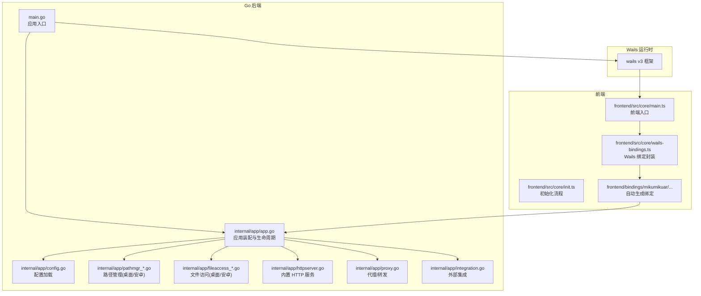
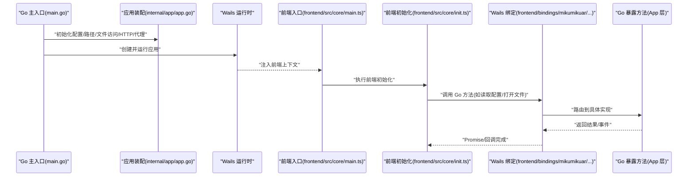
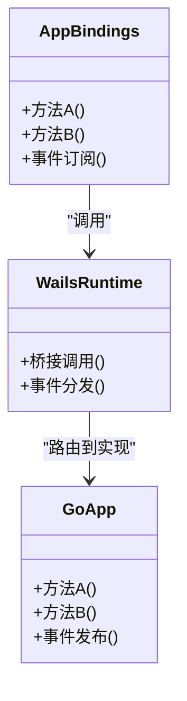
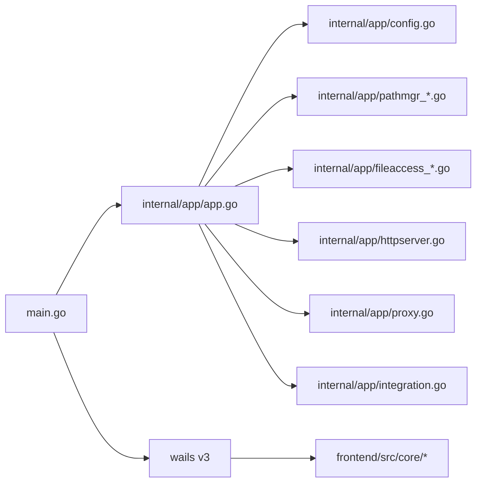

# 应用核心

<cite>
**本文引用的文件**   
- [main.go](file://main.go)
- [go.mod](file://go.mod)
- [internal/app/app.go](file://internal/app/app.go)
- [internal/app/config.go](file://internal/app/config.go)
- [internal/app/httpserver.go](file://internal/app/httpserver.go)
- [internal/app/pathmgr_desktop.go](file://internal/app/pathmgr_desktop.go)
- [internal/app/pathmgr_android.go](file://internal/app/pathmgr_android.go)
- [internal/app/fileaccess_desktop.go](file://internal/app/fileaccess_desktop.go)
- [internal/app/fileaccess_android.go](file://internal/app/fileaccess_android.go)
- [internal/app/proxy.go](file://internal/app/proxy.go)
- [internal/app/integration.go](file://internal/app/integration.go)
- [frontend/src/core/main.ts](file://frontend/src/core/main.ts)
- [frontend/src/core/init.ts](file://frontend/src/core/init.ts)
- [frontend/src/core/wails-bindings.ts](file://frontend/src/core/wails-bindings.ts)
- [frontend/bindings/mikumikuar/internal/app/index.ts](file://frontend/bindings/mikumikuar/internal/app/index.ts)
- [frontend/bindings/mikumikuar/internal/app/app.ts](file://frontend/bindings/mikumikuar/internal/app/app.ts)
- [frontend/bindings/mikumikuar/internal/app/models.ts](file://frontend/bindings/mikumikuar/internal/app/models.ts)
</cite>

## 目录
1. [简介](#简介)
2. [项目结构](#项目结构)
3. [核心组件](#核心组件)
4. [架构总览](#架构总览)
5. [详细组件分析](#详细组件分析)
6. [依赖关系分析](#依赖关系分析)
7. [性能考量](#性能考量)
8. [故障排查指南](#故障排查指南)
9. [结论](#结论)
10. [附录](#附录)

## 简介
本文件聚焦于应用的核心模块，围绕 Go 主入口、Wails v3 集成、前后端绑定通信、应用状态管理、错误处理与日志系统、启动参数与环境变量、调试模式等主题进行系统化说明。文档旨在帮助开发者快速理解应用的初始化流程、生命周期管理与关键扩展点，并提供可操作的实践建议。

## 项目结构
应用采用“Go 后端 + Wails v3 前端”的混合架构：
- Go 侧负责应用生命周期、配置加载、平台能力（文件访问、路径管理）、HTTP 服务、代理与更新等。
- 前端基于 TypeScript/JavaScript，通过 Wails 自动生成的绑定与 Go 方法交互，并维护 UI 与场景状态。

图表来源
- [main.go:1-200](file://main.go#L1-L200)
- [internal/app/app.go:1-200](file://internal/app/app.go#L1-L200)
- [frontend/src/core/main.ts:1-200](file://frontend/src/core/main.ts#L1-L200)

章节来源
- [main.go:1-200](file://main.go#L1-L200)
- [go.mod:1-200](file://go.mod#L1-L200)

## 核心组件
- 应用入口与生命周期
  - Go 主入口负责创建 Wails 应用实例、注册模块与方法、启动运行循环。
  - 应用装配层负责初始化配置、路径管理、文件访问、HTTP 服务、代理与外部集成。
- 配置加载机制
  - 集中式配置加载，支持默认值、环境变量覆盖与平台差异化。
- 路径与文件访问抽象
  - 针对桌面与 Android 提供不同实现，统一对外接口。
- 内置 HTTP 服务与代理
  - 提供本地 HTTP 服务用于资源或调试；代理用于请求转发与跨域处理。
- 前端绑定与通信
  - 通过 Wails 自动生成绑定，前端调用 Go 暴露的方法，双向事件通道用于异步通知。

章节来源
- [internal/app/app.go:1-200](file://internal/app/app.go#L1-L200)
- [internal/app/config.go:1-200](file://internal/app/config.go#L1-L200)
- [internal/app/pathmgr_desktop.go:1-200](file://internal/app/pathmgr_desktop.go#L1-L200)
- [internal/app/pathmgr_android.go:1-200](file://internal/app/pathmgr_android.go#L1-L200)
- [internal/app/fileaccess_desktop.go:1-200](file://internal/app/fileaccess_desktop.go#L1-L200)
- [internal/app/fileaccess_android.go:1-200](file://internal/app/fileaccess_android.go#L1-L200)
- [internal/app/httpserver.go:1-200](file://internal/app/httpserver.go#L1-L200)
- [internal/app/proxy.go:1-200](file://internal/app/proxy.go#L1-L200)
- [frontend/src/core/wails-bindings.ts:1-200](file://frontend/src/core/wails-bindings.ts#L1-L200)
- [frontend/bindings/mikumikuar/internal/app/index.ts:1-200](file://frontend/bindings/mikumikuar/internal/app/index.ts#L1-L200)

## 架构总览
下图展示从 Go 主入口到前端绑定的完整调用链路与数据流。

图表来源
- [main.go:1-200](file://main.go#L1-L200)
- [internal/app/app.go:1-200](file://internal/app/app.go#L1-L200)
- [frontend/src/core/main.ts:1-200](file://frontend/src/core/main.ts#L1-L200)
- [frontend/src/core/init.ts:1-200](file://frontend/src/core/init.ts#L1-L200)
- [frontend/bindings/mikumikuar/internal/app/index.ts:1-200](file://frontend/bindings/mikumikuar/internal/app/index.ts#L1-L200)

## 详细组件分析

### Go 主入口与生命周期
- 职责
  - 构建 Wails 应用实例，注册模块与方法，设置窗口与菜单（如有），进入运行循环。
  - 在应用退出时执行清理逻辑（释放资源、关闭服务）。
- 关键点
  - 启动顺序：解析命令行参数 -> 加载配置 -> 初始化路径与文件访问 -> 启动 HTTP 服务 -> 注册绑定 -> 运行。
  - 生命周期钩子：OnAppStart、OnAppQuit 等（由 Wails 提供）用于挂载资源与收尾。
- 最佳实践
  - 将耗时初始化放入后台协程，避免阻塞主线程。
  - 使用统一的错误包装与日志记录，便于定位问题。

章节来源
- [main.go:1-200](file://main.go#L1-L200)
- [internal/app/app.go:1-200](file://internal/app/app.go#L1-L200)

### 配置加载机制
- 设计要点
  - 集中式配置对象，包含默认值、环境变量覆盖、平台差异。
  - 支持热重载（可选）与校验失败时的回退策略。
- 典型流程
  - 读取配置文件 -> 合并环境变量 -> 应用平台特定规则 -> 校验并持久化默认项。
- 注意事项
  - 敏感信息应优先通过环境变量注入，避免硬编码。
  - 对不可信输入进行严格校验，防止配置注入。

章节来源
- [internal/app/config.go:1-200](file://internal/app/config.go#L1-L200)

### 路径管理与文件访问
- 抽象层
  - 路径管理：根据平台选择桌面或 Android 实现，提供统一的路径解析与权限检查。
  - 文件访问：封装读写、遍历、安全校验等操作，屏蔽平台差异。
- 平台差异
  - 桌面：直接访问文件系统，注意权限与路径规范化。
  - Android：受沙箱限制，需通过系统 API 或存储访问框架获取路径。
- 错误处理
  - 统一错误类型，区分 IO 错误、权限错误、路径非法等。

章节来源
- [internal/app/pathmgr_desktop.go:1-200](file://internal/app/pathmgr_desktop.go#L1-L200)
- [internal/app/pathmgr_android.go:1-200](file://internal/app/pathmgr_android.go#L1-L200)
- [internal/app/fileaccess_desktop.go:1-200](file://internal/app/fileaccess_desktop.go#L1-L200)
- [internal/app/fileaccess_android.go:1-200](file://internal/app/fileaccess_android.go#L1-L200)

### 内置 HTTP 服务与代理
- 功能
  - 提供本地 HTTP 服务，用于静态资源、调试接口或内部通信。
  - 代理模块用于转发请求、处理跨域、鉴权与限流。
- 集成方式
  - 在应用启动后按需启用，监听指定端口，注册路由。
- 安全建议
  - 仅在内网或本地回环地址监听，避免暴露到公网。
  - 对敏感接口增加鉴权与速率限制。

章节来源
- [internal/app/httpserver.go:1-200](file://internal/app/httpserver.go#L1-L200)
- [internal/app/proxy.go:1-200](file://internal/app/proxy.go#L1-L200)

### 前端绑定与通信机制
- 绑定生成
  - Wails 根据 Go 暴露的方法自动生成前端 TypeScript 绑定，位于 bindings 目录。
- 调用流程
  - 前端通过绑定模块调用 Go 方法，返回 Promise 或触发事件。
  - 复杂场景可使用事件通道进行异步通知。
- 错误传播
  - Go 侧错误经绑定序列化后在前端抛出，建议统一捕获并提示用户。

图表来源
- [frontend/bindings/mikumikuar/internal/app/index.ts:1-200](file://frontend/bindings/mikumikuar/internal/app/index.ts#L1-L200)
- [frontend/bindings/mikumikuar/internal/app/app.ts:1-200](file://frontend/bindings/mikumikuar/internal/app/app.ts#L1-L200)
- [frontend/bindings/mikumikuar/internal/app/models.ts:1-200](file://frontend/bindings/mikumikuar/internal/app/models.ts#L1-L200)
- [internal/app/app.go:1-200](file://internal/app/app.go#L1-L200)

章节来源
- [frontend/src/core/wails-bindings.ts:1-200](file://frontend/src/core/wails-bindings.ts#L1-L200)
- [frontend/bindings/mikumikuar/internal/app/index.ts:1-200](file://frontend/bindings/mikumikuar/internal/app/index.ts#L1-L200)
- [frontend/bindings/mikumikuar/internal/app/app.ts:1-200](file://frontend/bindings/mikumikuar/internal/app/app.ts#L1-L200)
- [frontend/bindings/mikumikuar/internal/app/models.ts:1-200](file://frontend/bindings/mikumikuar/internal/app/models.ts#L1-L200)

### 应用状态管理
- 前端状态
  - 使用响应式状态管理 UI 与场景数据，确保视图与模型同步。
- 后端状态
  - 通过共享内存或事件总线传递状态变更，避免频繁往返调用。
- 一致性保障
  - 对关键操作加锁或使用单写者模式，保证并发安全。

章节来源
- [frontend/src/core/state.ts:1-200](file://frontend/src/core/state.ts#L1-L200)
- [frontend/src/core/events.ts:1-200](file://frontend/src/core/events.ts#L1-L200)

### 错误处理策略
- 统一错误类型
  - Go 侧定义业务错误与系统错误，前端映射为友好提示。
- 重试与降级
  - 对网络与 IO 操作实现指数退避重试；失败时回退到默认行为。
- 日志与追踪
  - 记录错误上下文（时间、堆栈、相关 ID），便于定位问题。

章节来源
- [internal/util/errors.go:1-200](file://internal/util/errors.go#L1-L200)
- [frontend/src/core/safe-call.ts:1-200](file://frontend/src/core/safe-call.ts#L1-L200)

### 日志记录系统
- 结构化日志
  - 使用 slog 或类似库输出 JSON 格式日志，便于采集与分析。
- 分级控制
  - 支持 DEBUG/INFO/WARN/ERROR 级别，按环境切换。
- 前端日志
  - 将前端关键操作上报至后端，统一收集。

章节来源
- [frontend/bindings/log/slog/index.ts:1-200](file://frontend/bindings/log/slog/index.ts#L1-L200)
- [frontend/bindings/log/slog/models.ts:1-200](file://frontend/bindings/log/slog/models.ts#L1-L200)

### 启动参数、环境变量与调试模式
- 启动参数
  - 支持 --config、--port、--debug 等常用开关，影响配置加载与服务行为。
- 环境变量
  - 通过环境变量覆盖配置项，如数据库连接、代理地址、日志级别。
- 调试模式
  - 开启更详细的日志、禁用部分优化、暴露调试接口。

章节来源
- [main.go:1-200](file://main.go#L1-L200)
- [internal/app/config.go:1-200](file://internal/app/config.go#L1-L200)

## 依赖关系分析
- 模块耦合
  - 应用装配层聚合配置、路径、文件访问、HTTP、代理等子系统，形成高内聚低耦合。
- 外部依赖
  - Wails v3 作为运行时桥接前后端；标准库与第三方库用于网络、IO、JSON 等。
- 潜在风险
  - 避免循环依赖；对平台差异做好隔离；对第三方库版本进行锁定与审计。

图表来源
- [main.go:1-200](file://main.go#L1-L200)
- [internal/app/app.go:1-200](file://internal/app/app.go#L1-L200)
- [internal/app/config.go:1-200](file://internal/app/config.go#L1-L200)
- [internal/app/pathmgr_desktop.go:1-200](file://internal/app/pathmgr_desktop.go#L1-L200)
- [internal/app/pathmgr_android.go:1-200](file://internal/app/pathmgr_android.go#L1-L200)
- [internal/app/fileaccess_desktop.go:1-200](file://internal/app/fileaccess_desktop.go#L1-L200)
- [internal/app/fileaccess_android.go:1-200](file://internal/app/fileaccess_android.go#L1-L200)
- [internal/app/httpserver.go:1-200](file://internal/app/httpserver.go#L1-L200)
- [internal/app/proxy.go:1-200](file://internal/app/proxy.go#L1-L200)
- [internal/app/integration.go:1-200](file://internal/app/integration.go#L1-L200)

章节来源
- [go.mod:1-200](file://go.mod#L1-L200)

## 性能考量
- 启动优化
  - 延迟加载非关键模块；并行初始化互不依赖的资源。
- 渲染与计算
  - 将 CPU 密集任务移至 WASM 或后台协程，避免阻塞 UI。
- 缓存策略
  - 对频繁读取的配置与资源进行缓存，减少 IO 开销。
- 网络与代理
  - 合理设置超时与重试；对大文件传输使用分块与断点续传。

[本节为通用指导，无需源码引用]

## 故障排查指南
- 常见问题
  - 配置加载失败：检查配置文件语法与权限，确认环境变量是否覆盖正确。
  - 文件访问异常：核对路径合法性与平台权限，查看错误码分类。
  - HTTP 服务无法启动：确认端口占用与防火墙策略。
  - 绑定调用失败：检查 Go 方法签名与前端类型定义是否一致。
- 诊断步骤
  - 开启调试模式，收集结构化日志与堆栈。
  - 使用最小复现用例隔离问题模块。
  - 对比不同平台的差异（桌面 vs Android）。

章节来源
- [internal/util/errors.go:1-200](file://internal/util/errors.go#L1-L200)
- [frontend/src/core/safe-call.ts:1-200](file://frontend/src/core/safe-call.ts#L1-L200)

## 结论
本应用以 Wails v3 为核心，将 Go 后端能力与前端界面无缝结合。通过清晰的模块化设计与统一的错误、日志、配置与平台抽象，实现了良好的可维护性与可扩展性。遵循本文的最佳实践与排障建议，可有效提升开发效率与稳定性。

[本节为总结，无需源码引用]

## 附录
- 术语表
  - Wails：跨平台桌面应用框架，桥接 Go 与 Web 技术。
  - 绑定：自动生成前后端互调的接口层。
  - 代理：请求转发与中间件处理组件。
- 参考链接
  - Wails v3 官方文档与示例仓库。
  - 项目内研究文档与架构决策记录（ADR）。

[本节为补充信息，无需源码引用]