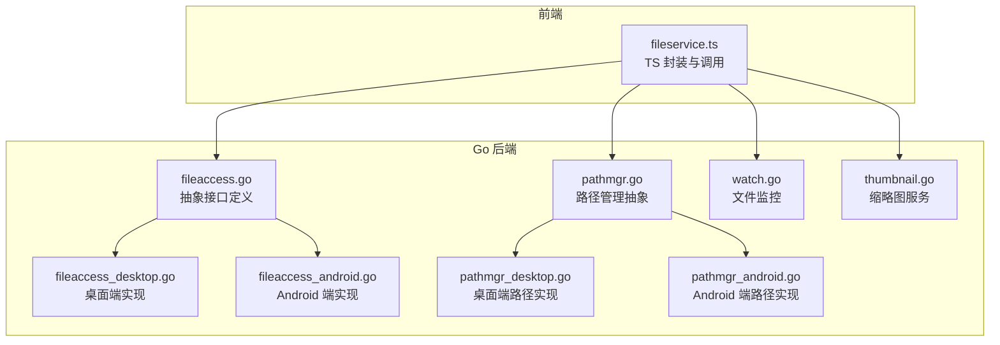
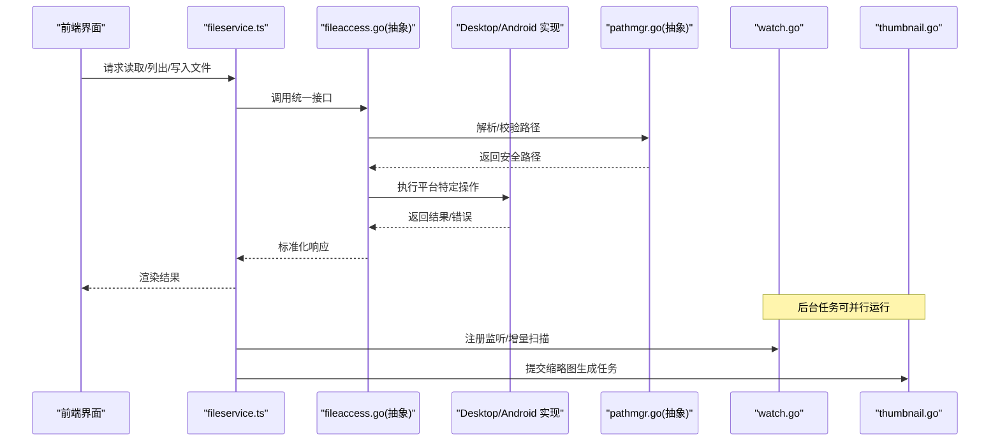
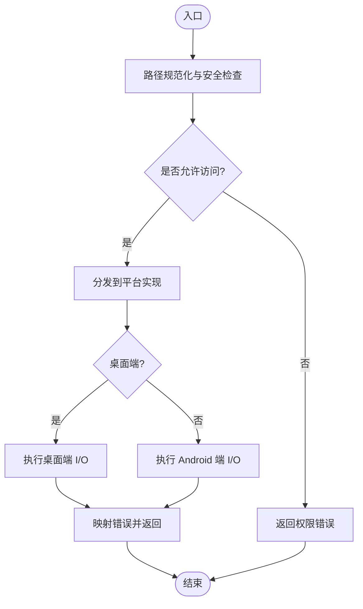
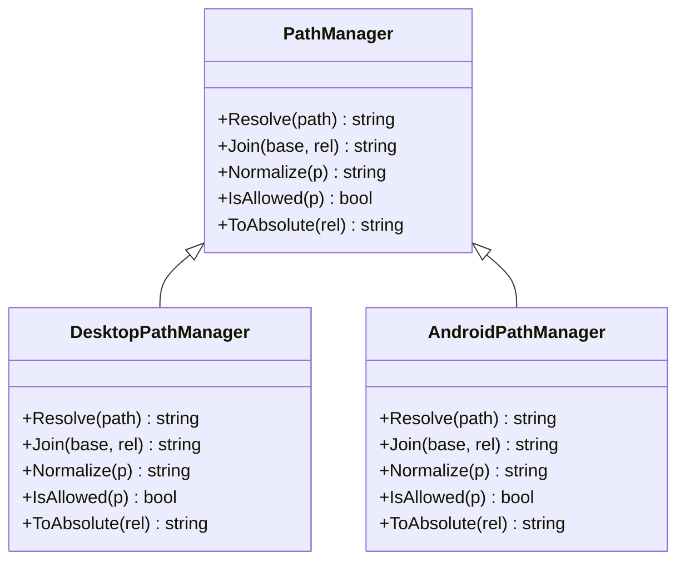
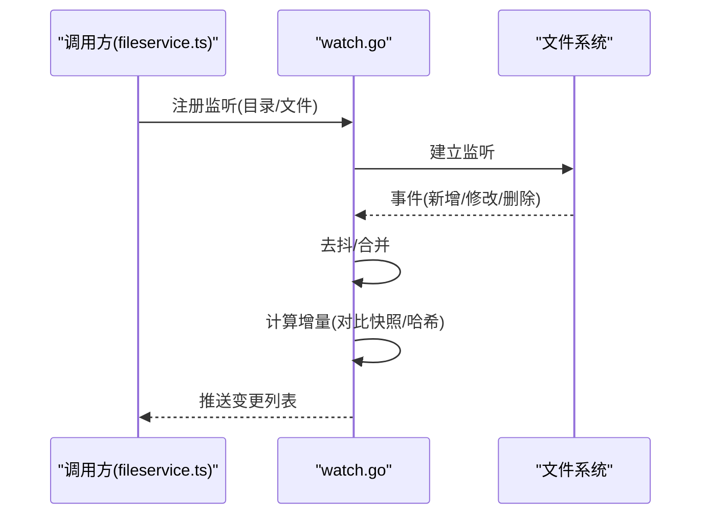
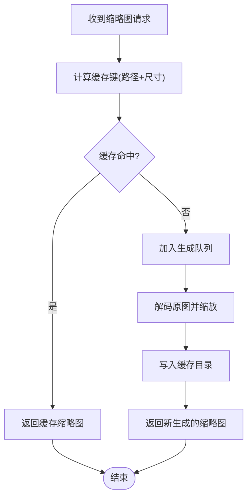
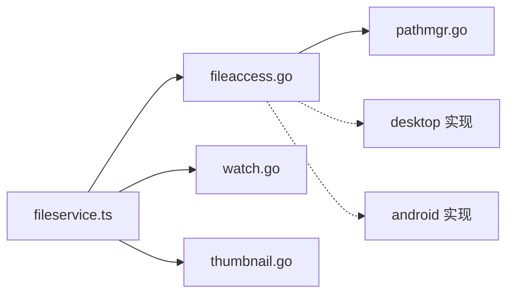

# 文件系统访问

<cite>
**本文引用的文件**   
- [internal/app/fileaccess.go](file://internal/app/fileaccess.go)
- [internal/app/fileaccess_desktop.go](file://internal/app/fileaccess_desktop.go)
- [internal/app/fileaccess_android.go](file://internal/app/fileaccess_android.go)
- [internal/app/pathmgr.go](file://internal/app/pathmgr.go)
- [internal/app/pathmgr_desktop.go](file://internal/app/pathmgr_desktop.go)
- [internal/app/pathmgr_android.go](file://internal/app/pathmgr_android.go)
- [internal/app/watch.go](file://internal/app/watch.go)
- [internal/app/thumbnail.go](file://internal/app/thumbnail.go)
- [frontend/src/core/fileservice.ts](file://frontend/src/core/fileservice.ts)
- [docs/adr/adr-018-path-manager-abstraction.md](file://docs/adr/adr-018-path-manager-abstraction.md)
- [docs/adr/adr-058-basenameFallbackFS.md](file://docs/adr/adr-058-basenameFallbackFS.md)
- [docs/adr/adr-095-path-normalization-consolidation.md](file://docs/adr/adr-095-path-normalization-consolidation.md)
- [docs/buglog/2026-07-17-adr124-file-access-migration.md](file://docs/buglog/2026-07-17-adr124-file-access-migration.md)
</cite>

## 目录
1. [简介](#简介)
2. [项目结构](#项目结构)
3. [核心组件](#核心组件)
4. [架构总览](#架构总览)
5. [详细组件分析](#详细组件分析)
6. [依赖关系分析](#依赖关系分析)
7. [性能考量](#性能考量)
8. [故障排查指南](#故障排查指南)
9. [结论](#结论)
10. [附录：API 接口与使用示例](#附录api-接口与使用示例)

## 简介
本文件面向“文件系统访问层”的设计与实现，聚焦以下目标：
- 跨平台文件操作抽象层（桌面端与 Android 端差异化实现）
- 路径管理器的工作原理与安全边界
- 文件监控与增量更新检测机制
- 缩略图生成服务（格式支持、缓存策略、异步处理）
- 面向前端调用方的 API 接口文档与使用示例

该层通过 Go 后端提供统一能力，由 Wails 绑定暴露给前端 TypeScript 侧调用。

## 项目结构
与文件系统访问相关的核心代码位于 internal/app 目录，前端在 frontend/src/core/fileservice.ts 中封装调用。

图表来源
- [internal/app/fileaccess.go](file://internal/app/fileaccess.go)
- [internal/app/fileaccess_desktop.go](file://internal/app/fileaccess_desktop.go)
- [internal/app/fileaccess_android.go](file://internal/app/fileaccess_android.go)
- [internal/app/pathmgr.go](file://internal/app/pathmgr.go)
- [internal/app/pathmgr_desktop.go](file://internal/app/pathmgr_desktop.go)
- [internal/app/pathmgr_android.go](file://internal/app/pathmgr_android.go)
- [internal/app/watch.go](file://internal/app/watch.go)
- [internal/app/thumbnail.go](file://internal/app/thumbnail.go)
- [frontend/src/core/fileservice.ts](file://frontend/src/core/fileservice.ts)

章节来源
- [internal/app/fileaccess.go](file://internal/app/fileaccess.go)
- [internal/app/fileaccess_desktop.go](file://internal/app/fileaccess_desktop.go)
- [internal/app/fileaccess_android.go](file://internal/app/fileaccess_android.go)
- [internal/app/pathmgr.go](file://internal/app/pathmgr.go)
- [internal/app/pathmgr_desktop.go](file://internal/app/pathmgr_desktop.go)
- [internal/app/pathmgr_android.go](file://internal/app/pathmgr_android.go)
- [internal/app/watch.go](file://internal/app/watch.go)
- [internal/app/thumbnail.go](file://internal/app/thumbnail.go)
- [frontend/src/core/fileservice.ts](file://frontend/src/core/fileservice.ts)

## 核心组件
- 文件访问抽象层
  - 职责：定义统一的文件读写、遍历、权限校验等接口；按平台选择具体实现。
  - 关键点：安全边界（白名单目录）、错误类型统一、平台差异隐藏。
- 路径管理器
  - 职责：解析、规范化、拼接路径；在不同平台上保证一致性与安全性。
  - 关键点：路径归一化、相对路径转绝对路径、禁止越界访问。
- 文件监控
  - 职责：监听目录或文件变更，触发增量更新事件。
  - 关键点：去抖、增量对比、跨平台事件源适配。
- 缩略图服务
  - 职责：为图片资源生成缩略图，提供缓存与异步任务调度。
  - 关键点：格式识别、尺寸控制、并发限制、缓存键设计。

章节来源
- [internal/app/fileaccess.go](file://internal/app/fileaccess.go)
- [internal/app/pathmgr.go](file://internal/app/pathmgr.go)
- [internal/app/watch.go](file://internal/app/watch.go)
- [internal/app/thumbnail.go](file://internal/app/thumbnail.go)

## 架构总览
整体采用“抽象接口 + 平台实现”的分层模式，前端通过 TS 封装调用 Go 后端能力。

图表来源
- [frontend/src/core/fileservice.ts](file://frontend/src/core/fileservice.ts)
- [internal/app/fileaccess.go](file://internal/app/fileaccess.go)
- [internal/app/pathmgr.go](file://internal/app/pathmgr.go)
- [internal/app/watch.go](file://internal/app/watch.go)
- [internal/app/thumbnail.go](file://internal/app/thumbnail.go)

## 详细组件分析

### 文件访问抽象层（跨平台）
- 设计要点
  - 统一接口：读、写、列目录、删除、移动、复制、检查存在性等。
  - 安全边界：所有路径必须经过路径管理器校验，拒绝越界访问。
  - 平台差异：桌面端直接操作系统文件系统；Android 端通过系统存储/内容提供者访问。
- 关键流程
  - 入参路径 -> 路径管理器规范化与校验 -> 选择平台实现 -> 执行 I/O -> 返回统一错误码/结果。
- 错误处理
  - 将底层 OS 错误映射为应用级错误类型，便于前端展示与重试策略。

图表来源
- [internal/app/fileaccess.go](file://internal/app/fileaccess.go)
- [internal/app/fileaccess_desktop.go](file://internal/app/fileaccess_desktop.go)
- [internal/app/fileaccess_android.go](file://internal/app/fileaccess_android.go)
- [internal/app/pathmgr.go](file://internal/app/pathmgr.go)

章节来源
- [internal/app/fileaccess.go](file://internal/app/fileaccess.go)
- [internal/app/fileaccess_desktop.go](file://internal/app/fileaccess_desktop.go)
- [internal/app/fileaccess_android.go](file://internal/app/fileaccess_android.go)
- [internal/app/pathmgr.go](file://internal/app/pathmgr.go)

### 路径管理器（Path Manager）
- 职责
  - 路径解析与归一化（分隔符、冗余段、符号链接等）。
  - 相对路径转绝对路径，确保始终落在允许的根目录下。
  - 提供平台相关的路径构造与兼容性处理。
- 安全策略
  - 白名单根目录：仅允许访问配置的安全目录集合。
  - 路径穿越防护：拒绝包含“..”等越界片段的路径。
  - 大小写与编码：在不同平台下保持一致性。
- 设计决策参考
  - ADR-018 路径管理器抽象
  - ADR-058 basename 回退策略
  - ADR-095 路径规范化整合

图表来源
- [internal/app/pathmgr.go](file://internal/app/pathmgr.go)
- [internal/app/pathmgr_desktop.go](file://internal/app/pathmgr_desktop.go)
- [internal/app/pathmgr_android.go](file://internal/app/pathmgr_android.go)

章节来源
- [internal/app/pathmgr.go](file://internal/app/pathmgr.go)
- [internal/app/pathmgr_desktop.go](file://internal/app/pathmgr_desktop.go)
- [internal/app/pathmgr_android.go](file://internal/app/pathmgr_android.go)
- [docs/adr/adr-018-path-manager-abstraction.md](file://docs/adr/adr-018-path-manager-abstraction.md)
- [docs/adr/adr-058-basenameFallbackFS.md](file://docs/adr/adr-058-basenameFallbackFS.md)
- [docs/adr/adr-095-path-normalization-consolidation.md](file://docs/adr/adr-095-path-normalization-consolidation.md)

### 文件监控与增量更新
- 功能概述
  - 监听指定目录或文件变化，推送变更事件。
  - 增量更新：基于快照/哈希对比，仅上报实际变更项。
- 关键流程
  - 初始化快照 -> 启动监听器 -> 捕获事件 -> 计算增量 -> 派发通知。
- 注意事项
  - 事件去抖与批量合并，避免风暴式刷新。
  - 跨平台事件源差异（inotify/fsevents/Windows API）。

图表来源
- [internal/app/watch.go](file://internal/app/watch.go)
- [frontend/src/core/fileservice.ts](file://frontend/src/core/fileservice.ts)

章节来源
- [internal/app/watch.go](file://internal/app/watch.go)
- [frontend/src/core/fileservice.ts](file://frontend/src/core/fileservice.ts)

### 缩略图生成服务
- 功能概述
  - 根据原图生成指定尺寸的缩略图，支持常见图片格式。
  - 提供本地缓存，命中则直接返回，未命中则异步生成。
- 关键流程
  - 接收生成请求 -> 计算缓存键 -> 查询缓存 -> 命中则返回 -> 未命中则排队生成 -> 落盘缓存 -> 返回结果。
- 并发与限流
  - 任务队列与并发上限，避免阻塞主线程。
- 格式支持与容错
  - 失败降级：无法解码时返回占位图或错误码。

图表来源
- [internal/app/thumbnail.go](file://internal/app/thumbnail.go)
- [frontend/src/core/fileservice.ts](file://frontend/src/core/fileservice.ts)

章节来源
- [internal/app/thumbnail.go](file://internal/app/thumbnail.go)
- [frontend/src/core/fileservice.ts](file://frontend/src/core/fileservice.ts)

## 依赖关系分析
- 模块耦合
  - fileaccess 依赖 pathmgr 进行路径校验。
  - watch 与 thumbnail 作为独立服务被上层聚合调用。
  - 前端 fileservice.ts 作为门面，屏蔽 Go 细节。
- 外部依赖
  - 操作系统文件系统 API（桌面端）。
  - Android 存储/内容提供者（Android 端）。
  - 图像解码库（缩略图）。

图表来源
- [frontend/src/core/fileservice.ts](file://frontend/src/core/fileservice.ts)
- [internal/app/fileaccess.go](file://internal/app/fileaccess.go)
- [internal/app/pathmgr.go](file://internal/app/pathmgr.go)
- [internal/app/fileaccess_desktop.go](file://internal/app/fileaccess_desktop.go)
- [internal/app/fileaccess_android.go](file://internal/app/fileaccess_android.go)
- [internal/app/watch.go](file://internal/app/watch.go)
- [internal/app/thumbnail.go](file://internal/app/thumbnail.go)

章节来源
- [internal/app/fileaccess.go](file://internal/app/fileaccess.go)
- [internal/app/pathmgr.go](file://internal/app/pathmgr.go)
- [internal/app/fileaccess_desktop.go](file://internal/app/fileaccess_desktop.go)
- [internal/app/fileaccess_android.go](file://internal/app/fileaccess_android.go)
- [internal/app/watch.go](file://internal/app/watch.go)
- [internal/app/thumbnail.go](file://internal/app/thumbnail.go)
- [frontend/src/core/fileservice.ts](file://frontend/src/core/fileservice.ts)

## 性能考量
- 路径校验开销
  - 尽量复用已规范化的路径，减少重复计算。
- 文件监控
  - 合理设置去抖时间窗口，批量合并事件。
  - 增量对比优先使用轻量元数据（大小、时间戳），必要时再计算哈希。
- 缩略图生成
  - 并发上限与队列长度需根据设备能力调优。
  - 缓存目录建议置于应用沙箱内，避免频繁跨分区 IO。
- 前端交互
  - 对耗时操作使用进度反馈与取消信号，提升用户体验。

## 故障排查指南
- 常见问题
  - 路径越界：检查路径管理器白名单与规范化逻辑。
  - 权限不足：确认应用对目标目录的读写权限。
  - 监控不生效：检查平台事件源可用性，确认监听路径有效。
  - 缩略图缺失：核对缓存目录是否存在、磁盘空间是否充足。
- 定位手段
  - 查看后端日志中的错误映射信息。
  - 在前端增加请求/响应日志，记录路径与参数。
  - 针对缩略图，验证输入图片是否可被解码库识别。

章节来源
- [docs/buglog/2026-07-17-adr124-file-access-migration.md](file://docs/buglog/2026-07-17-adr124-file-access-migration.md)

## 结论
本文件系统访问层通过抽象接口与平台实现解耦，结合路径管理器强化安全边界，辅以文件监控与缩略图服务，形成稳定、可扩展的文件能力基座。建议在后续迭代中持续完善错误语义、性能指标与可观测性。

## 附录：API 接口与使用示例

### 文件访问（Go 抽象接口概览）
- 典型方法
  - 读取文件内容
  - 写入文件内容
  - 列出目录条目
  - 判断路径是否存在
  - 删除/移动/复制
- 安全约束
  - 所有路径均经路径管理器校验，越界将被拒绝。
- 错误模型
  - 统一错误类型，区分权限、不存在、IO 异常等。

章节来源
- [internal/app/fileaccess.go](file://internal/app/fileaccess.go)
- [internal/app/pathmgr.go](file://internal/app/pathmgr.go)

### 路径管理器（Path Manager）
- 主要能力
  - 解析与规范化路径
  - 相对路径转绝对路径
  - 安全校验（白名单、防穿越）
- 平台差异
  - 桌面端：原生路径分隔符与大小写规则
  - Android 端：URI/ContentProvider 兼容处理

章节来源
- [internal/app/pathmgr.go](file://internal/app/pathmgr.go)
- [internal/app/pathmgr_desktop.go](file://internal/app/pathmgr_desktop.go)
- [internal/app/pathmgr_android.go](file://internal/app/pathmgr_android.go)
- [docs/adr/adr-018-path-manager-abstraction.md](file://docs/adr/adr-018-path-manager-abstraction.md)
- [docs/adr/adr-058-basenameFallbackFS.md](file://docs/adr/adr-058-basenameFallbackFS.md)
- [docs/adr/adr-095-path-normalization-consolidation.md](file://docs/adr/adr-095-path-normalization-consolidation.md)

### 文件监控（Watch）
- 能力
  - 注册监听目录/文件
  - 推送变更事件（新增/修改/删除）
  - 增量对比（可选）
- 使用建议
  - 合理设置去抖间隔
  - 对大量变更场景启用批量合并

章节来源
- [internal/app/watch.go](file://internal/app/watch.go)

### 缩略图服务（Thumbnail）
- 能力
  - 生成指定尺寸缩略图
  - 本地缓存命中优先
  - 异步任务队列与并发控制
- 格式支持
  - 常见图片格式（以解码库能力为准）
- 使用建议
  - 合理设置缓存目录与清理策略
  - 对大图生成进行超时与降级处理

章节来源
- [internal/app/thumbnail.go](file://internal/app/thumbnail.go)

### 前端调用示例（TypeScript）
- 基本用法
  - 读取文件：传入安全路径，获取内容或错误
  - 列出目录：传入目录路径，获取条目列表
  - 注册监控：传入目录，订阅变更事件
  - 生成缩略图：传入原图路径与目标尺寸，获取缩略图 URL 或二进制
- 最佳实践
  - 统一错误处理与用户提示
  - 对长耗时操作显示进度与取消选项
  - 缓存命中优先，避免重复生成

章节来源
- [frontend/src/core/fileservice.ts](file://frontend/src/core/fileservice.ts)