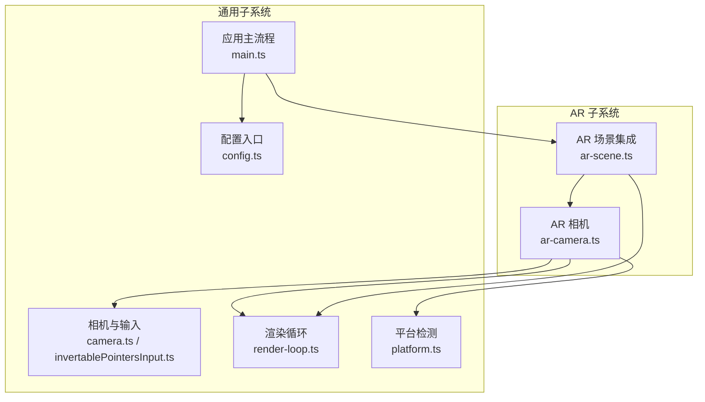
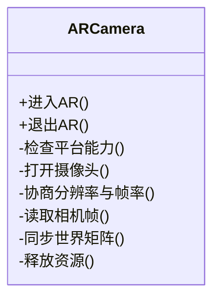
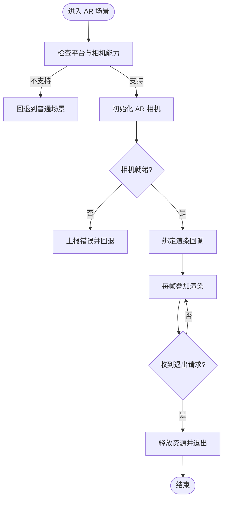
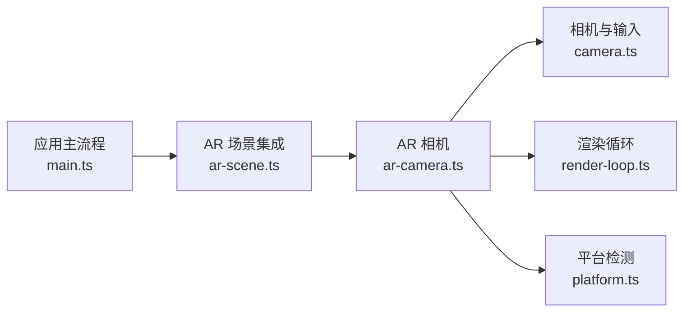

# 增强现实功能

<cite>
**本文引用的文件**   
- [ar-camera.ts](file://frontend/src/scene/ar/ar-camera.ts)
- [ar-scene.ts](file://frontend/src/scene/ar/ar-scene.ts)
- [adr-055-ar-camera-mode.md](file://docs/adr/adr-055-ar-camera-mode.md)
- [adr-109-ar-audit-resolution-and-deferral.md](file://docs/adr/adr-109-ar-audit-resolution-and-deferral.md)
- [camera.ts](file://frontend/src/scene/camera/camera.ts)
- [invertablePointersInput.ts](file://frontend/src/scene/camera/invertablePointersInput.ts)
- [render-loop.ts](file://frontend/src/core/render-loop.ts)
- [platform.ts](file://frontend/src/core/platform.ts)
- [config.ts](file://frontend/src/config.ts)
- [main.ts](file://frontend/src/core/main.ts)
</cite>

## 目录
1. [简介](#简介)
2. [项目结构](#项目结构)
3. [核心组件](#核心组件)
4. [架构总览](#架构总览)
5. [详细组件分析](#详细组件分析)
6. [依赖关系分析](#依赖关系分析)
7. [性能与优化](#性能与优化)
8. [故障排查指南](#故障排查指南)
9. [结论](#结论)
10. [附录：AR内容创作与调试实践](#附录ar内容创作与调试实践)

## 简介
本文件面向 MikuMikuAR 的增强现实（AR）能力，聚焦 AR 相机模式的实现原理、平台差异、空间定位与手势识别、环境感知、渲染优化与电池续航策略，并提供内容创作与调试实践建议。文档以代码级事实为依据，结合 ADR（架构决策记录）与审计文档，给出可落地的最佳实践与排障指引。

## 项目结构
AR 相关的前端实现位于 scene/ar 子模块，包含相机模式与场景集成两个核心文件；同时与通用相机输入、渲染循环、平台检测等基础模块协作。



图表来源
- [ar-camera.ts](file://frontend/src/scene/ar/ar-camera.ts)
- [ar-scene.ts](file://frontend/src/scene/ar/ar-scene.ts)
- [camera.ts](file://frontend/src/scene/camera/camera.ts)
- [invertablePointersInput.ts](file://frontend/src/scene/camera/invertablePointersInput.ts)
- [render-loop.ts](file://frontend/src/core/render-loop.ts)
- [platform.ts](file://frontend/src/core/platform.ts)
- [config.ts](file://frontend/src/config.ts)
- [main.ts](file://frontend/src/core/main.ts)

章节来源
- [ar-camera.ts](file://frontend/src/scene/ar/ar-camera.ts)
- [ar-scene.ts](file://frontend/src/scene/ar/ar-scene.ts)
- [camera.ts](file://frontend/src/scene/camera/camera.ts)
- [invertablePointersInput.ts](file://frontend/src/scene/camera/invertablePointersInput.ts)
- [render-loop.ts](file://frontend/src/core/render-loop.ts)
- [platform.ts](file://frontend/src/core/platform.ts)
- [config.ts](file://frontend/src/config.ts)
- [main.ts](file://frontend/src/core/main.ts)

## 核心组件
- AR 相机控制器：负责相机权限申请、摄像头流获取、帧率与分辨率协商、坐标系对齐、虚拟对象叠加绘制、生命周期管理。
- AR 场景集成：将 AR 相机与现有场景系统对接，处理切换、资源加载、事件桥接与退出流程。
- 通用相机与输入：提供指针/触摸输入、相机控制与交互基类，供 AR 模式复用。
- 渲染循环：统一帧驱动，协调 AR 相机帧更新与场景渲染。
- 平台检测与配置：用于判断移动端/桌面端能力、启用或降级 AR 特性。

章节来源
- [ar-camera.ts](file://frontend/src/scene/ar/ar-camera.ts)
- [ar-scene.ts](file://frontend/src/scene/ar/ar-scene.ts)
- [camera.ts](file://frontend/src/scene/camera/camera.ts)
- [invertablePointersInput.ts](file://frontend/src/scene/camera/invertablePointersInput.ts)
- [render-loop.ts](file://frontend/src/core/render-loop.ts)
- [platform.ts](file://frontend/src/core/platform.ts)
- [config.ts](file://frontend/src/config.ts)

## 架构总览
下图展示 AR 相机模式在应用中的整体数据与控制流：从应用启动到进入 AR 模式，再到每帧的相机帧更新与虚拟对象叠加渲染。

```mermaid
sequenceDiagram
participant App as "应用主流程<br/>main.ts"
participant Scene as "AR 场景集成<br/>ar-scene.ts"
participant Cam as "AR 相机控制器<br/>ar-camera.ts"
participant Input as "相机与输入<br/>camera.ts"
participant Loop as "渲染循环<br/>render-loop.ts"
App->>Scene : "初始化并注册 AR 模式"
App->>Cam : "请求进入 AR 模式"
Cam->>Cam : "检查平台能力与权限"
Cam->>Cam : "打开摄像头并协商分辨率/帧率"
Cam-->>Scene : "返回相机就绪信号"
Scene->>Loop : "绑定 AR 渲染回调"
loop 每帧
Loop->>Cam : "触发相机帧更新"
Cam->>Cam : "读取相机帧/姿态数据"
Cam->>Scene : "同步世界矩阵/视口参数"
Scene->>Scene : "计算虚拟对象叠加位置"
Scene-->>Loop : "提交渲染命令"
end
App->>Cam : "退出 AR 模式"
Cam->>Cam : "释放摄像头与纹理资源"
```

图表来源
- [main.ts](file://frontend/src/core/main.ts)
- [ar-scene.ts](file://frontend/src/scene/ar/ar-scene.ts)
- [ar-camera.ts](file://frontend/src/scene/ar/ar-camera.ts)
- [camera.ts](file://frontend/src/scene/camera/camera.ts)
- [render-loop.ts](file://frontend/src/core/render-loop.ts)

## 详细组件分析

### AR 相机控制器（ar-camera.ts）
职责与要点
- 平台能力探测：依据 platform.ts 判断是否支持摄像头访问、WebXR/原生相机 API 可用性。
- 权限与媒体流：按平台差异调用相应 API 获取摄像头流，处理用户拒绝与异常路径。
- 分辨率与帧率协商：根据设备能力与 ADR 审计建议进行延迟初始化与分辨率降级策略。
- 坐标系与投影：将相机帧映射到场景坐标，确保虚拟对象叠加正确。
- 生命周期：进入/退出 AR 时创建与释放资源，避免内存泄漏。



图表来源
- [ar-camera.ts](file://frontend/src/scene/ar/ar-camera.ts)
- [platform.ts](file://frontend/src/core/platform.ts)

章节来源
- [ar-camera.ts](file://frontend/src/scene/ar/ar-camera.ts)
- [platform.ts](file://frontend/src/core/platform.ts)

### AR 场景集成（ar-scene.ts）
职责与要点
- 模式切换：在普通场景与 AR 场景之间切换，保持状态一致性与资源隔离。
- 事件桥接：将 AR 相机的就绪、错误、退出等事件转发给上层 UI 与菜单。
- 叠加渲染：在 AR 相机帧之上绘制虚拟对象，处理深度与遮挡。
- 退出与清理：安全退出 AR，恢复相机与渲染管线。



图表来源
- [ar-scene.ts](file://frontend/src/scene/ar/ar-scene.ts)
- [ar-camera.ts](file://frontend/src/scene/ar/ar-camera.ts)

章节来源
- [ar-scene.ts](file://frontend/src/scene/ar/ar-scene.ts)
- [ar-camera.ts](file://frontend/src/scene/ar/ar-camera.ts)

### 通用相机与输入（camera.ts / invertablePointersInput.ts）
- 提供统一的指针/触摸输入抽象，适配移动端与桌面端。
- 为 AR 模式下的交互（如拖拽、缩放）提供基础能力。

章节来源
- [camera.ts](file://frontend/src/scene/camera/camera.ts)
- [invertablePointersInput.ts](file://frontend/src/scene/camera/invertablePointersInput.ts)

### 渲染循环（render-loop.ts）
- 作为帧驱动中枢，协调 AR 相机帧更新与场景渲染。
- 在 AR 模式下降低额外开销，保证稳定帧率。

章节来源
- [render-loop.ts](file://frontend/src/core/render-loop.ts)

### 平台检测与配置（platform.ts / config.ts / main.ts）
- platform.ts：判断运行环境与硬件能力，决定 AR 可用性与降级策略。
- config.ts：集中管理 AR 相关开关与默认值。
- main.ts：应用启动后注册 AR 模式并接入场景管理器。

章节来源
- [platform.ts](file://frontend/src/core/platform.ts)
- [config.ts](file://frontend/src/config.ts)
- [main.ts](file://frontend/src/core/main.ts)

## 依赖关系分析
AR 子系统对通用子系统存在明确依赖，耦合点集中在相机输入、渲染循环与平台检测。



图表来源
- [ar-camera.ts](file://frontend/src/scene/ar/ar-camera.ts)
- [ar-scene.ts](file://frontend/src/scene/ar/ar-scene.ts)
- [camera.ts](file://frontend/src/scene/camera/camera.ts)
- [render-loop.ts](file://frontend/src/core/render-loop.ts)
- [platform.ts](file://frontend/src/core/platform.ts)
- [main.ts](file://frontend/src/core/main.ts)

章节来源
- [ar-camera.ts](file://frontend/src/scene/ar/ar-camera.ts)
- [ar-scene.ts](file://frontend/src/scene/ar/ar-scene.ts)
- [camera.ts](file://frontend/src/scene/camera/camera.ts)
- [render-loop.ts](file://frontend/src/core/render-loop.ts)
- [platform.ts](file://frontend/src/core/platform.ts)
- [main.ts](file://frontend/src/core/main.ts)

## 性能与优化
- 分辨率与帧率协商：遵循 ADR 审计建议，采用延迟初始化与动态降级策略，避免首帧卡顿与过热降频。
- 渲染路径精简：在 AR 模式下关闭非必要的后处理与反射通道，减少 GPU 压力。
- 内存管理：及时释放摄像头流、纹理与中间缓冲区，防止长时间运行导致的内存增长。
- 电池续航：限制不必要的传感器轮询频率，按需唤醒相机与物理计算。
- 热节流应对：当检测到设备温度升高或掉帧时，自动降低分辨率或关闭高级特效。

章节来源
- [adr-109-ar-audit-resolution-and-deferral.md](file://docs/adr/adr-109-ar-audit-resolution-and-deferral.md)
- [ar-camera.ts](file://frontend/src/scene/ar/ar-camera.ts)
- [render-loop.ts](file://frontend/src/core/render-loop.ts)

## 故障排查指南
常见问题与定位步骤
- 无法进入 AR 模式：检查平台能力与权限提示；确认摄像头 API 可用；查看错误日志与回退逻辑。
- 画面黑屏或叠加错位：核对相机帧尺寸与视口比例；验证世界矩阵同步是否正确。
- 卡顿或发热严重：降低分辨率/帧率；关闭高成本特效；监控渲染循环耗时。
- 退出后资源未释放：确认退出流程中是否释放了摄像头流与纹理。

章节来源
- [ar-camera.ts](file://frontend/src/scene/ar/ar-camera.ts)
- [ar-scene.ts](file://frontend/src/scene/ar/ar-scene.ts)
- [render-loop.ts](file://frontend/src/core/render-loop.ts)

## 结论
AR 相机模式通过独立的相机控制器与场景集成层，将摄像头帧与虚拟对象叠加无缝融入现有渲染管线。借助平台检测与配置机制，系统在移动端与桌面端具备一致的体验与合理的降级策略。配合 ADR 审计建议，可在性能、稳定性与续航方面取得良好平衡。

## 附录：AR内容创作与调试实践
- 内容创作
  - 模型尺度与单位：确保模型单位与场景一致，避免叠加错位。
  - 材质与光照：在 AR 环境下优先使用简单材质与低复杂度着色器，提升稳定性。
  - 交互设计：利用通用输入模块实现拖拽、缩放等基础交互，注意移动端触控区域大小。
- 调试工具
  - 开启调试日志：在 AR 相机与场景集成处输出关键状态（权限、分辨率、帧率、错误码）。
  - 性能面板：观察渲染循环耗时、GPU/CPU 占用与内存峰值，定位瓶颈。
  - 回放与截图：在 AR 模式下捕获帧与状态快照，便于复现问题。
- 最佳实践
  - 渐进式加载：先加载轻量资源，再按需加载高质量资源。
  - 容错与回退：当 AR 不可用时，平滑回退到普通场景，保障用户体验。
  - 多端适配：针对移动端与桌面端分别设置默认分辨率、帧率与交互策略。

章节来源
- [ar-camera.ts](file://frontend/src/scene/ar/ar-camera.ts)
- [ar-scene.ts](file://frontend/src/scene/ar/ar-scene.ts)
- [camera.ts](file://frontend/src/scene/camera/camera.ts)
- [render-loop.ts](file://frontend/src/core/render-loop.ts)
- [platform.ts](file://frontend/src/core/platform.ts)
- [config.ts](file://frontend/src/config.ts)
- [adr-055-ar-camera-mode.md](file://docs/adr/adr-055-ar-camera-mode.md)
- [adr-109-ar-audit-resolution-and-deferral.md](file://docs/adr/adr-109-ar-audit-resolution-and-deferral.md)