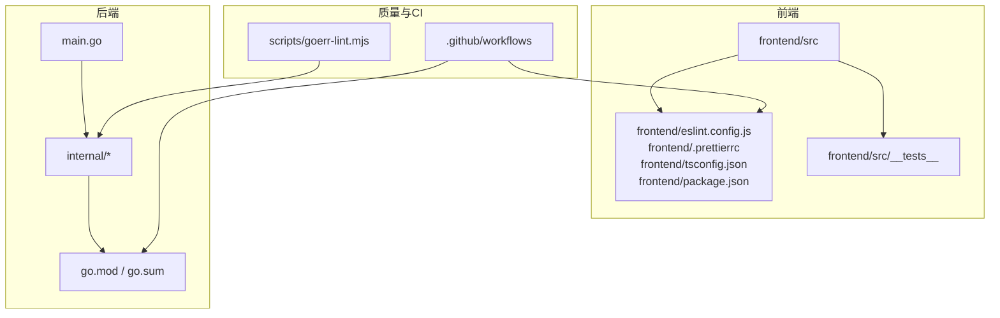
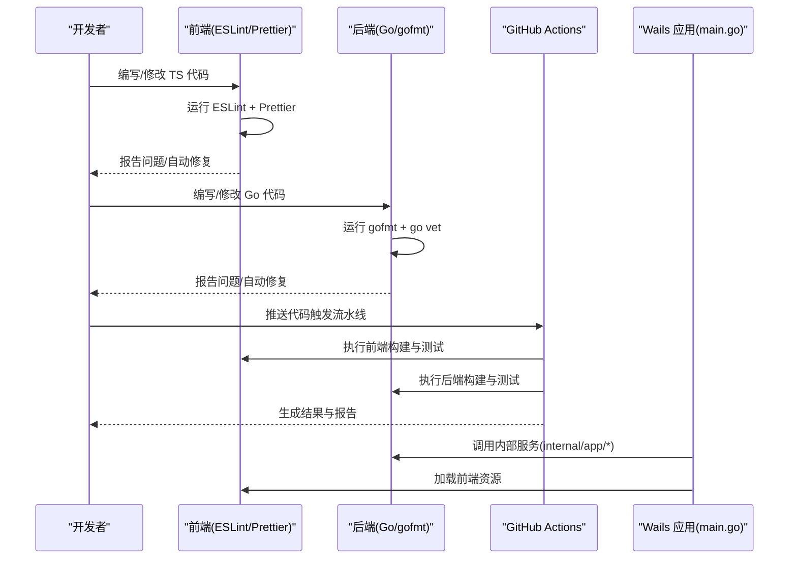
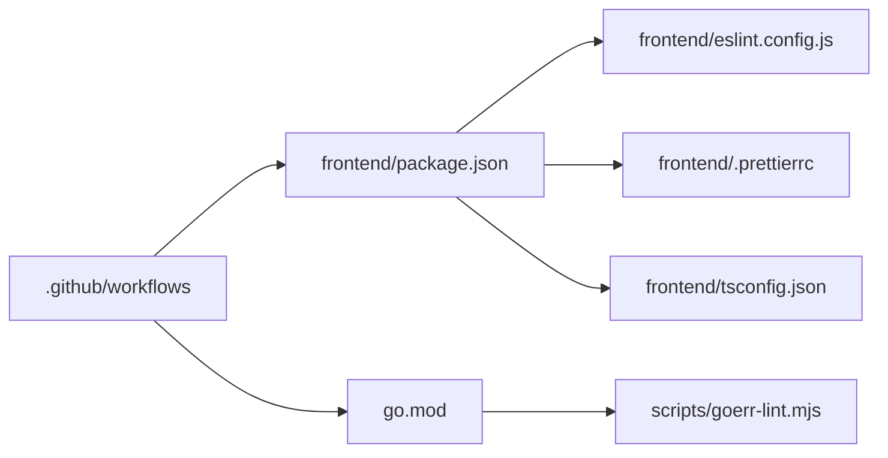

# 代码规范

<cite>
**本文引用的文件**   
- [frontend/eslint.config.js](file://frontend/eslint.config.js)
- [frontend/.prettierrc](file://frontend/.prettierrc)
- [frontend/tsconfig.json](file://frontend/tsconfig.json)
- [frontend/package.json](file://frontend/package.json)
- [go.mod](file://go.mod)
- [main.go](file://main.go)
- [internal/app/app.go](file://internal/app/app.go)
- [internal/app/config.go](file://internal/app/config.go)
- [internal/util/errors.go](file://internal/util/errors.go)
- [internal/i18nerr/errors.go](file://internal/i18nerr/errors.go)
- [scripts/goerr-lint.mjs](file://scripts/goerr-lint.mjs)
- [.github/workflows](file://.github/workflows)
</cite>

## 目录
1. [简介](#简介)
2. [项目结构](#项目结构)
3. [核心组件](#核心组件)
4. [架构总览](#架构总览)
5. [详细组件分析](#详细组件分析)
6. [依赖分析](#依赖分析)
7. [性能考虑](#性能考虑)
8. [故障排查指南](#故障排查指南)
9. [结论](#结论)
10. [附录](#附录)

## 简介
本规范面向前端 TypeScript 与后端 Go 双栈工程，覆盖以下方面：
- TypeScript 编码规范：命名约定、文件组织、类型定义最佳实践
- Go 语言编码规范：包组织、错误处理、并发编程约定
- 代码格式化工具配置与使用：ESLint、Prettier、gofmt
- Git 工作流规范：分支策略、提交信息格式、代码审查流程
- 代码质量检查工具：静态分析、安全扫描、依赖检查
- 具体示例与反模式说明（以路径引用为主）

## 项目结构
仓库采用前后端分离的混合结构：
- 前端位于 frontend/，包含 TypeScript 源码、测试、构建与质量工具配置
- 后端位于 internal/ 与 main.go，提供 Wails 绑定与桌面/移动端能力
- 文档与审计记录在 docs/，脚本与自动化在 scripts/
- GitHub Actions 工作流在 .github/workflows/

图表来源
- [frontend/eslint.config.js](file://frontend/eslint.config.js)
- [frontend/.prettierrc](file://frontend/.prettierrc)
- [frontend/tsconfig.json](file://frontend/tsconfig.json)
- [frontend/package.json](file://frontend/package.json)
- [go.mod](file://go.mod)
- [main.go](file://main.go)
- [internal/app/app.go](file://internal/app/app.go)
- [scripts/goerr-lint.mjs](file://scripts/goerr-lint.mjs)
- [.github/workflows](file://.github/workflows)

章节来源
- [frontend/eslint.config.js](file://frontend/eslint.config.js)
- [frontend/.prettierrc](file://frontend/.prettierrc)
- [frontend/tsconfig.json](file://frontend/tsconfig.json)
- [frontend/package.json](file://frontend/package.json)
- [go.mod](file://go.mod)
- [main.go](file://main.go)
- [internal/app/app.go](file://internal/app/app.go)
- [scripts/goerr-lint.mjs](file://scripts/goerr-lint.mjs)
- [.github/workflows](file://.github/workflows)

## 核心组件
本节聚焦于“规范落地”的关键配置文件与脚本，确保团队一致性与可维护性。

- ESLint 配置与规则启用
  - 通过 eslint.config.js 统一规则集与插件，建议开启严格模式、禁止隐式 any、限制循环复杂度等
  - 针对前端业务模块与测试分别设置适用规则
- Prettier 格式化
  - 通过 .prettierrc 统一缩进、引号、分号、换行等风格，配合编辑器保存自动格式化
- TypeScript 编译与类型约束
  - tsconfig.json 中启用 strict、noImplicitAny、strictNullChecks 等，保证类型安全
- Go 工程与依赖
  - go.mod 管理模块名与依赖版本；建议固定 major 版本并定期更新
- Go 错误处理与国际化错误
  - internal/util/errors.go 与 internal/i18nerr/errors.go 提供统一的错误包装与 i18n 支持
- Go 错误 lint 脚本
  - scripts/goerr-lint.mjs 用于检查 Go 错误返回与处理的一致性
- CI 流水线
  - .github/workflows 集成前端与后端的构建、测试、质量检查任务

章节来源
- [frontend/eslint.config.js](file://frontend/eslint.config.js)
- [frontend/.prettierrc](file://frontend/.prettierrc)
- [frontend/tsconfig.json](file://frontend/tsconfig.json)
- [frontend/package.json](file://frontend/package.json)
- [go.mod](file://go.mod)
- [internal/util/errors.go](file://internal/util/errors.go)
- [internal/i18nerr/errors.go](file://internal/i18nerr/errors.go)
- [scripts/goerr-lint.mjs](file://scripts/goerr-lint.mjs)
- [.github/workflows](file://.github/workflows)

## 架构总览
下图展示前端与后端在应用启动时的交互关系，以及质量工具在开发/CI中的接入点。

图表来源
- [frontend/eslint.config.js](file://frontend/eslint.config.js)
- [frontend/.prettierrc](file://frontend/.prettierrc)
- [frontend/tsconfig.json](file://frontend/tsconfig.json)
- [frontend/package.json](file://frontend/package.json)
- [go.mod](file://go.mod)
- [main.go](file://main.go)
- [internal/app/app.go](file://internal/app/app.go)
- [.github/workflows](file://.github/workflows)

## 详细组件分析

### TypeScript 编码规范
- 命名约定
  - 文件与目录：小驼峰或短横线分隔，按功能域划分（如 core、menus、scene、motion-algos、outfit、physics）
  - 变量与函数：小驼峰；常量：大写加下划线；类型与接口：大驼峰
  - 私有成员：前缀下划线或模块内导出控制
- 文件结构
  - 单一职责：每个文件聚焦一个领域或能力，避免巨型文件
  - 类型与实现分离：公共类型集中放在 types.ts 或独立类型文件
  - 测试与源码同目录或 __tests__ 子目录，便于定位
- 类型定义最佳实践
  - 优先使用 interface 描述对象形状，type 用于联合/交叉/映射类型
  - 禁用 any，必要时使用 unknown 并在入口处收窄
  - 使用泛型表达可复用逻辑，但避免过度复杂化
  - 对外部库类型进行桥接封装，减少直接耦合
- 常见反模式
  - 使用 any 作为“万能类型”，应替换为具体类型或 unknown+断言
  - 过深嵌套的条件判断，应提取函数或使用卫语句
  - 在 UI 层直接操作底层状态，应通过状态管理层中转

章节来源
- [frontend/tsconfig.json](file://frontend/tsconfig.json)
- [frontend/package.json](file://frontend/package.json)

### Go 语言编码规范
- 包组织
  - 入口 main.go 仅负责初始化与调度，业务逻辑下沉至 internal/*
  - 按能力划分包：app、util、i18nerr、dialogs、thumbnail 等
- 错误处理
  - 使用标准 error 返回，结合 errors.Is/As 进行判断
  - 对外暴露的错误需具备可读性，必要时结合 i18nerr 进行本地化
  - 避免吞掉错误，必须显式处理或向上返回
- 并发编程约定
  - 明确 goroutine 生命周期，使用 context 传递取消信号
  - 共享状态通过 channel 或互斥锁保护，避免竞态条件
  - 超时与重试需有上限，防止资源泄漏
- 常见反模式
  - 裸 panic 代替错误返回，应改为 error 并妥善处理
  - 长时阻塞操作在主线程执行，应放入 goroutine 并配合上下文
  - 忽略错误返回值，导致潜在崩溃或数据不一致

章节来源
- [main.go](file://main.go)
- [internal/app/app.go](file://internal/app/app.go)
- [internal/util/errors.go](file://internal/util/errors.go)
- [internal/i18nerr/errors.go](file://internal/i18nerr/errors.go)

### 代码格式化工具配置与使用
- ESLint
  - 在 frontend/eslint.config.js 中启用必要规则与插件，推荐开启严格模式与一致性规则
  - 建议在 IDE 中集成 ESLint，保存时自动修复
- Prettier
  - 在 frontend/.prettierrc 中统一风格，配合编辑器保存自动格式化
  - 与 ESLint 冲突的规则需关闭 ESLint 对应规则，交由 Prettier 处理
- gofmt
  - Go 代码统一使用 gofmt 格式化，保持团队一致
  - 可在提交前钩子或 CI 中强制校验

章节来源
- [frontend/eslint.config.js](file://frontend/eslint.config.js)
- [frontend/.prettierrc](file://frontend/.prettierrc)
- [frontend/tsconfig.json](file://frontend/tsconfig.json)
- [frontend/package.json](file://frontend/package.json)

### Git 工作流规范
- 分支策略
  - 主分支：main/master 发布稳定版本
  - 功能分支：feature/* 开发新功能
  - 修复分支：fix/* 修复缺陷
  - 预发分支：release/* 发布候选
- 提交信息格式
  - 采用 Conventional Commits：feat/fix/docs/style/refactor/test/chore/build/ci/perf
  - 主题行简洁明确，必要时附变更原因与影响范围
- 代码审查流程
  - 所有合并需经过 Pull Request 审查
  - 至少一名 reviewer 批准，CI 全部通过后合并
  - 大型变更拆分为多个 PR，降低审查成本

章节来源
- [.github/workflows](file://.github/workflows)

### 代码质量检查工具使用指南
- 静态分析
  - 前端：ESLint 检查语法与风格，TS 编译期类型检查
  - 后端：go vet 检查潜在问题，gofmt 统一格式
- 安全扫描
  - 前端：npm audit 检查依赖漏洞
  - 后端：Go 依赖安全扫描（如 govulncheck），纳入 CI
- 依赖检查
  - 定期更新依赖，锁定版本，避免漂移
  - 使用 go mod tidy 清理未使用依赖

章节来源
- [frontend/package.json](file://frontend/package.json)
- [go.mod](file://go.mod)
- [scripts/goerr-lint.mjs](file://scripts/goerr-lint.mjs)

## 依赖分析
前后端依赖管理与质量工具之间的关系如下：

图表来源
- [frontend/package.json](file://frontend/package.json)
- [frontend/eslint.config.js](file://frontend/eslint.config.js)
- [frontend/.prettierrc](file://frontend/.prettierrc)
- [frontend/tsconfig.json](file://frontend/tsconfig.json)
- [go.mod](file://go.mod)
- [scripts/goerr-lint.mjs](file://scripts/goerr-lint.mjs)
- [.github/workflows](file://.github/workflows)

章节来源
- [frontend/package.json](file://frontend/package.json)
- [go.mod](file://go.mod)

## 性能考虑
- 前端
  - 避免在渲染循环中进行昂贵计算，使用 requestAnimationFrame 或 Web Worker
  - 合理使用懒加载与按需引入，减小首屏体积
- 后端
  - 避免在关键路径进行阻塞 I/O，使用异步与缓冲
  - 合理设置超时与重试，防止雪崩效应
- 通用
  - 监控与日志：关键路径埋点，便于定位瓶颈
  - 缓存策略：对热点数据进行缓存，注意失效与一致性

[本节为通用指导，不直接分析具体文件]

## 故障排查指南
- 前端问题
  - ESLint 报错：根据提示修复规则违反项，必要时调整配置
  - Prettier 冲突：关闭 ESLint 中与 Prettier 重复的规则
  - TS 类型错误：逐步收窄类型，避免 any，使用 unknown+断言
- 后端问题
  - 错误处理不当：检查错误是否被吞掉或未正确返回
  - 并发问题：确认 goroutine 生命周期与共享状态保护
  - 国际化错误：使用 i18nerr 包装错误，确保用户可见信息友好
- 质量工具
  - goerr-lint 失败：检查错误返回与处理是否符合规范
  - CI 失败：查看日志定位具体步骤失败原因

章节来源
- [internal/util/errors.go](file://internal/util/errors.go)
- [internal/i18nerr/errors.go](file://internal/i18nerr/errors.go)
- [scripts/goerr-lint.mjs](file://scripts/goerr-lint.mjs)

## 结论
通过统一的 TypeScript 与 Go 编码规范、严格的格式化工具配置、完善的 Git 工作流与质量检查体系，可有效提升代码质量与团队协作效率。建议将上述规范纳入新人入职培训与日常开发流程，并通过 CI 持续保障。

[本节为总结，不直接分析具体文件]

## 附录
- 参考路径
  - 前端配置：frontend/eslint.config.js、frontend/.prettierrc、frontend/tsconfig.json、frontend/package.json
  - 后端配置：go.mod、main.go、internal/app/app.go、internal/util/errors.go、internal/i18nerr/errors.go
  - 质量脚本：scripts/goerr-lint.mjs
  - CI 流水线：.github/workflows

[本节为索引，不直接分析具体文件]