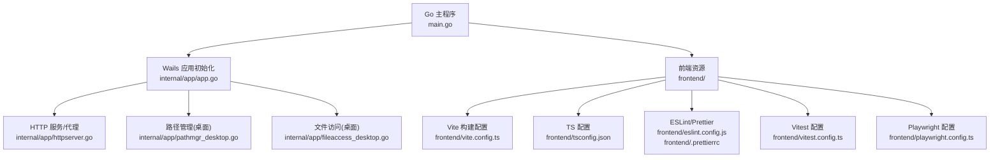
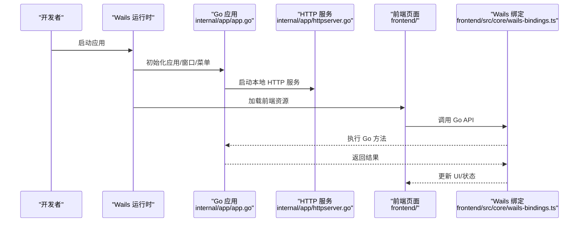
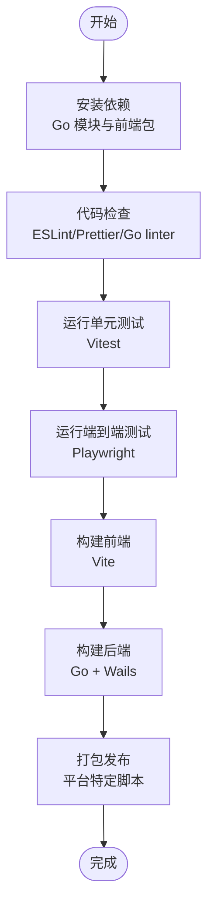
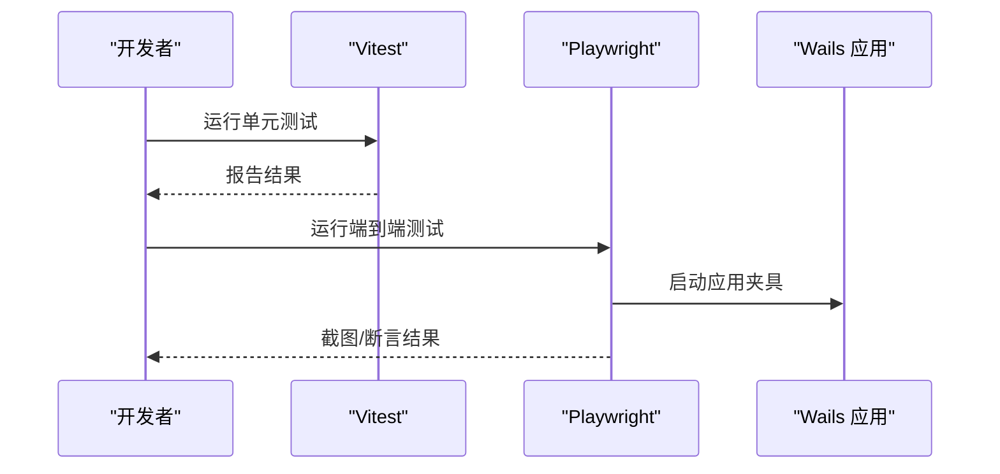
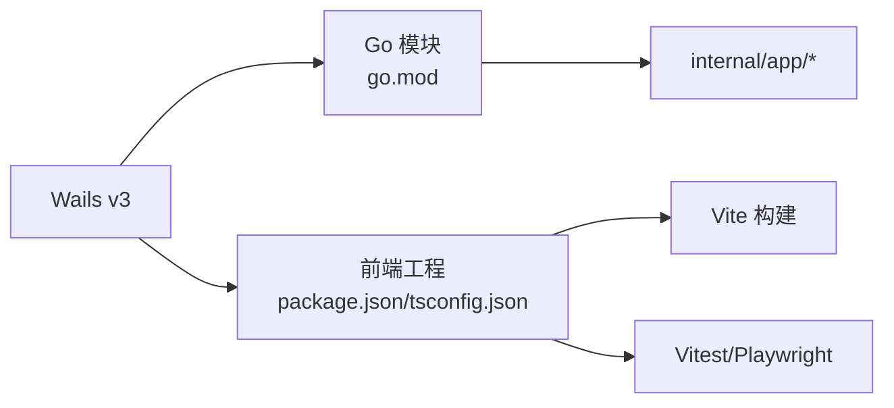

# 开发指南

<cite>
**本文引用的文件**   
- [main.go](file://main.go)
- [go.mod](file://go.mod)
- [Taskfile.yml](file://Taskfile.yml)
- [frontend/package.json](file://frontend/package.json)
- [frontend/tsconfig.json](file://frontend/tsconfig.json)
- [frontend/vite.config.ts](file://frontend/vite.config.ts)
- [frontend/playwright.config.ts](file://frontend/playwright.config.ts)
- [frontend/vitest.config.ts](file://frontend/vitest.config.ts)
- [frontend/eslint.config.js](file://frontend/eslint.config.js)
- [frontend/.prettierrc](file://frontend/.prettierrc)
- [scripts/build-android.ps1](file://scripts/build-android.ps1)
- [scripts/build-darwin.sh](file://scripts/build-darwin.sh)
- [scripts/build-linux.sh](file://scripts/build-linux.sh)
- [scripts/build-ios.sh](file://scripts/build-ios.sh)
- [scripts/wails/build.ps1](file://scripts/wails/build.ps1)
- [scripts/wails/release.ps1](file://scripts/wails/release.ps1)
- [internal/app/app.go](file://internal/app/app.go)
- [internal/app/httpserver.go](file://internal/app/httpserver.go)
- [internal/app/pathmgr_desktop.go](file://internal/app/pathmgr_desktop.go)
- [internal/app/fileaccess_desktop.go](file://internal/app/fileaccess_desktop.go)
- [frontend/src/core/main.ts](file://frontend/src/core/main.ts)
- [frontend/src/core/init.ts](file://frontend/src/core/init.ts)
- [frontend/src/core/wails-bindings.ts](file://frontend/src/core/wails-bindings.ts)
- [frontend/e2e/wails-fixture.ts](file://frontend/e2e/wails-fixture.ts)
- [frontend/e2e/smoke.spec.ts](file://frontend/e2e/smoke.spec.ts)
- [frontend/src/__tests__/setup-wails.ts](file://frontend/src/__tests__/setup-wails.ts)
</cite>

## 目录
1. [简介](#简介)
2. [项目结构](#项目结构)
3. [核心组件](#核心组件)
4. [架构总览](#架构总览)
5. [详细组件分析](#详细组件分析)
6. [依赖关系分析](#依赖关系分析)
7. [性能与调试](#性能与调试)
8. [故障排查](#故障排查)
9. [贡献与代码审查](#贡献与代码审查)
10. [结论](#结论)
11. [附录](#附录)

## 简介
本指南面向希望参与 MikuMikuAR 前端（TypeScript/BabylonJS）与后端（Go/Wails v3）开发的工程师。文档覆盖：
- 开发环境搭建：工具链、IDE、调试
- 编码规范与最佳实践：TypeScript/Go/Git
- 构建系统与自动化：任务编排、质量检查、CI
- 测试策略与框架：单元、集成、端到端
- 性能分析与调试技巧
- 贡献流程与代码审查

## 项目结构
仓库采用前后端分离的桌面应用架构，使用 Wails v3 将 Go 后端与 Web 前端桥接在一起。关键目录说明：
- 根目录：Go 模块入口、跨平台脚本、任务编排
- internal：Go 后端业务逻辑、平台适配、HTTP 服务、路径管理、缩略图生成等
- frontend：Web 前端工程，包含 Vite 构建、Vitest 单元测试、Playwright E2E、Wails 绑定类型
- scripts：跨平台构建与发布脚本
- docs：架构决策记录、审计、研究资料、版本发布说明等

图表来源
- [main.go:1-200](file://main.go#L1-L200)
- [internal/app/app.go:1-200](file://internal/app/app.go#L1-L200)
- [internal/app/httpserver.go:1-200](file://internal/app/httpserver.go#L1-L200)
- [internal/app/pathmgr_desktop.go:1-200](file://internal/app/pathmgr_desktop.go#L1-L200)
- [internal/app/fileaccess_desktop.go:1-200](file://internal/app/fileaccess_desktop.go#L1-L200)
- [frontend/vite.config.ts:1-200](file://frontend/vite.config.ts#L1-L200)
- [frontend/tsconfig.json:1-200](file://frontend/tsconfig.json#L1-L200)
- [frontend/eslint.config.js:1-200](file://frontend/eslint.config.js#L1-L200)
- [frontend/.prettierrc:1-200](file://frontend/.prettierrc#L1-L200)
- [frontend/vitest.config.ts:1-200](file://frontend/vitest.config.ts#L1-L200)
- [frontend/playwright.config.ts:1-200](file://frontend/playwright.config.ts#L1-L200)

章节来源
- [main.go:1-200](file://main.go#L1-L200)
- [go.mod:1-200](file://go.mod#L1-L200)
- [Taskfile.yml:1-200](file://Taskfile.yml#L1-L200)
- [frontend/package.json:1-200](file://frontend/package.json#L1-L200)

## 核心组件
- Go 后端
  - 应用启动与生命周期：负责 Wails 应用初始化、窗口、菜单、事件总线、更新检查等
  - HTTP 服务与代理：提供本地静态资源与反向代理能力，解决跨域与安全头问题
  - 路径管理与文件访问：封装跨平台路径解析与文件读写，桌面端实现具体逻辑
- 前端
  - 应用初始化与渲染循环：加载场景、注册快捷键、初始化 UI 状态
  - Wails 绑定：通过生成的 TypeScript 类型调用 Go 方法
  - 构建与测试：Vite 打包、Vitest 单测、Playwright E2E
- 构建与自动化
  - Taskfile 统一任务编排
  - 跨平台构建脚本（Windows/macOS/Linux/iOS/Android）
  - 代码质量检查（ESLint、Prettier）、国际化校验、图标/纹理生成

章节来源
- [internal/app/app.go:1-200](file://internal/app/app.go#L1-L200)
- [internal/app/httpserver.go:1-200](file://internal/app/httpserver.go#L1-L200)
- [internal/app/pathmgr_desktop.go:1-200](file://internal/app/pathmgr_desktop.go#L1-L200)
- [internal/app/fileaccess_desktop.go:1-200](file://internal/app/fileaccess_desktop.go#L1-L200)
- [frontend/src/core/main.ts:1-200](file://frontend/src/core/main.ts#L1-L200)
- [frontend/src/core/init.ts:1-200](file://frontend/src/core/init.ts#L1-L200)
- [frontend/src/core/wails-bindings.ts:1-200](file://frontend/src/core/wails-bindings.ts#L1-L200)
- [Taskfile.yml:1-200](file://Taskfile.yml#L1-L200)

## 架构总览
整体为“Go 宿主 + Web 前端”的混合架构。Go 侧通过 Wails 暴露 API，前端通过生成的绑定类型进行调用；同时内置轻量 HTTP 服务用于静态资源与代理。

图表来源
- [internal/app/app.go:1-200](file://internal/app/app.go#L1-L200)
- [internal/app/httpserver.go:1-200](file://internal/app/httpserver.go#L1-L200)
- [frontend/src/core/wails-bindings.ts:1-200](file://frontend/src/core/wails-bindings.ts#L1-L200)

## 详细组件分析

### 开发环境搭建
- 必备工具链
  - Go：建议使用最新稳定版，确保与 go.mod 中版本兼容
  - Node.js 与 npm/yarn/pnpm：根据 frontend/package.json 引擎要求安装
  - Wails CLI：用于生成绑定与构建桌面应用
  - 可选：Docker（如需容器化构建或依赖隔离）
- IDE 推荐设置
  - VS Code
    - Go 扩展：启用 gopls、linter、test explorer
    - ESLint/Prettier 扩展：保存时自动格式化
    - TypeScript 语言服务：启用严格模式
  - GoLand/WebStorm：导入项目后同步依赖并启用 Lint/Format
- 调试环境
  - Go 调试：使用 VS Code launch.json 或 IDE 内置调试器，断点位于 internal/app 与 main.go
  - 前端调试：浏览器 DevTools 打开 Source 面板，配合 Vite 热重载
  - Wails 调试：在开发模式下运行，前端控制台日志与 Go 日志联动
- 首次运行
  - 安装依赖：Go 模块与前端包
  - 生成 Wails 绑定：确保 TypeScript 类型与 Go 接口一致
  - 启动开发服务器：Vite 热重载 + Wails 开发模式

章节来源
- [go.mod:1-200](file://go.mod#L1-L200)
- [frontend/package.json:1-200](file://frontend/package.json#L1-L200)
- [frontend/vite.config.ts:1-200](file://frontend/vite.config.ts#L1-L200)
- [Taskfile.yml:1-200](file://Taskfile.yml#L1-L200)

### 代码规范与最佳实践
- TypeScript 规范
  - 使用 tsconfig.json 中的严格选项
  - 遵循 ESLint 规则与 Prettier 格式
  - 模块职责单一，避免深层嵌套与长函数
- Go 约定
  - 遵循官方风格与 linter 建议
  - 错误处理显式且可追踪，避免吞错
  - 平台差异通过构建标签与文件后缀区分（如 _desktop.go/_android.go）
- Git 工作流
  - 分支模型：feature/*、fix/*、release/*、hotfix/*
  - 提交信息：语义化提交，便于自动生成变更日志
  - PR 模板与检查清单：包含影响范围、测试覆盖、兼容性说明

章节来源
- [frontend/tsconfig.json:1-200](file://frontend/tsconfig.json#L1-L200)
- [frontend/eslint.config.js:1-200](file://frontend/eslint.config.js#L1-200)
- [frontend/.prettierrc:1-200](file://frontend/.prettierrc#L1-200)

### 构建系统与自动化流程
- 任务编排
  - 使用 Taskfile.yml 定义常用任务：构建、测试、发布、清理
- 前端构建
  - Vite 作为构建工具，支持热重载与多目标输出
  - Vitest 用于单元测试，支持并行与覆盖率统计
  - Playwright 用于端到端测试，支持多浏览器与截图对比
- 后端构建
  - Go 原生编译，结合 Wails 打包桌面应用
  - 跨平台脚本：Windows PowerShell、macOS/Linux Shell、iOS/Android 专用脚本
- 代码质量
  - ESLint + Prettier 保证前端代码一致性
  - Go linter 与 vet 保证后端健壮性
  - 国际化键值校验脚本，防止翻译缺失

图表来源
- [Taskfile.yml:1-200](file://Taskfile.yml#L1-L200)
- [frontend/vite.config.ts:1-200](file://frontend/vite.config.ts#L1-L200)
- [frontend/vitest.config.ts:1-200](file://frontend/vitest.config.ts#L1-L200)
- [frontend/playwright.config.ts:1-200](file://frontend/playwright.config.ts#L1-L200)
- [scripts/build-android.ps1:1-200](file://scripts/build-android.ps1#L1-200)
- [scripts/build-darwin.sh:1-200](file://scripts/build-darwin.sh#L1-200)
- [scripts/build-linux.sh:1-200](file://scripts/build-linux.sh#L1-200)
- [scripts/build-ios.sh:1-200](file://scripts/build-ios.sh#L1-200)
- [scripts/wails/build.ps1:1-200](file://scripts/wails/build.ps1#L1-200)
- [scripts/wails/release.ps1:1-200](file://scripts/wails/release.ps1#L1-200)

章节来源
- [Taskfile.yml:1-200](file://Taskfile.yml#L1-L200)
- [frontend/package.json:1-200](file://frontend/package.json#L1-L200)
- [scripts/build-android.ps1:1-200](file://scripts/build-android.ps1#L1-L200)
- [scripts/build-darwin.sh:1-200](file://scripts/build-darwin.sh#L1-L200)
- [scripts/build-linux.sh:1-200](file://scripts/build-linux.sh#L1-L200)
- [scripts/build-ios.sh:1-200](file://scripts/build-ios.sh#L1-L200)
- [scripts/wails/build.ps1:1-200](file://scripts/wails/build.ps1#L1-L200)
- [scripts/wails/release.ps1:1-200](file://scripts/wails/release.ps1#L1-L200)

### 测试策略与框架
- 单元测试
  - 框架：Vitest
  - 位置：frontend/src/__tests__ 与对应模块同级测试
  - 配置：frontend/vitest.config.ts
  - 要点：Mock Wails 绑定与环境，确保可重复执行
- 端到端测试
  - 框架：Playwright
  - 位置：frontend/e2e
  - 配置：frontend/playwright.config.ts
  - 要点：基于 Wails 固定夹具启动应用，验证 UI 行为与截图基线
- 集成测试
  - 针对 Go 后端与前端绑定的契约测试
  - 示例：bindings 契约测试与 app 集成测试

图表来源
- [frontend/vitest.config.ts:1-200](file://frontend/vitest.config.ts#L1-L200)
- [frontend/playwright.config.ts:1-200](file://frontend/playwright.config.ts#L1-L200)
- [frontend/e2e/wails-fixture.ts:1-200](file://frontend/e2e/wails-fixture.ts#L1-L200)
- [frontend/src/__tests__/setup-wails.ts:1-200](file://frontend/src/__tests__/setup-wails.ts#L1-L200)

章节来源
- [frontend/vitest.config.ts:1-200](file://frontend/vitest.config.ts#L1-L200)
- [frontend/playwright.config.ts:1-200](file://frontend/playwright.config.ts#L1-L200)
- [frontend/e2e/smoke.spec.ts:1-200](file://frontend/e2e/smoke.spec.ts#L1-L200)
- [frontend/e2e/wails-fixture.ts:1-200](file://frontend/e2e/wails-fixture.ts#L1-L200)
- [frontend/src/__tests__/setup-wails.ts:1-200](file://frontend/src/__tests__/setup-wails.ts#L1-L200)

### 性能分析与调试技巧
- Go 侧
  - pprof：对 CPU/内存/Goroutine 进行分析
  - slog：结构化日志，便于定位问题
- 前端侧
  - Chrome DevTools Performance/Memory 面板
  - BabylonJS Profiler：渲染管线瓶颈定位
  - 虚拟网格与懒加载：减少首屏压力
- 调试建议
  - 分阶段关闭特效（反射、水面、粒子）观察性能变化
  - 使用最小场景复现问题，逐步增加复杂度
  - 关注 WASM 物理模块加载与骨骼计算耗时

[本节为通用指导，不直接分析具体文件]

## 依赖关系分析
- Go 模块
  - 主模块：go.mod 声明依赖与版本约束
  - 内部包：internal/app 为核心业务，按功能拆分
- 前端依赖
  - package.json 声明构建、测试、开发工具
  - tsconfig.json 控制编译选项与路径映射
- 外部集成
  - Wails v3：Go 与 Web 的桥接层
  - BabylonJS：3D 渲染与动画
  - Playwright/Vitest：测试生态

图表来源
- [go.mod:1-200](file://go.mod#L1-L200)
- [frontend/package.json:1-200](file://frontend/package.json#L1-L200)
- [frontend/tsconfig.json:1-200](file://frontend/tsconfig.json#L1-L200)

章节来源
- [go.mod:1-200](file://go.mod#L1-L200)
- [frontend/package.json:1-200](file://frontend/package.json#L1-L200)
- [frontend/tsconfig.json:1-200](file://frontend/tsconfig.json#L1-L200)

## 性能与调试
- 构建优化
  - 按需引入 BabylonJS 模块，减小包体
  - 开启 Vite 生产优化（Tree-shaking、压缩）
- 运行时优化
  - 合理设置渲染分辨率与抗锯齿
  - 使用实例化渲染与纹理图集
- 调试技巧
  - 使用环境变量切换调试模式
  - 在前端注入诊断面板，实时查看状态与指标

[本节为通用指导，不直接分析具体文件]

## 故障排查
- 常见问题
  - WASM 资源 404：检查构建产物与路径映射
  - CORS 被拦截：确认 HTTP 服务安全头与跨域策略
  - 菜单快捷键冲突：检查快捷键注册表与优先级
- 定位步骤
  - 查看 Go 日志与前端控制台
  - 缩小复现场景，逐步排除模块
  - 使用截图对比与回放定位 UI 回归

章节来源
- [internal/app/httpserver.go:1-200](file://internal/app/httpserver.go#L1-L200)
- [frontend/src/core/wails-bindings.ts:1-200](file://frontend/src/core/wails-bindings.ts#L1-L200)

## 贡献与代码审查
- 贡献流程
  - Fork 仓库并创建特性分支
  - 编写/更新测试用例，确保通过全部检查
  - 提交 PR，填写影响范围与测试说明
- 代码审查
  - 至少一名维护者审核
  - 关注可读性、性能、安全性与兼容性
  - 合并前确保 CI 全绿

[本节为通用指导，不直接分析具体文件]

## 结论
通过统一的构建与测试体系、清晰的模块化设计与完善的调试手段，团队可以高效迭代与维护 MikuMikuAR。遵循本指南的流程与规范，有助于降低协作成本与缺陷率。

[本节为总结性内容，不直接分析具体文件]

## 附录
- 快速命令参考
  - 安装依赖：Go 模块与前端包
  - 运行测试：Vitest 与 Playwright
  - 构建应用：Wails 打包与平台脚本
- 相关文档
  - 架构决策记录：docs/adr
  - 审计与研究报告：docs/audit、docs/research
  - 版本发布说明：docs/releases

[本节为补充信息，不直接分析具体文件]