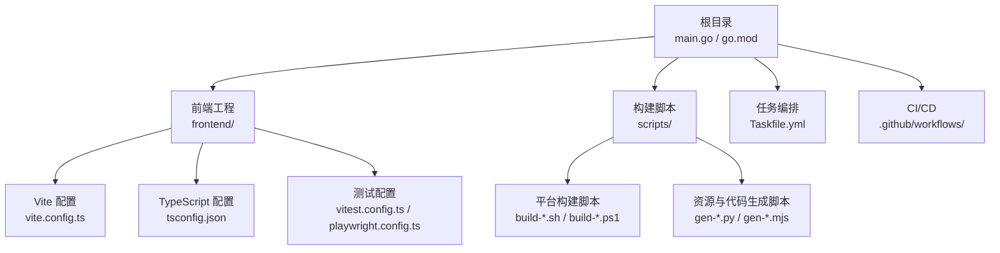
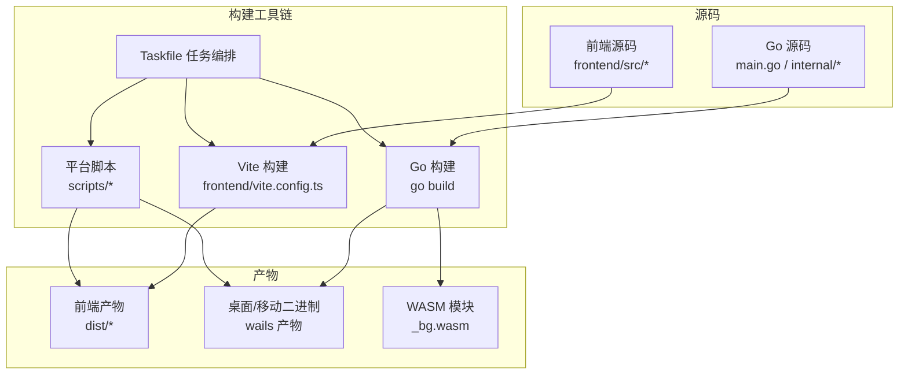
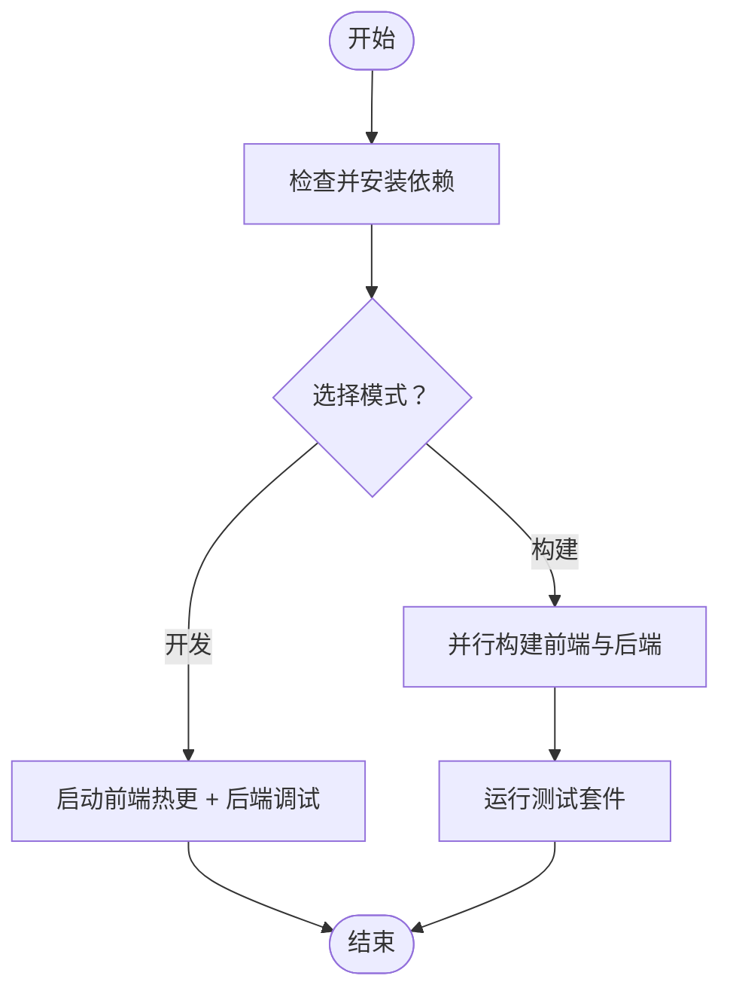
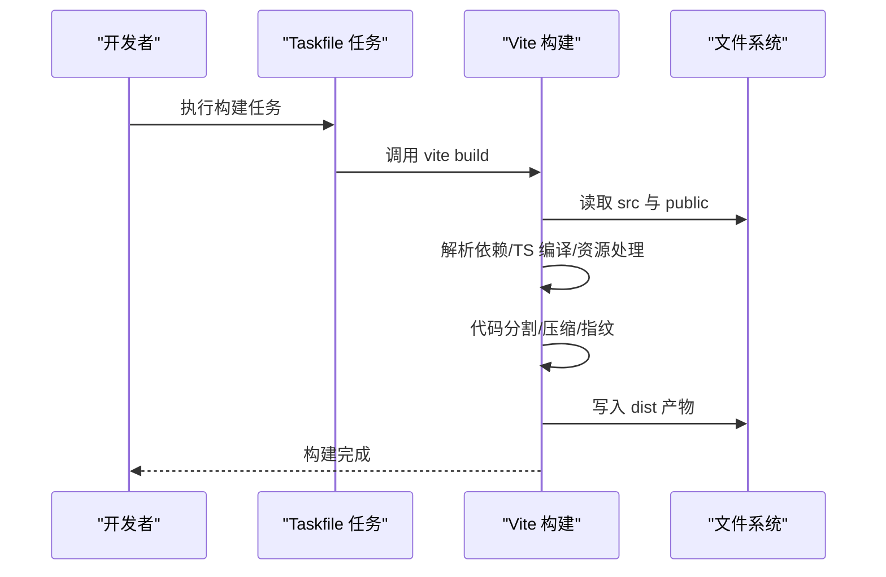
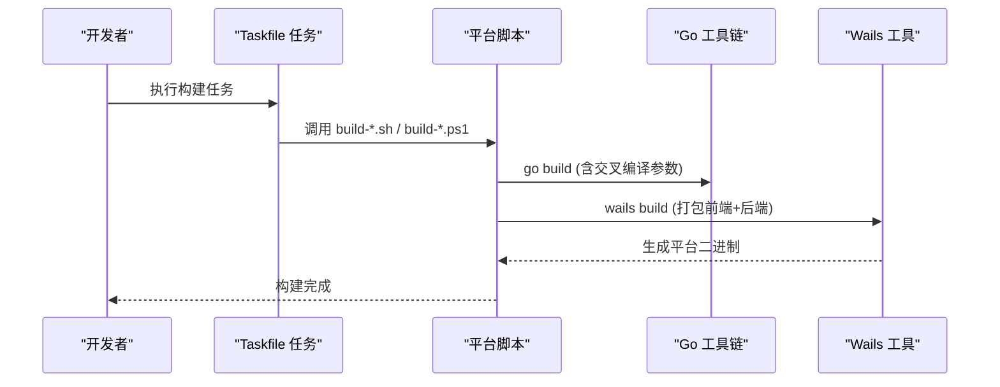
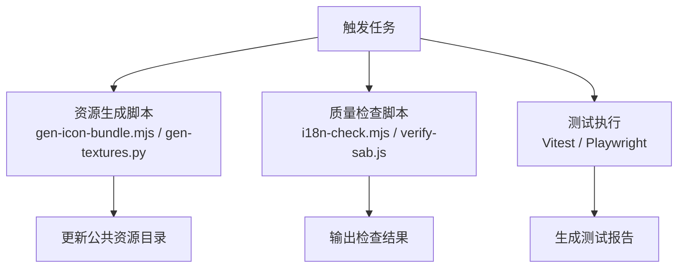
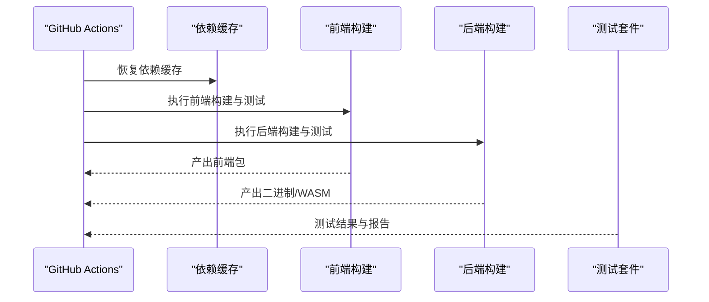
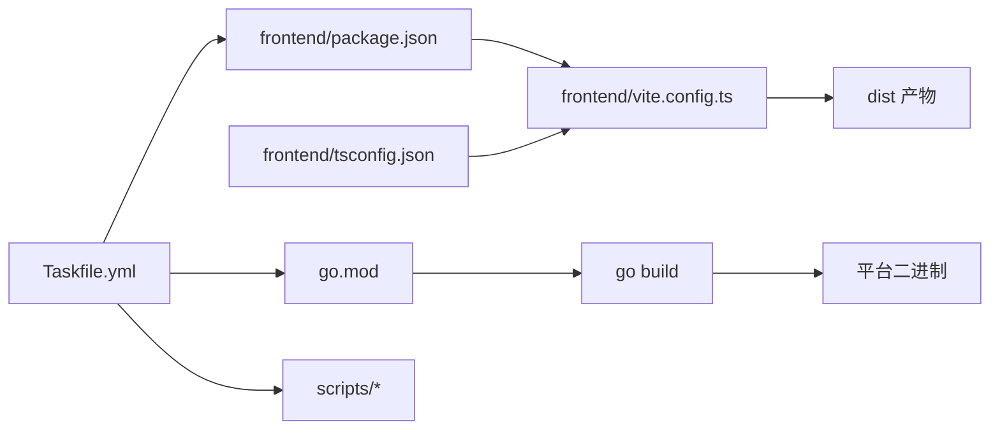

# 构建系统

<cite>
**本文引用的文件**   
- [Taskfile.yml](file://Taskfile.yml)
- [main.go](file://main.go)
- [go.mod](file://go.mod)
- [frontend/package.json](file://frontend/package.json)
- [frontend/vite.config.ts](file://frontend/vite.config.ts)
- [frontend/tsconfig.json](file://frontend/tsconfig.json)
- [frontend/playwright.config.ts](file://frontend/playwright.config.ts)
- [frontend/vitest.config.ts](file://frontend/vitest.config.ts)
- [scripts/build-android.ps1](file://scripts/build-android.ps1)
- [scripts/build-darwin.sh](file://scripts/build-darwin.sh)
- [scripts/build-ios.sh](file://scripts/build-ios.sh)
- [scripts/build-linux.sh](file://scripts/build-linux.sh)
- [scripts/wails/build.ps1](file://scripts/wails/build.ps1)
- [scripts/wails/release.ps1](file://scripts/wails/release.ps1)
- [scripts/gen-icon-bundle.mjs](file://scripts/gen-icon-bundle.mjs)
- [scripts/gen-textures.py](file://scripts/gen-textures.py)
- [scripts/i18n-check.mjs](file://scripts/i18n-check.mjs)
- [scripts/verify-sab.js](file://scripts/verify-sab.js)
- [.github/workflows](file://.github/workflows)
</cite>

## 目录
1. [简介](#简介)
2. [项目结构](#项目结构)
3. [核心组件](#核心组件)
4. [架构总览](#架构总览)
5. [详细组件分析](#详细组件分析)
6. [依赖关系分析](#依赖关系分析)
7. [性能考虑](#性能考虑)
8. [故障排查指南](#故障排查指南)
9. [结论](#结论)
10. [附录](#附录)

## 简介
本文件面向开发者与维护者，系统化说明 MikuMikuAR 的构建体系与自动化流程。内容覆盖：
- Taskfile 任务编排的使用方法与自定义任务创建
- 前端构建流程（Vite 配置、资源打包、代码分割与优化）
- 后端构建过程（Go 编译选项、交叉编译、WASM 模块生成）
- 自动化脚本的作用与用法（代码生成、资源处理、测试执行）
- 构建性能优化技巧（增量构建、缓存策略、并行编译）
- CI/CD 集成要点与注意事项

## 项目结构
仓库采用前后端分离与多平台构建的组织方式：
- 根目录包含 Go 应用入口、跨平台构建脚本、Taskfile 任务编排以及 GitHub Actions 工作流目录
- frontend 子目录为前端工程，使用 Vite + TypeScript + Vitest/Playwright 进行开发与测试
- scripts 目录集中了平台构建、资源生成与质量检查等自动化脚本
- .github/workflows 存放 CI/CD 流水线定义

**图表来源**
- [Taskfile.yml](file://Taskfile.yml)
- [main.go](file://main.go)
- [go.mod](file://go.mod)
- [frontend/vite.config.ts](file://frontend/vite.config.ts)
- [frontend/tsconfig.json](file://frontend/tsconfig.json)
- [frontend/vitest.config.ts](file://frontend/vitest.config.ts)
- [frontend/playwright.config.ts](file://frontend/playwright.config.ts)
- [scripts/build-darwin.sh](file://scripts/build-darwin.sh)
- [scripts/build-linux.sh](file://scripts/build-linux.sh)
- [scripts/build-android.ps1](file://scripts/build-android.ps1)
- [scripts/build-ios.sh](file://scripts/build-ios.sh)
- [scripts/wails/build.ps1](file://scripts/wails/build.ps1)
- [scripts/wails/release.ps1](file://scripts/wails/release.ps1)
- [scripts/gen-icon-bundle.mjs](file://scripts/gen-icon-bundle.mjs)
- [scripts/gen-textures.py](file://scripts/gen-textures.py)
- [scripts/i18n-check.mjs](file://scripts/i18n-check.mjs)
- [scripts/verify-sab.js](file://scripts/verify-sab.js)

**章节来源**
- [Taskfile.yml](file://Taskfile.yml)
- [main.go](file://main.go)
- [go.mod](file://go.mod)
- [frontend/vite.config.ts](file://frontend/vite.config.ts)
- [frontend/tsconfig.json](file://frontend/tsconfig.json)
- [frontend/vitest.config.ts](file://frontend/vitest.config.ts)
- [frontend/playwright.config.ts](file://frontend/playwright.config.ts)
- [scripts/build-darwin.sh](file://scripts/build-darwin.sh)
- [scripts/build-linux.sh](file://scripts/build-linux.sh)
- [scripts/build-android.ps1](file://scripts/build-android.ps1)
- [scripts/build-ios.sh](file://scripts/build-ios.sh)
- [scripts/wails/build.ps1](file://scripts/wails/build.ps1)
- [scripts/wails/release.ps1](file://scripts/wails/release.ps1)
- [scripts/gen-icon-bundle.mjs](file://scripts/gen-icon-bundle.mjs)
- [scripts/gen-textures.py](file://scripts/gen-textures.py)
- [scripts/i18n-check.mjs](file://scripts/i18n-check.mjs)
- [scripts/verify-sab.js](file://scripts/verify-sab.js)

## 核心组件
- 任务编排器：通过 Taskfile 统一组织开发、构建、测试、发布等任务，提供可复用的命令组合与参数化能力
- 前端构建管线：基于 Vite 的本地开发与生产构建，结合 TypeScript 编译、静态资源处理与可选的代码分割
- 后端构建管线：Go 语言编译，支持多目标平台与 WASM 产物；由平台脚本封装具体构建细节
- 自动化脚本：负责图标与纹理等资源生成、国际化校验、SAB 特性验证等辅助任务
- CI/CD：GitHub Actions 用于在云端执行一致的构建与测试流程

**章节来源**
- [Taskfile.yml](file://Taskfile.yml)
- [frontend/vite.config.ts](file://frontend/vite.config.ts)
- [frontend/package.json](file://frontend/package.json)
- [scripts/build-darwin.sh](file://scripts/build-darwin.sh)
- [scripts/build-linux.sh](file://scripts/build-linux.sh)
- [scripts/build-android.ps1](file://scripts/build-android.ps1)
- [scripts/build-ios.sh](file://scripts/build-ios.sh)
- [scripts/wails/build.ps1](file://scripts/wails/build.ps1)
- [scripts/wails/release.ps1](file://scripts/wails/release.ps1)
- [scripts/gen-icon-bundle.mjs](file://scripts/gen-icon-bundle.mjs)
- [scripts/gen-textures.py](file://scripts/gen-textures.py)
- [scripts/i18n-check.mjs](file://scripts/i18n-check.mjs)
- [scripts/verify-sab.js](file://scripts/verify-sab.js)

## 架构总览
下图展示了从源码到产物的端到端构建路径，包括前端与后端的并行构建、资源生成与测试环节。

**图表来源**
- [Taskfile.yml](file://Taskfile.yml)
- [frontend/vite.config.ts](file://frontend/vite.config.ts)
- [main.go](file://main.go)
- [go.mod](file://go.mod)
- [scripts/build-darwin.sh](file://scripts/build-darwin.sh)
- [scripts/build-linux.sh](file://scripts/build-linux.sh)
- [scripts/build-android.ps1](file://scripts/build-android.ps1)
- [scripts/build-ios.sh](file://scripts/build-ios.sh)
- [scripts/wails/build.ps1](file://scripts/wails/build.ps1)
- [scripts/wails/release.ps1](file://scripts/wails/release.ps1)

## 详细组件分析

### Taskfile 任务编排系统
- 作用：将常用操作（安装依赖、开发、构建、测试、发布）抽象为可复用任务，支持参数与环境变量注入
- 典型任务类别：
  - 环境准备：安装前端依赖、初始化 Wails 绑定
  - 开发模式：启动前端热更新与后端服务联动
  - 构建：分别或联合构建前端与后端，输出至指定目录
  - 测试：运行单元测试与端到端测试
  - 发布：打包与签名（平台相关）
- 自定义任务建议：
  - 以“功能域”命名任务（如 build:fe、build:be、test:unit、test:e2e）
  - 对平台差异使用条件与参数（如 --platform、--arch）
  - 将耗时步骤拆分为子任务，便于并行与缓存命中

**图表来源**
- [Taskfile.yml](file://Taskfile.yml)

**章节来源**
- [Taskfile.yml](file://Taskfile.yml)

### 前端构建流程（Vite）
- 入口与配置：
  - 配置文件位于 frontend/vite.config.ts，控制开发服务器、构建输出、插件与优化策略
  - TypeScript 编译由 tsconfig.json 管理
  - 包管理与脚本由 frontend/package.json 定义
- 关键流程：
  - 解析依赖图并编译 TS/JS
  - 资源处理（图片、字体、样式）
  - 按需代码分割与懒加载
  - 生产构建启用压缩、Tree Shaking 与缓存指纹
- 常见任务：
  - 本地开发：启动 Vite 开发服务器，支持热重载
  - 构建产物：生成 dist 目录，供后端嵌入或部署
  - 测试：运行 Vitest 单元/集成测试与 Playwright 端到端测试

**图表来源**
- [frontend/vite.config.ts](file://frontend/vite.config.ts)
- [frontend/tsconfig.json](file://frontend/tsconfig.json)
- [frontend/package.json](file://frontend/package.json)

**章节来源**
- [frontend/vite.config.ts](file://frontend/vite.config.ts)
- [frontend/tsconfig.json](file://frontend/tsconfig.json)
- [frontend/package.json](file://frontend/package.json)

### 后端构建过程（Go + Wails + WASM）
- 入口与模块：
  - 主入口 main.go，模块信息 go.mod
  - Wails 框架用于将 Go 与前端整合为桌面/移动端应用
- 构建要点：
  - 使用 go build 进行编译，可通过环境变量或脚本参数设置 CGO、链接器标志、版本信息等
  - 交叉编译：针对不同 OS/ARCH 生成对应二进制
  - WASM 模块：生成 _bg.wasm 供浏览器/Wails Web 运行时加载
- 平台脚本：
  - Windows/macOS/Linux/iOS/Android 等平台均有专用脚本，封装平台特定的构建与打包流程
  - wails 子目录脚本提供统一的构建与发布入口

**图表来源**
- [main.go](file://main.go)
- [go.mod](file://go.mod)
- [scripts/build-darwin.sh](file://scripts/build-darwin.sh)
- [scripts/build-linux.sh](file://scripts/build-linux.sh)
- [scripts/build-android.ps1](file://scripts/build-android.ps1)
- [scripts/build-ios.sh](file://scripts/build-ios.sh)
- [scripts/wails/build.ps1](file://scripts/wails/build.ps1)
- [scripts/wails/release.ps1](file://scripts/wails/release.ps1)

**章节来源**
- [main.go](file://main.go)
- [go.mod](file://go.mod)
- [scripts/build-darwin.sh](file://scripts/build-darwin.sh)
- [scripts/build-linux.sh](file://scripts/build-linux.sh)
- [scripts/build-android.ps1](file://scripts/build-android.ps1)
- [scripts/build-ios.sh](file://scripts/build-ios.sh)
- [scripts/wails/build.ps1](file://scripts/wails/build.ps1)
- [scripts/wails/release.ps1](file://scripts/wails/release.ps1)

### 自动化脚本（代码生成、资源处理、测试执行）
- 资源生成：
  - 图标与纹理生成脚本用于将源素材转换为应用所需的格式与尺寸
- 质量检查：
  - 国际化键一致性检查、SAB（SharedArrayBuffer）特性验证等
- 测试执行：
  - 前端单元测试与端到端测试通过 Vitest 与 Playwright 执行
  - 可在 Taskfile 中编排为独立任务，便于本地与 CI 一致执行

**图表来源**
- [scripts/gen-icon-bundle.mjs](file://scripts/gen-icon-bundle.mjs)
- [scripts/gen-textures.py](file://scripts/gen-textures.py)
- [scripts/i18n-check.mjs](file://scripts/i18n-check.mjs)
- [scripts/verify-sab.js](file://scripts/verify-sab.js)
- [frontend/vitest.config.ts](file://frontend/vitest.config.ts)
- [frontend/playwright.config.ts](file://frontend/playwright.config.ts)

**章节来源**
- [scripts/gen-icon-bundle.mjs](file://scripts/gen-icon-bundle.mjs)
- [scripts/gen-textures.py](file://scripts/gen-textures.py)
- [scripts/i18n-check.mjs](file://scripts/i18n-check.mjs)
- [scripts/verify-sab.js](file://scripts/verify-sab.js)
- [frontend/vitest.config.ts](file://frontend/vitest.config.ts)
- [frontend/playwright.config.ts](file://frontend/playwright.config.ts)

### CI/CD 集成（GitHub Actions）
- 位置：.github/workflows 目录
- 典型职责：
  - 拉取代码、缓存依赖、安装工具链
  - 并行执行前端与后端构建
  - 运行测试套件并上传结果
  - 打包产物并归档或发布
- 建议：
  - 使用缓存加速 npm/go 依赖下载
  - 利用矩阵策略并行构建多平台
  - 将敏感信息通过 Secrets 注入

**图表来源**
- [.github/workflows](file://.github/workflows)

**章节来源**
- [.github/workflows](file://.github/workflows)

## 依赖关系分析
- 前端依赖：
  - package.json 声明运行时与开发期依赖
  - vite.config.ts 与 tsconfig.json 决定构建行为与类型检查
- 后端依赖：
  - go.mod 声明 Go 模块与依赖版本
  - 平台脚本依赖系统工具链（Go、Wails、iOS/Android SDK 等）
- 任务编排依赖：
  - Taskfile.yml 串联各阶段任务，形成可重复的构建流水线

**图表来源**
- [frontend/package.json](file://frontend/package.json)
- [frontend/vite.config.ts](file://frontend/vite.config.ts)
- [frontend/tsconfig.json](file://frontend/tsconfig.json)
- [go.mod](file://go.mod)
- [Taskfile.yml](file://Taskfile.yml)
- [scripts/build-darwin.sh](file://scripts/build-darwin.sh)
- [scripts/build-linux.sh](file://scripts/build-linux.sh)
- [scripts/build-android.ps1](file://scripts/build-android.ps1)
- [scripts/build-ios.sh](file://scripts/build-ios.sh)

**章节来源**
- [frontend/package.json](file://frontend/package.json)
- [frontend/vite.config.ts](file://frontend/vite.config.ts)
- [frontend/tsconfig.json](file://frontend/tsconfig.json)
- [go.mod](file://go.mod)
- [Taskfile.yml](file://Taskfile.yml)
- [scripts/build-darwin.sh](file://scripts/build-darwin.sh)
- [scripts/build-linux.sh](file://scripts/build-linux.sh)
- [scripts/build-android.ps1](file://scripts/build-android.ps1)
- [scripts/build-ios.sh](file://scripts/build-ios.sh)

## 性能考虑
- 增量构建
  - 前端：利用 Vite 的增量编译与依赖预构建，避免全量重建
  - 后端：合理拆分模块，减少不必要的重新编译范围
- 缓存策略
  - 依赖缓存：npm/go 依赖缓存命中，缩短冷启动时间
  - 构建缓存：缓存中间产物（如 TS 编译输出、WASM 模块）
- 并行编译
  - 在 Taskfile 中并行执行前端与后端构建
  - CI 中使用矩阵策略并行构建多平台
- 代码分割与懒加载
  - 按路由或功能模块拆分 JS 包，降低首屏体积
- 资源优化
  - 图片/字体压缩与格式转换
  - 静态资源指纹与长期缓存策略

[本节为通用指导，不直接分析具体文件]

## 故障排查指南
- 常见问题定位
  - 前端构建失败：检查 vite.config.ts 与 tsconfig.json 配置是否匹配当前 Node/TS 版本
  - 后端交叉编译失败：确认目标平台工具链与 CGO 环境变量是否正确
  - WASM 加载失败：确保 _bg.wasm 已正确生成且路径可访问
  - 资源缺失：确认资源生成脚本已执行且输出目录存在
- 日志与诊断
  - 开启详细日志输出，定位具体失败步骤
  - 在 CI 中保存构建产物与测试报告以便回溯

**章节来源**
- [frontend/vite.config.ts](file://frontend/vite.config.ts)
- [frontend/tsconfig.json](file://frontend/tsconfig.json)
- [scripts/build-darwin.sh](file://scripts/build-darwin.sh)
- [scripts/build-linux.sh](file://scripts/build-linux.sh)
- [scripts/build-android.ps1](file://scripts/build-android.ps1)
- [scripts/build-ios.sh](file://scripts/build-ios.sh)
- [scripts/wails/build.ps1](file://scripts/wails/build.ps1)
- [scripts/wails/release.ps1](file://scripts/wails/release.ps1)

## 结论
本项目通过 Taskfile 统一编排、Vite 高效前端构建、Go/Wails 跨平台后端构建以及完善的自动化脚本与 CI/CD，形成了稳定高效的构建体系。建议在持续迭代中关注增量构建与缓存命中率，逐步完善并行化与产物签名流程，以提升整体交付效率与质量。

[本节为总结性内容，不直接分析具体文件]

## 附录
- 快速上手
  - 安装依赖：执行任务编排中的依赖安装任务
  - 本地开发：启动前端热更新与后端服务
  - 构建产物：分别或联合构建前端与后端
  - 运行测试：执行单元与端到端测试
- 参考文件
  - 任务编排：Taskfile.yml
  - 前端配置：frontend/vite.config.ts、frontend/tsconfig.json、frontend/package.json
  - 后端入口与模块：main.go、go.mod
  - 平台脚本：scripts/build-*.sh / scripts/build-*.ps1
  - 资源与质量脚本：scripts/gen-*.py / scripts/gen-*.mjs / scripts/i18n-check.mjs / scripts/verify-sab.js
  - CI/CD：.github/workflows

**章节来源**
- [Taskfile.yml](file://Taskfile.yml)
- [frontend/vite.config.ts](file://frontend/vite.config.ts)
- [frontend/tsconfig.json](file://frontend/tsconfig.json)
- [frontend/package.json](file://frontend/package.json)
- [main.go](file://main.go)
- [go.mod](file://go.mod)
- [scripts/build-darwin.sh](file://scripts/build-darwin.sh)
- [scripts/build-linux.sh](file://scripts/build-linux.sh)
- [scripts/build-android.ps1](file://scripts/build-android.ps1)
- [scripts/build-ios.sh](file://scripts/build-ios.sh)
- [scripts/wails/build.ps1](file://scripts/wails/build.ps1)
- [scripts/wails/release.ps1](file://scripts/wails/release.ps1)
- [scripts/gen-icon-bundle.mjs](file://scripts/gen-icon-bundle.mjs)
- [scripts/gen-textures.py](file://scripts/gen-textures.py)
- [scripts/i18n-check.mjs](file://scripts/i18n-check.mjs)
- [scripts/verify-sab.js](file://scripts/verify-sab.js)
- [.github/workflows](file://.github/workflows)