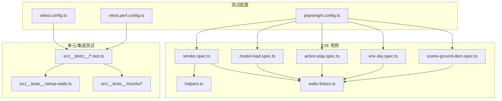
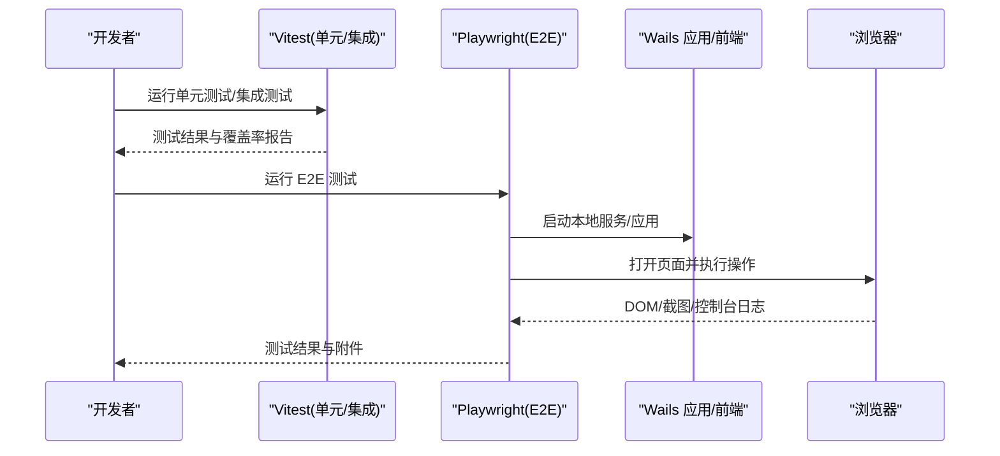
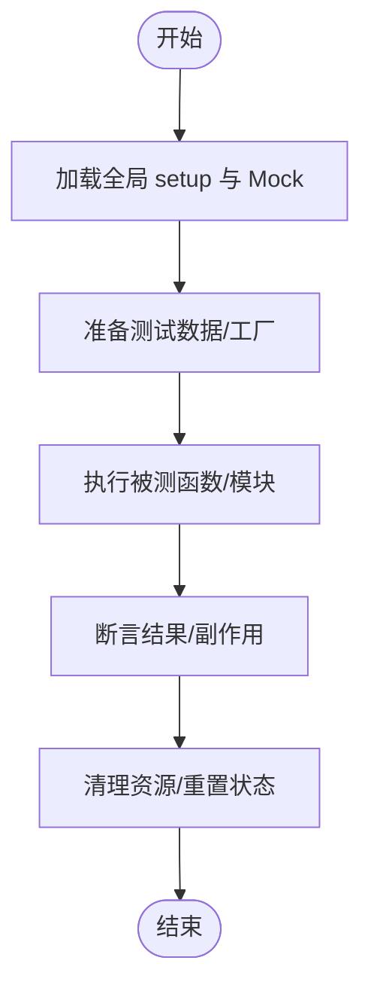
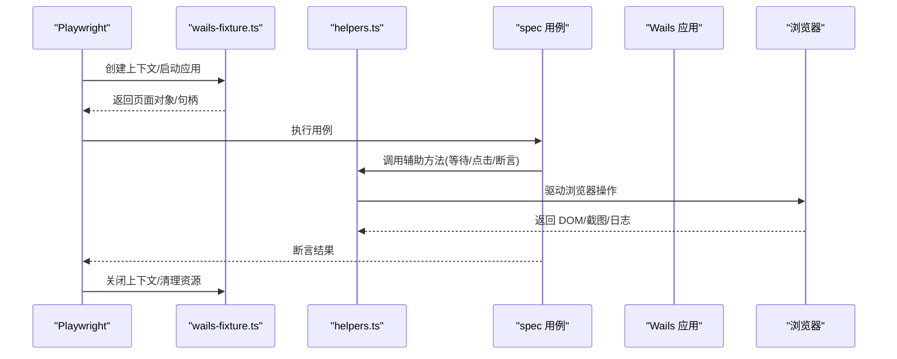
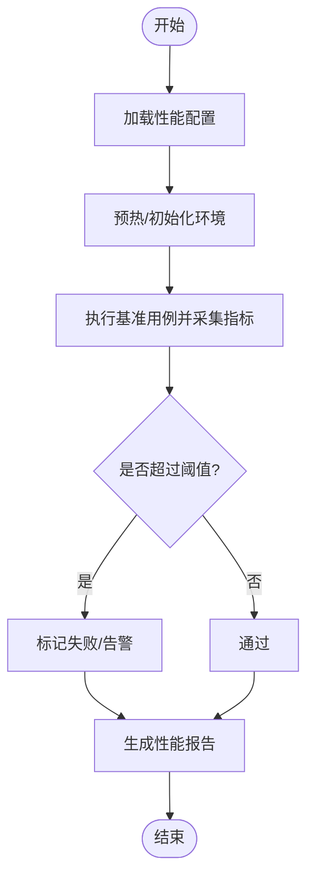
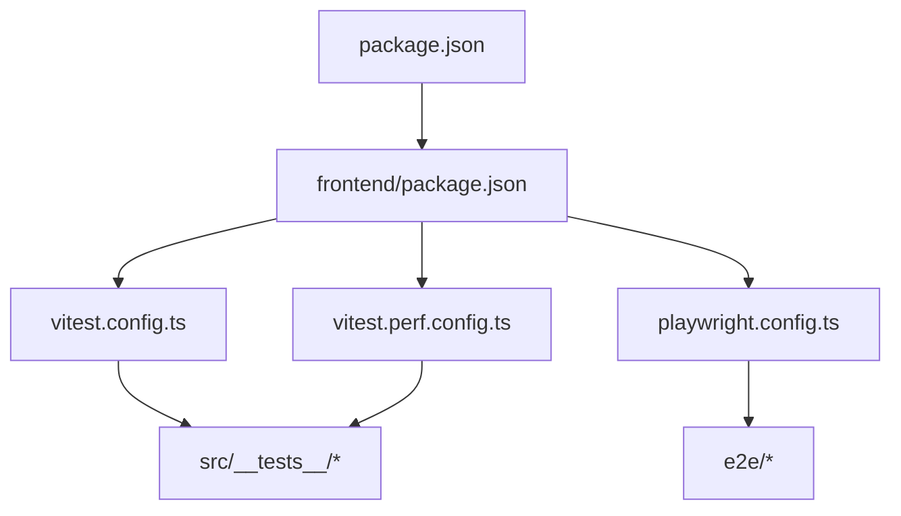

# 测试指南

<cite>
**本文引用的文件**
- [frontend/vitest.config.ts](file://frontend/vitest.config.ts)
- [frontend/vitest.perf.config.ts](file://frontend/vitest.perf.config.ts)
- [frontend/playwright.config.ts](file://frontend/playwright.config.ts)
- [frontend/e2e/wails-fixture.ts](file://frontend/e2e/wails-fixture.ts)
- [frontend/e2e/helpers.ts](file://frontend/e2e/helpers.ts)
- [frontend/e2e/smoke.spec.ts](file://frontend/e2e/smoke.spec.ts)
- [frontend/e2e/action-play.spec.ts](file://frontend/e2e/action-play.spec.ts)
- [frontend/e2e/model-load.spec.ts](file://frontend/e2e/model-load.spec.ts)
- [frontend/e2e/env-sky.spec.ts](file://frontend/e2e/env-sky.spec.ts)
- [frontend/e2e/scene-ground-dom.spec.ts](file://frontend/e2e/scene-ground-dom.spec.ts)
- [frontend/src/__tests__/setup-wails.ts](file://frontend/src/__tests__/setup-wails.ts)
- [frontend/src/__tests__/mocks/babylon.ts](file://frontend/src/__tests__/mocks/babylon.ts)
- [frontend/src/__tests__/mocks/engine-mock.ts](file://frontend/src/__tests__/mocks/engine-mock.ts)
- [frontend/src/__tests__/mocks/factories.ts](file://frontend/src/__tests__/mocks/factories.ts)
- [frontend/src/__tests__/env-state.test.ts](file://frontend/src/__tests__/env-state.test.ts)
- [frontend/src/__tests__/vmd-evaluator.test.ts](file://frontend/src/__tests__/vmd-evaluator.test.ts)
- [frontend/src/__tests__/wasm-layers-blender.test.ts](file://frontend/src/__tests__/wasm-layers-blender.test.ts)
- [frontend/src/__tests__/wasm-layers-blender.perf.test.ts](file://frontend/src/__tests__/wasm-layers-blender.perf.test.ts)
- [frontend/package.json](file://frontend/package.json)
- [package.json](file://package.json)
</cite>

## 目录
1. [简介](#简介)
2. [项目结构](#项目结构)
3. [核心组件](#核心组件)
4. [架构总览](#架构总览)
5. [详细组件分析](#详细组件分析)
6. [依赖分析](#依赖分析)
7. [性能考虑](#性能考虑)
8. [故障排查指南](#故障排查指南)
9. [结论](#结论)
10. [附录](#附录)

## 简介
本指南面向前端与全栈开发者，系统化说明 MikuMikuAR 前端的分层测试策略与落地实践。内容覆盖：
- 单元测试（Vitest）：纯函数、模块边界、WASM 层逻辑
- 集成测试：浏览器环境下的子系统协作（场景、渲染、动作回放等）
- 端到端测试（Playwright）：基于 Wails 的桌面应用 UI 与交互验证
- 测试数据与 Mock：模拟外部依赖、生成随机数据、基线快照
- 性能与基准测试：关键路径的性能回归与稳定性保障
- 覆盖率统计与质量门禁：阈值、报告输出、CI 集成建议
- 最佳实践与常见问题：可维护性与可复现性提升

## 项目结构
前端测试相关的关键位置与职责：
- frontend/vitest.config.ts：Vitest 配置（测试环境、解析、覆盖率、全局 setup 等）
- frontend/vitest.perf.config.ts：性能测试专用配置（隔离运行、超时与采样设置）
- frontend/playwright.config.ts：Playwright E2E 配置（浏览器、端口、截图/视频、并行度）
- frontend/e2e/*：E2E 用例集（smoke、模型加载、动作播放、环境面板等）
- frontend/e2e/wails-fixture.ts：Wails 应用启动夹具（本地服务、窗口、资源注入）
- frontend/e2e/helpers.ts：E2E 辅助方法（等待、选择器、断言封装）
- frontend/src/__tests__/*：Vitest 单元测试与集成测试
- frontend/src/__tests__/mocks/*：Mock 与工厂（BabylonJS、引擎、绑定等）
- frontend/src/__tests__/setup-wails.ts：在 Node 环境下模拟 Wails 运行时能力

图示来源
- [frontend/vitest.config.ts](file://frontend/vitest.config.ts)
- [frontend/vitest.perf.config.ts](file://frontend/vitest.perf.config.ts)
- [frontend/playwright.config.ts](file://frontend/playwright.config.ts)
- [frontend/e2e/wails-fixture.ts](file://frontend/e2e/wails-fixture.ts)
- [frontend/e2e/helpers.ts](file://frontend/e2e/helpers.ts)
- [frontend/e2e/smoke.spec.ts](file://frontend/e2e/smoke.spec.ts)
- [frontend/e2e/model-load.spec.ts](file://frontend/e2e/model-load.spec.ts)
- [frontend/e2e/action-play.spec.ts](file://frontend/e2e/action-play.spec.ts)
- [frontend/e2e/env-sky.spec.ts](file://frontend/e2e/env-sky.spec.ts)
- [frontend/e2e/scene-ground-dom.spec.ts](file://frontend/e2e/scene-ground-dom.spec.ts)
- [frontend/src/__tests__/setup-wails.ts](file://frontend/src/__tests__/setup-wails.ts)
- [frontend/src/__tests__/mocks/babylon.ts](file://frontend/src/__tests__/mocks/babylon.ts)
- [frontend/src/__tests__/mocks/engine-mock.ts](file://frontend/src/__tests__/mocks/engine-mock.ts)
- [frontend/src/__tests__/mocks/factories.ts](file://frontend/src/__tests__/mocks/factories.ts)

章节来源
- [frontend/vitest.config.ts](file://frontend/vitest.config.ts)
- [frontend/vitest.perf.config.ts](file://frontend/vitest.perf.config.ts)
- [frontend/playwright.config.ts](file://frontend/playwright.config.ts)
- [frontend/e2e/wails-fixture.ts](file://frontend/e2e/wails-fixture.ts)
- [frontend/e2e/helpers.ts](file://frontend/e2e/helpers.ts)
- [frontend/src/__tests__/setup-wails.ts](file://frontend/src/__tests__/setup-wails.ts)
- [frontend/src/__tests__/mocks/babylon.ts](file://frontend/src/__tests__/mocks/babylon.ts)
- [frontend/src/__tests__/mocks/engine-mock.ts](file://frontend/src/__tests__/mocks/engine-mock.ts)
- [frontend/src/__tests__/mocks/factories.ts](file://frontend/src/__tests__/mocks/factories.ts)

## 核心组件
- Vitest 配置与执行
  - 通过配置文件定义测试环境、解析别名、覆盖率开关与收集规则；支持多入口与分组运行。
  - 性能测试使用独立配置，避免干扰常规测试，便于单独采集指标。
- Playwright E2E
  - 以本地构建产物为被测对象，启动 Wails 应用或开发服务器，驱动真实浏览器进行 UI 与交互验证。
  - 提供 fixtures 与 helpers 统一启动、清理、断言与截图/视频录制。
- 测试数据与 Mock
  - 针对 BabylonJS、WASM 绑定、文件系统、网络请求等进行集中 Mock，确保单测稳定与快速。
  - 使用工厂方法生成一致且可控的测试数据，减少硬编码与耦合。
- 覆盖率与门禁
  - 通过覆盖率工具输出 HTML/JSON 报告，结合脚本或 CI 任务实现阈值门禁。

章节来源
- [frontend/vitest.config.ts](file://frontend/vitest.config.ts)
- [frontend/vitest.perf.config.ts](file://frontend/vitest.perf.config.ts)
- [frontend/playwright.config.ts](file://frontend/playwright.config.ts)
- [frontend/src/__tests__/mocks/babylon.ts](file://frontend/src/__tests__/mocks/babylon.ts)
- [frontend/src/__tests__/mocks/engine-mock.ts](file://frontend/src/__tests__/mocks/engine-mock.ts)
- [frontend/src/__tests__/mocks/factories.ts](file://frontend/src/__tests__/mocks/factories.ts)

## 架构总览
分层测试策略与数据流如下：
- 单元测试：在 Node 环境中运行，依赖 Mock 与工厂，聚焦业务逻辑与算法正确性。
- 集成测试：在浏览器环境中运行，验证模块间协作（如场景、渲染管线、动作回放）。
- 端到端测试：在真实浏览器中运行，验证用户流程与 UI 行为，必要时录制截图/视频用于回归对比。

图示来源
- [frontend/vitest.config.ts](file://frontend/vitest.config.ts)
- [frontend/vitest.perf.config.ts](file://frontend/vitest.perf.config.ts)
- [frontend/playwright.config.ts](file://frontend/playwright.config.ts)
- [frontend/e2e/wails-fixture.ts](file://frontend/e2e/wails-fixture.ts)
- [frontend/e2e/helpers.ts](file://frontend/e2e/helpers.ts)

## 详细组件分析

### 单元测试（Vitest）
- 目标与范围
  - 验证纯函数、状态机、算法与 WASM 层接口契约。
  - 典型用例包括：VMD 评估、骨骼物理层、环境状态、UI 辅助函数等。
- 环境与初始化
  - 通过全局 setup 文件注入 Wails 运行时能力，避免在 Node 环境报错。
  - 使用集中 Mock 替换 BabylonJS、引擎实例与绑定层，保证测试可重复与快速。
- 数据与工厂
  - 使用工厂方法生成一致的测试数据，避免散落的硬编码。
  - 对复杂对象采用最小必要字段，降低维护成本。
- 断言与组织
  - 按功能域组织测试文件，命名清晰表达意图。
  - 使用异步断言与重试策略处理时序敏感逻辑。

章节来源
- [frontend/src/__tests__/setup-wails.ts](file://frontend/src/__tests__/setup-wails.ts)
- [frontend/src/__tests__/mocks/babylon.ts](file://frontend/src/__tests__/mocks/babylon.ts)
- [frontend/src/__tests__/mocks/engine-mock.ts](file://frontend/src/__tests__/mocks/engine-mock.ts)
- [frontend/src/__tests__/mocks/factories.ts](file://frontend/src/__tests__/mocks/factories.ts)
- [frontend/src/__tests__/env-state.test.ts](file://frontend/src/__tests__/env-state.test.ts)
- [frontend/src/__tests__/vmd-evaluator.test.ts](file://frontend/src/__tests__/vmd-evaluator.test.ts)
- [frontend/src/__tests__/wasm-layers-blender.test.ts](file://frontend/src/__tests__/wasm-layers-blender.test.ts)

### 端到端测试（Playwright）
- 目标与范围
  - 验证从启动到关键用户流程的完整链路：模型加载、动作播放、环境面板、场景地面等。
  - 捕获截图/视频作为回归证据，辅助定位 UI 差异与交互问题。
- 夹具与辅助
  - wails-fixture.ts 负责启动本地服务/应用、注入资源、管理生命周期。
  - helpers.ts 封装常用等待、选择器与断言，提高用例可读性与稳定性。
- 用例组织
  - smoke.spec.ts 作为冒烟测试，快速验证主流程可用。
  - 其他 spec 文件按功能域拆分，便于并行执行与失败定位。

图示来源
- [frontend/e2e/wails-fixture.ts](file://frontend/e2e/wails-fixture.ts)
- [frontend/e2e/helpers.ts](file://frontend/e2e/helpers.ts)
- [frontend/e2e/smoke.spec.ts](file://frontend/e2e/smoke.spec.ts)
- [frontend/e2e/model-load.spec.ts](file://frontend/e2e/model-load.spec.ts)
- [frontend/e2e/action-play.spec.ts](file://frontend/e2e/action-play.spec.ts)
- [frontend/e2e/env-sky.spec.ts](file://frontend/e2e/env-sky.spec.ts)
- [frontend/e2e/scene-ground-dom.spec.ts](file://frontend/e2e/scene-ground-dom.spec.ts)

章节来源
- [frontend/e2e/wails-fixture.ts](file://frontend/e2e/wails-fixture.ts)
- [frontend/e2e/helpers.ts](file://frontend/e2e/helpers.ts)
- [frontend/e2e/smoke.spec.ts](file://frontend/e2e/smoke.spec.ts)
- [frontend/e2e/model-load.spec.ts](file://frontend/e2e/model-load.spec.ts)
- [frontend/e2e/action-play.spec.ts](file://frontend/e2e/action-play.spec.ts)
- [frontend/e2e/env-sky.spec.ts](file://frontend/e2e/env-sky.spec.ts)
- [frontend/e2e/scene-ground-dom.spec.ts](file://frontend/e2e/scene-ground-dom.spec.ts)

### 性能与基准测试（Vitest Performance）
- 目标与范围
  - 针对关键路径（如 WASM 层、骨骼物理、动作回放）建立性能回归基线。
  - 通过独立配置隔离运行，避免与其他测试相互影响。
- 设计与执行
  - 使用 vitest.perf.config.ts 指定性能用例收集与运行参数。
  - 在 perf 用例中记录耗时、内存占用或帧率等指标，并与历史基线对比。
- 持续改进
  - 将性能用例纳入 CI，出现退化时阻断合并或发出告警。
  - 定期复盘热点路径，优化算法与数据结构。

章节来源
- [frontend/vitest.perf.config.ts](file://frontend/vitest.perf.config.ts)
- [frontend/src/__tests__/wasm-layers-blender.perf.test.ts](file://frontend/src/__tests__/wasm-layers-blender.perf.test.ts)

### 测试数据管理与 Mock 策略
- 模拟服务与外部依赖
  - 使用集中 Mock 替代 BabylonJS、引擎实例与绑定层，确保单测不依赖真实 GPU/系统 API。
  - 对文件系统、网络请求、WASM 模块进行可控替换，提升稳定性与速度。
- 测试数据库与静态资源
  - 对于需要持久化数据的场景，优先使用内存态或临时目录，避免污染真实环境。
  - 将大体积资源放入公共目录并通过相对路径引用，减少下载开销。
- 随机数据生成
  - 使用工厂方法生成结构化数据，保证一致性同时具备一定随机性。
  - 对边界条件与异常输入进行专门构造，覆盖更多分支。

章节来源
- [frontend/src/__tests__/mocks/babylon.ts](file://frontend/src/__tests__/mocks/babylon.ts)
- [frontend/src/__tests__/mocks/engine-mock.ts](file://frontend/src/__tests__/mocks/engine-mock.ts)
- [frontend/src/__tests__/mocks/factories.ts](file://frontend/src/__tests__/mocks/factories.ts)

## 依赖分析
- 测试框架与脚本
  - package.json 与 frontend/package.json 定义了测试命令与依赖版本，便于统一入口与跨平台执行。
- 配置与用例关系
  - Vitest 与 Playwright 的配置分别控制不同层次的测试行为，二者互补而非竞争。
  - 性能测试通过独立配置与用例文件与常规测试解耦。

图示来源
- [package.json](file://package.json)
- [frontend/package.json](file://frontend/package.json)
- [frontend/vitest.config.ts](file://frontend/vitest.config.ts)
- [frontend/vitest.perf.config.ts](file://frontend/vitest.perf.config.ts)
- [frontend/playwright.config.ts](file://frontend/playwright.config.ts)

章节来源
- [package.json](file://package.json)
- [frontend/package.json](file://frontend/package.json)

## 性能考虑
- 测试隔离与并行
  - 使用独立配置与用例集合隔离性能测试，避免与常规测试共享状态。
  - 合理设置并行度，平衡速度与资源占用。
- 指标采集与基线
  - 在关键路径增加计时点，记录平均耗时、方差与极端值。
  - 建立基线并在 CI 中进行比较，防止回归。
- 资源与 I/O
  - 预加载必要资源，减少测试中的网络与磁盘 I/O。
  - 使用内存态数据与轻量级资源，缩短冷启动时间。

[本节为通用指导，无需特定文件来源]

## 故障排查指南
- 常见错误与定位
  - 启动失败：检查 Wails 应用或本地服务是否正确启动，确认端口未被占用。
  - 资源缺失：确认 public 目录与资源路径配置正确，避免 404。
  - 浏览器差异：在不同浏览器下复现，必要时启用调试模式与截图/视频。
- 日志与断点
  - 在 E2E 中开启控制台日志与页面截图，结合用例步骤定位问题。
  - 在单测中使用断言失败堆栈与日志输出，缩小问题范围。
- 稳定性与重试
  - 对时序敏感的用例增加等待与重试策略，减少偶发失败。
  - 对不稳定依赖进行 Mock，避免外部因素干扰。

章节来源
- [frontend/e2e/helpers.ts](file://frontend/e2e/helpers.ts)
- [frontend/e2e/wails-fixture.ts](file://frontend/e2e/wails-fixture.ts)

## 结论
通过分层测试策略与完善的 Mock/数据管理，本项目能够在保证质量的同时维持较高的迭代效率。建议持续完善性能基线与覆盖率门禁，并将关键用例纳入 CI，形成稳定的质量保障闭环。

[本节为总结性内容，无需特定文件来源]

## 附录
- 常用命令
  - 运行单元测试/集成测试：参考 frontend/package.json 中的脚本定义。
  - 运行性能测试：使用性能配置入口执行对应脚本。
  - 运行 E2E 测试：参考 playwright 配置与 e2e 脚本。
- 覆盖率与门禁建议
  - 输出 HTML/JSON 报告，设置最低覆盖率阈值。
  - 在 CI 中集成覆盖率门禁，失败则阻断合并。
- 最佳实践
  - 用例命名清晰表达意图，按功能域组织文件。
  - 使用工厂与 Mock 保持数据一致与环境隔离。
  - 对时序敏感逻辑增加等待与重试，提升稳定性。

[本节为补充信息，无需特定文件来源]