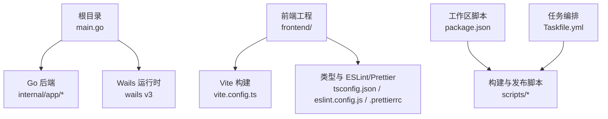
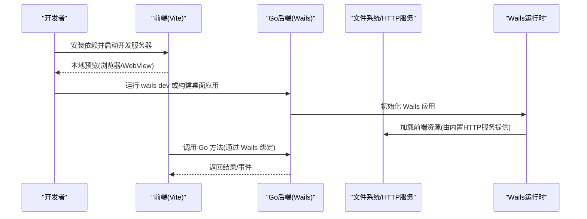
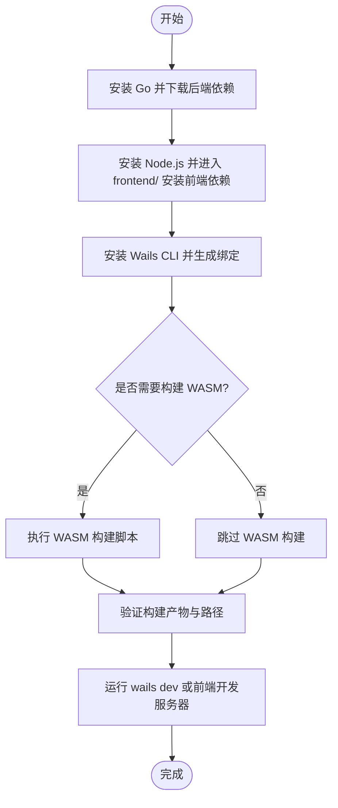
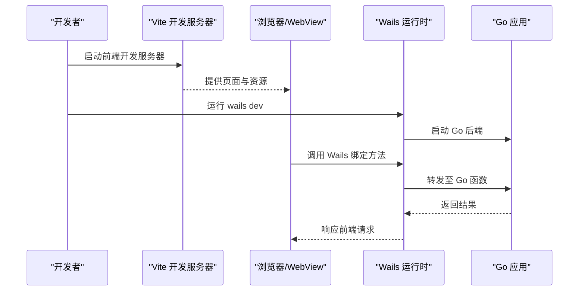
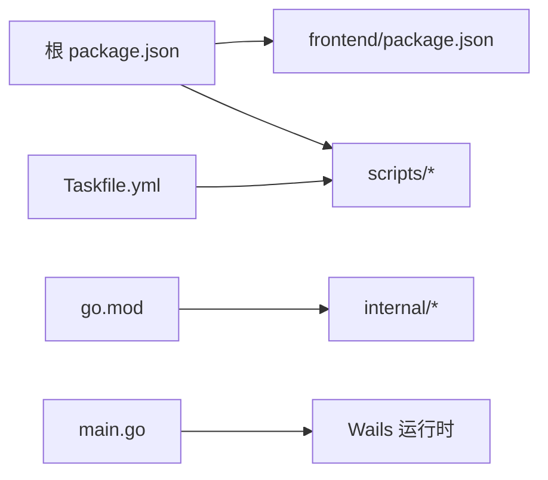

# 环境搭建

<cite>
**本文引用的文件**   
- [README.md](file://README.md)
- [go.mod](file://go.mod)
- [main.go](file://main.go)
- [package.json](file://package.json)
- [frontend/package.json](file://frontend/package.json)
- [Taskfile.yml](file://Taskfile.yml)
- [scripts/build-linux.sh](file://scripts/build-linux.sh)
- [scripts/build-darwin.sh](file://scripts/build-darwin.sh)
- [scripts/build-android.ps1](file://scripts/build-android.ps1)
- [scripts/wails/release.ps1](file://scripts/wails/release.ps1)
- [internal/app/httpserver.go](file://internal/app/httpserver.go)
- [frontend/src/core/init.ts](file://frontend/src/core/init.ts)
- [frontend/src/core/runtime-mode.ts](file://frontend/src/core/runtime-mode.ts)
- [frontend/vite.config.ts](file://frontend/vite.config.ts)
- [frontend/tsconfig.json](file://frontend/tsconfig.json)
- [frontend/eslint.config.js](file://frontend/eslint.config.js)
- [frontend/.prettierrc](file://frontend/.prettierrc)
- [frontend/playwright.config.ts](file://frontend/playwright.config.ts)
</cite>

## 目录
1. [简介](#简介)
2. [项目结构](#项目结构)
3. [核心组件](#核心组件)
4. [架构总览](#架构总览)
5. [详细组件分析](#详细组件分析)
6. [依赖关系分析](#依赖关系分析)
7. [性能注意事项](#性能注意事项)
8. [故障排查指南](#故障排查指南)
9. [结论](#结论)
10. [附录](#附录)

## 简介
本指南面向首次接触 MikuMikuAR 的开发者，提供从零到一的环境搭建与本地开发配置说明。内容覆盖：
- Go、Node.js、npm/yarn、Wails v3 的安装与验证
- IDE（VS Code、GoLand）推荐设置与调试配置
- 前端、后端与 WASM 模块的依赖初始化流程
- Windows、macOS、Linux 跨平台开发要点
- 常见问题定位与解决方案

## 项目结构
仓库采用前后端分离 + Wails v3 桥接的混合架构：
- 前端位于 frontend/，使用 Vite 构建，TypeScript 编写，包含 E2E 测试与静态资源
- 后端位于 internal/ 与根目录 main.go，基于 Go 语言，通过 Wails 暴露给前端调用
- 脚本位于 scripts/，提供多平台构建与发布辅助
- 顶层 package.json 用于统一工作区脚本，Taskfile.yml 提供任务编排

图表来源
- [main.go:1-200](file://main.go#L1-L200)
- [frontend/vite.config.ts:1-200](file://frontend/vite.config.ts#L1-L200)
- [frontend/tsconfig.json:1-200](file://frontend/tsconfig.json#L1-L200)
- [frontend/eslint.config.js:1-200](file://frontend/eslint.config.js#L1-L200)
- [frontend/.prettierrc:1-200](file://frontend/.prettierrc#L1-L200)
- [Taskfile.yml:1-200](file://Taskfile.yml#L1-L200)
- [scripts/build-linux.sh:1-200](file://scripts/build-linux.sh#L1-L200)
- [scripts/build-darwin.sh:1-200](file://scripts/build-darwin.sh#L1-L200)
- [scripts/build-android.ps1:1-200](file://scripts/build-android.ps1#L1-L200)
- [scripts/wails/release.ps1:1-200](file://scripts/wails/release.ps1#L1-L200)

章节来源
- [README.md:1-200](file://README.md#L1-L200)
- [package.json:1-200](file://package.json#L1-L200)
- [Taskfile.yml:1-200](file://Taskfile.yml#L1-L200)

## 核心组件
- Go 后端入口与 Wails 绑定：根目录 main.go 负责应用启动与 Wails 绑定注册；internal/app 下包含 HTTP 服务、路径管理、库与场景等能力
- 前端工程：frontend/ 使用 Vite 构建，TypeScript 源文件位于 src/，包含 UI、场景、物理、动作、菜单、国际化等模块
- 构建与发布：scripts/ 提供 Linux/macOS/Android 构建脚本，wails/release.ps1 提供发布流程
- 任务编排：Taskfile.yml 定义常用任务（如构建、打包、测试），配合 package.json 的工作区脚本统一入口

章节来源
- [main.go:1-200](file://main.go#L1-L200)
- [internal/app/httpserver.go:1-200](file://internal/app/httpserver.go#L1-L200)
- [frontend/src/core/init.ts:1-200](file://frontend/src/core/init.ts#L1-L200)
- [frontend/src/core/runtime-mode.ts:1-200](file://frontend/src/core/runtime-mode.ts#L1-L200)
- [frontend/vite.config.ts:1-200](file://frontend/vite.config.ts#L1-L200)
- [Taskfile.yml:1-200](file://Taskfile.yml#L1-L200)
- [scripts/build-linux.sh:1-200](file://scripts/build-linux.sh#L1-L200)
- [scripts/build-darwin.sh:1-200](file://scripts/build-darwin.sh#L1-L200)
- [scripts/build-android.ps1:1-200](file://scripts/build-android.ps1#L1-L200)
- [scripts/wails/release.ps1:1-200](file://scripts/wails/release.ps1#L1-L200)

## 架构总览
下图展示开发时前后端交互与构建链路：

图表来源
- [main.go:1-200](file://main.go#L1-L200)
- [internal/app/httpserver.go:1-200](file://internal/app/httpserver.go#L1-L200)
- [frontend/src/core/init.ts:1-200](file://frontend/src/core/init.ts#L1-L200)
- [frontend/src/core/runtime-mode.ts:1-200](file://frontend/src/core/runtime-mode.ts#L1-L200)

## 详细组件分析

### 开发环境与工具链安装
- Go 语言环境
  - 安装 Go 并加入 PATH，确保 go 命令可用
  - 在仓库根目录执行依赖下载与校验
- Node.js 与包管理器
  - 安装 Node.js（建议 LTS），推荐使用 npm 或 yarn
  - 在仓库根目录与 frontend/ 分别安装依赖
- Wails v3 框架
  - 安装 wails CLI，并在仓库根目录初始化/生成绑定
  - 使用 wails dev 进行热重载开发，或使用 wails build 构建桌面应用

章节来源
- [README.md:1-200](file://README.md#L1-L200)
- [go.mod:1-200](file://go.mod#L1-L200)
- [package.json:1-200](file://package.json#L1-L200)
- [frontend/package.json:1-200](file://frontend/package.json#L1-L200)

### IDE 推荐设置与调试配置
- VS Code
  - 插件推荐：ESLint、Prettier、TypeScript 语言支持、Go、Wails 扩展（如有）
  - 代码格式化：启用保存时格式化，遵循 frontend/.prettierrc 与 eslint.config.js
  - 调试配置：为前端添加 Chrome/Edge 调试器，为 Go 添加 wails dev 或 wails build 的调试任务
- GoLand
  - 配置 Go SDK 与 GOPROXY
  - 创建 Wails 运行配置，指向 wails dev 或 wails build
  - 启用 TypeScript 与 ESLint 集成，保持与 VS Code 一致的规则

章节来源
- [frontend/eslint.config.js:1-200](file://frontend/eslint.config.js#L1-L200)
- [frontend/.prettierrc:1-200](file://frontend/.prettierrc#L1-L200)
- [frontend/tsconfig.json:1-200](file://frontend/tsconfig.json#L1-L200)
- [Taskfile.yml:1-200](file://Taskfile.yml#L1-L200)

### 依赖管理与初始化流程
- 后端依赖（Go）
  - 在仓库根目录执行依赖下载，确保 go.mod/go.sum 一致
- 前端依赖（Node）
  - 在 frontend/ 目录下安装依赖，确保 vite、typescript、eslint、playwright 等工具就绪
- WASM 模块
  - 若项目包含 WASM 构建产物，需按脚本指引生成并放置到 public/lib 或对应输出目录
- 工作区脚本
  - 使用 package.json 的 scripts 统一入口，结合 Taskfile.yml 的任务编排简化日常操作

图表来源
- [package.json:1-200](file://package.json#L1-L200)
- [frontend/package.json:1-200](file://frontend/package.json#L1-L200)
- [Taskfile.yml:1-200](file://Taskfile.yml#L1-L200)
- [scripts/build-linux.sh:1-200](file://scripts/build-linux.sh#L1-L200)
- [scripts/build-darwin.sh:1-200](file://scripts/build-darwin.sh#L1-L200)
- [scripts/build-android.ps1:1-200](file://scripts/build-android.ps1#L1-L200)

章节来源
- [go.mod:1-200](file://go.mod#L1-L200)
- [package.json:1-200](file://package.json#L1-L200)
- [frontend/package.json:1-200](file://frontend/package.json#L1-L200)
- [Taskfile.yml:1-200](file://Taskfile.yml#L1-L200)

### 跨平台开发注意事项
- Windows
  - 使用 PowerShell 执行构建脚本，确保 Go 与 Node.js 已加入 PATH
  - 如需 Android 构建，准备 JDK 与 Android SDK/NDK，并按脚本提示配置环境变量
- macOS
  - 使用 bash/sh 执行构建脚本，确保 Xcode Command Line Tools 已安装
  - 注意签名与沙盒相关权限（如需要）
- Linux
  - 使用 bash/sh 执行构建脚本，确保系统依赖（如图形库、X11/Wayland）已安装
  - 某些发行版可能需要额外安装头文件或动态库

章节来源
- [scripts/build-linux.sh:1-200](file://scripts/build-linux.sh#L1-L200)
- [scripts/build-darwin.sh:1-200](file://scripts/build-darwin.sh#L1-L200)
- [scripts/build-android.ps1:1-200](file://scripts/build-android.ps1#L1-L200)
- [scripts/wails/release.ps1:1-200](file://scripts/wails/release.ps1#L1-L200)

### 开发与调试工作流
- 前端开发
  - 在 frontend/ 下启动 Vite 开发服务器，使用浏览器或 WebView 预览
  - 使用 ESLint 与 Prettier 保证代码质量与风格一致
- 后端开发
  - 使用 wails dev 启动热重载，修改 Go 代码后自动重建
  - 通过 Wails 绑定在前端调用后端方法，实现数据与功能互通
- 端到端测试
  - 使用 Playwright 进行 UI 自动化测试，参考 playwright.config.ts 配置

图表来源
- [frontend/vite.config.ts:1-200](file://frontend/vite.config.ts#L1-L200)
- [frontend/playwright.config.ts:1-200](file://frontend/playwright.config.ts#L1-L200)
- [main.go:1-200](file://main.go#L1-L200)
- [internal/app/httpserver.go:1-200](file://internal/app/httpserver.go#L1-L200)

章节来源
- [frontend/vite.config.ts:1-200](file://frontend/vite.config.ts#L1-L200)
- [frontend/playwright.config.ts:1-200](file://frontend/playwright.config.ts#L1-L200)
- [main.go:1-200](file://main.go#L1-L200)
- [internal/app/httpserver.go:1-200](file://internal/app/httpserver.go#L1-L200)

## 依赖关系分析
- 后端依赖
  - go.mod 定义了 Go 模块与第三方依赖版本，建议使用官方代理加速下载
- 前端依赖
  - frontend/package.json 定义了 Vite、TypeScript、ESLint、Playwright 等依赖
- 工作区脚本
  - package.json 与 Taskfile.yml 提供统一的脚本入口与任务编排，减少重复命令

图表来源
- [package.json:1-200](file://package.json#L1-L200)
- [frontend/package.json:1-200](file://frontend/package.json#L1-L200)
- [Taskfile.yml:1-200](file://Taskfile.yml#L1-L200)
- [go.mod:1-200](file://go.mod#L1-L200)
- [main.go:1-200](file://main.go#L1-L200)

章节来源
- [package.json:1-200](file://package.json#L1-L200)
- [frontend/package.json:1-200](file://frontend/package.json#L1-L200)
- [Taskfile.yml:1-200](file://Taskfile.yml#L1-L200)
- [go.mod:1-200](file://go.mod#L1-L200)

## 性能注意事项
- 前端构建优化
  - 合理配置 Vite 缓存与分包策略，避免不必要的重构建
- 后端并发与内存
  - 控制并发 goroutine 数量，避免在高负载下出现内存抖动
- WASM 模块
  - 按需加载与增量更新，减少首屏体积与加载时间
- 资源管理
  - 对纹理、模型等资源进行压缩与懒加载，降低内存占用

[本节为通用指导，不直接分析具体文件]

## 故障排查指南
- 无法找到 Go 或 Node.js 命令
  - 检查 PATH 环境变量是否正确配置，重启终端或 IDE
- 依赖下载失败或超时
  - 配置 Go 代理与 npm/yarn 镜像源，确保网络可达
- Wails 绑定未生成或前端无法调用后端
  - 确认 wails generate 成功执行，检查绑定文件是否出现在 bindings/ 目录
- 前端资源 404 或跨域错误
  - 检查内置 HTTP 服务配置与资源路径，确保 Vite 输出目录正确
- 构建失败（缺少系统依赖）
  - 根据平台脚本提示安装必要依赖（如图形库、JDK、Android SDK/NDK）

章节来源
- [internal/app/httpserver.go:1-200](file://internal/app/httpserver.go#L1-L200)
- [frontend/src/core/runtime-mode.ts:1-200](file://frontend/src/core/runtime-mode.ts#L1-L200)
- [scripts/build-linux.sh:1-200](file://scripts/build-linux.sh#L1-L200)
- [scripts/build-darwin.sh:1-200](file://scripts/build-darwin.sh#L1-L200)
- [scripts/build-android.ps1:1-200](file://scripts/build-android.ps1#L1-L200)

## 结论
按照本指南完成 Go、Node.js、Wails v3 的安装与配置，并结合 IDE 插件与调试设置，即可快速进入 MikuMikuAR 的开发流程。通过统一的工作区脚本与任务编排，可显著提升跨平台构建效率。遇到问题时，优先检查依赖安装、PATH 配置与构建脚本输出日志。

[本节为总结性内容，不直接分析具体文件]

## 附录
- 常用命令速查
  - 安装后端依赖：在根目录执行 go mod download
  - 安装前端依赖：在 frontend/ 目录执行 npm install 或 yarn
  - 启动开发：wails dev 或前端开发服务器
  - 构建桌面应用：wails build
  - 构建 Android：执行 scripts/build-android.ps1（Windows）
- 参考文档
  - README.md 提供项目概览与使用说明
  - docs/ 下包含架构与设计决策文档，便于深入理解

章节来源
- [README.md:1-200](file://README.md#L1-L200)
- [Taskfile.yml:1-200](file://Taskfile.yml#L1-L200)
- [scripts/build-android.ps1:1-200](file://scripts/build-android.ps1#L1-L200)