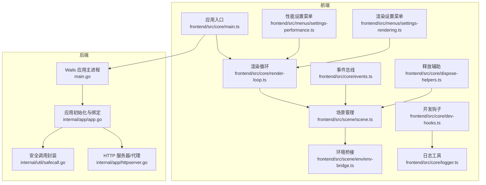
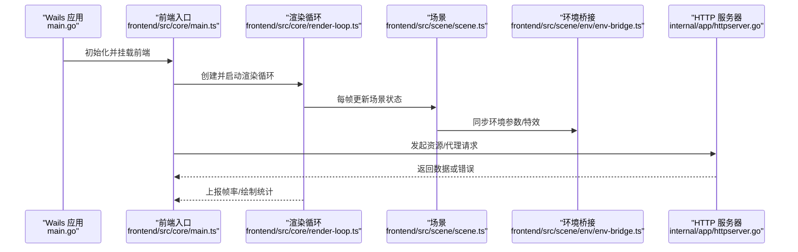
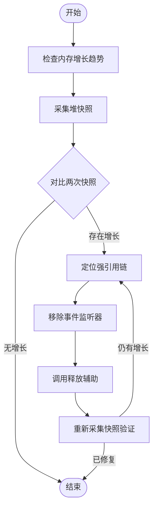
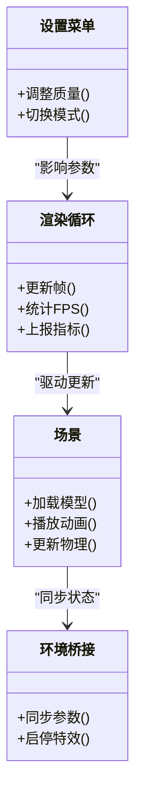
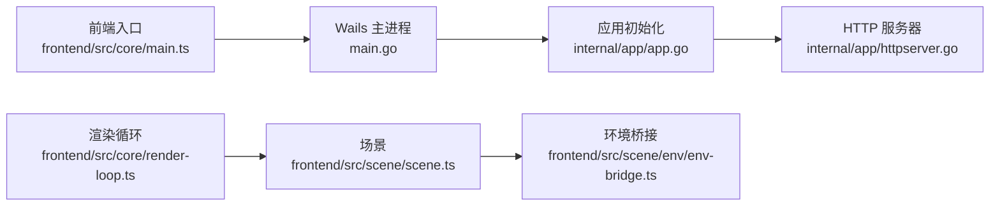

# 调试与性能分析

<cite>
**本文引用的文件**   
- [main.go](file://main.go)
- [frontend/src/core/main.ts](file://frontend/src/core/main.ts)
- [frontend/src/core/render-loop.ts](file://frontend/src/core/render-loop.ts)
- [frontend/src/core/dev-hooks.ts](file://frontend/src/core/dev-hooks.ts)
- [frontend/src/core/logger.ts](file://frontend/src/core/logger.ts)
- [frontend/src/core/events.ts](file://frontend/src/core/events.ts)
- [frontend/src/core/dispose-helpers.ts](file://frontend/src/core/dispose-helpers.ts)
- [frontend/src/scene/scene.ts](file://frontend/src/scene/scene.ts)
- [frontend/src/scene/env/env-bridge.ts](file://frontend/src/scene/env/env-bridge.ts)
- [frontend/src/menus/settings-performance.ts](file://frontend/src/menus/settings-performance.ts)
- [frontend/src/menus/settings-rendering.ts](file://frontend/src/menus/settings-rendering.ts)
- [internal/app/httpserver.go](file://internal/app/httpserver.go)
- [internal/app/app.go](file://internal/app/app.go)
- [internal/util/safecall.go](file://internal/util/safecall.go)
- [frontend/vitest.perf.config.ts](file://frontend/vitest.perf.config.ts)
- [frontend/e2e/helpers.ts](file://frontend/e2e/helpers.ts)
</cite>

## 目录
1. [简介](#简介)
2. [项目结构](#项目结构)
3. [核心组件](#核心组件)
4. [架构总览](#架构总览)
5. [详细组件分析](#详细组件分析)
6. [依赖分析](#依赖分析)
7. [性能考虑](#性能考虑)
8. [故障排查指南](#故障排查指南)
9. [结论](#结论)
10. [附录](#附录)

## 简介
本指南面向 MikuMikuAR 的前后端开发者，提供系统化的调试与性能分析方法。内容覆盖：
- 前端调试技巧：浏览器开发者工具、Babylon.js 调试器、React DevTools（如使用）集成
- 后端调试方法：Go 调试器、日志分析、性能剖析
- 内存泄漏检测与解决：对象生命周期管理、事件监听器清理
- 性能分析方法：渲染性能分析、CPU 使用率监控、网络请求优化
- 常见瓶颈定位与解决方案
- 调试工具与技巧的最佳实践

## 项目结构
本项目采用前后端分离的 Wails v3 架构：
- 前端：TypeScript + Babylon.js 渲染管线，包含场景、环境、动作、UI 等模块
- 后端：Go 服务，负责文件系统、HTTP 代理、资源访问、平台适配等
- 测试：Vitest 单元测试与性能基准，Playwright E2E 用例

**图表来源** 
- [frontend/src/core/main.ts](file://frontend/src/core/main.ts)
- [frontend/src/core/render-loop.ts](file://frontend/src/core/render-loop.ts)
- [frontend/src/scene/scene.ts](file://frontend/src/scene/scene.ts)
- [frontend/src/scene/env/env-bridge.ts](file://frontend/src/scene/env/env-bridge.ts)
- [frontend/src/menus/settings-performance.ts](file://frontend/src/menus/settings-performance.ts)
- [frontend/src/menus/settings-rendering.ts](file://frontend/src/menus/settings-rendering.ts)
- [frontend/src/core/dev-hooks.ts](file://frontend/src/core/dev-hooks.ts)
- [frontend/src/core/logger.ts](file://frontend/src/core/logger.ts)
- [frontend/src/core/events.ts](file://frontend/src/core/events.ts)
- [frontend/src/core/dispose-helpers.ts](file://frontend/src/core/dispose-helpers.ts)
- [main.go](file://main.go)
- [internal/app/app.go](file://internal/app/app.go)
- [internal/app/httpserver.go](file://internal/app/httpserver.go)
- [internal/util/safecall.go](file://internal/util/safecall.go)

**章节来源**
- [frontend/src/core/main.ts](file://frontend/src/core/main.ts)
- [frontend/src/core/render-loop.ts](file://frontend/src/core/render-loop.ts)
- [frontend/src/scene/scene.ts](file://frontend/src/scene/scene.ts)
- [frontend/src/scene/env/env-bridge.ts](file://frontend/src/scene/env/env-bridge.ts)
- [frontend/src/menus/settings-performance.ts](file://frontend/src/menus/settings-performance.ts)
- [frontend/src/menus/settings-rendering.ts](file://frontend/src/menus/settings-rendering.ts)
- [frontend/src/core/dev-hooks.ts](file://frontend/src/core/dev-hooks.ts)
- [frontend/src/core/logger.ts](file://frontend/src/core/logger.ts)
- [frontend/src/core/events.ts](file://frontend/src/core/events.ts)
- [frontend/src/core/dispose-helpers.ts](file://frontend/src/core/dispose-helpers.ts)
- [main.go](file://main.go)
- [internal/app/app.go](file://internal/app/app.go)
- [internal/app/httpserver.go](file://internal/app/httpserver.go)
- [internal/util/safecall.go](file://internal/util/safecall.go)

## 核心组件
- 应用入口与初始化：负责启动 Wails 应用、挂载前端、注册后端能力
- 渲染循环：驱动 Babylon.js 帧更新、统计收集、性能指标上报
- 场景与环境：模型加载、动画播放、环境特效、反射/水面等子系统
- 设置菜单：性能与渲染参数调节，影响渲染质量与吞吐
- 日志与开发钩子：统一日志输出、开发期诊断开关
- 事件与释放：全局事件总线、对象生命周期与资源释放

**章节来源**
- [frontend/src/core/main.ts](file://frontend/src/core/main.ts)
- [frontend/src/core/render-loop.ts](file://frontend/src/core/render-loop.ts)
- [frontend/src/scene/scene.ts](file://frontend/src/scene/scene.ts)
- [frontend/src/scene/env/env-bridge.ts](file://frontend/src/scene/env/env-bridge.ts)
- [frontend/src/menus/settings-performance.ts](file://frontend/src/menus/settings-performance.ts)
- [frontend/src/menus/settings-rendering.ts](file://frontend/src/menus/settings-rendering.ts)
- [frontend/src/core/dev-hooks.ts](file://frontend/src/core/dev-hooks.ts)
- [frontend/src/core/logger.ts](file://frontend/src/core/logger.ts)
- [frontend/src/core/events.ts](file://frontend/src/core/events.ts)
- [frontend/src/core/dispose-helpers.ts](file://frontend/src/core/dispose-helpers.ts)

## 架构总览
下图展示从应用启动到渲染循环的关键路径，以及前后端交互点。

**图表来源** 
- [main.go](file://main.go)
- [frontend/src/core/main.ts](file://frontend/src/core/main.ts)
- [frontend/src/core/render-loop.ts](file://frontend/src/core/render-loop.ts)
- [frontend/src/scene/scene.ts](file://frontend/src/scene/scene.ts)
- [frontend/src/scene/env/env-bridge.ts](file://frontend/src/scene/env/env-bridge.ts)
- [internal/app/httpserver.go](file://internal/app/httpserver.go)

## 详细组件分析

### 前端调试技巧
- 浏览器开发者工具
  - 性能面板：录制帧时间线，识别长任务、布局抖动、重绘热点
  - 内存面板：堆快照对比，定位未释放对象与闭包引用
  - 网络面板：过滤 XHR/Fetch，检查跨域、缓存策略、大资源加载
  - 控制台：断点调试、表达式求值、Promise 异常追踪
- Babylon.js 调试器
  - 启用引擎调试层，查看渲染统计、Draw Call、顶点数
  - 使用 Scene Inspector 检查节点树、材质、纹理占用
  - 在关键帧插入断点，观察相机、骨骼矩阵变化
- React DevTools 集成（若使用 React UI）
  - 组件树与属性变更追踪
  - 性能 Profiler 记录重渲染范围与耗时
  - 结合 Redux/Zustand 等状态库的时间旅行调试

最佳实践
- 将性能相关开关暴露至设置菜单，便于快速切换
- 使用统一的日志工具，按级别输出，避免生产环境噪音
- 对复杂场景开启“低质量模式”以隔离问题

**章节来源**
- [frontend/src/menus/settings-performance.ts](file://frontend/src/menus/settings-performance.ts)
- [frontend/src/menus/settings-rendering.ts](file://frontend/src/menus/settings-rendering.ts)
- [frontend/src/core/logger.ts](file://frontend/src/core/logger.ts)

### 后端调试方法
- Go 调试器（Delve）
  - 附加运行中的进程，设置条件断点
  - 查看 goroutine 栈，定位阻塞与死锁
- 日志分析
  - 使用结构化日志，关联请求 ID 与用户操作
  - 聚合错误类型，统计失败率与慢请求
- 性能剖析
  - CPU Profile：识别热点函数与调用链
  - Memory Profile：查找分配峰值与泄漏路径
  - Block Profile：检测阻塞等待

建议
- 在关键路径添加计时与采样点
- 为 I/O 密集操作设置超时与取消信号
- 使用安全调用封装减少 panic 传播

**章节来源**
- [internal/app/app.go](file://internal/app/app.go)
- [internal/app/httpserver.go](file://internal/app/httpserver.go)
- [internal/util/safecall.go](file://internal/util/safecall.go)

### 内存泄漏检测与解决
常见问题
- 事件监听器未移除导致对象无法回收
- 场景对象销毁后仍被全局引用持有
- 定时器/动画回调未清理

检测方法
- 浏览器内存快照对比，关注 Detached DOM 与 JS Heap 增长
- 使用 Babylon.js 资源管理器检查未释放纹理/网格
- 后端通过 pprof 查看 Goroutine 与内存分布

解决策略
- 集中式释放：在场景切换时统一调用释放辅助
- 事件解绑：在组件卸载或场景销毁时移除监听
- 弱引用与池化：对高频对象使用对象池，降低 GC 压力

**图表来源** 
- [frontend/src/core/dispose-helpers.ts](file://frontend/src/core/dispose-helpers.ts)
- [frontend/src/core/events.ts](file://frontend/src/core/events.ts)
- [frontend/src/scene/scene.ts](file://frontend/src/scene/scene.ts)

**章节来源**
- [frontend/src/core/dispose-helpers.ts](file://frontend/src/core/dispose-helpers.ts)
- [frontend/src/core/events.ts](file://frontend/src/core/events.ts)
- [frontend/src/scene/scene.ts](file://frontend/src/scene/scene.ts)

### 性能分析方法
- 渲染性能分析
  - 监控 FPS、绘制次数、三角面数、纹理带宽
  - 使用渲染设置菜单调整阴影、反射、水面质量
- CPU 使用率监控
  - 前端：Performance API 与 Timeline 分析主线程负载
  - 后端：pprof CPU Profile 定位热点
- 网络请求优化
  - 启用缓存与压缩，合并小资源
  - 预加载关键资源，懒加载非关键资源
  - 使用代理与 CORS 配置减少跨域开销

**图表来源** 
- [frontend/src/core/render-loop.ts](file://frontend/src/core/render-loop.ts)
- [frontend/src/scene/scene.ts](file://frontend/src/scene/scene.ts)
- [frontend/src/scene/env/env-bridge.ts](file://frontend/src/scene/env/env-bridge.ts)
- [frontend/src/menus/settings-performance.ts](file://frontend/src/menus/settings-performance.ts)
- [frontend/src/menus/settings-rendering.ts](file://frontend/src/menus/settings-rendering.ts)

**章节来源**
- [frontend/src/core/render-loop.ts](file://frontend/src/core/render-loop.ts)
- [frontend/src/scene/scene.ts](file://frontend/src/scene/scene.ts)
- [frontend/src/scene/env/env-bridge.ts](file://frontend/src/scene/env/env-bridge.ts)
- [frontend/src/menus/settings-performance.ts](file://frontend/src/menus/settings-performance.ts)
- [frontend/src/menus/settings-rendering.ts](file://frontend/src/menus/settings-rendering.ts)

### 常见性能瓶颈定位与解决方案
- 高 Draw Call
  - 合并静态网格，使用实例化渲染
  - 减少透明物体数量与排序开销
- 纹理过大或未压缩
  - 使用合适的分辨率与格式（如 KTX/Basis）
  - 按需加载与纹理复用
- 物理计算过重
  - 降低碰撞体复杂度，限制更新频率
  - 分帧计算与异步调度
- 主线程阻塞
  - 拆分长任务，使用 Web Worker
  - 避免频繁布局读取与写入

[本节为通用指导，不直接分析具体文件]

## 依赖分析
前后端通过 Wails 绑定进行通信，HTTP 服务器提供资源访问与代理能力。

**图表来源** 
- [frontend/src/core/main.ts](file://frontend/src/core/main.ts)
- [main.go](file://main.go)
- [internal/app/app.go](file://internal/app/app.go)
- [internal/app/httpserver.go](file://internal/app/httpserver.go)
- [frontend/src/core/render-loop.ts](file://frontend/src/core/render-loop.ts)
- [frontend/src/scene/scene.ts](file://frontend/src/scene/scene.ts)
- [frontend/src/scene/env/env-bridge.ts](file://frontend/src/scene/env/env-bridge.ts)

**章节来源**
- [frontend/src/core/main.ts](file://frontend/src/core/main.ts)
- [main.go](file://main.go)
- [internal/app/app.go](file://internal/app/app.go)
- [internal/app/httpserver.go](file://internal/app/httpserver.go)
- [frontend/src/core/render-loop.ts](file://frontend/src/core/render-loop.ts)
- [frontend/src/scene/scene.ts](file://frontend/src/scene/scene.ts)
- [frontend/src/scene/env/env-bridge.ts](file://frontend/src/scene/env/env-bridge.ts)

## 性能考虑
- 渲染质量与性能的权衡：通过设置菜单动态调整
- 资源加载策略：预加载关键资源，懒加载非关键资源
- 事件与生命周期：确保在合适时机释放资源，避免泄漏
- 日志与诊断：仅在开发或问题复现场景开启详细日志
- 测试与基准：使用性能测试用例持续回归

[本节为通用指导，不直接分析具体文件]

## 故障排查指南
- 前端
  - 使用性能面板定位长任务与卡顿帧
  - 检查 Babylon.js 调试层统计，确认 Draw Call 与纹理占用
  - 通过内存快照对比，发现未释放对象
- 后端
  - 使用 Delve 附加进程，查看 goroutine 与栈信息
  - 分析 pprof 结果，定位 CPU/内存热点
  - 检查 HTTP 服务器日志，确认请求链路错误
- 集成问题
  - 校验 Wails 绑定是否正确注册
  - 检查 CORS 与跨域配置
  - 使用 E2E 助手脚本复现问题

**章节来源**
- [frontend/src/core/dev-hooks.ts](file://frontend/src/core/dev-hooks.ts)
- [frontend/src/core/logger.ts](file://frontend/src/core/logger.ts)
- [frontend/e2e/helpers.ts](file://frontend/e2e/helpers.ts)
- [internal/app/httpserver.go](file://internal/app/httpserver.go)
- [internal/util/safecall.go](file://internal/util/safecall.go)

## 结论
通过系统化的前端与后端调试方法、严格的对象生命周期管理与性能分析流程，可以有效定位并解决 MikuMikuAR 的性能与稳定性问题。建议在开发流程中常态化执行性能回归与内存泄漏检查，并结合设置菜单与日志工具实现可观测性与可控性。

[本节为总结性内容，不直接分析具体文件]

## 附录
- 性能测试配置：用于基准与回归的性能测试配置文件
- 端到端测试辅助：E2E 用例中的常用辅助方法与夹具

**章节来源**
- [frontend/vitest.perf.config.ts](file://frontend/vitest.perf.config.ts)
- [frontend/e2e/helpers.ts](file://frontend/e2e/helpers.ts)