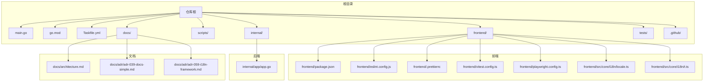
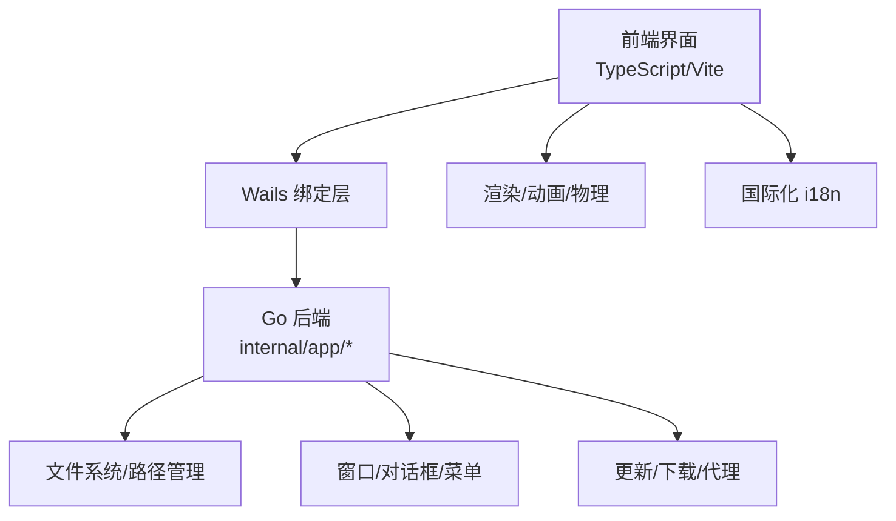
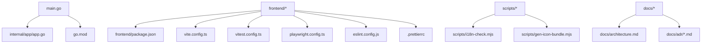

# 贡献指南

<cite>
**本文引用的文件**   
- [README.md](file://README.md)
- [.github/ISSUE_TEMPLATE](file://.github/ISSUE_TEMPLATE)
- [.github/workflows](file://.github/workflows)
- [Taskfile.yml](file://Taskfile.yml)
- [frontend/package.json](file://frontend/package.json)
- [frontend/vitest.config.ts](file://frontend/vitest.config.ts)
- [frontend/playwright.config.ts](file://frontend/playwright.config.ts)
- [frontend/eslint.config.js](file://frontend/eslint.config.js)
- [frontend/.prettierrc](file://frontend/.prettierrc)
- [frontend/src/core/i18n/locale.ts](file://frontend/src/core/i18n/locale.ts)
- [frontend/src/core/i18n/t.ts](file://frontend/src/core/i18n/t.ts)
- [scripts/i18n-check.mjs](file://scripts/i18n-check.mjs)
- [scripts/gen-icon-bundle.mjs](file://scripts/gen-icon-bundle.mjs)
- [go.mod](file://go.mod)
- [main.go](file://main.go)
- [internal/app/app.go](file://internal/app/app.go)
- [docs/architecture.md](file://docs/architecture.md)
- [docs/adr/adr-039-docs-simple.md](file://docs/adr/adr-039-docs-simple.md)
- [docs/adr/adr-059-i18n-framework.md](file://docs/adr/adr-059-i18n-framework.md)
- [AGENTS.md](file://AGENTS.md)
</cite>

## 目录
1. [简介](#简介)
2. [项目结构](#项目结构)
3. [核心组件](#核心组件)
4. [架构总览](#架构总览)
5. [详细组件分析](#详细组件分析)
6. [依赖分析](#依赖分析)
7. [性能考虑](#性能考虑)
8. [故障排查指南](#故障排查指南)
9. [结论](#结论)
10. [附录](#附录)

## 简介
本贡献指南面向所有希望参与 MikuMikuAR 项目的开发者与文档作者，涵盖从 Issue 报告、功能请求、Pull Request 提交流程，到代码审查标准、自动化检查、ADR 编写与维护规范、文档贡献流程、新成员入门指引以及社区行为准则与沟通规范。目标是让协作高效、透明且可预期，确保每次变更都能被可靠地构建、测试与发布。

## 项目结构
仓库采用前后端分离的桌面应用结构：前端基于 Wails v3 与 TypeScript/Vite，后端为 Go 语言实现；文档集中于 docs 目录，包含 ADR、审计、研究、版本说明等；CI/CD 配置位于 .github；脚本工具集中在 scripts 与 frontend/scripts。

图表来源
- [main.go:1-20](file://main.go#L1-L20)
- [go.mod:1-20](file://go.mod#L1-L20)
- [Taskfile.yml:1-40](file://Taskfile.yml#L1-L40)
- [frontend/package.json:1-40](file://frontend/package.json#L1-L40)
- [frontend/eslint.config.js:1-40](file://frontend/eslint.config.js#L1-L40)
- [frontend/.prettierrc:1-40](file://frontend/.prettierrc#L1-L40)
- [frontend/vitest.config.ts:1-40](file://frontend/vitest.config.ts#L1-L40)
- [frontend/playwright.config.ts:1-40](file://frontend/playwright.config.ts#L1-L40)
- [frontend/src/core/i18n/locale.ts:1-40](file://frontend/src/core/i18n/locale.ts#L1-L40)
- [frontend/src/core/i18n/t.ts:1-40](file://frontend/src/core/i18n/t.ts#L1-L40)
- [internal/app/app.go:1-40](file://internal/app/app.go#L1-L40)
- [docs/architecture.md:1-40](file://docs/architecture.md#L1-L40)
- [docs/adr/adr-039-docs-simple.md:1-40](file://docs/adr/adr-039-docs-simple.md#L1-L40)
- [docs/adr/adr-059-i18n-framework.md:1-40](file://docs/adr/adr-059-i18n-framework.md#L1-L40)

章节来源
- [README.md:1-120](file://README.md#L1-L120)
- [Taskfile.yml:1-120](file://Taskfile.yml#L1-L120)
- [frontend/package.json:1-120](file://frontend/package.json#L1-L120)
- [docs/architecture.md:1-120](file://docs/architecture.md#L1-L120)

## 核心组件
- 应用入口与后端服务
  - main.go 作为应用启动入口，负责初始化 Wails 运行时并挂载内部模块。
  - internal/app/app.go 提供应用生命周期管理、窗口与菜单集成、资源加载等能力。
- 前端工程化
  - frontend/package.json 定义依赖与脚本命令（构建、测试、E2E）。
  - eslint.config.js 与 .prettierrc 统一代码风格与静态检查。
  - vitest.config.ts 与 playwright.config.ts 分别驱动单元测试与端到端测试。
  - i18n 框架由 frontend/src/core/i18n/locale.ts 与 t.ts 组成，配合 scripts/i18n-check.mjs 进行缺失键检测。
- 文档与决策记录
  - docs/architecture.md 描述系统整体架构。
  - docs/adr 目录存放架构决策记录，遵循编号与命名规范。
- 自动化与脚本
  - scripts 目录包含图标打包、i18n 校验、平台构建脚本等。
  - .github/workflows 用于 CI 流水线（构建、测试、发布）。

章节来源
- [main.go:1-120](file://main.go#L1-L120)
- [internal/app/app.go:1-120](file://internal/app/app.go#L1-L120)
- [frontend/package.json:1-120](file://frontend/package.json#L1-L120)
- [frontend/eslint.config.js:1-120](file://frontend/eslint.config.js#L1-L120)
- [frontend/.prettierrc:1-120](file://frontend/.prettierrc#L1-L120)
- [frontend/vitest.config.ts:1-120](file://frontend/vitest.config.ts#L1-L120)
- [frontend/playwright.config.ts:1-120](file://frontend/playwright.config.ts#L1-L120)
- [frontend/src/core/i18n/locale.ts:1-120](file://frontend/src/core/i18n/locale.ts#L1-L120)
- [frontend/src/core/i18n/t.ts:1-120](file://frontend/src/core/i18n/t.ts#L1-L120)
- [scripts/i18n-check.mjs:1-120](file://scripts/i18n-check.mjs#L1-L120)
- [docs/architecture.md:1-120](file://docs/architecture.md#L1-L120)
- [docs/adr/adr-039-docs-simple.md:1-120](file://docs/adr/adr-039-docs-simple.md#L1-L120)
- [docs/adr/adr-059-i18n-framework.md:1-120](file://docs/adr/adr-059-i18n-framework.md#L1-L120)

## 架构总览
下图展示应用的高层交互关系：用户通过前端界面触发操作，Wails 桥接调用 Go 后端能力（文件系统、窗口、更新、代理等），渲染与动画由前端引擎完成，数据持久化与本地资源访问由后端统一管理。

图表来源
- [main.go:1-120](file://main.go#L1-L120)
- [internal/app/app.go:1-120](file://internal/app/app.go#L1-L120)
- [frontend/src/core/i18n/locale.ts:1-120](file://frontend/src/core/i18n/locale.ts#L1-L120)
- [frontend/src/core/i18n/t.ts:1-120](file://frontend/src/core/i18n/t.ts#L1-L120)

## 详细组件分析

### 贡献工作流与协作方式
- Issue 报告
  - 使用 .github/ISSUE_TEMPLATE 提供的模板创建问题，包含复现步骤、期望行为、实际行为、环境信息、日志与截图。
  - 对崩溃或性能退化类问题，附上最小可复现代码片段或场景文件。
- 功能请求
  - 在 Issue 中明确需求背景、目标用户、验收标准与影响范围。
  - 如涉及跨模块改动，先提交简短设计说明或在 ADR 中记录关键决策。
- Pull Request 提交流程
  - 分支策略：从主分支拉取特性分支，提交前保持与主分支同步。
  - PR 描述：包含变更动机、影响面、测试覆盖、回滚方案。
  - 关联 Issue：在 PR 描述中引用相关 Issue 编号。
  - 合并要求：至少一名维护者批准，CI 全绿，无遗留警告。

章节来源
- [.github/ISSUE_TEMPLATE:1-120](file://.github/ISSUE_TEMPLATE#L1-L120)
- [README.md:1-120](file://README.md#L1-L120)

### 代码审查标准与流程
- 自动检查清单
  - 代码风格：ESLint 与 Prettier 必须通过。
  - 类型安全：TypeScript 编译无错误。
  - 单元测试：Vitest 用例全部通过，新增逻辑需补充单测。
  - E2E 测试：Playwright 用例稳定，UI 回归不破坏。
  - i18n 完整性：scripts/i18n-check.mjs 无缺失键告警。
  - 图标与资源：scripts/gen-icon-bundle.mjs 生成产物一致。
- 人工审查要点
  - 架构一致性：是否符合 docs/architecture.md 与现有 ADR。
  - 接口契约：Go 与 TS 绑定层是否保持一致。
  - 安全性：输入校验、权限控制、资源访问边界。
  - 可维护性：命名清晰、职责单一、注释充分。
  - 性能影响：渲染循环、内存占用、I/O 频率。
- 审查流程
  - 提交后触发 CI，修复失败项。
  - 至少一名维护者审阅并给出反馈。
  - 根据反馈迭代直至获得批准。
  - 合并后跟踪后续问题与回归。

章节来源
- [frontend/eslint.config.js:1-120](file://frontend/eslint.config.js#L1-L120)
- [frontend/.prettierrc:1-120](file://frontend/.prettierrc#L1-L120)
- [frontend/vitest.config.ts:1-120](file://frontend/vitest.config.ts#L1-L120)
- [frontend/playwright.config.ts:1-120](file://frontend/playwright.config.ts#L1-L120)
- [scripts/i18n-check.mjs:1-120](file://scripts/i18n-check.mjs#L1-L120)
- [scripts/gen-icon-bundle.mjs:1-120](file://scripts/gen-icon-bundle.mjs#L1-L120)
- [docs/architecture.md:1-120](file://docs/architecture.md#L1-L120)

### 架构决策记录（ADR）编写与维护规范
- 目的与原则
  - 记录重要技术决策的背景、选项、权衡与结果，便于追溯与复用。
  - 遵循简洁明了、可检索、可演进的原则。
- 结构与编号
  - 文件名格式：adr-NNN-title.md，按顺序递增。
  - 内容建议包含：标题、状态、上下文、决策、后果、参考链接。
- 维护流程
  - 重大变更前先提交 ADR 草案，讨论通过后归档。
  - 与相关模块负责人评审，确保与架构文档一致。
  - 定期清理过期或重复 ADR，保持知识库整洁。

章节来源
- [docs/adr/adr-039-docs-simple.md:1-120](file://docs/adr/adr-039-docs-simple.md#L1-L120)
- [docs/adr/adr-059-i18n-framework.md:1-120](file://docs/adr/adr-059-i18n-framework.md#L1-L120)
- [docs/architecture.md:1-120](file://docs/architecture.md#L1-L120)

### 文档贡献指南
- 文档结构
  - 用户文档与教程：放在 docs 下对应子目录，保持层级清晰。
  - 技术文档与 ADR：遵循命名与编号规范，便于检索。
  - 审计与研究：独立目录，标注日期与主题。
- 写作风格
  - 使用简洁明确的中文，避免歧义与过度术语。
  - 配图与示例优先，必要时附链接与出处。
  - 版本号与时间戳准确，变更记录清晰。
- 翻译流程
  - 以英文或中文为主源，其他语言为镜像。
  - 使用 i18n 键值体系，确保多语言一致性。
  - 提交前运行 i18n 检查脚本，修复缺失键与不一致。

章节来源
- [docs/architecture.md:1-120](file://docs/architecture.md#L1-L120)
- [docs/adr/adr-039-docs-simple.md:1-120](file://docs/adr/adr-039-docs-simple.md#L1-L120)
- [frontend/src/core/i18n/locale.ts:1-120](file://frontend/src/core/i18n/locale.ts#L1-L120)
- [frontend/src/core/i18n/t.ts:1-120](file://frontend/src/core/i18n/t.ts#L1-L120)
- [scripts/i18n-check.mjs:1-120](file://scripts/i18n-check.mjs#L1-L120)

### 新成员入门指导
- 项目理解
  - 阅读 README 与 docs/architecture.md，了解整体架构与模块职责。
  - 浏览 AGENTS.md 获取 AI 辅助与开发约定。
- 开发环境
  - 安装 Node.js、Go 工具链与依赖管理器。
  - 使用 Taskfile.yml 中的任务快速搭建与运行。
  - 前端依赖与脚本见 frontend/package.json。
- 第一个贡献任务
  - 选择一个“好上手”的 Issue（如文档修正、小 bug 修复）。
  - 在本地运行 ESLint、Prettier、Vitest、Playwright，确保通过。
  - 提交 PR 并邀请维护者审阅。

章节来源
- [README.md:1-120](file://README.md#L1-L120)
- [docs/architecture.md:1-120](file://docs/architecture.md#L1-L120)
- [AGENTS.md:1-120](file://AGENTS.md#L1-L120)
- [Taskfile.yml:1-120](file://Taskfile.yml#L1-L120)
- [frontend/package.json:1-120](file://frontend/package.json#L1-L120)

### 社区行为准则与沟通规范
- 尊重与包容
  - 尊重不同背景与观点，禁止歧视与骚扰。
- 建设性沟通
  - 聚焦问题与解决方案，避免人身攻击。
  - 使用 Issue 与 PR 评论进行公开讨论，重要结论归档至 ADR。
- 责任与承诺
  - 按时响应与反馈，无法处理时及时转交或说明原因。
  - 遵守开源许可与合规要求。

章节来源
- [AGENTS.md:1-120](file://AGENTS.md#L1-L120)

## 依赖分析
下图展示主要依赖关系：Go 后端与前端通过 Wails 绑定交互，文档与脚本支撑开发与发布流程。

图表来源
- [main.go:1-120](file://main.go#L1-L120)
- [internal/app/app.go:1-120](file://internal/app/app.go#L1-L120)
- [go.mod:1-120](file://go.mod#L1-L120)
- [frontend/package.json:1-120](file://frontend/package.json#L1-L120)
- [frontend/vitest.config.ts:1-120](file://frontend/vitest.config.ts#L1-L120)
- [frontend/playwright.config.ts:1-120](file://frontend/playwright.config.ts#L1-L120)
- [frontend/eslint.config.js:1-120](file://frontend/eslint.config.js#L1-L120)
- [frontend/.prettierrc:1-120](file://frontend/.prettierrc#L1-L120)
- [scripts/i18n-check.mjs:1-120](file://scripts/i18n-check.mjs#L1-L120)
- [scripts/gen-icon-bundle.mjs:1-120](file://scripts/gen-icon-bundle.mjs#L1-L120)
- [docs/architecture.md:1-120](file://docs/architecture.md#L1-L120)
- [docs/adr/adr-039-docs-simple.md:1-120](file://docs/adr/adr-039-docs-simple.md#L1-L120)

章节来源
- [go.mod:1-120](file://go.mod#L1-L120)
- [main.go:1-120](file://main.go#L1-L120)
- [internal/app/app.go:1-120](file://internal/app/app.go#L1-L120)
- [frontend/package.json:1-120](file://frontend/package.json#L1-L120)
- [docs/architecture.md:1-120](file://docs/architecture.md#L1-L120)

## 性能考虑
- 渲染与动画
  - 减少不必要的重绘与状态切换，合理拆分场景与对象。
  - 利用缓存与懒加载，降低首屏与切换开销。
- I/O 与网络
  - 批量读取与写入，避免频繁磁盘访问。
  - 使用代理与断点续传优化大文件下载体验。
- 内存与资源
  - 及时释放不再使用的纹理、模型与监听器。
  - 监控峰值内存，避免泄漏。
- 测试与基准
  - 引入性能回归测试，关注帧率与加载时长。
  - 对热点路径进行采样与剖析，定位瓶颈。

[本节为通用指导，无需具体文件来源]

## 故障排查指南
- 常见问题定位
  - 构建失败：检查 Node/Go 版本与依赖，确认环境变量与路径。
  - 测试失败：查看日志输出，复现最小用例，增加断言与覆盖率。
  - i18n 缺失：运行 i18n 检查脚本，补齐键值与翻译。
  - 图标异常：重新生成图标包，确认资源路径与命名。
- 调试技巧
  - 启用详细日志与追踪，定位错误堆栈。
  - 使用浏览器开发者工具与 Wails 调试模式。
  - 隔离问题模块，逐步缩小范围。

章节来源
- [scripts/i18n-check.mjs:1-120](file://scripts/i18n-check.mjs#L1-L120)
- [scripts/gen-icon-bundle.mjs:1-120](file://scripts/gen-icon-bundle.mjs#L1-L120)
- [frontend/vitest.config.ts:1-120](file://frontend/vitest.config.ts#L1-L120)
- [frontend/playwright.config.ts:1-120](file://frontend/playwright.config.ts#L1-L120)

## 结论
本贡献指南明确了从问题发现到代码合并的全链路协作方式，强调自动化检查与人工审查的结合，并通过 ADR 与文档体系保障知识沉淀与传承。新成员可依据入门指引快速上手，社区成员应遵循行为准则与沟通规范，共同推动项目高质量演进。

[本节为总结性内容，无需具体文件来源]

## 附录
- 常用命令与任务
  - 使用 Taskfile.yml 的任务进行一键构建、测试与发布。
  - 前端脚本命令参见 frontend/package.json。
- 参考文档
  - 架构总览：docs/architecture.md
  - ADR 示例：docs/adr/adr-039-docs-simple.md、docs/adr/adr-059-i18n-framework.md
  - 开发约定与 AI 辅助：AGENTS.md

章节来源
- [Taskfile.yml:1-120](file://Taskfile.yml#L1-L120)
- [frontend/package.json:1-120](file://frontend/package.json#L1-L120)
- [docs/architecture.md:1-120](file://docs/architecture.md#L1-L120)
- [docs/adr/adr-039-docs-simple.md:1-120](file://docs/adr/adr-039-docs-simple.md#L1-L120)
- [docs/adr/adr-059-i18n-framework.md:1-120](file://docs/adr/adr-059-i18n-framework.md#L1-L120)
- [AGENTS.md:1-120](file://AGENTS.md#L1-L120)