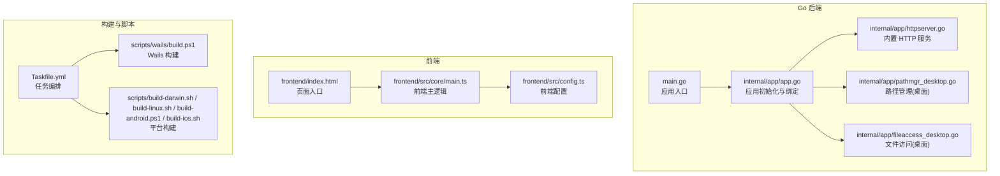
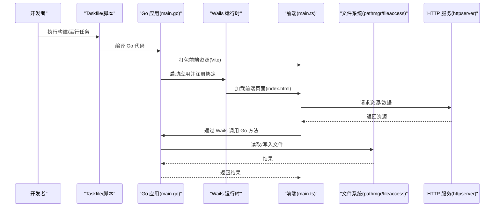
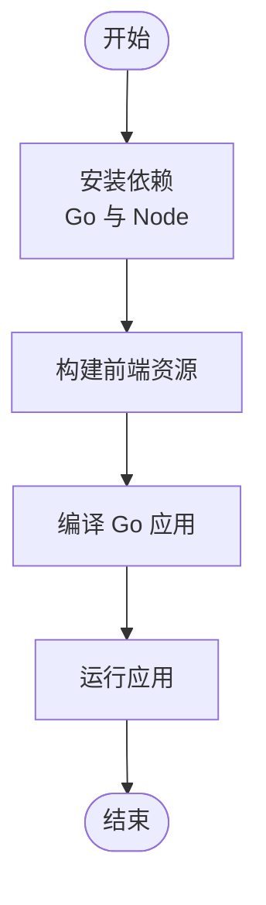
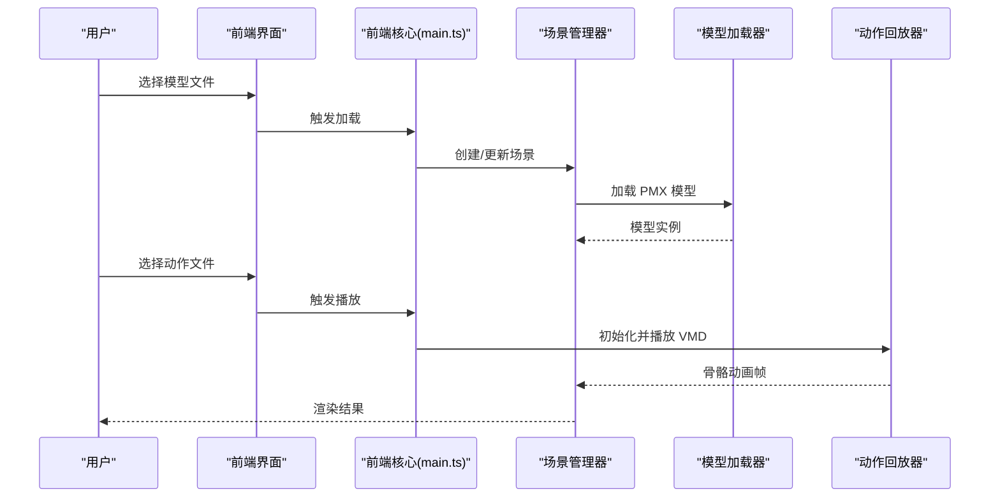
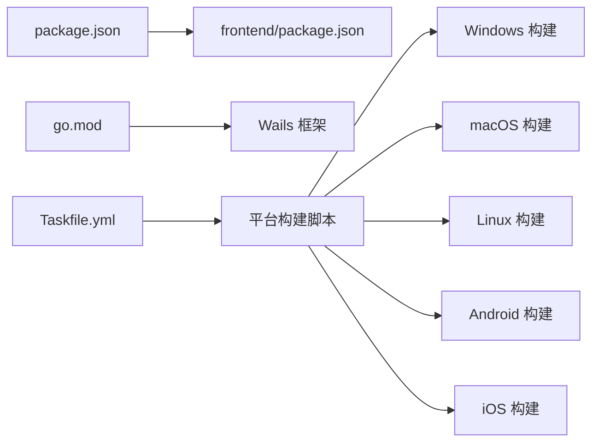

# 快速开始

<cite>
**本文引用的文件**   
- [README.md](file://README.md)
- [main.go](file://main.go)
- [go.mod](file://go.mod)
- [package.json](file://package.json)
- [frontend/package.json](file://frontend/package.json)
- [Taskfile.yml](file://Taskfile.yml)
- [scripts/build-android.ps1](file://scripts/build-android.ps1)
- [scripts/build-darwin.sh](file://scripts/build-darwin.sh)
- [scripts/build-linux.sh](file://scripts/build-linux.sh)
- [scripts/build-ios.sh](file://scripts/build-ios.sh)
- [scripts/wails/build.ps1](file://scripts/wails/build.ps1)
- [scripts/wails/release.ps1](file://scripts/wails/release.ps1)
- [frontend/index.html](file://frontend/index.html)
- [frontend/src/core/main.ts](file://frontend/src/core/main.ts)
- [frontend/src/config.ts](file://frontend/src/config.ts)
- [internal/app/app.go](file://internal/app/app.go)
- [internal/app/httpserver.go](file://internal/app/httpserver.go)
- [internal/app/pathmgr_desktop.go](file://internal/app/pathmgr_desktop.go)
- [internal/app/fileaccess_desktop.go](file://internal/app/fileaccess_desktop.go)
- [frontend/e2e/action-play.spec.ts](file://frontend/e2e/action-play.spec.ts)
- [frontend/e2e/model-load.spec.ts](file://frontend/e2e/model-load.spec.ts)
</cite>

## 目录
1. [简介](#简介)
2. [项目结构](#项目结构)
3. [核心组件](#核心组件)
4. [架构总览](#架构总览)
5. [详细组件分析](#详细组件分析)
6. [依赖分析](#依赖分析)
7. [性能考虑](#性能考虑)
8. [故障排除指南](#故障排除指南)
9. [结论](#结论)
10. [附录](#附录)

## 简介
本快速开始指南面向首次接触 MikuMikuAR 的开发者与用户，目标是帮助你在最短时间内完成环境搭建、编译构建并运行应用，加载第一个模型并播放动画。你将了解：
- 所需环境与依赖（Go、Node.js）
- 前端与后端构建流程
- 开发模式与调试建议
- 从源码到运行的完整步骤
- 首个模型加载与动作播放示例
- 常见问题定位与解决思路

## 项目结构
仓库采用前后端分离的桌面/跨平台应用结构：
- Go 后端（Wails v3）负责系统能力、文件系统、HTTP 服务、资源管理、平台适配等
- 前端基于 TypeScript/Vite，提供 UI、场景渲染、动作回放、设置与菜单等
- 脚本与任务编排通过 Taskfile 与平台脚本统一入口

图表来源
- [main.go:1-200](file://main.go#L1-L200)
- [internal/app/app.go:1-200](file://internal/app/app.go#L1-L200)
- [internal/app/httpserver.go:1-200](file://internal/app/httpserver.go#L1-L200)
- [internal/app/pathmgr_desktop.go:1-200](file://internal/app/pathmgr_desktop.go#L1-L200)
- [internal/app/fileaccess_desktop.go:1-200](file://internal/app/fileaccess_desktop.go#L1-L200)
- [frontend/index.html:1-200](file://frontend/index.html#L1-L200)
- [frontend/src/core/main.ts:1-200](file://frontend/src/core/main.ts#L1-L200)
- [frontend/src/config.ts:1-200](file://frontend/src/config.ts#L1-L200)
- [Taskfile.yml:1-200](file://Taskfile.yml#L1-L200)
- [scripts/wails/build.ps1:1-200](file://scripts/wails/build.ps1#L1-L200)
- [scripts/build-darwin.sh:1-200](file://scripts/build-darwin.sh#L1-L200)
- [scripts/build-linux.sh:1-200](file://scripts/build-linux.sh#L1-L200)
- [scripts/build-android.ps1:1-200](file://scripts/build-android.ps1#L1-L200)
- [scripts/build-ios.sh:1-200](file://scripts/build-ios.sh#L1-L200)

章节来源
- [README.md:1-200](file://README.md#L1-L200)
- [main.go:1-200](file://main.go#L1-L200)
- [Taskfile.yml:1-200](file://Taskfile.yml#L1-L200)

## 核心组件
- 应用入口与 Wails 绑定
  - Go 侧 main.go 负责启动 Wails 应用，注册前端可调用方法
  - internal/app/app.go 实现应用初始化、模块装配与事件/命令绑定
- 内置 HTTP 服务
  - internal/app/httpserver.go 提供本地静态资源或代理能力，便于前端加载资源
- 路径与文件访问
  - internal/app/pathmgr_desktop.go 与 fileaccess_desktop.go 提供桌面端路径解析与文件读写封装
- 前端主流程
  - frontend/index.html 为页面入口
  - frontend/src/core/main.ts 初始化引擎、UI、场景与交互
  - frontend/src/config.ts 提供前端运行时配置项

章节来源
- [main.go:1-200](file://main.go#L1-L200)
- [internal/app/app.go:1-200](file://internal/app/app.go#L1-L200)
- [internal/app/httpserver.go:1-200](file://internal/app/httpserver.go#L1-L200)
- [internal/app/pathmgr_desktop.go:1-200](file://internal/app/pathmgr_desktop.go#L1-L200)
- [internal/app/fileaccess_desktop.go:1-200](file://internal/app/fileaccess_desktop.go#L1-L200)
- [frontend/index.html:1-200](file://frontend/index.html#L1-L200)
- [frontend/src/core/main.ts:1-200](file://frontend/src/core/main.ts#L1-L200)
- [frontend/src/config.ts:1-200](file://frontend/src/config.ts#L1-L200)

## 架构总览
整体采用“Go 后端 + Web 前端”的混合架构：
- 前端通过 Wails 桥接调用 Go 能力（文件、系统、网络等）
- 后端提供本地 HTTP 服务，供前端在开发/生产模式下加载资源
- 构建阶段由 Taskfile 与平台脚本统一驱动，输出各平台产物

图表来源
- [main.go:1-200](file://main.go#L1-L200)
- [internal/app/app.go:1-200](file://internal/app/app.go#L1-L200)
- [internal/app/httpserver.go:1-200](file://internal/app/httpserver.go#L1-L200)
- [internal/app/pathmgr_desktop.go:1-200](file://internal/app/pathmgr_desktop.go#L1-L200)
- [internal/app/fileaccess_desktop.go:1-200](file://internal/app/fileaccess_desktop.go#L1-L200)
- [frontend/index.html:1-200](file://frontend/index.html#L1-L200)
- [frontend/src/core/main.ts:1-200](file://frontend/src/core/main.ts#L1-L200)
- [Taskfile.yml:1-200](file://Taskfile.yml#L1-L200)

## 详细组件分析

### 环境准备与依赖安装
- 必需环境
  - Go 语言环境（版本以 go.mod 为准）
  - Node.js 与 npm（用于前端构建）
- 关键依赖声明位置
  - Go 依赖：go.mod
  - 前端依赖：package.json 与 frontend/package.json
- 安装建议
  - 使用官方安装包或包管理器安装 Go 与 Node.js
  - 在项目根目录与 frontend 目录分别执行依赖安装

章节来源
- [go.mod:1-200](file://go.mod#L1-L200)
- [package.json:1-200](file://package.json#L1-L200)
- [frontend/package.json:1-200](file://frontend/package.json#L1-L200)

### 构建与运行
- 统一任务入口
  - 使用 Taskfile.yml 提供的任务进行构建与运行
- 平台构建脚本
  - Windows：scripts/wails/build.ps1、scripts/build-android.ps1
  - macOS：scripts/build-darwin.sh
  - Linux：scripts/build-linux.sh
  - iOS：scripts/build-ios.sh
- 典型流程
  - 安装依赖（Go 与 Node）
  - 构建前端资源
  - 编译 Go 并生成可执行文件
  - 运行应用

图表来源
- [Taskfile.yml:1-200](file://Taskfile.yml#L1-L200)
- [scripts/wails/build.ps1:1-200](file://scripts/wails/build.ps1#L1-L200)
- [scripts/build-darwin.sh:1-200](file://scripts/build-darwin.sh#L1-L200)
- [scripts/build-linux.sh:1-200](file://scripts/build-linux.sh#L1-L200)
- [scripts/build-android.ps1:1-200](file://scripts/build-android.ps1#L1-L200)
- [scripts/build-ios.sh:1-200](file://scripts/build-ios.sh#L1-L200)

章节来源
- [Taskfile.yml:1-200](file://Taskfile.yml#L1-L200)
- [scripts/wails/build.ps1:1-200](file://scripts/wails/build.ps1#L1-L200)
- [scripts/build-darwin.sh:1-200](file://scripts/build-darwin.sh#L1-L200)
- [scripts/build-linux.sh:1-200](file://scripts/build-linux.sh#L1-L200)
- [scripts/build-android.ps1:1-200](file://scripts/build-android.ps1#L1-L200)
- [scripts/build-ios.sh:1-200](file://scripts/build-ios.sh#L1-L200)

### 开发模式与调试
- 前端调试
  - 使用 Vite 开发服务器进行热重载与断点调试
  - 浏览器开发者工具中查看控制台与网络请求
- 后端调试
  - 在 IDE 中直接运行 main.go 或 wails 开发命令
  - 结合日志输出定位问题
- 常用配置
  - 前端配置位于 frontend/src/config.ts
  - 应用初始化与绑定位于 internal/app/app.go

章节来源
- [frontend/src/config.ts:1-200](file://frontend/src/config.ts#L1-L200)
- [internal/app/app.go:1-200](file://internal/app/app.go#L1-L200)
- [main.go:1-200](file://main.go#L1-L200)

### 第一个模型加载与动画播放示例
- 目标
  - 加载一个 PMX 模型并播放其 VMD 动作
- 参考用例
  - 端到端测试用例展示了模型加载与动作播放的基本流程，可作为入门参考
- 操作步骤（概念性说明）
  - 准备模型与动作文件
  - 通过 UI 或 API 选择模型并加载
  - 选择动作并触发播放
  - 观察渲染结果与时间轴控制

图表来源
- [frontend/src/core/main.ts:1-200](file://frontend/src/core/main.ts#L1-L200)
- [frontend/e2e/model-load.spec.ts:1-200](file://frontend/e2e/model-load.spec.ts#L1-L200)
- [frontend/e2e/action-play.spec.ts:1-200](file://frontend/e2e/action-play.spec.ts#L1-L200)

章节来源
- [frontend/e2e/model-load.spec.ts:1-200](file://frontend/e2e/model-load.spec.ts#L1-L200)
- [frontend/e2e/action-play.spec.ts:1-200](file://frontend/e2e/action-play.spec.ts#L1-L200)

## 依赖分析
- Go 依赖
  - 由 go.mod 管理，包含 Wails 框架及相关库
- 前端依赖
  - package.json 与 frontend/package.json 管理 Vite、TypeScript、测试与构建工具链
- 构建脚本依赖
  - 平台脚本依赖对应平台的编译器与打包工具

图表来源
- [package.json:1-200](file://package.json#L1-L200)
- [frontend/package.json:1-200](file://frontend/package.json#L1-L200)
- [go.mod:1-200](file://go.mod#L1-L200)
- [Taskfile.yml:1-200](file://Taskfile.yml#L1-L200)
- [scripts/wails/build.ps1:1-200](file://scripts/wails/build.ps1#L1-L200)
- [scripts/build-darwin.sh:1-200](file://scripts/build-darwin.sh#L1-L200)
- [scripts/build-linux.sh:1-200](file://scripts/build-linux.sh#L1-L200)
- [scripts/build-android.ps1:1-200](file://scripts/build-android.ps1#L1-L200)
- [scripts/build-ios.sh:1-200](file://scripts/build-ios.sh#L1-L200)

章节来源
- [go.mod:1-200](file://go.mod#L1-L200)
- [package.json:1-200](file://package.json#L1-L200)
- [frontend/package.json:1-200](file://frontend/package.json#L1-L200)
- [Taskfile.yml:1-200](file://Taskfile.yml#L1-L200)

## 性能考虑
- 资源加载
  - 合理组织模型与纹理资源，避免一次性加载过大资源
- 渲染优化
  - 根据设备能力调整渲染质量与特效开关
- 物理与动作
  - 控制骨骼数量与物理计算复杂度，必要时降低步长或关闭非必要特性
- 缓存策略
  - 对频繁使用的资源启用缓存，减少重复 IO 与解码开销

[本节为通用指导，不直接分析具体文件]

## 故障排除指南
- 常见错误与排查方向
  - WASM 资源 404：检查静态资源路径与 HTTP 服务是否正常运行
  - CORS 被拦截：确认本地服务响应头与跨域策略
  - 模型格式不支持：确认 PMX 文件完整性与版本
  - 动作无反应：检查 VMD 文件与时间轴状态
  - 阴影/水面异常：检查渲染预设与环境设置
- 定位建议
  - 打开浏览器控制台查看前端错误堆栈
  - 查看后端日志输出，定位 Go 侧错误
  - 使用端到端测试用例作为行为对照

章节来源
- [docs/buglog/WASM 404：index_bg.wasm 无法加载.md:1-200](file://docs/buglog/WASM 404：index_bg.wasm 无法加载.md#L1-L200)
- [docs/buglog/CORS：Wails WebView 跨域被拦.md:1-200](file://docs/buglog/CORS：Wails WebView 跨域被拦.md#L1-L200)
- [docs/buglog/PMX 加载失败：is not pmx file.md:1-200](file://docs/buglog/PMX 加载失败：is not pmx file.md#L1-L200)
- [docs/buglog/VMD 播放无反应.md:1-200](file://docs/buglog/VMD 播放无反应.md#L1-L200)
- [docs/buglog/两套物理引擎并存性能差3至5倍.md:1-200](file://docs/buglog/两套物理引擎并存性能差3至5倍.md#L1-L200)
- [docs/buglog/水面关掉后不恢复.md:1-200](file://docs/buglog/水面关掉后不恢复.md#L1-L200)
- [docs/buglog/程序化动作应用到角色无效（动作1）.md:1-200](file://docs/buglog/程序化动作应用到角色无效（动作1）.md#L1-L200)
- [docs/buglog/纹理不显示：模型无颜色.md:1-200](file://docs/buglog/纹理不显示：模型无颜色.md#L1-L200)
- [docs/buglog/骨骼变换覆写无效（视线追踪 程序化骨骼旋转）.md:1-200](file://docs/buglog/骨骼变换覆写无效（视线追踪 程序化骨骼旋转）.md#L1-L200)

## 结论
通过以上步骤，你已完成环境搭建、构建运行与首个模型加载与动作播放体验。建议在后续使用中：
- 熟悉 Taskfile 的任务定义，按需扩展构建与发布流程
- 利用端到端测试用例理解功能边界与预期行为
- 结合文档中的故障排除条目快速定位问题

[本节为总结性内容，不直接分析具体文件]

## 附录
- 相关文档与说明
  - README 系列（多语言）：项目概述与使用说明
  - docs/architecture.md：架构设计说明
  - docs/function-map.md：功能映射与索引
  - docs/releases/*：版本发布说明

章节来源
- [README.md:1-200](file://README.md#L1-L200)
- [docs/architecture.md:1-200](file://docs/architecture.md#L1-L200)
- [docs/function-map.md:1-200](file://docs/function-map.md#L1-L200)
- [docs/releases/v1.5.3.md:1-200](file://docs/releases/v1.5.3.md#L1-L200)