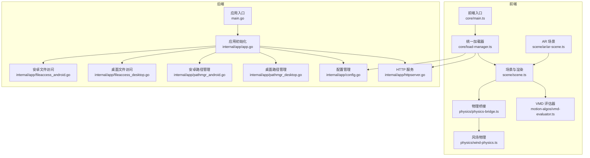
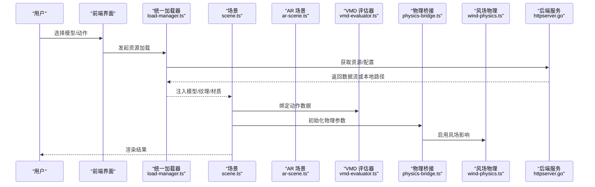
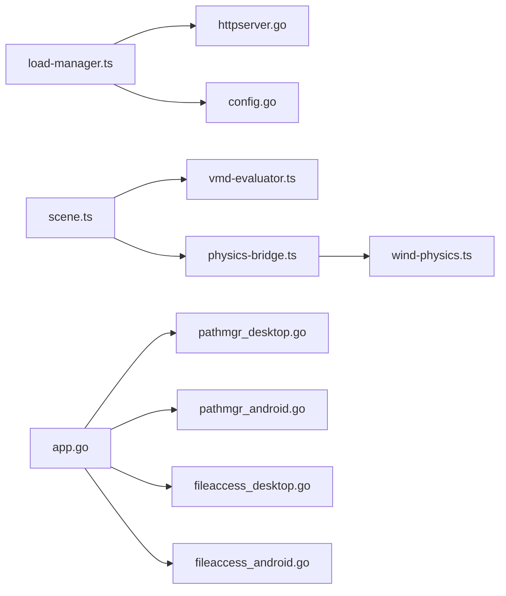

# 常见问题与解决方案

<cite>
**本文引用的文件**   
- [README.md](file://README.md)
- [main.go](file://main.go)
- [app.go](file://internal/app/app.go)
- [httpserver.go](file://internal/app/httpserver.go)
- [config.go](file://internal/app/config.go)
- [pathmgr_desktop.go](file://internal/app/pathmgr_desktop.go)
- [pathmgr_android.go](file://internal/app/pathmgr_android.go)
- [fileaccess_desktop.go](file://internal/app/fileaccess_desktop.go)
- [fileaccess_android.go](file://internal/app/fileaccess_android.go)
- [goerr.ts](file://frontend/src/core/i18n/goerr.ts)
- [load-manager.ts](file://frontend/src/core/load-manager.ts)
- [scene.ts](file://frontend/src/scene/scene.ts)
- [ar-scene.ts](file://frontend/src/scene/ar/ar-scene.ts)
- [vmd-evaluator.ts](file://frontend/src/motion-algos/vmd-evaluator.ts)
- [physics-bridge.ts](file://frontend/src/physics/physics-bridge.ts)
- [wind-physics.ts](file://frontend/src/physics/wind-physics.ts)
- [2026-07-15-settings-menu-defects.md](file://docs/buglog/2026-07-15-settings-menu-defects.md)
- [PMX 加载失败：`is not pmx file`.md](file://docs/buglog/PMX 加载失败：`is not pmx file`.md)
- [VMD 播放无反应.md](file://docs/buglog/VMD 播放无反应.md)
- [WASM 404：`index_bg.wasm` 无法加载.md](file://docs/buglog/WASM 404：`index_bg.wasm` 无法加载.md)
- [Shader 404：textureAlphaChecker.vertex.fx.md](file://docs/buglog/Shader 404：textureAlphaChecker.vertex.fx.md)
- [CORS：Wails WebView 跨域被拦.md](file://docs/buglog/CORS：Wails WebView 跨域被拦.md)
- [两套物理引擎并存性能差3至5倍.md](file://docs/buglog/两套物理引擎并存性能差3至5倍.md)
- [骨骼变换覆写无效（视线追踪 程序化骨骼旋转）.md](file://docs/buglog/骨骼变换覆写无效（视线追踪 程序化骨骼旋转）.md)
</cite>

## 目录
1. [简介](#简介)
2. [项目结构](#项目结构)
3. [核心组件](#核心组件)
4. [架构总览](#架构总览)
5. [详细问题与解决方案](#详细问题与解决方案)
6. [依赖关系分析](#依赖关系分析)
7. [性能注意事项](#性能注意事项)
8. [故障排查指南](#故障排查指南)
9. [结论](#结论)
10. [附录](#附录)

## 简介
本文件面向 MikuMikuAR 用户，聚焦安装失败、启动错误、模型加载异常、动画播放异常等高频问题。每个问题提供症状描述、根因分析与分步修复方案，并给出预防性建议与最佳实践。文档中的错误日志示例来源于仓库内 buglog 记录，并结合前端与后端关键模块的实现进行说明。

## 项目结构
本项目采用前后端分离的桌面/移动端应用架构：
- 前端（TypeScript + Vite）：负责 UI、场景渲染、动作评估、资源加载与状态管理。
- 后端（Go + Wails v3）：负责文件系统访问、路径管理、HTTP 服务、平台差异处理与更新机制。
- 文档与审计：包含 ADR、审计、Buglog、研究笔记与发布说明。

图表来源
- [main.go:1-200](file://main.go#L1-L200)
- [app.go:1-200](file://internal/app/app.go#L1-L200)
- [httpserver.go:1-200](file://internal/app/httpserver.go#L1-L200)
- [config.go:1-200](file://internal/app/config.go#L1-L200)
- [pathmgr_desktop.go:1-200](file://internal/app/pathmgr_desktop.go#L1-L200)
- [pathmgr_android.go:1-200](file://internal/app/pathmgr_android.go#L1-L200)
- [fileaccess_desktop.go:1-200](file://internal/app/fileaccess_desktop.go#L1-L200)
- [fileaccess_android.go:1-200](file://internal/app/fileaccess_android.go#L1-L200)
- [load-manager.ts:1-200](file://frontend/src/core/load-manager.ts#L1-L200)
- [scene.ts:1-200](file://frontend/src/scene/scene.ts#L1-L200)
- [ar-scene.ts:1-200](file://frontend/src/scene/ar/ar-scene.ts#L1-L200)
- [vmd-evaluator.ts:1-200](file://frontend/src/motion-algos/vmd-evaluator.ts#L1-L200)
- [physics-bridge.ts:1-200](file://frontend/src/physics/physics-bridge.ts#L1-L200)
- [wind-physics.ts:1-200](file://frontend/src/physics/wind-physics.ts#L1-L200)

章节来源
- [README.md:1-200](file://README.md#L1-L200)

## 核心组件
- 应用初始化与生命周期：后端通过入口与应用初始化模块完成 HTTP 服务、配置加载、路径与文件访问适配；前端在初始化阶段完成语言、主题、快捷键与全局状态准备。
- 统一资源加载：前端 load-manager 负责资源请求、缓存、重试与错误上报，屏蔽底层网络与平台差异。
- 场景与渲染：scene 模块组织模型、材质、环境、相机与后处理；AR 场景扩展了摄像头与透视管线。
- 动作系统：VMD 评估器解析并驱动骨骼动画；物理桥接与风场物理协同工作。
- 配置与路径：config 管理运行时设置；pathmgr 根据平台返回库目录、下载目录等；fileaccess 封装读写与解压。

章节来源
- [app.go:1-200](file://internal/app/app.go#L1-L200)
- [httpserver.go:1-200](file://internal/app/httpserver.go#L1-L200)
- [config.go:1-200](file://internal/app/config.go#L1-L200)
- [pathmgr_desktop.go:1-200](file://internal/app/pathmgr_desktop.go#L1-L200)
- [pathmgr_android.go:1-200](file://internal/app/pathmgr_android.go#L1-L200)
- [fileaccess_desktop.go:1-200](file://internal/app/fileaccess_desktop.go#L1-L200)
- [fileaccess_android.go:1-200](file://internal/app/fileaccess_android.go#L1-L200)
- [load-manager.ts:1-200](file://frontend/src/core/load-manager.ts#L1-L200)
- [scene.ts:1-200](file://frontend/src/scene/scene.ts#L1-L200)
- [ar-scene.ts:1-200](file://frontend/src/scene/ar/ar-scene.ts#L1-L200)
- [vmd-evaluator.ts:1-200](file://frontend/src/motion-algos/vmd-evaluator.ts#L1-L200)
- [physics-bridge.ts:1-200](file://frontend/src/physics/physics-bridge.ts#L1-L200)
- [wind-physics.ts:1-200](file://frontend/src/physics/wind-physics.ts#L1-L200)

## 架构总览
下图展示从“用户操作”到“渲染输出”的关键调用链，以及后端资源服务的参与点。

图表来源
- [load-manager.ts:1-200](file://frontend/src/core/load-manager.ts#L1-L200)
- [scene.ts:1-200](file://frontend/src/scene/scene.ts#L1-L200)
- [ar-scene.ts:1-200](file://frontend/src/scene/ar/ar-scene.ts#L1-L200)
- [vmd-evaluator.ts:1-200](file://frontend/src/motion-algos/vmd-evaluator.ts#L1-L200)
- [physics-bridge.ts:1-200](file://frontend/src/physics/physics-bridge.ts#L1-L200)
- [wind-physics.ts:1-200](file://frontend/src/physics/wind-physics.ts#L1-L200)
- [httpserver.go:1-200](file://internal/app/httpserver.go#L1-L200)

## 详细问题与解决方案

### 一、安装失败
常见症状
- 双击安装包无响应或闪退
- 安装过程中提示权限不足或路径不可写
- 首次运行出现白屏或无法进入主界面

根因分析
- 平台路径不可写：桌面端默认库目录位于受限路径；安卓端存储权限未授予导致写入失败。
- 依赖缺失：WASM 或 Shader 资源未随包正确打包，导致后续加载失败。
- 安全策略拦截：WebView 跨域或 COEP 限制导致资源加载被阻断。

分步解决方案
1. 检查安装目录与库目录是否可写
   - 桌面端：将应用与库目录移动到非系统保护路径（如用户目录）。
   - 安卓端：在系统设置中授予“存储/媒体与视频”权限。
2. 验证 WASM 与 Shader 资源完整性
   - 确认 index_bg.wasm 与常用 shader 文件存在且未被杀毒软件隔离。
3. 关闭代理与严格跨域策略
   - 若使用企业代理或安全软件，添加信任域名或禁用对本地资源的拦截。
4. 清理缓存并重试
   - 删除应用缓存目录后重新启动。

预防性建议
- 首次运行前确保目标磁盘分区有足够空间与写入权限。
- 避免将应用安装在受保护的 Program Files 或系统盘根目录。
- 在企业环境中提前放行本地资源与 WASM 加载。

章节来源
- [pathmgr_desktop.go:1-200](file://internal/app/pathmgr_desktop.go#L1-L200)
- [pathmgr_android.go:1-200](file://internal/app/pathmgr_android.go#L1-L200)
- [fileaccess_desktop.go:1-200](file://internal/app/fileaccess_desktop.go#L1-L200)
- [fileaccess_android.go:1-200](file://internal/app/fileaccess_android.go#L1-L200)
- [WASM 404：`index_bg.wasm` 无法加载.md](file://docs/buglog/WASM 404：`index_bg.wasm` 无法加载.md)
- [Shader 404：textureAlphaChecker.vertex.fx.md](file://docs/buglog/Shader 404：textureAlphaChecker.vertex.fx.md)
- [CORS：Wails WebView 跨域被拦.md](file://docs/buglog/CORS：Wails WebView 跨域被拦.md)

### 二、启动错误（白屏/闪退/卡启动）
常见症状
- 启动后立即退出或黑屏/白屏
- 控制台报 CORS 或跨域错误
- 菜单项点击无响应

根因分析
- 配置加载失败：config 读取不到必要字段或格式错误。
- HTTP 服务未就绪：httpserver 端口占用或启动失败。
- 前端初始化异常：i18n 或 goerr 映射异常导致 UI 崩溃。

分步解决方案
1. 检查配置文件与路径
   - 确认 config 文件存在且语法正确，路径指向有效的库目录。
2. 释放端口与重启服务
   - 若端口被占用，修改配置或使用管理员权限启动。
3. 查看国际化与错误映射
   - 确认 i18n 资源完整，goerr 映射未缺失。
4. 以最小配置启动
   - 临时禁用高级特性（如 AR、SSR），定位是否为某功能导致启动失败。

预防性建议
- 升级版本前先备份配置与库目录。
- 避免手动编辑 JSON 配置，使用内置设置面板。
- 在调试模式下收集日志以便快速定位。

章节来源
- [config.go:1-200](file://internal/app/config.go#L1-L200)
- [httpserver.go:1-200](file://internal/app/httpserver.go#L1-L200)
- [goerr.ts:1-200](file://frontend/src/core/i18n/goerr.ts#L1-L200)
- [2026-07-15-settings-menu-defects.md](file://docs/buglog/2026-07-15-settings-menu-defects.md)

### 三、模型加载问题（PMX 报错/纹理不显示）
常见症状
- 加载 PMX 时报错“不是 pmx 文件”
- 模型无颜色或纹理缺失
- 导入后骨骼错位或比例异常

根因分析
- 文件格式校验失败：文件头不符合 PMX 规范或损坏。
- 纹理路径不正确：相对路径或编码问题导致纹理无法找到。
- 平台路径差异：桌面与安卓路径分隔符或大小写敏感差异。

分步解决方案
1. 验证 PMX 文件完整性
   - 使用官方工具打开测试，确认文件未损坏。
2. 检查纹理路径与命名
   - 确保纹理文件名与 PMX 中一致，路径不含特殊字符。
3. 统一路径分隔符与大小写
   - 在 Windows 下注意大小写不敏感但保持命名一致；在 Linux/Android 上注意大小写敏感。
4. 重新导出或转换
   - 若由第三方工具生成，尝试重新导出为 PMX 并附带纹理。

预防性建议
- 使用标准流程导出 PMX，避免手工修改二进制头。
- 将模型与纹理放在同一目录，使用相对路径引用。
- 在发布前进行跨平台路径兼容性测试。

章节来源
- [PMX 加载失败：`is not pmx file`.md](file://docs/buglog/PMX 加载失败：`is not pmx file`.md)
- [pathmgr_desktop.go:1-200](file://internal/app/pathmgr_desktop.go#L1-L200)
- [pathmgr_android.go:1-200](file://internal/app/pathmgr_android.go#L1-L200)
- [fileaccess_desktop.go:1-200](file://internal/app/fileaccess_desktop.go#L1-L200)
- [fileaccess_android.go:1-200](file://internal/app/fileaccess_android.go#L1-L200)

### 四、动画播放异常（VMD 无反应/卡顿/不同步）
常见症状
- 点击播放无反应
- 动作缓慢或不连贯
- 音频与动作不同步

根因分析
- VMD 解析失败：时间轴键值缺失或帧率不匹配。
- 物理与动作冲突：两套物理引擎同时运行导致性能下降。
- 风场与 IK 叠加：计算量过大造成卡顿。

分步解决方案
1. 检查 VMD 有效性
   - 使用播放器预览，确认时间轴与帧率合理。
2. 关闭冗余物理引擎
   - 仅保留一套物理实现，避免并发计算。
3. 调整风场强度与 IK 迭代次数
   - 降低风场影响与 IK 迭代以提升性能。
4. 同步音频轨道
   - 校准音频采样率与动作帧率，必要时重采样。

预防性建议
- 在复杂场景中逐步开启特效，观察性能变化。
- 使用预设动作与标准化 VMD，减少自定义高开销逻辑。
- 定期清理无用动作与材质，降低内存占用。

章节来源
- [VMD 播放无反应.md](file://docs/buglog/VMD 播放无反应.md)
- [两套物理引擎并存性能差3至5倍.md](file://docs/buglog/两套物理引擎并存性能差3至5倍.md)
- [vmd-evaluator.ts:1-200](file://frontend/src/motion-algos/vmd-evaluator.ts#L1-L200)
- [physics-bridge.ts:1-200](file://frontend/src/physics/physics-bridge.ts#L1-L200)
- [wind-physics.ts:1-200](file://frontend/src/physics/wind-physics.ts#L1-L200)

### 五、AR 模式异常（摄像头不可用/画面偏移）
常见症状
- 进入 AR 模式后摄像头黑屏
- 画面与真实世界对齐不准
- 移动设备发热严重

根因分析
- 摄像头权限未授权或 API 不可用。
- 投影矩阵或相机内参设置不当。
- 渲染负载过高导致降频。

分步解决方案
1. 授予摄像头权限
   - 在系统设置中允许应用访问摄像头与麦克风。
2. 校准相机内参
   - 使用内置标定工具或按提示完成一次简单标定。
3. 降低渲染质量
   - 关闭反射、阴影与后处理，提升稳定性。
4. 检查 AR 场景初始化顺序
   - 确保相机与渲染目标创建成功后再进入 AR 循环。

预防性建议
- 在低配设备上优先保证基础功能稳定。
- 提供“节能模式”开关，自动降低特效等级。
- 记录标定误差，提示用户重新标定。

章节来源
- [ar-scene.ts:1-200](file://frontend/src/scene/ar/ar-scene.ts#L1-L200)
- [scene.ts:1-200](file://frontend/src/scene/scene.ts#L1-L200)

### 六、跨域与资源加载失败（CORS/404）
常见症状
- 控制台报 CORS 错误
- 资源 404（WASM、Shader、纹理）
- 本地代理或企业防火墙拦截

根因分析
- WebView 跨域策略严格，未设置正确的响应头。
- 资源路径错误或构建产物缺失。
- 代理服务器重写 URL 导致资源不可达。

分步解决方案
1. 配置后端响应头
   - 在 httpserver 中为本地资源添加必要的跨域与安全头。
2. 校验资源清单
   - 对比构建产物与实际部署目录，补齐缺失文件。
3. 排除代理规则
   - 在代理或安全软件中添加例外，放行本地资源与 WASM。
4. 使用绝对路径或 CDN 回退
   - 对于关键资源，提供多源回退策略。

预防性建议
- 在 CI/CD 中加入资源完整性校验步骤。
- 提供离线包与增量更新机制，减少网络依赖。
- 在企业环境中预置信任证书与白名单。

章节来源
- [httpserver.go:1-200](file://internal/app/httpserver.go#L1-L200)
- [load-manager.ts:1-200](file://frontend/src/core/load-manager.ts#L1-L200)
- [WASM 404：`index_bg.wasm` 无法加载.md](file://docs/buglog/WASM 404：`index_bg.wasm` 无法加载.md)
- [Shader 404：textureAlphaChecker.vertex.fx.md](file://docs/buglog/Shader 404：textureAlphaChecker.vertex.fx.md)
- [CORS：Wails WebView 跨域被拦.md](file://docs/buglog/CORS：Wails WebView 跨域被拦.md)

### 七、骨骼变换覆写无效（视线追踪/程序化骨骼旋转）
常见症状
- 视线追踪或程序化动作未生效
- 覆盖的骨骼旋转被其他逻辑重置
- 多层动作叠加时出现冲突

根因分析
- 动作层优先级与覆写语义不明确。
- 物理与动作更新时序不一致导致覆盖失效。
- 观察者注册重复或回调未触发。

分步解决方案
1. 明确动作层优先级
   - 将视线追踪与程序化动作置于更高优先级层。
2. 统一更新时序
   - 确保骨骼覆写在物理与动作评估之后执行。
3. 去重观察者与回调
   - 检查重复注册，确保回调只触发一次。
4. 增加调试标记
   - 在关键节点打印覆写前后的矩阵，便于定位。

预防性建议
- 使用统一的动作注册与调度框架，避免分散逻辑。
- 对关键骨骼变更增加断言与日志。
- 在复杂场景中分层测试，逐步集成。

章节来源
- [骨骼变换覆写无效（视线追踪 程序化骨骼旋转）.md](file://docs/buglog/骨骼变换覆写无效（视线追踪 程序化骨骼旋转）.md)
- [vmd-evaluator.ts:1-200](file://frontend/src/motion-algos/vmd-evaluator.ts#L1-L200)
- [physics-bridge.ts:1-200](file://frontend/src/physics/physics-bridge.ts#L1-L200)

## 依赖关系分析
- 前端依赖后端 HTTP 服务获取配置与资源；后端根据平台选择 pathmgr 与 fileaccess 实现。
- 场景模块依赖动作评估器与物理桥接；AR 场景扩展相机与渲染管线。
- 配置与路径管理贯穿整个应用生命周期，任何环节的错误都会导致启动或加载失败。

图表来源
- [load-manager.ts:1-200](file://frontend/src/core/load-manager.ts#L1-L200)
- [httpserver.go:1-200](file://internal/app/httpserver.go#L1-L200)
- [config.go:1-200](file://internal/app/config.go#L1-L200)
- [scene.ts:1-200](file://frontend/src/scene/scene.ts#L1-L200)
- [vmd-evaluator.ts:1-200](file://frontend/src/motion-algos/vmd-evaluator.ts#L1-L200)
- [physics-bridge.ts:1-200](file://frontend/src/physics/physics-bridge.ts#L1-L200)
- [wind-physics.ts:1-200](file://frontend/src/physics/wind-physics.ts#L1-L200)
- [app.go:1-200](file://internal/app/app.go#L1-L200)
- [pathmgr_desktop.go:1-200](file://internal/app/pathmgr_desktop.go#L1-L200)
- [pathmgr_android.go:1-200](file://internal/app/pathmgr_android.go#L1-L200)
- [fileaccess_desktop.go:1-200](file://internal/app/fileaccess_desktop.go#L1-L200)
- [fileaccess_android.go:1-200](file://internal/app/fileaccess_android.go#L1-L200)

## 性能注意事项
- 避免两套物理引擎并行运行，显著降低 CPU/GPU 压力。
- 控制风场强度与 IK 迭代次数，平衡效果与性能。
- 在 AR 模式下关闭高成本后处理，提升帧率与续航。
- 使用资源缓存与懒加载，减少首屏加载时间与内存峰值。

## 故障排查指南
- 收集日志：在调试模式下开启详细日志，记录启动、加载与渲染关键节点。
- 复现最小场景：剥离非必要特效与动作，逐步恢复定位问题。
- 交叉验证：在不同平台与设备上复现，确认是否为平台相关缺陷。
- 回归测试：修复后执行端到端用例，确保不再引入新问题。

章节来源
- [2026-07-15-settings-menu-defects.md](file://docs/buglog/2026-07-15-settings-menu-defects.md)

## 结论
通过对安装、启动、模型加载、动画播放、AR 模式与跨域问题的系统化梳理，结合前后端关键模块的实现细节，本文提供了可操作的诊断与修复路径。遵循预防性建议与最佳实践，可显著降低问题发生率并提升用户体验。

## 附录
- 术语表：PMX、VMD、IK、WASM、COEP、CORS 等。
- 参考链接：发布说明、ADR 与审计报告，帮助理解架构演进与决策背景。