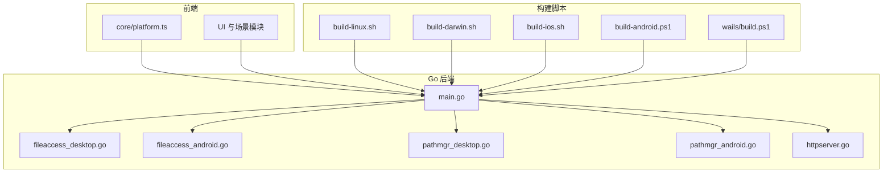
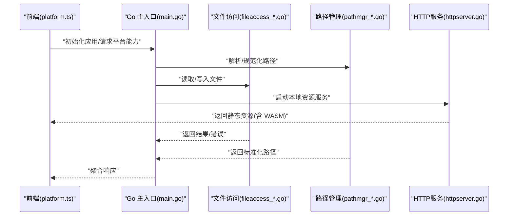
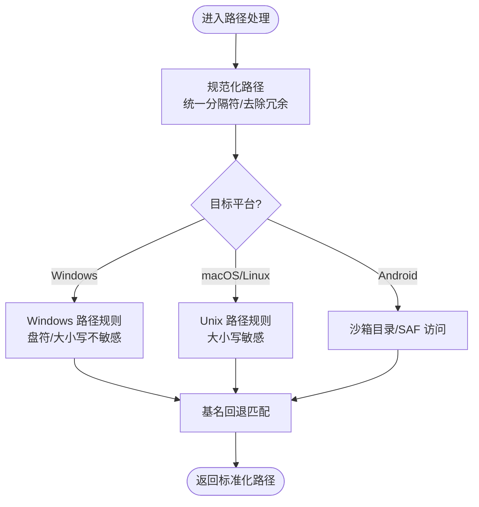
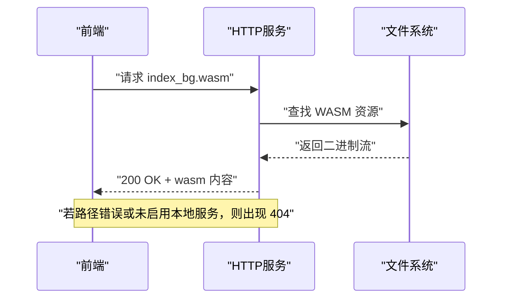
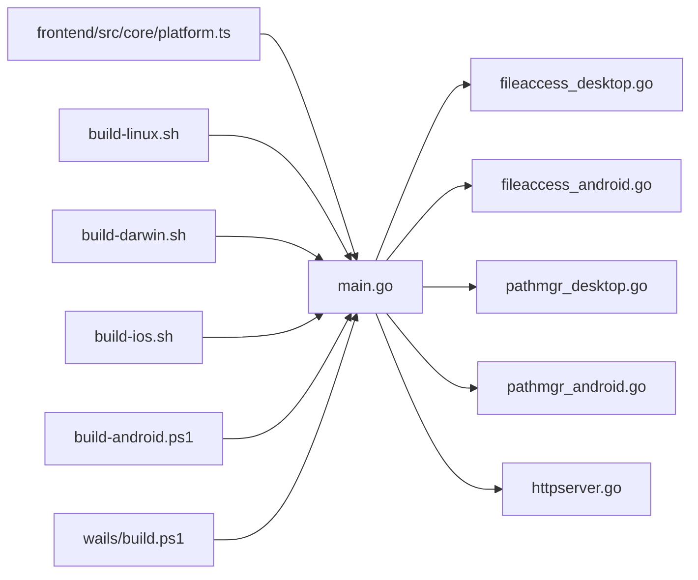

# 平台兼容性问题

<cite>
**本文引用的文件**   
- [main.go](file://main.go)
- [internal/app/fileaccess_desktop.go](file://internal/app/fileaccess_desktop.go)
- [internal/app/fileaccess_android.go](file://internal/app/fileaccess_android.go)
- [internal/app/pathmgr_desktop.go](file://internal/app/pathmgr_desktop.go)
- [internal/app/pathmgr_android.go](file://internal/app/pathmgr_android.go)
- [frontend/src/core/platform.ts](file://frontend/src/core/platform.ts)
- [scripts/build-linux.sh](file://scripts/build-linux.sh)
- [scripts/build-darwin.sh](file://scripts/build-darwin.sh)
- [scripts/build-ios.sh](file://scripts/build-ios.sh)
- [scripts/build-android.ps1](file://scripts/build-android.ps1)
- [scripts/wails/build.ps1](file://scripts/wails/build.ps1)
- [docs/research/Android 环境下 Wails v3 隐患清单.md](file://docs/research/Android 环境下 Wails v3 隐患清单.md)
- [docs/research/Wails v3-architecture.md](file://docs/research/Wails v3-architecture.md)
- [docs/research/babylon-mmd-api-analysis.md](file://docs/research/babylon-mmd-api-analysis.md)
- [docs/buglog/WASM 404：`index_bg.wasm` 无法加载.md](file://docs/buglog/WASM 404：`index_bg.wasm` 无法加载.md)
- [docs/buglog/CORS：Wails WebView 跨域被拦.md](file://docs/buglog/CORS：Wails WebView 跨域被拦.md)
- [docs/adr/adr-058-basenameFallbackFS.md](file://docs/adr/adr-058-basenameFallbackFS.md)
- [docs/adr/adr-095-path-normalization-consolidation.md](file://docs/adr/adr-095-path-normalization-consolidation.md)
- [docs/adr/adr-133-android-mpr-gap.md](file://docs/adr/adr-133-android-mpr-gap.md)
- [docs/adr/adr-056-wasm-runtime-motion-layers.md](file://docs/adr/adr-056-wasm-runtime-motion-layers.md)
</cite>

## 目录
1. [简介](#简介)
2. [项目结构](#项目结构)
3. [核心组件](#核心组件)
4. [架构总览](#架构总览)
5. [详细组件分析](#详细组件分析)
6. [依赖关系分析](#依赖关系分析)
7. [性能考虑](#性能考虑)
8. [故障排查指南](#故障排查指南)
9. [结论](#结论)
10. [附录](#附录)

## 简介
本文件聚焦于 MikuMikuAR 在桌面与移动平台的兼容性差异与解决方案，覆盖 Windows、macOS、Linux、Android、iOS 五大目标平台。内容围绕以下主题展开：
- 文件系统路径处理与权限管理
- 硬件加速与渲染能力检测
- WebAssembly（WASM）运行时支持与加载策略
- 构建与部署注意事项（依赖版本、系统配置检查）
- 跨平台开发陷阱与规避方法
- 平台特定的性能调优建议

## 项目结构
本项目采用“前端 TypeScript + Go 后端”的混合架构，通过 Wails v3 桥接。Go 层提供平台相关能力（文件访问、路径管理、HTTP 服务等），前端负责 UI 与场景逻辑。关键平台差异集中在 Go 层的平台特定实现与脚本构建流程中。

图表来源
- [main.go:1-200](file://main.go#L1-L200)
- [internal/app/fileaccess_desktop.go:1-200](file://internal/app/fileaccess_desktop.go#L1-L200)
- [internal/app/fileaccess_android.go:1-200](file://internal/app/fileaccess_android.go#L1-L200)
- [internal/app/pathmgr_desktop.go:1-200](file://internal/app/pathmgr_desktop.go#L1-L200)
- [internal/app/pathmgr_android.go:1-200](file://internal/app/pathmgr_android.go#L1-L200)
- [internal/app/httpserver.go:1-200](file://internal/app/httpserver.go#L1-L200)
- [scripts/build-linux.sh:1-200](file://scripts/build-linux.sh#L1-L200)
- [scripts/build-darwin.sh:1-200](file://scripts/build-darwin.sh#L1-L200)
- [scripts/build-ios.sh:1-200](file://scripts/build-ios.sh#L1-L200)
- [scripts/build-android.ps1:1-200](file://scripts/build-android.ps1#L1-L200)
- [scripts/wails/build.ps1:1-200](file://scripts/wails/build.ps1#L1-L200)

章节来源
- [main.go:1-200](file://main.go#L1-L200)
- [internal/app/fileaccess_desktop.go:1-200](file://internal/app/fileaccess_desktop.go#L1-L200)
- [internal/app/fileaccess_android.go:1-200](file://internal/app/fileaccess_android.go#L1-L200)
- [internal/app/pathmgr_desktop.go:1-200](file://internal/app/pathmgr_desktop.go#L1-L200)
- [internal/app/pathmgr_android.go:1-200](file://internal/app/pathmgr_android.go#L1-L200)
- [internal/app/httpserver.go:1-200](file://internal/app/httpserver.go#L1-L200)
- [scripts/build-linux.sh:1-200](file://scripts/build-linux.sh#L1-L200)
- [scripts/build-darwin.sh:1-200](file://scripts/build-darwin.sh#L1-L200)
- [scripts/build-ios.sh:1-200](file://scripts/build-ios.sh#L1-L200)
- [scripts/build-android.ps1:1-200](file://scripts/build-android.ps1#L1-L200)
- [scripts/wails/build.ps1:1-200](file://scripts/wails/build.ps1#L1-L200)

## 核心组件
- 平台检测与特性开关
  - 前端通过 platform.ts 暴露平台信息，用于条件启用功能或降级策略。
- 文件访问抽象
  - Go 层提供 fileaccess_desktop.go 与 fileaccess_android.go 两套实现，统一对外接口，屏蔽平台差异。
- 路径管理器
  - pathmgr_desktop.go 与 pathmgr_android.go 分别处理不同系统的分隔符、相对路径解析与可写目录定位。
- HTTP 服务与中间件
  - httpserver.go 提供本地资源服务，配合 CORS 与安全头设置，解决跨域与资源加载问题。
- 构建脚本
  - build-linux.sh、build-darwin.sh、build-ios.sh、build-android.ps1、wails/build.ps1 针对不同平台生成产物并注入必要配置。

章节来源
- [frontend/src/core/platform.ts:1-200](file://frontend/src/core/platform.ts#L1-L200)
- [internal/app/fileaccess_desktop.go:1-200](file://internal/app/fileaccess_desktop.go#L1-L200)
- [internal/app/fileaccess_android.go:1-200](file://internal/app/fileaccess_android.go#L1-L200)
- [internal/app/pathmgr_desktop.go:1-200](file://internal/app/pathmgr_desktop.go#L1-L200)
- [internal/app/pathmgr_android.go:1-200](file://internal/app/pathmgr_android.go#L1-L200)
- [internal/app/httpserver.go:1-200](file://internal/app/httpserver.go#L1-L200)
- [scripts/build-linux.sh:1-200](file://scripts/build-linux.sh#L1-L200)
- [scripts/build-darwin.sh:1-200](file://scripts/build-darwin.sh#L1-L200)
- [scripts/build-ios.sh:1-200](file://scripts/build-ios.sh#L1-L200)
- [scripts/build-android.ps1:1-200](file://scripts/build-android.ps1#L1-L200)
- [scripts/wails/build.ps1:1-200](file://scripts/wails/build.ps1#L1-L200)

## 架构总览
下图展示了从前端到 Go 后端的调用链，以及平台差异点如何被抽象与隔离。

图表来源
- [frontend/src/core/platform.ts:1-200](file://frontend/src/core/platform.ts#L1-L200)
- [main.go:1-200](file://main.go#L1-L200)
- [internal/app/fileaccess_desktop.go:1-200](file://internal/app/fileaccess_desktop.go#L1-L200)
- [internal/app/fileaccess_android.go:1-200](file://internal/app/fileaccess_android.go#L1-L200)
- [internal/app/pathmgr_desktop.go:1-200](file://internal/app/pathmgr_desktop.go#L1-L200)
- [internal/app/pathmgr_android.go:1-200](file://internal/app/pathmgr_android.go#L1-L200)
- [internal/app/httpserver.go:1-200](file://internal/app/httpserver.go#L1-L200)

## 详细组件分析

### 文件系统与路径处理
- 设计要点
  - 使用平台特定实现统一对外接口，避免前端感知差异。
  - 路径规范化与基名回退策略，提升跨平台一致性。
- 常见问题
  - 路径分隔符不一致导致资源找不到。
  - Android 沙箱限制导致读写失败。
  - 大小写敏感/不敏感导致的匹配失败。
- 解决方案
  - 统一路径分隔符转换与规范化。
  - 在 Android 上优先使用受控目录，必要时走 ContentProvider 或 SAF。
  - 对文件名进行大小写归一化处理与容错匹配。
- 参考实现位置
  - 桌面端文件访问：[internal/app/fileaccess_desktop.go:1-200](file://internal/app/fileaccess_desktop.go#L1-L200)
  - Android 文件访问：[internal/app/fileaccess_android.go:1-200](file://internal/app/fileaccess_android.go#L1-L200)
  - 桌面路径管理：[internal/app/pathmgr_desktop.go:1-200](file://internal/app/pathmgr_desktop.go#L1-L200)
  - Android 路径管理：[internal/app/pathmgr_android.go:1-200](file://internal/app/pathmgr_android.go#L1-L200)
  - ADR 关于基名回退 FS：[docs/adr/adr-058-basenameFallbackFS.md](file://docs/adr/adr-058-basenameFallbackFS.md)
  - ADR 关于路径规范化整合：[docs/adr/adr-095-path-normalization-consolidation.md](file://docs/adr/adr-095-path-normalization-consolidation.md)

图表来源
- [internal/app/pathmgr_desktop.go:1-200](file://internal/app/pathmgr_desktop.go#L1-L200)
- [internal/app/pathmgr_android.go:1-200](file://internal/app/pathmgr_android.go#L1-L200)
- [docs/adr/adr-058-basenameFallbackFS.md:1-200](file://docs/adr/adr-058-basenameFallbackFS.md#L1-L200)
- [docs/adr/adr-095-path-normalization-consolidation.md:1-200](file://docs/adr/adr-095-path-normalization-consolidation.md#L1-L200)

章节来源
- [internal/app/fileaccess_desktop.go:1-200](file://internal/app/fileaccess_desktop.go#L1-L200)
- [internal/app/fileaccess_android.go:1-200](file://internal/app/fileaccess_android.go#L1-L200)
- [internal/app/pathmgr_desktop.go:1-200](file://internal/app/pathmgr_desktop.go#L1-L200)
- [internal/app/pathmgr_android.go:1-200](file://internal/app/pathmgr_android.go#L1-L200)
- [docs/adr/adr-058-basenameFallbackFS.md:1-200](file://docs/adr/adr-058-basenameFallbackFS.md#L1-L200)
- [docs/adr/adr-095-path-normalization-consolidation.md:1-200](file://docs/adr/adr-095-path-normalization-consolidation.md#L1-L200)

### 权限管理与安全模型
- 桌面端
  - 通常具备完整文件系统权限；注意用户目录与程序安装目录的写入限制。
- Android
  - 受限沙箱与存储权限；需要显式申请权限或使用系统提供的选择器。
- iOS
  - App Sandbox 严格限制；仅允许在文档/缓存目录操作。
- 建议
  - 将可写数据置于用户可访问目录；避免硬编码绝对路径。
  - 在移动端优先使用平台推荐的文件选择与持久化方案。

章节来源
- [internal/app/fileaccess_android.go:1-200](file://internal/app/fileaccess_android.go#L1-L200)
- [internal/app/pathmgr_android.go:1-200](file://internal/app/pathmgr_android.go#L1-L200)

### 硬件加速与渲染能力检测
- 前端通过 platform.ts 获取平台信息，结合 WebGL/WebGPU 能力探测决定是否启用高级渲染特性。
- 针对低端设备或旧驱动，提供降级渲染模式与关闭反射/体积云等重负载效果。
- 参考：
  - 前端平台信息：[frontend/src/core/platform.ts:1-200](file://frontend/src/core/platform.ts#L1-L200)
  - Babylon MMD API 分析（渲染管线与特性）：[docs/research/babylon-mmd-api-analysis.md:1-200](file://docs/research/babylon-mmd-api-analysis.md#L1-L200)

章节来源
- [frontend/src/core/platform.ts:1-200](file://frontend/src/core/platform.ts#L1-L200)
- [docs/research/babylon-mmd-api-analysis.md:1-200](file://docs/research/babylon-mmd-api-analysis.md#L1-L200)

### WebAssembly（WASM）支持
- 加载与路径
  - WASM 资源需由本地 HTTP 服务正确托管，避免直接以 file:// 协议加载。
  - 常见 404 问题可通过调整资源路径与服务器根目录解决。
- 运行时特性
  - 某些平台或浏览器不支持 SharedArrayBuffer 或多线程 WASM，需回退到单线程模式。
- 参考
  - WASM 404 问题记录：[docs/buglog/WASM 404：`index_bg.wasm` 无法加载.md:1-200](file://docs/buglog/WASM 404：`index_bg.wasm` 无法加载.md#L1-L200)
  - WASM 运行时动作层 ADR：[docs/adr/adr-056-wasm-runtime-motion-layers.md:1-200](file://docs/adr/adr-056-wasm-runtime-motion-layers.md#L1-L200)
  - HTTP 服务与中间件：[internal/app/httpserver.go:1-200](file://internal/app/httpserver.go#L1-L200)

图表来源
- [internal/app/httpserver.go:1-200](file://internal/app/httpserver.go#L1-L200)
- [docs/buglog/WASM 404：`index_bg.wasm` 无法加载.md:1-200](file://docs/buglog/WASM 404：`index_bg.wasm` 无法加载.md#L1-L200)

章节来源
- [internal/app/httpserver.go:1-200](file://internal/app/httpserver.go#L1-L200)
- [docs/buglog/WASM 404：`index_bg.wasm` 无法加载.md:1-200](file://docs/buglog/WASM 404：`index_bg.wasm` 无法加载.md#L1-L200)
- [docs/adr/adr-056-wasm-runtime-motion-layers.md:1-200](file://docs/adr/adr-056-wasm-runtime-motion-layers.md#L1-L200)

### 跨平台构建与部署
- Linux
  - 使用 build-linux.sh 构建，确保依赖库版本满足要求（如 GLIBC、X11/Wayland）。
- macOS
  - 使用 build-darwin.sh 构建，注意签名与公证流程。
- iOS
  - 使用 build-ios.sh 构建，需 Xcode 工具链与证书配置。
- Android
  - 使用 build-android.ps1 构建，需 NDK、SDK 与签名配置。
- Wails 通用构建
  - wails/build.ps1 封装通用构建步骤，统一输出目录与产物命名。
- 参考
  - Linux 构建脚本：[scripts/build-linux.sh:1-200](file://scripts/build-linux.sh#L1-L200)
  - macOS 构建脚本：[scripts/build-darwin.sh:1-200](file://scripts/build-darwin.sh#L1-L200)
  - iOS 构建脚本：[scripts/build-ios.sh:1-200](file://scripts/build-ios.sh#L1-L200)
  - Android 构建脚本：[scripts/build-android.ps1:1-200](file://scripts/build-android.ps1#L1-L200)
  - Wails 构建脚本：[scripts/wails/build.ps1:1-200](file://scripts/wails/build.ps1#L1-L200)

章节来源
- [scripts/build-linux.sh:1-200](file://scripts/build-linux.sh#L1-L200)
- [scripts/build-darwin.sh:1-200](file://scripts/build-darwin.sh#L1-L200)
- [scripts/build-ios.sh:1-200](file://scripts/build-ios.sh#L1-L200)
- [scripts/build-android.ps1:1-200](file://scripts/build-android.ps1#L1-L200)
- [scripts/wails/build.ps1:1-200](file://scripts/wails/build.ps1#L1-L200)

### 跨平台开发陷阱与规避方法
- 路径分隔符与大小写敏感性
  - 规避：统一路径规范化与大小写归一化。
- 沙箱与权限
  - 规避：仅在受信任目录写入；移动端使用系统选择器。
- 资源加载协议
  - 规避：始终通过本地 HTTP 服务加载 WASM 与纹理。
- 多线程与共享内存
  - 规避：检测运行时能力，必要时回退单线程。
- 参考
  - Android 下 Wails v3 隐患清单：[docs/research/Android 环境下 Wails v3 隐患清单.md:1-200](file://docs/research/Android 环境下 Wails v3 隐患清单.md#L1-L200)
  - Wails v3 架构说明：[docs/research/Wails v3-architecture.md:1-200](file://docs/research/Wails v3-architecture.md#L1-L200)
  - ADR 关于 Android MPR 差距：[docs/adr/adr-133-android-mpr-gap.md:1-200](file://docs/adr/adr-133-android-mpr-gap.md#L1-L200)

章节来源
- [docs/research/Android 环境下 Wails v3 隐患清单.md:1-200](file://docs/research/Android 环境下 Wails v3 隐患清单.md#L1-L200)
- [docs/research/Wails v3-architecture.md:1-200](file://docs/research/Wails v3-architecture.md#L1-L200)
- [docs/adr/adr-133-android-mpr-gap.md:1-200](file://docs/adr/adr-133-android-mpr-gap.md#L1-L200)

## 依赖关系分析
- 前端依赖
  - platform.ts 作为平台特性入口，影响渲染与行为分支。
- Go 后端依赖
  - main.go 协调各子系统；fileaccess_* 与 pathmgr_* 按平台编译注入。
- 构建脚本依赖
  - 各平台脚本依赖系统工具链与 Wails CLI。

图表来源
- [frontend/src/core/platform.ts:1-200](file://frontend/src/core/platform.ts#L1-L200)
- [main.go:1-200](file://main.go#L1-L200)
- [internal/app/fileaccess_desktop.go:1-200](file://internal/app/fileaccess_desktop.go#L1-L200)
- [internal/app/fileaccess_android.go:1-200](file://internal/app/fileaccess_android.go#L1-L200)
- [internal/app/pathmgr_desktop.go:1-200](file://internal/app/pathmgr_desktop.go#L1-L200)
- [internal/app/pathmgr_android.go:1-200](file://internal/app/pathmgr_android.go#L1-L200)
- [internal/app/httpserver.go:1-200](file://internal/app/httpserver.go#L1-L200)
- [scripts/build-linux.sh:1-200](file://scripts/build-linux.sh#L1-L200)
- [scripts/build-darwin.sh:1-200](file://scripts/build-darwin.sh#L1-L200)
- [scripts/build-ios.sh:1-200](file://scripts/build-ios.sh#L1-L200)
- [scripts/build-android.ps1:1-200](file://scripts/build-android.ps1#L1-L200)
- [scripts/wails/build.ps1:1-200](file://scripts/wails/build.ps1#L1-L200)

章节来源
- [frontend/src/core/platform.ts:1-200](file://frontend/src/core/platform.ts#L1-L200)
- [main.go:1-200](file://main.go#L1-L200)
- [internal/app/fileaccess_desktop.go:1-200](file://internal/app/fileaccess_desktop.go#L1-L200)
- [internal/app/fileaccess_android.go:1-200](file://internal/app/fileaccess_android.go#L1-L200)
- [internal/app/pathmgr_desktop.go:1-200](file://internal/app/pathmgr_desktop.go#L1-L200)
- [internal/app/pathmgr_android.go:1-200](file://internal/app/pathmgr_android.go#L1-L200)
- [internal/app/httpserver.go:1-200](file://internal/app/httpserver.go#L1-L200)
- [scripts/build-linux.sh:1-200](file://scripts/build-linux.sh#L1-L200)
- [scripts/build-darwin.sh:1-200](file://scripts/build-darwin.sh#L1-L200)
- [scripts/build-ios.sh:1-200](file://scripts/build-ios.sh#L1-L200)
- [scripts/build-android.ps1:1-200](file://scripts/build-android.ps1#L1-L200)
- [scripts/wails/build.ps1:1-200](file://scripts/wails/build.ps1#L1-L200)

## 性能考虑
- 渲染路径
  - 根据平台能力动态关闭高开销特效（反射、体积云、粒子）。
- WASM 计算
  - 在支持多线程的平台启用并行骨骼物理；否则回退单线程。
- I/O 优化
  - 批量读取与缓存常用资源；避免频繁小文件 IO。
- 网络与本地服务
  - 合理设置缓存头与压缩，减少重复加载。

[本节为通用指导，无需具体文件引用]

## 故障排查指南
- WASM 404
  - 现象：index_bg.wasm 无法加载。
  - 排查：确认本地 HTTP 服务已启动且资源路径正确；检查构建产物是否包含 WASM。
  - 参考：[docs/buglog/WASM 404：`index_bg.wasm` 无法加载.md:1-200](file://docs/buglog/WASM 404：`index_bg.wasm` 无法加载.md#L1-L200)
- CORS 拦截
  - 现象：WebView 跨域请求被拒绝。
  - 排查：检查中间件是否正确设置 Access-Control-Allow-*；确认同源策略。
  - 参考：[docs/buglog/CORS：Wails WebView 跨域被拦.md:1-200](file://docs/buglog/CORS：Wails WebView 跨域被拦.md#L1-L200)
- Android 平台差异
  - 现象：MPR 功能不可用或行为异常。
  - 排查：对照 ADR 差距项与 Wails v3 隐患清单，逐项验证。
  - 参考：[docs/adr/adr-133-android-mpr-gap.md:1-200](file://docs/adr/adr-133-android-mpr-gap.md#L1-L200)、[docs/research/Android 环境下 Wails v3 隐患清单.md:1-200](file://docs/research/Android 环境下 Wails v3 隐患清单.md#L1-L200)

章节来源
- [docs/buglog/WASM 404：`index_bg.wasm` 无法加载.md:1-200](file://docs/buglog/WASM 404：`index_bg.wasm` 无法加载.md#L1-L200)
- [docs/buglog/CORS：Wails WebView 跨域被拦.md:1-200](file://docs/buglog/CORS：Wails WebView 跨域被拦.md#L1-L200)
- [docs/adr/adr-133-android-mpr-gap.md:1-200](file://docs/adr/adr-133-android-mpr-gap.md#L1-L200)
- [docs/research/Android 环境下 Wails v3 隐患清单.md:1-200](file://docs/research/Android 环境下 Wails v3 隐患清单.md#L1-L200)

## 结论
通过在 Go 层抽象平台差异、在前端进行能力检测与降级、并在构建阶段注入平台相关配置，MikuMikuAR 实现了较好的跨平台兼容性。实践中应重点关注路径规范化、权限与沙箱、WASM 加载与运行时能力、以及构建环境的一致性。持续跟踪 ADR 与 buglog 中的平台相关问题，有助于快速定位与修复。

[本节为总结性内容，无需具体文件引用]

## 附录
- 术语
  - MPR：Motion Physics Runtime（动作物理运行时）
  - WASM：WebAssembly
  - SAF：Storage Access Framework（Android 存储访问框架）
- 参考链接
  - Wails v3 架构与绑定说明：[docs/research/Wails v3-architecture.md:1-200](file://docs/research/Wails v3-architecture.md#L1-L200)

[本节为补充信息，无需具体文件引用]