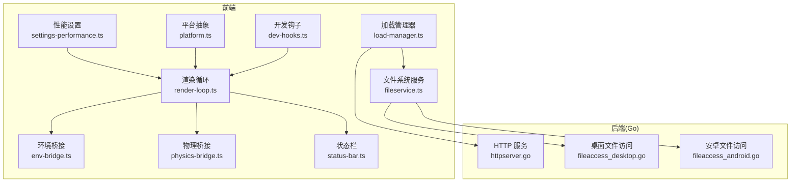
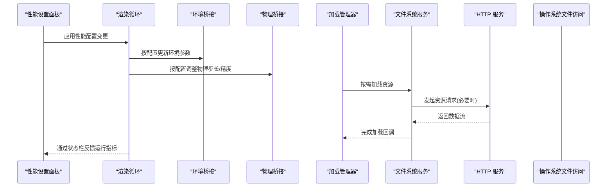
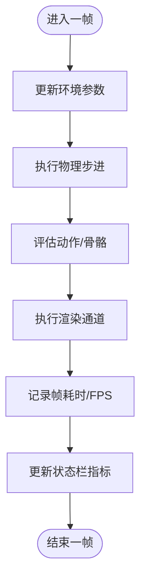
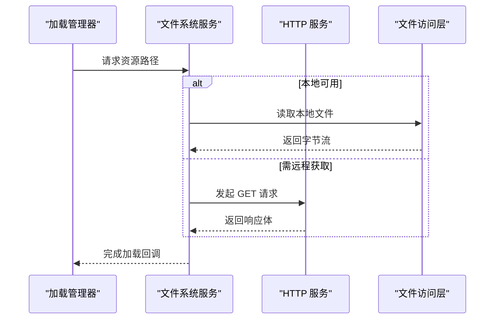
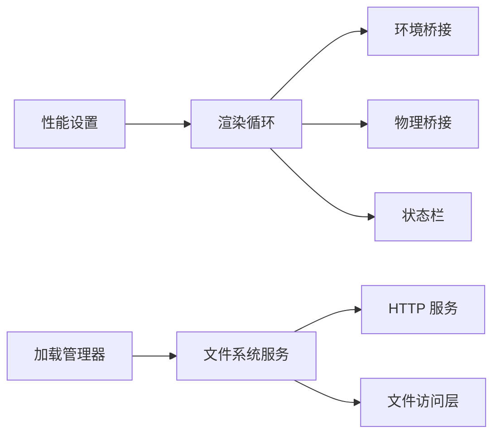

# 性能问题诊断

<cite>
**本文引用的文件**   
- [frontend/src/core/render-loop.ts](file://frontend/src/core/render-loop.ts)
- [frontend/src/menus/settings-performance.ts](file://frontend/src/menus/settings-performance.ts)
- [frontend/vitest.perf.config.ts](file://frontend/vitest.perf.config.ts)
- [frontend/src/scene/env/env-bridge.ts](file://frontend/src/scene/env/env-bridge.ts)
- [frontend/src/physics/physics-bridge.ts](file://frontend/src/physics/physics-bridge.ts)
- [frontend/src/core/load-manager.ts](file://frontend/src/core/load-manager.ts)
- [frontend/src/core/fileservice.ts](file://frontend/src/core/fileservice.ts)
- [internal/app/httpserver.go](file://internal/app/httpserver.go)
- [internal/app/fileaccess_desktop.go](file://internal/app/fileaccess_desktop.go)
- [internal/app/fileaccess_android.go](file://internal/app/fileaccess_android.go)
- [frontend/src/core/platform.ts](file://frontend/src/core/platform.ts)
- [frontend/src/core/dev-hooks.ts](file://frontend/src/core/dev-hooks.ts)
- [frontend/src/core/status-bar.ts](file://frontend/src/core/status-bar.ts)
- [frontend/e2e/action-play.spec.ts](file://frontend/e2e/action-play.spec.ts)
- [frontend/e2e/model-load.spec.ts](file://frontend/e2e/model-load.spec.ts)
- [frontend/e2e/helpers.ts](file://frontend/e2e/helpers.ts)
- [frontend/src/__tests__/performance-reflection.test.ts](file://frontend/src/__tests__/performance-reflection.test.ts)
- [frontend/src/__tests__/wasm-layers-blender.perf.test.ts](file://frontend/src/__tests__/wasm-layers-blender.perf.test.ts)
</cite>

## 目录
1. [简介](#简介)
2. [项目结构](#项目结构)
3. [核心组件](#核心组件)
4. [架构总览](#架构总览)
5. [详细组件分析](#详细组件分析)
6. [依赖关系分析](#依赖关系分析)
7. [性能考量](#性能考量)
8. [故障排查指南](#故障排查指南)
9. [结论](#结论)
10. [附录](#附录)

## 简介
本指南面向 MikuMikuAR 的性能问题诊断与优化，覆盖渲染性能、内存使用、CPU 占用、网络请求等关键维度的监控与分析方法；提供浏览器性能面板、内存泄漏检测、帧率监控等工具的使用建议；总结常见性能问题的特征与解决方案，并给出基准测试与回归测试方法以及跨平台优化建议。文档同时结合仓库中的渲染循环、设置项、加载管理、物理与环境桥接、HTTP 服务与文件访问等实现进行定位与验证。

## 项目结构
本项目采用前端 TypeScript + Go 后端（Wails）的混合架构：
- 前端负责渲染循环、场景与环境系统、UI 菜单、资源加载与状态管理。
- 后端提供 HTTP 服务、本地文件访问、库与预设管理等能力，并通过 Wails 绑定暴露给前端。

图表来源
- [frontend/src/core/render-loop.ts](file://frontend/src/core/render-loop.ts)
- [frontend/src/menus/settings-performance.ts](file://frontend/src/menus/settings-performance.ts)
- [frontend/src/core/load-manager.ts](file://frontend/src/core/load-manager.ts)
- [frontend/src/core/fileservice.ts](file://frontend/src/core/fileservice.ts)
- [frontend/src/scene/env/env-bridge.ts](file://frontend/src/scene/env/env-bridge.ts)
- [frontend/src/physics/physics-bridge.ts](file://frontend/src/physics/physics-bridge.ts)
- [frontend/src/core/platform.ts](file://frontend/src/core/platform.ts)
- [frontend/src/core/dev-hooks.ts](file://frontend/src/core/dev-hooks.ts)
- [frontend/src/core/status-bar.ts](file://frontend/src/core/status-bar.ts)
- [internal/app/httpserver.go](file://internal/app/httpserver.go)
- [internal/app/fileaccess_desktop.go](file://internal/app/fileaccess_desktop.go)
- [internal/app/fileaccess_android.go](file://internal/app/fileaccess_android.go)

章节来源
- [frontend/src/core/render-loop.ts](file://frontend/src/core/render-loop.ts)
- [frontend/src/menus/settings-performance.ts](file://frontend/src/menus/settings-performance.ts)
- [frontend/src/core/load-manager.ts](file://frontend/src/core/load-manager.ts)
- [frontend/src/core/fileservice.ts](file://frontend/src/core/fileservice.ts)
- [frontend/src/scene/env/env-bridge.ts](file://frontend/src/scene/env/env-bridge.ts)
- [frontend/src/physics/physics-bridge.ts](file://frontend/src/physics/physics-bridge.ts)
- [frontend/src/core/platform.ts](file://frontend/src/core/platform.ts)
- [frontend/src/core/dev-hooks.ts](file://frontend/src/core/dev-hooks.ts)
- [frontend/src/core/status-bar.ts](file://frontend/src/core/status-bar.ts)
- [internal/app/httpserver.go](file://internal/app/httpserver.go)
- [internal/app/fileaccess_desktop.go](file://internal/app/fileaccess_desktop.go)
- [internal/app/fileaccess_android.go](file://internal/app/fileaccess_android.go)

## 核心组件
- 渲染循环与帧率采集：集中控制每帧更新与绘制，是定位卡顿、掉帧的关键入口。
- 性能设置面板：提供可调节的渲染质量、特效开关等选项，直接影响 CPU/GPU 负载。
- 加载管理器与文件系统服务：统一资源加载流程，影响首屏时间与 IO 瓶颈。
- 环境与物理桥接：协调环境系统与物理模拟，对 CPU 与 GPU 压力敏感。
- 平台抽象与开发钩子：为不同平台提供差异化行为与调试能力。
- 状态栏：运行时指标展示，便于快速感知性能变化。

章节来源
- [frontend/src/core/render-loop.ts](file://frontend/src/core/render-loop.ts)
- [frontend/src/menus/settings-performance.ts](file://frontend/src/menus/settings-performance.ts)
- [frontend/src/core/load-manager.ts](file://frontend/src/core/load-manager.ts)
- [frontend/src/core/fileservice.ts](file://frontend/src/core/fileservice.ts)
- [frontend/src/scene/env/env-bridge.ts](file://frontend/src/scene/env/env-bridge.ts)
- [frontend/src/physics/physics-bridge.ts](file://frontend/src/physics/physics-bridge.ts)
- [frontend/src/core/platform.ts](file://frontend/src/core/platform.ts)
- [frontend/src/core/dev-hooks.ts](file://frontend/src/core/dev-hooks.ts)
- [frontend/src/core/status-bar.ts](file://frontend/src/core/status-bar.ts)

## 架构总览
下图展示了从 UI 设置到渲染循环、再到后端服务的端到端路径，帮助理解性能调优的影响面。

图表来源
- [frontend/src/menus/settings-performance.ts](file://frontend/src/menus/settings-performance.ts)
- [frontend/src/core/render-loop.ts](file://frontend/src/core/render-loop.ts)
- [frontend/src/scene/env/env-bridge.ts](file://frontend/src/scene/env/env-bridge.ts)
- [frontend/src/physics/physics-bridge.ts](file://frontend/src/physics/physics-bridge.ts)
- [frontend/src/core/load-manager.ts](file://frontend/src/core/load-manager.ts)
- [frontend/src/core/fileservice.ts](file://frontend/src/core/fileservice.ts)
- [internal/app/httpserver.go](file://internal/app/httpserver.go)

## 详细组件分析

### 渲染循环与帧率监控
- 职责：驱动每帧更新、绘制、统计帧耗时与 FPS，并在状态栏展示。
- 关键点：
  - 将环境更新、物理步进、动画评估、渲染输出串联在单帧内。
  - 记录每帧耗时，计算滑动平均 FPS，用于 UI 展示与告警。
  - 支持在开发模式下注入钩子以采样或打点。
- 优化方向：
  - 降低每帧工作总量（减少重绘区域、合并批次）。
  - 根据设备能力动态降级（分辨率、阴影、反射、后处理）。
  - 避免在主线程执行阻塞操作。

图表来源
- [frontend/src/core/render-loop.ts](file://frontend/src/core/render-loop.ts)
- [frontend/src/core/status-bar.ts](file://frontend/src/core/status-bar.ts)

章节来源
- [frontend/src/core/render-loop.ts](file://frontend/src/core/render-loop.ts)
- [frontend/src/core/status-bar.ts](file://frontend/src/core/status-bar.ts)

### 性能设置面板
- 职责：提供用户可调的渲染与性能相关选项，如画质档位、特效开关、目标帧率等。
- 关键点：
  - 变更事件触发渲染循环重新配置。
  - 持久化保存，保证重启后一致体验。
- 优化方向：
  - 引入“自适应”模式，基于实时 FPS 自动降档。
  - 针对移动端提供更激进的默认降级策略。

章节来源
- [frontend/src/menus/settings-performance.ts](file://frontend/src/menus/settings-performance.ts)

### 加载管理与资源 I/O
- 职责：统一管理模型、纹理、音频等资源加载，协调缓存与并发。
- 关键点：
  - 通过文件系统服务访问本地或远程资源。
  - 在需要时调用后端 HTTP 服务获取资源。
- 优化方向：
  - 预取与懒加载结合，优先首屏关键资源。
  - 压缩与分块传输，提升下载吞吐。
  - 增加重试与超时控制，避免长时间阻塞。

图表来源
- [frontend/src/core/load-manager.ts](file://frontend/src/core/load-manager.ts)
- [frontend/src/core/fileservice.ts](file://frontend/src/core/fileservice.ts)
- [internal/app/httpserver.go](file://internal/app/httpserver.go)
- [internal/app/fileaccess_desktop.go](file://internal/app/fileaccess_desktop.go)
- [internal/app/fileaccess_android.go](file://internal/app/fileaccess_android.go)

章节来源
- [frontend/src/core/load-manager.ts](file://frontend/src/core/load-manager.ts)
- [frontend/src/core/fileservice.ts](file://frontend/src/core/fileservice.ts)
- [internal/app/httpserver.go](file://internal/app/httpserver.go)
- [internal/app/fileaccess_desktop.go](file://internal/app/fileaccess_desktop.go)
- [internal/app/fileaccess_android.go](file://internal/app/fileaccess_android.go)

### 环境系统与物理桥接
- 环境桥接：根据设置切换天空盒、雾效、水面、粒子等效果，直接影响 GPU 负载。
- 物理桥接：协调 WASM 物理层与主线程，决定步长、迭代次数、碰撞复杂度。
- 优化方向：
  - 根据设备能力与当前 FPS 动态关闭高开销效果（如反射探针、体积云）。
  - 限制物理对象数量与约束复杂度，降低 CPU 峰值。

章节来源
- [frontend/src/scene/env/env-bridge.ts](file://frontend/src/scene/env/env-bridge.ts)
- [frontend/src/physics/physics-bridge.ts](file://frontend/src/physics/physics-bridge.ts)

### 平台抽象与开发钩子
- 平台抽象：在不同平台（桌面/移动）启用不同默认策略与能力探测。
- 开发钩子：提供运行时注入点，便于采集指标、切换模式、回放问题。
- 优化方向：
  - 在移动端禁用不必要的调试与日志。
  - 在低端设备上自动降低渲染质量与物理精度。

章节来源
- [frontend/src/core/platform.ts](file://frontend/src/core/platform.ts)
- [frontend/src/core/dev-hooks.ts](file://frontend/src/core/dev-hooks.ts)

## 依赖关系分析
- 渲染循环依赖环境桥接与物理桥接，受性能设置影响显著。
- 加载管理器依赖文件系统服务，后者可能调用后端 HTTP 服务与平台文件访问。
- 状态栏作为可视化出口，反映渲染循环的统计结果。

图表来源
- [frontend/src/menus/settings-performance.ts](file://frontend/src/menus/settings-performance.ts)
- [frontend/src/core/render-loop.ts](file://frontend/src/core/render-loop.ts)
- [frontend/src/scene/env/env-bridge.ts](file://frontend/src/scene/env/env-bridge.ts)
- [frontend/src/physics/physics-bridge.ts](file://frontend/src/physics/physics-bridge.ts)
- [frontend/src/core/load-manager.ts](file://frontend/src/core/load-manager.ts)
- [frontend/src/core/fileservice.ts](file://frontend/src/core/fileservice.ts)
- [internal/app/httpserver.go](file://internal/app/httpserver.go)
- [internal/app/fileaccess_desktop.go](file://internal/app/fileaccess_desktop.go)
- [internal/app/fileaccess_android.go](file://internal/app/fileaccess_android.go)
- [frontend/src/core/status-bar.ts](file://frontend/src/core/status-bar.ts)

章节来源
- [frontend/src/menus/settings-performance.ts](file://frontend/src/menus/settings-performance.ts)
- [frontend/src/core/render-loop.ts](file://frontend/src/core/render-loop.ts)
- [frontend/src/scene/env/env-bridge.ts](file://frontend/src/scene/env/env-bridge.ts)
- [frontend/src/physics/physics-bridge.ts](file://frontend/src/physics/physics-bridge.ts)
- [frontend/src/core/load-manager.ts](file://frontend/src/core/load-manager.ts)
- [frontend/src/core/fileservice.ts](file://frontend/src/core/fileservice.ts)
- [internal/app/httpserver.go](file://internal/app/httpserver.go)
- [internal/app/fileaccess_desktop.go](file://internal/app/fileaccess_desktop.go)
- [internal/app/fileaccess_android.go](file://internal/app/fileaccess_android.go)
- [frontend/src/core/status-bar.ts](file://frontend/src/core/status-bar.ts)

## 性能考量
- 渲染性能
  - 关注每帧绘制批次、着色器复杂度、后处理通道数量。
  - 利用性能设置面板降低反射、体积云、水面等昂贵效果。
- 内存使用
  - 关注纹理、模型、物理数据的生命周期，确保及时释放。
  - 使用内存快照对比加载前后差异，定位未释放对象。
- CPU 占用
  - 关注物理步进、动作评估、骨骼计算的耗时。
  - 合理设置物理步长与迭代次数，避免每帧过重。
- 网络请求
  - 关注资源加载时长、并发数、重试与超时。
  - 使用 HTTP 服务与文件访问层进行本地缓存与断点续传。

[本节为通用指导，不直接分析具体文件]

## 故障排查指南
- 识别卡顿与掉帧
  - 在状态栏观察 FPS 波动，结合渲染循环统计定位异常帧。
  - 使用浏览器性能面板录制帧序列，查找长任务与布局抖动。
- 内存泄漏检测
  - 多次切换场景/模型，比较堆快照，确认是否存在持续增长的对象。
  - 检查环境系统与物理对象的销毁路径是否完整。
- 资源加载缓慢
  - 在加载管理器与文件系统服务中增加耗时打点，区分本地与远程路径。
  - 检查 HTTP 服务响应头与缓存策略，确认是否命中缓存。
- 回归与基准
  - 使用性能测试配置文件运行基准用例，记录关键指标趋势。
  - 在 E2E 脚本中加入关键路径的时序断言，防止退化。

章节来源
- [frontend/src/core/status-bar.ts](file://frontend/src/core/status-bar.ts)
- [frontend/src/core/render-loop.ts](file://frontend/src/core/render-loop.ts)
- [frontend/src/core/load-manager.ts](file://frontend/src/core/load-manager.ts)
- [frontend/src/core/fileservice.ts](file://frontend/src/core/fileservice.ts)
- [internal/app/httpserver.go](file://internal/app/httpserver.go)
- [frontend/vitest.perf.config.ts](file://frontend/vitest.perf.config.ts)
- [frontend/e2e/action-play.spec.ts](file://frontend/e2e/action-play.spec.ts)
- [frontend/e2e/model-load.spec.ts](file://frontend/e2e/model-load.spec.ts)
- [frontend/e2e/helpers.ts](file://frontend/e2e/helpers.ts)

## 结论
通过将性能设置、渲染循环、环境/物理桥接、加载管理与后端服务纳入统一的监控与调优体系，可以系统化地识别与解决渲染卡顿、内存泄漏、CPU 峰值与网络延迟等问题。建议在 CI 中集成性能基准与回归测试，持续跟踪关键指标，并结合平台特性制定差异化优化策略。

[本节为总结性内容，不直接分析具体文件]

## 附录

### 性能分析与工具使用指南
- 浏览器性能面板
  - 录制一段典型交互（加载模型、播放动作、切换环境），分析长任务、合成阶段与绘制时间。
  - 重点关注主线程阻塞与频繁重排/重绘。
- 内存泄漏检测
  - 使用堆快照对比功能，查看对象增长与保留树。
  - 结合场景切换与资源卸载流程，验证释放路径。
- 帧率监控
  - 在状态栏观察 FPS 曲线，配合渲染循环统计定位异常帧。
  - 在低端设备上开启自适应降档，保持稳定帧率。

[本节为通用指导，不直接分析具体文件]

### 基准测试与回归测试方法
- 基准测试
  - 使用性能测试配置文件运行专用用例，收集帧耗时、FPS、内存占用等指标。
  - 建立基线阈值，超出阈值即视为回归。
- 回归测试
  - 在 E2E 脚本中对关键路径添加时序与稳定性断言。
  - 定期在主流平台上复测，确保跨平台一致性。

章节来源
- [frontend/vitest.perf.config.ts](file://frontend/vitest.perf.config.ts)
- [frontend/e2e/action-play.spec.ts](file://frontend/e2e/action-play.spec.ts)
- [frontend/e2e/model-load.spec.ts](file://frontend/e2e/model-load.spec.ts)
- [frontend/e2e/helpers.ts](file://frontend/e2e/helpers.ts)

### 常见问题与解决方案
- 内存泄漏
  - 现象：长时间运行后内存持续增长，切换场景无法回收。
  - 方案：检查环境系统与物理对象的销毁逻辑，确保引用链断开。
- 渲染卡顿
  - 现象：FPS 骤降，画面撕裂或掉帧明显。
  - 方案：降低反射、体积云、水面等昂贵效果；减少每帧绘制批次。
- 资源加载缓慢
  - 现象：首次加载时间长，后续仍偶发卡顿。
  - 方案：启用本地缓存与分块传输；优化 HTTP 服务响应头与压缩策略。

章节来源
- [frontend/src/scene/env/env-bridge.ts](file://frontend/src/scene/env/env-bridge.ts)
- [frontend/src/physics/physics-bridge.ts](file://frontend/src/physics/physics-bridge.ts)
- [frontend/src/core/load-manager.ts](file://frontend/src/core/load-manager.ts)
- [frontend/src/core/fileservice.ts](file://frontend/src/core/fileservice.ts)
- [internal/app/httpserver.go](file://internal/app/httpserver.go)

### 跨平台优化建议
- 桌面端
  - 默认中等画质，允许用户手动提升；充分利用多核与独立显卡。
- 移动端
  - 默认低画质与较低物理精度；限制纹理尺寸与后处理通道。
  - 更严格的内存上限与后台节流策略。

章节来源
- [frontend/src/core/platform.ts](file://frontend/src/core/platform.ts)
- [frontend/src/menus/settings-performance.ts](file://frontend/src/menus/settings-performance.ts)

### 专项测试参考
- 反射性能测试：用于评估反射通道在不同场景下的开销。
- WASM 层性能测试：用于评估骨骼物理与动作评估的 CPU 占用。

章节来源
- [frontend/src/__tests__/performance-reflection.test.ts](file://frontend/src/__tests__/performance-reflection.test.ts)
- [frontend/src/__tests__/wasm-layers-blender.perf.test.ts](file://frontend/src/__tests__/wasm-layers-blender.perf.test.ts)