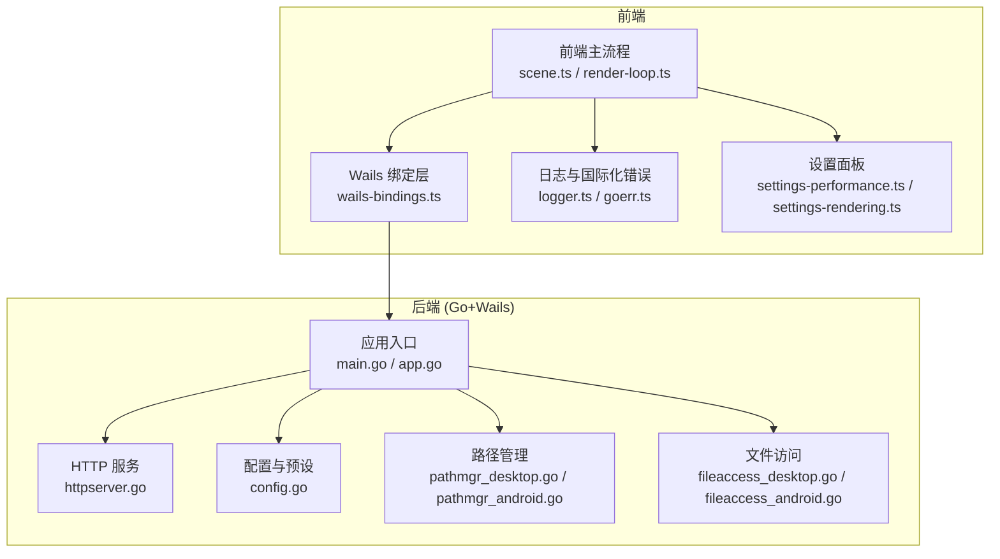
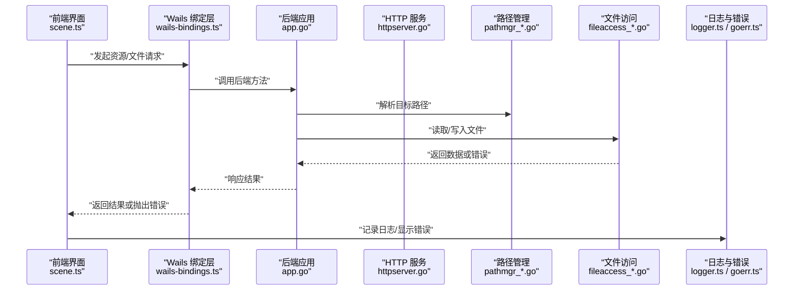
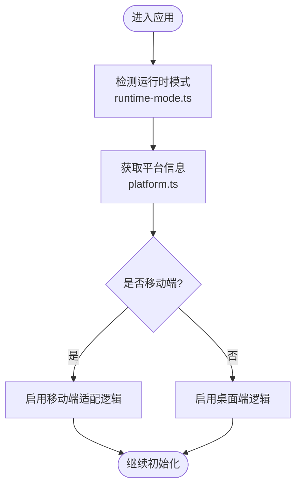
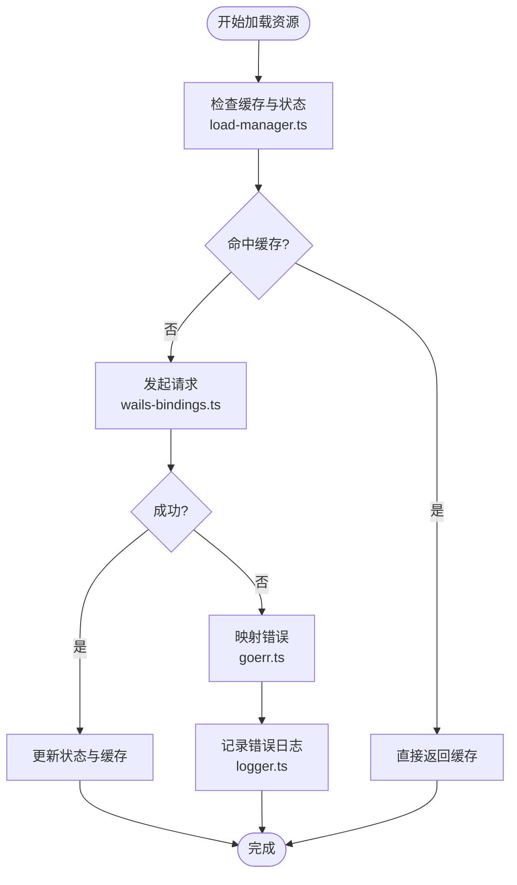
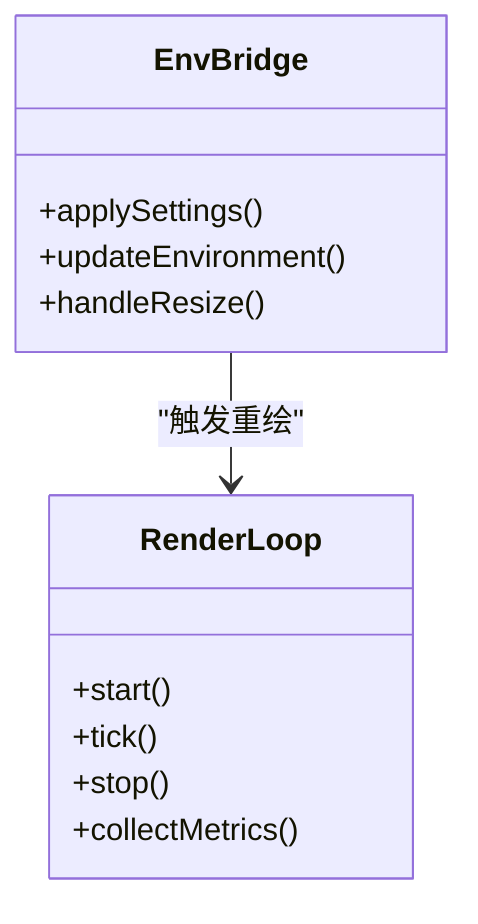
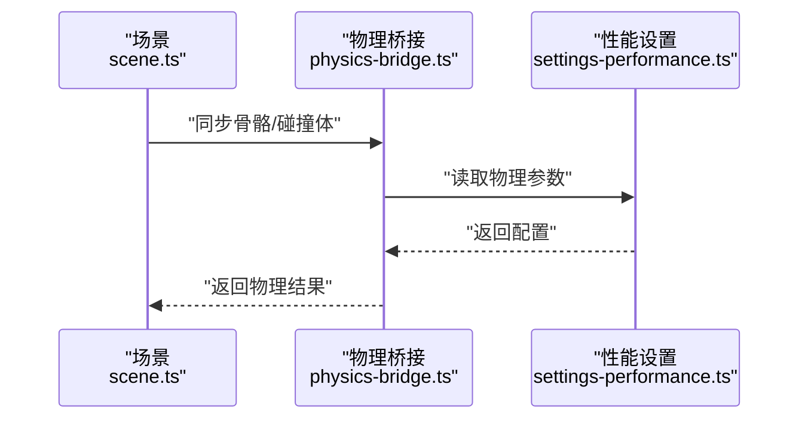
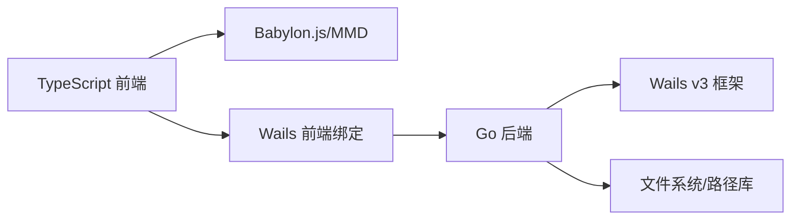

# 故障排除

<cite>
**本文引用的文件**   
- [main.go](file://main.go)
- [app.go](file://internal/app/app.go)
- [httpserver.go](file://internal/app/httpserver.go)
- [config.go](file://internal/app/config.go)
- [pathmgr_desktop.go](file://internal/app/pathmgr_desktop.go)
- [pathmgr_android.go](file://internal/app/pathmgr_android.go)
- [fileaccess_desktop.go](file://internal/app/fileaccess_desktop.go)
- [fileaccess_android.go](file://internal/app/fileaccess_android.go)
- [errors.go](file://internal/util/errors.go)
- [i18nerr/errors.go](file://internal/i18nerr/errors.go)
- [logger.ts](file://frontend/src/core/logger.ts)
- [wails-bindings.ts](file://frontend/src/core/wails-bindings.ts)
- [goerr.ts](file://frontend/src/core/i18n/goerr.ts)
- [platform.ts](file://frontend/src/core/platform.ts)
- [runtime-mode.ts](file://frontend/src/core/runtime-mode.ts)
- [scene.ts](file://frontend/src/scene/scene.ts)
- [env-bridge.ts](file://frontend/src/scene/env/env-bridge.ts)
- [physics-bridge.ts](file://frontend/src/physics/physics-bridge.ts)
- [load-manager.ts](file://frontend/src/core/load-manager.ts)
- [render-loop.ts](file://frontend/src/core/render-loop.ts)
- [settings-performance.ts](file://frontend/src/menus/settings-performance.ts)
- [settings-rendering.ts](file://frontend/src/menus/settings-rendering.ts)
- [CORS：Wails WebView 跨域被拦.md](file://docs/buglog/CORS：Wails WebView 跨域被拦.md)
- [WASM 404：`index_bg.wasm` 无法加载.md](file://docs/buglog/WASM 404：`index_bg.wasm` 无法加载.md)
- [PMX 加载失败：`is not pmx file`.md](file://docs/buglog/PMX 加载失败：`is not pmx file`.md)
- [Shader 404：textureAlphaChecker.vertex.fx.md](file://docs/buglog/Shader 404：textureAlphaChecker.vertex.fx.md)
- [VMD 播放无反应.md](file://docs/buglog/VMD 播放无反应.md)
- [两套物理引擎并存性能差3至5倍.md](file://docs/buglog/两套物理引擎并存性能差3至5倍.md)
- [Android 环境下 Wails v3 隐患清单.md](file://docs/research/Android 环境下 Wails v3 隐患清单.md)
- [Wails v3 源码分析总结.md](file://docs/research/Wails v3 源码分析总结.md)
</cite>

## 目录
1. [简介](#简介)
2. [项目结构](#项目结构)
3. [核心组件](#核心组件)
4. [架构总览](#架构总览)
5. [详细组件分析](#详细组件分析)
6. [依赖分析](#依赖分析)
7. [性能考虑](#性能考虑)
8. [故障排除指南](#故障排除指南)
9. [结论](#结论)
10. [附录](#附录)

## 简介
本故障排除文档面向 MikuMikuAR 的开发者与高级用户，聚焦安装、运行、性能、兼容性等常见问题，提供系统化的日志分析方法、调试技巧、错误码参考、异常处理策略、性能诊断与优化建议，以及平台特定问题的解决方案。文档同时给出社区支持与反馈渠道指引，帮助快速定位并解决问题。

## 项目结构
本项目采用前后端分离架构：前端基于 TypeScript + Vite + Babylon.js（含 MMD 扩展），后端为 Go + Wails v3，负责文件系统、HTTP 服务、路径管理、平台适配等能力。关键目录与职责如下：
- frontend/src：前端应用逻辑、渲染、UI、场景、动作、环境、物理桥接等
- internal/app：Go 后端应用入口、配置、HTTP 服务、路径与文件访问、平台差异实现
- docs/buglog：已记录的问题与修复要点
- docs/research：技术研究与平台特性说明

图表来源
- [main.go:1-200](file://main.go#L1-L200)
- [app.go:1-200](file://internal/app/app.go#L1-L200)
- [httpserver.go:1-200](file://internal/app/httpserver.go#L1-L200)
- [config.go:1-200](file://internal/app/config.go#L1-L200)
- [pathmgr_desktop.go:1-200](file://internal/app/pathmgr_desktop.go#L1-L200)
- [pathmgr_android.go:1-200](file://internal/app/pathmgr_android.go#L1-L200)
- [fileaccess_desktop.go:1-200](file://internal/app/fileaccess_desktop.go#L1-L200)
- [fileaccess_android.go:1-200](file://internal/app/fileaccess_android.go#L1-L200)
- [wails-bindings.ts:1-200](file://frontend/src/core/wails-bindings.ts#L1-L200)
- [scene.ts:1-200](file://frontend/src/scene/scene.ts#L1-L200)
- [render-loop.ts:1-200](file://frontend/src/core/render-loop.ts#L1-L200)
- [logger.ts:1-200](file://frontend/src/core/logger.ts#L1-L200)
- [goerr.ts:1-200](file://frontend/src/core/i18n/goerr.ts#L1-L200)
- [settings-performance.ts:1-200](file://frontend/src/menus/settings-performance.ts#L1-L200)
- [settings-rendering.ts:1-200](file://frontend/src/menus/settings-rendering.ts#L1-L200)

章节来源
- [main.go:1-200](file://main.go#L1-L200)
- [app.go:1-200](file://internal/app/app.go#L1-L200)
- [httpserver.go:1-200](file://internal/app/httpserver.go#L1-L200)
- [config.go:1-200](file://internal/app/config.go#L1-L200)
- [pathmgr_desktop.go:1-200](file://internal/app/pathmgr_desktop.go#L1-L200)
- [pathmgr_android.go:1-200](file://internal/app/pathmgr_android.go#L1-L200)
- [fileaccess_desktop.go:1-200](file://internal/app/fileaccess_desktop.go#L1-L200)
- [fileaccess_android.go:1-200](file://internal/app/fileaccess_android.go#L1-L200)
- [wails-bindings.ts:1-200](file://frontend/src/core/wails-bindings.ts#L1-L200)
- [scene.ts:1-200](file://frontend/src/scene/scene.ts#L1-L200)
- [render-loop.ts:1-200](file://frontend/src/core/render-loop.ts#L1-L200)
- [logger.ts:1-200](file://frontend/src/core/logger.ts#L1-L200)
- [goerr.ts:1-200](file://frontend/src/core/i18n/goerr.ts#L1-L200)
- [settings-performance.ts:1-200](file://frontend/src/menus/settings-performance.ts#L1-L200)
- [settings-rendering.ts:1-200](file://frontend/src/menus/settings-rendering.ts#L1-L200)

## 核心组件
- 应用启动与生命周期
  - 后端通过 main.go 初始化 Wails 应用，注册路由与服务；内部 app.go 协调配置、路径、HTTP 服务等模块。
  - 前端在 scene.ts 中初始化渲染循环与场景对象，并在 render-loop.ts 中驱动帧更新。
- 资源与文件访问
  - 后端 pathmgr_* 与 fileaccess_* 提供跨平台路径解析与文件读写能力，区分桌面与 Android 平台。
  - 前端通过 wails-bindings.ts 调用后端 API，统一封装异步请求与错误映射。
- 配置与预设
  - config.go 集中管理应用配置与预设加载，影响渲染、物理、库路径等。
- 日志与错误
  - 前端 logger.ts 输出结构化日志；goerr.ts 将后端错误进行国际化展示。
  - 后端 util/errors.go 与 i18nerr/errors.go 定义错误类型与格式化策略。

章节来源
- [main.go:1-200](file://main.go#L1-L200)
- [app.go:1-200](file://internal/app/app.go#L1-L200)
- [scene.ts:1-200](file://frontend/src/scene/scene.ts#L1-L200)
- [render-loop.ts:1-200](file://frontend/src/core/render-loop.ts#L1-L200)
- [pathmgr_desktop.go:1-200](file://internal/app/pathmgr_desktop.go#L1-L200)
- [pathmgr_android.go:1-200](file://internal/app/pathmgr_android.go#L1-L200)
- [fileaccess_desktop.go:1-200](file://internal/app/fileaccess_desktop.go#L1-L200)
- [fileaccess_android.go:1-200](file://internal/app/fileaccess_android.go#L1-L200)
- [config.go:1-200](file://internal/app/config.go#L1-L200)
- [logger.ts:1-200](file://frontend/src/core/logger.ts#L1-L200)
- [wails-bindings.ts:1-200](file://frontend/src/core/wails-bindings.ts#L1-L200)
- [goerr.ts:1-200](file://frontend/src/core/i18n/goerr.ts#L1-L200)
- [errors.go:1-200](file://internal/util/errors.go#L1-L200)
- [i18nerr/errors.go:1-200](file://internal/i18nerr/errors.go#L1-L200)

## 架构总览
下图展示了从前端到后端的典型交互路径，包括资源加载、HTTP 服务、路径与文件访问、错误与日志流转。

图表来源
- [scene.ts:1-200](file://frontend/src/scene/scene.ts#L1-L200)
- [wails-bindings.ts:1-200](file://frontend/src/core/wails-bindings.ts#L1-L200)
- [app.go:1-200](file://internal/app/app.go#L1-L200)
- [httpserver.go:1-200](file://internal/app/httpserver.go#L1-L200)
- [pathmgr_desktop.go:1-200](file://internal/app/pathmgr_desktop.go#L1-L200)
- [pathmgr_android.go:1-200](file://internal/app/pathmgr_android.go#L1-L200)
- [fileaccess_desktop.go:1-200](file://internal/app/fileaccess_desktop.go#L1-L200)
- [fileaccess_android.go:1-200](file://internal/app/fileaccess_android.go#L1-L200)
- [logger.ts:1-200](file://frontend/src/core/logger.ts#L1-L200)
- [goerr.ts:1-200](file://frontend/src/core/i18n/goerr.ts#L1-L200)

## 详细组件分析

### 运行时模式与平台检测
- 运行时模式
  - runtime-mode.ts 用于判断当前运行环境（开发/发布、Web/桌面/Android），影响资源加载策略与功能开关。
- 平台信息
  - platform.ts 提供操作系统与设备信息，便于条件分支与兼容处理。

图表来源
- [runtime-mode.ts:1-200](file://frontend/src/core/runtime-mode.ts#L1-L200)
- [platform.ts:1-200](file://frontend/src/core/platform.ts#L1-L200)

章节来源
- [runtime-mode.ts:1-200](file://frontend/src/core/runtime-mode.ts#L1-L200)
- [platform.ts:1-200](file://frontend/src/core/platform.ts#L1-L200)

### 资源加载与错误处理
- 加载管理器
  - load-manager.ts 统一管理资源加载状态、重试与取消信号，避免重复加载与内存泄漏。
- 错误映射
  - goerr.ts 将后端错误转换为可本地化消息，提升用户体验。
- 日志记录
  - logger.ts 提供分级日志输出，便于问题追踪。

图表来源
- [load-manager.ts:1-200](file://frontend/src/core/load-manager.ts#L1-L200)
- [wails-bindings.ts:1-200](file://frontend/src/core/wails-bindings.ts#L1-L200)
- [goerr.ts:1-200](file://frontend/src/core/i18n/goerr.ts#L1-L200)
- [logger.ts:1-200](file://frontend/src/core/logger.ts#L1-L200)

章节来源
- [load-manager.ts:1-200](file://frontend/src/core/load-manager.ts#L1-L200)
- [wails-bindings.ts:1-200](file://frontend/src/core/wails-bindings.ts#L1-L200)
- [goerr.ts:1-200](file://frontend/src/core/i18n/goerr.ts#L1-L200)
- [logger.ts:1-200](file://frontend/src/core/logger.ts#L1-L200)

### 环境与渲染桥接
- 环境桥接
  - env-bridge.ts 负责环境参数与渲染管线对接，确保不同平台下的一致表现。
- 渲染循环
  - render-loop.ts 控制帧率、绘制顺序与性能指标采集。

图表来源
- [env-bridge.ts:1-200](file://frontend/src/scene/env/env-bridge.ts#L1-L200)
- [render-loop.ts:1-200](file://frontend/src/core/render-loop.ts#L1-L200)

章节来源
- [env-bridge.ts:1-200](file://frontend/src/scene/env/env-bridge.ts#L1-L200)
- [render-loop.ts:1-200](file://frontend/src/core/render-loop.ts#L1-L200)

### 物理桥接与性能
- 物理桥接
  - physics-bridge.ts 抽象物理计算接口，屏蔽底层实现差异。
- 性能设置
  - settings-performance.ts 与 settings-rendering.ts 暴露可调参数，如物理步长、渲染质量、抗锯齿等。

图表来源
- [physics-bridge.ts:1-200](file://frontend/src/physics/physics-bridge.ts#L1-L200)
- [settings-performance.ts:1-200](file://frontend/src/menus/settings-performance.ts#L1-L200)
- [scene.ts:1-200](file://frontend/src/scene/scene.ts#L1-L200)

章节来源
- [physics-bridge.ts:1-200](file://frontend/src/physics/physics-bridge.ts#L1-L200)
- [settings-performance.ts:1-200](file://frontend/src/menus/settings-performance.ts#L1-L200)
- [scene.ts:1-200](file://frontend/src/scene/scene.ts#L1-L200)

## 依赖分析
- 前端依赖
  - 主要依赖 Babylon.js 生态（含 MMD 扩展）、Wails 绑定层、Vite 构建工具链。
- 后端依赖
  - Go 标准库与 Wails v3 框架，提供跨平台窗口、菜单、事件与文件系统访问。
- 外部资源
  - WASM 模块、纹理与着色器资源需正确部署与路径映射。

图表来源
- [wails-bindings.ts:1-200](file://frontend/src/core/wails-bindings.ts#L1-L200)
- [main.go:1-200](file://main.go#L1-L200)
- [app.go:1-200](file://internal/app/app.go#L1-L200)

章节来源
- [wails-bindings.ts:1-200](file://frontend/src/core/wails-bindings.ts#L1-L200)
- [main.go:1-200](file://main.go#L1-L200)
- [app.go:1-200](file://internal/app/app.go#L1-L200)

## 性能考虑
- 渲染性能
  - 调整渲染质量、阴影、反射、水面效果等参数，降低 GPU 压力。
  - 使用 render-loop.ts 的性能指标采集，监控帧率与绘制耗时。
- 物理性能
  - 合理设置物理步长与迭代次数，避免与渲染循环耦合过紧导致卡顿。
- 内存管理
  - 利用 load-manager.ts 的状态管理与取消信号，防止重复加载与资源泄漏。
- CPU 使用率
  - 减少不必要的同步操作，尽量使用异步与批处理。

[本节为通用指导，不直接分析具体文件]

## 故障排除指南

### 安装与启动问题
- 现象
  - 应用无法启动、白屏、WASM 模块 404、HTTP 服务未监听。
- 排查步骤
  - 确认构建产物完整，WASM 与静态资源路径正确。
  - 检查后端 httpserver.go 是否正常启动与端口占用。
  - 查看前端控制台是否有 CORS 错误或资源加载失败。
- 相关文档
  - [WASM 404：`index_bg.wasm` 无法加载.md](file://docs/buglog/WASM 404：`index_bg.wasm` 无法加载.md)
  - [CORS：Wails WebView 跨域被拦.md](file://docs/buglog/CORS：Wails WebView 跨域被拦.md)

章节来源
- [httpserver.go:1-200](file://internal/app/httpserver.go#L1-L200)
- [WASM 404：`index_bg.wasm` 无法加载.md:1-200](file://docs/buglog/WASM 404：`index_bg.wasm` 无法加载.md#L1-L200)
- [CORS：Wails WebView 跨域被拦.md:1-200](file://docs/buglog/CORS：Wails WebView 跨域被拦.md#L1-L200)

### 运行错误与异常处理
- 现象
  - 模型加载失败、动画无响应、材质不显示、路径错误。
- 排查步骤
  - 检查 PMX 文件格式与路径是否正确。
  - 确认 Shader 资源是否存在且路径匹配。
  - 查看 VMD 播放状态与时间轴设置。
- 相关文档
  - [PMX 加载失败：`is not pmx file`.md](file://docs/buglog/PMX 加载失败：`is not pmx file`.md)
  - [Shader 404：textureAlphaChecker.vertex.fx.md](file://docs/buglog/Shader 404：textureAlphaChecker.vertex.fx.md)
  - [VMD 播放无反应.md](file://docs/buglog/VMD 播放无反应.md)

章节来源
- [PMX 加载失败：`is not pmx file`.md:1-200](file://docs/buglog/PMX 加载失败：`is not pmx file`.md#L1-L200)
- [Shader 404：textureAlphaChecker.vertex.fx.md:1-200](file://docs/buglog/Shader 404：textureAlphaChecker.vertex.fx.md#L1-L200)
- [VMD 播放无反应.md:1-200](file://docs/buglog/VMD 播放无反应.md#L1-L200)

### 性能问题与优化
- 现象
  - 帧率低、卡顿、CPU/GPU 占用高、内存增长。
- 排查步骤
  - 关闭水面、反射等高开销效果，逐步恢复以定位瓶颈。
  - 调整物理引擎参数，避免两套物理并存导致的性能退化。
  - 使用性能设置面板调优渲染与物理参数。
- 相关文档
  - [两套物理引擎并存性能差3至5倍.md](file://docs/buglog/两套物理引擎并存性能差3至5倍.md)

章节来源
- [两套物理引擎并存性能差3至5倍.md:1-200](file://docs/buglog/两套物理引擎并存性能差3至5倍.md#L1-L200)
- [settings-performance.ts:1-200](file://frontend/src/menus/settings-performance.ts#L1-L200)
- [settings-rendering.ts:1-200](file://frontend/src/menus/settings-rendering.ts#L1-L200)

### 兼容性冲突与平台适配
- 现象
  - Android 环境下行为异常、权限不足、路径不可写。
- 排查步骤
  - 检查 pathmgr_android.go 与 fileaccess_android.go 的路径与权限处理。
  - 参考 Android 平台研究文档中的注意事项。
- 相关文档
  - [Android 环境下 Wails v3 隐患清单.md](file://docs/research/Android 环境下 Wails v3 隐患清单.md)

章节来源
- [pathmgr_android.go:1-200](file://internal/app/pathmgr_android.go#L1-L200)
- [fileaccess_android.go:1-200](file://internal/app/fileaccess_android.go#L1-L200)
- [Android 环境下 Wails v3 隐患清单.md:1-200](file://docs/research/Android 环境下 Wails v3 隐患清单.md#L1-L200)

### 日志分析与调试技巧
- 前端控制台
  - 打开浏览器开发者工具，查看 Console 与 Network 面板，关注资源加载与网络请求。
  - 使用 logger.ts 输出的结构化日志，结合 goerr.ts 的错误信息进行定位。
- 后端日志
  - 检查 Go 应用日志输出，关注 HTTP 服务与文件访问错误。
- 性能分析工具
  - 使用浏览器 Performance 面板录制帧序列，识别长任务与重排重绘热点。
  - 结合 render-loop.ts 的指标采集，对比不同设置下的性能变化。

章节来源
- [logger.ts:1-200](file://frontend/src/core/logger.ts#L1-L200)
- [goerr.ts:1-200](file://frontend/src/core/i18n/goerr.ts#L1-L200)
- [render-loop.ts:1-200](file://frontend/src/core/render-loop.ts#L1-L200)

### 错误码参考与异常处理策略
- 错误类型
  - 后端 util/errors.go 与 i18nerr/errors.go 定义了错误分类与格式化规则。
- 前端映射
  - goerr.ts 将后端错误转换为本地化消息，便于用户理解。
- 处理策略
  - 对可恢复错误进行重试与降级，对致命错误进行提示与退出。

章节来源
- [errors.go:1-200](file://internal/util/errors.go#L1-L200)
- [i18nerr/errors.go:1-200](file://internal/i18nerr/errors.go#L1-L200)
- [goerr.ts:1-200](file://frontend/src/core/i18n/goerr.ts#L1-L200)

### 社区支持与反馈渠道
- 文档与研究
  - 参考 docs/research 下的 Wails v3 源码分析总结，了解框架特性与已知限制。
- 问题记录
  - 查阅 docs/buglog 中的历史问题与解决方案，快速对照症状与修复措施。

章节来源
- [Wails v3 源码分析总结.md:1-200](file://docs/research/Wails v3 源码分析总结.md#L1-L200)

## 结论
通过系统化的日志分析、错误映射与性能调优，结合平台特定的适配策略，可以高效定位并解决 MikuMikuAR 在安装、运行、性能与兼容性方面的常见问题。建议在日常开发中持续完善错误码体系与性能指标采集，以提升问题定位效率与用户体验。

## 附录
- 常用命令与脚本
  - 构建与发布脚本位于 scripts 目录，可根据平台选择对应脚本执行。
- 配置文件
  - 应用配置集中在 config.go，可按需调整路径、预设与功能开关。

[本节为补充信息，不直接分析具体文件]