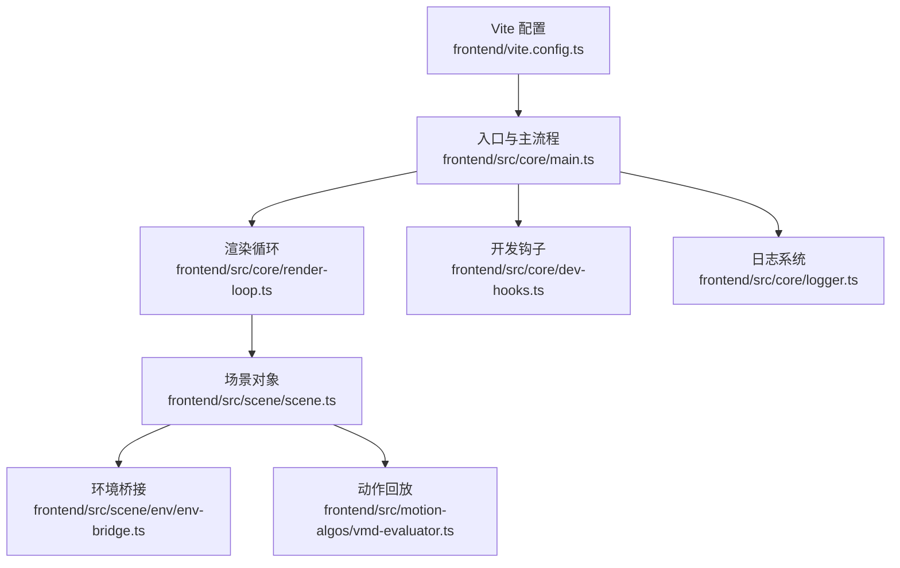
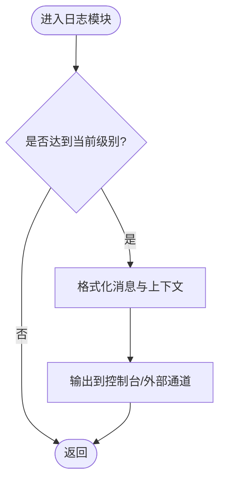
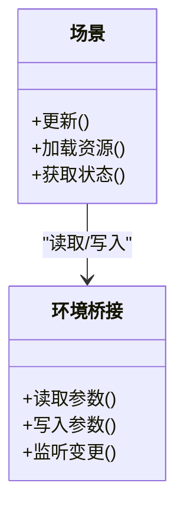
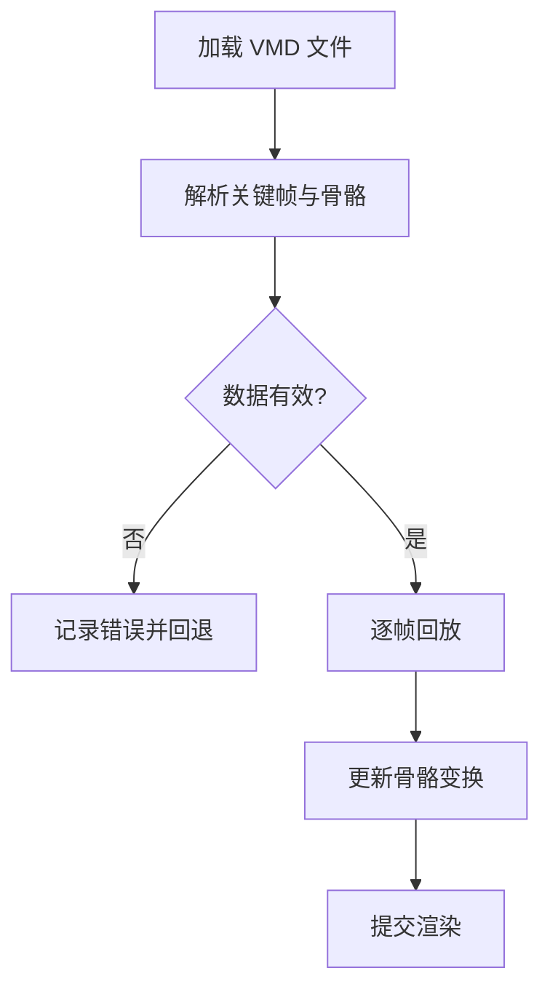
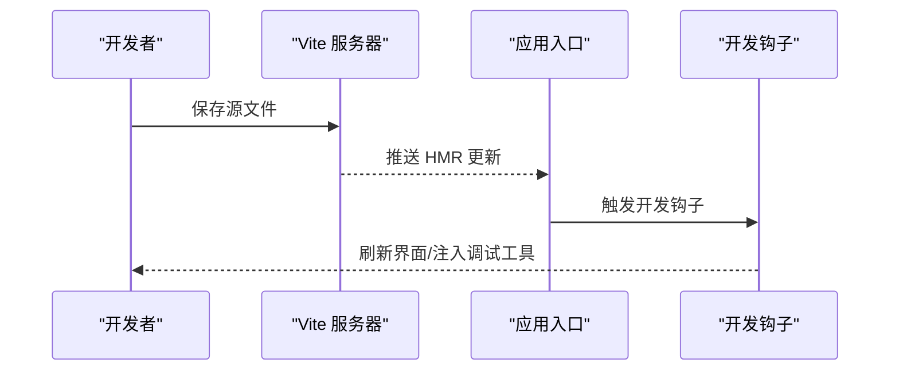
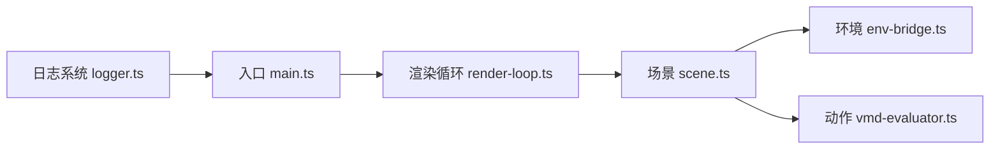

# 前端调试

<cite>
**本文引用的文件**   
- [frontend/vite.config.ts](file://frontend/vite.config.ts)
- [frontend/package.json](file://frontend/package.json)
- [frontend/src/core/logger.ts](file://frontend/src/core/logger.ts)
- [frontend/src/core/dev-hooks.ts](file://frontend/src/core/dev-hooks.ts)
- [frontend/src/core/render-loop.ts](file://frontend/src/core/render-loop.ts)
- [frontend/src/core/main.ts](file://frontend/src/core/main.ts)
- [frontend/src/scene/scene.ts](file://frontend/src/scene/scene.ts)
- [frontend/src/scene/env/env-bridge.ts](file://frontend/src/scene/env/env-bridge.ts)
- [frontend/src/motion-algos/vmd-evaluator.ts](file://frontend/src/motion-algos/vmd-evaluator.ts)
- [frontend/e2e/wails-fixture.ts](file://frontend/e2e/wails-fixture.ts)
</cite>

## 目录
1. [简介](#简介)
2. [项目结构](#项目结构)
3. [核心组件](#核心组件)
4. [架构总览](#架构总览)
5. [详细组件分析](#详细组件分析)
6. [依赖分析](#依赖分析)
7. [性能考虑](#性能考虑)
8. [故障排查指南](#故障排查指南)
9. [结论](#结论)
10. [附录](#附录)

## 简介
本指南面向使用浏览器开发者工具与 Vite 开发环境进行前端调试的工程师，覆盖控制台、网络面板、性能分析器、断点调试技巧、WebGL 渲染与 3D 场景状态监控、日志系统使用、以及常见问题的定位方法。文档同时结合本项目的前端源码结构，给出与代码对应的调试切入点与可视化流程图，帮助快速定位问题并提升调试效率。

## 项目结构
前端工程位于 frontend 目录，采用 Vite + TypeScript 构建，核心逻辑集中在 src 下：
- core：应用初始化、渲染循环、日志、UI 基础能力等
- scene：3D 场景、相机、环境、物理、动作等子系统
- motion-algos：动作算法（VMD 解析与回放）
- e2e：端到端测试夹具与用例



图表来源
- [frontend/vite.config.ts](file://frontend/vite.config.ts)
- [frontend/src/core/main.ts](file://frontend/src/core/main.ts)
- [frontend/src/core/render-loop.ts](file://frontend/src/core/render-loop.ts)
- [frontend/src/scene/scene.ts](file://frontend/src/scene/scene.ts)
- [frontend/src/scene/env/env-bridge.ts](file://frontend/src/scene/env/env-bridge.ts)
- [frontend/src/motion-algos/vmd-evaluator.ts](file://frontend/src/motion-algos/vmd-evaluator.ts)
- [frontend/src/core/dev-hooks.ts](file://frontend/src/core/dev-hooks.ts)
- [frontend/src/core/logger.ts](file://frontend/src/core/logger.ts)

章节来源
- [frontend/vite.config.ts](file://frontend/vite.config.ts)
- [frontend/src/core/main.ts](file://frontend/src/core/main.ts)

## 核心组件
- 日志系统：提供统一日志接口，支持级别过滤、格式化输出与错误追踪，便于在控制台与外部通道中观察运行时信息。
- 渲染循环：驱动每帧更新与绘制，是性能分析与 WebGL 监控的关键入口。
- 场景与环境：封装 3D 场景生命周期、资源加载、环境参数同步，适合通过断点与快照对比定位状态异常。
- 动作回放：VMD 解析与播放管线，常用于定位动画时序与骨骼变换问题。
- 开发钩子：在开发期注入调试钩子，辅助热重载与交互式调试。

章节来源
- [frontend/src/core/logger.ts](file://frontend/src/core/logger.ts)
- [frontend/src/core/render-loop.ts](file://frontend/src/core/render-loop.ts)
- [frontend/src/scene/scene.ts](file://frontend/src/scene/scene.ts)
- [frontend/src/scene/env/env-bridge.ts](file://frontend/src/scene/env/env-bridge.ts)
- [frontend/src/motion-algos/vmd-evaluator.ts](file://frontend/src/motion-algos/vmd-evaluator.ts)
- [frontend/src/core/dev-hooks.ts](file://frontend/src/core/dev-hooks.ts)

## 架构总览
下图展示从 Vite 启动到渲染循环与场景交互的主干流程，标注了关键调试节点。

```mermaid
sequenceDiagram
participant Dev as "开发者"
participant Vite as "Vite 开发服务器"
participant Main as "应用入口 main.ts"
participant Loop as "渲染循环 render-loop.ts"
participant Scene as "场景 scene.ts"
participant Env as "环境 env-bridge.ts"
participant Motion as "动作 vmd-evaluator.ts"
Dev->>Vite : 启动开发服务
Vite-->>Main : 注入模块与热更新
Main->>Loop : 初始化并启动渲染循环
Loop->>Scene : 每帧更新场景状态
Scene->>Env : 读取/写入环境参数
Scene->>Motion : 触发动作回放与插值
Loop-->>Dev : 可在此处采集性能数据与 WebGL 指标
```

图表来源
- [frontend/vite.config.ts](file://frontend/vite.config.ts)
- [frontend/src/core/main.ts](file://frontend/src/core/main.ts)
- [frontend/src/core/render-loop.ts](file://frontend/src/core/render-loop.ts)
- [frontend/src/scene/scene.ts](file://frontend/src/scene/scene.ts)
- [frontend/src/scene/env/env-bridge.ts](file://frontend/src/scene/env/env-bridge.ts)
- [frontend/src/motion-algos/vmd-evaluator.ts](file://frontend/src/motion-algos/vmd-evaluator.ts)

## 详细组件分析

### 日志系统使用指南
- 日志级别设置
  - 在开发环境建议开启更详细的日志级别，用于捕获初始化、资源加载、事件分发等关键路径。
  - 在生产环境降低日志级别以减少开销与隐私泄露风险。
- 格式化输出
  - 使用结构化日志对象，包含时间戳、模块名、上下文键值对，便于筛选与聚合。
- 错误追踪
  - 将异常堆栈与上下文一并记录，配合调用栈分析快速定位根因。
- 与浏览器控制台集成
  - 利用 console.group/groupEnd 组织输出；使用 console.table 展示列表数据；使用 console.time/timeEnd 测量耗时。
- 与 Wails 后端联动（可选）
  - 通过绑定层将前端日志转发至后端或持久化存储，便于跨进程排查。



图表来源
- [frontend/src/core/logger.ts](file://frontend/src/core/logger.ts)

章节来源
- [frontend/src/core/logger.ts](file://frontend/src/core/logger.ts)

### 渲染循环与 WebGL 性能监控
- 渲染循环职责
  - 每帧更新场景、计算物理、执行后处理、提交绘制命令。
- 性能分析要点
  - 使用性能分析器录制一帧或多帧，关注长任务、布局抖动、GPU 绘制耗时。
  - 在渲染循环前后插入计时点，统计 FPS、帧时分布、卡顿次数。
- WebGL 监控
  - 在浏览器开发者工具的 GPU 或 WebGL 面板查看绘制调用、纹理上传、着色器编译情况。
  - 关注 draw call 数量、批处理效果、深度/混合状态切换频率。
- 内存与资源
  - 使用内存快照对比，检查纹理、几何体、材质是否存在泄漏。
  - 在场景切换或资源卸载后验证引用计数与释放路径。

```mermaid
sequenceDiagram
participant Loop as "渲染循环"
participant Scene as "场景"
participant GL as "WebGL 上下文"
participant Perf as "性能分析器"
Loop->>Perf : 开始帧计时
Loop->>Scene : 更新模型/相机/环境
Scene->>GL : 提交绘制命令
GL-->>Scene : 完成绘制回调
Loop->>Perf : 结束帧计时并采样
Perf-->>Loop : 生成性能报告
```

图表来源
- [frontend/src/core/render-loop.ts](file://frontend/src/core/render-loop.ts)
- [frontend/src/scene/scene.ts](file://frontend/src/scene/scene.ts)

章节来源
- [frontend/src/core/render-loop.ts](file://frontend/src/core/render-loop.ts)
- [frontend/src/scene/scene.ts](file://frontend/src/scene/scene.ts)

### 3D 场景状态与环境参数调试
- 场景状态
  - 在场景初始化、资源加载完成、用户交互后打印关键状态（如已加载模型数、活动动作、相机参数）。
- 环境参数
  - 通过环境桥接读写全局光照、雾效、反射探针等参数，便于在 UI 调整时即时观测变化。
- 断点与条件断点
  - 在场景更新函数、环境参数 setter、动作回放关键步骤设置断点。
  - 使用条件断点过滤特定模型或动作实例，减少干扰。
- 调用栈分析
  - 当出现状态不一致时，查看调用栈确认变更来源（UI 操作、自动系统、外部事件）。



图表来源
- [frontend/src/scene/scene.ts](file://frontend/src/scene/scene.ts)
- [frontend/src/scene/env/env-bridge.ts](file://frontend/src/scene/env/env-bridge.ts)

章节来源
- [frontend/src/scene/scene.ts](file://frontend/src/scene/scene.ts)
- [frontend/src/scene/env/env-bridge.ts](file://frontend/src/scene/env/env-bridge.ts)

### 动作回放与 VMD 调试
- VMD 解析与回放
  - 在解析阶段记录关键帧数量、时间范围、骨骼列表，便于校验数据完整性。
  - 在回放阶段按帧输出骨骼变换，核对预期轨迹。
- 常见问题定位
  - 动作无反应：检查 VMD 文件路径、格式校验、播放器状态。
  - 骨骼旋转异常：检查坐标系转换、四元数归一化、插值方式。
- 断点策略
  - 在解析入口、关键帧迭代、骨骼赋值处设置断点，逐步验证中间结果。



图表来源
- [frontend/src/motion-algos/vmd-evaluator.ts](file://frontend/src/motion-algos/vmd-evaluator.ts)

章节来源
- [frontend/src/motion-algos/vmd-evaluator.ts](file://frontend/src/motion-algos/vmd-evaluator.ts)

### 开发环境与热重载
- Vite 配置要点
  - 启用热模块替换（HMR），确保修改源文件后页面局部刷新。
  - 配置代理以解决本地开发时的跨域问题（如访问后端 API）。
  - 合理设置 sourcemap，便于断点映射到源码。
- 热重载体验优化
  - 保持模块边界清晰，避免全局状态污染导致热更新失效。
  - 在开发钩子中注册调试面板或快捷命令，提升交互效率。
- 与 Wails 集成
  - 在 e2e 夹具中模拟 Wails 环境，确保本地开发与打包后行为一致。



图表来源
- [frontend/vite.config.ts](file://frontend/vite.config.ts)
- [frontend/src/core/dev-hooks.ts](file://frontend/src/core/dev-hooks.ts)
- [frontend/e2e/wails-fixture.ts](file://frontend/e2e/wails-fixture.ts)

章节来源
- [frontend/vite.config.ts](file://frontend/vite.config.ts)
- [frontend/src/core/dev-hooks.ts](file://frontend/src/core/dev-hooks.ts)
- [frontend/e2e/wails-fixture.ts](file://frontend/e2e/wails-fixture.ts)

## 依赖分析
- 模块耦合
  - 渲染循环依赖场景与环境桥接，场景依赖动作回放与环境参数。
  - 日志系统被多处消费，属于横切关注点，应保持稳定接口。
- 外部依赖
  - Vite 作为开发服务器与打包工具，影响热重载与构建产物。
  - 浏览器 API（WebGL、Performance、Memory）用于性能与资源监控。



图表来源
- [frontend/src/core/logger.ts](file://frontend/src/core/logger.ts)
- [frontend/src/core/main.ts](file://frontend/src/core/main.ts)
- [frontend/src/core/render-loop.ts](file://frontend/src/core/render-loop.ts)
- [frontend/src/scene/scene.ts](file://frontend/src/scene/scene.ts)
- [frontend/src/scene/env/env-bridge.ts](file://frontend/src/scene/env/env-bridge.ts)
- [frontend/src/motion-algos/vmd-evaluator.ts](file://frontend/src/motion-algos/vmd-evaluator.ts)

章节来源
- [frontend/package.json](file://frontend/package.json)

## 性能考虑
- 控制绘制复杂度
  - 合并材质、减少状态切换、使用实例化渲染以降低 draw call。
- 纹理与几何体管理
  - 按需加载与卸载，避免一次性加载大资源造成卡顿。
- 动作回放优化
  - 预计算关键帧插值，减少每帧计算量。
- 日志与调试开关
  - 在性能敏感路径关闭详细日志，使用条件编译或环境变量控制。

[本节为通用指导，不直接分析具体文件]

## 故障排查指南
- 控制台
  - 使用过滤器按模块或级别筛选日志；展开错误堆栈定位根因。
- 网络面板
  - 检查静态资源与 API 请求的状态码、大小、耗时；关注 CORS 与缓存策略。
- 性能分析器
  - 录制典型操作流程，识别长任务与重排重绘热点；对比不同版本差异。
- 断点调试
  - 条件断点：针对特定模型 ID 或动作名称过滤。
  - 调用栈分析：确认变更来源与传播路径。
  - 内存快照：对比加载前后与切换场景后的内存占用，定位泄漏。
- WebGL 与 3D 场景
  - 在 WebGL 面板查看绘制调用与纹理上传；在场景中打印相机矩阵、骨骼变换、环境参数。
- 常见问题与解决方案
  - 模型加载失败：检查路径、格式校验、资源可用性。
  - 动作无响应：确认播放器状态、VMD 数据有效性、骨骼映射。
  - 环境参数未生效：检查桥接写入时机与渲染循环更新顺序。
  - 热重载不生效：检查模块边界与全局状态，必要时重启开发服务器。

章节来源
- [frontend/src/core/logger.ts](file://frontend/src/core/logger.ts)
- [frontend/src/core/render-loop.ts](file://frontend/src/core/render-loop.ts)
- [frontend/src/scene/scene.ts](file://frontend/src/scene/scene.ts)
- [frontend/src/scene/env/env-bridge.ts](file://frontend/src/scene/env/env-bridge.ts)
- [frontend/src/motion-algos/vmd-evaluator.ts](file://frontend/src/motion-algos/vmd-evaluator.ts)

## 结论
通过系统化地使用浏览器开发者工具与项目内置的日志、渲染循环、场景与环境桥接、动作回放等组件，可以高效定位前端问题并优化性能。建议在开发阶段完善日志与调试钩子，在性能敏感路径谨慎使用详细日志，并结合性能分析器与 WebGL 面板持续监控与改进。

## 附录
- 常用快捷键
  - 打开开发者工具：F12 / Ctrl+Shift+I
  - 暂停执行：Ctrl+\
  - 单步执行：F10/F11
- 推荐插件
  - React/Vue DevTools（若使用相应框架）
  - WebGL Inspector（高级 WebGL 诊断）

[本节为通用补充，不直接分析具体文件]