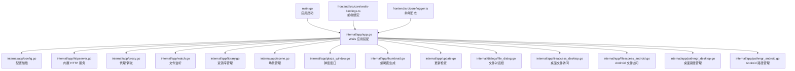
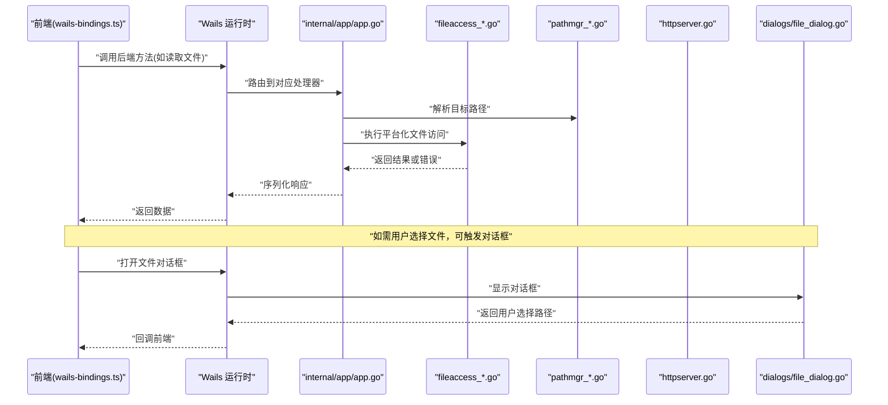
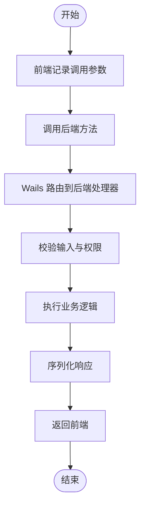
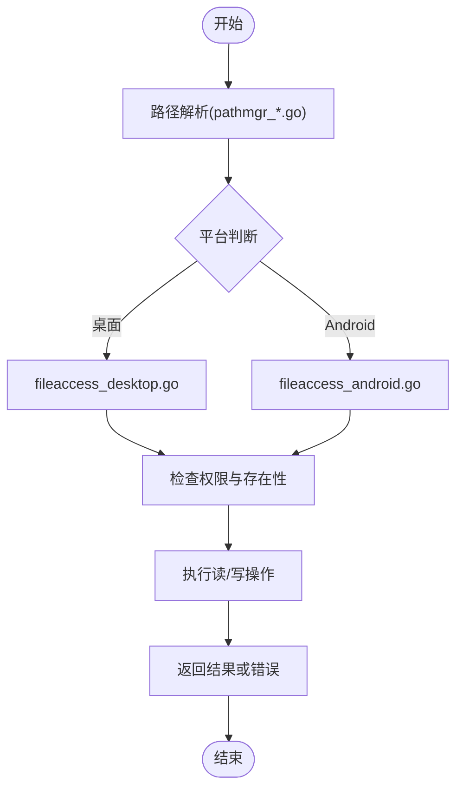
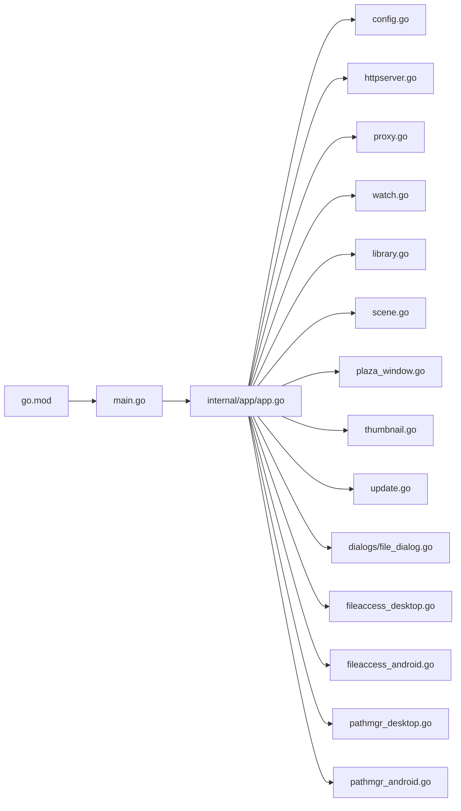

# 后端调试

<cite>
**本文引用的文件**   
- [main.go](file://main.go)
- [go.mod](file://go.mod)
- [internal/app/app.go](file://internal/app/app.go)
- [internal/app/config.go](file://internal/app/config.go)
- [internal/app/fileaccess_desktop.go](file://internal/app/fileaccess_desktop.go)
- [internal/app/fileaccess_android.go](file://internal/app/fileaccess_android.go)
- [internal/app/pathmgr_desktop.go](file://internal/app/pathmgr_desktop.go)
- [internal/app/pathmgr_android.go](file://internal/app/pathmgr_android.go)
- [internal/app/httpserver.go](file://internal/app/httpserver.go)
- [internal/app/proxy.go](file://internal/app/proxy.go)
- [internal/app/watch.go](file://internal/app/watch.go)
- [internal/app/library.go](file://internal/app/library.go)
- [internal/app/scene.go](file://internal/app/scene.go)
- [internal/app/plaza_window.go](file://internal/app/plaza_window.go)
- [internal/app/thumbnail.go](file://internal/app/thumbnail.go)
- [internal/app/update.go](file://internal/app/update.go)
- [internal/dialogs/file_dialog.go](file://internal/dialogs/file_dialog.go)
- [internal/util/safecall.go](file://internal/util/safecall.go)
- [internal/i18nerr/errors.go](file://internal/i18nerr/errors.go)
- [frontend/src/core/logger.ts](file://frontend/src/core/logger.ts)
- [frontend/src/core/wails-bindings.ts](file://frontend/src/core/wails-bindings.ts)
</cite>

## 目录
1. [简介](#简介)
2. [项目结构](#项目结构)
3. [核心组件](#核心组件)
4. [架构总览](#架构总览)
5. [详细组件分析](#详细组件分析)
6. [依赖分析](#依赖分析)
7. [性能考虑](#性能考虑)
8. [故障排查指南](#故障排查指南)
9. [结论](#结论)
10. [附录](#附录)

## 简介
本指南面向使用 Wails v3 的 Go 后端开发者，提供系统化的调试与排障方法。内容覆盖：
- Delve 调试器的安装、配置与基本操作
- 在 Wails v3 中调试后端代码（含进程间通信、文件系统访问）
- 性能分析方法（CPU 分析、内存泄漏检测、goroutine 监控）
- 跨平台问题定位（桌面与 Android 差异）
- 错误处理最佳实践与日志记录策略
- 常见后端问题的调试技巧与解决方案

## 项目结构
本项目采用前后端分离的 Wails v3 应用结构：
- 前端位于 frontend 目录，通过 Wails 绑定调用后端能力
- 后端位于 internal 目录，按功能模块划分（app、dialogs、util、i18nerr 等）
- 入口 main.go 负责初始化 Wails 应用并注册后端服务

图表来源
- [main.go:1-200](file://main.go#L1-L200)
- [internal/app/app.go:1-200](file://internal/app/app.go#L1-L200)
- [internal/app/config.go:1-200](file://internal/app/config.go#L1-L200)
- [internal/app/httpserver.go:1-200](file://internal/app/httpserver.go#L1-L200)
- [internal/app/proxy.go:1-200](file://internal/app/proxy.go#L1-L200)
- [internal/app/watch.go:1-200](file://internal/app/watch.go#L1-L200)
- [internal/app/library.go:1-200](file://internal/app/library.go#L1-L200)
- [internal/app/scene.go:1-200](file://internal/app/scene.go#L1-L200)
- [internal/app/plaza_window.go:1-200](file://internal/app/plaza_window.go#L1-L200)
- [internal/app/thumbnail.go:1-200](file://internal/app/thumbnail.go#L1-L200)
- [internal/app/update.go:1-200](file://internal/app/update.go#L1-L200)
- [internal/dialogs/file_dialog.go:1-200](file://internal/dialogs/file_dialog.go#L1-L200)
- [internal/app/fileaccess_desktop.go:1-200](file://internal/app/fileaccess_desktop.go#L1-L200)
- [internal/app/fileaccess_android.go:1-200](file://internal/app/fileaccess_android.go#L1-L200)
- [internal/app/pathmgr_desktop.go:1-200](file://internal/app/pathmgr_desktop.go#L1-L200)
- [internal/app/pathmgr_android.go:1-200](file://internal/app/pathmgr_android.go#L1-L200)
- [frontend/src/core/wails-bindings.ts:1-200](file://frontend/src/core/wails-bindings.ts#L1-L200)
- [frontend/src/core/logger.ts:1-200](file://frontend/src/core/logger.ts#L1-L200)

章节来源
- [main.go:1-200](file://main.go#L1-L200)
- [internal/app/app.go:1-200](file://internal/app/app.go#L1-L200)

## 核心组件
- 应用装配与生命周期
  - 入口 main.go 负责创建 Wails 应用实例、注册后端方法与事件总线
  - internal/app/app.go 集中装配各子系统（配置、HTTP、窗口、文件访问、路径管理等）
- 配置与运行模式
  - internal/app/config.go 提供配置加载与默认值合并
- 文件系统与路径
  - internal/app/fileaccess_desktop.go / fileaccess_android.go 实现平台差异化文件访问
  - internal/app/pathmgr_desktop.go / pathmgr_android.go 封装平台相关路径解析
- 网络与代理
  - internal/app/httpserver.go 提供本地 HTTP 服务
  - internal/app/proxy.go 实现请求转发与代理逻辑
- 资源与场景
  - internal/app/library.go 管理资源库
  - internal/app/scene.go 管理场景状态与数据
- UI 与交互
  - internal/dialogs/file_dialog.go 提供文件选择对话框
  - internal/app/plaza_window.go 管理弹窗窗口
- 辅助能力
  - internal/app/thumbnail.go 缩略图生成
  - internal/app/update.go 版本更新检查
  - internal/util/safecall.go 安全调用包装
  - internal/i18nerr/errors.go 国际化错误定义

章节来源
- [main.go:1-200](file://main.go#L1-L200)
- [internal/app/app.go:1-200](file://internal/app/app.go#L1-L200)
- [internal/app/config.go:1-200](file://internal/app/config.go#L1-L200)
- [internal/app/fileaccess_desktop.go:1-200](file://internal/app/fileaccess_desktop.go#L1-L200)
- [internal/app/fileaccess_android.go:1-200](file://internal/app/fileaccess_android.go#L1-L200)
- [internal/app/pathmgr_desktop.go:1-200](file://internal/app/pathmgr_desktop.go#L1-L200)
- [internal/app/pathmgr_android.go:1-200](file://internal/app/pathmgr_android.go#L1-L200)
- [internal/app/httpserver.go:1-200](file://internal/app/httpserver.go#L1-L200)
- [internal/app/proxy.go:1-200](file://internal/app/proxy.go#L1-L200)
- [internal/app/library.go:1-200](file://internal/app/library.go#L1-L200)
- [internal/app/scene.go:1-200](file://internal/app/scene.go#L1-L200)
- [internal/dialogs/file_dialog.go:1-200](file://internal/dialogs/file_dialog.go#L1-L200)
- [internal/app/plaza_window.go:1-200](file://internal/app/plaza_window.go#L1-L200)
- [internal/app/thumbnail.go:1-200](file://internal/app/thumbnail.go#L1-L200)
- [internal/app/update.go:1-200](file://internal/app/update.go#L1-L200)
- [internal/util/safecall.go:1-200](file://internal/util/safecall.go#L1-L200)
- [internal/i18nerr/errors.go:1-200](file://internal/i18nerr/errors.go#L1-L200)

## 架构总览
下图展示 Wails v3 前后端交互与后端内部关键模块关系。前端通过 wails-bindings 调用后端暴露的方法；后端在 app.go 中统一装配，并根据平台选择不同实现。

图表来源
- [frontend/src/core/wails-bindings.ts:1-200](file://frontend/src/core/wails-bindings.ts#L1-L200)
- [internal/app/app.go:1-200](file://internal/app/app.go#L1-L200)
- [internal/app/fileaccess_desktop.go:1-200](file://internal/app/fileaccess_desktop.go#L1-L200)
- [internal/app/fileaccess_android.go:1-200](file://internal/app/fileaccess_android.go#L1-L200)
- [internal/app/pathmgr_desktop.go:1-200](file://internal/app/pathmgr_desktop.go#L1-L200)
- [internal/app/pathmgr_android.go:1-200](file://internal/app/pathmgr_android.go#L1-L200)
- [internal/app/httpserver.go:1-200](file://internal/app/httpserver.go#L1-L200)
- [internal/dialogs/file_dialog.go:1-200](file://internal/dialogs/file_dialog.go#L1-L200)

## 详细组件分析

### Delve 调试器安装与配置
- 安装 Delve
  - 参考官方文档进行安装与签名配置（Windows 需允许未签名调试器）
- VS Code 集成
  - 安装 Go 扩展与 Delve 支持
  - 配置 launch.json 以附加到 Wails 进程或启动调试
- 命令行调试
  - 使用 dlv debug 启动应用
  - 使用 dlv attach 附加到已运行的 Wails 进程

章节来源
- [go.mod:1-200](file://go.mod#L1-L200)

### Wails v3 后端调试要点
- 启动与断点
  - 在 main.go 与 internal/app/app.go 设置断点，观察应用装配过程
  - 对后端方法（如文件访问、HTTP 路由）设置条件断点
- 进程间通信调试
  - 在前端 wails-bindings.ts 添加日志输出，确认参数与返回值
  - 在后端处理器入口处打印入参与出参，比对前后端契约
- 文件系统访问调试
  - 在 fileaccess_desktop.go / fileaccess_android.go 设置断点，验证路径解析与权限
  - 结合 pathmgr_desktop.go / pathmgr_android.go 检查平台差异

章节来源
- [main.go:1-200](file://main.go#L1-L200)
- [internal/app/app.go:1-200](file://internal/app/app.go#L1-L200)
- [frontend/src/core/wails-bindings.ts:1-200](file://frontend/src/core/wails-bindings.ts#L1-L200)
- [internal/app/fileaccess_desktop.go:1-200](file://internal/app/fileaccess_desktop.go#L1-L200)
- [internal/app/fileaccess_android.go:1-200](file://internal/app/fileaccess_android.go#L1-L200)
- [internal/app/pathmgr_desktop.go:1-200](file://internal/app/pathmgr_desktop.go#L1-L200)
- [internal/app/pathmgr_android.go:1-200](file://internal/app/pathmgr_android.go#L1-L200)

### 进程间通信调试流程

图表来源
- [frontend/src/core/wails-bindings.ts:1-200](file://frontend/src/core/wails-bindings.ts#L1-L200)
- [internal/app/app.go:1-200](file://internal/app/app.go#L1-L200)

### 文件系统访问调试流程

图表来源
- [internal/app/pathmgr_desktop.go:1-200](file://internal/app/pathmgr_desktop.go#L1-L200)
- [internal/app/pathmgr_android.go:1-200](file://internal/app/pathmgr_android.go#L1-L200)
- [internal/app/fileaccess_desktop.go:1-200](file://internal/app/fileaccess_desktop.go#L1-L200)
- [internal/app/fileaccess_android.go:1-200](file://internal/app/fileaccess_android.go#L1-L200)

### 错误处理与日志记录策略
- 错误类型与国际化
  - 使用 internal/i18nerr/errors.go 定义结构化错误，便于前端展示与翻译
- 安全调用包装
  - 使用 internal/util/safecall.go 包裹可能崩溃的操作，避免主进程异常退出
- 日志记录
  - 后端建议统一日志格式（时间戳、级别、模块、消息、上下文键值）
  - 前端通过 frontend/src/core/logger.ts 记录关键调用链，配合后端日志交叉定位

章节来源
- [internal/i18nerr/errors.go:1-200](file://internal/i18nerr/errors.go#L1-L200)
- [internal/util/safecall.go:1-200](file://internal/util/safecall.go#L1-L200)
- [frontend/src/core/logger.ts:1-200](file://frontend/src/core/logger.ts#L1-L200)

### 性能分析方法
- CPU 分析
  - 使用 Delve 的 pprof 集成或 go tool pprof 采集 CPU profile
  - 关注热点函数与 goroutine 阻塞点
- 内存泄漏检测
  - 采集 heap profile，对比不同阶段的对象增长
  - 重点检查大对象（模型、纹理、缓存）的生命周期与释放
- goroutine 监控
  - 使用 runtime/pprof 的 goroutine profile 查看并发情况
  - 结合日志标记关键协程 ID，追踪异步任务完成状态

章节来源
- [internal/app/app.go:1-200](file://internal/app/app.go#L1-L200)
- [internal/app/httpserver.go:1-200](file://internal/app/httpserver.go#L1-L200)

### 跨平台问题调试
- 行为差异
  - 桌面与 Android 的文件系统权限、路径分隔符、沙箱限制不同
  - 使用 pathmgr_* 与 fileaccess_* 的平台分支隔离差异
- 调试技巧
  - 在平台分支入口设置断点，打印当前平台与环境变量
  - 使用统一的错误码与日志前缀，快速区分平台来源

章节来源
- [internal/app/pathmgr_desktop.go:1-200](file://internal/app/pathmgr_desktop.go#L1-L200)
- [internal/app/pathmgr_android.go:1-200](file://internal/app/pathmgr_android.go#L1-L200)
- [internal/app/fileaccess_desktop.go:1-200](file://internal/app/fileaccess_desktop.go#L1-L200)
- [internal/app/fileaccess_android.go:1-200](file://internal/app/fileaccess_android.go#L1-L200)

## 依赖分析
- 外部依赖
  - go.mod 声明了 Wails v3 及相关第三方库
- 内部耦合
  - app.go 作为装配中心，依赖多个子模块（配置、HTTP、文件访问、路径管理、窗口、缩略图、更新等）
  - 平台差异通过构建标签与文件名后缀隔离，降低耦合度

图表来源
- [go.mod:1-200](file://go.mod#L1-L200)
- [main.go:1-200](file://main.go#L1-L200)
- [internal/app/app.go:1-200](file://internal/app/app.go#L1-L200)
- [internal/app/config.go:1-200](file://internal/app/config.go#L1-L200)
- [internal/app/httpserver.go:1-200](file://internal/app/httpserver.go#L1-L200)
- [internal/app/proxy.go:1-200](file://internal/app/proxy.go#L1-L200)
- [internal/app/watch.go:1-200](file://internal/app/watch.go#L1-L200)
- [internal/app/library.go:1-200](file://internal/app/library.go#L1-L200)
- [internal/app/scene.go:1-200](file://internal/app/scene.go#L1-L200)
- [internal/app/plaza_window.go:1-200](file://internal/app/plaza_window.go#L1-L200)
- [internal/app/thumbnail.go:1-200](file://internal/app/thumbnail.go#L1-L200)
- [internal/app/update.go:1-200](file://internal/app/update.go#L1-L200)
- [internal/dialogs/file_dialog.go:1-200](file://internal/dialogs/file_dialog.go#L1-L200)
- [internal/app/fileaccess_desktop.go:1-200](file://internal/app/fileaccess_desktop.go#L1-L200)
- [internal/app/fileaccess_android.go:1-200](file://internal/app/fileaccess_android.go#L1-L200)
- [internal/app/pathmgr_desktop.go:1-200](file://internal/app/pathmgr_desktop.go#L1-L200)
- [internal/app/pathmgr_android.go:1-200](file://internal/app/pathmgr_android.go#L1-L200)

章节来源
- [go.mod:1-200](file://go.mod#L1-L200)
- [internal/app/app.go:1-200](file://internal/app/app.go#L1-L200)

## 性能考虑
- 减少不必要的同步阻塞
  - 将耗时操作放入独立 goroutine，并通过事件或回调通知前端
- 控制并发度
  - 使用信号量或工作池限制并发文件读写与网络请求
- 缓存与去重
  - 对频繁访问的资源（缩略图、预设）建立缓存层，避免重复计算
- 资源生命周期管理
  - 明确对象创建与释放时机，避免大对象长期驻留导致内存增长

[本节为通用指导，不直接分析具体文件]

## 故障排查指南
- 常见问题与定位步骤
  - 文件无法访问
    - 检查路径解析是否正确（pathmgr_*），确认平台权限（fileaccess_*）
    - 在前端与后端同时记录调用链，比对路径与权限
  - 跨域或网络异常
    - 检查 httpserver.go 与 proxy.go 的配置与转发规则
    - 使用浏览器开发者工具与后端日志交叉验证
  - 界面无响应
    - 使用 goroutine profile 查看是否存在阻塞
    - 检查 safecall 是否捕获了 panic 并正确恢复
- 日志与错误信息
  - 统一错误码与消息模板，便于检索与聚合
  - 在关键路径增加上下文字段（用户、会话、资源标识）

章节来源
- [internal/app/fileaccess_desktop.go:1-200](file://internal/app/fileaccess_desktop.go#L1-L200)
- [internal/app/fileaccess_android.go:1-200](file://internal/app/fileaccess_android.go#L1-L200)
- [internal/app/pathmgr_desktop.go:1-200](file://internal/app/pathmgr_desktop.go#L1-L200)
- [internal/app/pathmgr_android.go:1-200](file://internal/app/pathmgr_android.go#L1-L200)
- [internal/app/httpserver.go:1-200](file://internal/app/httpserver.go#L1-L200)
- [internal/app/proxy.go:1-200](file://internal/app/proxy.go#L1-L200)
- [internal/util/safecall.go:1-200](file://internal/util/safecall.go#L1-L200)
- [internal/i18nerr/errors.go:1-200](file://internal/i18nerr/errors.go#L1-L200)

## 结论
通过合理的调试器配置、清晰的日志与错误处理策略、以及针对平台差异的隔离设计，可以高效定位与解决 Wails v3 后端的各类问题。建议在开发阶段即引入性能分析与监控手段，持续优化并发与资源管理，提升应用稳定性与用户体验。

[本节为总结性内容，不直接分析具体文件]

## 附录
- 常用命令与技巧
  - 启动调试：dlv debug ./...
  - 附加进程：dlv attach <pid>
  - 导出 pprof：go tool pprof -http=:8080 cpu.prof
- 推荐工具
  - VS Code + Go 扩展 + Delve
  - Chrome DevTools（前端侧）
  - 系统级监控（htop、Activity Monitor、Android Studio Profiler）

[本节为补充信息，不直接分析具体文件]