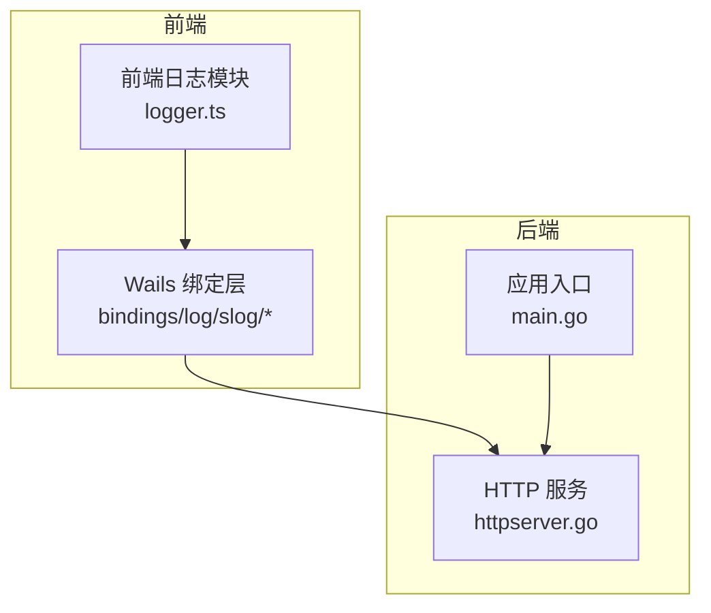
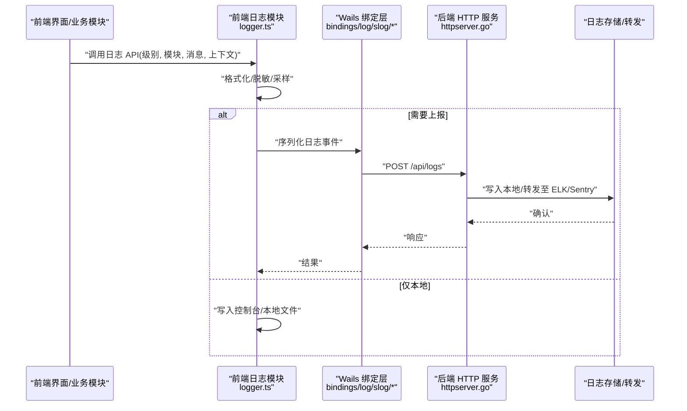
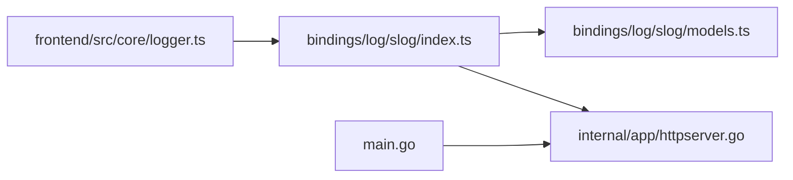

# 日志系统

<cite>
**本文引用的文件**   
- [frontend/src/core/logger.ts](file://frontend/src/core/logger.ts)
- [frontend/bindings/log/slog/index.ts](file://frontend/bindings/log/slog/index.ts)
- [frontend/bindings/log/slog/models.ts](file://frontend/bindings/log/slog/models.ts)
- [internal/app/httpserver.go](file://internal/app/httpserver.go)
- [main.go](file://main.go)
</cite>

## 目录
1. [简介](#简介)
2. [项目结构](#项目结构)
3. [核心组件](#核心组件)
4. [架构总览](#架构总览)
5. [详细组件分析](#详细组件分析)
6. [依赖关系分析](#依赖关系分析)
7. [性能考量](#性能考量)
8. [故障排查指南](#故障排查指南)
9. [结论](#结论)
10. [附录](#附录) 

## 简介
本文件面向前后端开发者与运维人员，系统性梳理 MikuMikuAR 的日志体系：包括日志级别、格式规范、存储策略、输出配置（控制台/文件/远程）、解析方法、分析技巧、第三方集成（ELK/Sentry）以及安全与脱敏策略。文档同时提供架构图、时序图与流程图，帮助快速定位问题与优化性能。

## 项目结构
前端日志能力由浏览器侧的日志模块与 Wails 绑定层组成；后端通过 Go 标准库 slog 暴露 HTTP 接口供前端收集或转发。关键文件分布如下：
- 前端日志核心：frontend/src/core/logger.ts
- Wails 绑定层（slog 桥接）：frontend/bindings/log/slog/index.ts、models.ts
- 后端 HTTP 服务（含日志相关中间件/路由）：internal/app/httpserver.go
- 应用入口（初始化与启动）：main.go

图表来源
- [frontend/src/core/logger.ts](file://frontend/src/core/logger.ts)
- [frontend/bindings/log/slog/index.ts](file://frontend/bindings/log/slog/index.ts)
- [frontend/bindings/log/slog/models.ts](file://frontend/bindings/log/slog/models.ts)
- [internal/app/httpserver.go](file://internal/app/httpserver.go)
- [main.go](file://main.go)

章节来源
- [frontend/src/core/logger.ts](file://frontend/src/core/logger.ts)
- [frontend/bindings/log/slog/index.ts](file://frontend/bindings/log/slog/index.ts)
- [frontend/bindings/log/slog/models.ts](file://frontend/bindings/log/slog/models.ts)
- [internal/app/httpserver.go](file://internal/app/httpserver.go)
- [main.go](file://main.go)

## 核心组件
- 前端日志模块
  - 职责：统一封装日志 API（如 info/warn/error/debug），格式化时间戳、模块标识、上下文，并选择输出目标（控制台/网络）。
  - 关键点：支持运行时切换级别、批量写入、错误堆栈捕获与序列化。
- Wails 绑定层（slog 桥接）
  - 职责：将前端日志事件映射到后端 slog 模型，便于统一处理与持久化。
  - 关键点：定义结构化日志模型（时间、级别、模块、消息、元数据等）。
- 后端 HTTP 服务
  - 职责：提供日志接收/查询/导出等 HTTP 接口；可结合中间件进行鉴权、限流、审计。
  - 关键点：与 Go slog 集成，支持写入本地文件或转发至远端采集器。
- 应用入口
  - 职责：初始化全局配置、注册路由、启动 HTTP 服务。
  - 关键点：注入日志级别、输出目标、采样策略等。

章节来源
- [frontend/src/core/logger.ts](file://frontend/src/core/logger.ts)
- [frontend/bindings/log/slog/index.ts](file://frontend/bindings/log/slog/index.ts)
- [frontend/bindings/log/slog/models.ts](file://frontend/bindings/log/slog/models.ts)
- [internal/app/httpserver.go](file://internal/app/httpserver.go)
- [main.go](file://main.go)

## 架构总览
整体采用“前端轻量记录 + 后端集中汇聚”的模式：前端负责低开销记录与必要格式化，必要时通过网络上报；后端作为日志网关，统一接入、落盘与转发。

图表来源
- [frontend/src/core/logger.ts](file://frontend/src/core/logger.ts)
- [frontend/bindings/log/slog/index.ts](file://frontend/bindings/log/slog/index.ts)
- [frontend/bindings/log/slog/models.ts](file://frontend/bindings/log/slog/models.ts)
- [internal/app/httpserver.go](file://internal/app/httpserver.go)

## 详细组件分析

### 前端日志模块（logger.ts）
- 设计要点
  - 日志级别：建议至少包含 debug/info/warn/error/fatal，并提供运行时开关。
  - 格式规范：时间戳（ISO 8601 或 UTC）、模块标识、级别、消息、上下文键值对、错误堆栈。
  - 输出策略：默认控制台输出；生产环境可关闭 debug；可选本地文件缓冲与网络上报。
  - 性能优化：采样（高频路径降采样）、批处理（合并多条日志一次发送）、异步队列（避免阻塞主线程）。
  - 安全与脱敏：自动过滤敏感字段（如 token、密码、手机号、身份证等），支持自定义脱敏规则。
- 使用建议
  - 在模块入口处注入模块标识，便于聚合统计。
  - 错误日志附带堆栈与上下文快照，减少复现成本。
  - 对热路径使用 warn/error 级别，避免过度打点影响性能。

章节来源
- [frontend/src/core/logger.ts](file://frontend/src/core/logger.ts)

### Wails 绑定层（bindings/log/slog/index.ts, models.ts）
- 设计要点
  - 模型定义：时间、级别、模块、消息、元数据、堆栈、来源进程/会话 ID。
  - 序列化：确保跨语言一致的时间与时区表示；对象转 JSON 时剔除循环引用。
  - 传输：基于 HTTP POST 提交结构化日志；失败重试与退避策略。
- 与后端契约
  - 请求体遵循 models.ts 定义的结构；后端校验必填字段与类型。
  - 响应码约定：2xx 成功，4xx/5xx 失败；错误信息需包含可追踪的请求 ID。

章节来源
- [frontend/bindings/log/slog/index.ts](file://frontend/bindings/log/slog/index.ts)
- [frontend/bindings/log/slog/models.ts](file://frontend/bindings/log/slog/models.ts)

### 后端 HTTP 服务（httpserver.go）
- 设计要点
  - 路由：/api/logs 接收前端日志；/api/logs/export 导出；/api/logs/stats 统计。
  - 中间件：鉴权、速率限制、审计、CORS。
  - 存储：本地文件按日期/模块分片；可选远端推送（ELK/Sentry）。
  - 性能：写放大控制（缓冲+刷盘策略）、压缩归档、索引优化。
- 与 Go slog 集成
  - 使用标准库 slog 统一内部日志；对外暴露结构化接口。
  - 支持 Handler 链式组合（控制台、文件、网络）。

章节来源
- [internal/app/httpserver.go](file://internal/app/httpserver.go)

### 应用入口（main.go）
- 设计要点
  - 初始化：加载配置（日志级别、输出目标、采样率、远端地址）。
  - 启动：注册路由、启动 HTTP 服务、设置优雅退出。
  - 生命周期：监听信号量，完成日志缓冲落盘后退出。

章节来源
- [main.go](file://main.go)

## 依赖关系分析
- 前端 logger.ts 依赖 bindings/log/slog 提供的模型与传输能力。
- bindings/log/slog 依赖 httpserver.go 暴露的 REST 接口。
- httpserver.go 依赖 Go slog 与存储/转发组件。
- main.go 驱动整个应用生命周期与配置注入。

图表来源
- [frontend/src/core/logger.ts](file://frontend/src/core/logger.ts)
- [frontend/bindings/log/slog/index.ts](file://frontend/bindings/log/slog/index.ts)
- [frontend/bindings/log/slog/models.ts](file://frontend/bindings/log/slog/models.ts)
- [internal/app/httpserver.go](file://internal/app/httpserver.go)
- [main.go](file://main.go)

章节来源
- [frontend/src/core/logger.ts](file://frontend/src/core/logger.ts)
- [frontend/bindings/log/slog/index.ts](file://frontend/bindings/log/slog/index.ts)
- [frontend/bindings/log/slog/models.ts](file://frontend/bindings/log/slog/models.ts)
- [internal/app/httpserver.go](file://internal/app/httpserver.go)
- [main.go](file://main.go)

## 性能考量
- 前端
  - 采样：高频路径按百分比采样，降低网络与 CPU 压力。
  - 批处理：合并多条日志为一次请求，减少握手开销。
  - 异步：使用微任务/队列避免阻塞渲染与交互。
  - 体积控制：精简上下文，避免大对象序列化。
- 后端
  - 缓冲：内存环形缓冲 + 定时刷盘，平衡吞吐与延迟。
  - 压缩：归档前压缩，节省磁盘空间。
  - 索引：按时间、模块、级别建立索引，加速检索。
  - 限流：防止恶意或异常客户端打爆接口。

[本节为通用指导，不直接分析具体文件]

## 故障排查指南
- 常见问题
  - 日志缺失：检查前端级别是否过低、网络上报是否被拦截、后端路由是否启用。
  - 乱码/时区不一致：统一使用 ISO 8601 与 UTC 时间戳。
  - 堆栈不可读：确保前端捕获完整堆栈并在后端保留原始字符串。
  - 性能抖动：定位高频日志点，开启采样或降级为 warn。
- 定位步骤
  - 从错误级别筛选，结合模块标识缩小范围。
  - 根据会话/请求 ID 串联前后端日志。
  - 对比时间轴，识别异常前后操作序列。
  - 导出最近窗口日志，离线分析模式匹配。

章节来源
- [frontend/src/core/logger.ts](file://frontend/src/core/logger.ts)
- [internal/app/httpserver.go](file://internal/app/httpserver.go)

## 结论
本日志系统以前端轻量记录、后端集中汇聚为核心思路，兼顾性能与安全。通过统一的级别与格式、灵活的输出策略、完善的解析与分析手段，可有效支撑日常排障与性能优化。后续可按需扩展更多远端集成与高级分析能力。

[本节为总结性内容，不直接分析具体文件]

## 附录

### 日志级别定义
- debug：调试信息，开发环境开启，生产默认关闭。
- info：一般运行信息，用于流程跟踪。
- warn：潜在风险或降级路径，需关注。
- error：错误发生，需立即处理。
- fatal：致命错误，通常触发崩溃或重启。

[本节为通用规范说明，不直接分析具体文件]

### 日志格式规范
- 时间戳：ISO 8601（UTC），示例字段名 timestamp。
- 级别：string，取值 debug/info/warn/error/fatal。
- 模块：string，标识来源模块/子系统。
- 消息：string，人类可读描述。
- 上下文：object，键值对，避免大对象与敏感字段。
- 堆栈：string，错误堆栈原文，便于还原现场。
- 附加：trace_id/session_id/request_id 等关联标识。

[本节为通用规范说明，不直接分析具体文件]

### 存储策略
- 本地文件：按日期与模块分目录，滚动归档，压缩保存。
- 远端收集：优先推送到 ELK/Sentry，失败回退本地缓存。
- 保留策略：按大小/时间清理，保留周期可配置。

[本节为通用规范说明，不直接分析具体文件]

### 配置输出（控制台/文件/远程）
- 控制台：开发环境默认开启，生产可关闭。
- 文件：指定路径与轮转策略，注意权限与磁盘配额。
- 远程：配置服务端地址、鉴权、重试与超时。

[本节为通用规范说明，不直接分析具体文件]

### 解析方法与提取技巧
- 时间戳：统一转换为本地时区展示。
- 模块标识：用于聚合统计与告警分组。
- 错误堆栈：正则提取异常类型与行号，辅助定位。
- 关联追踪：基于 trace_id 串联前后端链路。

[本节为通用规范说明，不直接分析具体文件]

### 日志分析技巧
- 关键信息筛选：按级别、模块、关键字过滤。
- 错误模式识别：聚类相似错误，识别回归与趋势。
- 性能瓶颈定位：结合耗时上下文与采样日志，定位热点路径。

[本节为通用规范说明，不直接分析具体文件]

### 第三方集成（ELK/Sentry）
- ELK Stack
  - 使用 Filebeat/Fluent Bit 采集本地日志，经 Logstash 清洗后入 Elasticsearch，Kibana 可视化。
  - 建议为常用字段建索引，提升查询性能。
- Sentry
  - 前端捕获未处理异常与 Promise 拒绝，上报 Sentry；后端通过 SDK 上报关键错误。
  - 利用 release/tag 与用户上下文增强可观测性。

[本节为通用规范说明，不直接分析具体文件]

### 安全考虑与数据脱敏
- 脱敏策略
  - 内置规则：token、密码、手机号、邮箱、身份证号、银行卡号等。
  - 自定义规则：正则表达式替换，支持白名单字段豁免。
  - 上下文裁剪：移除大对象与不必要字段，降低泄露面。
- 传输安全
  - HTTPS 强制，证书校验，防中间人攻击。
  - 鉴权：API Key/OAuth，最小权限原则。
- 存储安全
  - 磁盘加密、访问控制、审计日志。
  - 定期轮换密钥与清理过期数据。

[本节为通用规范说明，不直接分析具体文件]