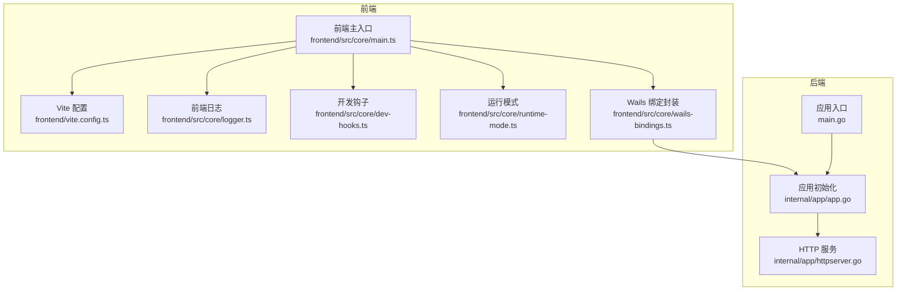
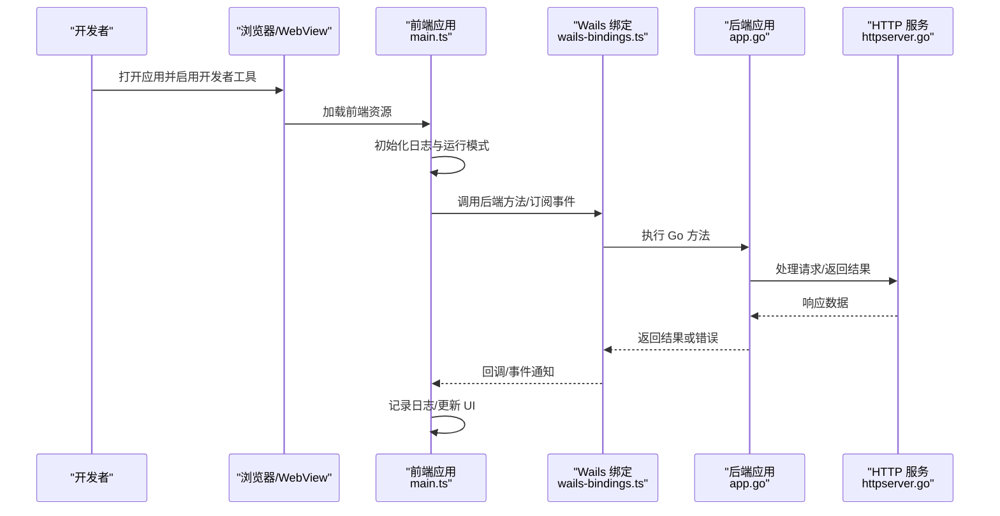
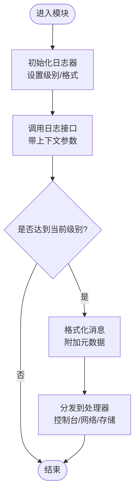
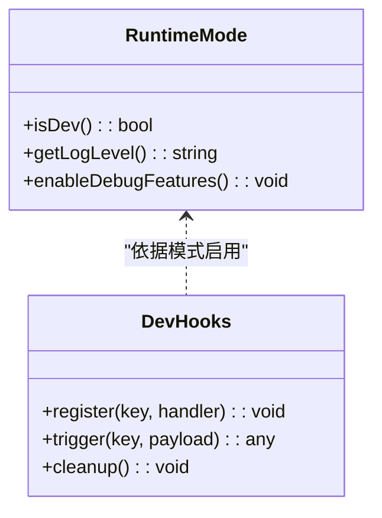
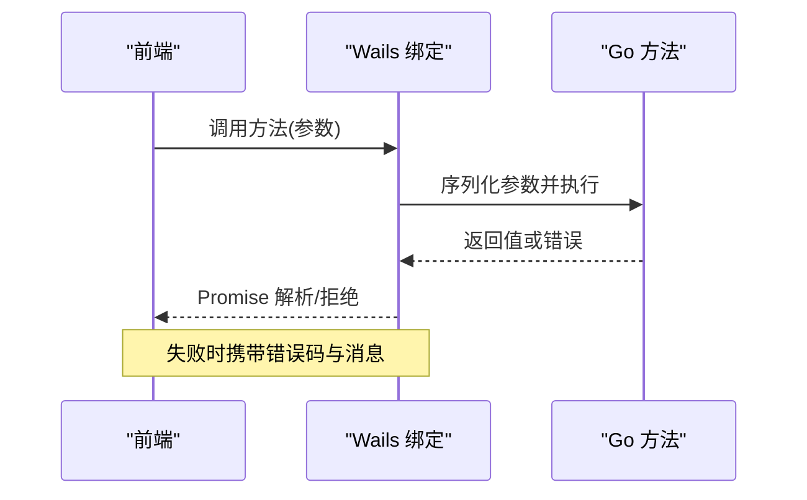
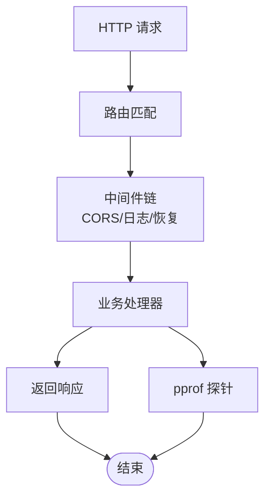
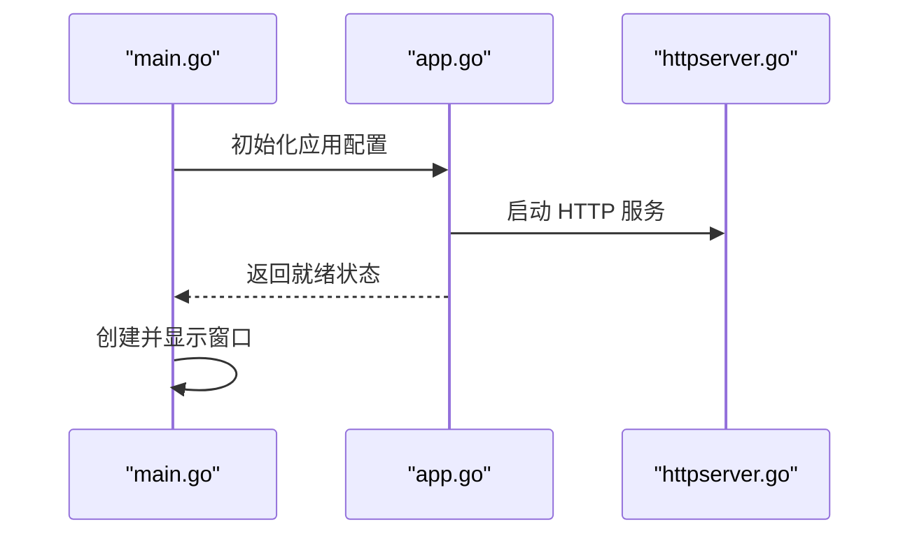
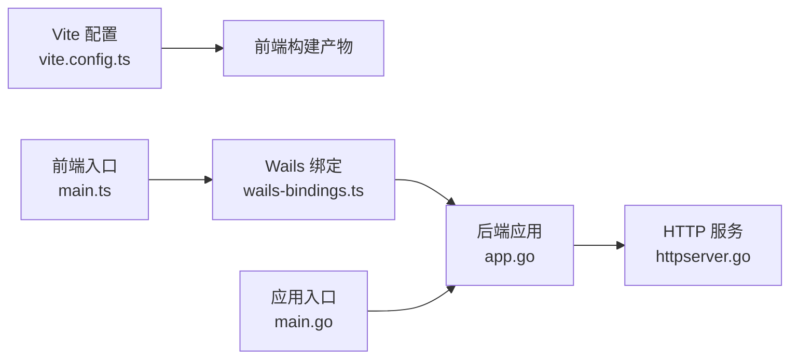

# 调试指南

<cite>
**本文引用的文件**   
- [main.go](file://main.go)
- [frontend/src/core/logger.ts](file://frontend/src/core/logger.ts)
- [frontend/src/core/dev-hooks.ts](file://frontend/src/core/dev-hooks.ts)
- [frontend/src/core/runtime-mode.ts](file://frontend/src/core/runtime-mode.ts)
- [frontend/vite.config.ts](file://frontend/vite.config.ts)
- [frontend/package.json](file://frontend/package.json)
- [internal/app/httpserver.go](file://internal/app/httpserver.go)
- [internal/app/app.go](file://internal/app/app.go)
- [frontend/src/core/wails-bindings.ts](file://frontend/src/core/wails-bindings.ts)
- [frontend/src/core/main.ts](file://frontend/src/core/main.ts)
</cite>

## 目录
1. [简介](#简介)
2. [项目结构](#项目结构)
3. [核心组件](#核心组件)
4. [架构总览](#架构总览)
5. [详细组件分析](#详细组件分析)
6. [依赖关系分析](#依赖关系分析)
7. [性能考虑](#性能考虑)
8. [故障排查指南](#故障排查指南)
9. [结论](#结论)
10. [附录](#附录)

## 简介
本指南面向 MikuMikuAR 的前后端开发者，提供一套完整的调试方法与工具使用说明。内容涵盖：
- 前端：浏览器开发者工具、Vite 开发服务器与热重载、日志系统、网络请求监控、内存与性能分析、断点调试等
- 后端（Go）：Wails 应用启动、HTTP 服务、日志与错误追踪、pprof 性能分析、Delve 调试器配置
- 前后端联调：Wails 绑定、事件通道、跨域与资源加载问题定位
- 环境搭建：开发模式、生产模式切换、详细日志输出开关、关键信息提取技巧

## 项目结构
本项目采用 Wails v3 框架，前端基于 Vite + TypeScript，后端为 Go。关键目录与职责：
- frontend：前端源码、构建脚本、测试与 E2E
- internal/app：Go 后端业务逻辑、HTTP 服务、平台适配、Wails 绑定
- main.go：应用入口，初始化 Wails 运行时与后端模块

图表来源
- [frontend/src/core/main.ts](file://frontend/src/core/main.ts)
- [frontend/vite.config.ts](file://frontend/vite.config.ts)
- [frontend/src/core/logger.ts](file://frontend/src/core/logger.ts)
- [frontend/src/core/dev-hooks.ts](file://frontend/src/core/dev-hooks.ts)
- [frontend/src/core/runtime-mode.ts](file://frontend/src/core/runtime-mode.ts)
- [frontend/src/core/wails-bindings.ts](file://frontend/src/core/wails-bindings.ts)
- [main.go](file://main.go)
- [internal/app/app.go](file://internal/app/app.go)
- [internal/app/httpserver.go](file://internal/app/httpserver.go)

章节来源
- [main.go](file://main.go)
- [frontend/src/core/main.ts](file://frontend/src/core/main.ts)
- [frontend/vite.config.ts](file://frontend/vite.config.ts)
- [internal/app/app.go](file://internal/app/app.go)
- [internal/app/httpserver.go](file://internal/app/httpserver.go)

## 核心组件
- 前端日志系统：统一日志接口、级别控制、格式化与输出目标（控制台/网络/本地存储），便于在开发与生产环境灵活切换
- 开发钩子：在开发模式下注入调试能力（如额外统计、可视化面板、快速开关）
- 运行模式：区分开发/生产模式，影响日志级别、调试功能开关、网络代理策略
- Wails 绑定：前端通过类型化绑定调用后端方法，支持事件订阅与错误传播
- HTTP 服务：后端内置 HTTP 服务器，用于静态资源、API 与调试探针（如 pprof）
- 应用入口：初始化 Wails、注册路由、挂载中间件、启动服务

章节来源
- [frontend/src/core/logger.ts](file://frontend/src/core/logger.ts)
- [frontend/src/core/dev-hooks.ts](file://frontend/src/core/dev-hooks.ts)
- [frontend/src/core/runtime-mode.ts](file://frontend/src/core/runtime-mode.ts)
- [frontend/src/core/wails-bindings.ts](file://frontend/src/core/wails-bindings.ts)
- [internal/app/httpserver.go](file://internal/app/httpserver.go)
- [internal/app/app.go](file://internal/app/app.go)
- [main.go](file://main.go)

## 架构总览
下图展示从浏览器到后端的完整调试链路，包括日志、网络、Wails 绑定与后端 HTTP 服务。

图表来源
- [frontend/src/core/main.ts](file://frontend/src/core/main.ts)
- [frontend/src/core/wails-bindings.ts](file://frontend/src/core/wails-bindings.ts)
- [internal/app/app.go](file://internal/app/app.go)
- [internal/app/httpserver.go](file://internal/app/httpserver.go)

## 详细组件分析

### 前端日志系统
- 日志级别：支持多级别（如 debug/info/warn/error），在开发模式默认开启更详细的输出
- 格式化：结构化字段（时间戳、模块名、上下文）、可插拔的处理器（控制台、网络上报、本地缓存）
- 过滤与搜索：按模块、级别、关键字筛选；支持导出日志快照
- 关键信息提取：对异常堆栈、请求 ID、用户操作路径进行高亮与聚合

图表来源
- [frontend/src/core/logger.ts](file://frontend/src/core/logger.ts)

章节来源
- [frontend/src/core/logger.ts](file://frontend/src/core/logger.ts)

### 开发钩子与运行模式
- 运行模式：根据环境变量或配置决定开发/生产行为，影响日志、调试开关、代理策略
- 开发钩子：在开发模式下注入额外能力（如性能计数器、UI 调试面板、快捷键）
- 建议：将敏感调试开关限制在开发模式，避免在生产环境泄露

图表来源
- [frontend/src/core/runtime-mode.ts](file://frontend/src/core/runtime-mode.ts)
- [frontend/src/core/dev-hooks.ts](file://frontend/src/core/dev-hooks.ts)

章节来源
- [frontend/src/core/runtime-mode.ts](file://frontend/src/core/runtime-mode.ts)
- [frontend/src/core/dev-hooks.ts](file://frontend/src/core/dev-hooks.ts)

### Wails 绑定与前后端通信
- 类型化绑定：前端通过生成的 TS 类型安全地调用 Go 方法
- 事件通道：双向事件机制，适合实时状态同步与错误上报
- 错误传播：Go 侧错误包装为结构化对象，前端统一捕获与展示

图表来源
- [frontend/src/core/wails-bindings.ts](file://frontend/src/core/wails-bindings.ts)
- [internal/app/app.go](file://internal/app/app.go)

章节来源
- [frontend/src/core/wails-bindings.ts](file://frontend/src/core/wails-bindings.ts)
- [internal/app/app.go](file://internal/app/app.go)

### 后端 HTTP 服务与调试探针
- 静态资源：提供前端构建产物与模型资源访问
- API 路由：暴露调试接口（如健康检查、配置查询）
- 调试探针：集成 pprof，支持 CPU/内存/阻塞分析
- 中间件：CORS、请求日志、错误恢复

图表来源
- [internal/app/httpserver.go](file://internal/app/httpserver.go)

章节来源
- [internal/app/httpserver.go](file://internal/app/httpserver.go)

### 应用入口与初始化流程
- 初始化顺序：解析配置 -> 创建 Wails 实例 -> 注册后端方法 -> 启动 HTTP 服务 -> 渲染窗口
- 错误处理：全局 panic 捕获、优雅退出、资源清理
- 扩展点：插件式中间件、可插拔日志与指标收集

图表来源
- [main.go](file://main.go)
- [internal/app/app.go](file://internal/app/app.go)
- [internal/app/httpserver.go](file://internal/app/httpserver.go)

章节来源
- [main.go](file://main.go)
- [internal/app/app.go](file://internal/app/app.go)
- [internal/app/httpserver.go](file://internal/app/httpserver.go)

## 依赖关系分析
- 前端依赖：Vite 构建、TypeScript 编译、Wails 前端 SDK
- 后端依赖：Wails Go SDK、标准库 net/http、pprof
- 耦合点：Wails 绑定层（TS/Go 双端契约）、HTTP 端口与 CORS 策略

图表来源
- [frontend/vite.config.ts](file://frontend/vite.config.ts)
- [frontend/src/core/main.ts](file://frontend/src/core/main.ts)
- [frontend/src/core/wails-bindings.ts](file://frontend/src/core/wails-bindings.ts)
- [internal/app/app.go](file://internal/app/app.go)
- [internal/app/httpserver.go](file://internal/app/httpserver.go)
- [main.go](file://main.go)

章节来源
- [frontend/vite.config.ts](file://frontend/vite.config.ts)
- [frontend/package.json](file://frontend/package.json)
- [frontend/src/core/main.ts](file://frontend/src/core/main.ts)
- [internal/app/app.go](file://internal/app/app.go)
- [internal/app/httpserver.go](file://internal/app/httpserver.go)
- [main.go](file://main.go)

## 性能考虑
- 前端
  - 使用浏览器性能面板录制帧率、JS 耗时、GPU 渲染瓶颈
  - 利用内存快照对比泄漏点（DOM 引用、WebAssembly 对象）
  - 网络面板过滤关键请求，关注首屏与模型加载耗时
- 后端
  - 启用 pprof 采集 CPU/内存/阻塞/互斥锁热点
  - 结合 Go 标准库 trace 分析 goroutine 调度
  - 对 I/O 密集路径添加采样日志，避免全量打印

[本节为通用指导，不直接分析具体文件]

## 故障排查指南
- 常见问题
  - WASM 资源 404：检查静态资源路径与构建输出目录映射
  - CORS 被拦截：确认后端中间件允许的来源与方法
  - 菜单快捷键冲突：查看快捷键注册表与覆盖逻辑
  - 物理引擎性能差：评估两套引擎并存的影响，必要时关闭冗余模块
- 定位步骤
  - 前端：在关键路径插入结构化日志，配合运行模式开关
  - 后端：通过 HTTP 探针获取运行时指标，结合 pprof 定位热点
  - 联调：使用 Wails 事件通道追踪跨进程错误与超时

章节来源
- [frontend/src/core/logger.ts](file://frontend/src/core/logger.ts)
- [frontend/src/core/dev-hooks.ts](file://frontend/src/core/dev-hooks.ts)
- [frontend/src/core/runtime-mode.ts](file://frontend/src/core/runtime-mode.ts)
- [frontend/src/core/wails-bindings.ts](file://frontend/src/core/wails-bindings.ts)
- [internal/app/httpserver.go](file://internal/app/httpserver.go)
- [internal/app/app.go](file://internal/app/app.go)
- [main.go](file://main.go)

## 结论
通过统一的日志系统、清晰的运行模式划分、完善的 Wails 绑定与 HTTP 调试探针，开发者可以高效定位前后端问题。建议在日常开发中：
- 始终开启结构化日志与必要级别的详细输出
- 使用 pprof 与浏览器性能工具定期巡检
- 将调试开关限定在开发模式，确保生产稳定性

[本节为总结性内容，不直接分析具体文件]

## 附录
- 常用命令与环境变量
  - 前端开发：使用 Vite 启动开发服务器，启用热重载与 Source Map
  - 后端调试：使用 Delve 附加进程，设置断点与条件表达式
  - 性能分析：启用 pprof 并通过浏览器或命令行抓取指标
- 参考文档
  - 前端构建与调试：参见 Vite 官方文档
  - Go 调试与性能：参见 Delve 与 pprof 官方文档
  - Wails 绑定：参见 Wails v3 文档中的绑定与事件章节

[本节为补充信息，不直接分析具体文件]