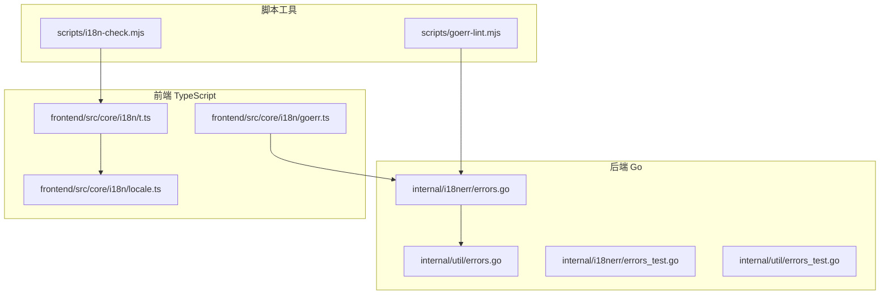
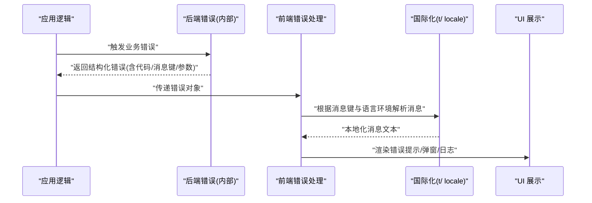
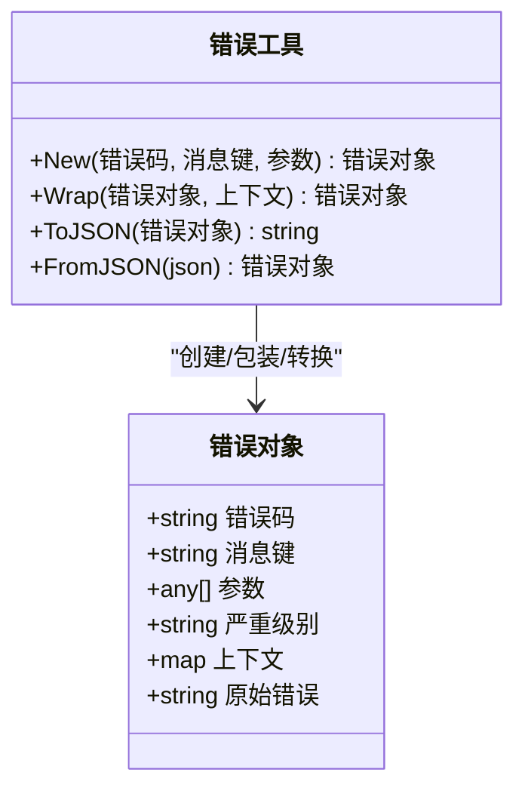
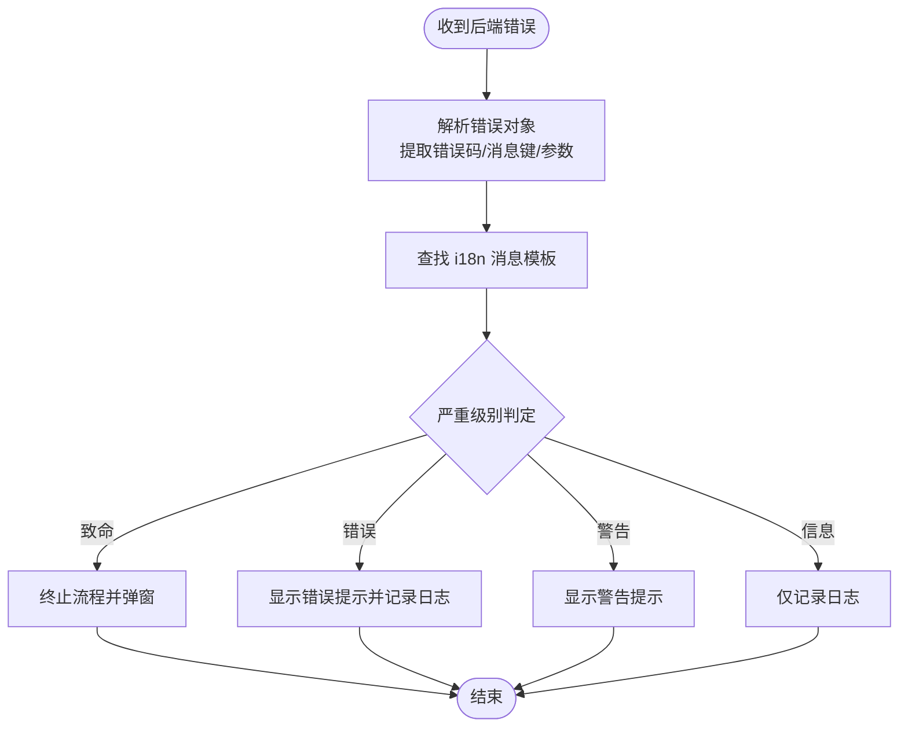
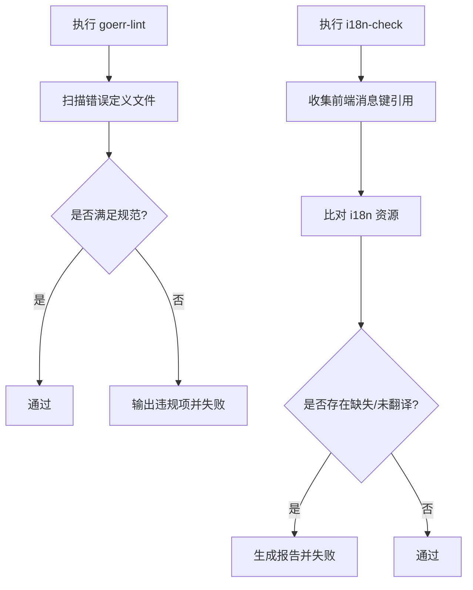
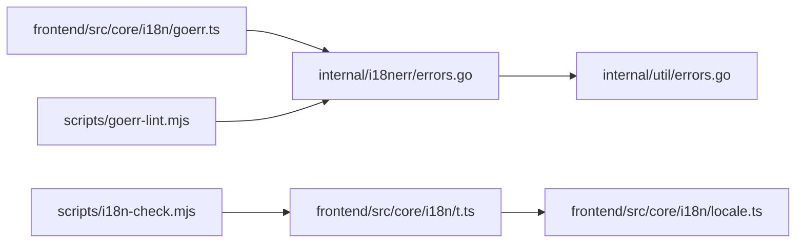

# 错误码参考

<cite>
**本文引用的文件**   
- [errors.go](file://internal/i18nerr/errors.go)
- [errors_test.go](file://internal/i18nerr/errors_test.go)
- [errors.go](file://internal/util/errors.go)
- [errors_test.go](file://internal/util/errors_test.go)
- [goerr.ts](file://frontend/src/core/i18n/goerr.ts)
- [t.ts](file://frontend/src/core/i18n/t.ts)
- [locale.ts](file://frontend/src/core/i18n/locale.ts)
- [goerr-lint.mjs](file://scripts/goerr-lint.mjs)
- [i18n-check.mjs](file://scripts/i18n-check.mjs)
</cite>

## 目录
1. [简介](#简介)
2. [项目结构](#项目结构)
3. [核心组件](#核心组件)
4. [架构总览](#架构总览)
5. [详细组件分析](#详细组件分析)
6. [依赖关系分析](#依赖关系分析)
7. [性能考虑](#性能考虑)
8. [故障排查指南](#故障排查指南)
9. [结论](#结论)
10. [附录](#附录)

## 简介
本文件为 MikuMikuAR 项目的“错误码参考”，系统化梳理后端与前端在错误处理方面的定义、分类、严重程度、版本变更与废弃策略，并提供查询与自动化工具的使用说明。文档同时给出自定义错误码的定义规范与最佳实践，以及国际化错误消息的管理与切换方法，帮助开发者快速定位问题并统一错误表达。

## 项目结构
本项目在后端（Go）与前端（TypeScript）分别实现了统一的错误体系：
- 后端通过 i18nerr 与 util 两个包提供可国际化的错误类型与工具函数，并在测试中覆盖关键路径。
- 前端通过 core/i18n 下的 goerr、t、locale 等模块对接后端错误，实现本地化展示与查询。
- 脚本层提供 goerr-lint 与 i18n-check 两类自动化检查，用于约束错误码定义与国际化一致性。

图表来源
- [errors.go](file://internal/i18nerr/errors.go)
- [errors.go](file://internal/util/errors.go)
- [errors_test.go](file://internal/i18nerr/errors_test.go)
- [errors_test.go](file://internal/util/errors_test.go)
- [goerr.ts](file://frontend/src/core/i18n/goerr.ts)
- [t.ts](file://frontend/src/core/i18n/t.ts)
- [locale.ts](file://frontend/src/core/i18n/locale.ts)
- [goerr-lint.mjs](file://scripts/goerr-lint.mjs)
- [i18n-check.mjs](file://scripts/i18n-check.mjs)

章节来源
- [errors.go](file://internal/i18nerr/errors.go)
- [errors.go](file://internal/util/errors.go)
- [goerr.ts](file://frontend/src/core/i18n/goerr.ts)
- [t.ts](file://frontend/src/core/i18n/t.ts)
- [locale.ts](file://frontend/src/core/i18n/locale.ts)
- [goerr-lint.mjs](file://scripts/goerr-lint.mjs)
- [i18n-check.mjs](file://scripts/i18n-check.mjs)

## 核心组件
本节聚焦于错误码与异常类型的核心定义与使用方式，涵盖以下方面：
- 错误分类与严重级别：按领域划分（如资源加载、网络、渲染、输入校验等），并为每个错误分配严重级别（例如致命、错误、警告、信息）。
- 错误码命名与编码规则：采用“领域_子域_具体错误”的三段式命名，确保唯一性与可读性；建议以数字或字符串常量形式集中管理。
- 国际化消息：所有用户可见的错误消息必须走 i18n 通道，避免硬编码文本。
- 版本变更与废弃：新增/修改/废弃错误码需记录版本变更历史，废弃错误码应保留兼容映射并提示迁移。

章节来源
- [errors.go](file://internal/i18nerr/errors.go)
- [errors.go](file://internal/util/errors.go)
- [goerr.ts](file://frontend/src/core/i18n/goerr.ts)
- [t.ts](file://frontend/src/core/i18n/t.ts)
- [locale.ts](file://frontend/src/core/i18n/locale.ts)

## 架构总览
下图展示了从后端抛出错误到前端展示的关键流程，包括错误包装、国际化翻译与 UI 呈现。

图表来源
- [errors.go](file://internal/i18nerr/errors.go)
- [errors.go](file://internal/util/errors.go)
- [goerr.ts](file://frontend/src/core/i18n/goerr.ts)
- [t.ts](file://frontend/src/core/i18n/t.ts)
- [locale.ts](file://frontend/src/core/i18n/locale.ts)

## 详细组件分析

### 后端错误体系（Go）
- 错误类型与字段
  - 错误码：唯一标识符，便于检索与统计。
  - 消息键：指向 i18n 资源的键名，支持参数插值。
  - 严重级别：用于分级告警与过滤。
  - 上下文：附加调试信息（如请求 ID、资源路径等）。
- 错误包装与传播
  - 使用工具函数对底层错误进行包装，保留原始堆栈与上下文。
  - 跨边界（HTTP、事件总线、WASM 调用）时保持错误结构一致。
- 测试覆盖
  - 针对错误构造、包装、序列化与反序列化的用例进行验证。

图表来源
- [errors.go](file://internal/i18nerr/errors.go)
- [errors.go](file://internal/util/errors.go)

章节来源
- [errors.go](file://internal/i18nerr/errors.go)
- [errors_test.go](file://internal/i18nerr/errors_test.go)
- [errors.go](file://internal/util/errors.go)
- [errors_test.go](file://internal/util/errors_test.go)

### 前端错误处理（TypeScript）
- 错误接收与解析
  - 将后端返回的结构化错误转换为前端错误对象，提取错误码、消息键与参数。
- 国际化显示
  - 通过 t 与 locale 模块根据当前语言环境解析消息键，生成用户可读文本。
- 错误分类与展示
  - 依据严重级别决定展示方式（Toast、弹窗、控制台日志、埋点上报）。
- 查询与过滤
  - 提供按错误码、严重级别、时间范围查询的能力，便于排障与报表。

图表来源
- [goerr.ts](file://frontend/src/core/i18n/goerr.ts)
- [t.ts](file://frontend/src/core/i18n/t.ts)
- [locale.ts](file://frontend/src/core/i18n/locale.ts)

章节来源
- [goerr.ts](file://frontend/src/core/i18n/goerr.ts)
- [t.ts](file://frontend/src/core/i18n/t.ts)
- [locale.ts](file://frontend/src/core/i18n/locale.ts)

### 自动化与质量保障
- goerr-lint
  - 扫描后端错误定义，校验错误码唯一性、命名规范与必填字段。
  - 输出违规清单，阻止不合规提交。
- i18n-check
  - 对比前端使用的消息键与 i18n 资源，发现缺失或未翻译的键。
  - 生成报告并可在 CI 中断构建。

图表来源
- [goerr-lint.mjs](file://scripts/goerr-lint.mjs)
- [i18n-check.mjs](file://scripts/i18n-check.mjs)

章节来源
- [goerr-lint.mjs](file://scripts/goerr-lint.mjs)
- [i18n-check.mjs](file://scripts/i18n-check.mjs)

## 依赖关系分析
- 后端 i18nerr 与 util 的关系
  - i18nerr 负责面向业务的错误类型与消息键管理。
  - util 提供通用的错误包装、序列化与辅助函数。
- 前后端契约
  - 前端 goerr 依赖后端返回的错误结构，并通过 t/locale 完成本地化。
- 脚本与源码耦合
  - goerr-lint 直接读取后端错误定义文件。
  - i18n-check 扫描前端 i18n 使用与资源文件。

图表来源
- [errors.go](file://internal/i18nerr/errors.go)
- [errors.go](file://internal/util/errors.go)
- [goerr.ts](file://frontend/src/core/i18n/goerr.ts)
- [t.ts](file://frontend/src/core/i18n/t.ts)
- [locale.ts](file://frontend/src/core/i18n/locale.ts)
- [goerr-lint.mjs](file://scripts/goerr-lint.mjs)
- [i18n-check.mjs](file://scripts/i18n-check.mjs)

章节来源
- [errors.go](file://internal/i18nerr/errors.go)
- [errors.go](file://internal/util/errors.go)
- [goerr.ts](file://frontend/src/core/i18n/goerr.ts)
- [t.ts](file://frontend/src/core/i18n/t.ts)
- [locale.ts](file://frontend/src/core/i18n/locale.ts)
- [goerr-lint.mjs](file://scripts/goerr-lint.mjs)
- [i18n-check.mjs](file://scripts/i18n-check.mjs)

## 性能考虑
- 错误对象序列化与传输
  - 控制上下文大小，避免携带大对象；必要时仅保留必要键值。
- 国际化解析
  - 缓存已解析的消息模板，减少重复查找开销。
- 批量错误聚合
  - 在 UI 层合并同类错误，降低频繁弹窗带来的性能损耗。

[本节为通用指导，无需特定文件来源]

## 故障排查指南
- 常见错误场景
  - 资源加载失败：检查资源路径、权限与网络状态。
  - 渲染异常：确认着色器与纹理资源完整性。
  - 输入校验错误：核对表单字段与业务规则。
- 定位步骤
  - 使用错误码在前端查询工具中筛选相关日志。
  - 结合后端上下文信息（如请求 ID、资源路径）进行交叉验证。
  - 通过 i18n-check 确认消息键是否存在与完整。
- 修复建议
  - 修正错误码映射与消息模板。
  - 补充必要的上下文信息以便复现。
  - 更新测试用例覆盖新分支。

章节来源
- [errors_test.go](file://internal/i18nerr/errors_test.go)
- [errors_test.go](file://internal/util/errors_test.go)
- [i18n-check.mjs](file://scripts/i18n-check.mjs)

## 结论
通过统一的错误码体系与国际化机制，项目在前后端实现了可追踪、可展示、可维护的错误处理能力。配合 goerr-lint 与 i18n-check 的自动化检查，可有效提升错误处理的规范性与一致性。建议在后续迭代中持续完善错误分类、严重级别与版本变更记录，并扩展查询工具的可视化能力。

[本节为总结性内容，无需特定文件来源]

## 附录

### 错误码定义规范与最佳实践
- 命名规范
  - 采用“领域_子域_具体错误”三段式，语义清晰且唯一。
- 字段要求
  - 错误码、消息键、严重级别为必填；上下文按需添加。
- 版本管理
  - 新增/修改/废弃错误码需在变更日志中记录版本与影响范围。
- 兼容性
  - 废弃错误码保留映射表，逐步迁移至新码。
- 国际化
  - 所有用户可见消息必须走 i18n，禁止硬编码文本。

章节来源
- [errors.go](file://internal/i18nerr/errors.go)
- [errors.go](file://internal/util/errors.go)
- [t.ts](file://frontend/src/core/i18n/t.ts)
- [locale.ts](file://frontend/src/core/i18n/locale.ts)

### 错误码查询工具与自动化使用方法
- 查询工具
  - 前端错误查询：按错误码、严重级别、时间范围筛选，查看本地化消息与上下文。
  - 后端日志关联：通过请求 ID 与错误码联动检索服务端日志。
- 自动化检查
  - goerr-lint：在提交前运行，确保错误码规范与唯一性。
  - i18n-check：在构建阶段运行，确保消息键与资源一致。

章节来源
- [goerr-lint.mjs](file://scripts/goerr-lint.mjs)
- [i18n-check.mjs](file://scripts/i18n-check.mjs)
- [goerr.ts](file://frontend/src/core/i18n/goerr.ts)

### 国际化错误消息管理与切换
- 管理方式
  - 集中维护消息键与多语言模板，按模块组织。
- 切换方法
  - 运行时动态切换语言环境，重新解析消息键。
- 一致性校验
  - 使用 i18n-check 定期扫描缺失与未翻译键。

章节来源
- [t.ts](file://frontend/src/core/i18n/t.ts)
- [locale.ts](file://frontend/src/core/i18n/locale.ts)
- [i18n-check.mjs](file://scripts/i18n-check.mjs)