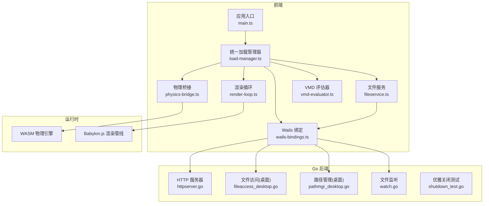
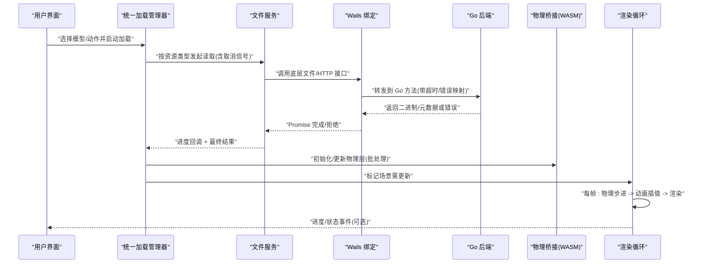
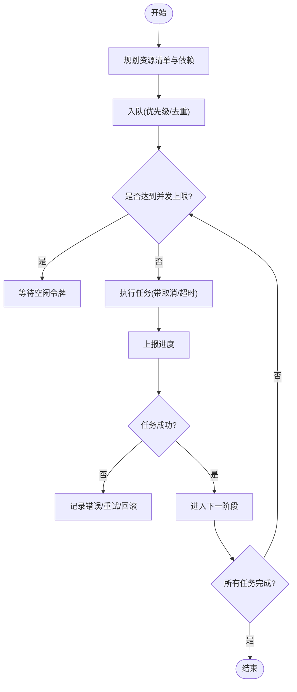
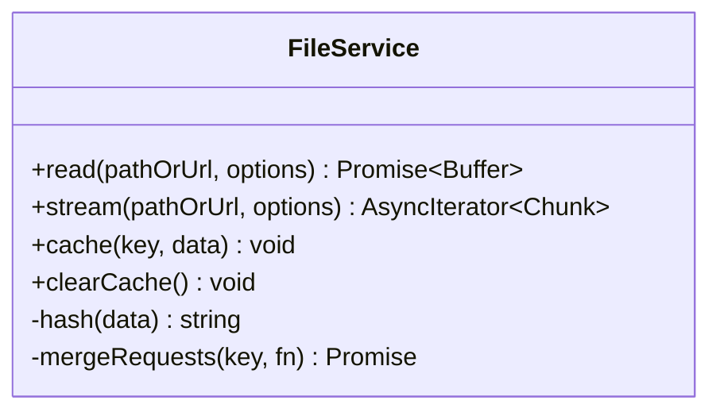
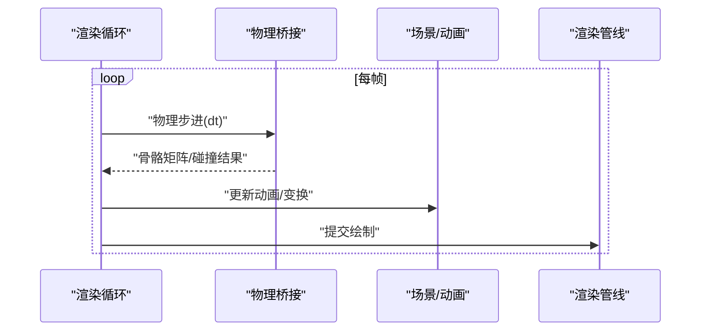
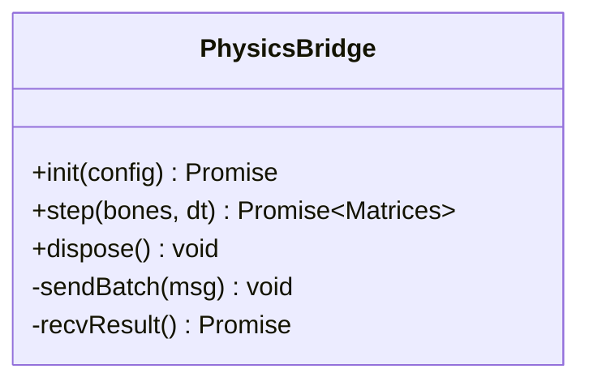
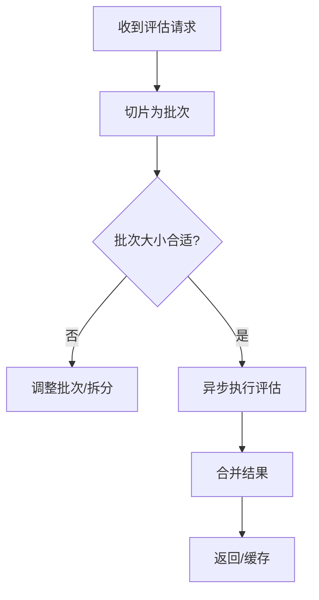
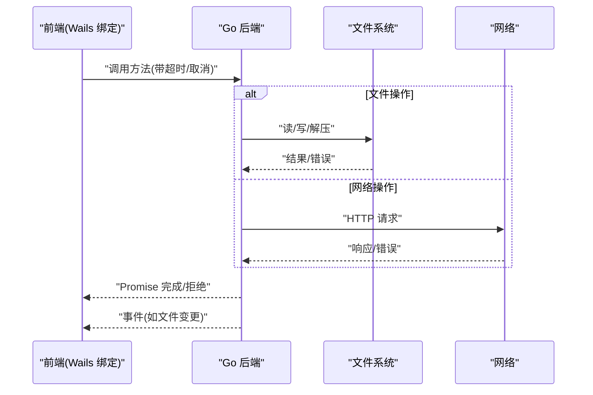
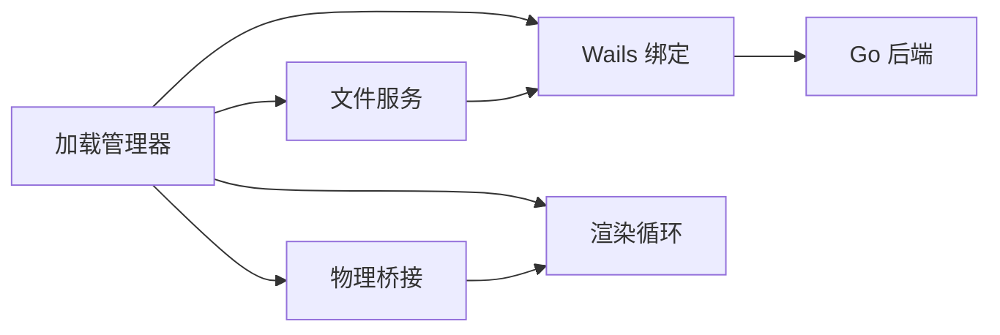

# 异步数据处理

<cite>
**本文引用的文件**   
- [main.go](file://main.go)
- [frontend/src/core/main.ts](file://frontend/src/core/main.ts)
- [frontend/src/core/load-manager.ts](file://frontend/src/core/load-manager.ts)
- [frontend/src/core/render-loop.ts](file://frontend/src/core/render-loop.ts)
- [frontend/src/core/fileservice.ts](file://frontend/src/core/fileservice.ts)
- [frontend/src/core/wails-bindings.ts](file://frontend/src/core/wails-bindings.ts)
- [frontend/src/physics/physics-bridge.ts](file://frontend/src/physics/physics-bridge.ts)
- [frontend/src/motion-algos/vmd-evaluator.ts](file://frontend/src/motion-algos/vmd-evaluator.ts)
- [internal/app/httpserver.go](file://internal/app/httpserver.go)
- [internal/app/fileaccess_desktop.go](file://internal/app/fileaccess_desktop.go)
- [internal/app/pathmgr_desktop.go](file://internal/app/pathmgr_desktop.go)
- [internal/app/watch.go](file://internal/app/watch.go)
- [internal/app/shutdown_test.go](file://internal/app/shutdown_test.go)
- [docs/adr/adr-105-abort-signal-and-async-error-handling.md](file://docs/adr/adr-105-abort-signal-and-async-error-handling.md)
- [docs/adr/adr-106-timing-audit-and-async-lifecycle.md](file://docs/adr/adr-106-timing-audit-and-async-lifecycle.md)
- [docs/adr/adr-045-unified-loading.md](file://docs/adr/adr-045-unified-loading.md)
</cite>

## 目录
1. [简介](#简介)
2. [项目结构](#项目结构)
3. [核心组件](#核心组件)
4. [架构总览](#架构总览)
5. [详细组件分析](#详细组件分析)
6. [依赖分析](#依赖分析)
7. [性能考量](#性能考量)
8. [故障排查指南](#故障排查指南)
9. [结论](#结论)
10. [附录](#附录)

## 简介
本设计文档聚焦 MikuMikuAR 的异步数据处理体系，覆盖文件加载、网络请求、物理计算、3D渲染等耗时操作的异步方案；阐述任务队列与并发控制机制，确保资源访问有序与安全；说明 Promise/Async-Await 使用模式、错误处理与超时管理；描述 WebAssembly 调用的异步封装、Go 后端与前端 JavaScript 的双向异步通信；并提供进度反馈与 UI 更新策略、内存泄漏防护与资源清理机制。

## 项目结构
从异步视角看，前端以“统一加载管理器”为核心编排各类 I/O 与计算任务，渲染循环驱动帧级更新，WASM 物理在独立线程中运行并通过桥接层与主线程交互；Go 后端通过 Wails 暴露文件系统、HTTP 代理、路径管理等能力，并支持事件通知与优雅关闭。

图表来源
- [frontend/src/core/load-manager.ts](file://frontend/src/core/load-manager.ts)
- [frontend/src/core/fileservice.ts](file://frontend/src/core/fileservice.ts)
- [frontend/src/core/render-loop.ts](file://frontend/src/core/render-loop.ts)
- [frontend/src/physics/physics-bridge.ts](file://frontend/src/physics/physics-bridge.ts)
- [frontend/src/motion-algos/vmd-evaluator.ts](file://frontend/src/motion-algos/vmd-evaluator.ts)
- [frontend/src/core/wails-bindings.ts](file://frontend/src/core/wails-bindings.ts)
- [frontend/src/core/main.ts](file://frontend/src/core/main.ts)
- [internal/app/httpserver.go](file://internal/app/httpserver.go)
- [internal/app/fileaccess_desktop.go](file://internal/app/fileaccess_desktop.go)
- [internal/app/pathmgr_desktop.go](file://internal/app/pathmgr_desktop.go)
- [internal/app/watch.go](file://internal/app/watch.go)
- [internal/app/shutdown_test.go](file://internal/app/shutdown_test.go)

章节来源
- [frontend/src/core/main.ts](file://frontend/src/core/main.ts)
- [frontend/src/core/load-manager.ts](file://frontend/src/core/load-manager.ts)
- [frontend/src/core/render-loop.ts](file://frontend/src/core/render-loop.ts)
- [frontend/src/core/fileservice.ts](file://frontend/src/core/fileservice.ts)
- [frontend/src/core/wails-bindings.ts](file://frontend/src/core/wails-bindings.ts)
- [internal/app/httpserver.go](file://internal/app/httpserver.go)
- [internal/app/fileaccess_desktop.go](file://internal/app/fileaccess_desktop.go)
- [internal/app/pathmgr_desktop.go](file://internal/app/pathmgr_desktop.go)
- [internal/app/watch.go](file://internal/app/watch.go)
- [internal/app/shutdown_test.go](file://internal/app/shutdown_test.go)

## 核心组件
- 统一加载管理器：集中编排模型、材质、纹理、动作、环境等资源加载，提供进度回调、取消信号、错误聚合与重试策略。
- 文件服务：对本地/网络/ZIP 等数据源进行统一抽象，封装分块读取、缓存、去重与并发限制。
- 渲染循环：基于 requestAnimationFrame 的帧调度，协调物理步进、动画更新与渲染提交。
- 物理桥接：将骨骼/布料物理计算委托给 WASM，采用消息传递与批处理减少跨线程开销。
- VMD 评估器：将动作时间轴解析为关键帧插值结果，支持异步批量评估与节流。
- Wails 绑定：封装 Go 侧能力（文件、HTTP、路径、事件）为 JS Promise/Async API，统一错误映射与超时控制。
- Go 后端：提供 HTTP 代理、文件访问、路径管理、文件监听与优雅关闭等能力。

章节来源
- [frontend/src/core/load-manager.ts](file://frontend/src/core/load-manager.ts)
- [frontend/src/core/fileservice.ts](file://frontend/src/core/fileservice.ts)
- [frontend/src/core/render-loop.ts](file://frontend/src/core/render-loop.ts)
- [frontend/src/physics/physics-bridge.ts](file://frontend/src/physics/physics-bridge.ts)
- [frontend/src/motion-algos/vmd-evaluator.ts](file://frontend/src/motion-algos/vmd-evaluator.ts)
- [frontend/src/core/wails-bindings.ts](file://frontend/src/core/wails-bindings.ts)
- [internal/app/httpserver.go](file://internal/app/httpserver.go)
- [internal/app/fileaccess_desktop.go](file://internal/app/fileaccess_desktop.go)
- [internal/app/pathmgr_desktop.go](file://internal/app/pathmgr_desktop.go)
- [internal/app/watch.go](file://internal/app/watch.go)

## 架构总览
下图展示一次典型“加载模型并播放动作”的端到端异步流程，涵盖 UI 触发、任务编排、I/O、WASM 物理、渲染循环与状态回写。

图表来源
- [frontend/src/core/load-manager.ts](file://frontend/src/core/load-manager.ts)
- [frontend/src/core/fileservice.ts](file://frontend/src/core/fileservice.ts)
- [frontend/src/core/wails-bindings.ts](file://frontend/src/core/wails-bindings.ts)
- [internal/app/httpserver.go](file://internal/app/httpserver.go)
- [internal/app/fileaccess_desktop.go](file://internal/app/fileaccess_desktop.go)
- [frontend/src/physics/physics-bridge.ts](file://frontend/src/physics/physics-bridge.ts)
- [frontend/src/core/render-loop.ts](file://frontend/src/core/render-loop.ts)

## 详细组件分析

### 统一加载管理器（任务编排与并发控制）
- 职责
  - 定义资源加载流水线：下载/解压 -> 解析 -> 构建对象 -> 注册到场景。
  - 维护任务队列与优先级，支持取消、重试、去重与并发上限。
  - 对外暴露进度事件与错误聚合，供 UI 显示与恢复。
- 并发控制
  - 通过令牌桶/信号量限制同时进行的 I/O 与解析任务数。
  - 对同一资源的重复请求进行合并，避免重复下载与解析。
- 取消与超时
  - 每个任务携带 AbortSignal，上层可统一取消。
  - 结合 ADR 规范实现统一的超时与错误分类。
- 进度与状态
  - 细粒度进度上报（字节级/阶段级），UI 可据此更新进度条与提示。
- 资源安全
  - 失败时回滚已分配资源，保证场景一致性。

图表来源
- [frontend/src/core/load-manager.ts](file://frontend/src/core/load-manager.ts)
- [docs/adr/adr-105-abort-signal-and-async-error-handling.md](file://docs/adr/adr-105-abort-signal-and-async-error-handling.md)
- [docs/adr/adr-045-unified-loading.md](file://docs/adr/adr-045-unified-loading.md)

章节来源
- [frontend/src/core/load-manager.ts](file://frontend/src/core/load-manager.ts)
- [docs/adr/adr-105-abort-signal-and-async-error-handling.md](file://docs/adr/adr-105-abort-signal-and-async-error-handling.md)
- [docs/adr/adr-045-unified-loading.md](file://docs/adr/adr-045-unified-loading.md)

### 文件服务（I/O 抽象与缓存）
- 能力
  - 统一读取本地文件、网络 URL、ZIP 内条目；支持分块读取与流式处理。
  - 内置哈希去重与内存/磁盘缓存，降低重复 I/O。
  - 与 Wails 绑定协作，屏蔽平台差异。
- 并发与顺序
  - 对大文件采用分段并发读取，但保持段顺序拼接。
  - 对同一路径的并发读请求自动合并。
- 错误与恢复
  - 区分网络/权限/格式错误，提供重试与降级策略。
  - 失败时释放中间缓冲，避免内存膨胀。

图表来源
- [frontend/src/core/fileservice.ts](file://frontend/src/core/fileservice.ts)
- [frontend/src/core/wails-bindings.ts](file://frontend/src/core/wails-bindings.ts)

章节来源
- [frontend/src/core/fileservice.ts](file://frontend/src/core/fileservice.ts)
- [frontend/src/core/wails-bindings.ts](file://frontend/src/core/wails-bindings.ts)

### 渲染循环（帧调度与同步点）
- 职责
  - 基于 requestAnimationFrame 驱动每帧逻辑：物理步进、动画更新、渲染提交。
  - 提供“下一帧”微任务钩子，便于与异步任务衔接。
- 与异步集成
  - 将长耗时计算拆分为多帧执行，避免阻塞主线程。
  - 与加载管理器协作，在资源就绪后触发增量更新。
- 性能要点
  - 固定步长或自适应步长，保证物理稳定性。
  - 渲染前合并状态变更，减少多余绘制。

图表来源
- [frontend/src/core/render-loop.ts](file://frontend/src/core/render-loop.ts)
- [frontend/src/physics/physics-bridge.ts](file://frontend/src/physics/physics-bridge.ts)

章节来源
- [frontend/src/core/render-loop.ts](file://frontend/src/core/render-loop.ts)
- [frontend/src/physics/physics-bridge.ts](file://frontend/src/physics/physics-bridge.ts)

### 物理桥接（WASM 异步封装）
- 设计
  - 将密集计算卸载至 WASM，主线程仅负责数据打包与结果解包。
  - 采用批处理与环形缓冲区减少跨边界调用次数。
- 异步模式
  - 对外暴露 Promise/Async API，内部通过消息通道与 WASM 线程通信。
  - 支持取消与超时，防止长时间占用主线程。
- 错误处理
  - 捕获 WASM 异常并映射为前端错误类型，附带上下文信息。

图表来源
- [frontend/src/physics/physics-bridge.ts](file://frontend/src/physics/physics-bridge.ts)

章节来源
- [frontend/src/physics/physics-bridge.ts](file://frontend/src/physics/physics-bridge.ts)

### VMD 评估器（动作异步批处理）
- 职责
  - 将 VMD 时间轴转换为逐帧插值结果，支持批量评估与延迟求值。
- 异步优化
  - 将大量关键帧评估切分为多个微任务，避免卡顿。
  - 与渲染循环对齐，按需生成所需时间点的结果。
- 错误与健壮性
  - 校验时间范围与骨骼索引，越界时快速失败并给出定位信息。

图表来源
- [frontend/src/motion-algos/vmd-evaluator.ts](file://frontend/src/motion-algos/vmd-evaluator.ts)

章节来源
- [frontend/src/motion-algos/vmd-evaluator.ts](file://frontend/src/motion-algos/vmd-evaluator.ts)

### Wails 绑定与 Go 后端（双向异步通信）
- 前端绑定
  - 将 Go 方法包装为 Promise/Async API，统一错误映射、超时与取消。
  - 提供事件订阅/发布通道，用于文件监听、后台任务进度等。
- Go 后端
  - HTTP 服务器：提供静态资源与代理能力，支持 CORS 与限流。
  - 文件访问：跨平台文件读写、ZIP 解压、权限检查。
  - 路径管理：规范化路径、沙箱隔离、别名映射。
  - 文件监听：增量变更事件推送。
  - 优雅关闭：在退出前完成未决任务与资源释放。

图表来源
- [frontend/src/core/wails-bindings.ts](file://frontend/src/core/wails-bindings.ts)
- [internal/app/httpserver.go](file://internal/app/httpserver.go)
- [internal/app/fileaccess_desktop.go](file://internal/app/fileaccess_desktop.go)
- [internal/app/pathmgr_desktop.go](file://internal/app/pathmgr_desktop.go)
- [internal/app/watch.go](file://internal/app/watch.go)

章节来源
- [frontend/src/core/wails-bindings.ts](file://frontend/src/core/wails-bindings.ts)
- [internal/app/httpserver.go](file://internal/app/httpserver.go)
- [internal/app/fileaccess_desktop.go](file://internal/app/fileaccess_desktop.go)
- [internal/app/pathmgr_desktop.go](file://internal/app/pathmgr_desktop.go)
- [internal/app/watch.go](file://internal/app/watch.go)

## 依赖分析
- 耦合关系
  - 加载管理器依赖文件服务、Wails 绑定、物理桥接与渲染循环。
  - 文件服务依赖 Wails 绑定与缓存模块。
  - 物理桥接依赖 WASM 运行时与渲染循环的时间步。
- 外部依赖
  - Go 后端提供系统级能力（文件、网络、进程生命周期）。
  - 浏览器 API（requestAnimationFrame、Fetch/XHR、AbortController）。
- 潜在环路与风险
  - 避免渲染循环反向依赖加载管理器导致死锁；应通过事件/回调解耦。
  - 文件监听与加载流程需防抖，避免频繁重建资源。

图表来源
- [frontend/src/core/load-manager.ts](file://frontend/src/core/load-manager.ts)
- [frontend/src/core/fileservice.ts](file://frontend/src/core/fileservice.ts)
- [frontend/src/core/wails-bindings.ts](file://frontend/src/core/wails-bindings.ts)
- [frontend/src/physics/physics-bridge.ts](file://frontend/src/physics/physics-bridge.ts)
- [frontend/src/core/render-loop.ts](file://frontend/src/core/render-loop.ts)
- [internal/app/httpserver.go](file://internal/app/httpserver.go)

章节来源
- [frontend/src/core/load-manager.ts](file://frontend/src/core/load-manager.ts)
- [frontend/src/core/fileservice.ts](file://frontend/src/core/fileservice.ts)
- [frontend/src/core/wails-bindings.ts](file://frontend/src/core/wails-bindings.ts)
- [frontend/src/physics/physics-bridge.ts](file://frontend/src/physics/physics-bridge.ts)
- [frontend/src/core/render-loop.ts](file://frontend/src/core/render-loop.ts)
- [internal/app/httpserver.go](file://internal/app/httpserver.go)

## 性能考量
- 并发与吞吐
  - 合理设置 I/O 并发上限，避免磁盘/网络拥塞。
  - 对大文件采用分块并行读取与流式处理，降低峰值内存。
- 计算卸载
  - 将 CPU 密集型任务（物理、动作评估）放入 WASM 或 Worker，主线程只负责调度。
- 渲染稳定
  - 固定物理步长，必要时采用多步校正；合并状态变更，减少绘制抖动。
- 缓存与去重
  - 对纹理、模型、动作等热点资源建立多级缓存，命中优先。
- 背压与节流
  - 对高频事件（文件监听、输入）进行节流/防抖，避免过载。

[本节为通用指导，不直接分析具体文件]

## 故障排查指南
- 常见问题定位
  - 加载卡住：检查取消信号是否被正确传播，确认并发上限与重试策略。
  - 内存泄漏：确认资源销毁路径，尤其是纹理、几何体、WASM 实例与事件订阅。
  - 网络错误：核对 CORS、证书与代理配置，查看 Go 后端日志。
  - 物理异常：检查骨骼索引、质量参数与步长合理性。
- 调试建议
  - 启用详细日志与指标上报（I/O 时长、错误率、帧耗时）。
  - 使用 ADR 的错误分类与统一错误对象，便于追踪根因。
  - 利用优雅关闭流程验证资源释放是否完整。

章节来源
- [docs/adr/adr-105-abort-signal-and-async-error-handling.md](file://docs/adr/adr-105-abort-signal-and-async-error-handling.md)
- [docs/adr/adr-106-timing-audit-and-async-lifecycle.md](file://docs/adr/adr-106-timing-audit-and-async-lifecycle.md)
- [internal/app/shutdown_test.go](file://internal/app/shutdown_test.go)

## 结论
通过统一加载管理器、文件服务、WASM 物理桥接与 Wails 绑定的协同，MikuMikuAR 实现了高内聚、低耦合的异步数据处理体系。借助任务队列、并发控制、取消与超时、错误分类与优雅关闭，系统在复杂资源与计算场景下仍能提供稳定流畅的用户体验。后续可在缓存命中率、批处理粒度与监控指标方面持续优化。

## 附录
- 术语
  - 取消信号：用于中断长时间运行的异步任务。
  - 批处理：将多次小操作合并为一次大操作以降低开销。
  - 优雅关闭：在退出前完成未决任务并释放资源。
- 参考实践
  - 统一加载策略与错误处理 ADR。
  - 计时审计与异步生命周期规范。