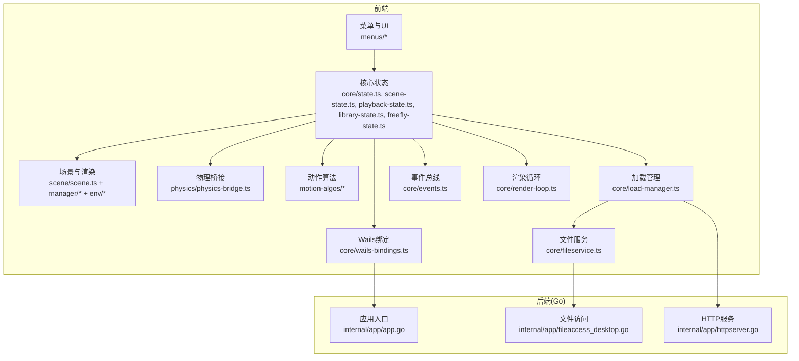
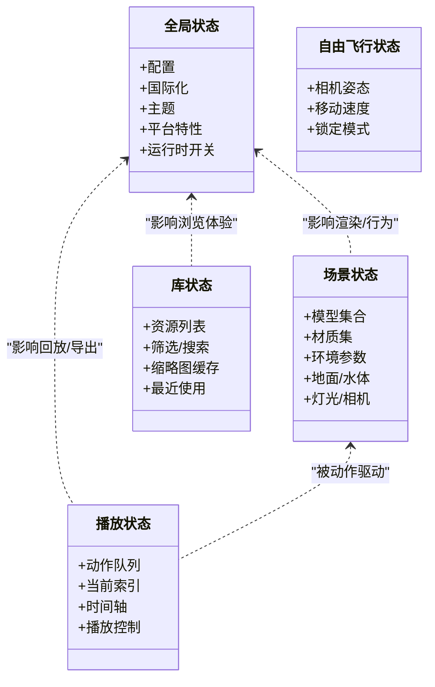
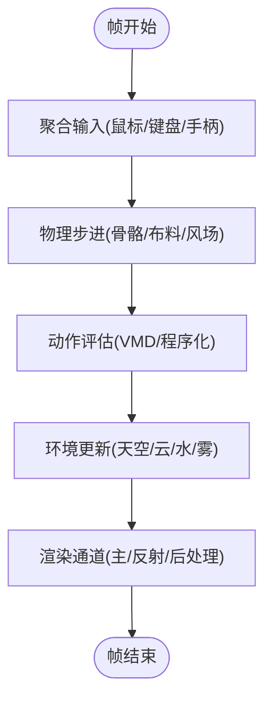
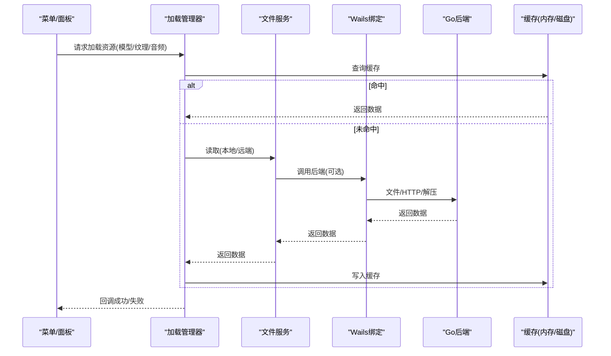
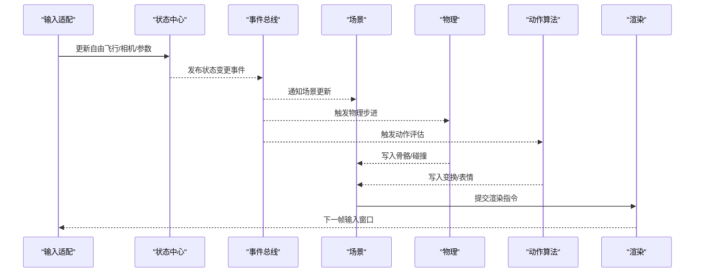
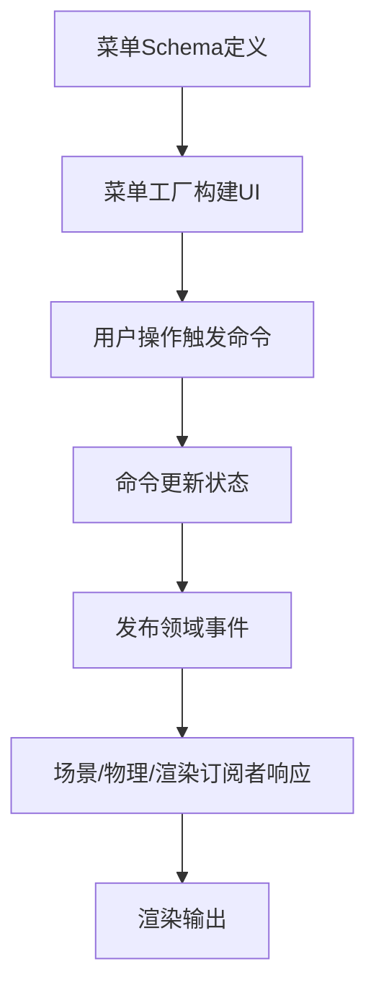
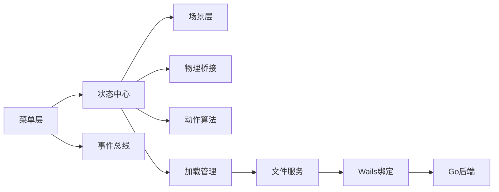

# 数据流设计

<cite>
**本文引用的文件**   
- [main.go](file://main.go)
- [frontend/src/core/main.ts](file://frontend/src/core/main.ts)
- [frontend/src/core/state.ts](file://frontend/src/core/state.ts)
- [frontend/src/core/scene-state.ts](file://frontend/src/core/scene-state.ts)
- [frontend/src/core/playback-state.ts](file://frontend/src/core/playback-state.ts)
- [frontend/src/core/library-state.ts](file://frontend/src/core/library-state.ts)
- [frontend/src/core/freefly-state.ts](file://frontend/src/core/freefly-state.ts)
- [frontend/src/core/render-loop.ts](file://frontend/src/core/render-loop.ts)
- [frontend/src/core/load-manager.ts](file://frontend/src/core/load-manager.ts)
- [frontend/src/core/fileservice.ts](file://frontend/src/core/fileservice.ts)
- [frontend/src/core/events.ts](file://frontend/src/core/events.ts)
- [frontend/src/core/config.ts](file://frontend/src/core/config.ts)
- [frontend/src/core/wails-bindings.ts](file://frontend/src/core/wails-bindings.ts)
- [frontend/src/menus/menu-schema.ts](file://frontend/src/menus/menu-schema.ts)
- [frontend/src/menus/menu-factory.ts](file://frontend/src/menus/menu-factory.ts)
- [frontend/src/menus/scene-menu.ts](file://frontend/src/menus/scene-menu.ts)
- [frontend/src/scene/scene.ts](file://frontend/src/scene/scene.ts)
- [frontend/src/scene/manager/model-manager.ts](file://frontend/src/scene/manager/model-manager.ts)
- [frontend/src/scene/manager/motion-manager.ts](file://frontend/src/scene/manager/motion-manager.ts)
- [frontend/src/scene/env/env-bridge.ts](file://frontend/src/scene/env/env-bridge.ts)
- [frontend/src/physics/physics-bridge.ts](file://frontend/src/physics/physics-bridge.ts)
- [frontend/src/motion-algos/vmd-evaluator.ts](file://frontend/src/motion-algos/vmd-evaluator.ts)
- [frontend/src/motion-algos/procedural-motion.ts](file://frontend/src/motion-algos/procedural-motion.ts)
- [internal/app/app.go](file://internal/app/app.go)
- [internal/app/fileaccess_desktop.go](file://internal/app/fileaccess_desktop.go)
- [internal/app/httpserver.go](file://internal/app/httpserver.go)
</cite>

## 目录
1. [简介](#简介)
2. [项目结构](#项目结构)
3. [核心组件](#核心组件)
4. [架构总览](#架构总览)
5. [详细组件分析](#详细组件分析)
6. [依赖分析](#依赖分析)
7. [性能考虑](#性能考虑)
8. [故障排查指南](#故障排查指南)
9. [结论](#结论)
10. [附录](#附录)

## 简介
本文件面向 MikuMikuAR 的数据流设计，聚焦“用户输入到渲染输出”的完整链路、状态管理模式（全局/局部/持久化）、异步数据处理机制（文件加载、网络请求、物理计算等）、数据验证与错误处理策略，以及性能优化方案（缓存、增量更新、批量处理）。文档以代码级事实为依据，结合架构图与时序图帮助读者建立统一认知。

## 项目结构
前端采用模块化分层：UI 菜单层通过声明式 Schema 驱动，业务状态集中在 core 层，场景与渲染在 scene 层，物理与动作算法在 physics 与 motion-algos 层，Wails 绑定负责与 Go 后端通信；Go 后端提供文件系统、HTTP 服务、应用生命周期等能力。



图示来源
- [frontend/src/core/main.ts](file://frontend/src/core/main.ts)
- [frontend/src/core/state.ts](file://frontend/src/core/state.ts)
- [frontend/src/core/scene-state.ts](file://frontend/src/core/scene-state.ts)
- [frontend/src/core/playback-state.ts](file://frontend/src/core/playback-state.ts)
- [frontend/src/core/library-state.ts](file://frontend/src/core/library-state.ts)
- [frontend/src/core/freefly-state.ts](file://frontend/src/core/freefly-state.ts)
- [frontend/src/core/render-loop.ts](file://frontend/src/core/render-loop.ts)
- [frontend/src/core/load-manager.ts](file://frontend/src/core/load-manager.ts)
- [frontend/src/core/fileservice.ts](file://frontend/src/core/fileservice.ts)
- [frontend/src/core/events.ts](file://frontend/src/core/events.ts)
- [frontend/src/core/wails-bindings.ts](file://frontend/src/core/wails-bindings.ts)
- [frontend/src/menus/menu-schema.ts](file://frontend/src/menus/menu-schema.ts)
- [frontend/src/menus/menu-factory.ts](file://frontend/src/menus/menu-factory.ts)
- [frontend/src/menus/scene-menu.ts](file://frontend/src/menus/scene-menu.ts)
- [frontend/src/scene/scene.ts](file://frontend/src/scene/scene.ts)
- [frontend/src/scene/manager/model-manager.ts](file://frontend/src/scene/manager/model-manager.ts)
- [frontend/src/scene/manager/motion-manager.ts](file://frontend/src/scene/manager/motion-manager.ts)
- [frontend/src/scene/env/env-bridge.ts](file://frontend/src/scene/env/env-bridge.ts)
- [frontend/src/physics/physics-bridge.ts](file://frontend/src/physics/physics-bridge.ts)
- [frontend/src/motion-algos/vmd-evaluator.ts](file://frontend/src/motion-algos/vmd-evaluator.ts)
- [frontend/src/motion-algos/procedural-motion.ts](file://frontend/src/motion-algos/procedural-motion.ts)
- [internal/app/app.go](file://internal/app/app.go)
- [internal/app/fileaccess_desktop.go](file://internal/app/fileaccess_desktop.go)
- [internal/app/httpserver.go](file://internal/app/httpserver.go)

章节来源
- [frontend/src/core/main.ts](file://frontend/src/core/main.ts)
- [frontend/src/menus/menu-schema.ts](file://frontend/src/menus/menu-schema.ts)
- [frontend/src/menus/menu-factory.ts](file://frontend/src/menus/menu-factory.ts)
- [frontend/src/scene/scene.ts](file://frontend/src/scene/scene.ts)
- [internal/app/app.go](file://internal/app/app.go)

## 核心组件
- 状态中心
  - 全局状态：应用配置、主题、语言、平台信息等集中管理。
  - 场景状态：模型、材质、环境、相机、地面、水体等场景相关数据。
  - 播放状态：动作列表、当前动作、时间轴、播放控制等。
  - 库状态：资源浏览、选择、缩略图缓存、会话存储等。
  - 自由飞行状态：相机姿态、移动速度、锁定模式等。
- 渲染循环：每帧调度物理、动作评估、环境更新与渲染。
- 加载管理：统一协调文件/网络/压缩资源的加载、缓存与失败重试。
- 文件服务：封装本地与远程读取，屏蔽平台差异。
- 事件总线：跨模块解耦的事件分发与订阅。
- Wails 绑定：调用 Go 后端能力（文件对话框、路径管理、HTTP 代理等）。
- 菜单系统：基于 Schema 的声明式 UI，驱动状态变更与命令执行。

章节来源
- [frontend/src/core/state.ts](file://frontend/src/core/state.ts)
- [frontend/src/core/scene-state.ts](file://frontend/src/core/scene-state.ts)
- [frontend/src/core/playback-state.ts](file://frontend/src/core/playback-state.ts)
- [frontend/src/core/library-state.ts](file://frontend/src/core/library-state.ts)
- [frontend/src/core/freefly-state.ts](file://frontend/src/core/freefly-state.ts)
- [frontend/src/core/render-loop.ts](file://frontend/src/core/render-loop.ts)
- [frontend/src/core/load-manager.ts](file://frontend/src/core/load-manager.ts)
- [frontend/src/core/fileservice.ts](file://frontend/src/core/fileservice.ts)
- [frontend/src/core/events.ts](file://frontend/src/core/events.ts)
- [frontend/src/core/wails-bindings.ts](file://frontend/src/core/wails-bindings.ts)
- [frontend/src/menus/menu-schema.ts](file://frontend/src/menus/menu-schema.ts)
- [frontend/src/menus/menu-factory.ts](file://frontend/src/menus/menu-factory.ts)

## 架构总览
下图展示从用户交互到渲染输出的端到端数据流，包括状态变更、异步加载、物理与动作计算、环境更新与最终绘制。

```mermaid
sequenceDiagram
participant User as "用户"
participant Menu as "菜单Schema/工厂"
participant State as "核心状态(全局/场景/播放/库/自由飞行)"
participant Events as "事件总线"
participant Loader as "加载管理器"
participant FileSvc as "文件服务"
participant Wails as "Wails绑定"
participant Backend as "Go后端(文件/HTTP)"
participant Scene as "场景与渲染"
participant Phys as "物理桥接"
participant Algo as "动作算法(VMD/程序化)"
participant Loop as "渲染循环"
User->>Menu : 点击/拖拽/键盘快捷键
Menu->>State : 触发状态变更(设置/选择/切换)
State-->>Events : 发布领域事件
Events-->>Scene : 通知场景更新
Events-->>Loader : 触发资源加载任务
Loader->>FileSvc : 读取本地/远端资源
FileSvc->>Wails : 调用后端API(可选)
Wails->>Backend : 文件/HTTP/路径操作
Backend-->>Wails : 返回数据/句柄
Wails-->>FileSvc : 返回结果
FileSvc-->>Loader : 完成加载(含缓存命中)
Loader-->>State : 更新资源引用/元信息
State-->>Scene : 同步模型/材质/环境数据
Loop->>Phys : 步进物理(骨骼/布料/风场)
Loop->>Algo : 评估动作(插值/节拍/唇语)
Algo-->>Scene : 写入骨骼/表情/属性
Phys-->>Scene : 写入变换/碰撞结果
Scene->>Loop : 提交渲染指令
Loop-->>User : 屏幕输出
```

图示来源
- [frontend/src/menus/menu-schema.ts](file://frontend/src/menus/menu-schema.ts)
- [frontend/src/menus/menu-factory.ts](file://frontend/src/menus/menu-factory.ts)
- [frontend/src/core/state.ts](file://frontend/src/core/state.ts)
- [frontend/src/core/events.ts](file://frontend/src/core/events.ts)
- [frontend/src/core/load-manager.ts](file://frontend/src/core/load-manager.ts)
- [frontend/src/core/fileservice.ts](file://frontend/src/core/fileservice.ts)
- [frontend/src/core/wails-bindings.ts](file://frontend/src/core/wails-bindings.ts)
- [internal/app/app.go](file://internal/app/app.go)
- [internal/app/fileaccess_desktop.go](file://internal/app/fileaccess_desktop.go)
- [internal/app/httpserver.go](file://internal/app/httpserver.go)
- [frontend/src/scene/scene.ts](file://frontend/src/scene/scene.ts)
- [frontend/src/physics/physics-bridge.ts](file://frontend/src/physics/physics-bridge.ts)
- [frontend/src/motion-algos/vmd-evaluator.ts](file://frontend/src/motion-algos/vmd-evaluator.ts)
- [frontend/src/motion-algos/procedural-motion.ts](file://frontend/src/motion-algos/procedural-motion.ts)
- [frontend/src/core/render-loop.ts](file://frontend/src/core/render-loop.ts)

## 详细组件分析

### 状态管理与数据一致性
- 全局状态
  - 职责：应用配置、国际化、主题、平台特性、运行时开关等。
  - 更新策略：由菜单命令或初始化流程一次性写入，后续仅做增量更新。
  - 持久化：与后端路径/配置接口协作，启动时恢复，退出前落盘。
- 场景状态
  - 职责：模型、材质、环境、地面、水体、灯光、相机等。
  - 更新策略：按对象粒度增量更新，避免全量重建；对大对象使用引用替换。
  - 一致性：通过事件总线广播变更，确保 UI 与渲染同步。
- 播放状态
  - 职责：动作队列、当前索引、时间轴、播放/暂停/跳转、循环模式。
  - 更新策略：时间推进与动作评估分离，保证帧内一致。
- 库状态
  - 职责：资源列表、筛选、搜索、缩略图缓存、最近使用记录。
  - 更新策略：分页/懒加载，缩略图按需生成并缓存。
- 自由飞行状态
  - 职责：相机位置/朝向、速度、惯性、锁定轴。
  - 更新策略：输入节流与平滑插值，减少抖动。



图示来源
- [frontend/src/core/state.ts](file://frontend/src/core/state.ts)
- [frontend/src/core/scene-state.ts](file://frontend/src/core/scene-state.ts)
- [frontend/src/core/playback-state.ts](file://frontend/src/core/playback-state.ts)
- [frontend/src/core/library-state.ts](file://frontend/src/core/library-state.ts)
- [frontend/src/core/freefly-state.ts](file://frontend/src/core/freefly-state.ts)

章节来源
- [frontend/src/core/state.ts](file://frontend/src/core/state.ts)
- [frontend/src/core/scene-state.ts](file://frontend/src/core/scene-state.ts)
- [frontend/src/core/playback-state.ts](file://frontend/src/core/playback-state.ts)
- [frontend/src/core/library-state.ts](file://frontend/src/core/library-state.ts)
- [frontend/src/core/freefly-state.ts](file://frontend/src/core/freefly-state.ts)

### 渲染管线与帧循环
- 渲染循环
  - 每帧顺序：输入聚合 -> 物理步进 -> 动作评估 -> 环境更新 -> 渲染提交。
  - 批处理：将同类型更新合并，减少状态抖动与重绘。
  - 节流：高频输入（鼠标/触摸）进行采样与平滑。
- 场景与渲染
  - 场景对象：模型、材质、环境、地面、水体、灯光、相机等。
  - 更新策略：增量更新矩阵/纹理/Uniform，避免重建。
  - 渲染目标：多通道（反射、阴影、后处理）按需启用。



图示来源
- [frontend/src/core/render-loop.ts](file://frontend/src/core/render-loop.ts)
- [frontend/src/scene/scene.ts](file://frontend/src/scene/scene.ts)
- [frontend/src/physics/physics-bridge.ts](file://frontend/src/physics/physics-bridge.ts)
- [frontend/src/motion-algos/vmd-evaluator.ts](file://frontend/src/motion-algos/vmd-evaluator.ts)
- [frontend/src/motion-algos/procedural-motion.ts](file://frontend/src/motion-algos/procedural-motion.ts)
- [frontend/src/scene/env/env-bridge.ts](file://frontend/src/scene/env/env-bridge.ts)

章节来源
- [frontend/src/core/render-loop.ts](file://frontend/src/core/render-loop.ts)
- [frontend/src/scene/scene.ts](file://frontend/src/scene/scene.ts)
- [frontend/src/physics/physics-bridge.ts](file://frontend/src/physics/physics-bridge.ts)
- [frontend/src/motion-algos/vmd-evaluator.ts](file://frontend/src/motion-algos/vmd-evaluator.ts)
- [frontend/src/motion-algos/procedural-motion.ts](file://frontend/src/motion-algos/procedural-motion.ts)
- [frontend/src/scene/env/env-bridge.ts](file://frontend/src/scene/env/env-bridge.ts)

### 异步数据处理机制
- 加载管理器
  - 职责：统一创建/调度加载任务，维护任务队列、并发上限、重试与取消。
  - 缓存：按资源标识缓存已加载内容，支持内存与磁盘两级。
  - 错误：区分可恢复与不可恢复错误，提供降级与回退策略。
- 文件服务
  - 职责：抽象本地/远端读取，统一返回 Promise/流式接口。
  - 平台：桌面/移动端差异通过 Wails 绑定与后端实现屏蔽。
- Wails 绑定与后端
  - 职责：文件对话框、路径解析、HTTP 代理、ZIP 解压、缩略图生成等。
  - 安全：限制访问范围、校验路径、CORS/COEP 策略配合。



图示来源
- [frontend/src/core/load-manager.ts](file://frontend/src/core/load-manager.ts)
- [frontend/src/core/fileservice.ts](file://frontend/src/core/fileservice.ts)
- [frontend/src/core/wails-bindings.ts](file://frontend/src/core/wails-bindings.ts)
- [internal/app/app.go](file://internal/app/app.go)
- [internal/app/fileaccess_desktop.go](file://internal/app/fileaccess_desktop.go)
- [internal/app/httpserver.go](file://internal/app/httpserver.go)

章节来源
- [frontend/src/core/load-manager.ts](file://frontend/src/core/load-manager.ts)
- [frontend/src/core/fileservice.ts](file://frontend/src/core/fileservice.ts)
- [frontend/src/core/wails-bindings.ts](file://frontend/src/core/wails-bindings.ts)
- [internal/app/app.go](file://internal/app/app.go)
- [internal/app/fileaccess_desktop.go](file://internal/app/fileaccess_desktop.go)
- [internal/app/httpserver.go](file://internal/app/httpserver.go)

### 数据验证与错误处理
- 输入验证
  - 菜单 Schema 定义字段类型、取值范围、必填项，提交前校验。
  - 数值类参数使用滑块控制器进行边界约束与单位换算。
- 资源校验
  - 文件头/签名检查（如 PMX/VMD），格式不匹配即报错并提示修复建议。
  - 网络请求增加超时、重试、断点续传（若适用）。
- 错误分类与恢复
  - 可恢复：网络抖动、临时 I/O 错误，自动重试或降级。
  - 不可恢复：权限不足、路径不存在、格式不支持，提示用户并引导修正。
- 日志与诊断
  - 结构化日志记录关键节点耗时与错误堆栈，便于定位问题。

章节来源
- [frontend/src/menus/menu-schema.ts](file://frontend/src/menus/menu-schema.ts)
- [frontend/src/core/ui-slider-controller.ts](file://frontend/src/core/ui-slider-controller.ts)
- [frontend/src/motion-algos/vpd-parser.ts](file://frontend/src/motion-algos/vpd-parser.ts)
- [frontend/src/core/logger.ts](file://frontend/src/core/logger.ts)

### 用户输入到渲染输出的完整链路
- 输入采集
  - 鼠标/键盘/触控/手柄事件经输入适配器归一化。
  - 自由飞行状态根据输入计算速度与朝向变化。
- 状态更新
  - 菜单命令修改场景/播放/库状态，发布领域事件。
  - 事件订阅者（场景、动画、环境）响应更新。
- 计算与渲染
  - 物理引擎计算骨骼/布料/风场，动作评估器插值 VMD/程序化动作。
  - 环境系统更新天空/云/水/雾参数，渲染通道合成最终画面。



图示来源
- [frontend/src/core/freefly-state.ts](file://frontend/src/core/freefly-state.ts)
- [frontend/src/core/state.ts](file://frontend/src/core/state.ts)
- [frontend/src/core/events.ts](file://frontend/src/core/events.ts)
- [frontend/src/scene/scene.ts](file://frontend/src/scene/scene.ts)
- [frontend/src/physics/physics-bridge.ts](file://frontend/src/physics/physics-bridge.ts)
- [frontend/src/motion-algos/vmd-evaluator.ts](file://frontend/src/motion-algos/vmd-evaluator.ts)
- [frontend/src/motion-algos/procedural-motion.ts](file://frontend/src/motion-algos/procedural-motion.ts)

章节来源
- [frontend/src/core/freefly-state.ts](file://frontend/src/core/freefly-state.ts)
- [frontend/src/core/state.ts](file://frontend/src/core/state.ts)
- [frontend/src/core/events.ts](file://frontend/src/core/events.ts)
- [frontend/src/scene/scene.ts](file://frontend/src/scene/scene.ts)
- [frontend/src/physics/physics-bridge.ts](file://frontend/src/physics/physics-bridge.ts)
- [frontend/src/motion-algos/vmd-evaluator.ts](file://frontend/src/motion-algos/vmd-evaluator.ts)
- [frontend/src/motion-algos/procedural-motion.ts](file://frontend/src/motion-algos/procedural-motion.ts)

### 菜单系统与命令驱动
- 声明式 Schema
  - 描述菜单项、字段、联动关系与校验规则。
  - 工厂根据 Schema 动态构建 UI 与命令处理器。
- 命令执行
  - 菜单项触发命令，命令更新状态并发布事件。
  - 场景/渲染/物理等订阅者响应，形成闭环。



图示来源
- [frontend/src/menus/menu-schema.ts](file://frontend/src/menus/menu-schema.ts)
- [frontend/src/menus/menu-factory.ts](file://frontend/src/menus/menu-factory.ts)
- [frontend/src/menus/scene-menu.ts](file://frontend/src/menus/scene-menu.ts)
- [frontend/src/core/state.ts](file://frontend/src/core/state.ts)
- [frontend/src/core/events.ts](file://frontend/src/core/events.ts)
- [frontend/src/scene/scene.ts](file://frontend/src/scene/scene.ts)

章节来源
- [frontend/src/menus/menu-schema.ts](file://frontend/src/menus/menu-schema.ts)
- [frontend/src/menus/menu-factory.ts](file://frontend/src/menus/menu-factory.ts)
- [frontend/src/menus/scene-menu.ts](file://frontend/src/menus/scene-menu.ts)
- [frontend/src/core/state.ts](file://frontend/src/core/state.ts)
- [frontend/src/core/events.ts](file://frontend/src/core/events.ts)
- [frontend/src/scene/scene.ts](file://frontend/src/scene/scene.ts)

## 依赖分析
- 模块耦合
  - 菜单层依赖状态与事件，低耦合于具体实现。
  - 场景层依赖物理与动作算法，通过桥接与接口降低耦合。
  - 加载与文件服务依赖 Wails 绑定与后端，屏蔽平台差异。
- 外部依赖
  - Go 后端提供文件系统、HTTP、路径管理等能力。
  - 浏览器 API 用于网络请求与本地存储（受限于平台）。



图示来源
- [frontend/src/menus/menu-schema.ts](file://frontend/src/menus/menu-schema.ts)
- [frontend/src/core/state.ts](file://frontend/src/core/state.ts)
- [frontend/src/core/events.ts](file://frontend/src/core/events.ts)
- [frontend/src/scene/scene.ts](file://frontend/src/scene/scene.ts)
- [frontend/src/physics/physics-bridge.ts](file://frontend/src/physics/physics-bridge.ts)
- [frontend/src/motion-algos/vmd-evaluator.ts](file://frontend/src/motion-algos/vmd-evaluator.ts)
- [frontend/src/core/load-manager.ts](file://frontend/src/core/load-manager.ts)
- [frontend/src/core/fileservice.ts](file://frontend/src/core/fileservice.ts)
- [frontend/src/core/wails-bindings.ts](file://frontend/src/core/wails-bindings.ts)
- [internal/app/app.go](file://internal/app/app.go)

章节来源
- [frontend/src/menus/menu-schema.ts](file://frontend/src/menus/menu-schema.ts)
- [frontend/src/core/state.ts](file://frontend/src/core/state.ts)
- [frontend/src/core/events.ts](file://frontend/src/core/events.ts)
- [frontend/src/scene/scene.ts](file://frontend/src/scene/scene.ts)
- [frontend/src/physics/physics-bridge.ts](file://frontend/src/physics/physics-bridge.ts)
- [frontend/src/motion-algos/vmd-evaluator.ts](file://frontend/src/motion-algos/vmd-evaluator.ts)
- [frontend/src/core/load-manager.ts](file://frontend/src/core/load-manager.ts)
- [frontend/src/core/fileservice.ts](file://frontend/src/core/fileservice.ts)
- [frontend/src/core/wails-bindings.ts](file://frontend/src/core/wails-bindings.ts)
- [internal/app/app.go](file://internal/app/app.go)

## 性能考虑
- 数据缓存
  - 资源缓存：按资源标识缓存模型/纹理/音频，避免重复加载。
  - 缩略图缓存：生成并缓存缩略图，提升库浏览性能。
  - 计算缓存：对昂贵计算（如 IK/布料预解算）结果缓存，必要时失效策略。
- 增量更新
  - 状态变更最小化：只更新受影响对象与属性，避免全量重建。
  - 渲染增量：复用渲染目标与中间缓冲，减少分配与拷贝。
- 批量处理
  - 动作评估与物理步进批量合并，减少函数调用开销。
  - UI 更新节流与合并，避免频繁重绘。
- 异步与并发
  - 加载任务并发上限控制，避免阻塞主线程。
  - 长耗时任务分片执行，保持 UI 响应性。
- 内存管理
  - 及时释放不再使用的资源，防止泄漏。
  - 大对象池化复用，减少 GC 压力。

[本节为通用指导，无需列出具体文件来源]

## 故障排查指南
- 常见问题定位
  - 资源加载失败：检查路径、权限、网络可达性与后端服务状态。
  - 动作无反应：确认 VMD 格式正确、时间轴范围与播放状态。
  - 物理异常：检查骨骼层级、质量/阻尼参数与碰撞体配置。
  - 渲染异常：确认纹理/材质完整性、着色器编译与渲染通道启用。
- 日志与调试
  - 开启结构化日志，关注关键节点耗时与错误堆栈。
  - 使用开发钩子注入诊断信息，辅助定位问题。
- 恢复策略
  - 自动重试与降级：网络抖动、临时 I/O 错误自动重试；失败时回退默认配置。
  - 用户提示：明确错误原因与修复步骤，引导用户修正。

章节来源
- [frontend/src/core/logger.ts](file://frontend/src/core/logger.ts)
- [frontend/src/core/dev-hooks.ts](file://frontend/src/core/dev-hooks.ts)
- [frontend/src/motion-algos/vmd-evaluator.ts](file://frontend/src/motion-algos/vmd-evaluator.ts)
- [frontend/src/physics/physics-bridge.ts](file://frontend/src/physics/physics-bridge.ts)
- [frontend/src/scene/scene.ts](file://frontend/src/scene/scene.ts)

## 结论
MikuMikuAR 的数据流以状态为中心、事件为纽带、渲染循环为驱动，形成从用户输入到渲染输出的闭环。通过声明式菜单驱动、统一的加载与文件服务、以及前后端协同，实现了高内聚低耦合的可维护架构。结合缓存、增量更新与批量处理等优化策略，可在复杂场景下保持流畅体验。持续完善数据验证与错误处理，有助于提升一致性与健壮性。

## 附录
- 术语表
  - 全局状态：应用级共享数据。
  - 场景状态：场景相关对象与参数。
  - 播放状态：动作与时间轴相关数据。
  - 库状态：资源浏览与会话数据。
  - 自由飞行状态：相机与移动控制数据。
  - 事件总线：跨模块事件分发机制。
  - 加载管理器：统一资源加载与缓存。
  - 文件服务：抽象本地/远端读取。
  - Wails 绑定：前端与 Go 后端通信桥梁。

[本节为概念性说明，无需列出具体文件来源]