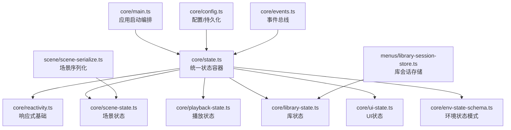
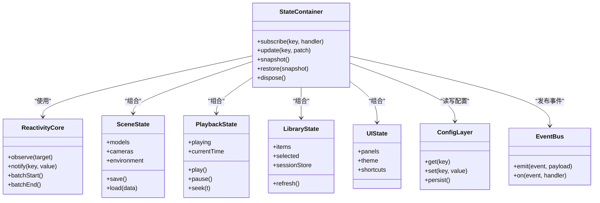
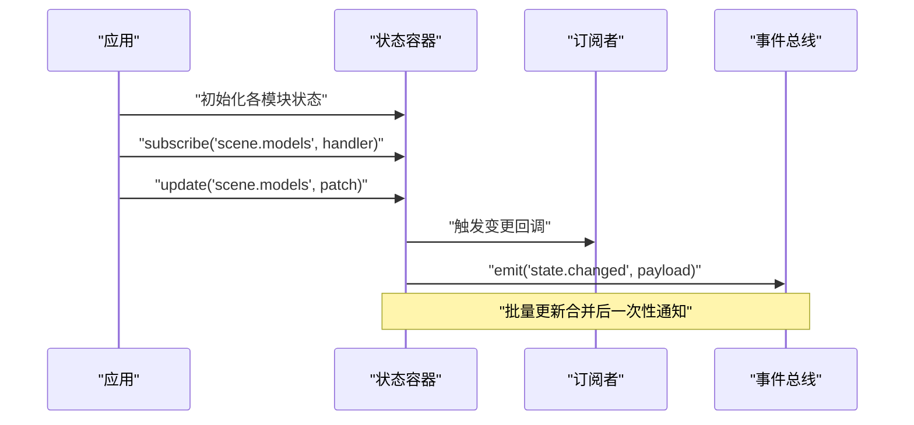
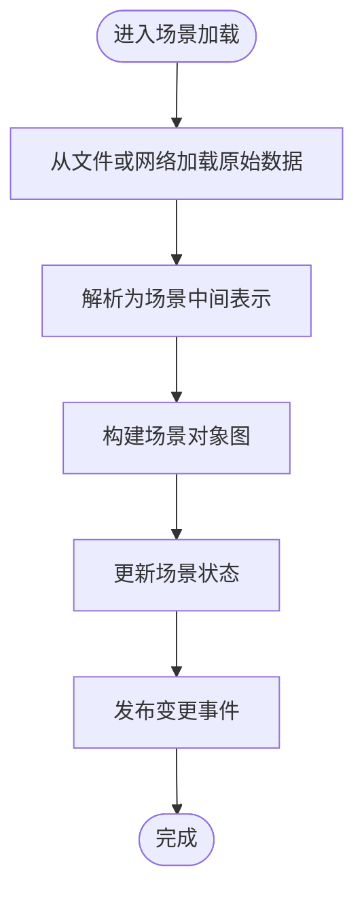
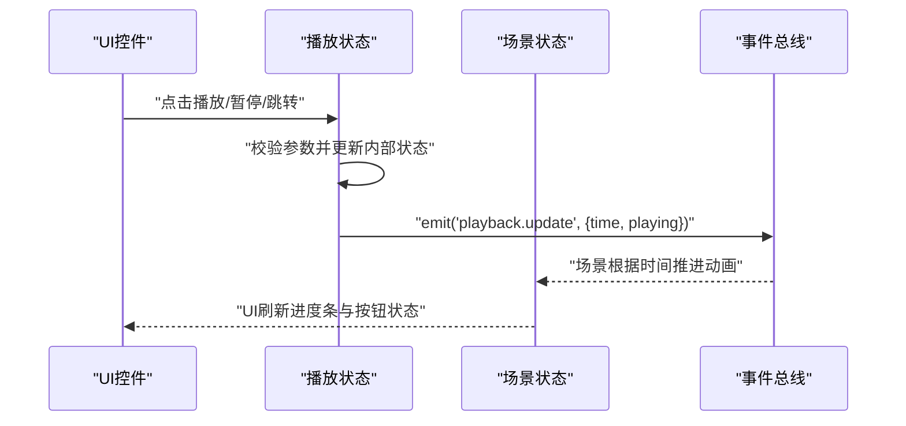
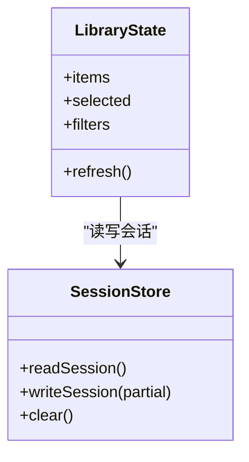
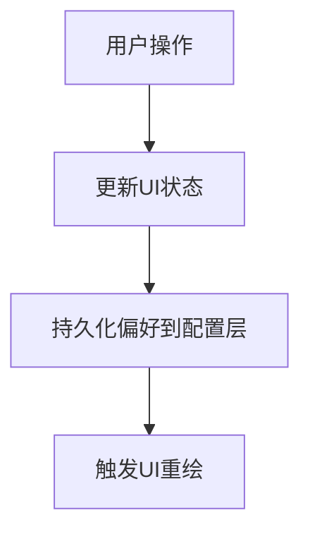
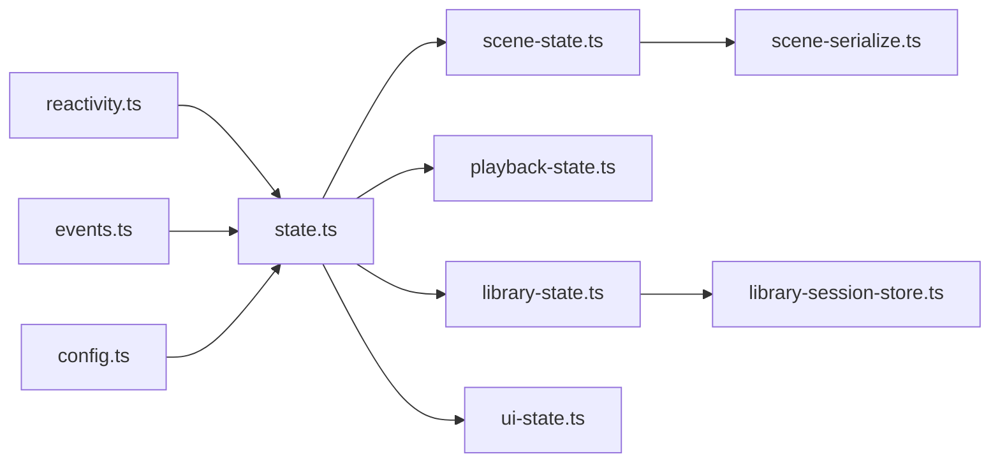

# 状态管理模式

<cite>
**本文引用的文件**   
- [frontend/src/core/state.ts](file://frontend/src/core/state.ts)
- [frontend/src/core/reactivity.ts](file://frontend/src/core/reactivity.ts)
- [frontend/src/core/scene-state.ts](file://frontend/src/core/scene-state.ts)
- [frontend/src/core/playback-state.ts](file://frontend/src/core/playback-state.ts)
- [frontend/src/core/library-state.ts](file://frontend/src/core/library-state.ts)
- [frontend/src/core/ui-state.ts](file://frontend/src/core/ui-state.ts)
- [frontend/src/core/env-state-schema.ts](file://frontend/src/core/env-state-schema.ts)
- [frontend/src/menus/library-session-store.ts](file://frontend/src/menus/library-session-store.ts)
- [frontend/src/scene/scene-serialize.ts](file://frontend/src/scene/scene-serialize.ts)
- [frontend/src/core/config.ts](file://frontend/src/core/config.ts)
- [frontend/src/core/events.ts](file://frontend/src/core/events.ts)
- [frontend/src/core/main.ts](file://frontend/src/core/main.ts)
- [MikuMikuAR/frontend/src/config.ts](file://MikuMikuAR/frontend/src/config.ts)
- [MikuMikuAR/frontend/src/scene-menu.ts](file://MikuMikuAR/frontend/src/scene-menu.ts)
</cite>

## 目录
1. [引言](#引言)
2. [项目结构](#项目结构)
3. [核心组件](#核心组件)
4. [架构总览](#架构总览)
5. [详细组件分析](#详细组件分析)
6. [依赖分析](#依赖分析)
7. [性能考虑](#性能考虑)
8. [故障排查指南](#故障排查指南)
9. [结论](#结论)
10. [附录](#附录)

## 引言
本设计文档聚焦 MikuMikuAR 应用的状态管理，目标是建立清晰、可维护、可扩展的状态分层与更新机制。文档覆盖：
- 全局状态、局部状态、持久化状态的分层策略
- 响应式数据绑定、状态订阅与通知系统
- 模块间状态隔离与共享（场景、播放、库、UI）
- 状态序列化/反序列化与重启恢复
- 版本管理与迁移策略
- 调试与监控工具使用建议

## 项目结构
前端状态相关代码主要位于 frontend/src/core 与 menus、scene 等子目录中。核心职责划分如下：
- core/state.ts：统一状态容器与生命周期入口
- core/reactivity.ts：响应式基础能力（订阅/发布、变更追踪）
- core/*-state.ts：领域状态（场景、播放、库、UI、环境模式等）
- menus/library-session-store.ts：会话级库状态存储
- scene/scene-serialize.ts：场景状态序列化/反序列化
- core/config.ts：配置与持久化桥接
- core/events.ts：事件总线与跨模块通知
- core/main.ts：应用启动与状态初始化编排

**图示来源**
- [frontend/src/core/main.ts](file://frontend/src/core/main.ts)
- [frontend/src/core/state.ts](file://frontend/src/core/state.ts)
- [frontend/src/core/reactivity.ts](file://frontend/src/core/reactivity.ts)
- [frontend/src/core/scene-state.ts](file://frontend/src/core/scene-state.ts)
- [frontend/src/core/playback-state.ts](file://frontend/src/core/playback-state.ts)
- [frontend/src/core/library-state.ts](file://frontend/src/core/library-state.ts)
- [frontend/src/core/ui-state.ts](file://frontend/src/core/ui-state.ts)
- [frontend/src/core/env-state-schema.ts](file://frontend/src/core/env-state-schema.ts)
- [frontend/src/menus/library-session-store.ts](file://frontend/src/menus/library-session-store.ts)
- [frontend/src/scene/scene-serialize.ts](file://frontend/src/scene/scene-serialize.ts)
- [frontend/src/core/config.ts](file://frontend/src/core/config.ts)
- [frontend/src/core/events.ts](file://frontend/src/core/events.ts)

**章节来源**
- [frontend/src/core/main.ts](file://frontend/src/core/main.ts)
- [frontend/src/core/state.ts](file://frontend/src/core/state.ts)
- [frontend/src/core/reactivity.ts](file://frontend/src/core/reactivity.ts)

## 核心组件
- 统一状态容器：提供集中式状态访问、生命周期钩子、跨模块协调点
- 响应式基础：实现最小粒度的订阅/发布、变更通知、批量更新
- 领域状态：按业务域拆分（场景、播放、库、UI、环境），各自负责内部一致性
- 会话存储：针对库浏览与会话上下文进行轻量持久化
- 序列化器：将场景状态转换为可保存格式，并支持回滚恢复
- 配置与事件：为状态提供外部输入与跨模块通信通道

**章节来源**
- [frontend/src/core/state.ts](file://frontend/src/core/state.ts)
- [frontend/src/core/reactivity.ts](file://frontend/src/core/reactivity.ts)
- [frontend/src/core/scene-state.ts](file://frontend/src/core/scene-state.ts)
- [frontend/src/core/playback-state.ts](file://frontend/src/core/playback-state.ts)
- [frontend/src/core/library-state.ts](file://frontend/src/core/library-state.ts)
- [frontend/src/core/ui-state.ts](file://frontend/src/core/ui-state.ts)
- [frontend/src/menus/library-session-store.ts](file://frontend/src/menus/library-session-store.ts)
- [frontend/src/scene/scene-serialize.ts](file://frontend/src/scene/scene-serialize.ts)
- [frontend/src/core/config.ts](file://frontend/src/core/config.ts)
- [frontend/src/core/events.ts](file://frontend/src/core/events.ts)

## 架构总览
状态分层采用“容器 + 领域”的混合模式：
- 全局状态：由统一状态容器持有，暴露只读视图与受控写入接口
- 局部状态：各模块内维护自身状态，通过容器提供的 API 与外界交互
- 持久化状态：配置与关键运行时快照通过配置层与存储层落盘

**图示来源**
- [frontend/src/core/state.ts](file://frontend/src/core/state.ts)
- [frontend/src/core/reactivity.ts](file://frontend/src/core/reactivity.ts)
- [frontend/src/core/scene-state.ts](file://frontend/src/core/scene-state.ts)
- [frontend/src/core/playback-state.ts](file://frontend/src/core/playback-state.ts)
- [frontend/src/core/library-state.ts](file://frontend/src/core/library-state.ts)
- [frontend/src/core/ui-state.ts](file://frontend/src/core/ui-state.ts)
- [frontend/src/core/config.ts](file://frontend/src/core/config.ts)
- [frontend/src/core/events.ts](file://frontend/src/core/events.ts)

## 详细组件分析

### 全局状态容器与响应式基础
- 职责
  - 提供统一的 subscribe/update/snapshot/restore 接口
  - 基于响应式内核实现细粒度订阅与批量更新
  - 在应用启动时完成各模块状态实例化与注册
- 关键点
  - 订阅者模型：键值路径到回调集合，避免全量重渲染
  - 批量更新：合并多次变更，减少通知风暴
  - 快照与恢复：用于撤销/重做与崩溃恢复
- 与外部集成
  - 通过事件总线广播状态变更，供 UI 或子系统消费
  - 通过配置层读取默认值与用户偏好

**图示来源**
- [frontend/src/core/state.ts](file://frontend/src/core/state.ts)
- [frontend/src/core/reactivity.ts](file://frontend/src/core/reactivity.ts)
- [frontend/src/core/events.ts](file://frontend/src/core/events.ts)

**章节来源**
- [frontend/src/core/state.ts](file://frontend/src/core/state.ts)
- [frontend/src/core/reactivity.ts](file://frontend/src/core/reactivity.ts)
- [frontend/src/core/events.ts](file://frontend/src/core/events.ts)

### 场景状态（SceneState）
- 职责
  - 管理场景中的模型、相机、环境等对象及其变换
  - 提供 save/load 以对接序列化器
- 关键点
  - 与渲染管线解耦，仅持有必要引用与元数据
  - 变更通过容器发布，驱动 UI 与回放同步
- 序列化
  - 与 scene-serialize.ts 协作，输出稳定结构以便存档与分享

**图示来源**
- [frontend/src/core/scene-state.ts](file://frontend/src/core/scene-state.ts)
- [frontend/src/scene/scene-serialize.ts](file://frontend/src/scene/scene-serialize.ts)

**章节来源**
- [frontend/src/core/scene-state.ts](file://frontend/src/core/scene-state.ts)
- [frontend/src/scene/scene-serialize.ts](file://frontend/src/scene/scene-serialize.ts)

### 播放状态（PlaybackState）
- 职责
  - 管理播放控制（开始/暂停/跳转）、时间轴、循环与速率
- 关键点
  - 与动作系统解耦，仅持有控制语义与当前时间
  - 变更事件驱动渲染帧与 UI 控件同步
- 与场景状态交互
  - 通过事件总线通知场景状态更新动画进度

**图示来源**
- [frontend/src/core/playback-state.ts](file://frontend/src/core/playback-state.ts)
- [frontend/src/core/scene-state.ts](file://frontend/src/core/scene-state.ts)
- [frontend/src/core/events.ts](file://frontend/src/core/events.ts)

**章节来源**
- [frontend/src/core/playback-state.ts](file://frontend/src/core/playback-state.ts)
- [frontend/src/core/events.ts](file://frontend/src/core/events.ts)

### 库状态（LibraryState）与会话存储
- 职责
  - 管理资源列表、选中项、筛选与分页
  - 结合 library-session-store.ts 维持会话级上下文（如上次浏览位置）
- 关键点
  - 会话存储独立于全局持久化，便于快速恢复最近工作区
  - 与菜单层联动，提供一致的浏览体验

**图示来源**
- [frontend/src/core/library-state.ts](file://frontend/src/core/library-state.ts)
- [frontend/src/menus/library-session-store.ts](file://frontend/src/menus/library-session-store.ts)

**章节来源**
- [frontend/src/core/library-state.ts](file://frontend/src/core/library-state.ts)
- [frontend/src/menus/library-session-store.ts](file://frontend/src/menus/library-session-store.ts)

### UI 状态（UIState）
- 职责
  - 管理面板显隐、主题、快捷键映射、窗口布局等
- 关键点
  - 与业务状态解耦，仅反映用户界面偏好与临时交互态
  - 通过配置层持久化用户偏好

**图示来源**
- [frontend/src/core/ui-state.ts](file://frontend/src/core/ui-state.ts)
- [frontend/src/core/config.ts](file://frontend/src/core/config.ts)

**章节来源**
- [frontend/src/core/ui-state.ts](file://frontend/src/core/ui-state.ts)
- [frontend/src/core/config.ts](file://frontend/src/core/config.ts)

### 环境状态模式（EnvStateSchema）
- 职责
  - 定义环境相关状态的字段结构与约束
- 关键点
  - 作为环境子系统与 UI 之间的契约，确保前后端一致
  - 配合序列化器进行环境预设的导入导出

**章节来源**
- [frontend/src/core/env-state-schema.ts](file://frontend/src/core/env-state-schema.ts)

### 应用启动与状态装配
- 职责
  - 初始化配置、事件总线、各模块状态，并挂载到统一容器
- 关键点
  - 顺序化启动，确保依赖就绪后再执行后续逻辑
  - 提供错误边界与降级策略

**章节来源**
- [frontend/src/core/main.ts](file://frontend/src/core/main.ts)

## 依赖分析
- 耦合关系
  - 状态容器对响应式内核强依赖；领域状态对容器弱依赖（通过接口）
  - 事件总线贯穿各模块，降低直接耦合
  - 配置层为所有模块提供外部输入
- 潜在风险
  - 过度使用全局状态可能导致难以定位的副作用
  - 事件风暴需通过批量更新与节流策略缓解

**图示来源**
- [frontend/src/core/reactivity.ts](file://frontend/src/core/reactivity.ts)
- [frontend/src/core/state.ts](file://frontend/src/core/state.ts)
- [frontend/src/core/events.ts](file://frontend/src/core/events.ts)
- [frontend/src/core/config.ts](file://frontend/src/core/config.ts)
- [frontend/src/core/scene-state.ts](file://frontend/src/core/scene-state.ts)
- [frontend/src/core/playback-state.ts](file://frontend/src/core/playback-state.ts)
- [frontend/src/core/library-state.ts](file://frontend/src/core/library-state.ts)
- [frontend/src/core/ui-state.ts](file://frontend/src/core/ui-state.ts)
- [frontend/src/menus/library-session-store.ts](file://frontend/src/menus/library-session-store.ts)
- [frontend/src/scene/scene-serialize.ts](file://frontend/src/scene/scene-serialize.ts)

**章节来源**
- [frontend/src/core/state.ts](file://frontend/src/core/state.ts)
- [frontend/src/core/reactivity.ts](file://frontend/src/core/reactivity.ts)
- [frontend/src/core/events.ts](file://frontend/src/core/events.ts)
- [frontend/src/core/config.ts](file://frontend/src/core/config.ts)

## 性能考虑
- 批量更新：合并高频变更，减少通知次数
- 选择性订阅：仅订阅需要的键路径，避免全量监听
- 懒加载与缓存：库列表与缩略图按需加载，结合会话存储加速恢复
- 事件节流：UI 与渲染侧对高频事件进行节流或去抖
- 快照大小控制：仅保留必要字段，必要时分块持久化

[本节为通用指导，不直接分析具体文件]

## 故障排查指南
- 常见问题
  - 状态未恢复：检查启动流程是否调用 restore，确认快照版本兼容
  - UI 不同步：确认订阅路径是否正确，是否存在批量更新导致的延迟
  - 事件风暴：检查是否有重复订阅或未清理的监听器
- 诊断手段
  - 启用调试日志，记录关键状态变更与事件
  - 使用快照对比工具定位差异
  - 通过事件总线监听特定事件，验证传播链路

**章节来源**
- [frontend/src/core/state.ts](file://frontend/src/core/state.ts)
- [frontend/src/core/events.ts](file://frontend/src/core/events.ts)
- [frontend/src/core/config.ts](file://frontend/src/core/config.ts)

## 结论
通过“容器 + 领域 + 响应式 + 事件”的分层架构，MikuMikuAR 实现了清晰的状态边界与高效的更新机制。结合会话存储与场景序列化，应用具备可靠的恢复能力与良好的扩展性。未来可在版本迁移与监控方面进一步完善，以提升长期可维护性与可观测性。

[本节为总结性内容，不直接分析具体文件]

## 附录

### 状态分层与管理策略
- 全局状态：由统一容器持有，对外暴露受控接口
- 局部状态：各模块内部维护，通过容器与事件总线与外界交互
- 持久化状态：配置层与场景序列化负责落盘与恢复

**章节来源**
- [frontend/src/core/state.ts](file://frontend/src/core/state.ts)
- [frontend/src/core/config.ts](file://frontend/src/core/config.ts)
- [frontend/src/scene/scene-serialize.ts](file://frontend/src/scene/scene-serialize.ts)

### 状态更新机制
- 响应式数据绑定：基于键路径的细粒度订阅
- 状态订阅：subscribe 返回可取消的句柄，避免内存泄漏
- 通知系统：事件总线承载跨模块通知，UI 与子系统按需消费

**章节来源**
- [frontend/src/core/reactivity.ts](file://frontend/src/core/reactivity.ts)
- [frontend/src/core/events.ts](file://frontend/src/core/events.ts)

### 模块间状态隔离与共享
- 隔离：各模块状态私有，通过容器接口访问
- 共享：通过事件总线与只读视图共享必要信息
- 交互关系：场景与播放通过事件协同；库与 UI 通过状态与配置联动

**章节来源**
- [frontend/src/core/scene-state.ts](file://frontend/src/core/scene-state.ts)
- [frontend/src/core/playback-state.ts](file://frontend/src/core/playback-state.ts)
- [frontend/src/core/library-state.ts](file://frontend/src/core/library-state.ts)
- [frontend/src/core/ui-state.ts](file://frontend/src/core/ui-state.ts)
- [frontend/src/core/events.ts](file://frontend/src/core/events.ts)

### 状态序列化与恢复
- 序列化：场景状态经序列化器转为稳定结构
- 反序列化：启动时读取快照并重建场景对象图
- 恢复策略：失败时回退到上一可用快照

**章节来源**
- [frontend/src/scene/scene-serialize.ts](file://frontend/src/scene/scene-serialize.ts)
- [frontend/src/core/state.ts](file://frontend/src/core/state.ts)

### 版本管理与迁移
- 版本标识：在快照中包含版本号
- 迁移策略：按版本递增执行迁移脚本，保证向后兼容
- 兼容性：旧版本快照在升级后可被安全处理

**章节来源**
- [frontend/src/core/state.ts](file://frontend/src/core/state.ts)
- [frontend/src/core/config.ts](file://frontend/src/core/config.ts)

### 调试与监控工具
- 调试开关：通过配置层启用调试日志
- 监控指标：记录关键状态变更频率与耗时
- 可视化：在 UI 中展示状态树与事件流

**章节来源**
- [frontend/src/core/config.ts](file://frontend/src/core/config.ts)
- [frontend/src/core/events.ts](file://frontend/src/core/events.ts)

### 其他相关文件参考
- 前端顶层配置与场景菜单入口
  - [MikuMikuAR/frontend/src/config.ts](file://MikuMikuAR/frontend/src/config.ts)
  - [MikuMikuAR/frontend/src/scene-menu.ts](file://MikuMikuAR/frontend/src/scene-menu.ts)

**章节来源**
- [MikuMikuAR/frontend/src/config.ts](file://MikuMikuAR/frontend/src/config.ts)
- [MikuMikuAR/frontend/src/scene-menu.ts](file://MikuMikuAR/frontend/src/scene-menu.ts)