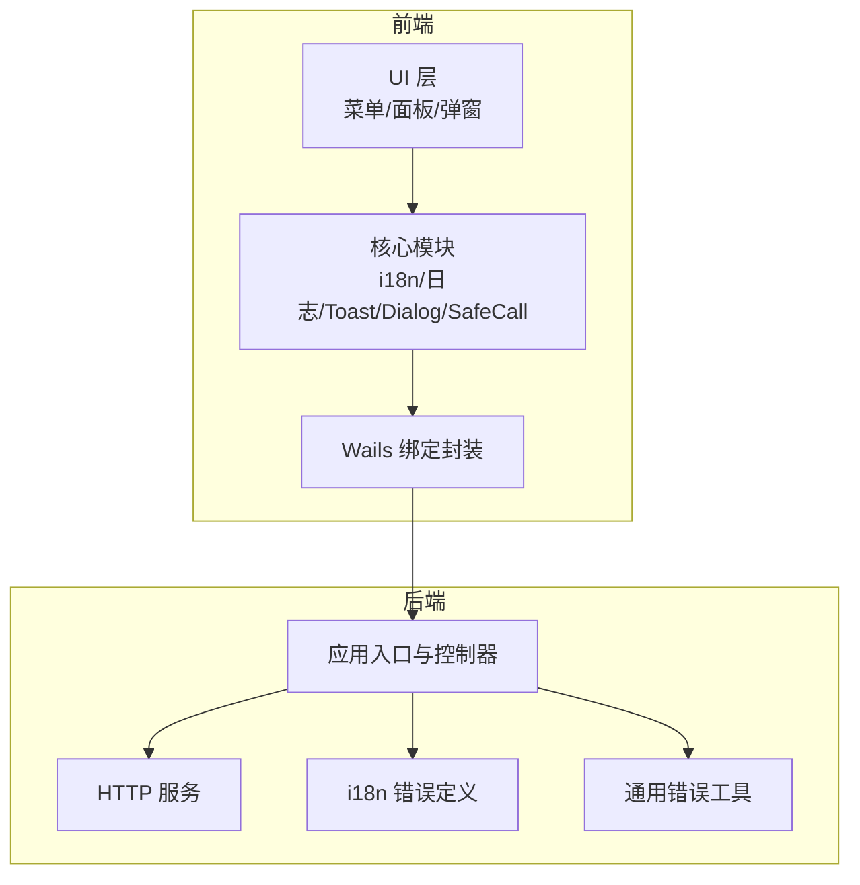
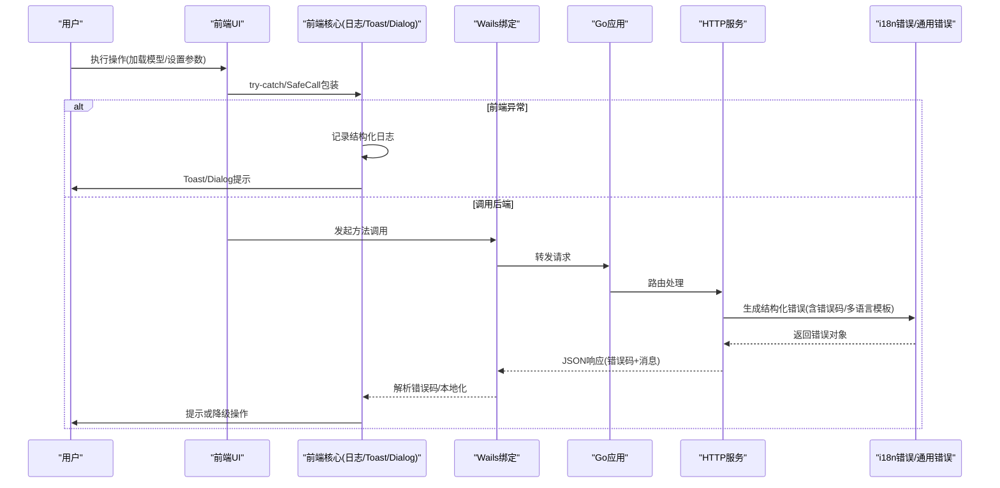
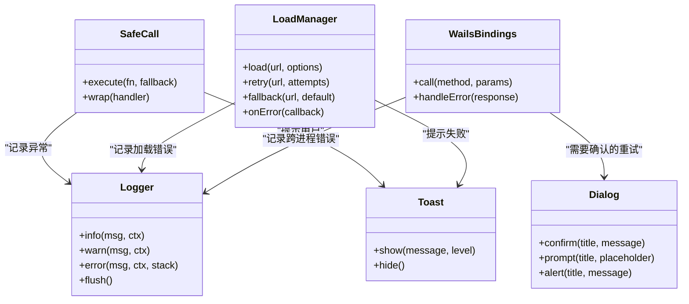
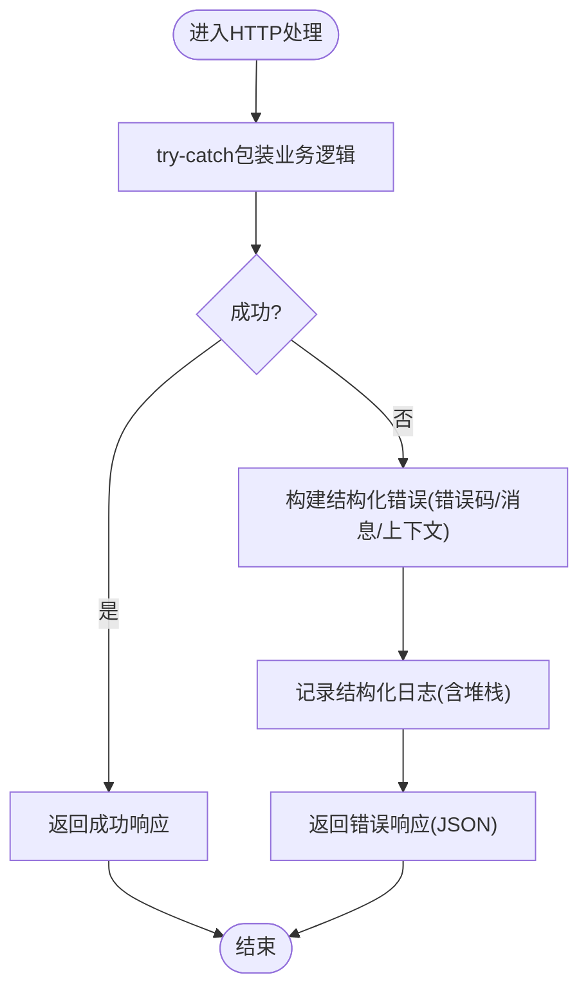
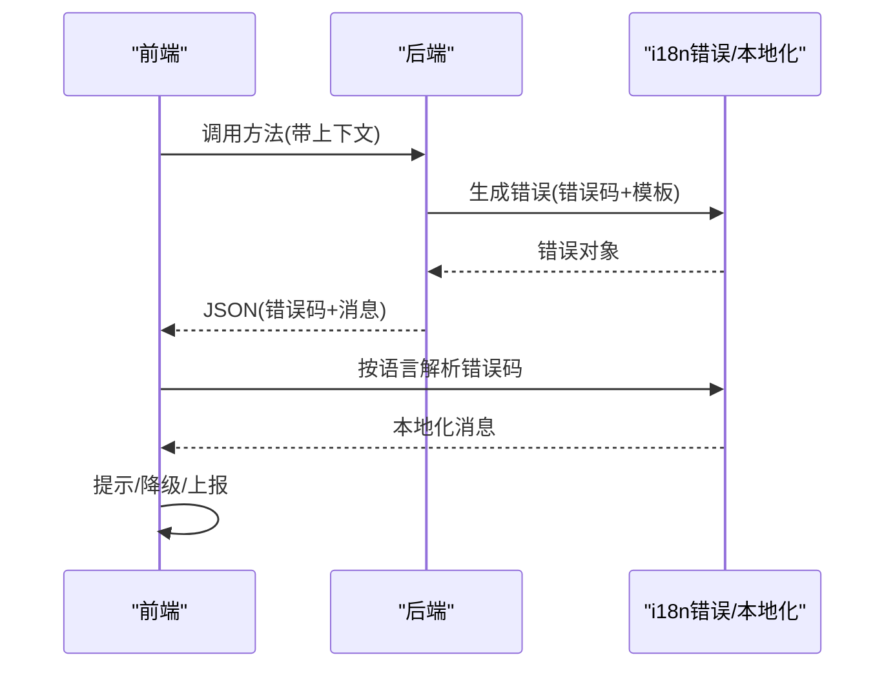
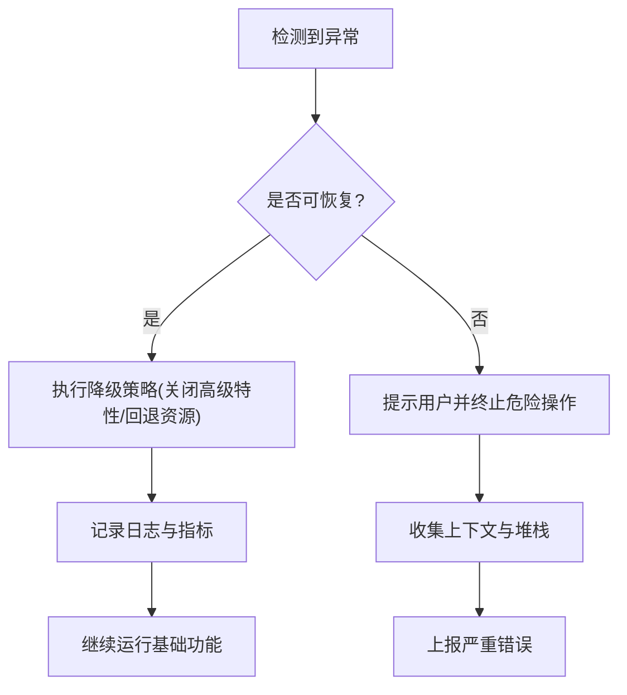
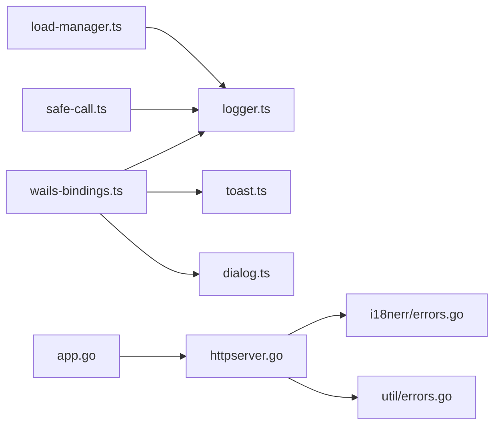

# 错误处理策略

<cite>
**本文引用的文件**   
- [main.go](file://main.go)
- [app.go](file://internal/app/app.go)
- [httpserver.go](file://internal/app/httpserver.go)
- [errors.go](file://internal/i18nerr/errors.go)
- [errors.go](file://internal/util/errors.go)
- [goerr.ts](file://frontend/src/core/i18n/goerr.ts)
- [logger.ts](file://frontend/src/core/logger.ts)
- [toast.ts](file://frontend/src/core/toast.ts)
- [dialog.ts](file://frontend/src/core/dialog.ts)
- [safe-call.ts](file://frontend/src/core/safe-call.ts)
- [load-manager.ts](file://frontend/src/core/load-manager.ts)
- [wails-bindings.ts](file://frontend/src/core/wails-bindings.ts)
- [config.ts](file://frontend/src/config.ts)
- [runtime-mode.ts](file://frontend/src/core/runtime-mode.ts)
</cite>

## 目录
1. [引言](#引言)
2. [项目结构](#项目结构)
3. [核心组件](#核心组件)
4. [架构总览](#架构总览)
5. [详细组件分析](#详细组件分析)
6. [依赖关系分析](#依赖关系分析)
7. [性能考量](#性能考量)
8. [故障排查指南](#故障排查指南)
9. [结论](#结论)
10. [附录](#附录)

## 引言
本设计文档聚焦 MikuMikuAR 的错误处理体系，覆盖错误分类与层级、捕获与传播机制、日志记录与上报、跨语言（Go 后端与 TypeScript 前端）错误码映射与本地化、以及错误恢复与降级策略。目标是确保在异常情况下应用仍能保持基本功能可用，并提供可观测性与可诊断性。

## 项目结构
本项目采用前后端分离的 Wails v3 架构：
- Go 后端负责系统能力、文件系统、HTTP 服务、WASM 运行时交互等；
- TypeScript 前端负责渲染、UI、状态管理与用户交互；
- 通过 Wails 绑定进行跨进程通信，错误信息以结构化形式传递并统一处理。

**图表来源**
- [main.go:1-200](file://main.go#L1-L200)
- [app.go:1-200](file://internal/app/app.go#L1-L200)
- [httpserver.go:1-200](file://internal/app/httpserver.go#L1-L200)
- [errors.go](file://internal/i18nerr/errors.go)
- [errors.go](file://internal/util/errors.go)
- [goerr.ts](file://frontend/src/core/i18n/goerr.ts)
- [logger.ts](file://frontend/src/core/logger.ts)
- [toast.ts](file://frontend/src/core/toast.ts)
- [dialog.ts](file://frontend/src/core/dialog.ts)
- [safe-call.ts](file://frontend/src/core/safe-call.ts)
- [load-manager.ts](file://frontend/src/core/load-manager.ts)
- [wails-bindings.ts](file://frontend/src/core/wails-bindings.ts)

**章节来源**
- [main.go:1-200](file://main.go#L1-L200)
- [app.go:1-200](file://internal/app/app.go#L1-L200)
- [httpserver.go:1-200](file://internal/app/httpserver.go#L1-L200)

## 核心组件
- 错误分类与层级
  - 用户可感知错误：用于 UI 提示、引导修复或降级操作，如资源加载失败、权限不足、网络不可用。
  - 系统内部错误：框架或子系统内部异常，需记录堆栈并尽量恢复，避免崩溃。
  - 第三方依赖错误：外部库、WASM、浏览器 API、平台能力的异常，需做兼容与降级。
- 错误捕获与传播
  - 前端：使用 try-catch 包裹异步任务，结合 SafeCall 包装回调，全局错误边界拦截未捕获异常，并通过 Toast/Dialog 反馈给用户。
  - 后端：HTTP 中间件统一捕获异常，转换为结构化响应；关键路径使用安全调用工具避免 panic 扩散。
- 日志与上报
  - 结构化日志：包含时间戳、级别、上下文键值对、错误码、请求 ID、堆栈片段。
  - 上报：可选将严重错误与性能指标上报到远端或导出为本地日志文件。
- 跨语言错误处理
  - Go 侧使用 i18n 错误类型承载错误码与多语言消息模板；
  - TS 侧提供错误码映射与本地化解析，保证用户可见消息一致。
- 恢复与降级
  - 资源加载失败时回退到默认资源或离线模式；
  - 渲染/物理引擎异常时关闭高级特性，保留基础播放与编辑能力；
  - WASM 初始化失败时切换至兼容模式或提示安装依赖。

**章节来源**
- [errors.go](file://internal/i18nerr/errors.go)
- [errors.go](file://internal/util/errors.go)
- [goerr.ts](file://frontend/src/core/i18n/goerr.ts)
- [logger.ts](file://frontend/src/core/logger.ts)
- [toast.ts](file://frontend/src/core/toast.ts)
- [dialog.ts](file://frontend/src/core/dialog.ts)
- [safe-call.ts](file://frontend/src/core/safe-call.ts)
- [load-manager.ts](file://frontend/src/core/load-manager.ts)
- [wails-bindings.ts](file://frontend/src/core/wails-bindings.ts)

## 架构总览
下图展示从前端触发到后端处理的完整错误流，包括捕获、转换、日志与用户提示。

**图表来源**
- [wails-bindings.ts](file://frontend/src/core/wails-bindings.ts)
- [app.go:1-200](file://internal/app/app.go#L1-L200)
- [httpserver.go:1-200](file://internal/app/httpserver.go#L1-L200)
- [errors.go](file://internal/i18nerr/errors.go)
- [errors.go](file://internal/util/errors.go)
- [goerr.ts](file://frontend/src/core/i18n/goerr.ts)
- [logger.ts](file://frontend/src/core/logger.ts)
- [toast.ts](file://frontend/src/core/toast.ts)
- [dialog.ts](file://frontend/src/core/dialog.ts)

## 详细组件分析

### 前端错误处理组件
- 安全调用与安全包装
  - 目的：防止回调或事件处理器中的异常导致整个渲染循环中断。
  - 行为：捕获异常、记录日志、必要时触发降级逻辑。
- 全局错误边界
  - 目的：捕获未处理异常，避免页面白屏。
  - 行为：显示友好提示、收集上下文、尝试恢复状态。
- 用户提示与对话
  - Toast：轻量提示，适合非阻塞错误。
  - Dialog：需要用户确认或输入的场景，如重试、选择替代资源。
- 加载管理器
  - 目的：统一管理资源加载生命周期与错误分支。
  - 行为：超时控制、重试策略、失败回退、进度与错误上报。
- 日志与上报
  - 结构化字段：时间、级别、模块、错误码、请求ID、堆栈片段、环境信息。
  - 上报：生产模式下可选择上报严重错误与性能指标。

**图表来源**
- [safe-call.ts](file://frontend/src/core/safe-call.ts)
- [logger.ts](file://frontend/src/core/logger.ts)
- [toast.ts](file://frontend/src/core/toast.ts)
- [dialog.ts](file://frontend/src/core/dialog.ts)
- [load-manager.ts](file://frontend/src/core/load-manager.ts)
- [wails-bindings.ts](file://frontend/src/core/wails-bindings.ts)

**章节来源**
- [safe-call.ts](file://frontend/src/core/safe-call.ts)
- [logger.ts](file://frontend/src/core/logger.ts)
- [toast.ts](file://frontend/src/core/toast.ts)
- [dialog.ts](file://frontend/src/core/dialog.ts)
- [load-manager.ts](file://frontend/src/core/load-manager.ts)
- [wails-bindings.ts](file://frontend/src/core/wails-bindings.ts)

### 后端错误处理组件
- HTTP 中间件
  - 作用：统一捕获请求级异常，标准化错误响应格式，附加请求ID与上下文。
- i18n 错误类型
  - 作用：携带错误码、多语言消息模板与占位符，便于前端本地化。
- 通用错误工具
  - 作用：构造常见错误、包装第三方库异常、提供安全调用避免 panic 扩散。

**图表来源**
- [httpserver.go:1-200](file://internal/app/httpserver.go#L1-L200)
- [errors.go](file://internal/i18nerr/errors.go)
- [errors.go](file://internal/util/errors.go)

**章节来源**
- [httpserver.go:1-200](file://internal/app/httpserver.go#L1-L200)
- [errors.go](file://internal/i18nerr/errors.go)
- [errors.go](file://internal/util/errors.go)

### 跨语言错误处理与本地化
- 错误码映射
  - Go 侧定义错误码常量与 i18n 模板；
  - TS 侧维护映射表，将错误码解析为当前语言的友好消息。
- 本地化流程
  - 前端根据运行语言与错误码查找对应文案；
  - 若缺失则回退到默认语言或错误码本身，避免空白提示。
- 上下文传递
  - 请求ID、模块名、设备信息、版本等作为结构化上下文随错误一起上报。

**图表来源**
- [errors.go](file://internal/i18nerr/errors.go)
- [goerr.ts](file://frontend/src/core/i18n/goerr.ts)

**章节来源**
- [errors.go](file://internal/i18nerr/errors.go)
- [goerr.ts](file://frontend/src/core/i18n/goerr.ts)

### 错误恢复与降级策略
- 资源加载失败
  - 重试与超时控制；
  - 回退到默认纹理/模型或启用离线缓存；
  - 记录失败原因并提示用户检查网络或路径。
- 渲染/物理异常
  - 自动关闭高级特性（反射、体积云、水面）；
  - 切换到兼容渲染管线；
  - 保留基础动画播放与场景浏览。
- WASM 初始化失败
  - 检测依赖是否加载；
  - 提示用户重新加载或更新；
  - 降级为纯 JS 计算路径（若存在）。
- 平台能力缺失
  - 检测 AR 相机、WebXR、GPU 能力；
  - 禁用相关功能并给出替代方案。

[此图为概念流程图，不直接映射具体源码文件]

## 依赖关系分析
- 前端依赖
  - Wails 绑定：跨进程调用与错误响应解析；
  - 日志与提示：结构化日志、Toast/Dialog；
  - 加载管理：资源加载、重试与回退。
- 后端依赖
  - HTTP 服务：统一错误中间件；
  - i18n 错误：错误码与多语言模板；
  - 通用错误工具：安全调用与异常包装。

**图表来源**
- [wails-bindings.ts](file://frontend/src/core/wails-bindings.ts)
- [logger.ts](file://frontend/src/core/logger.ts)
- [toast.ts](file://frontend/src/core/toast.ts)
- [dialog.ts](file://frontend/src/core/dialog.ts)
- [load-manager.ts](file://frontend/src/core/load-manager.ts)
- [safe-call.ts](file://frontend/src/core/safe-call.ts)
- [httpserver.go:1-200](file://internal/app/httpserver.go#L1-L200)
- [errors.go](file://internal/i18nerr/errors.go)
- [errors.go](file://internal/util/errors.go)
- [app.go:1-200](file://internal/app/app.go#L1-L200)

**章节来源**
- [wails-bindings.ts](file://frontend/src/core/wails-bindings.ts)
- [logger.ts](file://frontend/src/core/logger.ts)
- [toast.ts](file://frontend/src/core/toast.ts)
- [dialog.ts](file://frontend/src/core/dialog.ts)
- [load-manager.ts](file://frontend/src/core/load-manager.ts)
- [safe-call.ts](file://frontend/src/core/safe-call.ts)
- [httpserver.go:1-200](file://internal/app/httpserver.go#L1-L200)
- [errors.go](file://internal/i18nerr/errors.go)
- [errors.go](file://internal/util/errors.go)
- [app.go:1-200](file://internal/app/app.go#L1-L200)

## 性能考量
- 日志开销
  - 生产环境下限制日志级别与采样率；
  - 避免在高频路径中写入大量堆栈。
- 错误上报
  - 批量上报与去重，减少网络抖动影响；
  - 仅上报必要上下文，避免泄露敏感信息。
- 降级策略
  - 动态关闭高成本特性，保障帧率与稳定性；
  - 预检平台能力，提前规避不可用路径。

[本节为通用指导，不直接分析具体文件]

## 故障排查指南
- 快速定位
  - 查看结构化日志中的错误码与请求ID；
  - 在前端控制台与后端日志中交叉比对。
- 常见问题
  - 资源404：检查路径配置与CDN缓存；
  - WASM加载失败：确认index_bg.wasm可达且CORS正确；
  - 跨域被拦：调整COEP/CORS策略；
  - UI硬编码中文：使用i18n键值替换。
- 调试技巧
  - 开启开发模式，输出详细堆栈；
  - 使用测试用例复现问题，缩小范围。

**章节来源**
- [logger.ts](file://frontend/src/core/logger.ts)
- [config.ts](file://frontend/src/config.ts)
- [runtime-mode.ts](file://frontend/src/core/runtime-mode.ts)

## 结论
通过统一的错误分类、捕获与传播机制，结合结构化日志与跨语言本地化，MikuMikuAR 能够在异常情况下保持基本功能可用，并提供良好的可观测性与用户体验。建议持续完善错误码体系、自动化上报与回归测试，进一步提升稳定性与可维护性。

## 附录
- 错误码规范
  - 命名：模块_子域_错误类型；
  - 示例：RESOURCE_NOT_FOUND、WASM_INIT_FAILED、PERMISSION_DENIED。
- 日志字段建议
  - timestamp、level、module、error_code、request_id、stack_trace、env_info。
- 本地化最佳实践
  - 优先使用键值而非硬编码文本；
  - 缺失文案时回退到默认语言或错误码。

[本节为通用规范，不直接分析具体文件]