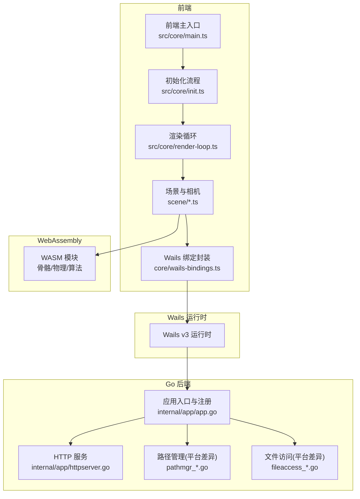
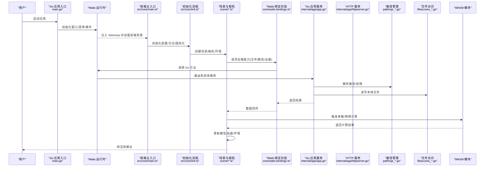
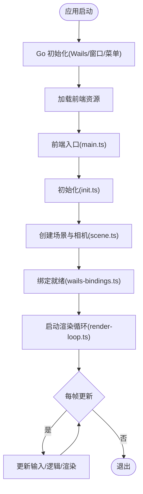
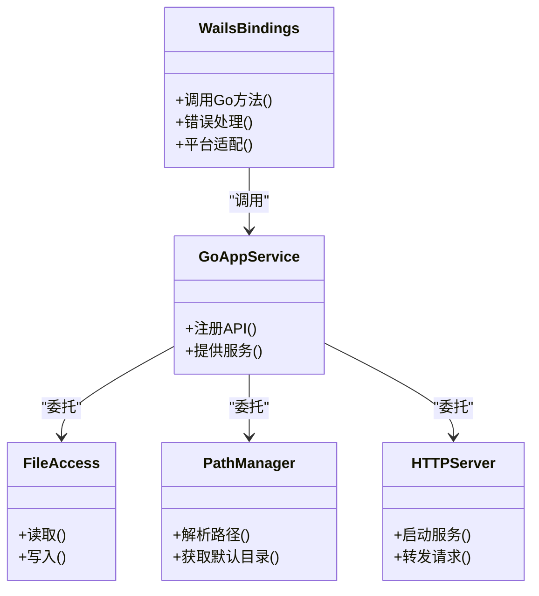
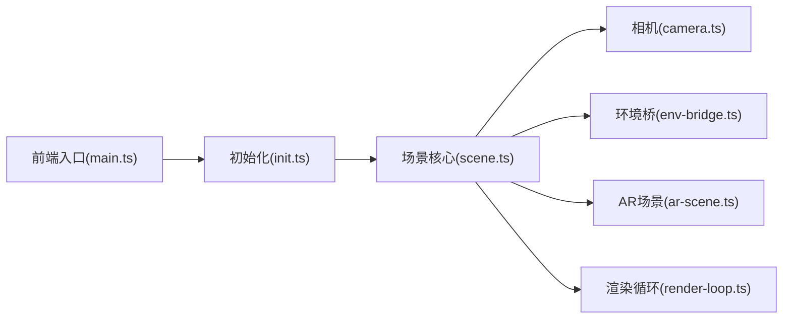
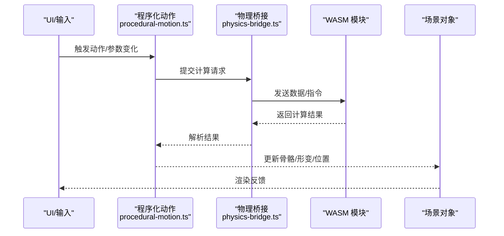
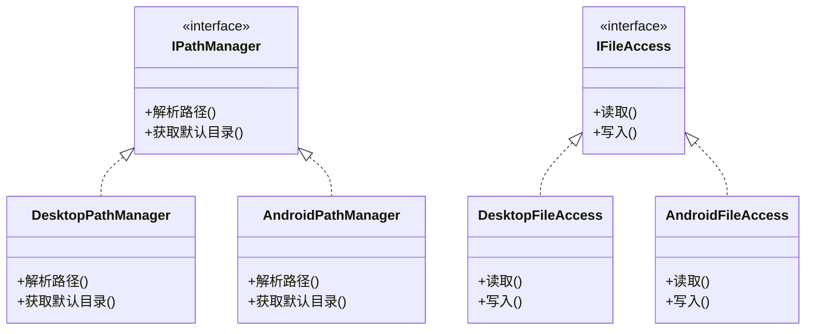
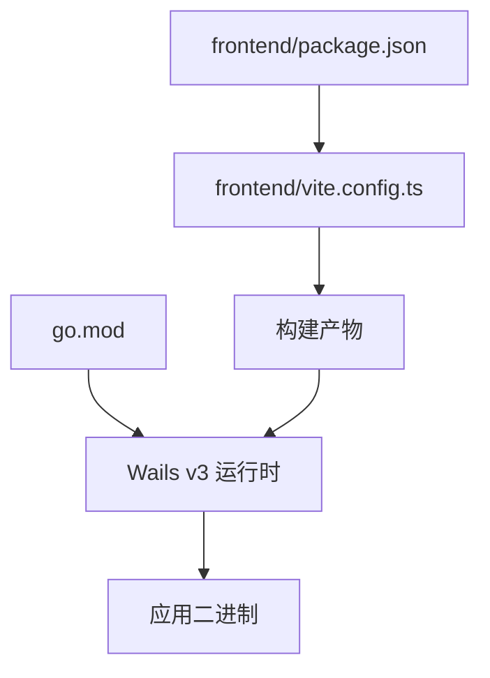

# 整体架构概览

<cite>
**本文引用的文件**   
- [main.go](file://main.go)
- [go.mod](file://go.mod)
- [frontend/package.json](file://frontend/package.json)
- [frontend/vite.config.ts](file://frontend/vite.config.ts)
- [frontend/src/core/main.ts](file://frontend/src/core/main.ts)
- [frontend/src/core/init.ts](file://frontend/src/core/init.ts)
- [frontend/src/core/render-loop.ts](file://frontend/src/core/render-loop.ts)
- [frontend/src/core/wails-bindings.ts](file://frontend/src/core/wails-bindings.ts)
- [frontend/bindings/mikumikuar/internal/app/index.ts](file://frontend/bindings/mikumikuar/internal/app/index.ts)
- [internal/app/app.go](file://internal/app/app.go)
- [internal/app/httpserver.go](file://internal/app/httpserver.go)
- [internal/app/pathmgr_desktop.go](file://internal/app/pathmgr_desktop.go)
- [internal/app/pathmgr_android.go](file://internal/app/pathmgr_android.go)
- [internal/app/fileaccess_desktop.go](file://internal/app/fileaccess_desktop.go)
- [internal/app/fileaccess_android.go](file://internal/app/fileaccess_android.go)
- [frontend/src/scene/scene.ts](file://frontend/src/scene/scene.ts)
- [frontend/src/scene/ar/ar-scene.ts](file://frontend/src/scene/ar/ar-scene.ts)
- [frontend/src/scene/camera/camera.ts](file://frontend/src/scene/camera/camera.ts)
- [frontend/src/scene/env/env-bridge.ts](file://frontend/src/scene/env/env-bridge.ts)
- [frontend/src/scene/manager/scene-manager.ts](file://frontend/src/scene/manager/scene-manager.ts)
- [frontend/src/motion-algos/procedural-motion.ts](file://frontend/src/motion-algos/procedural-motion.ts)
- [frontend/src/physics/physics-bridge.ts](file://frontend/src/physics/physics-bridge.ts)
</cite>

## 目录
1. [简介](#简介)
2. [项目结构](#项目结构)
3. [核心组件](#核心组件)
4. [架构总览](#架构总览)
5. [详细组件分析](#详细组件分析)
6. [依赖分析](#依赖分析)
7. [性能考量](#性能考量)
8. [故障排查指南](#故障排查指南)
9. [结论](#结论)
10. [附录](#附录)

## 简介
本文件为 MikuMikuAR 的整体架构概览，面向希望快速理解系统设计与运行方式的读者。文档聚焦以下目标：
- 前后端分离的架构模式与职责边界
- Wails v3 集成方案与跨平台运行时
- 前端、后端、WebAssembly 运行时的交互关系
- 应用生命周期管理（从启动到渲染）
- 技术栈选择原因（Go + TypeScript + Babylon.js）
- 跨平台统一抽象层设计思路（桌面、移动端、Web）

## 项目结构
仓库采用“前端工程 + Go 后端 + 文档与研究资料”的分层组织方式：
- 前端工程 frontend：基于 Vite + TypeScript，使用 Babylon.js 进行 3D 渲染，通过 Wails v3 绑定调用 Go 能力，并加载 WASM 模块执行高性能计算（如骨骼物理）。
- Go 后端 internal：提供文件系统访问、路径管理、HTTP 服务、库与场景预设、更新等原生能力，并通过 Wails 暴露给前端。
- 根级 main.go：Wails 应用入口，负责初始化窗口、菜单、事件总线与资源挂载。
- docs：包含 ADR、研究笔记、审计与发布说明等工程化文档。

图表来源
- [frontend/src/core/main.ts](file://frontend/src/core/main.ts)
- [frontend/src/core/init.ts](file://frontend/src/core/init.ts)
- [frontend/src/core/render-loop.ts](file://frontend/src/core/render-loop.ts)
- [frontend/src/core/wails-bindings.ts](file://frontend/src/core/wails-bindings.ts)
- [internal/app/app.go](file://internal/app/app.go)
- [internal/app/httpserver.go](file://internal/app/httpserver.go)
- [internal/app/pathmgr_desktop.go](file://internal/app/pathmgr_desktop.go)
- [internal/app/pathmgr_android.go](file://internal/app/pathmgr_android.go)
- [internal/app/fileaccess_desktop.go](file://internal/app/fileaccess_desktop.go)
- [internal/app/fileaccess_android.go](file://internal/app/fileaccess_android.go)

章节来源
- [main.go](file://main.go)
- [go.mod](file://go.mod)
- [frontend/package.json](file://frontend/package.json)
- [frontend/vite.config.ts](file://frontend/vite.config.ts)

## 核心组件
- 应用入口与生命周期
  - Go 侧：Wails 应用初始化、窗口与菜单注册、事件总线、静态资源挂载。
  - 前端侧：Vite 构建产物由 Wails 托管；前端在 WebView 中完成引擎初始化、场景创建、渲染循环启动。
- 前后端通信
  - 通过 Wails v3 的 TS 绑定生成代码，将 Go 方法以类型安全的方式暴露给前端。
  - 前端通过 wails-bindings 封装统一调用入口，屏蔽平台差异。
- 渲染与场景
  - 基于 Babylon.js 的场景图、相机、环境、材质管线与后处理。
  - AR 模式通过专用场景与相机桥接实现。
- 动作与物理
  - 程序化动作与 VMD 解析在前端 JS 中实现。
  - 高开销的物理/骨骼运算下沉至 WASM 模块，前端通过桥接层调度。
- 平台抽象
  - 路径管理与文件访问按平台拆分实现，对外暴露统一接口。

章节来源
- [internal/app/app.go](file://internal/app/app.go)
- [frontend/src/core/wails-bindings.ts](file://frontend/src/core/wails-bindings.ts)
- [frontend/src/scene/scene.ts](file://frontend/src/scene/scene.ts)
- [frontend/src/scene/ar/ar-scene.ts](file://frontend/src/scene/ar/ar-scene.ts)
- [frontend/src/physics/physics-bridge.ts](file://frontend/src/physics/physics-bridge.ts)
- [frontend/src/motion-algos/procedural-motion.ts](file://frontend/src/motion-algos/procedural-motion.ts)

## 架构总览
下图展示从启动到渲染的关键交互路径，以及前后端与 WASM 的职责划分。

图表来源
- [main.go](file://main.go)
- [frontend/src/core/main.ts](file://frontend/src/core/main.ts)
- [frontend/src/core/init.ts](file://frontend/src/core/init.ts)
- [frontend/src/core/render-loop.ts](file://frontend/src/core/render-loop.ts)
- [frontend/src/core/wails-bindings.ts](file://frontend/src/core/wails-bindings.ts)
- [internal/app/app.go](file://internal/app/app.go)
- [internal/app/httpserver.go](file://internal/app/httpserver.go)
- [internal/app/pathmgr_desktop.go](file://internal/app/pathmgr_desktop.go)
- [internal/app/pathmgr_android.go](file://internal/app/pathmgr_android.go)
- [internal/app/fileaccess_desktop.go](file://internal/app/fileaccess_desktop.go)
- [internal/app/fileaccess_android.go](file://internal/app/fileaccess_android.go)

## 详细组件分析

### 应用生命周期与启动流程
- Go 侧
  - 入口 main.go 负责 Wails 应用初始化、窗口与菜单注册、事件总线与静态资源挂载。
  - internal/app/app.go 注册业务服务（库、场景、预设、更新、HTTP 服务等），并提供统一的 API 暴露。
- 前端侧
  - frontend/src/core/main.ts 作为前端入口，负责与 Wails 运行时对接、初始化全局状态与 UI。
  - frontend/src/core/init.ts 完成配置加载、日志、国际化、平台检测等前置准备。
  - frontend/src/core/render-loop.ts 驱动 Babylon.js 渲染循环，协调输入、更新与绘制。
- 关键交互
  - 前端通过 core/wails-bindings.ts 调用 Go 能力，包括文件访问、路径解析、设置读写、HTTP 代理等。
  - 场景初始化完成后进入渲染循环，持续响应输入与异步任务。

图表来源
- [main.go](file://main.go)
- [frontend/src/core/main.ts](file://frontend/src/core/main.ts)
- [frontend/src/core/init.ts](file://frontend/src/core/init.ts)
- [frontend/src/core/render-loop.ts](file://frontend/src/core/render-loop.ts)
- [frontend/src/core/wails-bindings.ts](file://frontend/src/core/wails-bindings.ts)
- [internal/app/app.go](file://internal/app/app.go)

章节来源
- [main.go](file://main.go)
- [internal/app/app.go](file://internal/app/app.go)
- [frontend/src/core/main.ts](file://frontend/src/core/main.ts)
- [frontend/src/core/init.ts](file://frontend/src/core/init.ts)
- [frontend/src/core/render-loop.ts](file://frontend/src/core/render-loop.ts)

### 前后端通信与 Wails v3 集成
- 绑定生成
  - 通过 Wails v3 的绑定机制，Go 方法被编译为前端可用的 TypeScript 类型与函数，位于 frontend/bindings 下。
- 调用封装
  - 前端通过 core/wails-bindings.ts 对底层绑定进行二次封装，统一错误处理、重试策略与平台差异。
- 典型能力
  - 文件访问、路径管理、HTTP 服务、库与场景预设、更新检查等均由 Go 提供，前端按需调用。

图表来源
- [frontend/src/core/wails-bindings.ts](file://frontend/src/core/wails-bindings.ts)
- [frontend/bindings/mikumikuar/internal/app/index.ts](file://frontend/bindings/mikumikuar/internal/app/index.ts)
- [internal/app/app.go](file://internal/app/app.go)
- [internal/app/fileaccess_desktop.go](file://internal/app/fileaccess_desktop.go)
- [internal/app/fileaccess_android.go](file://internal/app/fileaccess_android.go)
- [internal/app/pathmgr_desktop.go](file://internal/app/pathmgr_desktop.go)
- [internal/app/pathmgr_android.go](file://internal/app/pathmgr_android.go)
- [internal/app/httpserver.go](file://internal/app/httpserver.go)

章节来源
- [frontend/src/core/wails-bindings.ts](file://frontend/src/core/wails-bindings.ts)
- [frontend/bindings/mikumikuar/internal/app/index.ts](file://frontend/bindings/mikumikuar/internal/app/index.ts)
- [internal/app/app.go](file://internal/app/app.go)
- [internal/app/httpserver.go](file://internal/app/httpserver.go)
- [internal/app/pathmgr_desktop.go](file://internal/app/pathmgr_desktop.go)
- [internal/app/pathmgr_android.go](file://internal/app/pathmgr_android.go)
- [internal/app/fileaccess_desktop.go](file://internal/app/fileaccess_desktop.go)
- [internal/app/fileaccess_android.go](file://internal/app/fileaccess_android.go)

### 渲染与场景子系统
- 场景与相机
  - scene/scene.ts 负责场景图、对象生命周期、资源加载与销毁。
  - scene/camera/camera.ts 提供多相机控制与输入映射。
- 环境系统
  - scene/env/env-bridge.ts 与环境相关子系统（天空、地面、水体、粒子等）解耦，提供统一配置与切换。
- AR 模式
  - scene/ar/ar-scene.ts 与 ar-camera.ts 提供 AR 相机接入与场景融合。
- 渲染循环
  - core/render-loop.ts 驱动 Babylon.js 渲染，协调输入、更新与绘制。

图表来源
- [frontend/src/core/main.ts](file://frontend/src/core/main.ts)
- [frontend/src/core/init.ts](file://frontend/src/core/init.ts)
- [frontend/src/scene/scene.ts](file://frontend/src/scene/scene.ts)
- [frontend/src/scene/camera/camera.ts](file://frontend/src/scene/camera/camera.ts)
- [frontend/src/scene/env/env-bridge.ts](file://frontend/src/scene/env/env-bridge.ts)
- [frontend/src/scene/ar/ar-scene.ts](file://frontend/src/scene/ar/ar-scene.ts)
- [frontend/src/core/render-loop.ts](file://frontend/src/core/render-loop.ts)

章节来源
- [frontend/src/scene/scene.ts](file://frontend/src/scene/scene.ts)
- [frontend/src/scene/camera/camera.ts](file://frontend/src/scene/camera/camera.ts)
- [frontend/src/scene/env/env-bridge.ts](file://frontend/src/scene/env/env-bridge.ts)
- [frontend/src/scene/ar/ar-scene.ts](file://frontend/src/scene/ar/ar-scene.ts)
- [frontend/src/core/render-loop.ts](file://frontend/src/core/render-loop.ts)

### 动作与物理（含 WASM 集成）
- 程序化动作
  - motion-algos/procedural-motion.ts 提供程序化动作框架与算法组合。
- 物理桥接
  - physics/physics-bridge.ts 负责与 WASM 模块交互，调度骨骼/布料/碰撞等计算。
- 数据流
  - 前端收集输入与状态，调用 WASM 计算，再将结果写回场景对象，驱动动画与形变。

图表来源
- [frontend/src/motion-algos/procedural-motion.ts](file://frontend/src/motion-algos/procedural-motion.ts)
- [frontend/src/physics/physics-bridge.ts](file://frontend/src/physics/physics-bridge.ts)

章节来源
- [frontend/src/motion-algos/procedural-motion.ts](file://frontend/src/motion-algos/procedural-motion.ts)
- [frontend/src/physics/physics-bridge.ts](file://frontend/src/physics/physics-bridge.ts)

### 跨平台统一抽象层
- 路径管理
  - pathmgr_desktop.go 与 pathmgr_android.go 分别实现桌面与 Android 的路径解析与默认目录策略。
- 文件访问
  - fileaccess_desktop.go 与 fileaccess_android.go 分别实现不同平台的文件读写与权限处理。
- 设计要点
  - 对外暴露统一接口，内部根据平台条件分支实现，保证前端与上层逻辑无需感知平台差异。

图表来源
- [internal/app/pathmgr_desktop.go](file://internal/app/pathmgr_desktop.go)
- [internal/app/pathmgr_android.go](file://internal/app/pathmgr_android.go)
- [internal/app/fileaccess_desktop.go](file://internal/app/fileaccess_desktop.go)
- [internal/app/fileaccess_android.go](file://internal/app/fileaccess_android.go)

章节来源
- [internal/app/pathmgr_desktop.go](file://internal/app/pathmgr_desktop.go)
- [internal/app/pathmgr_android.go](file://internal/app/pathmgr_android.go)
- [internal/app/fileaccess_desktop.go](file://internal/app/fileaccess_desktop.go)
- [internal/app/fileaccess_android.go](file://internal/app/fileaccess_android.go)

## 依赖分析
- 前端依赖
  - package.json 定义构建与运行依赖，vite.config.ts 配置开发服务器与打包策略。
- 后端依赖
  - go.mod 声明 Go 模块与第三方依赖，Wails v3 作为核心运行时。
- 运行时依赖
  - Wails 将前端资源嵌入应用，WebView 承载前端页面，Go 进程提供系统能力。

图表来源
- [frontend/package.json](file://frontend/package.json)
- [frontend/vite.config.ts](file://frontend/vite.config.ts)
- [go.mod](file://go.mod)

章节来源
- [frontend/package.json](file://frontend/package.json)
- [frontend/vite.config.ts](file://frontend/vite.config.ts)
- [go.mod](file://go.mod)

## 性能考量
- 渲染管线
  - 合理分层场景图，减少不必要的重建与重绘；利用 Babylon.js 的后处理与渲染目标优化反射、水面等效果。
- 计算卸载
  - 将 CPU 密集的计算（骨骼/布料/物理）下沉至 WASM，避免阻塞主线程；前端仅做数据编排与结果应用。
- 资源管理
  - 统一加载与缓存策略，避免重复下载与内存泄漏；按需加载大纹理与模型。
- 平台差异
  - 针对移动端限制特效等级与分辨率，确保流畅度与功耗平衡。

[本节为通用指导，不直接分析具体文件]

## 故障排查指南
- 常见问题定位
  - 启动失败：检查 Wails 初始化与前端资源加载是否成功。
  - 绑定调用异常：确认 Go 服务已注册且前端绑定版本一致。
  - 文件访问失败：核对路径解析与权限策略在不同平台的实现。
  - WASM 加载失败：检查资源路径与 MIME 类型，确保浏览器/WebView 支持。
- 建议步骤
  - 启用详细日志，定位错误堆栈与调用链。
  - 使用最小复现用例隔离问题域（例如单独测试文件访问或 WASM 调用）。
  - 对比桌面与移动端行为差异，验证平台抽象层的正确性。

[本节为通用指导，不直接分析具体文件]

## 结论
MikuMikuAR 采用前后端分离与 Wails v3 集成的架构，将系统能力与渲染逻辑清晰解耦：
- Go 后端提供稳定的系统能力与资源管理；
- 前端基于 Babylon.js 构建高性能 3D 体验；
- WASM 承担高开销计算，提升整体性能；
- 平台抽象层屏蔽差异，保障跨平台一致性。
该设计兼顾可维护性、可扩展性与跨平台部署需求，适合持续演进与功能扩展。

[本节为总结性内容，不直接分析具体文件]

## 附录
- 技术栈选择理由
  - Go：并发模型成熟、生态完善、易于构建跨平台二进制，适合作为系统能力提供者。
  - TypeScript：类型安全、工程化能力强，便于大型前端项目的协作与维护。
  - Babylon.js：成熟的 Web 3D 引擎，丰富的渲染特性与工具链，利于快速迭代与高质量呈现。
  - Wails v3：轻量高效的桌面/移动运行时，天然桥接 Go 与前端，降低跨端成本。
  - WebAssembly：将热点计算卸载到 WASM，获得接近原生的性能表现。

[本节为概念性内容，不直接分析具体文件]