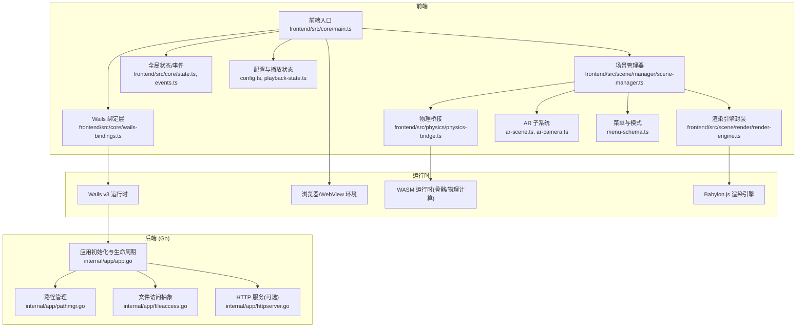
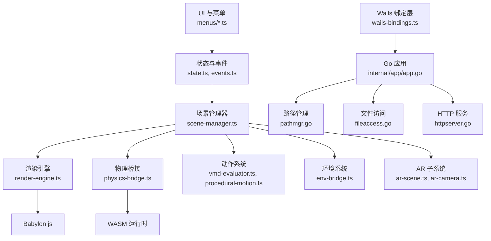
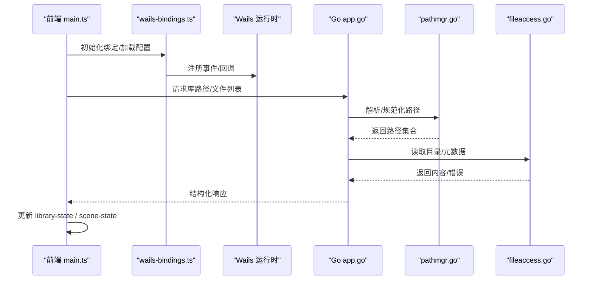
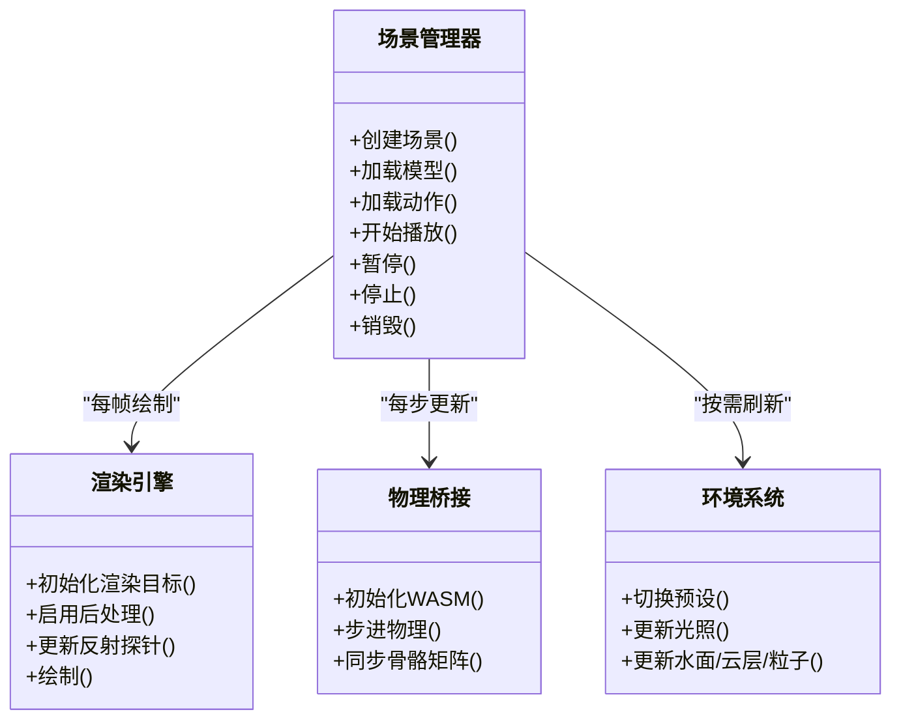
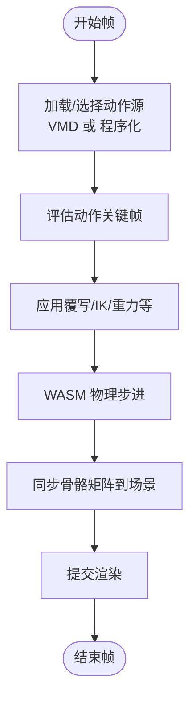
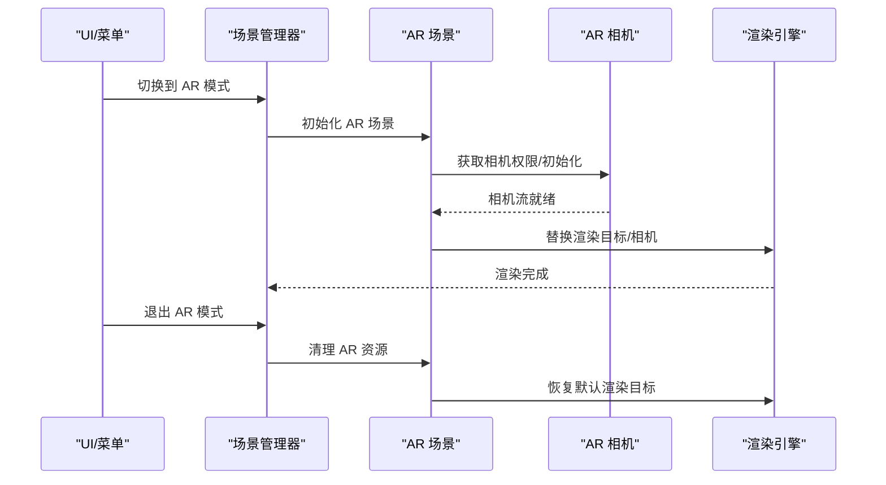
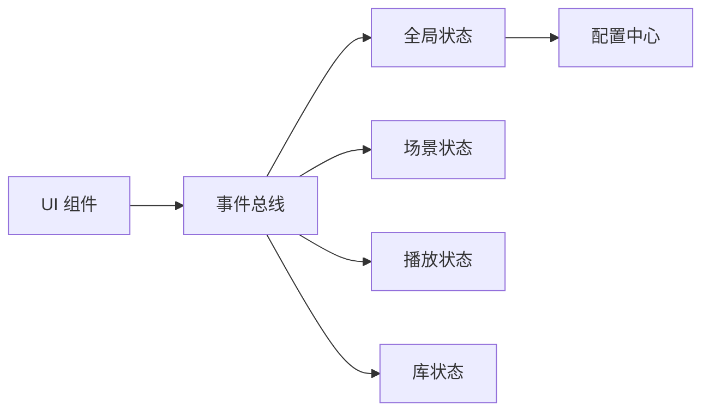
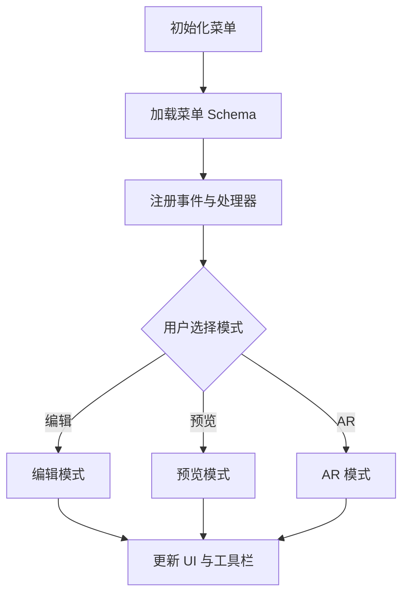
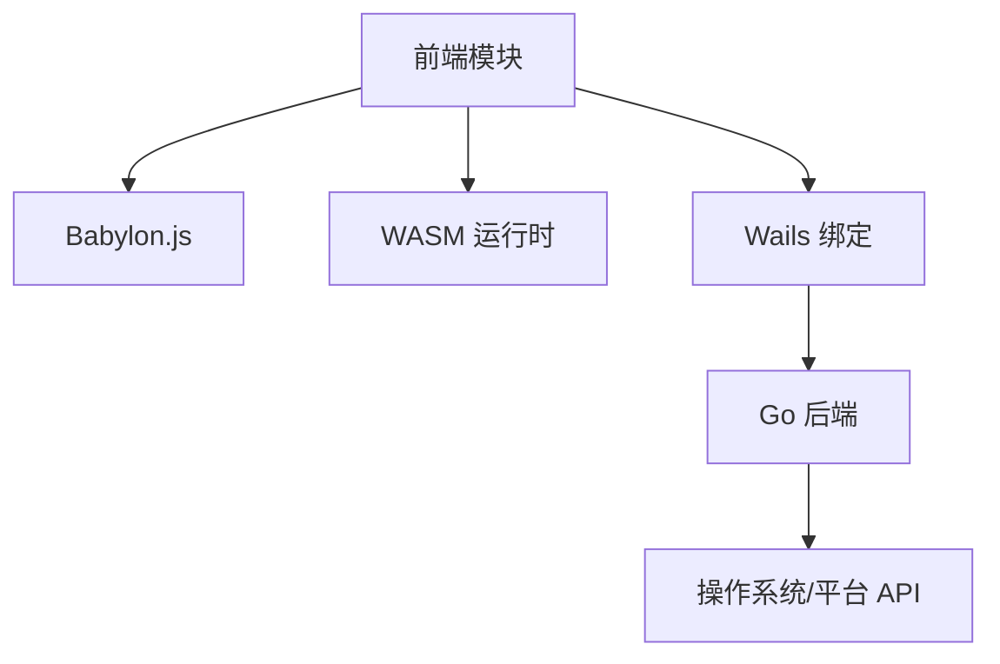

# 架构设计

<cite>
**本文引用的文件**   
- [main.go](file://main.go)
- [go.mod](file://go.mod)
- [frontend/src/core/main.ts](file://frontend/src/core/main.ts)
- [frontend/src/core/wails-bindings.ts](file://frontend/src/core/wails-bindings.ts)
- [frontend/bindings/mikumikuar/internal/app/index.ts](file://frontend/bindings/mikumikuar/internal/app/index.ts)
- [frontend/bindings/mikumikuar/internal/app/app.ts](file://frontend/bindings/mikumikuar/internal/app/app.ts)
- [internal/app/app.go](file://internal/app/app.go)
- [internal/app/pathmgr.go](file://internal/app/pathmgr.go)
- [internal/app/fileaccess.go](file://internal/app/fileaccess.go)
- [internal/app/httpserver.go](file://internal/app/httpserver.go)
- [frontend/src/scene/manager/scene-manager.ts](file://frontend/src/scene/manager/scene-manager.ts)
- [frontend/src/scene/scene.ts](file://frontend/src/scene/scene.ts)
- [frontend/src/scene/render/render-engine.ts](file://frontend/src/scene/render/render-engine.ts)
- [frontend/src/physics/physics-bridge.ts](file://frontend/src/physics/physics-bridge.ts)
- [frontend/src/core/state.ts](file://frontend/src/core/state.ts)
- [frontend/src/core/events.ts](file://frontend/src/core/events.ts)
- [frontend/src/core/config.ts](file://frontend/src/core/config.ts)
- [frontend/src/core/playback-state.ts](file://frontend/src/core/playback-state.ts)
- [frontend/src/scene/ar/ar-scene.ts](file://frontend/src/scene/ar/ar-scene.ts)
- [frontend/src/scene/ar/ar-camera.ts](file://frontend/src/scene/ar/ar-camera.ts)
- [frontend/src/motion-algos/procedural-motion.ts](file://frontend/src/motion-algos/procedural-motion.ts)
- [frontend/src/motion-algos/vmd-evaluator.ts](file://frontend/src/motion-algos/vmd-evaluator.ts)
- [frontend/src/scene/env/env-bridge.ts](file://frontend/src/scene/env/env-bridge.ts)
- [frontend/src/core/library-state.ts](file://frontend/src/core/library-state.ts)
- [frontend/src/menus/menu-schema.ts](file://frontend/src/menus/menu-schema.ts)
</cite>

## 目录
1. [简介](#简介)
2. [项目结构](#项目结构)
3. [核心组件](#核心组件)
4. [架构总览](#架构总览)
5. [详细组件分析](#详细组件分析)
6. [依赖关系分析](#依赖关系分析)
7. [性能考量](#性能考量)
8. [故障排查指南](#故障排查指南)
9. [结论](#结论)
10. [附录](#附录)

## 简介
本架构设计文档面向 MikuMikuAR 项目的开发者与维护者，系统性阐述前后端分离的整体架构、Wails v3 集成方案、模块划分原则与关键交互流程。重点覆盖场景管理器、物理引擎、渲染系统的协作方式，数据流设计与状态管理模式，并解释技术选型（Babylon.js、WebAssembly、Go/Wails）的权衡与原因。文档提供架构图与组件关系图，帮助读者快速建立对系统整体设计的理解。

## 项目结构
仓库采用前后端分离的组织方式：
- 前端（TypeScript + Babylon.js + Wails 绑定）：负责 UI、场景管理、渲染管线、动作与物理桥接、菜单与配置等。
- 后端（Go + Wails）：负责文件系统访问、路径管理、HTTP 服务、平台差异能力封装，并通过 Wails 暴露给前端调用。
- 构建与脚本：跨平台构建、资源生成、测试与 E2E 脚本位于 scripts 与根级 Taskfile。
- 文档与 ADR：architecture.md 与各 ADR 记录架构决策与演进过程。

图表来源
- [frontend/src/core/main.ts](file://frontend/src/core/main.ts)
- [frontend/src/core/wails-bindings.ts](file://frontend/src/core/wails-bindings.ts)
- [frontend/src/scene/manager/scene-manager.ts](file://frontend/src/scene/manager/scene-manager.ts)
- [frontend/src/scene/render/render-engine.ts](file://frontend/src/scene/render/render-engine.ts)
- [frontend/src/physics/physics-bridge.ts](file://frontend/src/physics/physics-bridge.ts)
- [internal/app/app.go](file://internal/app/app.go)
- [internal/app/pathmgr.go](file://internal/app/pathmgr.go)
- [internal/app/fileaccess.go](file://internal/app/fileaccess.go)
- [internal/app/httpserver.go](file://internal/app/httpserver.go)

章节来源
- [main.go:1-200](file://main.go#L1-L200)
- [go.mod:1-200](file://go.mod#L1-L200)
- [frontend/src/core/main.ts:1-200](file://frontend/src/core/main.ts#L1-L200)
- [frontend/src/core/wails-bindings.ts:1-200](file://frontend/src/core/wails-bindings.ts#L1-L200)
- [internal/app/app.go:1-200](file://internal/app/app.go#L1-L200)

## 核心组件
- 应用启动与生命周期
  - Go 侧通过 Wails 注册应用、窗口、菜单与事件；提供路径管理、文件访问与 HTTP 服务。
  - 前端在 Wails 环境中初始化，加载配置、注册菜单、创建场景与渲染循环。
- 场景管理器
  - 统一创建/销毁场景、相机、灯光与环境对象；协调动作回放、物理更新与渲染帧。
- 渲染系统
  - 基于 Babylon.js 封装渲染引擎，管理渲染目标、后处理、反射探针、天空盒、水面等。
- 物理与动作
  - 物理桥接层对接 WASM 骨骼/布料/风场计算；VMD 评估器驱动角色动画；程序化动作作为补充。
- AR 子系统
  - 在支持的设备上切换 AR 相机与场景，处理相机权限、深度与遮挡。
- 状态与事件
  - 集中式状态与事件总线，解耦 UI、场景与后端能力。

章节来源
- [frontend/src/scene/manager/scene-manager.ts:1-200](file://frontend/src/scene/manager/scene-manager.ts#L1-L200)
- [frontend/src/scene/render/render-engine.ts:1-200](file://frontend/src/scene/render/render-engine.ts#L1-L200)
- [frontend/src/physics/physics-bridge.ts:1-200](file://frontend/src/physics/physics-bridge.ts#L1-L200)
- [frontend/src/motion-algos/vmd-evaluator.ts:1-200](file://frontend/src/motion-algos/vmd-evaluator.ts#L1-L200)
- [frontend/src/motion-algos/procedural-motion.ts:1-200](file://frontend/src/motion-algos/procedural-motion.ts#L1-L200)
- [frontend/src/scene/ar/ar-scene.ts:1-200](file://frontend/src/scene/ar/ar-scene.ts#L1-L200)
- [frontend/src/scene/ar/ar-camera.ts:1-200](file://frontend/src/scene/ar/ar-camera.ts#L1-L200)
- [frontend/src/core/state.ts:1-200](file://frontend/src/core/state.ts#L1-L200)
- [frontend/src/core/events.ts:1-200](file://frontend/src/core/events.ts#L1-L200)
- [frontend/src/core/config.ts:1-200](file://frontend/src/core/config.ts#L1-L200)
- [frontend/src/core/playback-state.ts:1-200](file://frontend/src/core/playback-state.ts#L1-L200)

## 架构总览
下图展示前后端分层、Wails 绑定、渲染与物理子系统的协作关系。

图表来源
- [frontend/src/core/wails-bindings.ts:1-200](file://frontend/src/core/wails-bindings.ts#L1-L200)
- [internal/app/app.go:1-200](file://internal/app/app.go#L1-L200)
- [internal/app/pathmgr.go:1-200](file://internal/app/pathmgr.go#L1-L200)
- [internal/app/fileaccess.go:1-200](file://internal/app/fileaccess.go#L1-L200)
- [internal/app/httpserver.go:1-200](file://internal/app/httpserver.go#L1-L200)
- [frontend/src/scene/manager/scene-manager.ts:1-200](file://frontend/src/scene/manager/scene-manager.ts#L1-L200)
- [frontend/src/scene/render/render-engine.ts:1-200](file://frontend/src/scene/render/render-engine.ts#L1-L200)
- [frontend/src/physics/physics-bridge.ts:1-200](file://frontend/src/physics/physics-bridge.ts#L1-L200)
- [frontend/src/motion-algos/vmd-evaluator.ts:1-200](file://frontend/src/motion-algos/vmd-evaluator.ts#L1-L200)
- [frontend/src/motion-algos/procedural-motion.ts:1-200](file://frontend/src/motion-algos/procedural-motion.ts#L1-L200)
- [frontend/src/scene/env/env-bridge.ts:1-200](file://frontend/src/scene/env/env-bridge.ts#L1-L200)
- [frontend/src/scene/ar/ar-scene.ts:1-200](file://frontend/src/scene/ar/ar-scene.ts#L1-L200)
- [frontend/src/scene/ar/ar-camera.ts:1-200](file://frontend/src/scene/ar/ar-camera.ts#L1-L200)

## 详细组件分析

### 应用启动与 Wails 集成
- Go 侧
  - 初始化 Wails 应用、注册窗口与菜单、挂载内部 HTTP 服务（可选）、暴露路径与文件访问 API。
- 前端侧
  - 在 Wails 环境中加载绑定、读取配置、初始化日志与国际化、注册快捷键与菜单、创建主场景与渲染循环。
- 关键交互
  - 前端通过 wails-bindings 调用 Go 方法（如打开文件对话框、读取库路径、保存场景）。
  - Go 返回结果或错误，前端统一转换为可观测状态变更。

图表来源
- [frontend/src/core/main.ts:1-200](file://frontend/src/core/main.ts#L1-L200)
- [frontend/src/core/wails-bindings.ts:1-200](file://frontend/src/core/wails-bindings.ts#L1-L200)
- [frontend/bindings/mikumikuar/internal/app/index.ts:1-200](file://frontend/bindings/mikumikuar/internal/app/index.ts#L1-L200)
- [frontend/bindings/mikumikuar/internal/app/app.ts:1-200](file://frontend/bindings/mikumikuar/internal/app/app.ts#L1-L200)
- [internal/app/app.go:1-200](file://internal/app/app.go#L1-L200)
- [internal/app/pathmgr.go:1-200](file://internal/app/pathmgr.go#L1-L200)
- [internal/app/fileaccess.go:1-200](file://internal/app/fileaccess.go#L1-L200)

章节来源
- [main.go:1-200](file://main.go#L1-L200)
- [frontend/src/core/main.ts:1-200](file://frontend/src/core/main.ts#L1-L200)
- [frontend/src/core/wails-bindings.ts:1-200](file://frontend/src/core/wails-bindings.ts#L1-L200)
- [frontend/bindings/mikumikuar/internal/app/index.ts:1-200](file://frontend/bindings/mikumikuar/internal/app/index.ts#L1-L200)
- [frontend/bindings/mikumikuar/internal/app/app.ts:1-200](file://frontend/bindings/mikumikuar/internal/app/app.ts#L1-L200)
- [internal/app/app.go:1-200](file://internal/app/app.go#L1-L200)
- [internal/app/pathmgr.go:1-200](file://internal/app/pathmgr.go#L1-L200)
- [internal/app/fileaccess.go:1-200](file://internal/app/fileaccess.go#L1-L200)

### 场景管理器与渲染系统
- 职责边界
  - 场景管理器负责场景生命周期、对象组织、输入与相机控制、动作与物理同步。
  - 渲染引擎封装 Babylon.js 的渲染目标、后处理、反射与天空盒等。
- 协作流程
  - 每帧：场景管理器触发物理更新 → 更新模型矩阵 → 提交渲染。
  - 环境系统（天空、地面、水体、粒子）由 env-bridge 统一管理，按预设或用户设置动态切换。

图表来源
- [frontend/src/scene/manager/scene-manager.ts:1-200](file://frontend/src/scene/manager/scene-manager.ts#L1-L200)
- [frontend/src/scene/render/render-engine.ts:1-200](file://frontend/src/scene/render/render-engine.ts#L1-L200)
- [frontend/src/physics/physics-bridge.ts:1-200](file://frontend/src/physics/physics-bridge.ts#L1-L200)
- [frontend/src/scene/env/env-bridge.ts:1-200](file://frontend/src/scene/env/env-bridge.ts#L1-L200)

章节来源
- [frontend/src/scene/manager/scene-manager.ts:1-200](file://frontend/src/scene/manager/scene-manager.ts#L1-L200)
- [frontend/src/scene/render/render-engine.ts:1-200](file://frontend/src/scene/render/render-engine.ts#L1-L200)
- [frontend/src/physics/physics-bridge.ts:1-200](file://frontend/src/physics/physics-bridge.ts#L1-L200)
- [frontend/src/scene/env/env-bridge.ts:1-200](file://frontend/src/scene/env/env-bridge.ts#L1-L200)

### 动作系统与物理计算
- VMD 评估器
  - 解析与回放 VMD 关键帧，输出骨骼变换序列。
- 程序化动作
  - 根据节拍、呼吸、视线等感知信号生成附加骨骼运动。
- WASM 物理
  - 将骨骼/布料/风场等计算下沉到 WASM，提升性能与一致性。
- 数据流
  - 动作源（VMD/程序化）→ 物理桥接（WASM）→ 场景管理器（矩阵同步）→ 渲染引擎（绘制）。

图表来源
- [frontend/src/motion-algos/vmd-evaluator.ts:1-200](file://frontend/src/motion-algos/vmd-evaluator.ts#L1-L200)
- [frontend/src/motion-algos/procedural-motion.ts:1-200](file://frontend/src/motion-algos/procedural-motion.ts#L1-L200)
- [frontend/src/physics/physics-bridge.ts:1-200](file://frontend/src/physics/physics-bridge.ts#L1-L200)

章节来源
- [frontend/src/motion-algos/vmd-evaluator.ts:1-200](file://frontend/src/motion-algos/vmd-evaluator.ts#L1-L200)
- [frontend/src/motion-algos/procedural-motion.ts:1-200](file://frontend/src/motion-algos/procedural-motion.ts#L1-L200)
- [frontend/src/physics/physics-bridge.ts:1-200](file://frontend/src/physics/physics-bridge.ts#L1-L200)

### AR 子系统
- 功能要点
  - 在移动设备上申请相机权限，切换至 AR 相机模式，处理深度与遮挡。
  - 与场景管理器协同，确保 AR 模式下渲染与交互的一致性。
- 典型流程
  - 进入 AR 模式 → 初始化 AR 相机 → 替换场景相机 → 调整渲染目标 → 退出时恢复。

图表来源
- [frontend/src/scene/ar/ar-scene.ts:1-200](file://frontend/src/scene/ar/ar-scene.ts#L1-L200)
- [frontend/src/scene/ar/ar-camera.ts:1-200](file://frontend/src/scene/ar/ar-camera.ts#L1-L200)
- [frontend/src/scene/manager/scene-manager.ts:1-200](file://frontend/src/scene/manager/scene-manager.ts#L1-L200)
- [frontend/src/scene/render/render-engine.ts:1-200](file://frontend/src/scene/render/render-engine.ts#L1-L200)

章节来源
- [frontend/src/scene/ar/ar-scene.ts:1-200](file://frontend/src/scene/ar/ar-scene.ts#L1-L200)
- [frontend/src/scene/ar/ar-camera.ts:1-200](file://frontend/src/scene/ar/ar-camera.ts#L1-L200)
- [frontend/src/scene/manager/scene-manager.ts:1-200](file://frontend/src/scene/manager/scene-manager.ts#L1-L200)
- [frontend/src/scene/render/render-engine.ts:1-200](file://frontend/src/scene/render/render-engine.ts#L1-L200)

### 状态管理与事件机制
- 状态分层
  - 全局状态（state.ts）：应用运行态、主题、语言、快捷键等。
  - 场景状态（scene-state.ts）：当前场景、模型、相机、灯光、环境等。
  - 播放状态（playback-state.ts）：动作播放进度、速度、循环等。
  - 库状态（library-state.ts）：资源浏览、选中项、缩略图缓存等。
- 事件总线
  - 使用 events.ts 发布/订阅，解耦 UI 操作与业务逻辑。
- 配置
  - config.ts 提供运行时配置与持久化策略。

图表来源
- [frontend/src/core/state.ts:1-200](file://frontend/src/core/state.ts#L1-L200)
- [frontend/src/core/events.ts:1-200](file://frontend/src/core/events.ts#L1-L200)
- [frontend/src/core/config.ts:1-200](file://frontend/src/core/config.ts#L1-L200)
- [frontend/src/core/playback-state.ts:1-200](file://frontend/src/core/playback-state.ts#L1-L200)
- [frontend/src/core/library-state.ts:1-200](file://frontend/src/core/library-state.ts#L1-L200)

章节来源
- [frontend/src/core/state.ts:1-200](file://frontend/src/core/state.ts#L1-L200)
- [frontend/src/core/events.ts:1-200](file://frontend/src/core/events.ts#L1-L200)
- [frontend/src/core/config.ts:1-200](file://frontend/src/core/config.ts#L1-L200)
- [frontend/src/core/playback-state.ts:1-200](file://frontend/src/core/playback-state.ts#L1-L200)
- [frontend/src/core/library-state.ts:1-200](file://frontend/src/core/library-state.ts#L1-L200)

### 菜单与模式管理
- 菜单声明式 Schema
  - menu-schema.ts 定义菜单结构与行为，便于多语言与扩展。
- 模式切换
  - 通过状态与事件驱动不同模式（编辑、预览、AR、导出等），各模式共享底层场景与渲染能力。

图表来源
- [frontend/src/menus/menu-schema.ts:1-200](file://frontend/src/menus/menu-schema.ts#L1-L200)

章节来源
- [frontend/src/menus/menu-schema.ts:1-200](file://frontend/src/menus/menu-schema.ts#L1-L200)

## 依赖关系分析
- 前端依赖
  - Babylon.js：渲染与图形管线。
  - WASM：高性能骨骼/布料/风场计算。
  - Wails 绑定：与 Go 后端通信。
- 后端依赖
  - Go 标准库与平台特定实现（Android/Desktop）。
  - 可选 HTTP 服务用于调试或资源分发。
- 耦合与内聚
  - 场景管理器为高内聚中枢，对外仅暴露稳定接口。
  - 物理与渲染通过矩阵与事件解耦，避免直接依赖。
  - 菜单与状态通过事件总线松耦合。

图表来源
- [frontend/src/core/wails-bindings.ts:1-200](file://frontend/src/core/wails-bindings.ts#L1-L200)
- [internal/app/app.go:1-200](file://internal/app/app.go#L1-L200)

章节来源
- [frontend/src/core/wails-bindings.ts:1-200](file://frontend/src/core/wails-bindings.ts#L1-L200)
- [internal/app/app.go:1-200](file://internal/app/app.go#L1-L200)

## 性能考量
- 渲染优化
  - 合理设置渲染目标分辨率与后处理强度；按需更新反射探针与天空盒。
  - 使用 LOD 与纹理压缩，减少带宽与显存占用。
- 物理与动作
  - 将密集计算下沉至 WASM，避免主线程阻塞；批量更新骨骼矩阵。
  - 动作回放采用时间切片与插值，降低抖动。
- I/O 与资源
  - 异步加载与缓存缩略图；延迟加载大资源；使用路径管理统一缓存键。
- 内存与生命周期
  - 严格遵循创建/销毁语义，避免场景切换时的资源泄漏。

[本节为通用指导，不直接分析具体文件]

## 故障排查指南
- 常见问题定位
  - WASM 加载失败：检查资源路径与 MIME 类型，确认 index_bg.wasm 可达。
  - CORS 拦截：确保 Wails WebView 与本地 HTTP 服务配置一致。
  - 两套物理引擎并存导致性能下降：统一物理桥接，移除冗余实现。
  - 菜单快捷键冲突：审查快捷键注册表，避免重复覆盖。
- 建议步骤
  - 查看日志与错误码，结合 goerr 与前端 toast 提示。
  - 使用最小复现场景隔离问题（仅加载一个模型与一个动作）。
  - 逐步关闭特效（水面、反射、云层）验证是否为渲染瓶颈。

章节来源
- [frontend/src/core/toast.ts:1-200](file://frontend/src/core/toast.ts#L1-L200)
- [frontend/src/core/i18n/goerr.ts:1-200](file://frontend/src/core/i18n/goerr.ts#L1-L200)
- [internal/util/errors.go:1-200](file://internal/util/errors.go#L1-L200)

## 结论
MikuMikuAR 采用前后端分离与 Wails v3 集成的架构，以场景管理器为核心，协调渲染、物理与动作系统，并通过事件与状态管理实现模块间松耦合。技术选型上，Babylon.js 提供成熟的 Web 渲染能力，WASM 承载高性能计算，Go 负责平台能力与资源管理。该设计兼顾可扩展性与性能，适合持续迭代与多平台部署。

[本节为总结性内容，不直接分析具体文件]

## 附录
- 技术决策与权衡
  - 选择 Babylon.js：生态完善、Web 友好、易于与 Wails 集成。
  - 选择 WASM：将 CPU 密集型计算从 JS 主线程卸载，提升稳定性与帧率。
  - 选择 Go/Wails：原生能力与跨平台打包，简化桌面与移动端部署。
- 参考文档
  - architecture.md 与各 ADR 文件记录了关键决策与演进历程。

[本节为概念性内容，不直接分析具体文件]