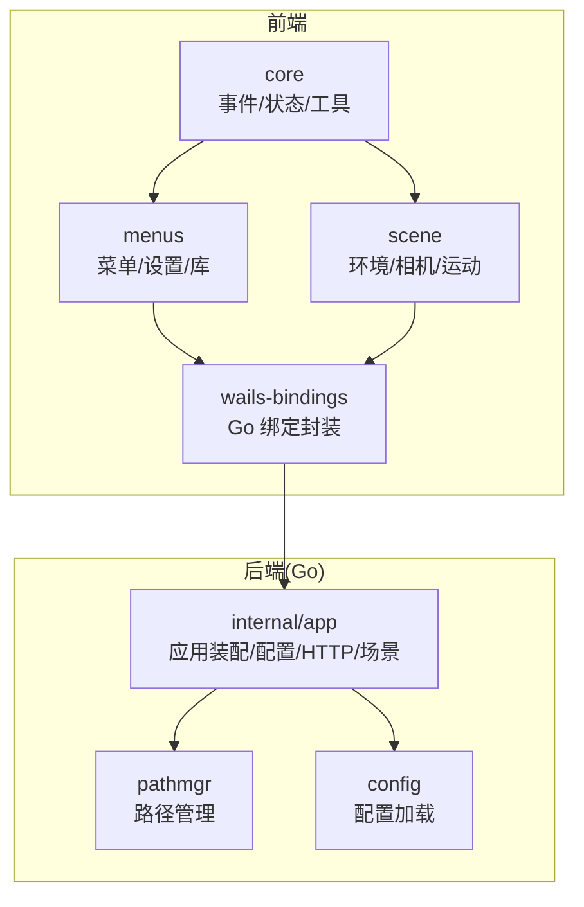
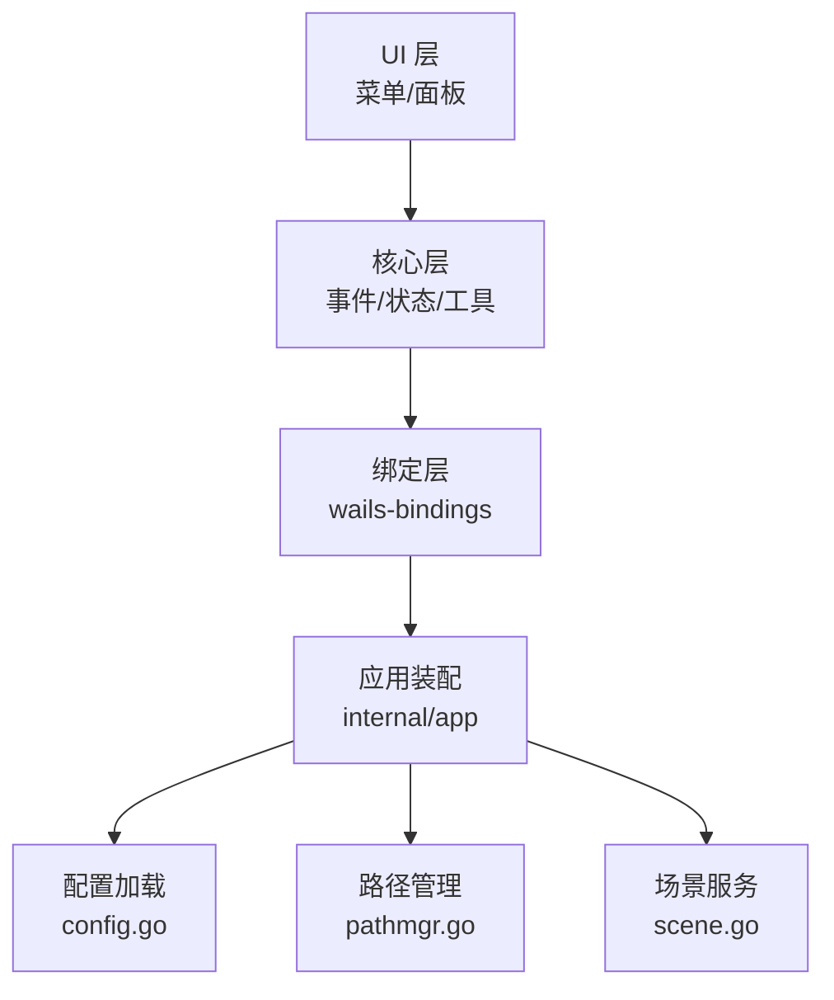
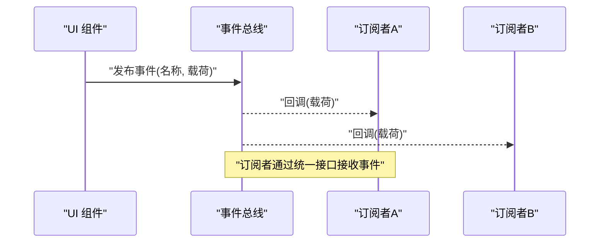
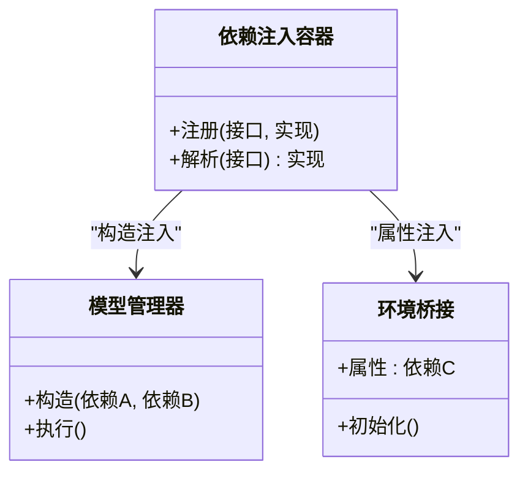
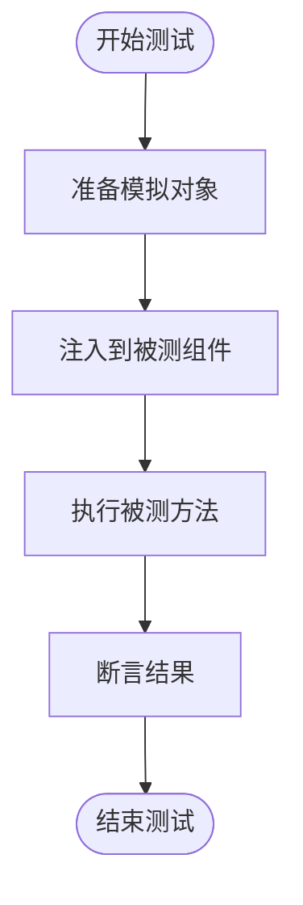
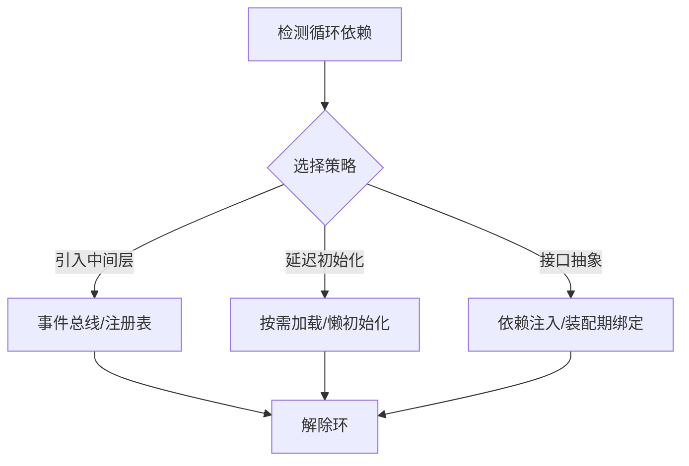
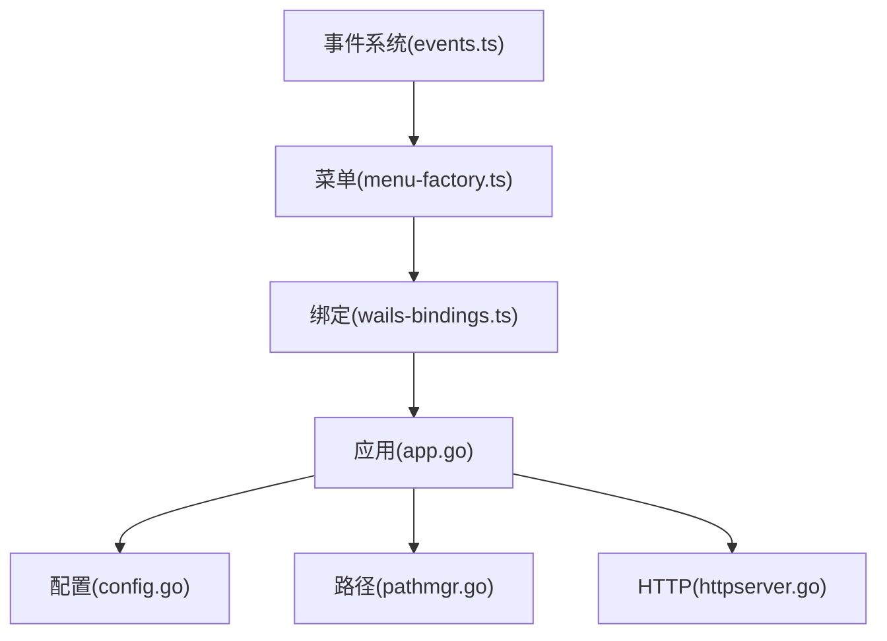

# 依赖倒置原则

<cite>
**本文引用的文件**   
- [main.go](file://main.go)
- [app.go](file://internal/app/app.go)
- [config.go](file://internal/app/config.go)
- [httpserver.go](file://internal/app/httpserver.go)
- [pathmgr.go](file://internal/app/pathmgr.go)
- [scene.go](file://internal/app/scene.go)
- [events.ts](file://frontend/src/core/events.ts)
- [env-state.ts](file://frontend/src/core/env-state-schema.ts)
- [env-bridge.ts](file://frontend/src/scene/env/env-bridge.ts)
- [wails-bindings.ts](file://frontend/src/core/wails-bindings.ts)
- [menu-factory.ts](file://frontend/src/menus/menu-factory.ts)
- [menu-schema.ts](file://frontend/src/menus/menu-schema.ts)
- [shortcut-registry.ts](file://frontend/src/core/shortcut-registry.ts)
- [library-core.ts](file://frontend/src/menus/library-core.ts)
- [library-session-store.ts](file://frontend/src/menus/library-session-store.ts)
- [model-manager.test.ts](file://frontend/src/__tests__/model-manager.test.ts)
- [setup-wails.ts](file://frontend/src/__tests__/setup-wails.ts)
</cite>

## 目录
1. [简介](#简介)
2. [项目结构](#项目结构)
3. [核心组件](#核心组件)
4. [架构总览](#架构总览)
5. [详细组件分析](#详细组件分析)
6. [依赖分析](#依赖分析)
7. [性能考虑](#性能考虑)
8. [故障排查指南](#故障排查指南)
9. [结论](#结论)
10. [附录](#附录)

## 简介
本文件聚焦于 MikuMikuAR 项目中“依赖倒置原则（DIP）”的实践与落地，围绕以下目标展开：
- 通过接口抽象降低模块耦合度，尤其是事件系统对发布者和订阅者的解耦。
- 说明依赖注入模式在项目中的实现方式（构造函数注入、属性注入等）。
- 总结接口设计的最佳实践，定义稳定且清晰的 API 边界。
- 提供具体代码示例路径，展示 DIP 的实现与测试友好性提升（含模拟对象使用）。
- 讨论循环依赖的识别与解决策略。

## 项目结构
本项目采用前后端分离与分层组织：
- Go 后端（Wails 绑定层）负责平台能力、文件系统、HTTP 服务、场景与配置等。
- TypeScript 前端负责 UI、渲染管线、状态管理、菜单系统与业务编排。
- 关键 DIP 相关位置：
  - 前端事件总线与观察者注册表位于 core 层，作为跨模块通信的稳定契约。
  - 场景与环境子系统通过桥接器与 Wails 绑定进行解耦。
  - 菜单工厂与菜单 Schema 将 UI 行为与具体实现解耦。
  - 库管理与会话存储通过接口化设计支持替换与测试。

图表来源
- [events.ts](file://frontend/src/core/events.ts)
- [wails-bindings.ts](file://frontend/src/core/wails-bindings.ts)
- [menu-factory.ts](file://frontend/src/menus/menu-factory.ts)
- [env-bridge.ts](file://frontend/src/scene/env/env-bridge.ts)
- [app.go](file://internal/app/app.go)
- [config.go](file://internal/app/config.go)
- [pathmgr.go](file://internal/app/pathmgr.go)

章节来源
- [main.go:1-50](file://main.go#L1-L50)
- [app.go:1-120](file://internal/app/app.go#L1-L120)
- [events.ts:1-120](file://frontend/src/core/events.ts#L1-L120)
- [wails-bindings.ts:1-120](file://frontend/src/core/wails-bindings.ts#L1-L120)

## 核心组件
本节梳理在 DIP 实践中承担“接口/契约”职责的关键组件及其作用。

- 事件系统（发布/订阅）
  - 通过统一的事件总线与观察者句柄，将事件发布者与订阅者解耦。
  - 典型用法：UI 动作触发事件，场景或环境子系统订阅并响应。
  - 参考路径：[事件总线与观察者:1-120](file://frontend/src/core/events.ts#L1-L120)

- 环境与状态契约
  - 环境状态 Schema 定义了稳定的数据契约，供 UI 与渲染层共享。
  - 环境桥接器屏蔽底层差异，向上暴露一致接口。
  - 参考路径：[环境状态 Schema:1-120](file://frontend/src/core/env-state-schema.ts#L1-L120)、[环境桥接:1-120](file://frontend/src/scene/env/env-bridge.ts#L1-L120)

- Wails 绑定封装
  - 将 Go 侧能力以类型安全的 TS 接口暴露给前端，避免直接耦合 Go 实现细节。
  - 参考路径：[Wails 绑定封装:1-120](file://frontend/src/core/wails-bindings.ts#L1-L120)

- 菜单工厂与 Schema
  - 菜单工厂按 Schema 动态构建菜单项，将 UI 行为与具体实现解耦。
  - 参考路径：[菜单工厂:1-120](file://frontend/src/menus/menu-factory.ts#L1-L120)、[菜单 Schema:1-120](file://frontend/src/menus/menu-schema.ts#L1-L120)

- 快捷键注册表
  - 集中管理快捷键映射，避免各模块硬编码冲突。
  - 参考路径：[快捷键注册表:1-120](file://frontend/src/core/shortcut-registry.ts#L1-L120)

- 库管理与会话存储
  - 库核心与会话存储通过接口化设计，便于替换实现与单元测试。
  - 参考路径：[库核心:1-120](file://frontend/src/menus/library-core.ts#L1-L120)、[库会话存储:1-120](file://frontend/src/menus/library-session-store.ts#L1-L120)

章节来源
- [events.ts:1-120](file://frontend/src/core/events.ts#L1-L120)
- [env-state-schema.ts:1-120](file://frontend/src/core/env-state-schema.ts#L1-L120)
- [env-bridge.ts:1-120](file://frontend/src/scene/env/env-bridge.ts#L1-L120)
- [wails-bindings.ts:1-120](file://frontend/src/core/wails-bindings.ts#L1-L120)
- [menu-factory.ts:1-120](file://frontend/src/menus/menu-factory.ts#L1-L120)
- [menu-schema.ts:1-120](file://frontend/src/menus/menu-schema.ts#L1-L120)
- [shortcut-registry.ts:1-120](file://frontend/src/core/shortcut-registry.ts#L1-L120)
- [library-core.ts:1-120](file://frontend/src/menus/library-core.ts#L1-L120)
- [library-session-store.ts:1-120](file://frontend/src/menus/library-session-store.ts#L1-L120)

## 架构总览
下图展示了前端与后端之间的依赖反转关系：前端通过绑定接口调用后端能力，后端通过配置与路径管理等基础设施提供服务，整体形成“高层模块不依赖低层模块的具体实现，而是依赖抽象”的结构。

图表来源
- [wails-bindings.ts:1-120](file://frontend/src/core/wails-bindings.ts#L1-L120)
- [app.go:1-120](file://internal/app/app.go#L1-L120)
- [config.go:1-120](file://internal/app/config.go#L1-L120)
- [pathmgr.go:1-120](file://internal/app/pathmgr.go#L1-L120)
- [scene.go:1-120](file://internal/app/scene.go#L1-L120)

## 详细组件分析

### 事件系统：发布/订阅的接口解耦
事件系统是 DIP 的典型体现：发布者只关心事件名称与载荷，订阅者只关心事件处理逻辑，二者通过统一的接口契约交互。

图表来源
- [events.ts:1-120](file://frontend/src/core/events.ts#L1-L120)

章节来源
- [events.ts:1-120](file://frontend/src/core/events.ts#L1-L120)

### 依赖注入：构造函数注入与属性注入
- 构造函数注入
  - 在需要外部能力的组件中，通过构造参数传入依赖实例，确保创建时即具备所需能力。
  - 适用场景：核心服务、管理器类。
  - 参考路径：[模型管理器测试（构造注入示例）:1-120](file://frontend/src/__tests__/model-manager.test.ts#L1-L120)

- 属性注入
  - 对于可选或可替换的依赖，可通过属性赋值完成注入，便于在运行时调整行为。
  - 适用场景：插件式扩展、可插拔功能。
  - 参考路径：[环境桥接（属性注入示例）:1-120](file://frontend/src/scene/env/env-bridge.ts#L1-L120)

图表来源
- [model-manager.test.ts:1-120](file://frontend/src/__tests__/model-manager.test.ts#L1-L120)
- [env-bridge.ts:1-120](file://frontend/src/scene/env/env-bridge.ts#L1-L120)

章节来源
- [model-manager.test.ts:1-120](file://frontend/src/__tests__/model-manager.test.ts#L1-L120)
- [env-bridge.ts:1-120](file://frontend/src/scene/env/env-bridge.ts#L1-L120)

### 接口设计与 API 边界
- 稳定契约
  - 事件名称与载荷结构应保持稳定，变更需遵循版本兼容策略。
  - 参考路径：[事件总线:1-120](file://frontend/src/core/events.ts#L1-L120)

- 清晰边界
  - 环境状态 Schema 明确数据结构与约束，避免上层随意访问内部字段。
  - 参考路径：[环境状态 Schema:1-120](file://frontend/src/core/env-state-schema.ts#L1-L120)

- 可替换实现
  - 菜单工厂基于 Schema 生成 UI，允许不同实现按需替换。
  - 参考路径：[菜单工厂:1-120](file://frontend/src/menus/menu-factory.ts#L1-L120)、[菜单 Schema:1-120](file://frontend/src/menus/menu-schema.ts#L1-L120)

章节来源
- [events.ts:1-120](file://frontend/src/core/events.ts#L1-L120)
- [env-state-schema.ts:1-120](file://frontend/src/core/env-state-schema.ts#L1-L120)
- [menu-factory.ts:1-120](file://frontend/src/menus/menu-factory.ts#L1-L120)
- [menu-schema.ts:1-120](file://frontend/src/menus/menu-schema.ts#L1-L120)

### 模拟对象与测试友好性
- 使用模拟对象替代真实依赖，隔离外部影响，提高测试稳定性。
- 参考路径：
  - [Wails 测试初始化（模拟绑定）:1-120](file://frontend/src/__tests__/setup-wails.ts#L1-L120)
  - [模型管理器测试（构造注入+模拟）:1-120](file://frontend/src/__tests__/model-manager.test.ts#L1-L120)

图表来源
- [setup-wails.ts:1-120](file://frontend/src/__tests__/setup-wails.ts#L1-L120)
- [model-manager.test.ts:1-120](file://frontend/src/__tests__/model-manager.test.ts#L1-L120)

章节来源
- [setup-wails.ts:1-120](file://frontend/src/__tests__/setup-wails.ts#L1-L120)
- [model-manager.test.ts:1-120](file://frontend/src/__tests__/model-manager.test.ts#L1-L120)

### 循环依赖问题与解决策略
- 识别循环依赖
  - 当 A 依赖 B，B 又依赖 A 时，可能出现循环依赖，导致启动失败或行为不确定。
- 解决策略
  - 引入中间层（如事件总线、注册表）打破直接耦合。
  - 使用延迟初始化或按需加载，避免在构造阶段形成环。
  - 通过接口抽象与依赖注入，将具体实现推迟到装配期。
- 参考路径
  - [快捷键注册表（集中管理，减少环）:1-120](file://frontend/src/core/shortcut-registry.ts#L1-L120)
  - [库会话存储（独立持久化，避免与核心强耦合）:1-120](file://frontend/src/menus/library-session-store.ts#L1-L120)

图表来源
- [shortcut-registry.ts:1-120](file://frontend/src/core/shortcut-registry.ts#L1-L120)
- [library-session-store.ts:1-120](file://frontend/src/menus/library-session-store.ts#L1-L120)

章节来源
- [shortcut-registry.ts:1-120](file://frontend/src/core/shortcut-registry.ts#L1-L120)
- [library-session-store.ts:1-120](file://frontend/src/menus/library-session-store.ts#L1-L120)

## 依赖分析
下图展示了前端与后端之间通过绑定层实现的依赖反转关系，以及后端内部的基础设施依赖。

图表来源
- [events.ts:1-120](file://frontend/src/core/events.ts#L1-L120)
- [menu-factory.ts:1-120](file://frontend/src/menus/menu-factory.ts#L1-L120)
- [wails-bindings.ts:1-120](file://frontend/src/core/wails-bindings.ts#L1-L120)
- [app.go:1-120](file://internal/app/app.go#L1-L120)
- [config.go:1-120](file://internal/app/config.go#L1-L120)
- [pathmgr.go:1-120](file://internal/app/pathmgr.go#L1-L120)
- [httpserver.go:1-120](file://internal/app/httpserver.go#L1-L120)

章节来源
- [events.ts:1-120](file://frontend/src/core/events.ts#L1-L120)
- [menu-factory.ts:1-120](file://frontend/src/menus/menu-factory.ts#L1-L120)
- [wails-bindings.ts:1-120](file://frontend/src/core/wails-bindings.ts#L1-L120)
- [app.go:1-120](file://internal/app/app.go#L1-L120)
- [config.go:1-120](file://internal/app/config.go#L1-L120)
- [pathmgr.go:1-120](file://internal/app/pathmgr.go#L1-L120)
- [httpserver.go:1-120](file://internal/app/httpserver.go#L1-L120)

## 性能考虑
- 事件系统应避免在高频路径上创建过多监听器，必要时使用去抖或节流。
- 依赖注入容器应在应用启动时完成装配，避免运行期频繁解析。
- 环境桥接与绑定层应保持轻量，避免阻塞主线程。

## 故障排查指南
- 事件未触发
  - 检查事件名称是否一致，订阅是否在发布前完成。
  - 参考路径：[事件总线:1-120](file://frontend/src/core/events.ts#L1-L120)

- 依赖注入失败
  - 确认构造参数或属性注入是否正确，模拟对象是否满足接口契约。
  - 参考路径：[模型管理器测试:1-120](file://frontend/src/__tests__/model-manager.test.ts#L1-L120)、[环境桥接:1-120](file://frontend/src/scene/env/env-bridge.ts#L1-L120)

- 循环依赖报错
  - 使用注册表或事件总线解耦，或将具体实现延迟到装配期。
  - 参考路径：[快捷键注册表:1-120](file://frontend/src/core/shortcut-registry.ts#L1-L120)、[库会话存储:1-120](file://frontend/src/menus/library-session-store.ts#L1-L120)

章节来源
- [events.ts:1-120](file://frontend/src/core/events.ts#L1-L120)
- [model-manager.test.ts:1-120](file://frontend/src/__tests__/model-manager.test.ts#L1-L120)
- [env-bridge.ts:1-120](file://frontend/src/scene/env/env-bridge.ts#L1-L120)
- [shortcut-registry.ts:1-120](file://frontend/src/core/shortcut-registry.ts#L1-L120)
- [library-session-store.ts:1-120](file://frontend/src/menus/library-session-store.ts#L1-L120)

## 结论
通过在事件系统、环境桥接、菜单工厂、库管理等关键位置采用接口抽象与依赖注入，MikuMikuAR 有效降低了模块间的耦合度，提升了可测试性与可维护性。建议持续完善接口契约文档，规范依赖注入装配点，并在新增功能时优先采用 DIP 模式，以避免循环依赖与紧耦合问题。

## 附录
- 相关 ADR（架构决策记录）
  - 观察器注册表与事件系统演进
  - 菜单声明式 Schema 与工厂模式
  - 路径管理与资源定位的统一
- 参考路径
  - [菜单 Schema:1-120](file://frontend/src/menus/menu-schema.ts#L1-L120)
  - [菜单工厂:1-120](file://frontend/src/menus/menu-factory.ts#L1-L120)
  - [路径管理:1-120](file://internal/app/pathmgr.go#L1-L120)