# 单一职责原则

<cite>
**本文引用的文件**   
- [main.go](file://main.go)
- [frontend/src/core/main.ts](file://frontend/src/core/main.ts)
- [frontend/src/core/state.ts](file://frontend/src/core/state.ts)
- [frontend/src/core/scene-state.ts](file://frontend/src/core/scene-state.ts)
- [frontend/src/core/playback-state.ts](file://frontend/src/core/playback-state.ts)
- [frontend/src/core/library-state.ts](file://frontend/src/core/library-state.ts)
- [frontend/src/core/render-loop.ts](file://frontend/src/core/render-loop.ts)
- [frontend/src/core/events.ts](file://frontend/src/core/events.ts)
- [frontend/src/core/logger.ts](file://frontend/src/core/logger.ts)
- [frontend/src/core/dialog.ts](file://frontend/src/core/dialog.ts)
- [frontend/src/core/toast.ts](file://frontend/src/core/toast.ts)
- [frontend/src/core/config.ts](file://frontend/src/core/config.ts)
- [frontend/src/core/i18n/goerr.ts](file://frontend/src/core/i18n/goerr.ts)
- [frontend/src/core/i18n/t.ts](file://frontend/src/core/i18n/t.ts)
- [frontend/src/menus/menu-schema.ts](file://frontend/src/menus/menu-schema.ts)
- [frontend/src/menus/menu-factory.ts](file://frontend/src/menus/menu-factory.ts)
- [frontend/src/menus/scene-menu.ts](file://frontend/src/menus/scene-menu.ts)
- [frontend/src/scene/scene.ts](file://frontend/src/scene/scene.ts)
- [frontend/src/scene/manager/scene-manager.ts](file://frontend/src/scene/manager/scene-manager.ts)
- [frontend/src/scene/env/env-bridge.ts](file://frontend/src/scene/env/env-bridge.ts)
- [frontend/src/scene/motion/motion-controller.ts](file://frontend/src/scene/motion/motion-controller.ts)
- [frontend/src/scene/camera/camera.ts](file://frontend/src/scene/camera/camera.ts)
- [frontend/src/scene/render/post-process.ts](file://frontend/src/scene/render/post-process.ts)
- [frontend/src/physics/physics-bridge.ts](file://frontend/src/physics/physics-bridge.ts)
- [internal/app/app.go](file://internal/app/app.go)
- [internal/app/httpserver.go](file://internal/app/httpserver.go)
- [internal/app/pathmgr.go](file://internal/app/pathmgr.go)
- [internal/util/safecall.go](file://internal/util/safecall.go)
</cite>

## 目录
1. [引言](#引言)
2. [项目结构](#项目结构)
3. [核心组件](#核心组件)
4. [架构总览](#架构总览)
5. [详细组件分析](#详细组件分析)
6. [依赖分析](#依赖分析)
7. [性能考虑](#性能考虑)
8. [故障排查指南](#故障排查指南)
9. [结论](#结论)
10. [附录](#附录)

## 引言
本文件聚焦于在 MikuMikuAR 项目中如何贯彻“单一职责原则”（SRP）。我们将：
- 明确各模块的职责边界与划分标准
- 通过接口定义约束模块职责范围
- 以状态管理、场景生命周期、渲染管线、错误处理等为例，展示职责分离的实现方式
- 提供识别与重构违反 SRP 的代码的方法论与实践建议
- 统一横切关注点（日志、国际化、错误包装、提示）的处理策略

## 项目结构
前端采用按领域分层与按功能域并行的组织方式：
- core：跨领域的基础设施与公共能力（状态、事件、渲染循环、配置、UI 工具、i18n、错误包装等）
- scene：3D 场景及其子域（环境、动作、相机、渲染、物理桥接等）
- menus：菜单与面板的声明式描述与工厂装配
- physics：物理相关桥接与算法
- internal：Go 后端服务（HTTP、路径管理、应用初始化等）

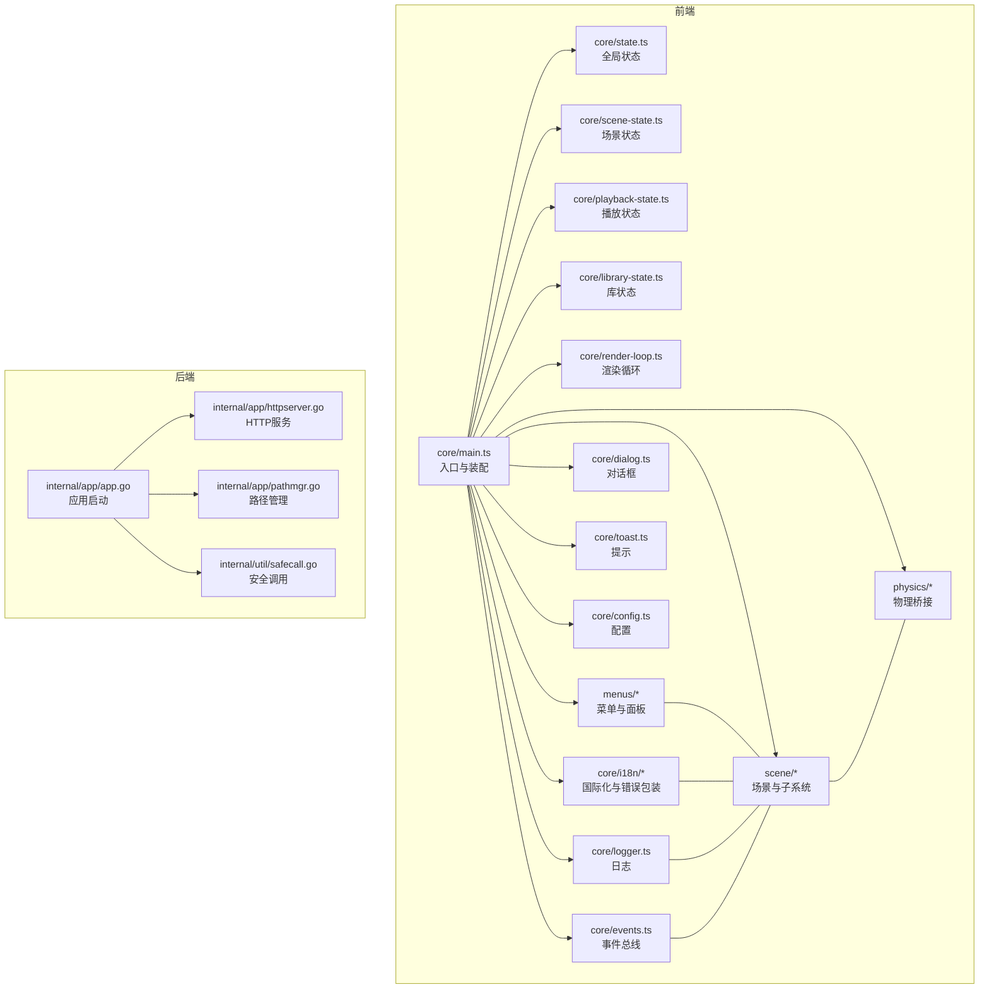

图表来源
- [frontend/src/core/main.ts](file://frontend/src/core/main.ts)
- [frontend/src/core/state.ts](file://frontend/src/core/state.ts)
- [frontend/src/core/scene-state.ts](file://frontend/src/core/scene-state.ts)
- [frontend/src/core/playback-state.ts](file://frontend/src/core/playback-state.ts)
- [frontend/src/core/library-state.ts](file://frontend/src/core/library-state.ts)
- [frontend/src/core/render-loop.ts](file://frontend/src/core/render-loop.ts)
- [frontend/src/core/events.ts](file://frontend/src/core/events.ts)
- [frontend/src/core/logger.ts](file://frontend/src/core/logger.ts)
- [frontend/src/core/dialog.ts](file://frontend/src/core/dialog.ts)
- [frontend/src/core/toast.ts](file://frontend/src/core/toast.ts)
- [frontend/src/core/config.ts](file://frontend/src/core/config.ts)
- [frontend/src/core/i18n/goerr.ts](file://frontend/src/core/i18n/goerr.ts)
- [frontend/src/core/i18n/t.ts](file://frontend/src/core/i18n/t.ts)
- [frontend/src/menus/menu-schema.ts](file://frontend/src/menus/menu-schema.ts)
- [frontend/src/menus/menu-factory.ts](file://frontend/src/menus/menu-factory.ts)
- [frontend/src/scene/scene.ts](file://frontend/src/scene/scene.ts)
- [frontend/src/scene/manager/scene-manager.ts](file://frontend/src/scene/manager/scene-manager.ts)
- [frontend/src/scene/env/env-bridge.ts](file://frontend/src/scene/env/env-bridge.ts)
- [frontend/src/scene/motion/motion-controller.ts](file://frontend/src/scene/motion/motion-controller.ts)
- [frontend/src/scene/camera/camera.ts](file://frontend/src/scene/camera/camera.ts)
- [frontend/src/scene/render/post-process.ts](file://frontend/src/scene/render/post-process.ts)
- [frontend/src/physics/physics-bridge.ts](file://frontend/src/physics/physics-bridge.ts)
- [internal/app/app.go](file://internal/app/app.go)
- [internal/app/httpserver.go](file://internal/app/httpserver.go)
- [internal/app/pathmgr.go](file://internal/app/pathmgr.go)
- [internal/util/safecall.go](file://internal/util/safecall.go)

章节来源
- [frontend/src/core/main.ts](file://frontend/src/core/main.ts)
- [internal/app/app.go](file://internal/app/app.go)

## 核心组件
以下组件严格遵循单一职责，各自只负责一个清晰的能力域：

- 状态管理
  - 全局状态：集中持有应用级不可变状态，仅暴露读写与变更方法，不耦合业务逻辑。
  - 场景状态：封装场景可见属性与同步策略，避免 UI 或业务直接操作底层对象。
  - 播放状态：管理动作播放、暂停、回放进度等，与场景渲染解耦。
  - 库状态：维护资源库索引、缓存与加载队列，屏蔽 IO 细节。

- 渲染与生命周期
  - 渲染循环：统一帧调度与时间推进，驱动状态更新与绘制，不关心具体绘制内容。
  - 场景管理器：负责场景创建、销毁、切换与资源回收，保证生命周期一致。
  - 相机控制器：专注相机输入、轨道控制与视角计算。
  - 后处理管线：组合滤镜与特效，保持可插拔与顺序可控。

- 交互与横切关注点
  - 事件总线：发布/订阅机制，降低模块间耦合。
  - 日志器：统一输出格式、级别与目标，支持异步与采样。
  - 对话框与提示：统一用户反馈通道，屏蔽平台差异。
  - 配置中心：集中读取、校验与持久化配置项。
  - 国际化与错误包装：将错误信息本地化，统一错误类型与传播。

章节来源
- [frontend/src/core/state.ts](file://frontend/src/core/state.ts)
- [frontend/src/core/scene-state.ts](file://frontend/src/core/scene-state.ts)
- [frontend/src/core/playback-state.ts](file://frontend/src/core/playback-state.ts)
- [frontend/src/core/library-state.ts](file://frontend/src/core/library-state.ts)
- [frontend/src/core/render-loop.ts](file://frontend/src/core/render-loop.ts)
- [frontend/src/scene/manager/scene-manager.ts](file://frontend/src/scene/manager/scene-manager.ts)
- [frontend/src/scene/camera/camera.ts](file://frontend/src/scene/camera/camera.ts)
- [frontend/src/scene/render/post-process.ts](file://frontend/src/scene/render/post-process.ts)
- [frontend/src/core/events.ts](file://frontend/src/core/events.ts)
- [frontend/src/core/logger.ts](file://frontend/src/core/logger.ts)
- [frontend/src/core/dialog.ts](file://frontend/src/core/dialog.ts)
- [frontend/src/core/toast.ts](file://frontend/src/core/toast.ts)
- [frontend/src/core/config.ts](file://frontend/src/core/config.ts)
- [frontend/src/core/i18n/goerr.ts](file://frontend/src/core/i18n/goerr.ts)
- [frontend/src/core/i18n/t.ts](file://frontend/src/core/i18n/t.ts)

## 架构总览
下图展示了前后端协作与前端内部职责边界的总体视图。每个模块仅对外暴露最小必要接口，内部实现细节被隐藏，便于替换与测试。

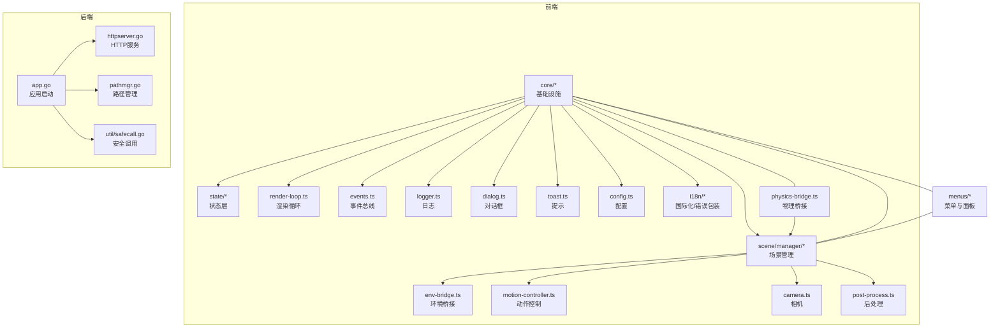

图表来源
- [frontend/src/core/main.ts](file://frontend/src/core/main.ts)
- [frontend/src/core/state.ts](file://frontend/src/core/state.ts)
- [frontend/src/core/scene-state.ts](file://frontend/src/core/scene-state.ts)
- [frontend/src/core/playback-state.ts](file://frontend/src/core/playback-state.ts)
- [frontend/src/core/library-state.ts](file://frontend/src/core/library-state.ts)
- [frontend/src/core/render-loop.ts](file://frontend/src/core/render-loop.ts)
- [frontend/src/core/events.ts](file://frontend/src/core/events.ts)
- [frontend/src/core/logger.ts](file://frontend/src/core/logger.ts)
- [frontend/src/core/dialog.ts](file://frontend/src/core/dialog.ts)
- [frontend/src/core/toast.ts](file://frontend/src/core/toast.ts)
- [frontend/src/core/config.ts](file://frontend/src/core/config.ts)
- [frontend/src/core/i18n/goerr.ts](file://frontend/src/core/i18n/goerr.ts)
- [frontend/src/core/i18n/t.ts](file://frontend/src/core/i18n/t.ts)
- [frontend/src/scene/manager/scene-manager.ts](file://frontend/src/scene/manager/scene-manager.ts)
- [frontend/src/scene/env/env-bridge.ts](file://frontend/src/scene/env/env-bridge.ts)
- [frontend/src/scene/motion/motion-controller.ts](file://frontend/src/scene/motion/motion-controller.ts)
- [frontend/src/scene/camera/camera.ts](file://frontend/src/scene/camera/camera.ts)
- [frontend/src/scene/render/post-process.ts](file://frontend/src/scene/render/post-process.ts)
- [frontend/src/physics/physics-bridge.ts](file://frontend/src/physics/physics-bridge.ts)
- [internal/app/app.go](file://internal/app/app.go)
- [internal/app/httpserver.go](file://internal/app/httpserver.go)
- [internal/app/pathmgr.go](file://internal/app/pathmgr.go)
- [internal/util/safecall.go](file://internal/util/safecall.go)

## 详细组件分析

### 状态管理模块（全局/场景/播放/库）
- 职责边界
  - 全局状态：仅负责聚合与分发应用级状态，不包含业务逻辑。
  - 场景状态：仅负责场景可见属性的读写与同步，不直接操作引擎对象。
  - 播放状态：仅负责动作播放控制与进度，不感知渲染细节。
  - 库状态：仅负责资源清单、缓存与加载任务编排。
- 接口契约
  - 通过只读快照与受控变更方法暴露能力，禁止外部直接修改内部数据结构。
  - 变更必须触发事件，供 UI 或其他模块响应。
- 示例路径
  - 全局状态定义与变更：[frontend/src/core/state.ts](file://frontend/src/core/state.ts)
  - 场景状态同步：[frontend/src/core/scene-state.ts](file://frontend/src/core/scene-state.ts)
  - 播放状态控制：[frontend/src/core/playback-state.ts](file://frontend/src/core/playback-state.ts)
  - 库状态与加载：[frontend/src/core/library-state.ts](file://frontend/src/core/library-state.ts)

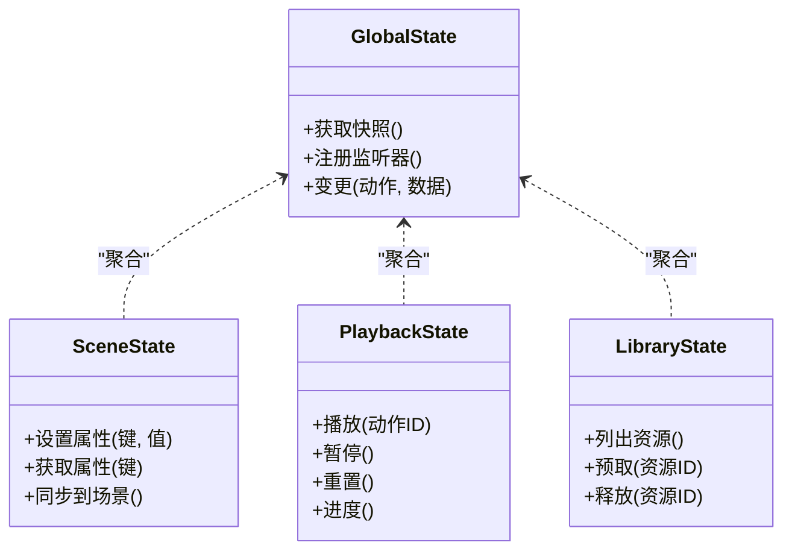

图表来源
- [frontend/src/core/state.ts](file://frontend/src/core/state.ts)
- [frontend/src/core/scene-state.ts](file://frontend/src/core/scene-state.ts)
- [frontend/src/core/playback-state.ts](file://frontend/src/core/playback-state.ts)
- [frontend/src/core/library-state.ts](file://frontend/src/core/library-state.ts)

章节来源
- [frontend/src/core/state.ts](file://frontend/src/core/state.ts)
- [frontend/src/core/scene-state.ts](file://frontend/src/core/scene-state.ts)
- [frontend/src/core/playback-state.ts](file://frontend/src/core/playback-state.ts)
- [frontend/src/core/library-state.ts](file://frontend/src/core/library-state.ts)

### 场景生命周期管理（场景管理器）
- 职责边界
  - 负责场景实例的创建、初始化、切换与销毁。
  - 协调环境、动作、相机、渲染后处理等子系统，但不深入其内部实现。
- 关键流程
  - 初始化：加载配置、准备资源、构建子系统。
  - 运行期：接收事件，委托对应子系统处理。
  - 销毁：释放资源、取消订阅、清理引用。
- 示例路径
  - 场景管理器：[frontend/src/scene/manager/scene-manager.ts](file://frontend/src/scene/manager/scene-manager.ts)
  - 场景入口：[frontend/src/scene/scene.ts](file://frontend/src/scene/scene.ts)

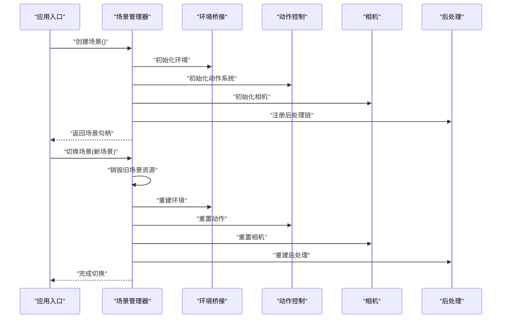

图表来源
- [frontend/src/scene/manager/scene-manager.ts](file://frontend/src/scene/manager/scene-manager.ts)
- [frontend/src/scene/scene.ts](file://frontend/src/scene/scene.ts)
- [frontend/src/scene/env/env-bridge.ts](file://frontend/src/scene/env/env-bridge.ts)
- [frontend/src/scene/motion/motion-controller.ts](file://frontend/src/scene/motion/motion-controller.ts)
- [frontend/src/scene/camera/camera.ts](file://frontend/src/scene/camera/camera.ts)
- [frontend/src/scene/render/post-process.ts](file://frontend/src/scene/render/post-process.ts)

章节来源
- [frontend/src/scene/manager/scene-manager.ts](file://frontend/src/scene/manager/scene-manager.ts)
- [frontend/src/scene/scene.ts](file://frontend/src/scene/scene.ts)

### 渲染循环与帧调度
- 职责边界
  - 统一帧推进、时间增量计算与绘制调用。
  - 不关心具体绘制内容，仅驱动状态更新与渲染。
- 示例路径
  - 渲染循环：[frontend/src/core/render-loop.ts](file://frontend/src/core/render-loop.ts)

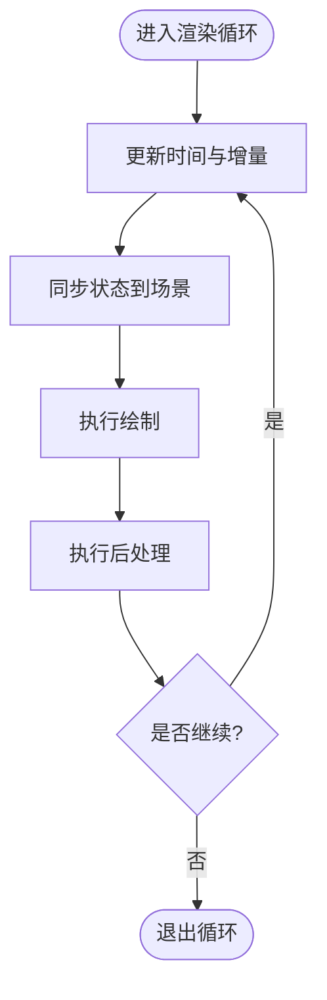

图表来源
- [frontend/src/core/render-loop.ts](file://frontend/src/core/render-loop.ts)

章节来源
- [frontend/src/core/render-loop.ts](file://frontend/src/core/render-loop.ts)

### 事件总线与模块通信
- 职责边界
  - 提供发布/订阅能力，隔离模块间的直接依赖。
  - 事件命名规范与载荷结构由核心定义，业务模块仅消费与发布。
- 示例路径
  - 事件总线：[frontend/src/core/events.ts](file://frontend/src/core/events.ts)

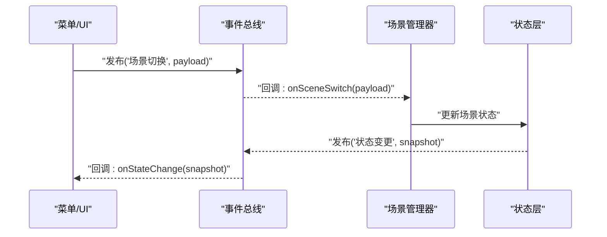

图表来源
- [frontend/src/core/events.ts](file://frontend/src/core/events.ts)
- [frontend/src/core/state.ts](file://frontend/src/core/state.ts)
- [frontend/src/scene/manager/scene-manager.ts](file://frontend/src/scene/manager/scene-manager.ts)

章节来源
- [frontend/src/core/events.ts](file://frontend/src/core/events.ts)

### 菜单与面板（声明式与工厂装配）
- 职责边界
  - 菜单描述：以声明式 schema 定义菜单结构与行为。
  - 工厂装配：根据 schema 生成具体菜单实例，注入依赖。
- 示例路径
  - 菜单 Schema：[frontend/src/menus/menu-schema.ts](file://frontend/src/menus/menu-schema.ts)
  - 菜单工厂：[frontend/src/menus/menu-factory.ts](file://frontend/src/menus/menu-factory.ts)
  - 场景菜单：[frontend/src/menus/scene-menu.ts](file://frontend/src/menus/scene-menu.ts)

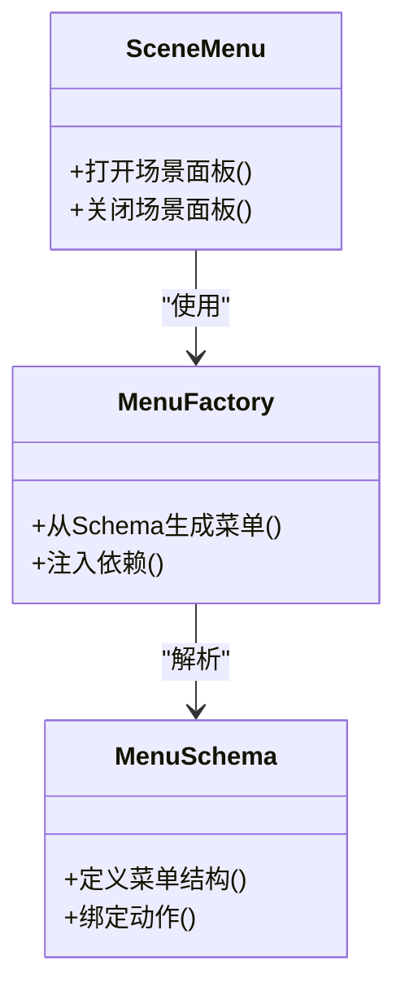

图表来源
- [frontend/src/menus/menu-schema.ts](file://frontend/src/menus/menu-schema.ts)
- [frontend/src/menus/menu-factory.ts](file://frontend/src/menus/menu-factory.ts)
- [frontend/src/menus/scene-menu.ts](file://frontend/src/menus/scene-menu.ts)

章节来源
- [frontend/src/menus/menu-schema.ts](file://frontend/src/menus/menu-schema.ts)
- [frontend/src/menus/menu-factory.ts](file://frontend/src/menus/menu-factory.ts)
- [frontend/src/menus/scene-menu.ts](file://frontend/src/menus/scene-menu.ts)

### 错误处理与国际化（横切关注点）
- 职责边界
  - 错误包装：统一错误类型、堆栈与上下文，便于追踪。
  - 国际化：将错误消息与用户界面文本进行本地化。
  - 安全调用：在后端侧对可能崩溃的调用进行保护。
- 示例路径
  - Go 错误包装：[frontend/src/core/i18n/goerr.ts](file://frontend/src/core/i18n/goerr.ts)
  - 翻译函数：[frontend/src/core/i18n/t.ts](file://frontend/src/core/i18n/t.ts)
  - 安全调用（后端）：[internal/util/safecall.go](file://internal/util/safecall.go)

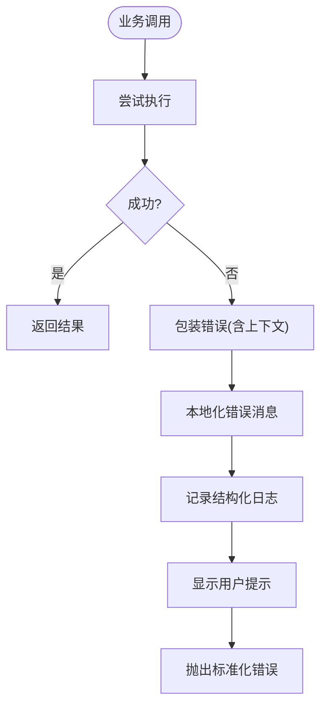

图表来源
- [frontend/src/core/i18n/goerr.ts](file://frontend/src/core/i18n/goerr.ts)
- [frontend/src/core/i18n/t.ts](file://frontend/src/core/i18n/t.ts)
- [internal/util/safecall.go](file://internal/util/safecall.go)
- [frontend/src/core/logger.ts](file://frontend/src/core/logger.ts)
- [frontend/src/core/toast.ts](file://frontend/src/core/toast.ts)

章节来源
- [frontend/src/core/i18n/goerr.ts](file://frontend/src/core/i18n/goerr.ts)
- [frontend/src/core/i18n/t.ts](file://frontend/src/core/i18n/t.ts)
- [internal/util/safecall.go](file://internal/util/safecall.go)
- [frontend/src/core/logger.ts](file://frontend/src/core/logger.ts)
- [frontend/src/core/toast.ts](file://frontend/src/core/toast.ts)

### 配置与持久化
- 职责边界
  - 配置中心：集中读取、校验、合并默认值与用户覆盖。
  - 持久化：将配置序列化存储，并提供热重载能力。
- 示例路径
  - 配置模块：[frontend/src/core/config.ts](file://frontend/src/core/config.ts)

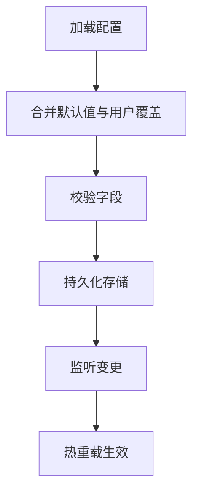

图表来源
- [frontend/src/core/config.ts](file://frontend/src/core/config.ts)

章节来源
- [frontend/src/core/config.ts](file://frontend/src/core/config.ts)

### 后端服务与前端桥接
- 职责边界
  - 应用启动：初始化后端服务、挂载中间件、启动 HTTP。
  - HTTP 服务：提供 REST/WS 接口，转发请求至业务模块。
  - 路径管理：抽象文件系统访问，屏蔽平台差异。
- 示例路径
  - 应用启动：[internal/app/app.go](file://internal/app/app.go)
  - HTTP 服务：[internal/app/httpserver.go](file://internal/app/httpserver.go)
  - 路径管理：[internal/app/pathmgr.go](file://internal/app/pathmgr.go)

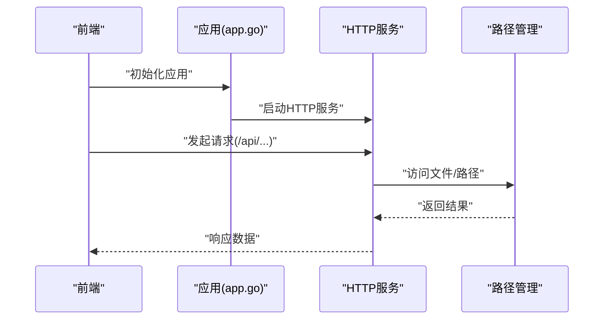

图表来源
- [internal/app/app.go](file://internal/app/app.go)
- [internal/app/httpserver.go](file://internal/app/httpserver.go)
- [internal/app/pathmgr.go](file://internal/app/pathmgr.go)

章节来源
- [internal/app/app.go](file://internal/app/app.go)
- [internal/app/httpserver.go](file://internal/app/httpserver.go)
- [internal/app/pathmgr.go](file://internal/app/pathmgr.go)

## 依赖分析
- 低耦合高内聚
  - 状态层仅依赖事件总线与配置，不依赖 UI 或场景实现。
  - 场景管理器依赖环境、动作、相机、后处理等子系统，但通过接口交互，避免深层耦合。
  - 菜单与面板通过工厂与 Schema 装配，减少硬编码依赖。
- 潜在循环依赖
  - 需确保状态层不反向依赖场景层；若存在，应引入事件或回调接口解耦。
- 外部依赖
  - 后端通过 HTTP 暴露能力，前端通过桥接调用，边界清晰。

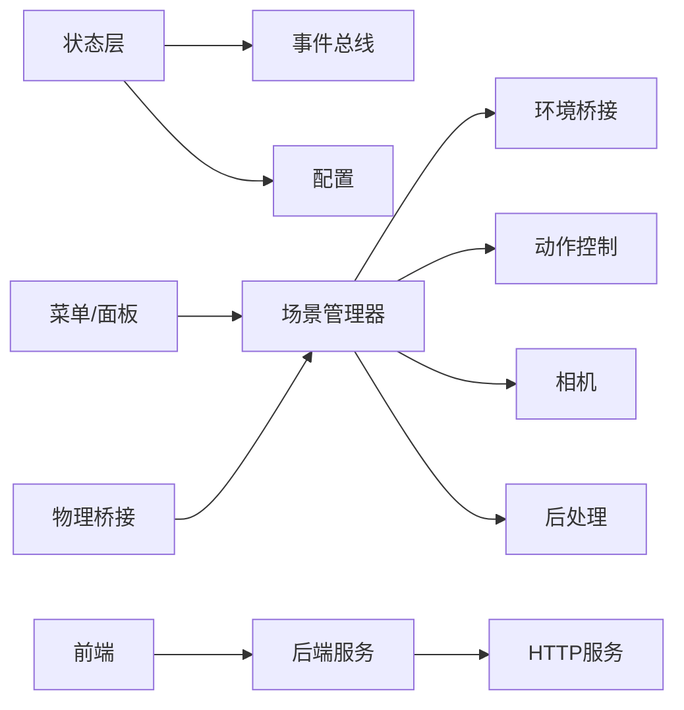

图表来源
- [frontend/src/core/state.ts](file://frontend/src/core/state.ts)
- [frontend/src/core/events.ts](file://frontend/src/core/events.ts)
- [frontend/src/core/config.ts](file://frontend/src/core/config.ts)
- [frontend/src/scene/manager/scene-manager.ts](file://frontend/src/scene/manager/scene-manager.ts)
- [frontend/src/scene/env/env-bridge.ts](file://frontend/src/scene/env/env-bridge.ts)
- [frontend/src/scene/motion/motion-controller.ts](file://frontend/src/scene/motion/motion-controller.ts)
- [frontend/src/scene/camera/camera.ts](file://frontend/src/scene/camera/camera.ts)
- [frontend/src/scene/render/post-process.ts](file://frontend/src/scene/render/post-process.ts)
- [frontend/src/menus/menu-schema.ts](file://frontend/src/menus/menu-schema.ts)
- [frontend/src/physics/physics-bridge.ts](file://frontend/src/physics/physics-bridge.ts)
- [internal/app/app.go](file://internal/app/app.go)
- [internal/app/httpserver.go](file://internal/app/httpserver.go)

章节来源
- [frontend/src/core/state.ts](file://frontend/src/core/state.ts)
- [frontend/src/core/events.ts](file://frontend/src/core/events.ts)
- [frontend/src/core/config.ts](file://frontend/src/core/config.ts)
- [frontend/src/scene/manager/scene-manager.ts](file://frontend/src/scene/manager/scene-manager.ts)
- [frontend/src/menus/menu-schema.ts](file://frontend/src/menus/menu-schema.ts)
- [internal/app/app.go](file://internal/app/app.go)
- [internal/app/httpserver.go](file://internal/app/httpserver.go)

## 性能考虑
- 渲染循环
  - 使用固定时间步长与可变帧率结合，避免抖动。
  - 批量更新状态，减少事件风暴。
- 状态同步
  - 按需同步，避免全量广播；对热点属性使用增量更新。
- 资源管理
  - 场景切换时及时释放纹理、几何体与动画数据，防止内存泄漏。
- 日志与调试
  - 生产环境降低日志级别，启用采样与异步写入，避免阻塞主线程。

## 故障排查指南
- 常见问题定位
  - 状态不同步：检查事件订阅是否正确注册，确认状态变更是否触发事件。
  - 场景切换失败：查看场景管理器初始化与销毁流程，确认资源释放顺序。
  - 菜单无法打开：核对菜单 Schema 与工厂装配，确认依赖注入完整。
  - 错误未本地化：检查错误包装链路，确认国际化键是否存在。
- 诊断工具
  - 结构化日志：包含模块名、时间戳、上下文键值对。
  - 提示与对话框：统一用户反馈，便于复现问题。
- 示例路径
  - 日志器：[frontend/src/core/logger.ts](file://frontend/src/core/logger.ts)
  - 提示：[frontend/src/core/toast.ts](file://frontend/src/core/toast.ts)
  - 对话框：[frontend/src/core/dialog.ts](file://frontend/src/core/dialog.ts)
  - 错误包装：[frontend/src/core/i18n/goerr.ts](file://frontend/src/core/i18n/goerr.ts)

章节来源
- [frontend/src/core/logger.ts](file://frontend/src/core/logger.ts)
- [frontend/src/core/toast.ts](file://frontend/src/core/toast.ts)
- [frontend/src/core/dialog.ts](file://frontend/src/core/dialog.ts)
- [frontend/src/core/i18n/goerr.ts](file://frontend/src/core/i18n/goerr.ts)

## 结论
通过将职责拆分为清晰的小模块并以接口约束边界，MikuMikuAR 实现了高内聚、低耦合的架构。状态管理、场景生命周期、渲染循环、菜单装配、错误与国际化等横切关注点均被独立封装，显著提升了可维护性与可扩展性。持续遵循 SRP 有助于在复杂系统中保持代码的可读性与可测试性。

## 附录
- 识别违反 SRP 的代码
  - 一个类/模块承担多个不相关的职责（如既做状态同步又做 UI 渲染）。
  - 方法过长且包含多种决策分支，难以单独测试。
  - 频繁出现跨层调用与隐式依赖。
- 重构建议
  - 提取职责：将混合逻辑拆分为独立模块，并通过事件或接口通信。
  - 引入门面：为复杂子系统提供简洁 API，屏蔽内部复杂性。
  - 统一横切：将日志、错误、国际化等抽取为共享能力，避免重复实现。
  - 强化契约：用接口与类型约束模块边界，减少隐式依赖。