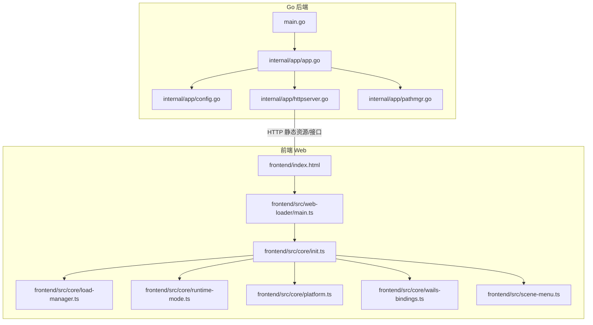
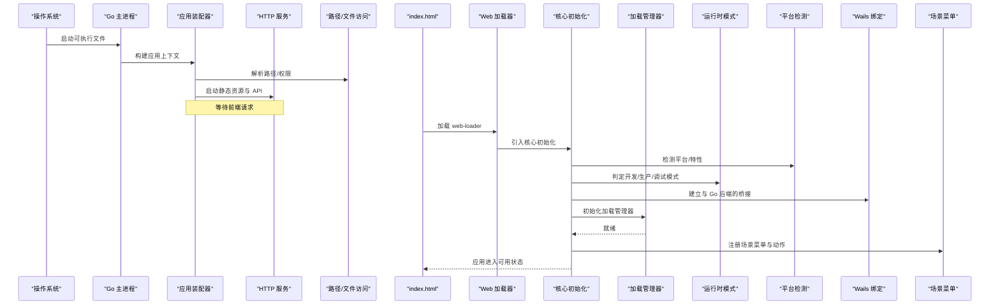
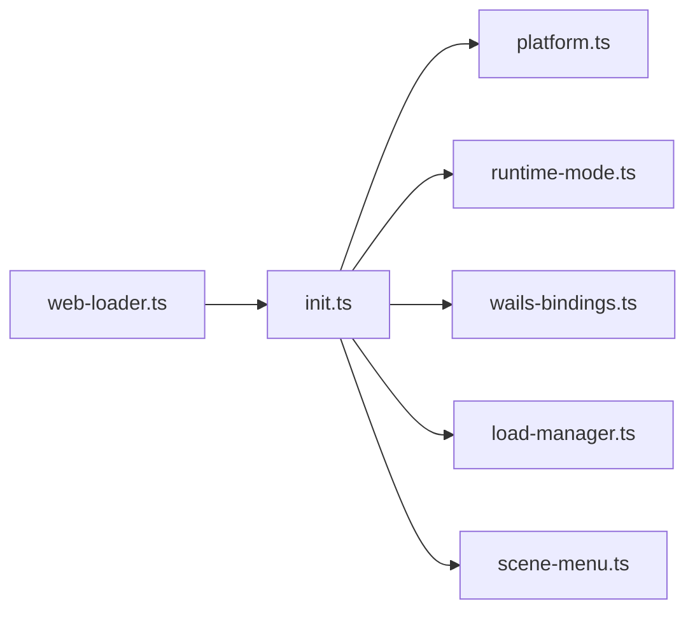
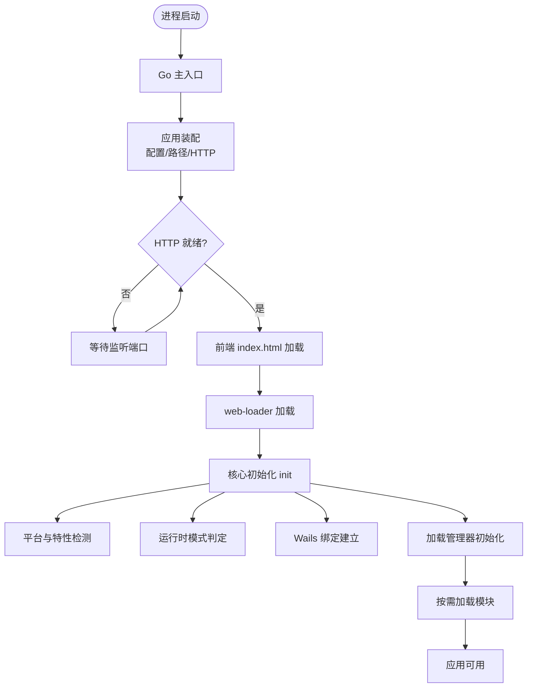

# 模块加载与初始化

<cite>
**本文引用的文件**   
- [main.go](file://main.go)
- [app.go](file://internal/app/app.go)
- [config.go](file://internal/app/config.go)
- [httpserver.go](file://internal/app/httpserver.go)
- [pathmgr.go](file://internal/app/pathmgr.go)
- [index.html](file://frontend/index.html)
- [web-loader.ts](file://frontend/src/web-loader/main.ts)
- [init.ts](file://frontend/src/core/init.ts)
- [load-manager.ts](file://frontend/src/core/load-manager.ts)
- [runtime-mode.ts](file://frontend/src/core/runtime-mode.ts)
- [platform.ts](file://frontend/src/core/platform.ts)
- [wails-bindings.ts](file://frontend/src/core/wails-bindings.ts)
- [scene-menu.ts](file://frontend/src/scene-menu.ts)
- [ADR-045-unified-loading.md](file://docs/adr/adr-045-unified-loading.md)
</cite>

## 目录
1. [简介](#简介)
2. [项目结构](#项目结构)
3. [核心组件](#核心组件)
4. [架构总览](#架构总览)
5. [详细组件分析](#详细组件分析)
6. [依赖关系分析](#依赖关系分析)
7. [性能考虑](#性能考虑)
8. [故障排除指南](#故障排除指南)
9. [结论](#结论)
10. [附录](#附录)

## 简介
本文件聚焦于应用的“模块加载与初始化机制”，覆盖从宿主进程到前端渲染引擎的完整启动链路，包括：
- 核心模块加载顺序与依赖解析
- 懒加载与条件加载策略
- 基于运行环境与配置的动态加载
- 初始化生命周期管理（前置检查、资源准备、错误恢复）
- 性能优化建议（并行加载、缓存、预取）
- 配置示例与故障排除

## 项目结构
本项目采用前后端分离的桌面应用架构：Go 后端通过 Wails 提供系统能力与 HTTP 服务，前端在 WebView 中运行并负责场景、UI、渲染等。关键入口与初始化点如下：
- Go 侧：主程序入口、应用装配、HTTP 服务器、路径管理、配置加载
- Web 侧：HTML 入口、Web Loader、核心初始化、运行时模式与平台检测、Wails 绑定、场景菜单注册

图表来源
- [main.go](file://main.go)
- [app.go](file://internal/app/app.go)
- [config.go](file://internal/app/config.go)
- [httpserver.go](file://internal/app/httpserver.go)
- [pathmgr.go](file://internal/app/pathmgr.go)
- [index.html](file://frontend/index.html)
- [web-loader.ts](file://frontend/src/web-loader/main.ts)
- [init.ts](file://frontend/src/core/init.ts)
- [load-manager.ts](file://frontend/src/core/load-manager.ts)
- [runtime-mode.ts](file://frontend/src/core/runtime-mode.ts)
- [platform.ts](file://frontend/src/core/platform.ts)
- [wails-bindings.ts](file://frontend/src/core/wails-bindings.ts)
- [scene-menu.ts](file://frontend/src/scene-menu.ts)

章节来源
- [main.go](file://main.go)
- [app.go](file://internal/app/app.go)
- [config.go](file://internal/app/config.go)
- [httpserver.go](file://internal/app/httpserver.go)
- [pathmgr.go](file://internal/app/pathmgr.go)
- [index.html](file://frontend/index.html)
- [web-loader.ts](file://frontend/src/web-loader/main.ts)
- [init.ts](file://frontend/src/core/init.ts)
- [load-manager.ts](file://frontend/src/core/load-manager.ts)
- [runtime-mode.ts](file://frontend/src/core/runtime-mode.ts)
- [platform.ts](file://frontend/src/core/platform.ts)
- [wails-bindings.ts](file://frontend/src/core/wails-bindings.ts)
- [scene-menu.ts](file://frontend/src/scene-menu.ts)

## 核心组件
- 应用装配器（Go）：负责创建应用实例、挂载路由、注入配置与文件系统访问能力、启动 HTTP 服务。
- 配置中心（Go）：读取并合并多源配置（默认、用户、环境），为前后端提供一致的配置视图。
- 路径管理器（Go）：统一资源根路径、库目录、下载目标等，屏蔽平台差异。
- Web 加载器（前端）：最小化入口，负责加载核心初始化脚本与基础样式。
- 核心初始化（前端）：按阶段完成平台检测、运行时模式判定、Wails 绑定、日志与国际化、状态与 UI 初始化。
- 加载管理器（前端）：统一管理模块/资源的加载顺序、并发度、重试与降级。
- 运行时模式与平台检测（前端）：根据浏览器/宿主环境决定功能开关与加载策略。
- 场景菜单注册（前端）：按需注册场景相关菜单项与动作，支持条件启用。

章节来源
- [app.go](file://internal/app/app.go)
- [config.go](file://internal/app/config.go)
- [pathmgr.go](file://internal/app/pathmgr.go)
- [web-loader.ts](file://frontend/src/web-loader/main.ts)
- [init.ts](file://frontend/src/core/init.ts)
- [load-manager.ts](file://frontend/src/core/load-manager.ts)
- [runtime-mode.ts](file://frontend/src/core/runtime-mode.ts)
- [platform.ts](file://frontend/src/core/platform.ts)
- [wails-bindings.ts](file://frontend/src/core/wails-bindings.ts)
- [scene-menu.ts](file://frontend/src/scene-menu.ts)

## 架构总览
下图展示了从 Go 进程到前端渲染的端到端启动流程，以及关键模块间的交互关系。

图表来源
- [main.go](file://main.go)
- [app.go](file://internal/app/app.go)
- [httpserver.go](file://internal/app/httpserver.go)
- [pathmgr.go](file://internal/app/pathmgr.go)
- [index.html](file://frontend/index.html)
- [web-loader.ts](file://frontend/src/web-loader/main.ts)
- [init.ts](file://frontend/src/core/init.ts)
- [load-manager.ts](file://frontend/src/core/load-manager.ts)
- [runtime-mode.ts](file://frontend/src/core/runtime-mode.ts)
- [platform.ts](file://frontend/src/core/platform.ts)
- [wails-bindings.ts](file://frontend/src/core/wails-bindings.ts)
- [scene-menu.ts](file://frontend/src/scene-menu.ts)

## 详细组件分析

### Go 后端：应用装配与 HTTP 服务
- 职责
  - 组装应用上下文，注入配置、路径管理与文件系统访问能力
  - 启动 HTTP 服务，暴露静态资源与必要 API
  - 处理跨域与安全头（如 COEP/CORP）以满足 WebGL/WASM 需求
- 关键点
  - 配置加载优先级：默认 -> 用户 -> 环境变量
  - 路径规范化与平台适配（Windows/macOS/Linux/Android/iOS）
  - 静态资源映射与热更新支持（开发模式）

章节来源
- [app.go](file://internal/app/app.go)
- [config.go](file://internal/app/config.go)
- [httpserver.go](file://internal/app/httpserver.go)
- [pathmgr.go](file://internal/app/pathmgr.go)

### Web 加载器与入口
- 职责
  - 作为最小化入口，加载核心初始化脚本与基础样式
  - 在必要时注入全局错误捕获与回退逻辑
- 关键点
  - 延迟加载核心脚本，减少首屏体积
  - 对网络失败进行友好提示与重试

章节来源
- [index.html](file://frontend/index.html)
- [web-loader.ts](file://frontend/src/web-loader/main.ts)

### 核心初始化（init）
- 职责
  - 平台与特性检测
  - 运行时模式判定（开发/生产/调试）
  - 建立与 Go 后端的通信桥接
  - 初始化日志、国际化、UI 状态与主题
  - 触发加载管理器，开始按需加载模块
- 关键点
  - 严格的前置检查：GPU/WebGL、WASM、音频、AR 能力
  - 错误边界：捕获初始化异常，展示诊断信息并尝试降级
  - 事件驱动：各子系统通过事件总线协调初始化顺序

章节来源
- [init.ts](file://frontend/src/core/init.ts)
- [platform.ts](file://frontend/src/core/platform.ts)
- [runtime-mode.ts](file://frontend/src/core/runtime-mode.ts)
- [wails-bindings.ts](file://frontend/src/core/wails-bindings.ts)

### 加载管理器（Load Manager）
- 职责
  - 定义模块清单与依赖图
  - 控制加载并发度、重试与超时
  - 提供懒加载与条件加载 API
- 关键点
  - 拓扑排序确保依赖顺序
  - 并行加载独立子树，串行关键路径
  - 缓存已加载模块，避免重复请求
  - 失败隔离：单个模块失败不影响其他分支

章节来源
- [load-manager.ts](file://frontend/src/core/load-manager.ts)

### 运行时模式与平台检测
- 职责
  - 识别运行环境（桌面/移动/AR）、浏览器内核、设备能力
  - 输出运行时标志位，供条件加载使用
- 关键点
  - 特征探测优先于 UA 判断
  - 针对低端设备自动降级渲染与特效

章节来源
- [runtime-mode.ts](file://frontend/src/core/runtime-mode.ts)
- [platform.ts](file://frontend/src/core/platform.ts)

### 场景菜单与功能开关
- 职责
  - 注册场景相关菜单项、快捷键与动作
  - 根据能力与配置决定是否启用某功能
- 关键点
  - 菜单项与功能实现解耦
  - 支持动态启用/禁用，无需重启

章节来源
- [scene-menu.ts](file://frontend/src/scene-menu.ts)

### 统一加载设计决策（ADR）
- 背景
  - 历史存在多处分散的加载逻辑，难以维护与观测
- 方案
  - 以加载管理器为中心，集中管理模块清单、依赖与生命周期
  - 提供统一的进度、错误与重试语义
- 收益
  - 提升可观测性与可测试性
  - 便于实施并行、缓存与预取策略

章节来源
- [ADR-045-unified-loading.md](file://docs/adr/adr-045-unified-loading.md)

## 依赖关系分析
以下依赖图展示了前端核心模块之间的导入与调用关系，有助于理解初始化顺序与潜在循环依赖风险。

图表来源
- [web-loader.ts](file://frontend/src/web-loader/main.ts)
- [init.ts](file://frontend/src/core/init.ts)
- [platform.ts](file://frontend/src/core/platform.ts)
- [runtime-mode.ts](file://frontend/src/core/runtime-mode.ts)
- [wails-bindings.ts](file://frontend/src/core/wails-bindings.ts)
- [load-manager.ts](file://frontend/src/core/load-manager.ts)
- [scene-menu.ts](file://frontend/src/scene-menu.ts)

章节来源
- [web-loader.ts](file://frontend/src/web-loader/main.ts)
- [init.ts](file://frontend/src/core/init.ts)
- [platform.ts](file://frontend/src/core/platform.ts)
- [runtime-mode.ts](file://frontend/src/core/runtime-mode.ts)
- [wails-bindings.ts](file://frontend/src/core/wails-bindings.ts)
- [load-manager.ts](file://frontend/src/core/load-manager.ts)
- [scene-menu.ts](file://frontend/src/scene-menu.ts)

## 性能考虑
- 并行加载
  - 将无相互依赖的模块/资源放入同一批次并行请求
  - 限制最大并发数，避免阻塞主线程与网络栈
- 缓存策略
  - 对静态资源启用强缓存；对动态模块使用版本化文件名
  - 内存级模块缓存，避免重复初始化
- 资源预取
  - 在空闲时段预取高频使用的模型、材质或纹理
  - 基于用户行为预测（如打开设置页时预取语言包）
- 渐进式加载
  - 先加载核心渲染与 UI，再按需加载高级特性（如 AR、物理）
- 错误快速失败与回退
  - 对关键路径设置超时与重试上限，失败则降级到轻量模式
- 测量与监控
  - 记录各阶段耗时与失败率，定位瓶颈

[本节为通用指导，不直接分析具体文件]

## 故障排除指南
- 常见问题
  - WASM 无法加载：检查 MIME 类型、COEP/CORP 响应头与同源策略
  - 纹理/模型 404：确认路径映射与资源根目录是否正确
  - 跨域被拦截：确保服务端返回必要的 CORS 头
  - 菜单键冲突：检查快捷键注册是否重复覆盖
- 排查步骤
  - 查看控制台错误与网络面板，定位首次失败请求
  - 切换运行时模式（开发/生产）对比行为差异
  - 关闭非必要特性（如 AR、物理）验证是否为特性导致
  - 使用加载管理器提供的日志与进度回调定位卡点
- 恢复策略
  - 自动重试与指数退避
  - 降级到安全模式（仅基础渲染与 UI）
  - 提示用户清理缓存并重试

章节来源
- [httpserver.go](file://internal/app/httpserver.go)
- [pathmgr.go](file://internal/app/pathmgr.go)
- [load-manager.ts](file://frontend/src/core/load-manager.ts)
- [runtime-mode.ts](file://frontend/src/core/runtime-mode.ts)

## 结论
通过统一的加载管理器与清晰的生命周期划分，项目在复杂的多平台与多环境下实现了稳定、可观测且高性能的模块加载与初始化。结合并行加载、缓存与预取策略，可在保证用户体验的同时有效控制资源占用与启动时间。

[本节为总结性内容，不直接分析具体文件]

## 附录

### 启动流程图（代码级）

图表来源
- [main.go](file://main.go)
- [app.go](file://internal/app/app.go)
- [httpserver.go](file://internal/app/httpserver.go)
- [index.html](file://frontend/index.html)
- [web-loader.ts](file://frontend/src/web-loader/main.ts)
- [init.ts](file://frontend/src/core/init.ts)
- [platform.ts](file://frontend/src/core/platform.ts)
- [runtime-mode.ts](file://frontend/src/core/runtime-mode.ts)
- [wails-bindings.ts](file://frontend/src/core/wails-bindings.ts)
- [load-manager.ts](file://frontend/src/core/load-manager.ts)

### 懒加载与条件加载策略
- 懒加载
  - 仅在用户触发或页面可见时加载对应模块
  - 使用 IntersectionObserver 或路由守卫触发
- 条件加载
  - 基于平台/设备能力（WebGL、AR、音频）动态启用
  - 基于配置开关（feature flags）控制功能显隐
- 实现要点
  - 在加载管理器中声明模块的条件表达式
  - 条件为真时才纳入依赖图并参与拓扑排序
  - 条件变化时可重新评估并增量加载

章节来源
- [load-manager.ts](file://frontend/src/core/load-manager.ts)
- [runtime-mode.ts](file://frontend/src/core/runtime-mode.ts)
- [platform.ts](file://frontend/src/core/platform.ts)

### 初始化生命周期与错误恢复
- 阶段
  - 前置检查：平台、特性、权限
  - 资源准备：路径、缓存、静态资源
  - 模块加载：按依赖顺序与并发策略
  - 就绪通知：广播事件，允许后续订阅者接入
- 错误恢复
  - 捕获异常并上报
  - 自动重试与降级
  - 提供诊断信息与用户指引

章节来源
- [init.ts](file://frontend/src/core/init.ts)
- [load-manager.ts](file://frontend/src/core/load-manager.ts)

### 配置示例（说明性）
以下为配置项的说明性示例，用于演示如何影响加载与初始化行为（非真实代码片段）：
- 运行时模式
  - 字段：runtime.mode
  - 取值：development | production | debug
  - 作用：控制日志级别、热重载、调试钩子
- 资源路径
  - 字段：paths.root
  - 作用：静态资源与模型库根目录
- 功能开关
  - 字段：features.ar.enabled
  - 作用：是否启用 AR 相机与相关模块
- 加载策略
  - 字段：loader.maxConcurrent
  - 字段：loader.retryAttempts
  - 字段：loader.timeoutMs
  - 作用：控制并发、重试与超时

章节来源
- [config.go](file://internal/app/config.go)
- [load-manager.ts](file://frontend/src/core/load-manager.ts)