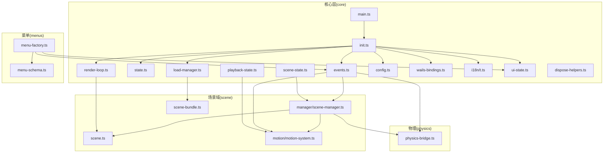
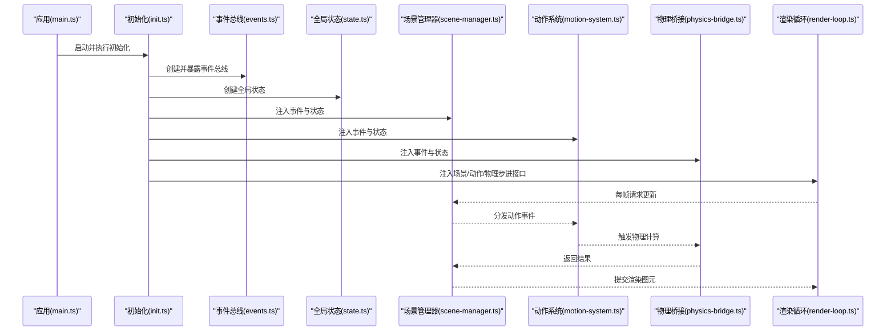
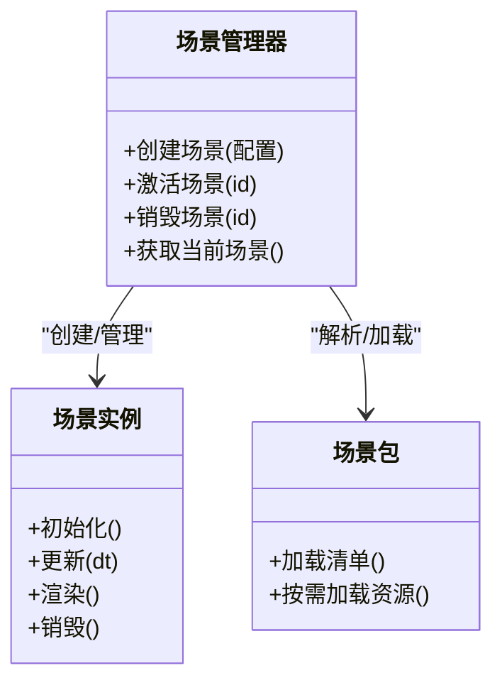
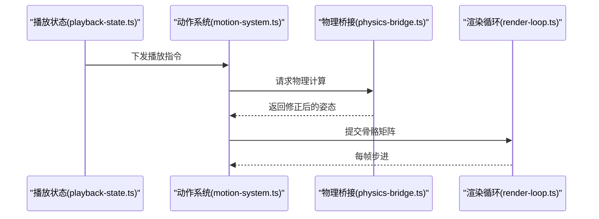
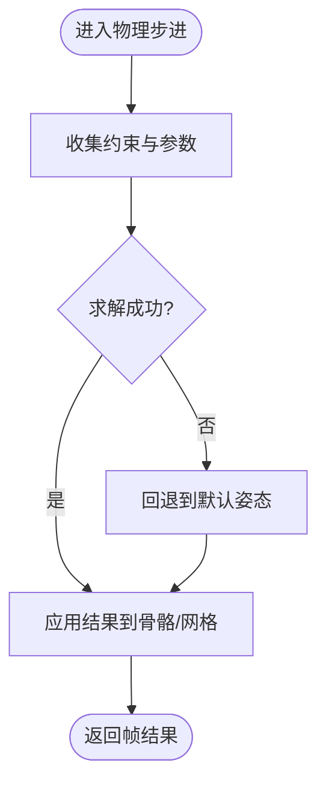
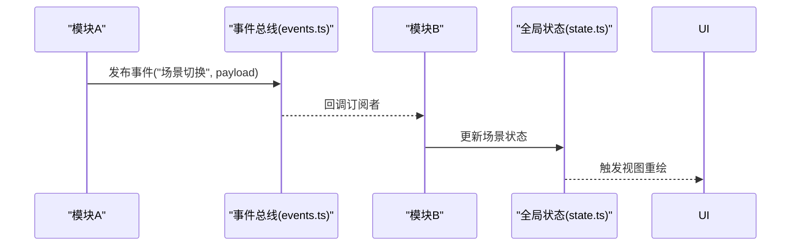
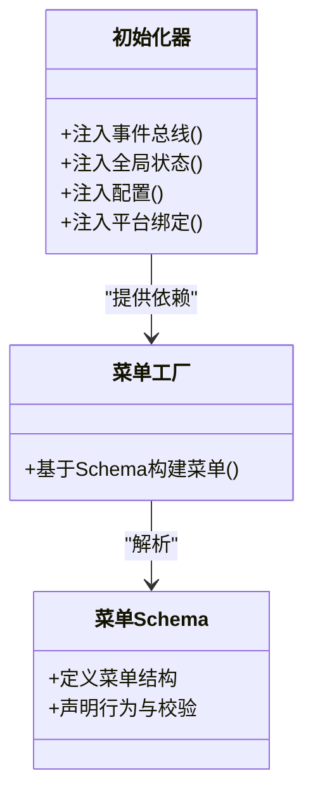
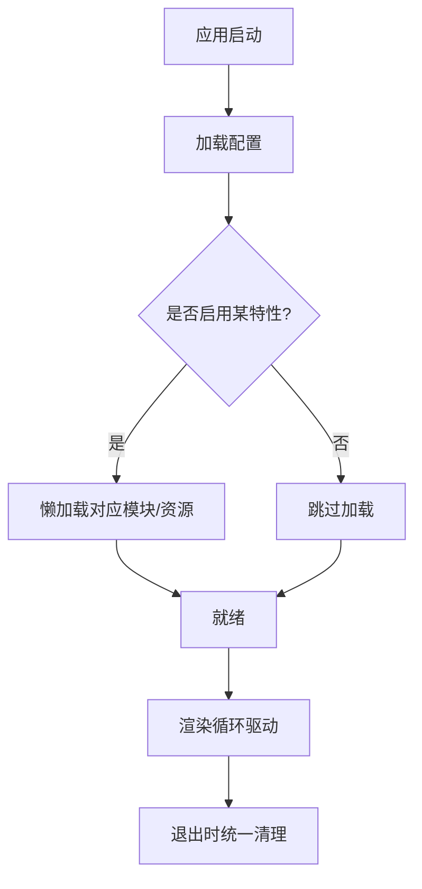
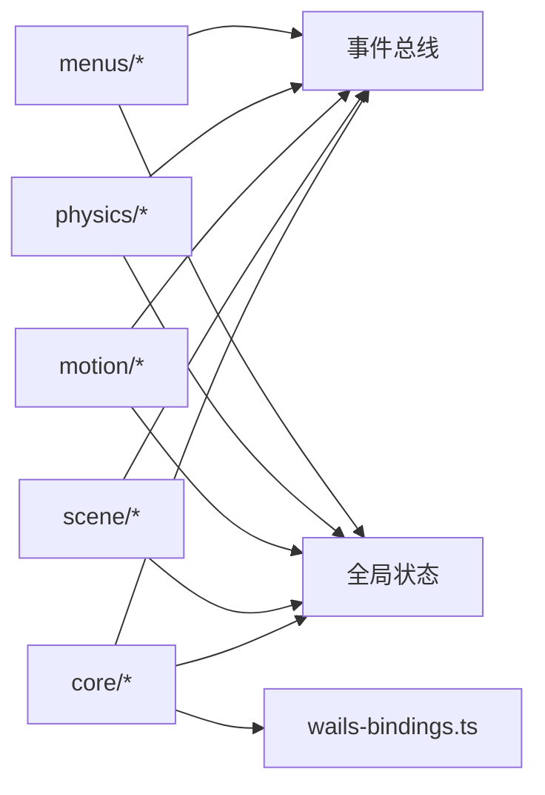

# 模块设计原则

<cite>
**本文引用的文件**   
- [frontend/src/core/main.ts](file://frontend/src/core/main.ts)
- [frontend/src/core/init.ts](file://frontend/src/core/init.ts)
- [frontend/src/core/events.ts](file://frontend/src/core/events.ts)
- [frontend/src/core/state.ts](file://frontend/src/core/state.ts)
- [frontend/src/core/scene-state.ts](file://frontend/src/core/scene-state.ts)
- [frontend/src/core/playback-state.ts](file://frontend/src/core/playback-state.ts)
- [frontend/src/core/load-manager.ts](file://frontend/src/core/load-manager.ts)
- [frontend/src/core/render-loop.ts](file://frontend/src/core/render-loop.ts)
- [frontend/src/core/config.ts](file://frontend/src/core/config.ts)
- [frontend/src/core/wails-bindings.ts](file://frontend/src/core/wails-bindings.ts)
- [frontend/src/scene/manager/scene-manager.ts](file://frontend/src/scene/manager/scene-manager.ts)
- [frontend/src/scene/scene-bundle.ts](file://frontend/src/scene/scene-bundle.ts)
- [frontend/src/scene/scene.ts](file://frontend/src/scene/scene.ts)
- [frontend/src/scene/motion/motion-system.ts](file://frontend/src/scene/motion/motion-system.ts)
- [frontend/src/physics/physics-bridge.ts](file://frontend/src/physics/physics-bridge.ts)
- [frontend/src/menus/menu-factory.ts](file://frontend/src/menus/menu-factory.ts)
- [frontend/src/menus/menu-schema.ts](file://frontend/src/menus/menu-schema.ts)
- [frontend/src/core/i18n/t.ts](file://frontend/src/core/i18n/t.ts)
- [frontend/src/core/ui-state.ts](file://frontend/src/core/ui-state.ts)
- [frontend/src/core/dispose-helpers.ts](file://frontend/src/core/dispose-helpers.ts)
</cite>

## 目录
1. [引言](#引言)
2. [项目结构](#项目结构)
3. [核心组件](#核心组件)
4. [架构总览](#架构总览)
5. [详细组件分析](#详细组件分析)
6. [依赖分析](#依赖分析)
7. [性能考虑](#性能考虑)
8. [故障排查指南](#故障排查指南)
9. [结论](#结论)
10. [附录](#附录)

## 引言
本文件面向 MikuMikuAR 前端工程，系统化阐述模块化架构的设计原则与实践。重点覆盖：
- 单一职责与依赖倒置在场景管理、动画系统、物理引擎等核心模块中的落地方式
- 模块边界划分标准与独立性保障
- 模块间通信机制（事件总线、状态同步、消息传递）
- 依赖注入与工厂模式的应用，降低耦合度
- 模块加载与初始化最佳实践（懒加载、条件加载、生命周期管理）

## 项目结构
前端采用“领域分层 + 横切能力”的组织方式：
- core：应用内核与横切能力（初始化、配置、事件、状态、渲染循环、资源加载、Wails 绑定、国际化、UI 状态等）
- scene：场景域（场景实例、场景包、管理器、相机、环境、渲染、动作、骨骼、变换等子域）
- motion-algos：动作算法库（VMD/VDP 解析、程序化动作、节拍检测、唇动等）
- physics：物理桥接与风场物理
- menus：菜单与设置（声明式 schema、工厂、各功能级菜单）
- web-loader：启动器与样式
- bindings：Wails 类型绑定与封装

图表来源
- [frontend/src/core/main.ts](file://frontend/src/core/main.ts)
- [frontend/src/core/init.ts](file://frontend/src/core/init.ts)
- [frontend/src/core/events.ts](file://frontend/src/core/events.ts)
- [frontend/src/core/state.ts](file://frontend/src/core/state.ts)
- [frontend/src/core/scene-state.ts](file://frontend/src/core/scene-state.ts)
- [frontend/src/core/playback-state.ts](file://frontend/src/core/playback-state.ts)
- [frontend/src/core/load-manager.ts](file://frontend/src/core/load-manager.ts)
- [frontend/src/core/render-loop.ts](file://frontend/src/core/render-loop.ts)
- [frontend/src/core/config.ts](file://frontend/src/core/config.ts)
- [frontend/src/core/wails-bindings.ts](file://frontend/src/core/wails-bindings.ts)
- [frontend/src/scene/manager/scene-manager.ts](file://frontend/src/scene/manager/scene-manager.ts)
- [frontend/src/scene/scene-bundle.ts](file://frontend/src/scene/scene-bundle.ts)
- [frontend/src/scene/scene.ts](file://frontend/src/scene/scene.ts)
- [frontend/src/scene/motion/motion-system.ts](file://frontend/src/scene/motion/motion-system.ts)
- [frontend/src/physics/physics-bridge.ts](file://frontend/src/physics/physics-bridge.ts)
- [frontend/src/menus/menu-factory.ts](file://frontend/src/menus/menu-factory.ts)
- [frontend/src/menus/menu-schema.ts](file://frontend/src/menus/menu-schema.ts)
- [frontend/src/core/i18n/t.ts](file://frontend/src/core/i18n/t.ts)
- [frontend/src/core/ui-state.ts](file://frontend/src/core/ui-state.ts)
- [frontend/src/core/dispose-helpers.ts](file://frontend/src/core/dispose-helpers.ts)

章节来源
- [frontend/src/core/main.ts](file://frontend/src/core/main.ts)
- [frontend/src/core/init.ts](file://frontend/src/core/init.ts)
- [frontend/src/core/events.ts](file://frontend/src/core/events.ts)
- [frontend/src/core/state.ts](file://frontend/src/core/state.ts)
- [frontend/src/core/scene-state.ts](file://frontend/src/core/scene-state.ts)
- [frontend/src/core/playback-state.ts](file://frontend/src/core/playback-state.ts)
- [frontend/src/core/load-manager.ts](file://frontend/src/core/load-manager.ts)
- [frontend/src/core/render-loop.ts](file://frontend/src/core/render-loop.ts)
- [frontend/src/core/config.ts](file://frontend/src/core/config.ts)
- [frontend/src/core/wails-bindings.ts](file://frontend/src/core/wails-bindings.ts)
- [frontend/src/scene/manager/scene-manager.ts](file://frontend/src/scene/manager/scene-manager.ts)
- [frontend/src/scene/scene-bundle.ts](file://frontend/src/scene/scene-bundle.ts)
- [frontend/src/scene/scene.ts](file://frontend/src/scene/scene.ts)
- [frontend/src/scene/motion/motion-system.ts](file://frontend/src/scene/motion/motion-system.ts)
- [frontend/src/physics/physics-bridge.ts](file://frontend/src/physics/physics-bridge.ts)
- [frontend/src/menus/menu-factory.ts](file://frontend/src/menus/menu-factory.ts)
- [frontend/src/menus/menu-schema.ts](file://frontend/src/menus/menu-schema.ts)
- [frontend/src/core/i18n/t.ts](file://frontend/src/core/i18n/t.ts)
- [frontend/src/core/ui-state.ts](file://frontend/src/core/ui-state.ts)
- [frontend/src/core/dispose-helpers.ts](file://frontend/src/core/dispose-helpers.ts)

## 核心组件
- 应用入口与初始化
  - main.ts：注册 Wails 应用、挂载根容器、触发初始化流程
  - init.ts：按序装配配置、平台能力、事件总线、状态、加载器、渲染循环、UI 状态、国际化等；提供统一的生命周期钩子
- 事件总线
  - events.ts：发布/订阅中心，支持命名空间、一次性监听、批量订阅与取消订阅；用于跨模块解耦通信
- 状态管理
  - state.ts：全局响应式状态基座，提供订阅/变更通知
  - scene-state.ts：场景相关状态（当前场景、场景集合、切换历史等）
  - playback-state.ts：播放控制状态（播放列表、时间轴、暂停/恢复等）
- 资源加载
  - load-manager.ts：统一的异步资源加载管线，支持并发控制、错误聚合、进度回调、取消信号
- 渲染循环
  - render-loop.ts：帧驱动、增量更新、节流/限帧策略、与场景/动作/物理的步进协调
- 配置与平台
  - config.ts：配置读取、合并、校验与持久化
  - wails-bindings.ts：对 Go 后端的调用封装，屏蔽平台差异
- UI 与国际化
  - ui-state.ts：面板可见性、焦点、弹窗等 UI 状态
  - i18n/t.ts：多语言键值访问与回退
- 销毁与清理
  - dispose-helpers.ts：统一释放资源、移除监听、避免内存泄漏

章节来源
- [frontend/src/core/main.ts](file://frontend/src/core/main.ts)
- [frontend/src/core/init.ts](file://frontend/src/core/init.ts)
- [frontend/src/core/events.ts](file://frontend/src/core/events.ts)
- [frontend/src/core/state.ts](file://frontend/src/core/state.ts)
- [frontend/src/core/scene-state.ts](file://frontend/src/core/scene-state.ts)
- [frontend/src/core/playback-state.ts](file://frontend/src/core/playback-state.ts)
- [frontend/src/core/load-manager.ts](file://frontend/src/core/load-manager.ts)
- [frontend/src/core/render-loop.ts](file://frontend/src/core/render-loop.ts)
- [frontend/src/core/config.ts](file://frontend/src/core/config.ts)
- [frontend/src/core/wails-bindings.ts](file://frontend/src/core/wails-bindings.ts)
- [frontend/src/core/ui-state.ts](file://frontend/src/core/ui-state.ts)
- [frontend/src/core/i18n/t.ts](file://frontend/src/core/i18n/t.ts)
- [frontend/src/core/dispose-helpers.ts](file://frontend/src/core/dispose-helpers.ts)

## 架构总览
整体遵循“低耦合、高内聚”的模块化原则：
- 通过事件总线进行横向通信，避免直接引用
- 通过状态对象集中承载可变数据，配合响应式订阅实现 UI 与逻辑同步
- 通过工厂与依赖注入将具体实现与使用方解耦
- 通过加载管理器与渲染循环协调异步与帧驱动

图表来源
- [frontend/src/core/main.ts](file://frontend/src/core/main.ts)
- [frontend/src/core/init.ts](file://frontend/src/core/init.ts)
- [frontend/src/core/events.ts](file://frontend/src/core/events.ts)
- [frontend/src/core/state.ts](file://frontend/src/core/state.ts)
- [frontend/src/scene/manager/scene-manager.ts](file://frontend/src/scene/manager/scene-manager.ts)
- [frontend/src/scene/motion/motion-system.ts](file://frontend/src/scene/motion/motion-system.ts)
- [frontend/src/physics/physics-bridge.ts](file://frontend/src/physics/physics-bridge.ts)
- [frontend/src/core/render-loop.ts](file://frontend/src/core/render-loop.ts)

## 详细组件分析

### 场景管理模块（scene-manager.ts / scene.ts / scene-bundle.ts）
- 职责边界
  - 场景管理器：负责场景实例的创建、激活、销毁、切换与生命周期编排
  - 场景实例：封装单场景内的模型、相机、环境、渲染目标等
  - 场景包：描述可复用场景资源的打包与按需加载
- 设计原则体现
  - 单一职责：管理器仅关注编排，不持有渲染细节
  - 依赖倒置：管理器通过抽象接口与渲染/动作/物理交互，便于替换实现
  - 工厂模式：场景实例由工厂根据配置或协议创建
- 关键交互
  - 接收来自事件总线的“场景切换/加载”指令
  - 向渲染循环注册/注销步进回调
  - 与动作系统协作，按场景上下文选择动作策略

图表来源
- [frontend/src/scene/manager/scene-manager.ts](file://frontend/src/scene/manager/scene-manager.ts)
- [frontend/src/scene/scene.ts](file://frontend/src/scene/scene.ts)
- [frontend/src/scene/scene-bundle.ts](file://frontend/src/scene/scene-bundle.ts)

章节来源
- [frontend/src/scene/manager/scene-manager.ts](file://frontend/src/scene/manager/scene-manager.ts)
- [frontend/src/scene/scene.ts](file://frontend/src/scene/scene.ts)
- [frontend/src/scene/scene-bundle.ts](file://frontend/src/scene/scene-bundle.ts)

### 动画系统模块（motion-system.ts）
- 职责边界
  - 动作系统：负责动作回放、混合、层级、权重、时间轴控制
  - 与物理桥接协作，处理二次运动与碰撞反馈
- 设计原则体现
  - 单一职责：只关注动作数据到骨骼矩阵的转换
  - 依赖倒置：通过接口消费物理与场景对象，避免强耦合
  - 事件驱动：通过事件总线广播“开始/停止/切换/完成”等动作事件
- 关键交互
  - 从播放状态中读取队列与时间信息
  - 向物理桥发送骨骼/约束更新
  - 向渲染循环提供每帧骨骼矩阵

图表来源
- [frontend/src/scene/motion/motion-system.ts](file://frontend/src/scene/motion/motion-system.ts)
- [frontend/src/physics/physics-bridge.ts](file://frontend/src/physics/physics-bridge.ts)
- [frontend/src/core/playback-state.ts](file://frontend/src/core/playback-state.ts)
- [frontend/src/core/render-loop.ts](file://frontend/src/core/render-loop.ts)

章节来源
- [frontend/src/scene/motion/motion-system.ts](file://frontend/src/scene/motion/motion-system.ts)
- [frontend/src/physics/physics-bridge.ts](file://frontend/src/physics/physics-bridge.ts)
- [frontend/src/core/playback-state.ts](file://frontend/src/core/playback-state.ts)
- [frontend/src/core/render-loop.ts](file://frontend/src/core/render-loop.ts)

### 物理引擎桥接（physics-bridge.ts）
- 职责边界
  - 对外暴露统一的物理计算接口，屏蔽底层实现差异（如 WASM 物理、风场等）
- 设计原则体现
  - 依赖倒置：上层仅依赖接口，可替换不同物理后端
  - 单一职责：只做物理计算与结果回传，不参与渲染
- 关键交互
  - 接收动作系统提交的约束/质量/阻尼参数
  - 返回每帧骨骼/网格位置修正

图表来源
- [frontend/src/physics/physics-bridge.ts](file://frontend/src/physics/physics-bridge.ts)

章节来源
- [frontend/src/physics/physics-bridge.ts](file://frontend/src/physics/physics-bridge.ts)

### 事件总线与状态同步（events.ts / state.ts / scene-state.ts / playback-state.ts）
- 事件总线
  - 提供命名空间化的发布/订阅，支持一次性监听与批量取消
  - 作为模块间松耦合通信的核心通道
- 状态同步
  - 全局状态提供响应式订阅，UI 与业务逻辑共享同一份数据源
  - 场景与播放状态分别承载各自领域的可变数据
- 设计原则体现
  - 依赖倒置：模块通过事件与状态契约交互，不关心对方实现
  - 单一职责：事件与状态仅承担通信与数据承载

图表来源
- [frontend/src/core/events.ts](file://frontend/src/core/events.ts)
- [frontend/src/core/state.ts](file://frontend/src/core/state.ts)
- [frontend/src/core/scene-state.ts](file://frontend/src/core/scene-state.ts)
- [frontend/src/core/playback-state.ts](file://frontend/src/core/playback-state.ts)

章节来源
- [frontend/src/core/events.ts](file://frontend/src/core/events.ts)
- [frontend/src/core/state.ts](file://frontend/src/core/state.ts)
- [frontend/src/core/scene-state.ts](file://frontend/src/core/scene-state.ts)
- [frontend/src/core/playback-state.ts](file://frontend/src/core/playback-state.ts)

### 依赖注入与工厂模式（init.ts / menu-factory.ts / menu-schema.ts）
- 依赖注入
  - 初始化阶段集中装配：将事件总线、状态、配置、平台绑定等注入到各子系统
  - 通过构造函数或 setter 注入，避免全局单例硬编码
- 工厂模式
  - 菜单工厂依据声明式 schema 动态构建菜单项，降低 UI 与业务耦合
- 设计原则体现
  - 依赖倒置：高层模块依赖抽象（schema/接口），而非具体实现
  - 单一职责：工厂仅负责构造，菜单项仅负责展示与交互

图表来源
- [frontend/src/core/init.ts](file://frontend/src/core/init.ts)
- [frontend/src/menus/menu-factory.ts](file://frontend/src/menus/menu-factory.ts)
- [frontend/src/menus/menu-schema.ts](file://frontend/src/menus/menu-schema.ts)

章节来源
- [frontend/src/core/init.ts](file://frontend/src/core/init.ts)
- [frontend/src/menus/menu-factory.ts](file://frontend/src/menus/menu-factory.ts)
- [frontend/src/menus/menu-schema.ts](file://frontend/src/menus/menu-schema.ts)

### 模块加载与初始化最佳实践（load-manager.ts / render-loop.ts / init.ts）
- 懒加载
  - 场景包与大型资源通过加载管理器按需拉取，减少首屏体积
- 条件加载
  - 根据运行环境与配置决定启用哪些特性（如 AR、高级渲染、WASM 物理）
- 生命周期管理
  - 渲染循环统一驱动各子系统步进，确保顺序与一致性
  - 销毁时统一释放资源，避免内存泄漏

图表来源
- [frontend/src/core/load-manager.ts](file://frontend/src/core/load-manager.ts)
- [frontend/src/core/render-loop.ts](file://frontend/src/core/render-loop.ts)
- [frontend/src/core/init.ts](file://frontend/src/core/init.ts)

章节来源
- [frontend/src/core/load-manager.ts](file://frontend/src/core/load-manager.ts)
- [frontend/src/core/render-loop.ts](file://frontend/src/core/render-loop.ts)
- [frontend/src/core/init.ts](file://frontend/src/core/init.ts)

## 依赖分析
- 低耦合
  - 模块间通过事件总线与状态契约通信，避免直接引用
  - 工厂与依赖注入将具体实现与使用方解耦
- 内聚性
  - 场景、动作、物理各自封装完整领域能力
- 外部依赖
  - Wails 绑定提供平台能力（文件、窗口、网络等）
  - 国际化与 UI 状态为横切能力

图表来源
- [frontend/src/core/events.ts](file://frontend/src/core/events.ts)
- [frontend/src/core/state.ts](file://frontend/src/core/state.ts)
- [frontend/src/scene/manager/scene-manager.ts](file://frontend/src/scene/manager/scene-manager.ts)
- [frontend/src/scene/motion/motion-system.ts](file://frontend/src/scene/motion/motion-system.ts)
- [frontend/src/physics/physics-bridge.ts](file://frontend/src/physics/physics-bridge.ts)
- [frontend/src/menus/menu-factory.ts](file://frontend/src/menus/menu-factory.ts)
- [frontend/src/core/wails-bindings.ts](file://frontend/src/core/wails-bindings.ts)

章节来源
- [frontend/src/core/events.ts](file://frontend/src/core/events.ts)
- [frontend/src/core/state.ts](file://frontend/src/core/state.ts)
- [frontend/src/scene/manager/scene-manager.ts](file://frontend/src/scene/manager/scene-manager.ts)
- [frontend/src/scene/motion/motion-system.ts](file://frontend/src/scene/motion/motion-system.ts)
- [frontend/src/physics/physics-bridge.ts](file://frontend/src/physics/physics-bridge.ts)
- [frontend/src/menus/menu-factory.ts](file://frontend/src/menus/menu-factory.ts)
- [frontend/src/core/wails-bindings.ts](file://frontend/src/core/wails-bindings.ts)

## 性能考虑
- 渲染循环节流与限帧：在高负载设备上限制帧率，保证稳定性
- 资源按需加载：大纹理、WASM 模块、复杂场景延迟加载
- 物理计算批量化：合并约束与批量求解，减少函数调用开销
- 状态变更最小化：仅在必要时触发订阅更新，避免频繁重绘
- 内存管理：统一销毁路径，及时释放 GPU/CPU 资源

[本节为通用指导，无需源码引用]

## 故障排查指南
- 事件未触发
  - 检查订阅是否在发布前注册，确认命名空间一致
  - 确认一次性监听未被提前消费
- 状态不同步
  - 确认订阅已正确绑定，避免重复订阅导致多次更新
  - 检查状态写入是否发生在正确的线程/时机
- 资源加载失败
  - 查看加载管理器的错误聚合与重试策略
  - 确认路径与权限（尤其是移动端）
- 渲染卡顿
  - 检查渲染循环的步进耗时，定位热点模块
  - 评估物理计算复杂度与采样频率
- 内存泄漏
  - 确认所有监听器与定时器在销毁时被清理
  - 检查场景切换时的旧场景资源释放

章节来源
- [frontend/src/core/events.ts](file://frontend/src/core/events.ts)
- [frontend/src/core/state.ts](file://frontend/src/core/state.ts)
- [frontend/src/core/load-manager.ts](file://frontend/src/core/load-manager.ts)
- [frontend/src/core/render-loop.ts](file://frontend/src/core/render-loop.ts)
- [frontend/src/core/dispose-helpers.ts](file://frontend/src/core/dispose-helpers.ts)

## 结论
通过事件总线、状态同步、依赖注入与工厂模式，MikuMikuAR 实现了清晰的模块边界与低耦合架构。场景、动作、物理等核心模块各司其职，借助统一的加载与渲染管线协同工作。遵循上述原则与最佳实践，可在保持可扩展性的同时提升可维护性与性能表现。

[本节为总结性内容，无需源码引用]

## 附录
- 术语
  - 事件总线：模块间松耦合的消息通道
  - 依赖注入：在运行时将依赖传入模块，避免硬编码
  - 工厂模式：通过工厂方法创建对象，隐藏构造细节
  - 懒加载：在需要时才加载资源或模块
  - 条件加载：根据运行环境或配置选择性加载

[本节为概念说明，无需源码引用]