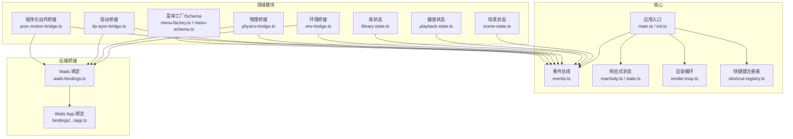
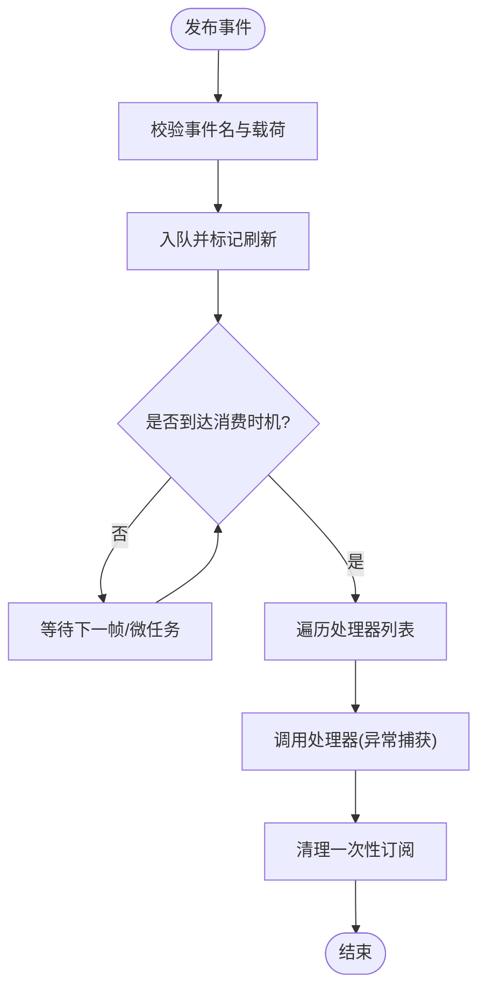
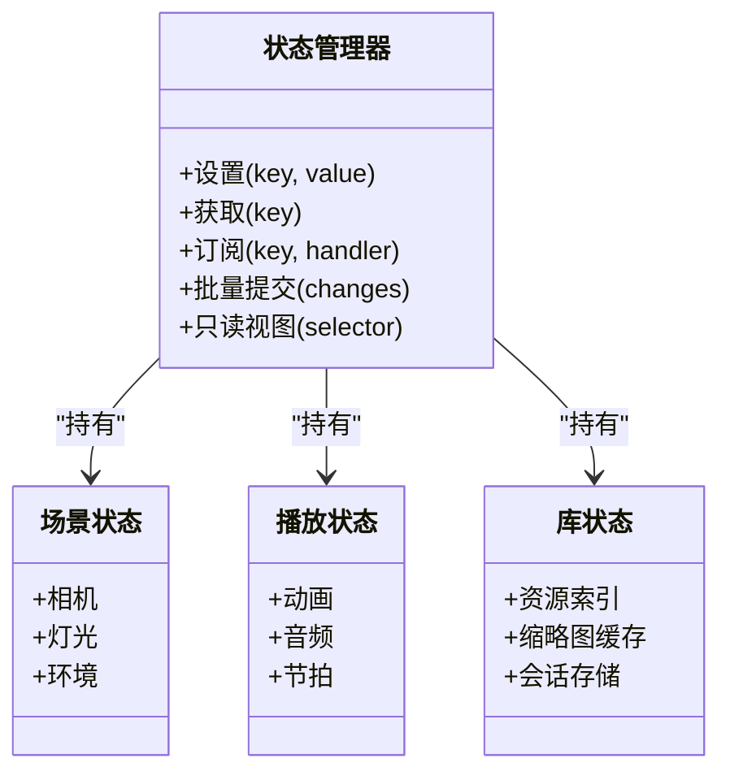
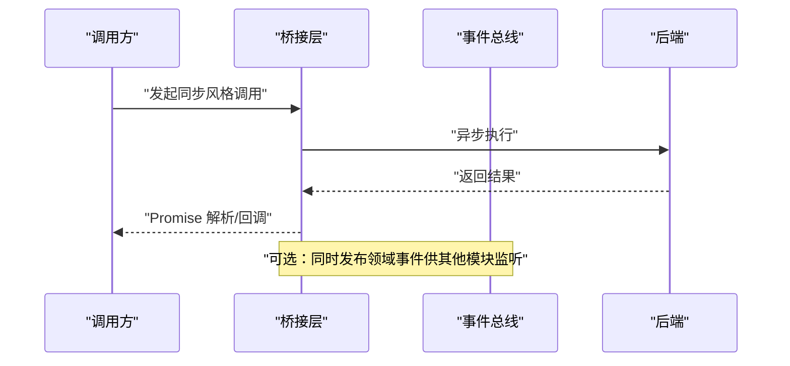
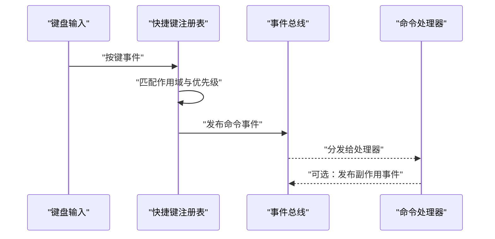
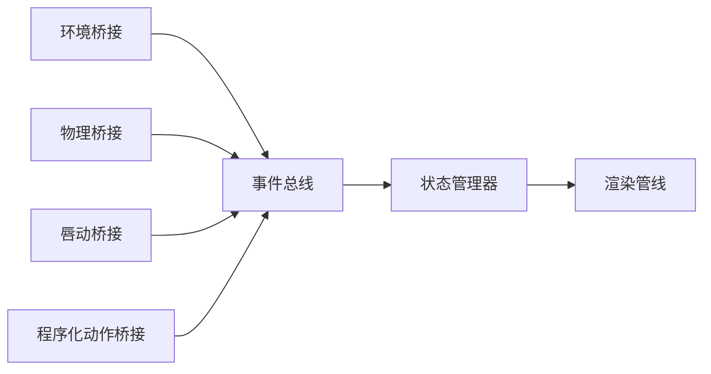
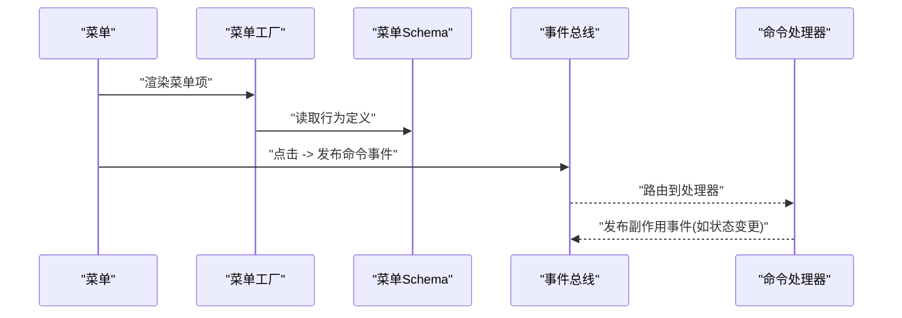
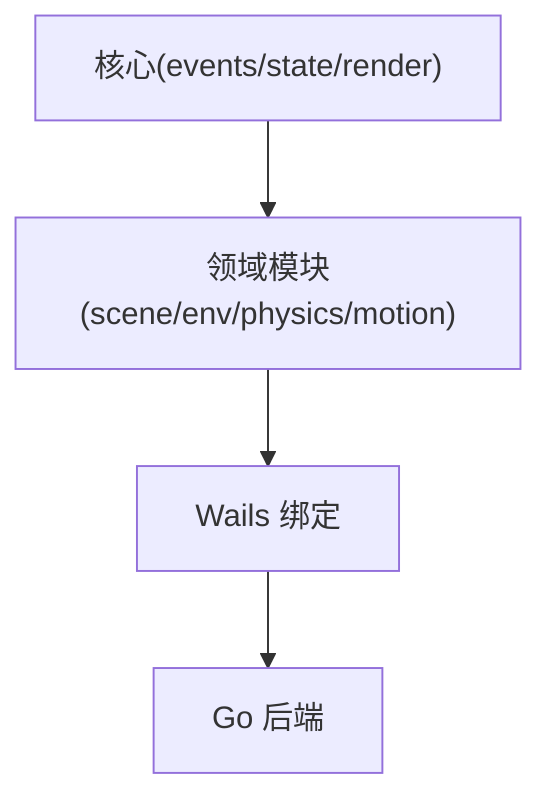

# 模块通信机制

<cite>
**本文引用的文件**
- [events.ts](file://frontend/src/core/events.ts)
- [reactivity.ts](file://frontend/src/core/reactivity.ts)
- [state.ts](file://frontend/src/core/state.ts)
- [scene-state.ts](file://frontend/src/core/scene-state.ts)
- [playback-state.ts](file://frontend/src/core/playback-state.ts)
- [library-state.ts](file://frontend/src/core/library-state.ts)
- [env-state-schema.ts](file://frontend/src/core/env-state-schema.ts)
- [audio-bus.ts](file://frontend/src/core/audio-bus.ts)
- [shortcut-registry.ts](file://frontend/src/core/shortcut-registry.ts)
- [shortcut-app.ts](file://frontend/src/core/shortcut-app.ts)
- [render-loop.ts](file://frontend/src/core/render-loop.ts)
- [main.ts](file://frontend/src/core/main.ts)
- [init.ts](file://frontend/src/core/init.ts)
- [wails-bindings.ts](file://frontend/src/core/wails-bindings.ts)
- [app.ts](file://frontend/bindings/mikumikuar/internal/app/app.ts)
- [index.ts](file://frontend/bindings/mikumikuar/internal/app/index.ts)
- [models.ts](file://frontend/bindings/mikumikuar/internal/app/models.ts)
- [eventcreate.ts](file://frontend/bindings/github.com/wailsapp/wails/v3/internal/eventcreate.ts)
- [env-bridge.ts](file://frontend/src/scene/env/env-bridge.ts)
- [physics-bridge.ts](file://frontend/src/physics/physics-bridge.ts)
- [lip-sync-bridge.ts](file://frontend/src/scene/env/lip-sync-bridge.ts)
- [proc-motion-bridge.ts](file://frontend/src/scene/env/proc-motion-bridge.ts)
- [menu-factory.ts](file://frontend/src/menus/menu-factory.ts)
- [menu-schema.ts](file://frontend/src/menus/menu-schema.ts)
- [config.ts](file://frontend/src/config.ts)
- [load-manager.ts](file://frontend/src/core/load-manager.ts)
</cite>

## 目录
1. [简介](#简介)
2. [项目结构](#项目结构)
3. [核心组件](#核心组件)
4. [架构总览](#架构总览)
5. [详细组件分析](#详细组件分析)
6. [依赖关系分析](#依赖关系分析)
7. [性能考虑](#性能考虑)
8. [故障排查指南](#故障排查指南)
9. [结论](#结论)
10. [附录](#附录)

## 简介
本文件聚焦于前端模块间的通信机制，围绕事件总线、状态同步与消息传递三大主题展开。目标是帮助读者理解：
- 事件如何定义、发布、订阅以及生命周期管理
- 跨模块状态一致性如何保证，数据流如何组织
- 异步消息与同步调用的模式与边界
- 批处理、内存管理与垃圾回收优化策略
- 使用示例、最佳实践与常见问题诊断

## 项目结构
前端采用“核心能力 + 领域模块”的分层组织方式：
- 核心能力位于 core 目录，提供事件总线、响应式状态、渲染循环、快捷键注册等基础设施
- 场景与环境、物理、动作、菜单等模块通过事件与状态进行解耦协作
- 与 Wails 后端的桥接通过 bindings 与 wails-bindings 完成



图表来源
- [events.ts:1-200](file://frontend/src/core/events.ts#L1-L200)
- [reactivity.ts:1-200](file://frontend/src/core/reactivity.ts#L1-L200)
- [state.ts:1-200](file://frontend/src/core/state.ts#L1-L200)
- [render-loop.ts:1-200](file://frontend/src/core/render-loop.ts#L1-L200)
- [shortcut-registry.ts:1-200](file://frontend/src/core/shortcut-registry.ts#L1-L200)
- [main.ts:1-200](file://frontend/src/core/main.ts#L1-L200)
- [init.ts:1-200](file://frontend/src/core/init.ts#L1-L200)
- [scene-state.ts:1-200](file://frontend/src/core/scene-state.ts#L1-L200)
- [playback-state.ts:1-200](file://frontend/src/core/playback-state.ts#L1-L200)
- [library-state.ts:1-200](file://frontend/src/core/library-state.ts#L1-L200)
- [env-bridge.ts:1-200](file://frontend/src/scene/env/env-bridge.ts#L1-L200)
- [physics-bridge.ts:1-200](file://frontend/src/physics/physics-bridge.ts#L1-L200)
- [lip-sync-bridge.ts:1-200](file://frontend/src/scene/env/lip-sync-bridge.ts#L1-L200)
- [proc-motion-bridge.ts:1-200](file://frontend/src/scene/env/proc-motion-bridge.ts#L1-L200)
- [menu-factory.ts:1-200](file://frontend/src/menus/menu-factory.ts#L1-L200)
- [menu-schema.ts:1-200](file://frontend/src/menus/menu-schema.ts#L1-L200)
- [wails-bindings.ts:1-200](file://frontend/src/core/wails-bindings.ts#L1-L200)
- [app.ts:1-200](file://frontend/bindings/mikumikuar/internal/app/app.ts#L1-L200)

章节来源
- [main.ts:1-200](file://frontend/src/core/main.ts#L1-L200)
- [init.ts:1-200](file://frontend/src/core/init.ts#L1-L200)

## 核心组件
本节概述支撑模块通信的关键设施及其职责。

- 事件总线
  - 负责事件的定义、发布、订阅、去重与生命周期管理（一次性订阅、批量订阅、按命名空间隔离）
  - 提供调试钩子与统计信息，便于定位热点事件与泄漏
  - 支持在渲染帧或微任务阶段合并高频事件，降低抖动

- 响应式状态与状态快照
  - 基于观察者模式的轻量级响应式系统，用于细粒度更新与批量通知
  - 状态分层：全局配置、场景状态、播放状态、库状态等
  - 提供只读视图与变更追踪，避免不必要的重计算

- 渲染循环与调度
  - 统一帧驱动，将事件消费、状态同步、UI 更新与渲染编排到同一时间片
  - 支持节流与批处理，确保高负载下稳定帧率

- 快捷键与命令分发
  - 集中注册与优先级解析，避免多模块重复注册导致的覆盖问题
  - 将按键事件转换为领域命令，再通过事件总线广播

- 后端桥接
  - 封装 Wails 调用，提供类型安全的 API 访问
  - 对 I/O、文件系统、窗口与平台能力进行统一抽象

章节来源
- [events.ts:1-200](file://frontend/src/core/events.ts#L1-L200)
- [reactivity.ts:1-200](file://frontend/src/core/reactivity.ts#L1-L200)
- [state.ts:1-200](file://frontend/src/core/state.ts#L1-L200)
- [render-loop.ts:1-200](file://frontend/src/core/render-loop.ts#L1-L200)
- [shortcut-registry.ts:1-200](file://frontend/src/core/shortcut-registry.ts#L1-L200)
- [wails-bindings.ts:1-200](file://frontend/src/core/wails-bindings.ts#L1-L200)

## 架构总览
下图展示模块间通信的整体路径：输入与外部事件进入事件总线；状态变更通过响应式系统传播；渲染循环协调消费与绘制；与后端的交互通过桥接层完成。

```mermaid
sequenceDiagram
participant UI as "界面/输入"
participant Bus as "事件总线"
participant State as "响应式状态"
participant Loop as "渲染循环"
participant Bridge as "后端桥接"
participant Backend as "Go/Wails 后端"
UI->>Bus : "发布用户操作事件"
Bus-->>State : "触发状态变更"
State-->>Loop : "标记脏区域/批量回调"
Loop->>Bridge : "按需发起同步/异步请求"
Bridge->>Backend : "调用平台能力"
Backend-->>Bridge : "返回结果/流式事件"
Bridge-->>Bus : "转发为领域事件"
Bus-->>State : "更新状态"
Loop-->>UI : "驱动视图更新"
```

图表来源
- [events.ts:1-200](file://frontend/src/core/events.ts#L1-L200)
- [reactivity.ts:1-200](file://frontend/src/core/reactivity.ts#L1-L200)
- [render-loop.ts:1-200](file://frontend/src/core/render-loop.ts#L1-L200)
- [wails-bindings.ts:1-200](file://frontend/src/core/wails-bindings.ts#L1-L200)
- [app.ts:1-200](file://frontend/bindings/mikumikuar/internal/app/app.ts#L1-L200)

## 详细组件分析

### 事件总线系统
- 设计要点
  - 事件命名空间：以模块域为前缀，避免冲突
  - 订阅模型：支持一次性订阅、多次订阅、按条件过滤
  - 生命周期：订阅句柄可取消；事件处理器异常被捕获并上报，不影响其他处理器
  - 批处理：高频事件在帧末合并，减少抖动与重复计算
- 关键流程
  - 发布：校验事件名与载荷，入队并标记需要刷新
  - 订阅：注册处理器，维护引用以便清理
  - 消费：在渲染循环或微任务中遍历队列，调用处理器并处理异常
- 调试与观测
  - 暴露统计接口：事件计数、订阅数、耗时分布
  - 开发模式下输出事件轨迹，辅助定位死锁与长任务



图表来源
- [events.ts:1-200](file://frontend/src/core/events.ts#L1-L200)
- [render-loop.ts:1-200](file://frontend/src/core/render-loop.ts#L1-L200)

章节来源
- [events.ts:1-200](file://frontend/src/core/events.ts#L1-L200)
- [render-loop.ts:1-200](file://frontend/src/core/render-loop.ts#L1-L200)

### 状态同步机制
- 状态分层
  - 全局配置：应用启动加载，变更时广播
  - 场景状态：相机、灯光、材质、环境等
  - 播放状态：动画、音频、节拍等
  - 库状态：资源索引、缩略图缓存、会话存储
- 一致性保障
  - 单一事实源：每个状态字段仅由一个模块写入
  - 变更溯源：记录变更来源与时间戳，便于回放与撤销
  - 批量提交：将多次小变更合并为一次提交，减少通知风暴
- 数据流管理
  - 写路径：业务逻辑 -> 状态对象 -> 响应式通知 -> 订阅者
  - 读路径：只读视图/选择器，避免直接读取中间态



图表来源
- [state.ts:1-200](file://frontend/src/core/state.ts#L1-L200)
- [scene-state.ts:1-200](file://frontend/src/core/scene-state.ts#L1-L200)
- [playback-state.ts:1-200](file://frontend/src/core/playback-state.ts#L1-L200)
- [library-state.ts:1-200](file://frontend/src/core/library-state.ts#L1-L200)
- [reactivity.ts:1-200](file://frontend/src/core/reactivity.ts#L1-L200)

章节来源
- [state.ts:1-200](file://frontend/src/core/state.ts#L1-L200)
- [scene-state.ts:1-200](file://frontend/src/core/scene-state.ts#L1-L200)
- [playback-state.ts:1-200](file://frontend/src/core/playback-state.ts#L1-L200)
- [library-state.ts:1-200](file://frontend/src/core/library-state.ts#L1-L200)
- [reactivity.ts:1-200](file://frontend/src/core/reactivity.ts#L1-L200)

### 消息传递模式
- 异步消息
  - 适用于 I/O、网络、WASM 计算等耗时操作
  - 通过事件总线回传结果，避免阻塞主线程
- 同步调用
  - 通过桥接层封装 Promise/回调，对外暴露同步风格 API
  - 内部仍走异步通道，但调用方无需关心细节
- 典型场景
  - 文件读写、资源下载、截图导出、平台能力调用



图表来源
- [wails-bindings.ts:1-200](file://frontend/src/core/wails-bindings.ts#L1-L200)
- [app.ts:1-200](file://frontend/bindings/mikumikuar/internal/app/app.ts#L1-L200)
- [events.ts:1-200](file://frontend/src/core/events.ts#L1-L200)

章节来源
- [wails-bindings.ts:1-200](file://frontend/src/core/wails-bindings.ts#L1-L200)
- [app.ts:1-200](file://frontend/bindings/mikumikuar/internal/app/app.ts#L1-L200)

### 快捷键与命令分发
- 注册与优先级
  - 集中注册，支持作用域与优先级，避免静默覆盖
- 事件到命令
  - 将键盘事件映射为领域命令，再经事件总线广播
- 冲突检测
  - 启动时扫描重复键位，给出告警与建议



图表来源
- [shortcut-registry.ts:1-200](file://frontend/src/core/shortcut-registry.ts#L1-L200)
- [shortcut-app.ts:1-200](file://frontend/src/core/shortcut-app.ts#L1-L200)
- [events.ts:1-200](file://frontend/src/core/events.ts#L1-L200)

章节来源
- [shortcut-registry.ts:1-200](file://frontend/src/core/shortcut-registry.ts#L1-L200)
- [shortcut-app.ts:1-200](file://frontend/src/core/shortcut-app.ts#L1-L200)

### 环境与物理桥接
- 环境桥接
  - 将环境参数变化转化为事件，驱动渲染管线更新
- 物理桥接
  - 将 WASM 物理结果同步到场景状态，必要时批量化更新骨骼矩阵
- 唇动与程序化动作
  - 将算法输出作为事件注入播放状态，驱动动画混合



图表来源
- [env-bridge.ts:1-200](file://frontend/src/scene/env/env-bridge.ts#L1-L200)
- [physics-bridge.ts:1-200](file://frontend/src/physics/physics-bridge.ts#L1-L200)
- [lip-sync-bridge.ts:1-200](file://frontend/src/scene/env/lip-sync-bridge.ts#L1-L200)
- [proc-motion-bridge.ts:1-200](file://frontend/src/scene/env/proc-motion-bridge.ts#L1-L200)
- [events.ts:1-200](file://frontend/src/core/events.ts#L1-L200)
- [state.ts:1-200](file://frontend/src/core/state.ts#L1-L200)

章节来源
- [env-bridge.ts:1-200](file://frontend/src/scene/env/env-bridge.ts#L1-L200)
- [physics-bridge.ts:1-200](file://frontend/src/physics/physics-bridge.ts#L1-L200)
- [lip-sync-bridge.ts:1-200](file://frontend/src/scene/env/lip-sync-bridge.ts#L1-L200)
- [proc-motion-bridge.ts:1-200](file://frontend/src/scene/env/proc-motion-bridge.ts#L1-L200)

### 菜单与命令集成
- 菜单工厂根据 Schema 生成 UI，并将用户操作转换为命令事件
- 命令经快捷键注册表与事件总线分发至对应处理器



图表来源
- [menu-factory.ts:1-200](file://frontend/src/menus/menu-factory.ts#L1-L200)
- [menu-schema.ts:1-200](file://frontend/src/menus/menu-schema.ts#L1-L200)
- [events.ts:1-200](file://frontend/src/core/events.ts#L1-L200)

章节来源
- [menu-factory.ts:1-200](file://frontend/src/menus/menu-factory.ts#L1-L200)
- [menu-schema.ts:1-200](file://frontend/src/menus/menu-schema.ts#L1-L200)

## 依赖关系分析
- 松耦合
  - 模块通过事件与状态交互，不直接互相引用，降低耦合度
- 内聚性
  - 每个模块专注自身职责，状态与事件边界清晰
- 外部依赖
  - Wails 绑定提供平台能力，需关注错误传播与超时处理



图表来源
- [events.ts:1-200](file://frontend/src/core/events.ts#L1-L200)
- [state.ts:1-200](file://frontend/src/core/state.ts#L1-L200)
- [render-loop.ts:1-200](file://frontend/src/core/render-loop.ts#L1-L200)
- [wails-bindings.ts:1-200](file://frontend/src/core/wails-bindings.ts#L1-L200)
- [app.ts:1-200](file://frontend/bindings/mikumikuar/internal/app/app.ts#L1-L200)

章节来源
- [events.ts:1-200](file://frontend/src/core/events.ts#L1-L200)
- [state.ts:1-200](file://frontend/src/core/state.ts#L1-L200)
- [render-loop.ts:1-200](file://frontend/src/core/render-loop.ts#L1-L200)
- [wails-bindings.ts:1-200](file://frontend/src/core/wails-bindings.ts#L1-L200)

## 性能考虑
- 事件批处理
  - 高频事件在帧末合并，避免频繁触发处理器
  - 使用增量更新与脏标记，减少无用计算
- 内存管理
  - 及时取消订阅，避免闭包引用导致泄漏
  - 大对象池化复用，减少 GC 压力
- 渲染优化
  - 将非视觉更新延迟到空闲时段
  - 控制状态变更的粒度，避免整树重算
- 后端调用
  - 合并请求、限制并发、合理超时与重试
  - 对大数据采用流式传输与分页

[本节为通用指导，不直接分析具体文件]

## 故障排查指南
- 事件未触发
  - 检查事件命名空间与订阅是否在同一作用域
  - 确认订阅未被提前取消
- 状态不同步
  - 核查是否存在多处写入同一字段
  - 查看批量提交是否正确合并变更
- 卡顿与掉帧
  - 定位热点事件与长耗时处理器
  - 启用批处理与节流，拆分大任务
- 快捷键冲突
  - 使用注册表的冲突检测功能，调整优先级与作用域
- 后端调用失败
  - 检查桥接层的错误码与日志
  - 验证权限与路径，确认超时与重试策略

章节来源
- [events.ts:1-200](file://frontend/src/core/events.ts#L1-L200)
- [state.ts:1-200](file://frontend/src/core/state.ts#L1-L200)
- [shortcut-registry.ts:1-200](file://frontend/src/core/shortcut-registry.ts#L1-L200)
- [wails-bindings.ts:1-200](file://frontend/src/core/wails-bindings.ts#L1-L200)

## 结论
通过事件总线、响应式状态与渲染循环的协同，模块间实现了低耦合、高内聚的通信机制。结合批处理、内存管理与后端桥接优化，可在复杂场景中保持稳定的性能与良好的可维护性。建议在新模块接入时遵循命名规范、单一事实源与批处理原则，并在开发模式开启事件与状态追踪，以便快速定位问题。

## 附录
- 使用示例与最佳实践
  - 事件命名：以模块域为前缀，动词+名词形式
  - 订阅清理：在模块销毁时主动取消订阅
  - 状态变更：尽量批量提交，避免逐条广播
  - 后端调用：封装为 Promise，统一错误处理与重试
- 参考实现位置
  - 事件总线与渲染循环：见 events.ts 与 render-loop.ts
  - 状态与响应式：见 state.ts 与 reactivity.ts
  - 快捷键与命令：见 shortcut-registry.ts 与 shortcut-app.ts
  - 桥接与后端：见 wails-bindings.ts 与 app.ts