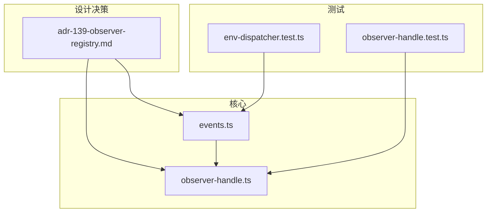
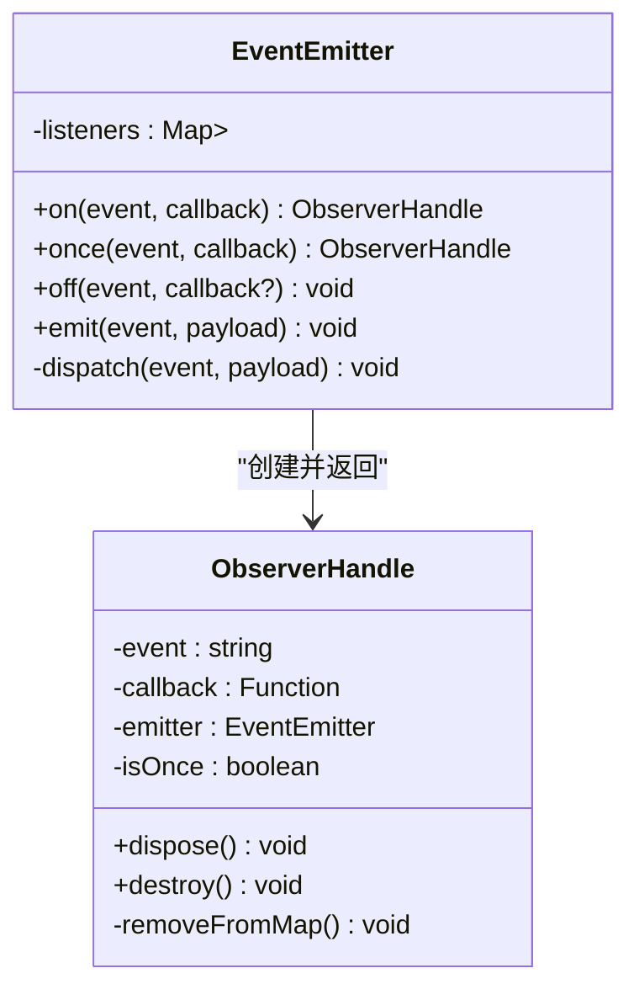
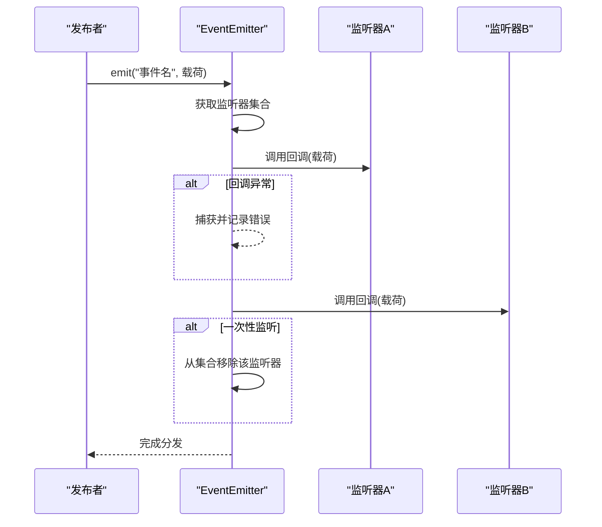
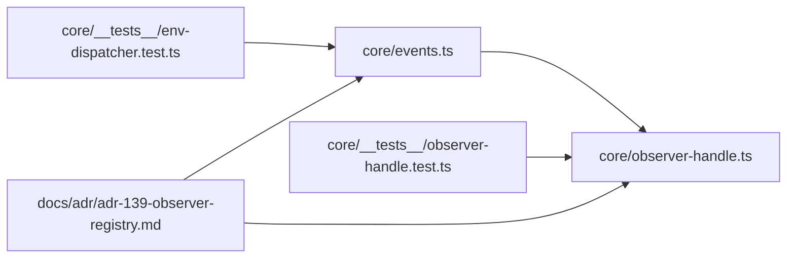

# 事件系统架构

<cite>
**本文引用的文件**   
- [events.ts](file://frontend/src/core/events.ts)
- [observer-handle.ts](file://frontend/src/core/observer-handle.ts)
- [env-dispatcher.test.ts](file://frontend/src/core/__tests__/env-dispatcher.test.ts)
- [observer-handle.test.ts](file://frontend/src/core/__tests__/observer-handle.test.ts)
- [ADR-139-observer-registry.md](file://docs/adr/adr-139-observer-registry.md)
</cite>

## 目录
1. [简介](#简介)
2. [项目结构](#项目结构)
3. [核心组件](#核心组件)
4. [架构总览](#架构总览)
5. [详细组件分析](#详细组件分析)
6. [依赖分析](#依赖分析)
7. [性能考虑](#性能考虑)
8. [故障排查指南](#故障排查指南)
9. [结论](#结论)
10. [附录](#附录)

## 简介
本文件聚焦 MikuMikuAR 前端的事件系统，围绕观察者模式在事件发布/订阅机制中的实现进行系统化说明。文档涵盖：
- 事件类型定义与注册管理
- EventEmitter 类的设计与回调处理机制
- 事件生命周期（创建、分发、销毁）
- 跨组件状态变更通知的使用示例
- 性能优化策略（去重、批量处理、内存泄漏防护）
- 错误处理与调试方法

## 项目结构
事件系统位于前端核心模块中，主要文件如下：
- 事件核心：events.ts
- 观察者句柄：observer-handle.ts
- 单元测试：core/__tests__ 下的 env-dispatcher.test.ts、observer-handle.test.ts
- 设计决策：docs/adr/adr-139-observer-registry.md

图表来源
- [events.ts](file://frontend/src/core/events.ts)
- [observer-handle.ts](file://frontend/src/core/observer-handle.ts)
- [env-dispatcher.test.ts](file://frontend/src/core/__tests__/env-dispatcher.test.ts)
- [observer-handle.test.ts](file://frontend/src/core/__tests__/observer-handle.test.ts)
- [ADR-139-observer-registry.md](file://docs/adr/adr-139-observer-registry.md)

章节来源
- [events.ts](file://frontend/src/core/events.ts)
- [observer-handle.ts](file://frontend/src/core/observer-handle.ts)
- [env-dispatcher.test.ts](file://frontend/src/core/__tests__/env-dispatcher.test.ts)
- [observer-handle.test.ts](file://frontend/src/core/__tests__/observer-handle.test.ts)
- [ADR-139-observer-registry.md](file://docs/adr/adr-139-observer-registry.md)

## 核心组件
- 事件总线（EventEmitter）：提供 on/off/emit 等能力，维护事件名到监听器集合的映射，负责回调调度与异常隔离。
- 观察者句柄（ObserverHandle）：封装订阅返回的句柄，支持一次性监听、条件过滤、自动取消订阅与资源清理。
- 事件类型与常量：集中定义事件命名空间与语义，便于统一管理与检索。
- 测试用例：覆盖典型场景（重复订阅、一次性监听、异常回调、批量分发等），验证健壮性与边界行为。

章节来源
- [events.ts](file://frontend/src/core/events.ts)
- [observer-handle.ts](file://frontend/src/core/observer-handle.ts)
- [env-dispatcher.test.ts](file://frontend/src/core/__tests__/env-dispatcher.test.ts)
- [observer-handle.test.ts](file://frontend/src/core/__tests__/observer-handle.test.ts)

## 架构总览
事件系统采用轻量级观察者模式，遵循“发布-订阅”契约：
- 发布者通过事件名广播消息
- 订阅者通过事件名注册回调
- 句柄对象统一管理订阅生命周期，避免悬挂引用

图表来源
- [events.ts](file://frontend/src/core/events.ts)
- [observer-handle.ts](file://frontend/src/core/observer-handle.ts)

## 详细组件分析

### EventEmitter 类
职责与特性：
- 维护事件名到回调集合的映射，保证同一事件可被多个监听器订阅
- 提供 on/once/off/emit 接口，分别用于常规订阅、一次性订阅、取消订阅与事件分发
- 分发阶段对回调执行进行异常隔离，确保单个监听器失败不影响其他监听器
- 内部派发流程支持批量处理与可选的去重策略（由上层或配置决定）

关键流程（分发时序）：

图表来源
- [events.ts](file://frontend/src/core/events.ts)

章节来源
- [events.ts](file://frontend/src/core/events.ts)

### ObserverHandle 句柄
职责与特性：
- 封装一次订阅的上下文，暴露 dispose/destroy 以安全取消订阅
- 支持一次性监听：在回调执行后自动从事件映射中移除自身
- 提供条件过滤与延迟销毁能力，便于组合复杂订阅逻辑
- 内部维护对 EventEmitter 的弱引用关系，避免循环引用导致的内存泄漏

使用要点：
- 组件销毁时应主动调用 dispose/destroy，确保从事件映射中移除
- 对于一次性监听，无需手动取消；但建议在组件卸载时显式释放句柄，避免残留引用

章节来源
- [observer-handle.ts](file://frontend/src/core/observer-handle.ts)
- [observer-handle.test.ts](file://frontend/src/core/__tests__/observer-handle.test.ts)

### 事件类型与命名规范
建议：
- 使用命名空间前缀区分领域（如 scene、motion、ui）
- 事件名采用小写连字符风格，语义清晰且稳定
- 将常用事件集中定义，避免硬编码字符串散落各处

章节来源
- [events.ts](file://frontend/src/core/events.ts)
- [ADR-139-observer-registry.md](file://docs/adr/adr-139-observer-registry.md)

### 事件生命周期
- 创建：通过 on/once 注册监听器，返回 ObserverHandle
- 分发：emit 触发所有已注册的监听器，按插入顺序执行
- 销毁：
  - 一次性监听：回调执行后自动移除
  - 常规监听：通过 off 或句柄 dispose/destroy 移除
  - 组件卸载：应遍历并释放所有相关句柄，防止悬挂引用

章节来源
- [events.ts](file://frontend/src/core/events.ts)
- [observer-handle.ts](file://frontend/src/core/observer-handle.ts)

### 使用示例：跨组件状态变更通知
场景：UI 面板监听模型加载状态变化，更新界面元素
- 发布者：模型管理器在加载完成后 emit("model.loaded", payload)
- 订阅者：UI 面板 on("model.loaded", handler)，渲染详情面板
- 生命周期：面板销毁时调用句柄.dispose()，避免无效回调

章节来源
- [env-dispatcher.test.ts](file://frontend/src/core/__tests__/env-dispatcher.test.ts)
- [observer-handle.test.ts](file://frontend/src/core/__tests__/observer-handle.test.ts)

## 依赖分析
- 低耦合：事件系统仅依赖基础数据结构与工具函数，不直接耦合业务模块
- 内聚性：事件分发与句柄管理集中在 core 层，便于统一治理
- 外部集成点：各子系统通过事件名约定进行通信，降低模块间直接依赖

图表来源
- [events.ts](file://frontend/src/core/events.ts)
- [observer-handle.ts](file://frontend/src/core/observer-handle.ts)
- [env-dispatcher.test.ts](file://frontend/src/core/__tests__/env-dispatcher.test.ts)
- [observer-handle.test.ts](file://frontend/src/core/__tests__/observer-handle.test.ts)
- [ADR-139-observer-registry.md](file://docs/adr/adr-139-observer-registry.md)

章节来源
- [events.ts](file://frontend/src/core/events.ts)
- [observer-handle.ts](file://frontend/src/core/observer-handle.ts)
- [env-dispatcher.test.ts](file://frontend/src/core/__tests__/env-dispatcher.test.ts)
- [observer-handle.test.ts](file://frontend/src/core/__tests__/observer-handle.test.ts)
- [ADR-139-observer-registry.md](file://docs/adr/adr-139-observer-registry.md)

## 性能考虑
- 事件去重：对同一监听器的重复订阅进行识别与合并，减少回调集合膨胀
- 批量处理：在高频事件场景下，可将多次 emit 合并为批次，降低调度开销
- 内存泄漏防护：
  - 强制要求组件在卸载时调用句柄.dispose()/destroy()
  - 一次性监听自动移除，但仍建议显式释放句柄
  - 避免在监听器中持有强引用导致 GC 无法回收
- 异常隔离：单个监听器抛错不应影响其他监听器执行，必要时记录错误上下文

章节来源
- [events.ts](file://frontend/src/core/events.ts)
- [observer-handle.ts](file://frontend/src/core/observer-handle.ts)
- [env-dispatcher.test.ts](file://frontend/src/core/__tests__/env-dispatcher.test.ts)
- [observer-handle.test.ts](file://frontend/src/core/__tests__/observer-handle.test.ts)

## 故障排查指南
常见问题与定位步骤：
- 监听器未触发
  - 检查事件名是否一致，是否存在拼写差异
  - 确认订阅是否在 emit 之前完成
  - 查看是否有 off/dispose 提前取消
- 监听器重复执行
  - 检查是否重复 on 同一回调而未去重
  - 确认组件是否多次初始化导致重复注册
- 内存占用持续增长
  - 核查组件销毁路径是否调用句柄.dispose()/destroy()
  - 监听器是否持有大对象或 DOM 引用
- 回调异常导致后续监听器中断
  - 确认事件分发是否具备异常隔离
  - 在监听器内部增加 try/catch 并记录日志

调试技巧：
- 在 emit 前后打印事件名与载荷摘要，辅助追踪数据流
- 为监听器添加唯一标识，便于统计执行次数与耗时
- 利用单元测试复现问题，快速回归验证修复效果

章节来源
- [env-dispatcher.test.ts](file://frontend/src/core/__tests__/env-dispatcher.test.ts)
- [observer-handle.test.ts](file://frontend/src/core/__tests__/observer-handle.test.ts)

## 结论
MikuMikuAR 的前端事件系统以轻量观察者模式为核心，通过 EventEmitter 与 ObserverHandle 的组合，实现了高内聚、低耦合的发布-订阅机制。配合完善的测试与设计决策文档，系统在易用性、健壮性与可维护性方面达到良好平衡。在生产环境中，建议严格遵循生命周期管理规范，结合去重与批量策略，以获得更优的性能表现。

## 附录
- 设计决策参考：[ADR-139-observer-registry.md](file://docs/adr/adr-139-observer-registry.md)
- 核心实现参考：
  - [events.ts](file://frontend/src/core/events.ts)
  - [observer-handle.ts](file://frontend/src/core/observer-handle.ts)
- 测试用例参考：
  - [env-dispatcher.test.ts](file://frontend/src/core/__tests__/env-dispatcher.test.ts)
  - [observer-handle.test.ts](file://frontend/src/core/__tests__/observer-handle.test.ts)