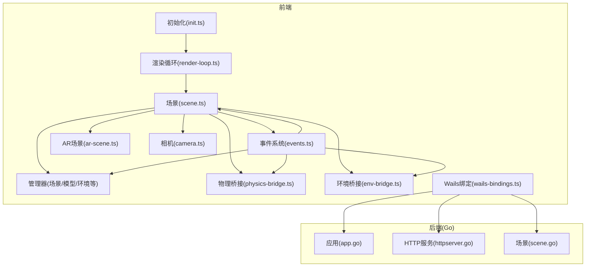
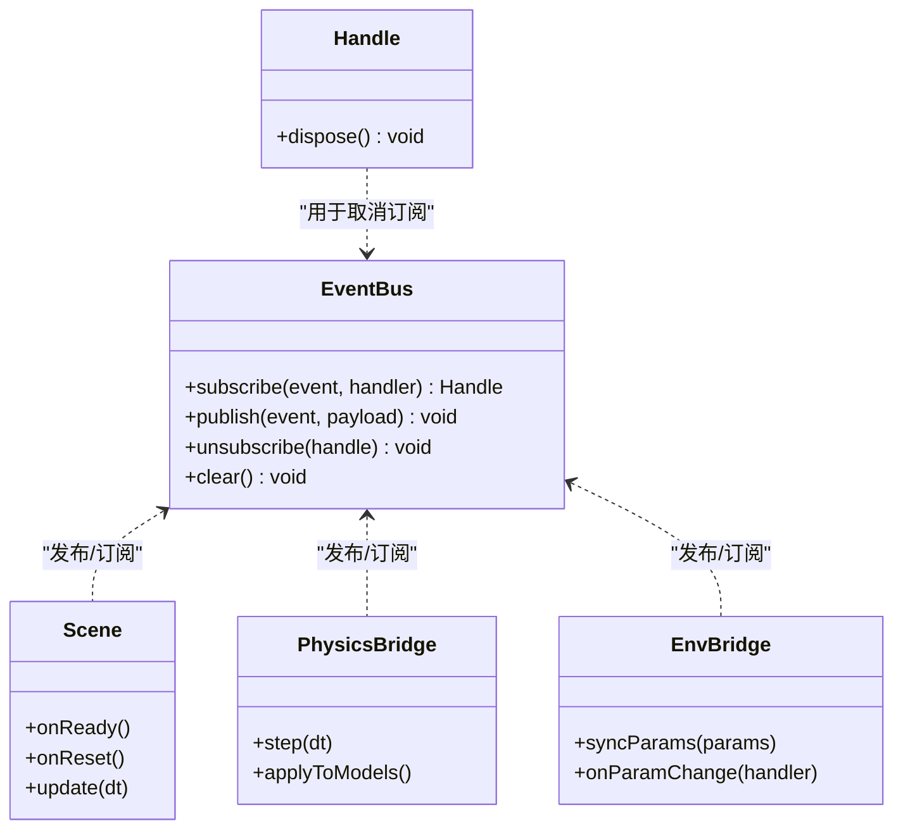
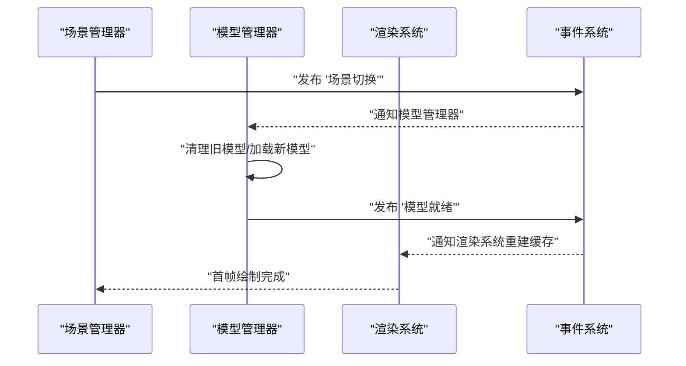
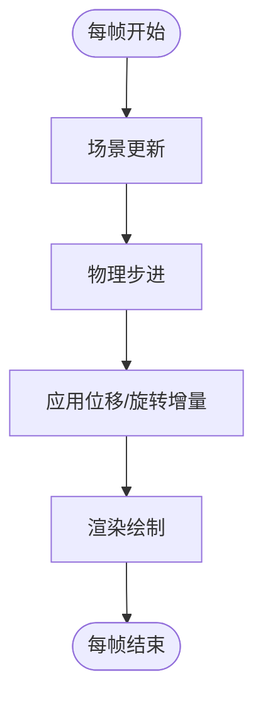
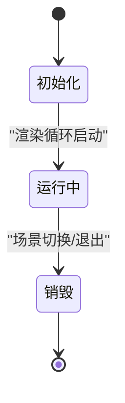
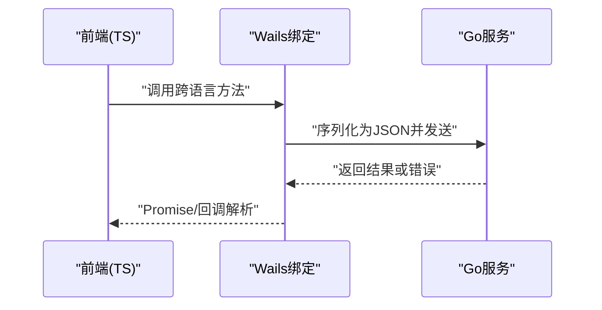
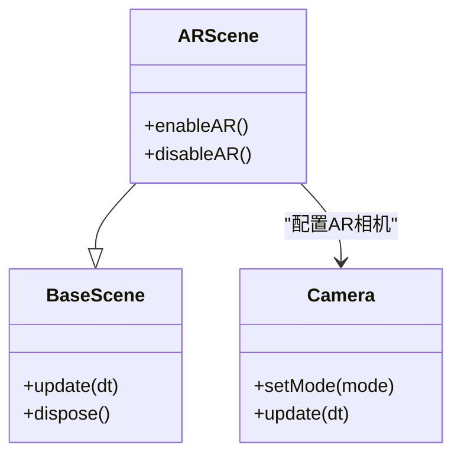
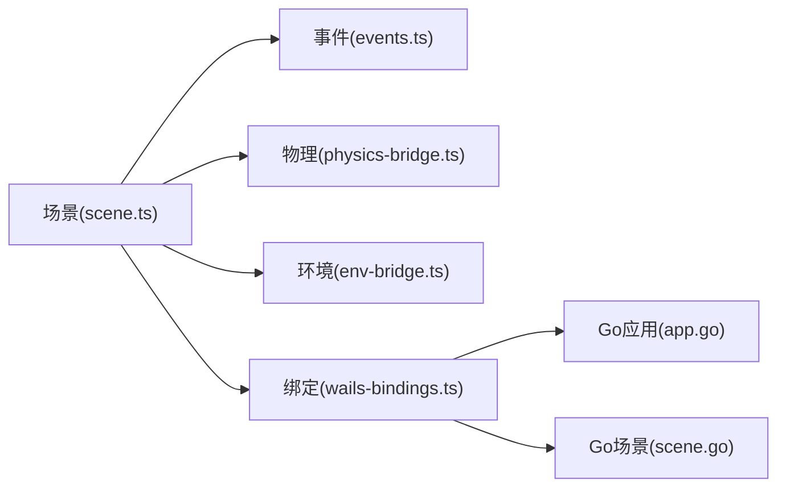

# 组件交互模式

<cite>
**本文引用的文件**   
- [main.go](file://main.go)
- [app.go](file://internal/app/app.go)
- [httpserver.go](file://internal/app/httpserver.go)
- [scene.go](file://internal/app/scene.go)
- [events.ts](file://frontend/src/core/events.ts)
- [observer-handle.ts](file://frontend/src/core/observer-handle.ts)
- [render-loop.ts](file://frontend/src/core/render-loop.ts)
- [init.ts](file://frontend/src/core/init.ts)
- [scene.ts](file://frontend/src/scene/scene.ts)
- [manager/index.ts](file://frontend/src/scene/manager/index.ts)
- [physics-bridge.ts](file://frontend/src/physics/physics-bridge.ts)
- [wind-physics.ts](file://frontend/src/physics/wind-physics.ts)
- [env-bridge.ts](file://frontend/src/scene/env/env-bridge.ts)
- [ar-scene.ts](file://frontend/src/scene/ar/ar-scene.ts)
- [camera.ts](file://frontend/src/scene/camera/camera.ts)
- [wails-bindings.ts](file://frontend/src/core/wails-bindings.ts)
</cite>

## 目录
1. [简介](#简介)
2. [项目结构](#项目结构)
3. [核心组件](#核心组件)
4. [架构总览](#架构总览)
5. [详细组件分析](#详细组件分析)
6. [依赖关系分析](#依赖关系分析)
7. [性能考量](#性能考量)
8. [故障排查指南](#故障排查指南)
9. [结论](#结论)
10. [附录](#附录)

## 简介
本文件聚焦 MikuMikuAR 的“组件交互模式”，围绕以下目标展开：
- 场景管理器与模型管理器的协作方式
- 物理引擎与渲染系统的交互路径
- 观察者模式在事件系统中的实现（发布/订阅）
- 组件生命周期管理（初始化、更新、销毁）的协调机制
- 跨语言通信（JavaScript/TypeScript 与 Go、WebAssembly）的数据交换
- 组件解耦最佳实践，避免循环依赖与紧耦合

## 项目结构
前端采用 TypeScript + Babylon.js 生态，后端使用 Go（Wails v3），并通过 Wails 绑定进行跨进程通信。核心交互集中在以下模块：
- 应用启动与资源加载：init.ts、render-loop.ts
- 场景编排：scene.ts、manager/*
- 事件系统：events.ts、observer-handle.ts
- 物理与环境：physics-bridge.ts、wind-physics.ts、env-bridge.ts
- AR 相机与场景：ar-scene.ts、camera.ts
- 跨语言绑定：wails-bindings.ts、Go 侧 app.go、httpserver.go、scene.go



图表来源
- [init.ts](file://frontend/src/core/init.ts)
- [render-loop.ts](file://frontend/src/core/render-loop.ts)
- [scene.ts](file://frontend/src/scene/scene.ts)
- [manager/index.ts](file://frontend/src/scene/manager/index.ts)
- [events.ts](file://frontend/src/core/events.ts)
- [physics-bridge.ts](file://frontend/src/physics/physics-bridge.ts)
- [env-bridge.ts](file://frontend/src/scene/env/env-bridge.ts)
- [ar-scene.ts](file://frontend/src/scene/ar/ar-scene.ts)
- [camera.ts](file://frontend/src/scene/camera/camera.ts)
- [wails-bindings.ts](file://frontend/src/core/wails-bindings.ts)
- [app.go](file://internal/app/app.go)
- [httpserver.go](file://internal/app/httpserver.go)
- [scene.go](file://internal/app/scene.go)

章节来源
- [init.ts](file://frontend/src/core/init.ts)
- [render-loop.ts](file://frontend/src/core/render-loop.ts)
- [scene.ts](file://frontend/src/scene/scene.ts)
- [manager/index.ts](file://frontend/src/scene/manager/index.ts)
- [events.ts](file://frontend/src/core/events.ts)
- [physics-bridge.ts](file://frontend/src/physics/physics-bridge.ts)
- [env-bridge.ts](file://frontend/src/scene/env/env-bridge.ts)
- [ar-scene.ts](file://frontend/src/scene/ar/ar-scene.ts)
- [camera.ts](file://frontend/src/scene/camera/camera.ts)
- [wails-bindings.ts](file://frontend/src/core/wails-bindings.ts)
- [app.go](file://internal/app/app.go)
- [httpserver.go](file://internal/app/httpserver.go)
- [scene.go](file://internal/app/scene.go)

## 核心组件
- 场景管理器（Scene Manager）
  - 职责：组织场景图、调度子管理器（模型、环境、动作、相机等）、统一生命周期钩子、对外暴露事件总线。
  - 关键交互：通过事件系统与物理、环境、渲染子系统解耦；在每帧更新中按顺序驱动各子系统。
- 模型管理器（Model Manager）
  - 职责：模型的加载、实例化、材质/纹理管理、骨骼/动画状态维护。
  - 关键交互：监听场景事件（如切换场景、重置、保存/恢复），向渲染管线提供变换矩阵与材质参数。
- 物理引擎（含风场）
  - 职责：软体/布料/毛发等二次运动计算，风场影响，IK/约束求解。
  - 关键交互：从场景获取模型骨架与碰撞体，输出位移/旋转增量，供渲染阶段应用。
- 渲染系统
  - 职责：Babylon 渲染循环、后处理、反射/水面/天空盒等效果。
  - 关键交互：读取模型与环境的最终变换与材质，执行绘制；响应环境变化事件触发重绘或参数更新。
- 事件系统（观察者模式）
  - 职责：定义事件类型、发布/订阅、作用域与优先级、清理订阅句柄。
  - 关键交互：作为松耦合总线，连接 UI、场景、物理、环境、跨语言层。
- 跨语言通信（Wails）
  - 职责：JS/TS 调用 Go 能力（文件系统、平台 API、HTTP 代理、场景预设等）。
  - 关键交互：通过 wails-bindings.ts 暴露的函数，将数据序列化后传递给 Go，并接收回调结果。

章节来源
- [scene.ts](file://frontend/src/scene/scene.ts)
- [manager/index.ts](file://frontend/src/scene/manager/index.ts)
- [physics-bridge.ts](file://frontend/src/physics/physics-bridge.ts)
- [wind-physics.ts](file://frontend/src/physics/wind-physics.ts)
- [env-bridge.ts](file://frontend/src/scene/env/env-bridge.ts)
- [events.ts](file://frontend/src/core/events.ts)
- [observer-handle.ts](file://frontend/src/core/observer-handle.ts)
- [wails-bindings.ts](file://frontend/src/core/wails-bindings.ts)

## 架构总览
下图展示了“场景—物理—环境—渲染—事件—跨语言”的主干交互路径。

```mermaid
sequenceDiagram
participant App as "应用入口(main.go)"
participant Init as "初始化(init.ts)"
participant Loop as "渲染循环(render-loop.ts)"
participant Scene as "场景(scene.ts)"
participant Events as "事件系统(events.ts)"
participant Phys as "物理桥接(physics-bridge.ts)"
participant Env as "环境桥接(env-bridge.ts)"
participant Bind as "Wails绑定(wails-bindings.ts)"
participant GoApp as "Go应用(app.go)"
participant GoScene as "Go场景(scene.go)"
App->>Init : "启动并挂载前端"
Init->>Loop : "创建渲染循环"
Loop->>Scene : "每帧驱动Update()"
Scene->>Events : "发布/订阅场景事件"
Scene->>Phys : "请求物理步进"
Phys-->>Scene : "返回骨骼/网格增量"
Scene->>Env : "同步环境参数"
Env-->>Scene : "环境状态变更事件"
Scene->>Bind : "需要持久化/IO时调用"
Bind->>GoApp : "跨语言方法调用"
GoApp->>GoScene : "场景相关操作"
GoScene-->>GoApp : "返回结果"
GoApp-->>Bind : "回调到前端"
Bind-->>Scene : "异步结果通知"
```

图表来源
- [main.go](file://main.go)
- [init.ts](file://frontend/src/core/init.ts)
- [render-loop.ts](file://frontend/src/core/render-loop.ts)
- [scene.ts](file://frontend/src/scene/scene.ts)
- [events.ts](file://frontend/src/core/events.ts)
- [physics-bridge.ts](file://frontend/src/physics/physics-bridge.ts)
- [env-bridge.ts](file://frontend/src/scene/env/env-bridge.ts)
- [wails-bindings.ts](file://frontend/src/core/wails-bindings.ts)
- [app.go](file://internal/app/app.go)
- [scene.go](file://internal/app/scene.go)

## 详细组件分析

### 事件系统与观察者模式
- 设计要点
  - 事件类型集中定义，支持命名空间与作用域过滤。
  - 订阅返回可释放的句柄，便于在组件销毁时自动取消订阅，防止内存泄漏。
  - 发布端仅关心事件语义，不感知订阅者数量与实现细节。
- 典型流程
  - 组件在初始化时注册订阅，在销毁时释放句柄。
  - 场景在关键节点（加载完成、切换、重置）发布事件，物理/环境/渲染等订阅者据此更新。



图表来源
- [events.ts](file://frontend/src/core/events.ts)
- [observer-handle.ts](file://frontend/src/core/observer-handle.ts)
- [scene.ts](file://frontend/src/scene/scene.ts)
- [physics-bridge.ts](file://frontend/src/physics/physics-bridge.ts)
- [env-bridge.ts](file://frontend/src/scene/env/env-bridge.ts)

章节来源
- [events.ts](file://frontend/src/core/events.ts)
- [observer-handle.ts](file://frontend/src/core/observer-handle.ts)

### 场景管理器与模型管理器协作
- 协作方式
  - 场景管理器负责生命周期与调度，模型管理器专注模型资源与状态。
  - 场景通过事件驱动模型管理器加载/卸载/重置；模型管理器在内部状态变更后发布事件，供 UI/物理/渲染消费。
- 关键路径
  - 场景切换：场景发布“切换开始/结束”事件 → 模型管理器清理旧资源、加载新资源 → 渲染系统重建必要缓存。
  - 播放控制：场景发布“播放/暂停/停止”事件 → 模型管理器更新动画时间线 → 物理引擎根据新姿态计算二次运动。



图表来源
- [scene.ts](file://frontend/src/scene/scene.ts)
- [manager/index.ts](file://frontend/src/scene/manager/index.ts)
- [events.ts](file://frontend/src/core/events.ts)

章节来源
- [scene.ts](file://frontend/src/scene/scene.ts)
- [manager/index.ts](file://frontend/src/scene/manager/index.ts)

### 物理引擎与渲染系统的交互
- 交互时序
  - 渲染循环每帧驱动场景更新 → 场景请求物理步进 → 物理引擎输出骨骼/网格增量 → 渲染系统应用变换并绘制。
- 风场与二次运动
  - 风场参数由环境系统提供，物理桥接将其注入到物理步进中，确保视觉一致性。



图表来源
- [render-loop.ts](file://frontend/src/core/render-loop.ts)
- [scene.ts](file://frontend/src/scene/scene.ts)
- [physics-bridge.ts](file://frontend/src/physics/physics-bridge.ts)
- [wind-physics.ts](file://frontend/src/physics/wind-physics.ts)

章节来源
- [render-loop.ts](file://frontend/src/core/render-loop.ts)
- [scene.ts](file://frontend/src/scene/scene.ts)
- [physics-bridge.ts](file://frontend/src/physics/physics-bridge.ts)
- [wind-physics.ts](file://frontend/src/physics/wind-physics.ts)

### 组件生命周期管理（初始化、更新、销毁）
- 初始化
  - 应用启动 → 初始化渲染循环 → 构建场景与子系统 → 注册事件订阅。
- 更新
  - 渲染循环驱动场景 update(dt)，场景依次调用物理、环境、动画、相机等子系统。
- 销毁
  - 场景销毁时释放所有订阅句柄、清理模型与纹理、关闭后台任务，避免内存泄漏。



图表来源
- [init.ts](file://frontend/src/core/init.ts)
- [render-loop.ts](file://frontend/src/core/render-loop.ts)
- [scene.ts](file://frontend/src/scene/scene.ts)
- [observer-handle.ts](file://frontend/src/core/observer-handle.ts)

章节来源
- [init.ts](file://frontend/src/core/init.ts)
- [render-loop.ts](file://frontend/src/core/render-loop.ts)
- [scene.ts](file://frontend/src/scene/scene.ts)
- [observer-handle.ts](file://frontend/src/core/observer-handle.ts)

### 跨语言通信机制（JavaScript/TypeScript ↔ Go/WASM）
- 调用路径
  - 前端通过 wails-bindings.ts 暴露的方法调用 Go 能力（文件访问、HTTP 代理、场景预设等）。
  - Go 侧通过 app.go、httpserver.go、scene.go 提供服务，并将结果回调至前端。
- 数据交换
  - 结构化数据以 JSON 形式传递；大对象（如纹理/模型）通常通过 URL 或分块传输。
- 错误处理
  - Go 侧错误经 Wails 映射为前端可识别的错误对象，前端统一捕获并提示用户。



图表来源
- [wails-bindings.ts](file://frontend/src/core/wails-bindings.ts)
- [app.go](file://internal/app/app.go)
- [httpserver.go](file://internal/app/httpserver.go)
- [scene.go](file://internal/app/scene.go)

章节来源
- [wails-bindings.ts](file://frontend/src/core/wails-bindings.ts)
- [app.go](file://internal/app/app.go)
- [httpserver.go](file://internal/app/httpserver.go)
- [scene.go](file://internal/app/scene.go)

### AR 相机与场景集成
- AR 场景继承自基础场景，扩展了相机模式、遮挡剔除、地面检测等特性。
- 与相机模块协同：AR 模式下相机行为与输入策略不同，需动态切换控制器。



图表来源
- [ar-scene.ts](file://frontend/src/scene/ar/ar-scene.ts)
- [camera.ts](file://frontend/src/scene/camera/camera.ts)
- [scene.ts](file://frontend/src/scene/scene.ts)

章节来源
- [ar-scene.ts](file://frontend/src/scene/ar/ar-scene.ts)
- [camera.ts](file://frontend/src/scene/camera/camera.ts)
- [scene.ts](file://frontend/src/scene/scene.ts)

## 依赖关系分析
- 松耦合原则
  - 场景与子系统之间通过事件总线通信，避免直接引用导致的循环依赖。
  - 物理与环境通过桥接层与场景交互，屏蔽底层实现差异。
- 外部依赖
  - Wails 提供 JS↔Go 通道；Babylon.js 提供渲染与场景图能力。
- 潜在风险
  - 若事件过多且未合理分组，可能造成订阅风暴；建议对高频事件做节流/合并。
  - 跨语言调用频繁会引入序列化开销，应批量聚合或按需拉取。



图表来源
- [scene.ts](file://frontend/src/scene/scene.ts)
- [events.ts](file://frontend/src/core/events.ts)
- [physics-bridge.ts](file://frontend/src/physics/physics-bridge.ts)
- [env-bridge.ts](file://frontend/src/scene/env/env-bridge.ts)
- [wails-bindings.ts](file://frontend/src/core/wails-bindings.ts)
- [app.go](file://internal/app/app.go)
- [scene.go](file://internal/app/scene.go)

章节来源
- [scene.ts](file://frontend/src/scene/scene.ts)
- [events.ts](file://frontend/src/core/events.ts)
- [physics-bridge.ts](file://frontend/src/physics/physics-bridge.ts)
- [env-bridge.ts](file://frontend/src/scene/env/env-bridge.ts)
- [wails-bindings.ts](file://frontend/src/core/wails-bindings.ts)
- [app.go](file://internal/app/app.go)
- [scene.go](file://internal/app/scene.go)

## 性能考量
- 渲染循环
  - 将昂贵计算（物理、后处理）限制在必要帧内，结合帧率自适应策略。
- 物理步进
  - 对大规模模型采用分层步进或降采样，减少每帧计算量。
- 事件系统
  - 对高频事件进行批处理与去抖，避免订阅者过载。
- 跨语言通信
  - 合并多次小调用为大调用，减少序列化与往返开销。

[本节为通用指导，无需列出具体文件来源]

## 故障排查指南
- 常见问题定位
  - 事件未触发：检查订阅是否被提前释放、事件名与作用域是否正确。
  - 物理异常：确认物理步进是否在渲染循环中被正确调用，风场参数是否有效。
  - 跨语言失败：查看 Go 侧日志与错误码，确认网络/权限/路径配置。
- 调试建议
  - 在关键事件处添加轻量日志，记录事件名、载荷摘要与耗时。
  - 使用浏览器开发者工具监控内存增长，及时释放不再使用的句柄与资源。

章节来源
- [events.ts](file://frontend/src/core/events.ts)
- [observer-handle.ts](file://frontend/src/core/observer-handle.ts)
- [render-loop.ts](file://frontend/src/core/render-loop.ts)
- [physics-bridge.ts](file://frontend/src/physics/physics-bridge.ts)
- [wails-bindings.ts](file://frontend/src/core/wails-bindings.ts)

## 结论
通过事件驱动的松耦合架构，MikuMikuAR 实现了场景、模型、物理、环境与渲染之间的清晰边界与高效协作。配合 Wails 的跨语言通信能力，前端与后端各司其职，既保证了功能扩展性，也兼顾了性能与可维护性。遵循本文给出的生命周期管理与解耦实践，可进一步降低循环依赖与紧耦合风险，提升系统稳定性。

[本节为总结性内容，无需列出具体文件来源]

## 附录
- 术语
  - 场景管理器：负责场景图组织与子系统调度的核心组件。
  - 物理桥接：封装物理引擎调用，向场景提供统一的步进接口。
  - 环境桥接：统一管理环境参数与效果，向场景提供同步与事件。
  - 事件总线：基于观察者模式的发布/订阅基础设施。
  - Wails 绑定：JS/TS 与 Go 之间的方法调用与数据交换层。

[本节为概念说明，无需列出具体文件来源]