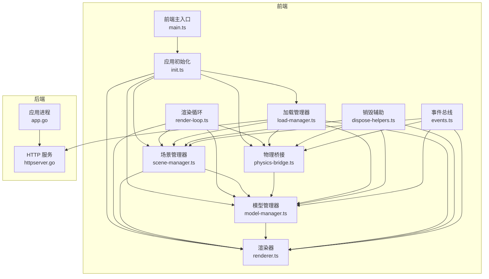
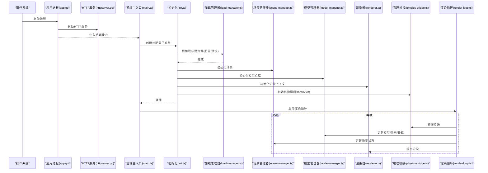
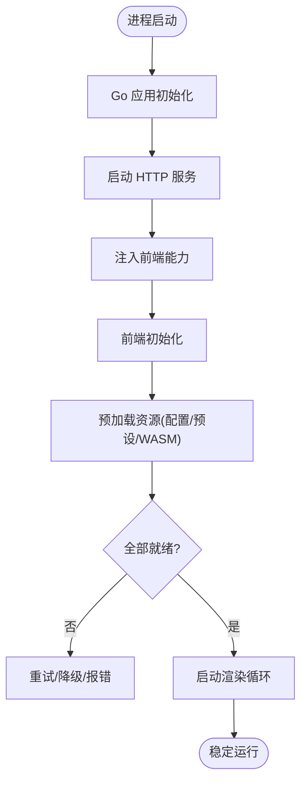
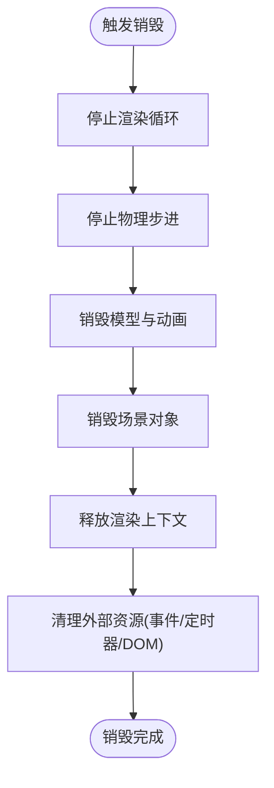
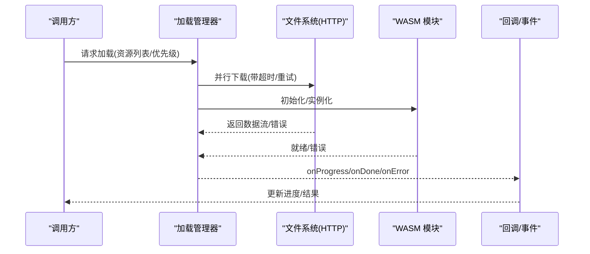
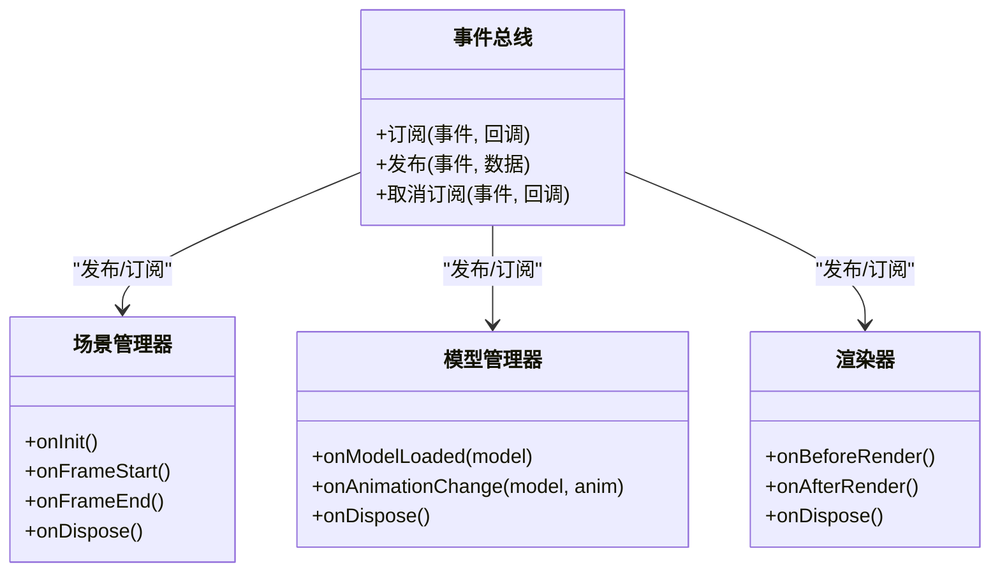
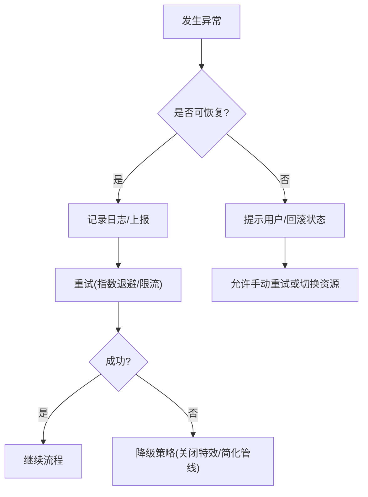
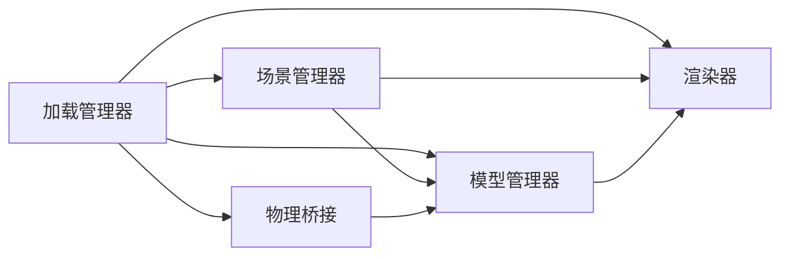

# 组件生命周期管理

<cite>
**本文引用的文件**   
- [main.go](file://main.go)
- [frontend/src/core/main.ts](file://frontend/src/core/main.ts)
- [frontend/src/core/init.ts](file://frontend/src/core/init.ts)
- [frontend/src/core/render-loop.ts](file://frontend/src/core/render-loop.ts)
- [frontend/src/core/load-manager.ts](file://frontend/src/core/load-manager.ts)
- [frontend/src/scene/scene.ts](file://frontend/src/scene/scene.ts)
- [frontend/src/scene/manager/model-manager.ts](file://frontend/src/scene/manager/model-manager.ts)
- [frontend/src/scene/manager/scene-manager.ts](file://frontend/src/scene/manager/scene-manager.ts)
- [frontend/src/scene/render/renderer.ts](file://frontend/src/scene/render/renderer.ts)
- [frontend/src/physics/physics-bridge.ts](file://frontend/src/physics/physics-bridge.ts)
- [frontend/src/core/dispose-helpers.ts](file://frontend/src/core/dispose-helpers.ts)
- [frontend/src/core/events.ts](file://frontend/src/core/events.ts)
- [internal/app/app.go](file://internal/app/app.go)
- [internal/app/httpserver.go](file://internal/app/httpserver.go)
- [frontend/src/core/dev-hooks.ts](file://frontend/src/core/dev-hooks.ts)
</cite>

## 目录
1. [简介](#简介)
2. [项目结构](#项目结构)
3. [核心组件](#核心组件)
4. [架构总览](#架构总览)
5. [详细组件分析](#详细组件分析)
6. [依赖关系分析](#依赖关系分析)
7. [性能考量](#性能考量)
8. [故障排查指南](#故障排查指南)
9. [结论](#结论)
10. [附录](#附录)

## 简介
本文件聚焦于 MikuMikuAR 前端与后端协作下的“组件生命周期管理”，覆盖以下关键主题：
- 初始化流程与启动顺序：场景管理器、模型管理器、渲染引擎等核心组件的启动次序与依赖。
- 更新周期协调机制：渲染循环中的状态同步、物理计算与渲染时序控制。
- 销毁与资源清理：组件销毁路径、内存释放与无泄漏保障。
- 异步操作协调：文件加载、网络请求、WASM 模块初始化的等待与错误处理。
- 生命周期钩子：如何扩展组件行为，统一事件与钩子约定。
- 异常处理与恢复：失败重试、降级策略与可观测性。

## 项目结构
本项目采用前后端分离架构：
- 前端（TypeScript）负责渲染、场景、模型、物理、UI 与运行时编排。
- 后端（Go/Wails）提供文件系统、HTTP 服务、平台能力绑定与进程级生命周期。



图表来源
- [frontend/src/core/main.ts](file://frontend/src/core/main.ts)
- [frontend/src/core/init.ts](file://frontend/src/core/init.ts)
- [frontend/src/core/render-loop.ts](file://frontend/src/core/render-loop.ts)
- [frontend/src/scene/manager/scene-manager.ts](file://frontend/src/scene/manager/scene-manager.ts)
- [frontend/src/scene/manager/model-manager.ts](file://frontend/src/scene/manager/model-manager.ts)
- [frontend/src/scene/render/renderer.ts](file://frontend/src/scene/render/renderer.ts)
- [frontend/src/physics/physics-bridge.ts](file://frontend/src/physics/physics-bridge.ts)
- [frontend/src/core/load-manager.ts](file://frontend/src/core/load-manager.ts)
- [frontend/src/core/dispose-helpers.ts](file://frontend/src/core/dispose-helpers.ts)
- [frontend/src/core/events.ts](file://frontend/src/core/events.ts)
- [internal/app/app.go](file://internal/app/app.go)
- [internal/app/httpserver.go](file://internal/app/httpserver.go)

章节来源
- [main.go:1-200](file://main.go#L1-L200)
- [frontend/src/core/main.ts:1-200](file://frontend/src/core/main.ts#L1-L200)
- [frontend/src/core/init.ts:1-200](file://frontend/src/core/init.ts#L1-L200)
- [internal/app/app.go:1-200](file://internal/app/app.go#L1-L200)
- [internal/app/httpserver.go:1-200](file://internal/app/httpserver.go#L1-L200)

## 核心组件
- 应用进程（Go）：负责 Wails 应用生命周期、HTTP 服务、平台能力与资源访问。
- 前端主入口与初始化：创建并挂载核心子系统，注册事件与钩子，准备渲染上下文。
- 场景管理器：维护场景图、相机、环境、阶段对象等，协调各子系统进入运行态。
- 模型管理器：管理模型实例、材质、动画、骨骼、物理参数，驱动模型生命周期。
- 渲染器：封装渲染管线、后处理、反射/水面等特性，按帧提交绘制。
- 物理桥接：将 WASM 物理层与前端模型/骨骼数据对齐，提供步进接口。
- 加载管理器：统一文件/网络/WASM 加载，提供进度、取消与错误传播。
- 销毁辅助：集中实现 dispose 模式，确保 GPU/CPU 资源释放与引用清零。
- 事件总线：跨模块发布订阅，承载生命周期事件与用户交互。

章节来源
- [frontend/src/core/main.ts:1-200](file://frontend/src/core/main.ts#L1-L200)
- [frontend/src/core/init.ts:1-200](file://frontend/src/core/init.ts#L1-L200)
- [frontend/src/scene/manager/scene-manager.ts:1-200](file://frontend/src/scene/manager/scene-manager.ts#L1-L200)
- [frontend/src/scene/manager/model-manager.ts:1-200](file://frontend/src/scene/manager/model-manager.ts#L1-L200)
- [frontend/src/scene/render/renderer.ts:1-200](file://frontend/src/scene/render/renderer.ts#L1-L200)
- [frontend/src/physics/physics-bridge.ts:1-200](file://frontend/src/physics/physics-bridge.ts#L1-L200)
- [frontend/src/core/load-manager.ts:1-200](file://frontend/src/core/load-manager.ts#L1-L200)
- [frontend/src/core/dispose-helpers.ts:1-200](file://frontend/src/core/dispose-helpers.ts#L1-L200)
- [frontend/src/core/events.ts:1-200](file://frontend/src/core/events.ts#L1-L200)

## 架构总览
下图展示从进程启动到渲染循环稳定运行的关键阶段与依赖关系。



图表来源
- [internal/app/app.go:1-200](file://internal/app/app.go#L1-L200)
- [internal/app/httpserver.go:1-200](file://internal/app/httpserver.go#L1-L200)
- [frontend/src/core/main.ts:1-200](file://frontend/src/core/main.ts#L1-L200)
- [frontend/src/core/init.ts:1-200](file://frontend/src/core/init.ts#L1-L200)
- [frontend/src/core/load-manager.ts:1-200](file://frontend/src/core/load-manager.ts#L1-L200)
- [frontend/src/scene/manager/scene-manager.ts:1-200](file://frontend/src/scene/manager/scene-manager.ts#L1-L200)
- [frontend/src/scene/manager/model-manager.ts:1-200](file://frontend/src/scene/manager/model-manager.ts#L1-L200)
- [frontend/src/scene/render/renderer.ts:1-200](file://frontend/src/scene/render/renderer.ts#L1-L200)
- [frontend/src/physics/physics-bridge.ts:1-200](file://frontend/src/physics/physics-bridge.ts#L1-L200)
- [frontend/src/core/render-loop.ts:1-200](file://frontend/src/core/render-loop.ts#L1-L200)

## 详细组件分析

### 初始化流程与启动顺序
- 进程级启动：Go 应用启动 HTTP 服务，暴露文件访问与代理能力；随后将能力注入前端。
- 前端初始化：创建并装配场景、模型、渲染、物理、加载等子系统；注册事件与钩子；准备渲染上下文。
- 资源预加载：通过加载管理器并行拉取配置、预设、纹理、WASM 模块等，完成后通知初始化完成。
- 渲染循环启动：在全部子系统就绪后启动渲染循环，进入稳定运行态。



图表来源
- [internal/app/app.go:1-200](file://internal/app/app.go#L1-L200)
- [internal/app/httpserver.go:1-200](file://internal/app/httpserver.go#L1-L200)
- [frontend/src/core/main.ts:1-200](file://frontend/src/core/main.ts#L1-L200)
- [frontend/src/core/init.ts:1-200](file://frontend/src/core/init.ts#L1-L200)
- [frontend/src/core/load-manager.ts:1-200](file://frontend/src/core/load-manager.ts#L1-L200)

章节来源
- [internal/app/app.go:1-200](file://internal/app/app.go#L1-L200)
- [internal/app/httpserver.go:1-200](file://internal/app/httpserver.go#L1-L200)
- [frontend/src/core/main.ts:1-200](file://frontend/src/core/main.ts#L1-L200)
- [frontend/src/core/init.ts:1-200](file://frontend/src/core/init.ts#L1-L200)
- [frontend/src/core/load-manager.ts:1-200](file://frontend/src/core/load-manager.ts#L1-L200)

### 更新周期协调机制
- 时序控制：每帧先进行物理步进，再更新模型/动画/骨骼，最后提交渲染。
- 状态同步：场景管理器持有全局状态（相机、环境、阶段），模型管理器维护模型局部状态，渲染器读取最终矩阵与材质。
- 解耦方式：通过事件总线与观察者模式传递状态变更，避免紧耦合调用链。

```mermaid
sequenceDiagram
participant Loop as "渲染循环"
participant Phys as "物理桥接"
participant Model as "模型管理器"
participant Scene as "场景管理器"
participant Rend as "渲染器"
Loop->>Phys : 物理步进(dt)
Phys-->>Model : 输出骨骼/刚体变换
Loop->>Model : 更新动画/姿态/可见性
Loop->>Scene : 更新相机/光照/环境
Loop->>Rend : 提交绘制(场景图+材质)
Rend-->>Loop : 帧结束回调
```

图表来源
- [frontend/src/core/render-loop.ts:1-200](file://frontend/src/core/render-loop.ts#L1-L200)
- [frontend/src/physics/physics-bridge.ts:1-200](file://frontend/src/physics/physics-bridge.ts#L1-L200)
- [frontend/src/scene/manager/model-manager.ts:1-200](file://frontend/src/scene/manager/model-manager.ts#L1-L200)
- [frontend/src/scene/manager/scene-manager.ts:1-200](file://frontend/src/scene/manager/scene-manager.ts#L1-L200)
- [frontend/src/scene/render/renderer.ts:1-200](file://frontend/src/scene/render/renderer.ts#L1-L200)

章节来源
- [frontend/src/core/render-loop.ts:1-200](file://frontend/src/core/render-loop.ts#L1-L200)
- [frontend/src/physics/physics-bridge.ts:1-200](file://frontend/src/physics/physics-bridge.ts#L1-L200)
- [frontend/src/scene/manager/model-manager.ts:1-200](file://frontend/src/scene/manager/model-manager.ts#L1-L200)
- [frontend/src/scene/manager/scene-manager.ts:1-200](file://frontend/src/scene/manager/scene-manager.ts#L1-L200)
- [frontend/src/scene/render/renderer.ts:1-200](file://frontend/src/scene/render/renderer.ts#L1-L200)

### 销毁与资源清理
- 销毁顺序：先停止渲染循环与物理步进，再销毁模型与场景对象，最后释放渲染上下文与外部资源。
- 资源释放：GPU 纹理/缓冲、WASM 实例、事件监听、定时器与 DOM 引用需显式清理。
- 辅助工具：使用统一的 dispose 辅助函数，确保幂等与异常安全。



图表来源
- [frontend/src/core/render-loop.ts:1-200](file://frontend/src/core/render-loop.ts#L1-L200)
- [frontend/src/physics/physics-bridge.ts:1-200](file://frontend/src/physics/physics-bridge.ts#L1-L200)
- [frontend/src/scene/manager/model-manager.ts:1-200](file://frontend/src/scene/manager/model-manager.ts#L1-L200)
- [frontend/src/scene/manager/scene-manager.ts:1-200](file://frontend/src/scene/manager/scene-manager.ts#L1-L200)
- [frontend/src/scene/render/renderer.ts:1-200](file://frontend/src/scene/render/renderer.ts#L1-L200)
- [frontend/src/core/dispose-helpers.ts:1-200](file://frontend/src/core/dispose-helpers.ts#L1-L200)

章节来源
- [frontend/src/core/dispose-helpers.ts:1-200](file://frontend/src/core/dispose-helpers.ts#L1-L200)
- [frontend/src/core/render-loop.ts:1-200](file://frontend/src/core/render-loop.ts#L1-L200)
- [frontend/src/physics/physics-bridge.ts:1-200](file://frontend/src/physics/physics-bridge.ts#L1-L200)
- [frontend/src/scene/manager/model-manager.ts:1-200](file://frontend/src/scene/manager/model-manager.ts#L1-L200)
- [frontend/src/scene/manager/scene-manager.ts:1-200](file://frontend/src/scene/manager/scene-manager.ts#L1-L200)
- [frontend/src/scene/render/renderer.ts:1-200](file://frontend/src/scene/render/renderer.ts#L1-L200)

### 异步操作协调（文件/网络/WASM）
- 统一入口：加载管理器聚合文件、网络与 WASM 模块加载，提供进度、取消与错误上报。
- 等待机制：初始化阶段等待关键资源完成；运行期按需懒加载，支持并发与优先级。
- 错误处理：区分可恢复与不可恢复错误，提供重试、降级与回退策略。



图表来源
- [frontend/src/core/load-manager.ts:1-200](file://frontend/src/core/load-manager.ts#L1-L200)
- [internal/app/httpserver.go:1-200](file://internal/app/httpserver.go#L1-L200)

章节来源
- [frontend/src/core/load-manager.ts:1-200](file://frontend/src/core/load-manager.ts#L1-L200)
- [internal/app/httpserver.go:1-200](file://internal/app/httpserver.go#L1-L200)

### 生命周期钩子与扩展点
- 事件总线：通过发布订阅机制，在关键节点（初始化、销毁、帧开始/结束、模型加载完成等）广播事件。
- 开发钩子：提供调试与扩展钩子，便于注入自定义逻辑（如统计、日志、热重载）。
- 最佳实践：钩子内避免阻塞主线程；长耗时任务应交由加载管理器或后台队列。



图表来源
- [frontend/src/core/events.ts:1-200](file://frontend/src/core/events.ts#L1-L200)
- [frontend/src/core/dev-hooks.ts:1-200](file://frontend/src/core/dev-hooks.ts#L1-L200)
- [frontend/src/scene/manager/scene-manager.ts:1-200](file://frontend/src/scene/manager/scene-manager.ts#L1-L200)
- [frontend/src/scene/manager/model-manager.ts:1-200](file://frontend/src/scene/manager/model-manager.ts#L1-L200)
- [frontend/src/scene/render/renderer.ts:1-200](file://frontend/src/scene/render/renderer.ts#L1-L200)

章节来源
- [frontend/src/core/events.ts:1-200](file://frontend/src/core/events.ts#L1-L200)
- [frontend/src/core/dev-hooks.ts:1-200](file://frontend/src/core/dev-hooks.ts#L1-L200)
- [frontend/src/scene/manager/scene-manager.ts:1-200](file://frontend/src/scene/manager/scene-manager.ts#L1-L200)
- [frontend/src/scene/manager/model-manager.ts:1-200](file://frontend/src/scene/manager/model-manager.ts#L1-L200)
- [frontend/src/scene/render/renderer.ts:1-200](file://frontend/src/scene/render/renderer.ts#L1-L200)

### 异常处理与恢复机制
- 分类与上报：区分网络错误、解析错误、渲染错误与 WASM 错误，统一上报至日志与状态面板。
- 重试与降级：对可恢复错误执行指数退避重试；对不可恢复错误启用降级模式（关闭特效/降低分辨率）。
- 恢复策略：在关键路径失败时保留已加载资源，允许用户手动重试或切换资源源。



[此图为概念流程图，不直接映射具体源码文件]

章节来源
- [frontend/src/core/load-manager.ts:1-200](file://frontend/src/core/load-manager.ts#L1-L200)
- [frontend/src/core/dispose-helpers.ts:1-200](file://frontend/src/core/dispose-helpers.ts#L1-L200)
- [frontend/src/core/events.ts:1-200](file://frontend/src/core/events.ts#L1-L200)

## 依赖关系分析
- 松耦合：渲染器仅依赖场景图与材质数据，不感知物理细节；模型管理器仅关注模型与动画，不直接操作渲染。
- 中心化协调：场景管理器作为领域中心，协调模型与渲染；加载管理器作为资源中心，屏蔽底层差异。
- 外部依赖：HTTP 服务为文件与代理能力提供者；WASM 物理层通过桥接层与前端交互。



图表来源
- [frontend/src/core/load-manager.ts:1-200](file://frontend/src/core/load-manager.ts#L1-L200)
- [frontend/src/scene/manager/scene-manager.ts:1-200](file://frontend/src/scene/manager/scene-manager.ts#L1-L200)
- [frontend/src/scene/manager/model-manager.ts:1-200](file://frontend/src/scene/manager/model-manager.ts#L1-L200)
- [frontend/src/scene/render/renderer.ts:1-200](file://frontend/src/scene/render/renderer.ts#L1-L200)
- [frontend/src/physics/physics-bridge.ts:1-200](file://frontend/src/physics/physics-bridge.ts#L1-L200)

章节来源
- [frontend/src/core/load-manager.ts:1-200](file://frontend/src/core/load-manager.ts#L1-L200)
- [frontend/src/scene/manager/scene-manager.ts:1-200](file://frontend/src/scene/manager/scene-manager.ts#L1-L200)
- [frontend/src/scene/manager/model-manager.ts:1-200](file://frontend/src/scene/manager/model-manager.ts#L1-L200)
- [frontend/src/scene/render/renderer.ts:1-200](file://frontend/src/scene/render/renderer.ts#L1-L200)
- [frontend/src/physics/physics-bridge.ts:1-200](file://frontend/src/physics/physics-bridge.ts#L1-L200)

## 性能考量
- 批处理与合并：模型更新与渲染提交尽量批量化，减少状态切换与绘制调用次数。
- 增量更新：仅在必要时更新受影响的模型/材质，避免全量重建。
- 资源复用：纹理、材质与几何体缓存复用，避免重复分配。
- 物理步长固定：使用固定时间步长保证稳定性，渲染帧率与物理步长解耦。
- 异步优先：I/O 与 WASM 初始化走异步通道，避免阻塞主循环。

[本节为通用指导，不直接分析具体文件]

## 故障排查指南
- 常见问题定位：
  - 渲染黑屏：检查渲染上下文初始化与场景图构建。
  - 模型不显示：确认模型加载完成事件与材质/纹理可用。
  - 物理抖动：核对物理步长与 dt 一致性，检查碰撞体配置。
  - WASM 加载失败：查看网络可达性与模块版本匹配。
- 诊断手段：
  - 使用开发钩子注入日志与统计。
  - 通过事件总线订阅关键生命周期事件，观察时序。
  - 利用加载管理器进度与错误回调定位瓶颈。

章节来源
- [frontend/src/core/dev-hooks.ts:1-200](file://frontend/src/core/dev-hooks.ts#L1-L200)
- [frontend/src/core/events.ts:1-200](file://frontend/src/core/events.ts#L1-L200)
- [frontend/src/core/load-manager.ts:1-200](file://frontend/src/core/load-manager.ts#L1-L200)

## 结论
通过清晰的启动顺序、稳定的更新周期、完善的销毁与资源清理、统一的异步加载与错误处理，以及可扩展的生命周期钩子，MikuMikuAR 实现了高内聚、低耦合的组件生命周期管理。建议在新增功能时遵循现有模式，保持时序一致性与资源管理的健壮性。

[本节为总结，不直接分析具体文件]

## 附录
- 术语说明：
  - 场景管理器：维护场景图与全局状态的核心组件。
  - 模型管理器：管理模型实例、材质、动画与骨骼的组件。
  - 渲染器：封装渲染管线与后处理的组件。
  - 物理桥接：连接 WASM 物理层与前端模型的组件。
  - 加载管理器：统一文件、网络与 WASM 加载的组件。
  - 销毁辅助：提供 dispose 模式的工具集合。
  - 事件总线：跨模块发布订阅的事件系统。

[本节为概念说明，不直接分析具体文件]