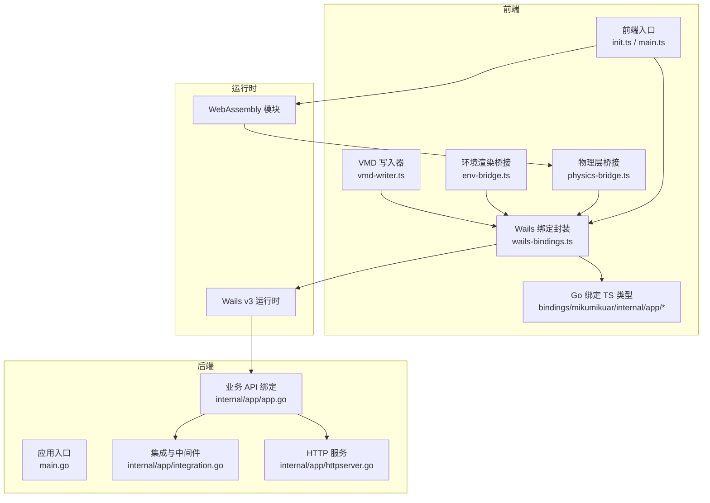
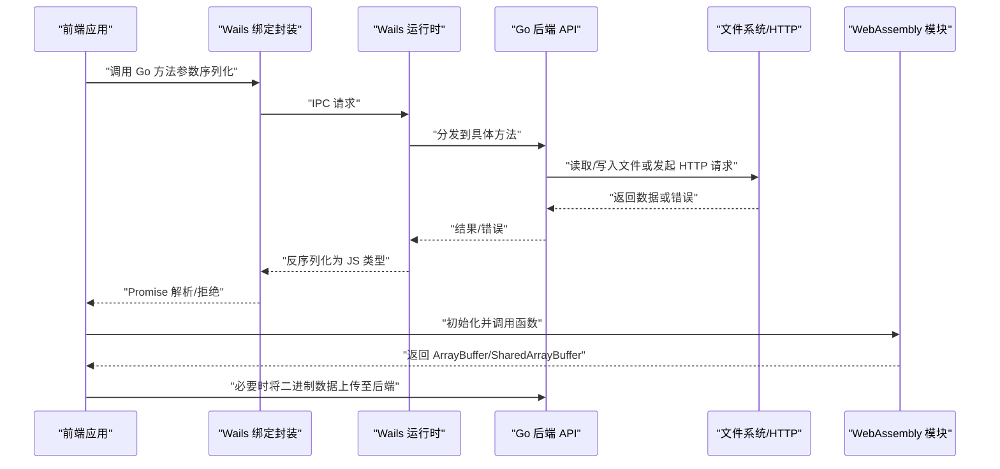
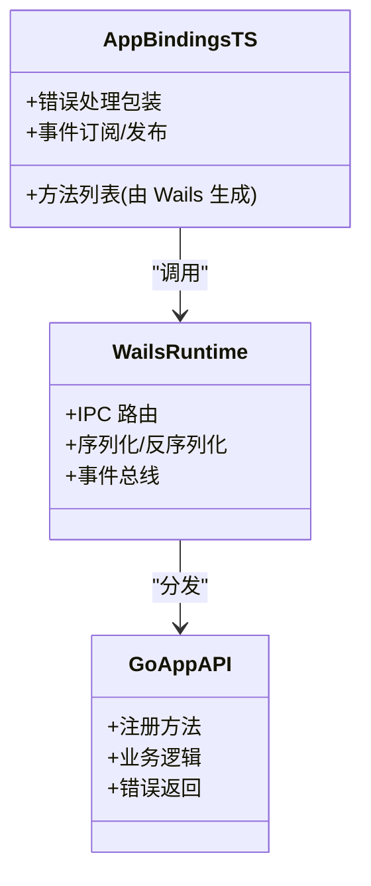
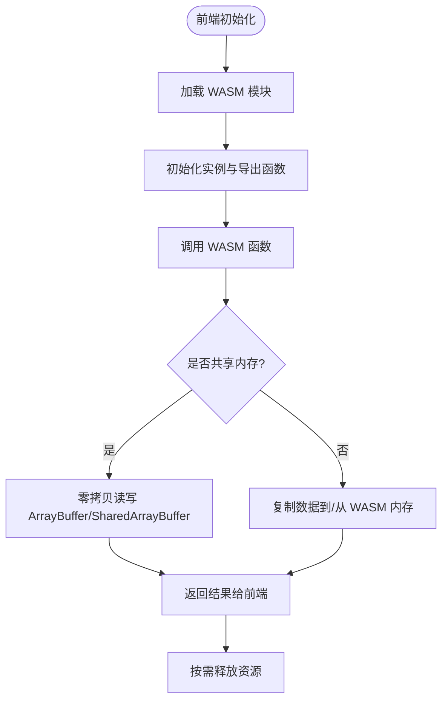
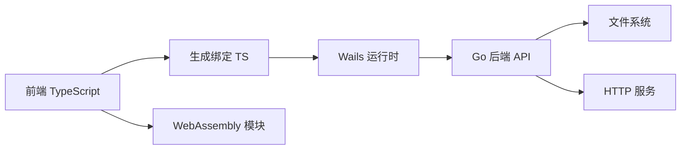

# 跨语言通信机制

<cite>
**本文引用的文件**   
- [main.go](file://main.go)
- [go.mod](file://go.mod)
- [frontend/src/core/wails-bindings.ts](file://frontend/src/core/wails-bindings.ts)
- [frontend/bindings/mikumikuar/internal/app/index.ts](file://frontend/bindings/mikumikuar/internal/app/index.ts)
- [frontend/bindings/mikumikuar/internal/app/app.ts](file://frontend/bindings/mikumikuar/internal/app/app.ts)
- [frontend/bindings/mikumikuar/internal/app/models.ts](file://frontend/bindings/mikumikuar/internal/app/models.ts)
- [internal/app/app.go](file://internal/app/app.go)
- [internal/app/integration.go](file://internal/app/integration.go)
- [internal/app/httpserver.go](file://internal/app/httpserver.go)
- [frontend/src/core/init.ts](file://frontend/src/core/init.ts)
- [frontend/src/core/main.ts](file://frontend/src/core/main.ts)
- [frontend/src/core/events.ts](file://frontend/src/core/events.ts)
- [frontend/src/core/fileservice.ts](file://frontend/src/core/fileservice.ts)
- [frontend/src/physics/physics-bridge.ts](file://frontend/src/physics/physics-bridge.ts)
- [frontend/src/scene/env/env-bridge.ts](file://frontend/src/scene/env/env-bridge.ts)
- [frontend/src/motion-algos/vmd-writer.ts](file://frontend/src/motion-algos/vmd-writer.ts)
- [frontend/e2e/wails-fixture.ts](file://frontend/e2e/wails-fixture.ts)
- [scripts/build-android-so.ps1](file://scripts/build-android-so.ps1)
- [scripts/build-linux.sh](file://scripts/build-linux.sh)
- [scripts/build-darwin.sh](file://scripts/build-darwin.sh)
</cite>

## 目录
1. [简介](#简介)
2. [项目结构](#项目结构)
3. [核心组件](#核心组件)
4. [架构总览](#架构总览)
5. [详细组件分析](#详细组件分析)
6. [依赖关系分析](#依赖关系分析)
7. [性能考虑](#性能考虑)
8. [故障排查指南](#故障排查指南)
9. [结论](#结论)
10. [附录](#附录)

## 简介
本文件面向使用 Wails v3 的跨语言通信场景，聚焦 JavaScript（前端）与 Go（后端）之间的双向通信实现。文档覆盖以下主题：
- Wails v3 绑定机制、函数调用与事件系统
- WebAssembly 模块在前端的集成方式（加载、初始化、函数调用、内存共享）
- 数据类型映射规则（基本类型、对象、数组、缓冲区）
- IPC 最佳实践（错误处理、超时控制、并发安全）
- 性能优化策略（批量传输、零拷贝、内存池）
- 调试工具与性能分析方法

## 项目结构
本项目采用前后端分离的组织方式：
- 前端 TypeScript 代码位于 frontend/src，包含 UI、业务逻辑、WASM 交互桥接等
- Go 后端代码位于 internal/app，提供被 Wails 绑定的 API 与服务
- 构建脚本位于 scripts，负责多平台打包与 WASM 产物管理
- 生成式绑定位于 frontend/bindings，由 Wails 工具链根据 Go 暴露的接口自动生成

图表来源
- [frontend/src/core/init.ts](file://frontend/src/core/init.ts)
- [frontend/src/core/main.ts](file://frontend/src/core/main.ts)
- [frontend/src/core/wails-bindings.ts](file://frontend/src/core/wails-bindings.ts)
- [frontend/bindings/mikumikuar/internal/app/index.ts](file://frontend/bindings/mikumikuar/internal/app/index.ts)
- [internal/app/app.go](file://internal/app/app.go)
- [internal/app/integration.go](file://internal/app/integration.go)
- [internal/app/httpserver.go](file://internal/app/httpserver.go)
- [main.go](file://main.go)

章节来源
- [main.go](file://main.go)
- [frontend/src/core/init.ts](file://frontend/src/core/init.ts)
- [frontend/src/core/main.ts](file://frontend/src/core/main.ts)
- [frontend/src/core/wails-bindings.ts](file://frontend/src/core/wails-bindings.ts)
- [frontend/bindings/mikumikuar/internal/app/index.ts](file://frontend/bindings/mikumikuar/internal/app/index.ts)
- [internal/app/app.go](file://internal/app/app.go)
- [internal/app/integration.go](file://internal/app/integration.go)
- [internal/app/httpserver.go](file://internal/app/httpserver.go)

## 核心组件
- Wails 绑定封装层：将 Go 暴露的方法以 TypeScript 形式供前端调用，统一序列化/反序列化与错误传播
- Go 业务 API：在 internal/app 中通过 Wails 注册方法，处理文件系统、配置、场景、库、更新等能力
- 事件系统：基于 Wails 的事件通道，实现前端与后端的异步消息传递
- WASM 集成：前端直接加载 WASM 模块，进行高性能计算（如骨骼物理），并通过 ArrayBuffer/SharedArrayBuffer 与 JS 共享内存
- HTTP 服务：可选的本地 HTTP 服务用于资源访问或调试

章节来源
- [frontend/src/core/wails-bindings.ts](file://frontend/src/core/wails-bindings.ts)
- [frontend/bindings/mikumikuar/internal/app/index.ts](file://frontend/bindings/mikumikuar/internal/app/index.ts)
- [internal/app/app.go](file://internal/app/app.go)
- [internal/app/integration.go](file://internal/app/integration.go)
- [internal/app/httpserver.go](file://internal/app/httpserver.go)
- [frontend/src/core/events.ts](file://frontend/src/core/events.ts)
- [frontend/src/physics/physics-bridge.ts](file://frontend/src/physics/physics-bridge.ts)

## 架构总览
下图展示了从前端到后端的完整调用路径，以及事件与 WASM 的交互位置。

图表来源
- [frontend/src/core/wails-bindings.ts](file://frontend/src/core/wails-bindings.ts)
- [frontend/bindings/mikumikuar/internal/app/index.ts](file://frontend/bindings/mikumikuar/internal/app/index.ts)
- [internal/app/app.go](file://internal/app/app.go)
- [internal/app/httpserver.go](file://internal/app/httpserver.go)
- [frontend/src/physics/physics-bridge.ts](file://frontend/src/physics/physics-bridge.ts)

## 详细组件分析

### Wails v3 绑定机制与函数调用
- 绑定生成：Wails 工具链扫描 Go 包，生成对应的 TypeScript 类型与调用封装，位于 frontend/bindings 下
- 调用流程：前端通过生成的绑定对象调用 Go 方法；Wails 运行时负责序列化参数、跨进程路由、返回值与错误回传
- 错误处理：Go 侧返回的错误会被转换为 JS 异常或 Promise 拒绝，便于上层统一捕获
- 事件系统：支持命名事件，前端订阅/发布，后端亦可触发事件，适合状态同步与通知

图表来源
- [frontend/bindings/mikumikuar/internal/app/index.ts](file://frontend/bindings/mikumikuar/internal/app/index.ts)
- [frontend/src/core/wails-bindings.ts](file://frontend/src/core/wails-bindings.ts)
- [internal/app/app.go](file://internal/app/app.go)

章节来源
- [frontend/bindings/mikumikuar/internal/app/index.ts](file://frontend/bindings/mikumikuar/internal/app/index.ts)
- [frontend/src/core/wails-bindings.ts](file://frontend/src/core/wails-bindings.ts)
- [internal/app/app.go](file://internal/app/app.go)
- [frontend/src/core/events.ts](file://frontend/src/core/events.ts)

### WebAssembly 模块集成
- 加载与初始化：前端在启动阶段加载 WASM 模块，完成实例化与导出函数准备
- 函数调用：通过导出的函数执行高性能计算（例如骨骼物理），输入输出多为 ArrayBuffer/SharedArrayBuffer
- 内存共享：使用 SharedArrayBuffer 可在主线程与 WASM 之间零拷贝共享大块数据，减少复制开销
- 生命周期：注意模块销毁与内存释放，避免泄漏

图表来源
- [frontend/src/physics/physics-bridge.ts](file://frontend/src/physics/physics-bridge.ts)
- [frontend/src/core/main.ts](file://frontend/src/core/main.ts)

章节来源
- [frontend/src/physics/physics-bridge.ts](file://frontend/src/physics/physics-bridge.ts)
- [frontend/src/core/main.ts](file://frontend/src/core/main.ts)

### 数据类型映射规则
- 基本类型：string、number、boolean 等在 JS 与 Go 间直接映射
- 复杂对象：Go 结构体字段名需与 TS 类型一致，Wails 自动序列化/反序列化
- 数组与切片：Go 切片映射为 JS 数组
- 缓冲区：byte[] 或 []uint8 映射为 Uint8Array；大体积数据建议使用 ArrayBuffer/SharedArrayBuffer 以降低拷贝成本
- 错误类型：Go error 转为 JS Error 或 Promise 拒绝，携带错误码与消息

章节来源
- [frontend/src/core/wails-bindings.ts](file://frontend/src/core/wails-bindings.ts)
- [frontend/bindings/mikumikuar/internal/app/models.ts](file://frontend/bindings/mikumikuar/internal/app/models.ts)
- [internal/app/app.go](file://internal/app/app.go)

### IPC 最佳实践
- 错误处理
  - 统一错误包装：Go 侧返回结构化错误，前端统一捕获并展示
  - 可重试策略：对网络或 I/O 失败进行有限次重试
- 超时控制
  - 为长耗时操作设置超时，避免阻塞 UI 线程
  - 使用 AbortController 取消未完成的请求
- 并发安全
  - Go 侧使用互斥锁保护共享状态
  - 前端避免在同一资源上并发写，必要时排队或合并请求

章节来源
- [frontend/src/core/wails-bindings.ts](file://frontend/src/core/wails-bindings.ts)
- [internal/app/app.go](file://internal/app/app.go)
- [frontend/e2e/wails-fixture.ts](file://frontend/e2e/wails-fixture.ts)

### 性能优化策略
- 批量数据传输
  - 合并多次小数据为一次大请求，减少 IPC 次数
  - 使用分块传输与流式处理，降低峰值内存占用
- 零拷贝技术
  - 优先使用 SharedArrayBuffer 共享内存，避免重复拷贝
  - 在 WASM 与 JS 之间直接读写同一缓冲区
- 内存池管理
  - 复用大型缓冲区，减少频繁分配与 GC 压力
  - 明确释放时机，防止内存泄漏

章节来源
- [frontend/src/physics/physics-bridge.ts](file://frontend/src/physics/physics-bridge.ts)
- [frontend/src/core/wails-bindings.ts](file://frontend/src/core/wails-bindings.ts)

### 调试工具与性能分析
- 前端调试
  - 浏览器开发者工具：断点、网络面板、性能面板
  - 日志输出：结合前端日志模块记录关键路径
- 后端调试
  - Go 标准日志与 slog：结构化日志便于检索
  - 单元测试与集成测试：验证边界条件与错误路径
- 端到端测试
  - 使用 e2e 夹具模拟用户行为，验证跨语言调用链路
- 性能分析
  - 前端：Performance API、采样分析热点
  - 后端：pprof 分析 CPU/内存瓶颈

章节来源
- [frontend/e2e/wails-fixture.ts](file://frontend/e2e/wails-fixture.ts)
- [frontend/src/core/main.ts](file://frontend/src/core/main.ts)
- [internal/app/app.go](file://internal/app/app.go)

## 依赖关系分析
- 前端依赖 Wails 运行时与生成的绑定类型
- Go 后端通过 Wails 注册 API，内部可能依赖文件系统、HTTP 服务等
- WASM 模块作为独立运行时单元，通过内存共享与 JS 交互

图表来源
- [frontend/src/core/wails-bindings.ts](file://frontend/src/core/wails-bindings.ts)
- [frontend/bindings/mikumikuar/internal/app/index.ts](file://frontend/bindings/mikumikuar/internal/app/index.ts)
- [internal/app/app.go](file://internal/app/app.go)
- [internal/app/httpserver.go](file://internal/app/httpserver.go)

章节来源
- [frontend/src/core/wails-bindings.ts](file://frontend/src/core/wails-bindings.ts)
- [frontend/bindings/mikumikuar/internal/app/index.ts](file://frontend/bindings/mikumikuar/internal/app/index.ts)
- [internal/app/app.go](file://internal/app/app.go)
- [internal/app/httpserver.go](file://internal/app/httpserver.go)

## 性能考虑
- 减少 IPC 往返：合并请求、批处理响应
- 零拷贝与内存池：针对大数据集（纹理、模型、动作数据）
- 异步与并发：合理拆分任务，避免阻塞主线程
- 资源管理：及时释放 WASM 内存与文件句柄

[本节为通用指导，不直接分析具体文件]

## 故障排查指南
- 常见问题
  - WASM 404：检查构建产物路径与加载 URL
  - CORS 拦截：确保 WebView 与本地服务器配置正确
  - 跨域与 COEP：启用必要的跨域与安全头
- 定位步骤
  - 前端：查看控制台错误与网络请求
  - 后端：检查日志与错误堆栈
  - 端到端：运行 e2e 用例复现问题
- 修复建议
  - 修正路径与权限
  - 增加重试与降级策略
  - 完善错误码与提示

章节来源
- [frontend/e2e/wails-fixture.ts](file://frontend/e2e/wails-fixture.ts)
- [internal/app/httpserver.go](file://internal/app/httpserver.go)
- [internal/app/app.go](file://internal/app/app.go)

## 结论
通过 Wails v3 的绑定机制与事件系统，JavaScript 与 Go 实现了高效的双向通信。结合 WASM 的零拷贝与内存共享，可显著提升大数据处理的性能。遵循统一的错误处理、超时控制与并发安全策略，能够保障系统的稳定性与可维护性。持续的性能分析与调试有助于发现瓶颈并优化用户体验。

[本节为总结，不直接分析具体文件]

## 附录
- 构建与部署
  - 多平台构建脚本：Android、Linux、macOS
  - WASM 产物管理与集成
- 参考文件
  - 构建脚本与平台适配

章节来源
- [scripts/build-android-so.ps1](file://scripts/build-android-so.ps1)
- [scripts/build-linux.sh](file://scripts/build-linux.sh)
- [scripts/build-darwin.sh](file://scripts/build-darwin.sh)
- [go.mod](file://go.mod)