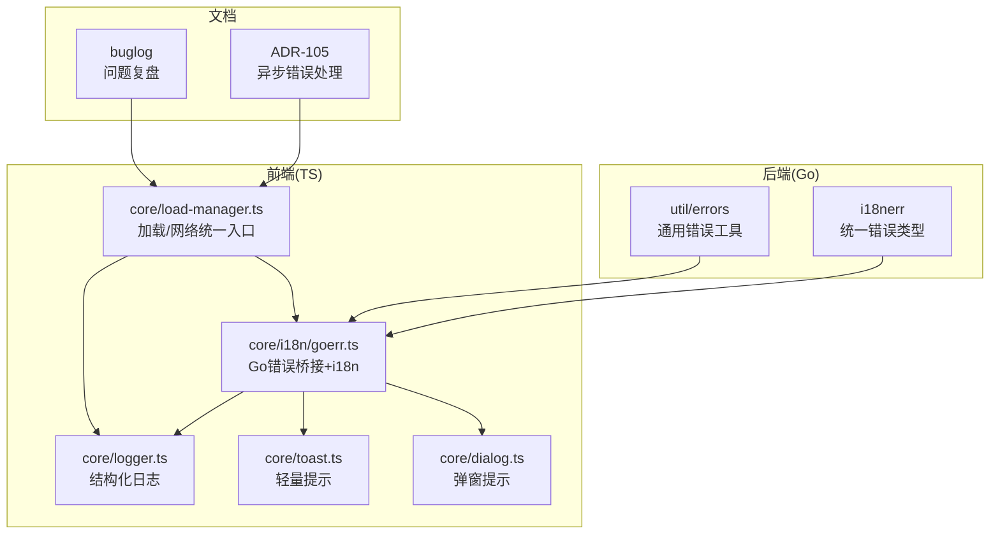
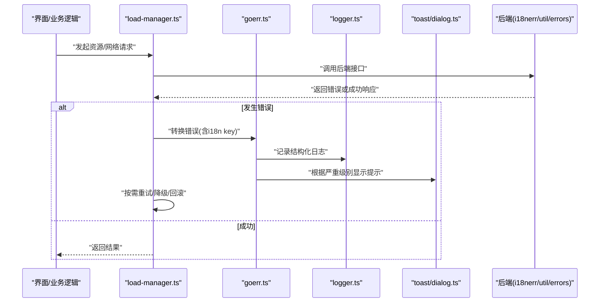
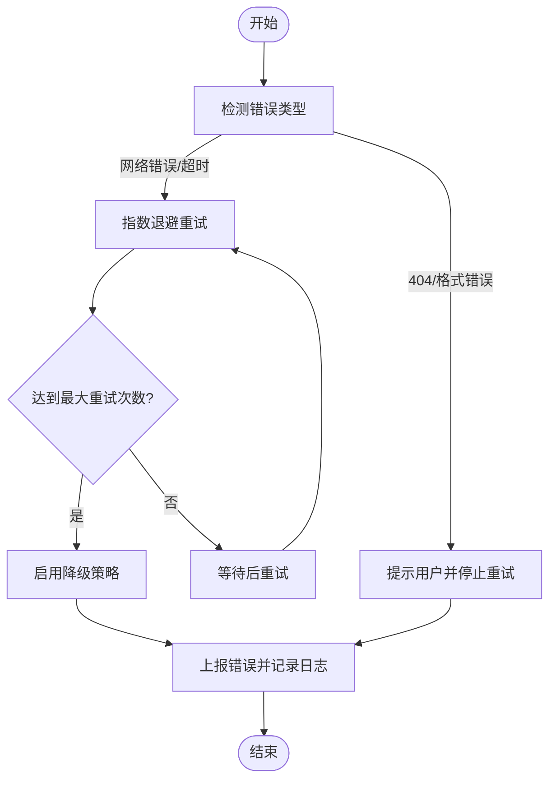
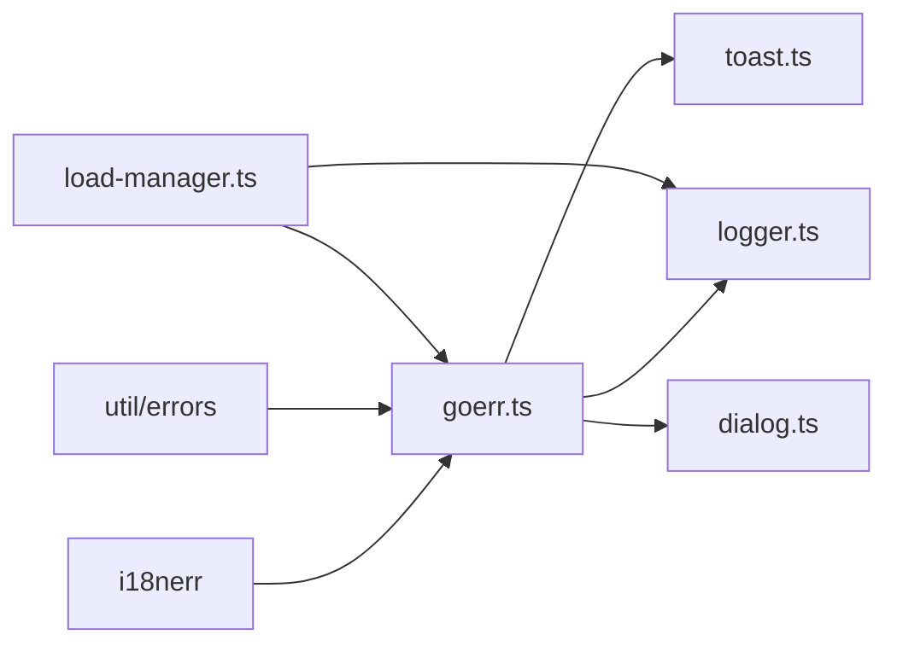

# 错误处理策略

<cite>
**本文引用的文件**   
- [errors.go](file://internal/i18nerr/errors.go)
- [errors_test.go](file://internal/i18nerr/errors_test.go)
- [errors.go](file://internal/util/errors.go)
- [errors_test.go](file://internal/util/errors_test.go)
- [goerr.ts](file://frontend/src/core/i18n/goerr.ts)
- [logger.ts](file://frontend/src/core/logger.ts)
- [toast.ts](file://frontend/src/core/toast.ts)
- [dialog.ts](file://frontend/src/core/dialog.ts)
- [load-manager.ts](file://frontend/src/core/load-manager.ts)
- [ADR-105.md](file://docs/adr/adr-105-abort-signal-and-async-error-handling.md)
- [buglog-CORS.md](file://docs/buglog/CORS：Wails WebView 跨域被拦.md)
- [buglog-WASM404.md](file://docs/buglog/WASM 404：`index_bg.wasm` 无法加载.md)
- [buglog-PMX加载失败.md](file://docs/buglog/PMX 加载失败：`is not pmx file`.md)
</cite>

## 目录
1. [简介](#简介)
2. [项目结构](#项目结构)
3. [核心组件](#核心组件)
4. [架构总览](#架构总览)
5. [详细组件分析](#详细组件分析)
6. [依赖关系分析](#依赖关系分析)
7. [性能考量](#性能考量)
8. [故障排查指南](#故障排查指南)
9. [结论](#结论)
10. [附录](#附录)

## 简介
本文件面向 MikuMikuAR 项目的统一错误处理策略，覆盖前后端错误类型定义、错误传播机制、国际化错误信息、日志记录策略、异常恢复与重试、以及错误监控与诊断工具的使用。目标是帮助开发者快速定位问题、稳定提升用户体验，并建立一致的错误处理规范。

## 项目结构
围绕错误处理的关键位置包括：
- 后端（Go）
  - internal/i18nerr：统一的带国际化键的错误类型与辅助方法
  - internal/util：通用错误工具与可恢复错误封装
- 前端（TypeScript）
  - frontend/src/core/i18n/goerr.ts：前端侧的 Go 错误桥接与 i18n 映射
  - frontend/src/core/logger.ts：结构化日志输出
  - frontend/src/core/toast.ts / dialog.ts：用户可见的错误提示
  - frontend/src/core/load-manager.ts：资源加载与网络请求的统一入口，集中捕获与上报
- 文档
  - docs/adr/adr-105-abort-signal-and-async-error-handling.md：异步错误处理与取消信号的设计决策
  - docs/buglog：典型问题的复盘与根因分析

图表来源
- [errors.go](file://internal/i18nerr/errors.go)
- [errors.go](file://internal/util/errors.go)
- [goerr.ts](file://frontend/src/core/i18n/goerr.ts)
- [logger.ts](file://frontend/src/core/logger.ts)
- [toast.ts](file://frontend/src/core/toast.ts)
- [dialog.ts](file://frontend/src/core/dialog.ts)
- [load-manager.ts](file://frontend/src/core/load-manager.ts)
- [ADR-105.md](file://docs/adr/adr-105-abort-signal-and-async-error-handling.md)
- [buglog-CORS.md](file://docs/buglog/CORS：Wails WebView 跨域被拦.md)
- [buglog-WASM404.md](file://docs/buglog/WASM 404：`index_bg.wasm` 无法加载.md)
- [buglog-PMX加载失败.md](file://docs/buglog/PMX 加载失败：`is not pmx file`.md)

章节来源
- [errors.go](file://internal/i18nerr/errors.go)
- [errors.go](file://internal/util/errors.go)
- [goerr.ts](file://frontend/src/core/i18n/goerr.ts)
- [logger.ts](file://frontend/src/core/logger.ts)
- [toast.ts](file://frontend/src/core/toast.ts)
- [dialog.ts](file://frontend/src/core/dialog.ts)
- [load-manager.ts](file://frontend/src/core/load-manager.ts)
- [ADR-105.md](file://docs/adr/adr-105-abort-signal-and-async-error-handling.md)
- [buglog-CORS.md](file://docs/buglog/CORS：Wails WebView 跨域被拦.md)
- [buglog-WASM404.md](file://docs/buglog/WASM 404：`index_bg.wasm` 无法加载.md)
- [buglog-PMX加载失败.md](file://docs/buglog/PMX 加载失败：`is not pmx file`.md)

## 核心组件
- 后端统一错误类型（i18nerr）
  - 提供带国际化键的错误对象，便于前端按 key 渲染多语言消息
  - 支持错误分类（如参数校验、资源不存在、权限不足等），利于统计与告警
- 后端通用错误工具（util/errors）
  - 封装常见错误构造、包装与可恢复错误标记，减少重复样板代码
- 前端 Go 错误桥接（core/i18n/goerr.ts）
  - 将后端返回的错误转换为前端友好对象，结合 i18n 系统输出本地化消息
- 日志系统（core/logger.ts）
  - 结构化日志，区分调试、错误、性能等级别，支持上下文附加
- 用户提示（core/toast.ts / core/dialog.ts）
  - toast 用于轻量、短暂提示；dialog 用于需要用户确认或输入的错误场景
- 加载与网络统一入口（core/load-manager.ts）
  - 集中捕获资源加载与网络请求异常，执行重试、降级与上报

章节来源
- [errors.go](file://internal/i18nerr/errors.go)
- [errors.go](file://internal/util/errors.go)
- [goerr.ts](file://frontend/src/core/i18n/goerr.ts)
- [logger.ts](file://frontend/src/core/logger.ts)
- [toast.ts](file://frontend/src/core/toast.ts)
- [dialog.ts](file://frontend/src/core/dialog.ts)
- [load-manager.ts](file://frontend/src/core/load-manager.ts)

## 架构总览
统一错误处理遵循“后端标准化 + 前端适配 + 统一上报”的原则：
- 后端通过 i18nerr 产出带 key 的错误，util/errors 提供通用封装
- 前端 goerr.ts 解析后端错误，映射到 i18n key，再交由 logger 记录、toast/dialog 展示
- load-manager.ts 作为资源/网络层统一入口，负责重试、超时、降级与错误聚合
- ADR-105 为异步错误处理与取消信号提供设计依据，避免悬挂任务与内存泄漏

图表来源
- [load-manager.ts](file://frontend/src/core/load-manager.ts)
- [goerr.ts](file://frontend/src/core/i18n/goerr.ts)
- [logger.ts](file://frontend/src/core/logger.ts)
- [toast.ts](file://frontend/src/core/toast.ts)
- [dialog.ts](file://frontend/src/core/dialog.ts)
- [errors.go](file://internal/i18nerr/errors.go)
- [errors.go](file://internal/util/errors.go)

## 详细组件分析

### 后端统一错误类型（i18nerr）
- 职责
  - 定义标准错误结构，包含错误码、国际化 key、可选详情
  - 提供工厂函数创建不同类别的错误（参数错误、资源缺失、权限不足等）
- 设计要点
  - 错误 key 与前端 i18n 字典一一对应，确保多语言一致性
  - 对敏感信息进行脱敏，避免泄露路径、令牌等
- 使用建议
  - 在 API 边界统一抛出 i18nerr，避免直接透传底层错误
  - 对可恢复错误进行标记，便于上层决定重试或降级

章节来源
- [errors.go](file://internal/i18nerr/errors.go)
- [errors_test.go](file://internal/i18nerr/errors_test.go)

### 后端通用错误工具（util/errors）
- 职责
  - 提供错误包装、链式错误、可恢复错误标记等通用能力
- 设计要点
  - 保持错误链清晰，便于追踪根因
  - 对 IO、网络等外部依赖错误进行分类，指导前端策略
- 使用建议
  - 在基础设施层使用 util/errors 包装第三方库错误
  - 对外暴露时尽量转换为 i18nerr，保证用户可见信息可控

章节来源
- [errors.go](file://internal/util/errors.go)
- [errors_test.go](file://internal/util/errors_test.go)

### 前端 Go 错误桥接（core/i18n/goerr.ts）
- 职责
  - 解析后端错误，提取 i18n key 与详情
  - 将错误映射为前端友好的对象，供日志与提示组件消费
- 设计要点
  - 与前端 i18n 系统联动，动态选择当前语言的消息
  - 对未知 key 提供回退文案，避免空白提示
- 使用建议
  - 所有来自后端的错误都应经 goerr.ts 转换后再展示
  - 对关键错误附加上下文（如操作、资源标识、时间戳）

章节来源
- [goerr.ts](file://frontend/src/core/i18n/goerr.ts)

### 日志系统（core/logger.ts）
- 职责
  - 提供分级日志（debug、info、warn、error、perf）
  - 结构化输出，便于检索与聚合
- 设计要点
  - 自动附加会话 ID、模块名、耗时等上下文
  - 控制日志级别，生产环境默认关闭 debug
- 使用建议
  - 错误路径必须记录 error 级别日志
  - 性能相关路径记录 perf 级别，便于后续优化

章节来源
- [logger.ts](file://frontend/src/core/logger.ts)

### 用户提示（core/toast.ts / core/dialog.ts）
- 职责
  - toast：轻量、短暂提示，适合非阻断性错误
  - dialog：需要用户交互的错误，如确认重试、输入修正
- 设计要点
  - 基于 goerr.ts 的 i18n key 渲染消息
  - 限制同时显示的提示数量，避免干扰
- 使用建议
  - 仅对用户可见的错误进行提示，内部错误走日志
  - 对可恢复错误提供“重试”按钮，引导用户继续

章节来源
- [toast.ts](file://frontend/src/core/toast.ts)
- [dialog.ts](file://frontend/src/core/dialog.ts)

### 加载与网络统一入口（core/load-manager.ts）
- 职责
  - 统一管理资源加载与网络请求的生命周期
  - 实现重试、超时、降级、取消与错误聚合
- 设计要点
  - 结合 ADR-105 的取消信号，避免悬挂任务
  - 对不同类型错误采用差异化策略（如 404 不重试，网络抖动指数退避）
- 使用建议
  - 所有外部 I/O 都通过 load-manager.ts 发起
  - 在 catch 分支中统一调用 goerr.ts 转换与上报

章节来源
- [load-manager.ts](file://frontend/src/core/load-manager.ts)
- [ADR-105.md](file://docs/adr/adr-105-abort-signal-and-async-error-handling.md)

### 国际化错误信息处理
- 后端 i18nerr 提供稳定的 key
- 前端 goerr.ts 将 key 映射到当前语言的文案
- 若 key 缺失，回退到英文或占位符，确保 UI 不空白
- 建议在构建期检查 i18n 完整性，避免运行时缺失

章节来源
- [errors.go](file://internal/i18nerr/errors.go)
- [goerr.ts](file://frontend/src/core/i18n/goerr.ts)

### 异常恢复与重试策略
- 资源加载失败（模型、纹理、WASM）
  - 检测具体错误类型，404 直接提示，网络错误指数退避重试
  - 失败后尝试备用源或降级模式（如静态资源缓存）
- 网络请求超时
  - 设置合理超时阈值，触发重试与用户提示
  - 结合取消信号中止旧请求，避免竞态
- 资源不可用或格式错误（如 PMX 非预期格式）
  - 明确告知用户文件格式不正确，并提供修复指引
  - 记录详细错误上下文，便于复现

图表来源
- [load-manager.ts](file://frontend/src/core/load-manager.ts)
- [ADR-105.md](file://docs/adr/adr-105-abort-signal-and-async-error-handling.md)

## 依赖关系分析
- 后端 i18nerr 与 util/errors 共同构成错误基础层
- 前端 goerr.ts 依赖后端错误结构，并与 logger、toast/dialog 协作
- load-manager.ts 作为统一入口，向上游业务屏蔽错误细节，向下聚合错误来源

图表来源
- [errors.go](file://internal/i18nerr/errors.go)
- [errors.go](file://internal/util/errors.go)
- [goerr.ts](file://frontend/src/core/i18n/goerr.ts)
- [logger.ts](file://frontend/src/core/logger.ts)
- [toast.ts](file://frontend/src/core/toast.ts)
- [dialog.ts](file://frontend/src/core/dialog.ts)
- [load-manager.ts](file://frontend/src/core/load-manager.ts)

## 性能考量
- 日志级别控制：生产环境默认关闭 debug，避免 I/O 开销
- 错误聚合：批量上报错误，降低网络压力
- 重试策略：指数退避与最大重试次数，防止雪崩
- 取消信号：及时中止无效请求，释放资源

[本节为通用指导，无需特定文件引用]

## 故障排查指南
- 常见问题与复盘
  - CORS 跨域拦截：检查 Wails WebView 配置与后端响应头
  - WASM 404：确认资源路径与打包产物是否匹配
  - PMX 加载失败：验证文件格式与字段完整性
- 定位步骤
  - 查看 logger.ts 的 error/perf 日志，获取上下文与堆栈
  - 通过 goerr.ts 的 i18n key 快速定位错误语义
  - 在 load-manager.ts 中检查重试与降级行为是否符合预期
- 工具建议
  - 使用浏览器控制台与网络面板观察请求状态
  - 在后端开启更详细的错误日志，配合前端上下文进行关联

章节来源
- [buglog-CORS.md](file://docs/buglog/CORS：Wails WebView 跨域被拦.md)
- [buglog-WASM404.md](file://docs/buglog/WASM 404：`index_bg.wasm` 无法加载.md)
- [buglog-PMX加载失败.md](file://docs/buglog/PMX 加载失败：`is not pmx file`.md)
- [logger.ts](file://frontend/src/core/logger.ts)
- [goerr.ts](file://frontend/src/core/i18n/goerr.ts)
- [load-manager.ts](file://frontend/src/core/load-manager.ts)

## 结论
通过后端统一错误类型与前端桥接、统一日志与提示、以及加载层的重试与降级策略，MikuMikuAR 建立了端到端的错误处理体系。结合 ADR-105 的异步错误处理原则与 buglog 的问题复盘，开发者可以快速定位与解决问题，持续提升稳定性与用户体验。

[本节为总结，无需特定文件引用]

## 附录
- 最佳实践清单
  - 所有外部 I/O 通过 load-manager.ts 发起
  - 后端错误一律使用 i18nerr，前端经 goerr.ts 转换
  - 错误日志必须包含上下文与 i18n key
  - 对用户可见的错误提供可操作的下一步（重试、切换源、修正输入）
- 参考文档
  - ADR-105：异步错误处理与取消信号
  - buglog：典型问题复盘与解决方案

[本节为补充说明，无需特定文件引用]