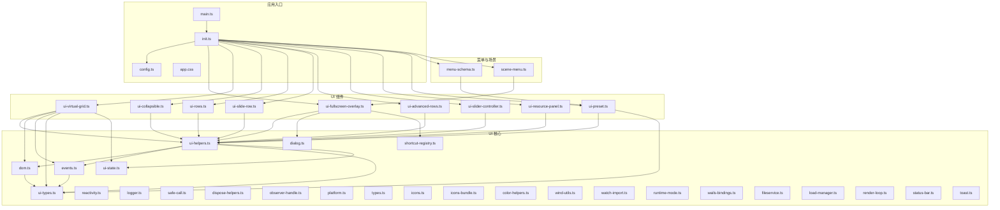
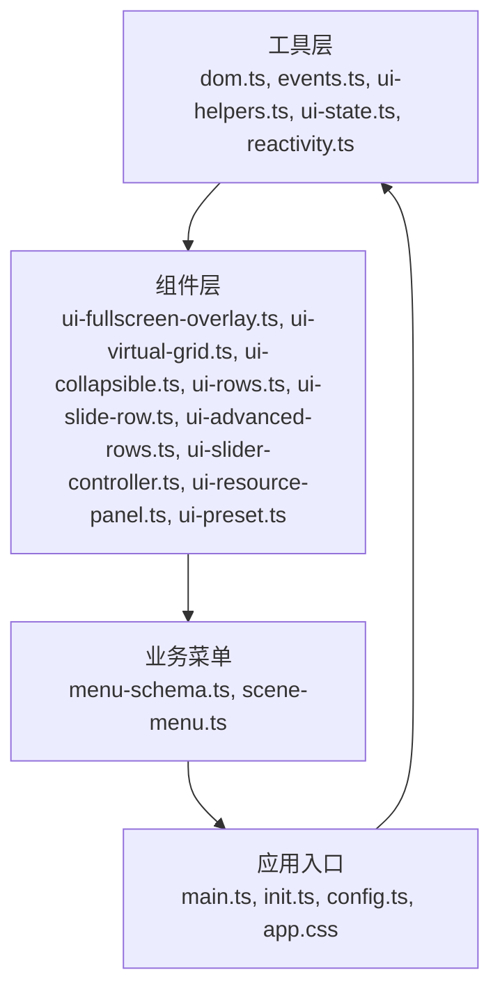
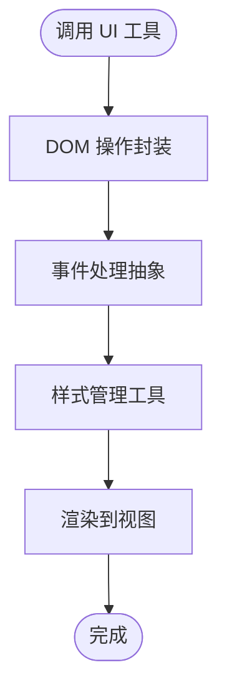
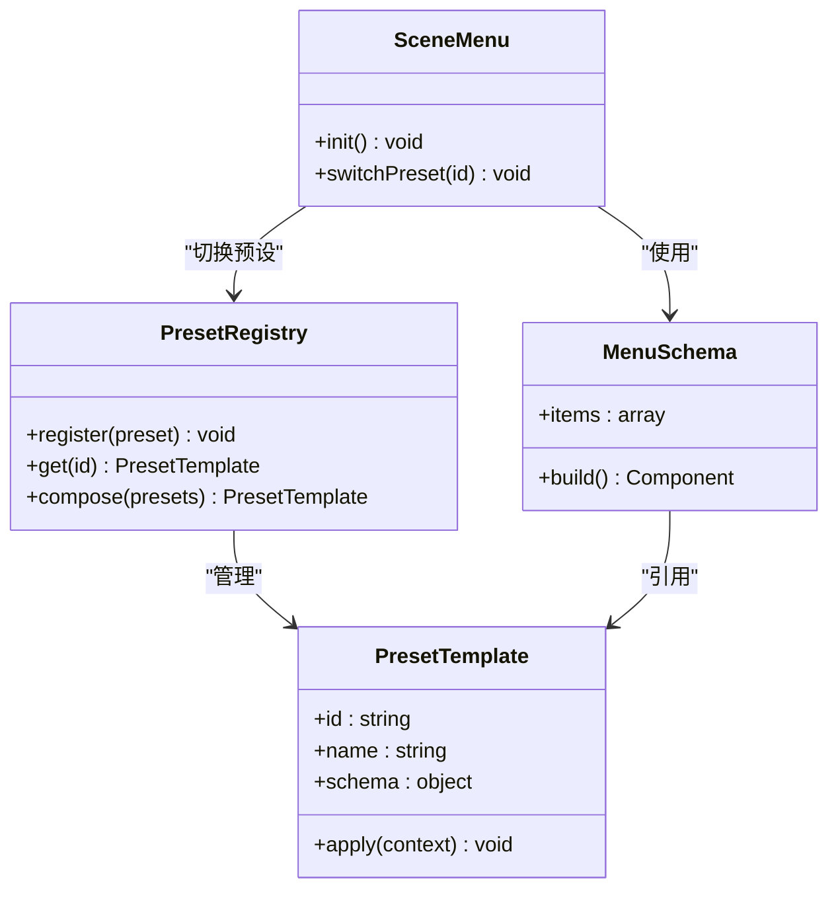
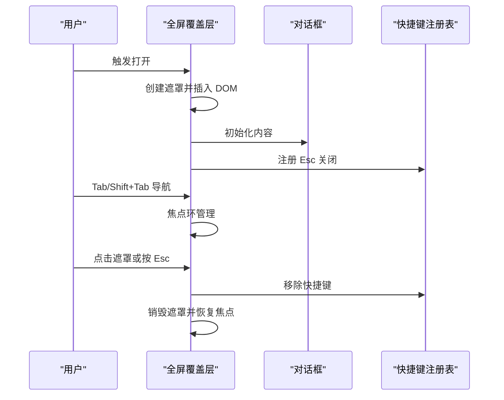
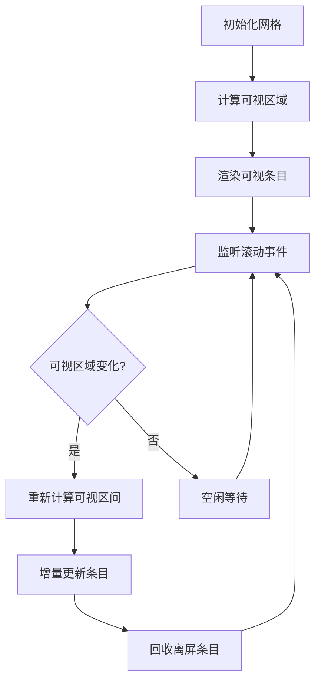
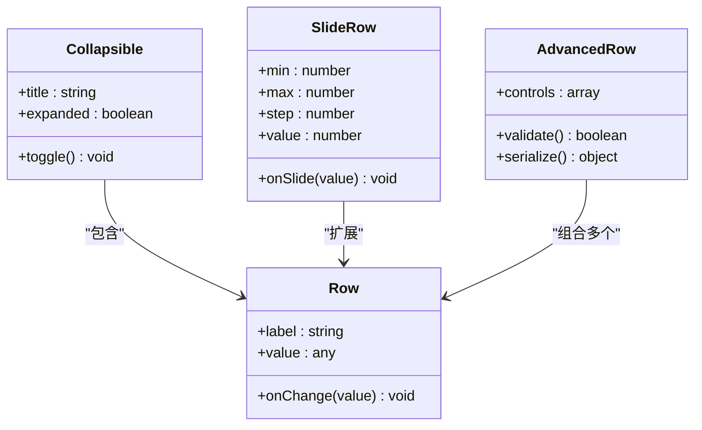
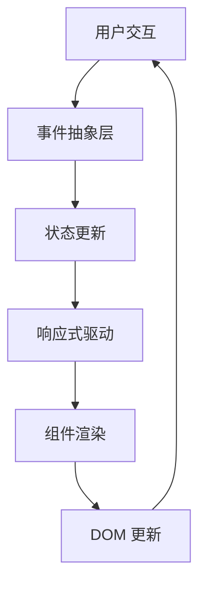
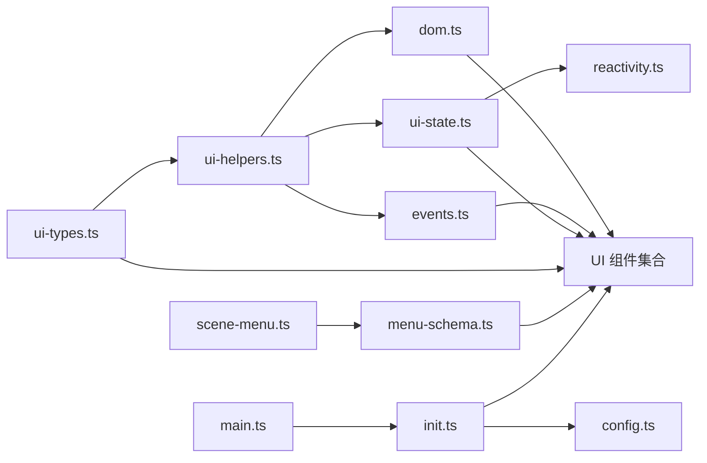

# UI 框架基础

<cite>
**本文引用的文件**   
- [ui-helpers.ts](file://frontend/src/core/ui-helpers.ts)
- [dom.ts](file://frontend/src/core/dom.ts)
- [events.ts](file://frontend/src/core/events.ts)
- [ui-fullscreen-overlay.ts](file://frontend/src/core/ui-fullscreen-overlay.ts)
- [ui-virtual-grid.ts](file://frontend/src/core/ui-virtual-grid.ts)
- [ui-preset.ts](file://frontend/src/core/ui-preset.ts)
- [ui-types.ts](file://frontend/src/core/ui-types.ts)
- [ui-state.ts](file://frontend/src/core/ui-state.ts)
- [shortcut-registry.ts](file://frontend/src/core/shortcut-registry.ts)
- [toast.ts](file://frontend/src/core/toast.ts)
- [dialog.ts](file://frontend/src/core/dialog.ts)
- [ui-collapsible.ts](file://frontend/src/core/ui-collapsible.ts)
- [ui-rows.ts](file://frontend/src/core/ui-rows.ts)
- [ui-slide-row.ts](file://frontend/src/core/ui-slide-row.ts)
- [ui-advanced-rows.ts](file://frontend/src/core/ui-advanced-rows.ts)
- [ui-slider-controller.ts](file://frontend/src/core/ui-slider-controller.ts)
- [ui-resource-panel.ts](file://frontend/src/core/ui-resource-panel.ts)
- [menu-schema.ts](file://frontend/src/menus/menu-schema.ts)
- [scene-menu.ts](file://frontend/src/scene-menu.ts)
- [config.ts](file://frontend/src/config.ts)
- [main.ts](file://frontend/src/core/main.ts)
- [init.ts](file://frontend/src/core/init.ts)
- [platform.ts](file://frontend/src/core/platform.ts)
- [reactivity.ts](file://frontend/src/core/reactivity.ts)
- [logger.ts](file://frontend/src/core/logger.ts)
- [safe-call.ts](file://frontend/src/core/safe-call.ts)
- [dispose-helpers.ts](file://frontend/src/core/dispose-helpers.ts)
- [observer-handle.ts](file://frontend/src/core/observer-handle.ts)
- [status-bar.ts](file://frontend/src/core/status-bar.ts)
- [render-loop.ts](file://frontend/src/core/render-loop.ts)
- [playback-state.ts](file://frontend/src/core/playback-state.ts)
- [library-state.ts](file://frontend/src/core/library-state.ts)
- [freefly-state.ts](file://frontend/src/core/freefly-state.ts)
- [env-state-schema.ts](file://frontend/src/core/env-state-schema.ts)
- [wails-bindings.ts](file://frontend/src/core/wails-bindings.ts)
- [watch-import.ts](file://frontend/src/core/watch-import.ts)
- [wind-utils.ts](file://frontend/src/core/wind-utils.ts)
- [color-helpers.ts](file://frontend/src/core/color-helpers.ts)
- [orbit.ts](file://frontend/src/core/orbit.ts)
- [fileservice.ts](file://frontend/src/core/fileservice.ts)
- [load-manager.ts](file://frontend/src/core/load-manager.ts)
- [runtime-mode.ts](file://frontend/src/core/runtime-mode.ts)
- [types.ts](file://frontend/src/core/types.ts)
- [icons-bundle.ts](file://frontend/src/core/icons-bundle.ts)
- [icons.ts](file://frontend/src/core/icons.ts)
- [app.css](file://frontend/src/app.css)
</cite>

## 目录
1. [简介](#简介)
2. [项目结构](#项目结构)
3. [核心组件](#核心组件)
4. [架构总览](#架构总览)
5. [详细组件分析](#详细组件分析)
6. [依赖分析](#依赖分析)
7. [性能考虑](#性能考虑)
8. [故障排查指南](#故障排查指南)
9. [结论](#结论)
10. [附录](#附录)

## 简介
本文件为前端 UI 框架的基础文档，聚焦以下目标：
- UI 辅助工具函数：DOM 操作封装、事件处理抽象与样式管理工具的设计与使用。
- 预设系统：模板、动态生成与组合模式的应用机制。
- 全屏覆盖层：遮罩层管理、焦点控制与键盘导航。
- 虚拟网格组件：虚拟化渲染、滚动优化与内存管理策略。
- UI 组件开发规范：接口设计、样式约定与测试方法指导原则。

## 项目结构
UI 相关能力集中在 frontend/src/core 目录下，按职责拆分为：
- 通用工具与基础设施：dom.ts、events.ts、ui-helpers.ts、reactivity.ts、logger.ts、safe-call.ts、dispose-helpers.ts、observer-handle.ts、platform.ts、types.ts、icons.ts、icons-bundle.ts、color-helpers.ts、wind-utils.ts、watch-import.ts、runtime-mode.ts、wails-bindings.ts、fileservice.ts、load-manager.ts、render-loop.ts、status-bar.ts、toast.ts、dialog.ts、shortcut-registry.ts。
- UI 组件与布局：ui-fullscreen-overlay.ts、ui-virtual-grid.ts、ui-collapsible.ts、ui-rows.ts、ui-slide-row.ts、ui-advanced-rows.ts、ui-slider-controller.ts、ui-resource-panel.ts、ui-preset.ts、ui-types.ts、ui-state.ts。
- 菜单与场景入口：menus/menu-schema.ts、scene-menu.ts。
- 应用初始化与配置：core/main.ts、core/init.ts、config.ts、app.css。

图表来源
- [ui-helpers.ts](file://frontend/src/core/ui-helpers.ts)
- [dom.ts](file://frontend/src/core/dom.ts)
- [events.ts](file://frontend/src/core/events.ts)
- [ui-fullscreen-overlay.ts](file://frontend/src/core/ui-fullscreen-overlay.ts)
- [ui-virtual-grid.ts](file://frontend/src/core/ui-virtual-grid.ts)
- [ui-preset.ts](file://frontend/src/core/ui-preset.ts)
- [menu-schema.ts](file://frontend/src/menus/menu-schema.ts)
- [scene-menu.ts](file://frontend/src/scene-menu.ts)
- [main.ts](file://frontend/src/core/main.ts)
- [init.ts](file://frontend/src/core/init.ts)
- [config.ts](file://frontend/src/config.ts)
- [app.css](file://frontend/src/app.css)

章节来源
- [main.ts](file://frontend/src/core/main.ts)
- [init.ts](file://frontend/src/core/init.ts)
- [config.ts](file://frontend/src/config.ts)
- [app.css](file://frontend/src/app.css)

## 核心组件
本节概述 UI 框架的关键模块及其职责边界，便于后续深入分析与集成。

- DOM 与事件抽象
  - dom.ts：提供安全的节点创建、属性设置、类名与样式操作、元素查找与生命周期钩子等。
  - events.ts：统一事件注册、去抖节流、事件委托与销毁，屏蔽浏览器差异。
  - ui-helpers.ts：聚合常用 UI 工具（如尺寸计算、可见性判断、坐标转换、动画辅助）。

- 状态与响应式
  - ui-state.ts：UI 状态容器与变更订阅。
  - reactivity.ts：轻量响应式实现，驱动视图更新。
  - observer-handle.ts：观察者句柄与自动清理。

- 组件基元
  - ui-fullscreen-overlay.ts：全屏覆盖层，负责遮罩、焦点与键盘导航。
  - ui-virtual-grid.ts：虚拟网格，负责可视区域渲染与滚动优化。
  - ui-collapsible.ts / ui-rows.ts / ui-slide-row.ts / ui-advanced-rows.ts：可折叠面板与行级控件。
  - ui-slider-controller.ts：滑块控制器，绑定输入与数值范围。
  - ui-resource-panel.ts：资源面板，承载列表/网格展示与交互。
  - ui-preset.ts：预设系统，支持模板、动态生成与组合。

- 系统与平台
  - toast.ts / dialog.ts / status-bar.ts：提示、对话框与状态栏。
  - shortcut-registry.ts：快捷键注册与冲突检测。
  - platform.ts / runtime-mode.ts / wails-bindings.ts：平台与运行时适配。
  - logger.ts / safe-call.ts / dispose-helpers.ts：日志、安全调用与资源释放。
  - render-loop.ts / load-manager.ts / fileservice.ts：渲染循环、加载管理与文件系统。
  - icons.ts / icons-bundle.ts / color-helpers.ts / wind-utils.ts / watch-import.ts / types.ts：图标、颜色、风场工具、导入监听与类型定义。

章节来源
- [ui-helpers.ts](file://frontend/src/core/ui-helpers.ts)
- [dom.ts](file://frontend/src/core/dom.ts)
- [events.ts](file://frontend/src/core/events.ts)
- [ui-state.ts](file://frontend/src/core/ui-state.ts)
- [reactivity.ts](file://frontend/src/core/reactivity.ts)
- [observer-handle.ts](file://frontend/src/core/observer-handle.ts)
- [ui-fullscreen-overlay.ts](file://frontend/src/core/ui-fullscreen-overlay.ts)
- [ui-virtual-grid.ts](file://frontend/src/core/ui-virtual-grid.ts)
- [ui-collapsible.ts](file://frontend/src/core/ui-collapsible.ts)
- [ui-rows.ts](file://frontend/src/core/ui-rows.ts)
- [ui-slide-row.ts](file://frontend/src/core/ui-slide-row.ts)
- [ui-advanced-rows.ts](file://frontend/src/core/ui-advanced-rows.ts)
- [ui-slider-controller.ts](file://frontend/src/core/ui-slider-controller.ts)
- [ui-resource-panel.ts](file://frontend/src/core/ui-resource-panel.ts)
- [ui-preset.ts](file://frontend/src/core/ui-preset.ts)
- [toast.ts](file://frontend/src/core/toast.ts)
- [dialog.ts](file://frontend/src/core/dialog.ts)
- [status-bar.ts](file://frontend/src/core/status-bar.ts)
- [shortcut-registry.ts](file://frontend/src/core/shortcut-registry.ts)
- [platform.ts](file://frontend/src/core/platform.ts)
- [runtime-mode.ts](file://frontend/src/core/runtime-mode.ts)
- [wails-bindings.ts](file://frontend/src/core/wails-bindings.ts)
- [logger.ts](file://frontend/src/core/logger.ts)
- [safe-call.ts](file://frontend/src/core/safe-call.ts)
- [dispose-helpers.ts](file://frontend/src/core/dispose-helpers.ts)
- [render-loop.ts](file://frontend/src/core/render-loop.ts)
- [load-manager.ts](file://frontend/src/core/load-manager.ts)
- [fileservice.ts](file://frontend/src/core/fileservice.ts)
- [icons.ts](file://frontend/src/core/icons.ts)
- [icons-bundle.ts](file://frontend/src/core/icons-bundle.ts)
- [color-helpers.ts](file://frontend/src/core/color-helpers.ts)
- [wind-utils.ts](file://frontend/src/core/wind-utils.ts)
- [watch-import.ts](file://frontend/src/core/watch-import.ts)
- [types.ts](file://frontend/src/core/types.ts)

## 架构总览
UI 框架采用“工具层 + 组件层 + 业务菜单”的分层架构：
- 工具层：提供跨组件复用的 DOM、事件、样式、状态与平台能力。
- 组件层：基于工具层构建可复用 UI 构件（覆盖层、网格、行控件、滑块、资源面板、预设）。
- 业务菜单：通过声明式 schema 与场景入口组织具体功能界面。

图表来源
- [ui-helpers.ts](file://frontend/src/core/ui-helpers.ts)
- [dom.ts](file://frontend/src/core/dom.ts)
- [events.ts](file://frontend/src/core/events.ts)
- [ui-state.ts](file://frontend/src/core/ui-state.ts)
- [reactivity.ts](file://frontend/src/core/reactivity.ts)
- [ui-fullscreen-overlay.ts](file://frontend/src/core/ui-fullscreen-overlay.ts)
- [ui-virtual-grid.ts](file://frontend/src/core/ui-virtual-grid.ts)
- [ui-collapsible.ts](file://frontend/src/core/ui-collapsible.ts)
- [ui-rows.ts](file://frontend/src/core/ui-rows.ts)
- [ui-slide-row.ts](file://frontend/src/core/ui-slide-row.ts)
- [ui-advanced-rows.ts](file://frontend/src/core/ui-advanced-rows.ts)
- [ui-slider-controller.ts](file://frontend/src/core/ui-slider-controller.ts)
- [ui-resource-panel.ts](file://frontend/src/core/ui-resource-panel.ts)
- [ui-preset.ts](file://frontend/src/core/ui-preset.ts)
- [menu-schema.ts](file://frontend/src/menus/menu-schema.ts)
- [scene-menu.ts](file://frontend/src/scene-menu.ts)
- [main.ts](file://frontend/src/core/main.ts)
- [init.ts](file://frontend/src/core/init.ts)
- [config.ts](file://frontend/src/config.ts)
- [app.css](file://frontend/src/app.css)

## 详细组件分析

### UI 辅助工具函数（DOM、事件、样式）
- DOM 操作封装
  - 提供安全的节点创建、属性设置、类名与样式操作、元素查找与生命周期钩子，减少直接操作 DOM 的副作用。
  - 建议将复杂 DOM 逻辑下沉至 dom.ts，并通过 ui-helpers.ts 暴露高层 API。
- 事件处理抽象
  - 统一事件注册、去抖节流、事件委托与销毁，屏蔽浏览器差异，避免内存泄漏。
  - 在组件中优先使用事件抽象，而非原生 addEventListener。
- 样式管理工具
  - 集中处理主题色、间距、阴影、过渡等样式常量与工具函数，配合 app.css 进行全局样式治理。
  - 通过颜色与图标工具（color-helpers.ts、icons.ts、icons-bundle.ts）保证视觉一致性。

章节来源
- [dom.ts](file://frontend/src/core/dom.ts)
- [events.ts](file://frontend/src/core/events.ts)
- [ui-helpers.ts](file://frontend/src/core/ui-helpers.ts)
- [color-helpers.ts](file://frontend/src/core/color-helpers.ts)
- [icons.ts](file://frontend/src/core/icons.ts)
- [icons-bundle.ts](file://frontend/src/core/icons-bundle.ts)
- [app.css](file://frontend/src/app.css)

### 预设系统（模板、动态生成、组合模式）
- 模板与数据模型
  - 通过 ui-preset.ts 定义预设模板与数据结构，结合 ui-types.ts 的类型约束确保一致性。
- 动态生成
  - 根据配置或用户选择动态生成 UI 片段，支持按需加载与懒渲染。
- 组合模式
  - 预设之间可组合复用，形成更复杂的界面行为；通过 menu-schema.ts 声明式描述菜单项与行为。
- 与场景集成
  - scene-menu.ts 作为场景入口，整合预设与菜单，驱动 UI 的初始化与切换。

图表来源
- [ui-preset.ts](file://frontend/src/core/ui-preset.ts)
- [ui-types.ts](file://frontend/src/core/ui-types.ts)
- [menu-schema.ts](file://frontend/src/menus/menu-schema.ts)
- [scene-menu.ts](file://frontend/src/scene-menu.ts)

章节来源
- [ui-preset.ts](file://frontend/src/core/ui-preset.ts)
- [ui-types.ts](file://frontend/src/core/ui-types.ts)
- [menu-schema.ts](file://frontend/src/menus/menu-schema.ts)
- [scene-menu.ts](file://frontend/src/scene-menu.ts)

### 全屏覆盖层（遮罩、焦点、键盘导航）
- 遮罩层管理
  - 覆盖层挂载于根容器，阻止背景交互，支持多层覆盖时的栈管理。
- 焦点控制
  - 进入覆盖层时保存当前焦点，退出时恢复；内部焦点环在覆盖层内循环。
- 键盘导航
  - 支持 Tab/Shift+Tab 顺序导航，Esc 关闭覆盖层，方向键在特定控件间移动。
- 与对话框和 Toast 协作
  - 通过 dialog.ts 与 toast.ts 提供一致的覆盖体验与生命周期管理。

图表来源
- [ui-fullscreen-overlay.ts](file://frontend/src/core/ui-fullscreen-overlay.ts)
- [dialog.ts](file://frontend/src/core/dialog.ts)
- [shortcut-registry.ts](file://frontend/src/core/shortcut-registry.ts)

章节来源
- [ui-fullscreen-overlay.ts](file://frontend/src/core/ui-fullscreen-overlay.ts)
- [dialog.ts](file://frontend/src/core/dialog.ts)
- [shortcut-registry.ts](file://frontend/src/core/shortcut-registry.ts)

### 虚拟网格组件（虚拟化渲染、滚动优化、内存管理）
- 虚拟化渲染
  - 仅渲染可视区域内的条目，超出视口的项目延迟创建或复用。
- 滚动优化
  - 使用滚动监听与增量更新，避免整表重绘；对大型数据集进行分页与预取。
- 内存管理
  - 条目对象池与回收策略，及时释放不再使用的 DOM 与事件监听。
- 与资源面板集成
  - ui-resource-panel.ts 可作为网格的数据源与交互层，提供筛选、排序与选中态。

图表来源
- [ui-virtual-grid.ts](file://frontend/src/core/ui-virtual-grid.ts)
- [ui-resource-panel.ts](file://frontend/src/core/ui-resource-panel.ts)

章节来源
- [ui-virtual-grid.ts](file://frontend/src/core/ui-virtual-grid.ts)
- [ui-resource-panel.ts](file://frontend/src/core/ui-resource-panel.ts)

### 行控件与滑块（可折叠、行、滑动条、高级行）
- 可折叠面板（ui-collapsible.ts）
  - 支持展开/收起动画与状态持久化，适合分组展示复杂选项。
- 行控件（ui-rows.ts、ui-slide-row.ts、ui-advanced-rows.ts）
  - 统一的行布局与对齐，支持标签、值、说明与校验反馈。
- 滑块控制器（ui-slider-controller.ts）
  - 绑定输入与数值范围，支持步进、限制与实时预览。

图表来源
- [ui-collapsible.ts](file://frontend/src/core/ui-collapsible.ts)
- [ui-rows.ts](file://frontend/src/core/ui-rows.ts)
- [ui-slide-row.ts](file://frontend/src/core/ui-slide-row.ts)
- [ui-advanced-rows.ts](file://frontend/src/core/ui-advanced-rows.ts)
- [ui-slider-controller.ts](file://frontend/src/core/ui-slider-controller.ts)

章节来源
- [ui-collapsible.ts](file://frontend/src/core/ui-collapsible.ts)
- [ui-rows.ts](file://frontend/src/core/ui-rows.ts)
- [ui-slide-row.ts](file://frontend/src/core/ui-slide-row.ts)
- [ui-advanced-rows.ts](file://frontend/src/core/ui-advanced-rows.ts)
- [ui-slider-controller.ts](file://frontend/src/core/ui-slider-controller.ts)

### 概念总览（非代码映射）
以下为概念性流程图，用于帮助理解 UI 框架的整体工作流，不直接对应具体源码文件。

[此图为概念流程，无需图表来源]

## 依赖分析
UI 框架内部依赖关系清晰，遵循低耦合高内聚原则：
- 工具层被所有组件依赖，避免重复实现。
- 组件层通过 ui-types.ts 与 ui-state.ts 保持接口一致。
- 菜单层通过声明式 schema 解耦具体组件实现。
- 应用入口负责装配与初始化，注入平台与运行时信息。

图表来源
- [ui-types.ts](file://frontend/src/core/ui-types.ts)
- [ui-helpers.ts](file://frontend/src/core/ui-helpers.ts)
- [ui-state.ts](file://frontend/src/core/ui-state.ts)
- [reactivity.ts](file://frontend/src/core/reactivity.ts)
- [dom.ts](file://frontend/src/core/dom.ts)
- [events.ts](file://frontend/src/core/events.ts)
- [menu-schema.ts](file://frontend/src/menus/menu-schema.ts)
- [scene-menu.ts](file://frontend/src/scene-menu.ts)
- [main.ts](file://frontend/src/core/main.ts)
- [init.ts](file://frontend/src/core/init.ts)
- [config.ts](file://frontend/src/config.ts)

章节来源
- [ui-types.ts](file://frontend/src/core/ui-types.ts)
- [ui-helpers.ts](file://frontend/src/core/ui-helpers.ts)
- [ui-state.ts](file://frontend/src/core/ui-state.ts)
- [reactivity.ts](file://frontend/src/core/reactivity.ts)
- [dom.ts](file://frontend/src/core/dom.ts)
- [events.ts](file://frontend/src/core/events.ts)
- [menu-schema.ts](file://frontend/src/menus/menu-schema.ts)
- [scene-menu.ts](file://frontend/src/scene-menu.ts)
- [main.ts](file://frontend/src/core/main.ts)
- [init.ts](file://frontend/src/core/init.ts)
- [config.ts](file://frontend/src/config.ts)

## 性能考虑
- 虚拟化与增量更新
  - 虚拟网格仅在可视区域内渲染，滚动时增量更新，避免全量重绘。
- 事件去抖与节流
  - 高频事件（滚动、输入）使用去抖/节流降低回调频率。
- 资源释放
  - 组件销毁时主动移除事件监听与 DOM 引用，防止内存泄漏。
- 渲染循环协调
  - 与 render-loop.ts 协同，避免在每帧中进行昂贵的 UI 计算。
- 状态最小化
  - 使用 ui-state.ts 与 reactivity.ts 精确订阅，减少不必要的重渲染。

[本节为通用性能指导，无需章节来源]

## 故障排查指南
- 焦点丢失或键盘导航异常
  - 检查覆盖层的焦点环与快捷键注册是否正确初始化与清理。
  - 参考快捷键注册表的冲突检测与优先级规则。
- 虚拟网格卡顿或内存增长
  - 确认条目回收策略是否生效，是否存在未释放的事件监听或 DOM 引用。
  - 检查滚动监听是否频繁触发且未做节流。
- 预设无法应用或组合失败
  - 核对 ui-preset.ts 的模板结构与 ui-types.ts 的类型约束是否匹配。
  - 查看 menu-schema.ts 的声明是否与预设 ID 一致。
- 样式不一致或主题失效
  - 检查 color-helpers.ts 与 app.css 的主题变量是否被正确注入。
  - 确认图标与颜色工具的使用路径与命名约定。

章节来源
- [ui-fullscreen-overlay.ts](file://frontend/src/core/ui-fullscreen-overlay.ts)
- [shortcut-registry.ts](file://frontend/src/core/shortcut-registry.ts)
- [ui-virtual-grid.ts](file://frontend/src/core/ui-virtual-grid.ts)
- [ui-preset.ts](file://frontend/src/core/ui-preset.ts)
- [ui-types.ts](file://frontend/src/core/ui-types.ts)
- [menu-schema.ts](file://frontend/src/menus/menu-schema.ts)
- [color-helpers.ts](file://frontend/src/core/color-helpers.ts)
- [app.css](file://frontend/src/app.css)

## 结论
本 UI 框架以工具层为基础，通过清晰的组件分层与声明式菜单组织，实现了可扩展、高性能且易维护的前端界面体系。重点在于：
- 工具函数的稳定与可复用。
- 预设系统的模板化与组合能力。
- 覆盖层的无障碍与焦点管理。
- 虚拟网格的渲染与内存优化。
- 组件开发的接口与样式规范。

[本节为总结，无需章节来源]

## 附录
- UI 组件开发规范
  - 接口设计
    - 明确 props 与事件契约，使用 ui-types.ts 定义类型。
    - 组件应暴露最小必要 API，内部状态通过 ui-state.ts 管理。
  - 样式约定
    - 使用 color-helpers.ts 与 app.css 中的主题变量，避免硬编码颜色与尺寸。
    - 图标通过 icons.ts 与 icons-bundle.ts 引入，保持一致性与可替换性。
  - 测试方法
    - 单元测试：针对工具函数与组件逻辑编写用例，模拟 DOM 与事件环境。
    - 集成测试：验证覆盖层焦点与键盘导航、虚拟网格滚动与内存回收。
    - 回归测试：预设组合与菜单渲染的端到端场景。
  - 生命周期与资源管理
    - 组件初始化时注册事件与观察者，销毁时主动清理。
    - 使用 dispose-helpers.ts 与 observer-handle.ts 简化资源释放。
  - 错误处理与日志
    - 使用 logger.ts 记录关键路径与异常堆栈。
    - 使用 safe-call.ts 包裹可能失败的调用，避免崩溃。

章节来源
- [ui-types.ts](file://frontend/src/core/ui-types.ts)
- [ui-state.ts](file://frontend/src/core/ui-state.ts)
- [color-helpers.ts](file://frontend/src/core/color-helpers.ts)
- [app.css](file://frontend/src/app.css)
- [icons.ts](file://frontend/src/core/icons.ts)
- [icons-bundle.ts](file://frontend/src/core/icons-bundle.ts)
- [dispose-helpers.ts](file://frontend/src/core/dispose-helpers.ts)
- [observer-handle.ts](file://frontend/src/core/observer-handle.ts)
- [logger.ts](file://frontend/src/core/logger.ts)
- [safe-call.ts](file://frontend/src/core/safe-call.ts)