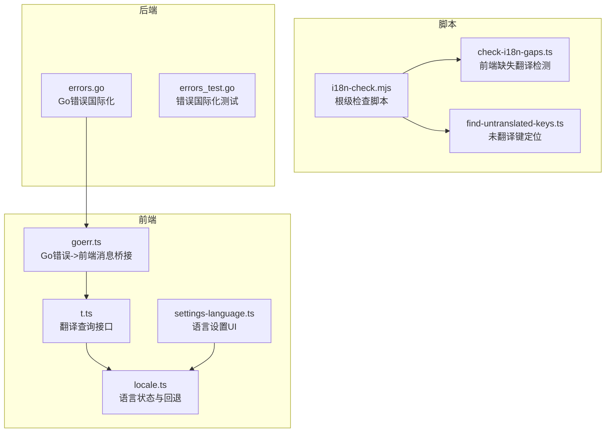
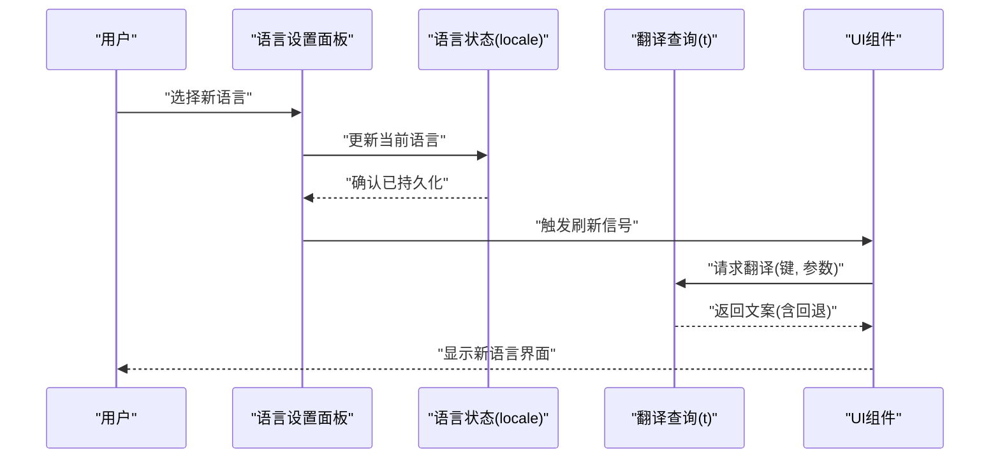
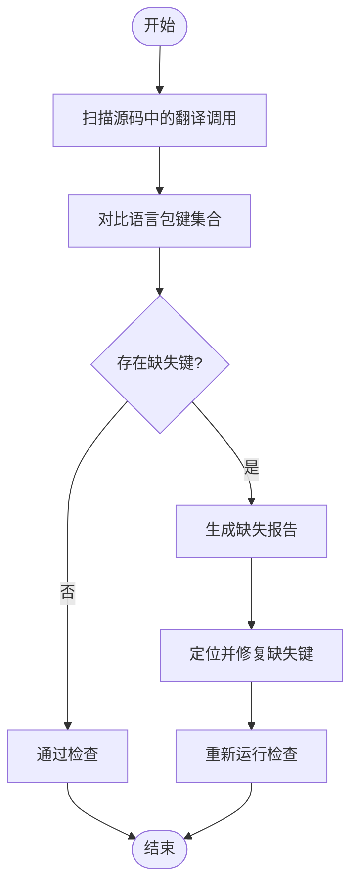
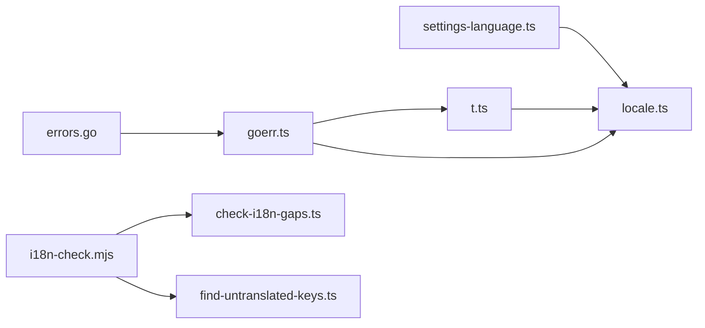

# 国际化支持

<cite>
**本文引用的文件**
- [frontend/src/core/i18n/t.ts](file://frontend/src/core/i18n/t.ts)
- [frontend/src/core/i18n/locale.ts](file://frontend/src/core/i18n/locale.ts)
- [frontend/src/core/i18n/goerr.ts](file://frontend/src/core/i18n/goerr.ts)
- [frontend/src/menus/settings-language.ts](file://frontend/src/menus/settings-language.ts)
- [scripts/i18n-check.mjs](file://scripts/i18n-check.mjs)
- [frontend/scripts/check-i18n-gaps.ts](file://frontend/scripts/check-i18n-gaps.ts)
- [frontend/scripts/find-untranslated-keys.ts](file://frontend/scripts/find-untranslated-keys.ts)
- [internal/i18nerr/errors.go](file://internal/i18nerr/errors.go)
- [internal/i18nerr/errors_test.go](file://internal/i18nerr/errors_test.go)
- [docs/adr/adr-059-i18n-framework.md](file://docs/adr/adr-059-i18n-framework.md)
</cite>

## 目录
1. [简介](#简介)
2. [项目结构](#项目结构)
3. [核心组件](#核心组件)
4. [架构总览](#架构总览)
5. [详细组件分析](#详细组件分析)
6. [依赖关系分析](#依赖关系分析)
7. [性能考虑](#性能考虑)
8. [故障排查指南](#故障排查指南)
9. [结论](#结论)
10. [附录](#附录)

## 简介
本文件面向开发者与维护者，系统化阐述 MikuMikuAR 的国际化（i18n）体系：语言包管理、运行时切换与回退策略、翻译键治理规范、缺失翻译检测工具链、以及多语言开发最佳实践。文档同时覆盖前端 TypeScript 层与后端 Go 层的错误消息国际化能力，并给出可落地的流程建议与质量保障手段。

## 项目结构
国际化相关代码主要分布在以下位置：
- 前端 i18n 核心：位于 frontend/src/core/i18n，提供 t 函数、语言状态与错误消息国际化桥接。
- 设置面板：位于 frontend/src/menus/settings-language.ts，提供用户界面中的语言选择与切换入口。
- 脚本工具：位于 scripts 与 frontend/scripts，提供缺失翻译检测、覆盖率检查等自动化能力。
- 后端错误国际化：位于 internal/i18nerr，提供 Go 侧的错误消息国际化实现与测试。
- ADR 设计决策：docs/adr/adr-059-i18n-framework.md 记录了框架选型与设计要点。

图表来源
- [frontend/src/core/i18n/t.ts](file://frontend/src/core/i18n/t.ts)
- [frontend/src/core/i18n/locale.ts](file://frontend/src/core/i18n/locale.ts)
- [frontend/src/core/i18n/goerr.ts](file://frontend/src/core/i18n/goerr.ts)
- [frontend/src/menus/settings-language.ts](file://frontend/src/menus/settings-language.ts)
- [scripts/i18n-check.mjs](file://scripts/i18n-check.mjs)
- [frontend/scripts/check-i18n-gaps.ts](file://frontend/scripts/check-i18n-gaps.ts)
- [frontend/scripts/find-untranslated-keys.ts](file://frontend/scripts/find-untranslated-keys.ts)
- [internal/i18nerr/errors.go](file://internal/i18nerr/errors.go)
- [internal/i18nerr/errors_test.go](file://internal/i18nerr/errors_test.go)

章节来源
- [docs/adr/adr-059-i18n-framework.md](file://docs/adr/adr-059-i18n-framework.md)

## 核心组件
- 翻译查询接口（t.ts）
  - 职责：对外暴露统一的翻译查询函数，负责按当前语言查找对应文案，并在缺失时执行回退逻辑。
  - 关键点：键名解析、参数插值、回退顺序（如从目标语言到默认语言）。
- 语言状态与回退（locale.ts）
  - 职责：维护当前语言、默认语言与回退策略；提供语言变更事件或响应式更新机制，驱动 UI 刷新。
  - 关键点：持久化用户偏好、浏览器语言探测、回退链构建。
- Go 错误国际化桥接（goerr.ts）
  - 职责：将后端 Go 错误码映射为前端可读的多语言消息，统一错误展示体验。
  - 关键点：错误码表、消息模板、参数注入。
- 语言设置面板（settings-language.ts）
  - 职责：提供语言列表、预览与切换操作；触发语言状态更新与必要的 UI 重建。
  - 关键点：切换幂等性、最小重渲染范围、缓存失效策略。
- 脚本工具
  - i18n-check.mjs：根级集成入口，串联各子任务，输出报告与退出码。
  - check-i18n-gaps.ts：扫描前端源码中的翻译调用，对比语言包，生成缺失清单。
  - find-untranslated-keys.ts：定位具体文件中未翻译的键，辅助快速修复。
- 后端错误国际化（errors.go, errors_test.go）
  - 职责：定义错误类型与多语言消息映射，提供测试用例确保消息完整性与一致性。
  - 关键点：错误码枚举、消息模板、测试断言。

章节来源
- [frontend/src/core/i18n/t.ts](file://frontend/src/core/i18n/t.ts)
- [frontend/src/core/i18n/locale.ts](file://frontend/src/core/i18n/locale.ts)
- [frontend/src/core/i18n/goerr.ts](file://frontend/src/core/i18n/goerr.ts)
- [frontend/src/menus/settings-language.ts](file://frontend/src/menus/settings-language.ts)
- [scripts/i18n-check.mjs](file://scripts/i18n-check.mjs)
- [frontend/scripts/check-i18n-gaps.ts](file://frontend/scripts/check-i18n-gaps.ts)
- [frontend/scripts/find-untranslated-keys.ts](file://frontend/scripts/find-untranslated-keys.ts)
- [internal/i18nerr/errors.go](file://internal/i18nerr/errors.go)
- [internal/i18nerr/errors_test.go](file://internal/i18nerr/errors_test.go)

## 架构总览
下图展示了运行时语言切换的关键流程：用户在设置中选择语言，系统更新语言状态，触发 UI 组件重新渲染，并通过 t 函数获取最新文案。

图表来源
- [frontend/src/menus/settings-language.ts](file://frontend/src/menus/settings-language.ts)
- [frontend/src/core/i18n/locale.ts](file://frontend/src/core/i18n/locale.ts)
- [frontend/src/core/i18n/t.ts](file://frontend/src/core/i18n/t.ts)

## 详细组件分析

### 翻译查询接口（t.ts）
- 设计要点
  - 统一入口：所有 UI 文本通过 t(key, params?) 获取，避免硬编码字符串。
  - 回退策略：当目标语言缺失键时，自动回退至默认语言或其他约定语言。
  - 参数插值：支持占位符替换，便于动态内容注入。
- 复杂度与优化
  - 查找时间复杂度通常为 O(1)（哈希表），但需关注嵌套对象访问成本。
  - 建议对高频键进行局部缓存，减少重复解析。
- 错误处理
  - 缺失键应记录告警日志，便于审计与修复。
  - 对于关键路径，可提供“安全模式”回退文案，避免空白显示。

章节来源
- [frontend/src/core/i18n/t.ts](file://frontend/src/core/i18n/t.ts)

### 语言状态与回退（locale.ts）
- 设计要点
  - 状态源：单一语言状态源，集中管理当前语言、默认语言与回退链。
  - 持久化：用户选择写入本地存储，启动时优先恢复。
  - 事件驱动：语言变更发出事件，订阅者按需刷新。
- 回退机制
  - 回退顺序示例：用户语言 → 区域变体 → 基础语言 → 默认语言。
  - 缺失键时逐级回退，直至找到可用文案或兜底提示。
- 性能考量
  - 避免在每次渲染中重建回退链，应在初始化或语言切换时计算一次。
  - 使用细粒度订阅，仅刷新受影响的 UI 片段。

章节来源
- [frontend/src/core/i18n/locale.ts](file://frontend/src/core/i18n/locale.ts)

### Go 错误国际化桥接（goerr.ts）
- 设计要点
  - 错误码映射：将 Go 错误码映射为前端键名，再由 t 函数解析为多语言消息。
  - 参数注入：错误上下文信息（如文件名、行号）作为参数传入模板。
- 与后端协作
  - 后端 errors.go 定义错误码与消息模板，前端 goerr.ts 负责桥接与展示。
  - 测试覆盖：后端 errors_test.go 验证消息完整性与格式正确性。

章节来源
- [frontend/src/core/i18n/goerr.ts](file://frontend/src/core/i18n/goerr.ts)
- [internal/i18nerr/errors.go](file://internal/i18nerr/errors.go)
- [internal/i18nerr/errors_test.go](file://internal/i18nerr/errors_test.go)

### 语言设置面板（settings-language.ts）
- 设计要点
  - 语言列表：根据可用语言包动态生成选项。
  - 切换流程：调用语言状态更新接口，触发 UI 刷新与必要缓存失效。
  - 用户体验：切换前后可提供预览或即时反馈，避免页面闪烁。
- 交互细节
  - 幂等切换：若选择与当前语言相同，则跳过刷新。
  - 最小重渲染：仅刷新受语言影响的面板与文本节点。

章节来源
- [frontend/src/menus/settings-language.ts](file://frontend/src/menus/settings-language.ts)

### 缺失翻译检测工具链
- 根级脚本（i18n-check.mjs）
  - 作用：聚合多个子任务，统一输出报告与退出码，便于 CI 集成。
  - 典型步骤：扫描源码、对比语言包、生成差异报告、失败条件判断。
- 前端缺失检测（check-i18n-gaps.ts）
  - 作用：扫描前端源码中的翻译调用，识别缺失的键与语言包。
  - 输出：缺失键清单、受影响文件列表、修复建议。
- 未翻译键定位（find-untranslated-keys.ts）
  - 作用：针对具体文件或模块，定位未翻译的键，提升修复效率。
  - 用法：结合 IDE 搜索与批量替换，快速补齐文案。

图表来源
- [scripts/i18n-check.mjs](file://scripts/i18n-check.mjs)
- [frontend/scripts/check-i18n-gaps.ts](file://frontend/scripts/check-i18n-gaps.ts)
- [frontend/scripts/find-untranslated-keys.ts](file://frontend/scripts/find-untranslated-keys.ts)

章节来源
- [scripts/i18n-check.mjs](file://scripts/i18n-check.mjs)
- [frontend/scripts/check-i18n-gaps.ts](file://frontend/scripts/check-i18n-gaps.ts)
- [frontend/scripts/find-untranslated-keys.ts](file://frontend/scripts/find-untranslated-keys.ts)

### 后端错误国际化（errors.go, errors_test.go）
- 设计要点
  - 错误码枚举：集中定义错误码，避免魔法数字。
  - 消息模板：支持参数化模板，便于注入上下文信息。
  - 测试覆盖：errors_test.go 验证消息完整性、模板解析与边界情况。
- 与前端协作
  - 前端 goerr.ts 将后端错误码映射为前端键，再经 t 函数解析为多语言消息。
  - 保持前后端错误码一致，避免映射断裂。

章节来源
- [internal/i18nerr/errors.go](file://internal/i18nerr/errors.go)
- [internal/i18nerr/errors_test.go](file://internal/i18nerr/errors_test.go)
- [frontend/src/core/i18n/goerr.ts](file://frontend/src/core/i18n/goerr.ts)

## 依赖关系分析
- 组件耦合
  - settings-language.ts 依赖 locale.ts 的状态更新能力。
  - t.ts 依赖 locale.ts 的回退链配置。
  - goerr.ts 依赖 t.ts 的翻译查询与 locale.ts 的语言状态。
- 外部依赖
  - 脚本工具依赖文件系统与 AST 解析能力，用于源码扫描与键提取。
  - 后端错误国际化依赖 Go 标准库与自定义错误类型。
- 潜在循环依赖
  - 应避免 t.ts 与 locale.ts 之间相互导入，采用单向依赖（t 读 locale）。
- 接口契约
  - t 函数的签名与参数约定需保持稳定，避免破坏性变更。
  - 语言状态变更事件需明确生命周期与副作用范围。

图表来源
- [frontend/src/menus/settings-language.ts](file://frontend/src/menus/settings-language.ts)
- [frontend/src/core/i18n/locale.ts](file://frontend/src/core/i18n/locale.ts)
- [frontend/src/core/i18n/t.ts](file://frontend/src/core/i18n/t.ts)
- [frontend/src/core/i18n/goerr.ts](file://frontend/src/core/i18n/goerr.ts)
- [scripts/i18n-check.mjs](file://scripts/i18n-check.mjs)
- [frontend/scripts/check-i18n-gaps.ts](file://frontend/scripts/check-i18n-gaps.ts)
- [frontend/scripts/find-untranslated-keys.ts](file://frontend/scripts/find-untranslated-keys.ts)
- [internal/i18nerr/errors.go](file://internal/i18nerr/errors.go)

章节来源
- [frontend/src/menus/settings-language.ts](file://frontend/src/menus/settings-language.ts)
- [frontend/src/core/i18n/locale.ts](file://frontend/src/core/i18n/locale.ts)
- [frontend/src/core/i18n/t.ts](file://frontend/src/core/i18n/t.ts)
- [frontend/src/core/i18n/goerr.ts](file://frontend/src/core/i18n/goerr.ts)
- [scripts/i18n-check.mjs](file://scripts/i18n-check.mjs)
- [frontend/scripts/check-i18n-gaps.ts](file://frontend/scripts/check-i18n-gaps.ts)
- [frontend/scripts/find-untranslated-keys.ts](file://frontend/scripts/find-untranslated-keys.ts)
- [internal/i18nerr/errors.go](file://internal/i18nerr/errors.go)

## 性能考虑
- 渲染优化
  - 使用细粒度订阅，仅在语言切换时刷新受影响组件，避免全量重绘。
  - 对高频翻译键进行局部缓存，减少重复查找与插值开销。
- 回退链优化
  - 预计算回退链，避免在运行时频繁构建。
  - 对缺失键进行一次性统计与告警，避免重复日志输出。
- 资源加载
  - 语言包按需加载，避免首屏过大。
  - 对常用语言包进行预取与缓存，提升切换速度。

[本节为通用性能指导，不直接分析具体文件]

## 故障排查指南
- 常见问题
  - 缺失翻译：通过 check-i18n-gaps.ts 与 find-untranslated-keys.ts 定位缺失键，及时补齐。
  - 回退异常：检查 locale.ts 的回退链配置与默认语言设置是否正确。
  - 错误消息不一致：核对后端 errors.go 与前端的 goerr.ts 映射是否一致。
- 调试技巧
  - 启用缺失键告警日志，观察控制台输出。
  - 使用语言设置面板切换不同语言，验证 UI 刷新与缓存失效。
  - 运行 i18n-check.mjs 集成脚本，查看完整报告与退出码。
- 回归保障
  - 将缺失翻译检查纳入 CI 流水线，阻止合并包含缺失键的变更。
  - 对关键错误路径添加单元测试，确保消息模板解析正确。

章节来源
- [frontend/scripts/check-i18n-gaps.ts](file://frontend/scripts/check-i18n-gaps.ts)
- [frontend/scripts/find-untranslated-keys.ts](file://frontend/scripts/find-untranslated-keys.ts)
- [scripts/i18n-check.mjs](file://scripts/i18n-check.mjs)
- [frontend/src/core/i18n/locale.ts](file://frontend/src/core/i18n/locale.ts)
- [frontend/src/core/i18n/goerr.ts](file://frontend/src/core/i18n/goerr.ts)
- [internal/i18nerr/errors.go](file://internal/i18nerr/errors.go)
- [internal/i18nerr/errors_test.go](file://internal/i18nerr/errors_test.go)

## 结论
本项目的前后端国际化体系以 t.ts 与 locale.ts 为核心，配合设置面板与脚本工具，形成了完整的语言管理与质量保障闭环。通过明确的键名规范、回退策略与自动化检测，能够有效降低多语言维护成本，提升用户体验与开发效率。建议在持续集成中强化缺失翻译检查，并对关键错误路径完善测试覆盖。

[本节为总结性内容，不直接分析具体文件]

## 附录
- 键名规范与命名约定
  - 采用层级式键名，如 module.section.item，便于组织与检索。
  - 避免在键名中包含可变信息，使用参数插值替代。
  - 保持键名稳定，避免破坏性变更，必要时引入版本后缀。
- 版本控制与分支策略
  - 语言包变更应与功能变更同步提交，确保一致性。
  - 使用语义化版本标记语言包，便于回滚与追踪。
- 翻译工作流程
  - 新增文案前先提取键，再补充翻译，最后运行检查脚本验证。
  - 定期审查缺失翻译报告，及时修复遗漏。
- 质量保证
  - 对关键错误消息进行端到端测试，确保在不同语言下显示正确。
  - 引入人工评审环节，确保翻译质量与术语一致性。

[本节为通用指导，不直接分析具体文件]