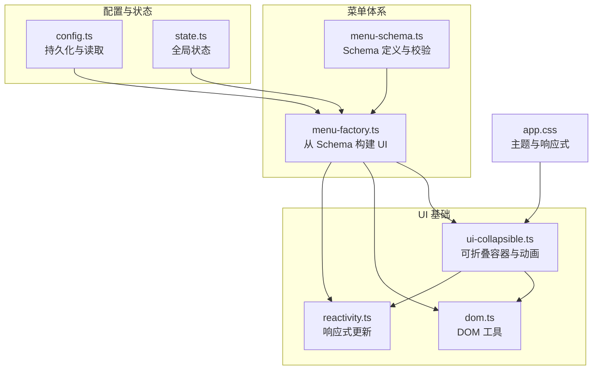
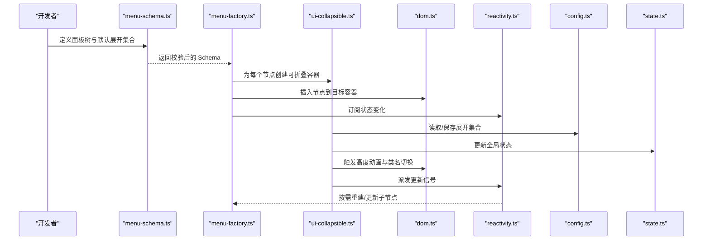
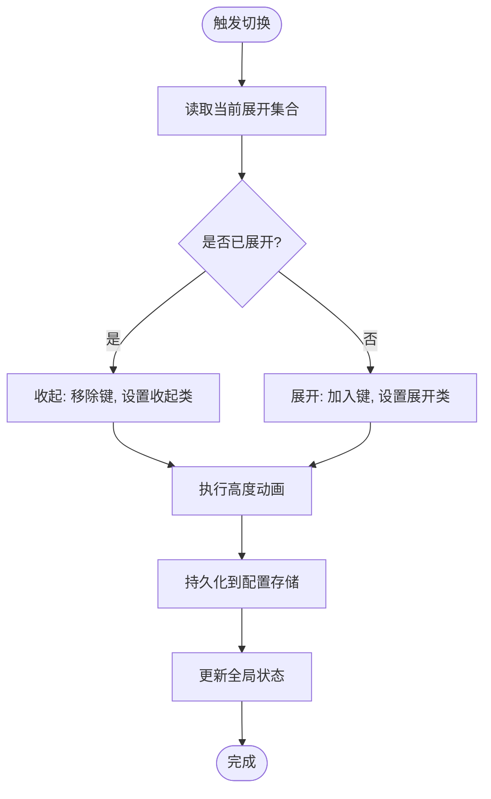
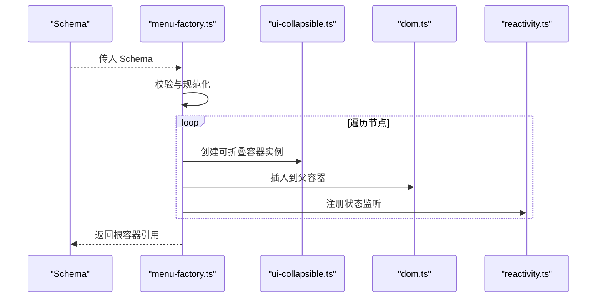
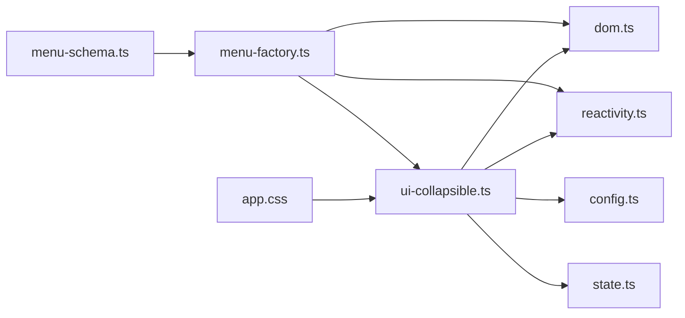

# 可折叠面板

<cite>
**本文引用的文件**   
- [ui-collapsible.ts](file://frontend/src/core/ui-collapsible.ts)
- [menu-schema.ts](file://frontend/src/menus/menu-schema.ts)
- [menu-factory.ts](file://frontend/src/menus/menu-factory.ts)
- [config.ts](file://frontend/src/core/config.ts)
- [state.ts](file://frontend/src/core/state.ts)
- [reactivity.ts](file://frontend/src/core/reactivity.ts)
- [dom.ts](file://frontend/src/core/dom.ts)
- [app.css](file://frontend/src/app.css)
</cite>

## 目录
1. [简介](#简介)
2. [项目结构](#项目结构)
3. [核心组件](#核心组件)
4. [架构总览](#架构总览)
5. [详细组件分析](#详细组件分析)
6. [依赖分析](#依赖分析)
7. [性能考虑](#性能考虑)
8. [故障排查指南](#故障排查指南)
9. [结论](#结论)
10. [附录](#附录)

## 简介
本文件围绕“可折叠面板”的设计模式与实现原理，系统阐述展开/收起动画、状态持久化、用户交互优化、嵌套结构与层级管理、样式定制与主题适配、响应式布局等关键议题。文档以代码级事实为依据，结合可视化图示，帮助读者快速理解并高效使用可折叠面板能力。

## 项目结构
可折叠面板的核心位于前端 UI 基础库与菜单体系：
- 基础能力：提供可折叠容器、动画、事件与 DOM 操作封装
- 声明式配置：通过菜单 Schema 描述面板的层级、默认展开态与行为
- 渲染工厂：将 Schema 转换为实际 DOM 节点并绑定交互
- 配置与状态：负责持久化与跨会话恢复
- 样式与主题：统一 CSS 变量与断点，支撑多主题与响应式

图表来源
- [ui-collapsible.ts](file://frontend/src/core/ui-collapsible.ts)
- [menu-schema.ts](file://frontend/src/menus/menu-schema.ts)
- [menu-factory.ts](file://frontend/src/menus/menu-factory.ts)
- [config.ts](file://frontend/src/core/config.ts)
- [state.ts](file://frontend/src/core/state.ts)
- [reactivity.ts](file://frontend/src/core/reactivity.ts)
- [dom.ts](file://frontend/src/core/dom.ts)
- [app.css](file://frontend/src/app.css)

章节来源
- [ui-collapsible.ts](file://frontend/src/core/ui-collapsible.ts)
- [menu-schema.ts](file://frontend/src/menus/menu-schema.ts)
- [menu-factory.ts](file://frontend/src/menus/menu-factory.ts)
- [config.ts](file://frontend/src/core/config.ts)
- [state.ts](file://frontend/src/core/state.ts)
- [reactivity.ts](file://frontend/src/core/reactivity.ts)
- [dom.ts](file://frontend/src/core/dom.ts)
- [app.css](file://frontend/src/app.css)

## 核心组件
- 可折叠容器（ui-collapsible）
  - 职责：维护展开/收起状态、驱动高度动画、处理键盘与点击交互、支持嵌套
  - 关键点：使用 CSS 过渡或 JS 动画；避免重排抖动；对子项进行懒渲染或按需挂载
- 菜单 Schema（menu-schema）
  - 职责：声明面板树形结构、默认展开集合、分组与禁用态
  - 关键点：键空间唯一性、层级深度限制、默认值与校验
- 菜单工厂（menu-factory）
  - 职责：解析 Schema、创建 DOM、绑定事件、注入可折叠容器
  - 关键点：一次性构建与增量更新策略、事件委托
- 配置与状态（config/state）
  - 职责：持久化展开集合、应用启动时恢复、变更监听与回写
  - 关键点：防抖写入、版本兼容、错误降级
- 响应式与 DOM（reactivity/dom）
  - 职责：最小化 DOM 操作、批量更新、无障碍属性同步
  - 关键点：避免频繁 reflow、合并样式更新

章节来源
- [ui-collapsible.ts](file://frontend/src/core/ui-collapsible.ts)
- [menu-schema.ts](file://frontend/src/menus/menu-schema.ts)
- [menu-factory.ts](file://frontend/src/menus/menu-factory.ts)
- [config.ts](file://frontend/src/core/config.ts)
- [state.ts](file://frontend/src/core/state.ts)
- [reactivity.ts](file://frontend/src/core/reactivity.ts)
- [dom.ts](file://frontend/src/core/dom.ts)

## 架构总览
下图展示从 Schema 到最终 UI 的完整链路，以及状态持久化的闭环。

图表来源
- [menu-schema.ts](file://frontend/src/menus/menu-schema.ts)
- [menu-factory.ts](file://frontend/src/menus/menu-factory.ts)
- [ui-collapsible.ts](file://frontend/src/core/ui-collapsible.ts)
- [dom.ts](file://frontend/src/core/dom.ts)
- [reactivity.ts](file://frontend/src/core/reactivity.ts)
- [config.ts](file://frontend/src/core/config.ts)
- [state.ts](file://frontend/src/core/state.ts)

## 详细组件分析

### 可折叠容器（ui-collapsible）
- 设计要点
  - 状态模型：以“键路径”表示节点，值为布尔态；支持集合去重与批量更新
  - 动画策略：优先使用 CSS transition 控制 max-height/opacity；必要时回退到 requestAnimationFrame 插值
  - 交互体验：支持点击头部、键盘 Enter/Space、ARIA 属性同步、焦点可见性
  - 嵌套支持：父子联动可选（互斥/独立），递归遍历子节点
  - 性能优化：仅对可视区域执行动画；延迟计算高度；避免在动画中修改布局属性
- 关键流程（展开/收起）

图表来源
- [ui-collapsible.ts](file://frontend/src/core/ui-collapsible.ts)
- [config.ts](file://frontend/src/core/config.ts)
- [state.ts](file://frontend/src/core/state.ts)

章节来源
- [ui-collapsible.ts](file://frontend/src/core/ui-collapsible.ts)
- [config.ts](file://frontend/src/core/config.ts)
- [state.ts](file://frontend/src/core/state.ts)

### 菜单 Schema（menu-schema）
- 职责
  - 定义面板树：id、label、children、defaultExpanded、disabled、meta 等
  - 约束与校验：键唯一、层级深度上限、类型检查、默认值填充
  - 导出标准化结构供工厂消费
- 典型字段说明（概念性）
  - id：节点唯一标识，用于状态键
  - label：显示文本，支持国际化键
  - children：子节点数组
  - defaultExpanded：初始展开集合
  - disabled：禁用交互
  - meta：扩展元信息（如图标、快捷键提示）

章节来源
- [menu-schema.ts](file://frontend/src/menus/menu-schema.ts)

### 菜单工厂（menu-factory）
- 职责
  - 将 Schema 映射为真实 DOM 树
  - 为每个节点注入可折叠容器与事件处理器
  - 根据状态差异进行增量更新
- 关键流程（构建）

图表来源
- [menu-factory.ts](file://frontend/src/menus/menu-factory.ts)
- [ui-collapsible.ts](file://frontend/src/core/ui-collapsible.ts)
- [dom.ts](file://frontend/src/core/dom.ts)
- [reactivity.ts](file://frontend/src/core/reactivity.ts)

章节来源
- [menu-factory.ts](file://frontend/src/menus/menu-factory.ts)
- [dom.ts](file://frontend/src/core/dom.ts)
- [reactivity.ts](file://frontend/src/core/reactivity.ts)

### 配置与状态（config/state）
- 职责
  - 持久化：将展开集合序列化存储，支持版本迁移与容错
  - 恢复：应用启动时加载默认与上次状态，合并冲突
  - 变更：监听状态变化，触发 UI 刷新
- 注意事项
  - 写入防抖与批处理
  - 异常降级：存储不可用时回退内存态
  - 键空间隔离：不同模块使用命名空间前缀

章节来源
- [config.ts](file://frontend/src/core/config.ts)
- [state.ts](file://frontend/src/core/state.ts)

### 样式与主题（app.css）
- 主题变量
  - 颜色、圆角、阴影、间距等通过 CSS 变量暴露，便于深色/浅色主题切换
- 响应式
  - 基于断点的布局调整：侧边栏宽度、字体大小、触控热区
- 动画
  - 统一的过渡时长与缓动函数，保证一致体验

章节来源
- [app.css](file://frontend/src/app.css)

## 依赖分析
- 内聚与耦合
  - ui-collapsible 低耦合于 dom 与 reactivity，高内聚于自身状态与动画逻辑
  - menu-factory 作为装配层，集中依赖 schema、collapsible、dom、reactivity
  - config/state 被 collapsible 与 factory 共同消费，形成单向数据流
- 外部集成点
  - 浏览器存储 API（由 config 抽象）
  - 无障碍与键盘事件（由 dom 与 collapsible 协作）

图表来源
- [menu-schema.ts](file://frontend/src/menus/menu-schema.ts)
- [menu-factory.ts](file://frontend/src/menus/menu-factory.ts)
- [ui-collapsible.ts](file://frontend/src/core/ui-collapsible.ts)
- [dom.ts](file://frontend/src/core/dom.ts)
- [reactivity.ts](file://frontend/src/core/reactivity.ts)
- [config.ts](file://frontend/src/core/config.ts)
- [state.ts](file://frontend/src/core/state.ts)
- [app.css](file://frontend/src/app.css)

章节来源
- [menu-schema.ts](file://frontend/src/menus/menu-schema.ts)
- [menu-factory.ts](file://frontend/src/menus/menu-factory.ts)
- [ui-collapsible.ts](file://frontend/src/core/ui-collapsible.ts)
- [dom.ts](file://frontend/src/core/dom.ts)
- [reactivity.ts](file://frontend/src/core/reactivity.ts)
- [config.ts](file://frontend/src/core/config.ts)
- [state.ts](file://frontend/src/core/state.ts)
- [app.css](file://frontend/src/app.css)

## 性能考虑
- 动画性能
  - 优先使用 GPU 友好的 CSS transition；避免在动画期间读写布局属性
  - 对深层嵌套采用惰性计算高度，仅在首次展开时测量
- 渲染性能
  - 使用增量更新与事件委托减少重复绑定
  - 对大型列表采用虚拟滚动或分页加载
- 存储性能
  - 展开集合变更合并写入，降低 I/O 频率
  - 大对象分片存储与压缩

[本节为通用指导，不直接分析具体文件]

## 故障排查指南
- 常见问题
  - 状态未持久化：检查存储权限与降级逻辑
  - 动画卡顿：确认未阻塞主线程的重排操作
  - 嵌套冲突：核对父子联动策略与键空间隔离
  - 主题失效：确认 CSS 变量作用域与覆盖顺序
- 定位建议
  - 在 collapsible 切换处增加日志输出
  - 使用浏览器性能面板观察重排/重绘热点
  - 验证 Schema 键唯一性与层级深度

章节来源
- [ui-collapsible.ts](file://frontend/src/core/ui-collapsible.ts)
- [config.ts](file://frontend/src/core/config.ts)
- [menu-schema.ts](file://frontend/src/menus/menu-schema.ts)

## 结论
可折叠面板通过“声明式 Schema + 工厂渲染 + 轻量容器”的组合，实现了高内聚、易扩展的交互能力。配合状态持久化与主题/响应式方案，可在复杂应用中稳定运行并提供一致的用户体验。建议在新增功能时遵循键空间隔离、增量更新与 GPU 友好动画的最佳实践。

[本节为总结性内容，不直接分析具体文件]

## 附录

### 使用示例（步骤指引）
- 定义面板树
  - 在 Schema 中声明 id、label、children、defaultExpanded 等字段
- 渲染面板
  - 调用工厂方法传入 Schema，获取根容器并插入页面
- 交互与持久化
  - 用户点击头部切换状态；自动持久化并在下次启动恢复
- 主题与响应式
  - 通过 CSS 变量切换主题；利用断点适配移动端

章节来源
- [menu-schema.ts](file://frontend/src/menus/menu-schema.ts)
- [menu-factory.ts](file://frontend/src/menus/menu-factory.ts)
- [ui-collapsible.ts](file://frontend/src/core/ui-collapsible.ts)
- [config.ts](file://frontend/src/core/config.ts)
- [app.css](file://frontend/src/app.css)

### 高级配置选项（概念性清单）
- 动画参数：时长、缓动曲线、是否启用弹性
- 联动策略：父子互斥、兄弟互斥、完全独立
- 懒加载：首次展开才渲染子节点
- 无障碍：aria-expanded、role、tabindex 控制
- 主题变量：颜色、圆角、阴影、间距、字号
- 响应式：断点阈值、触控热区尺寸

[本节为概念性说明，不直接分析具体文件]