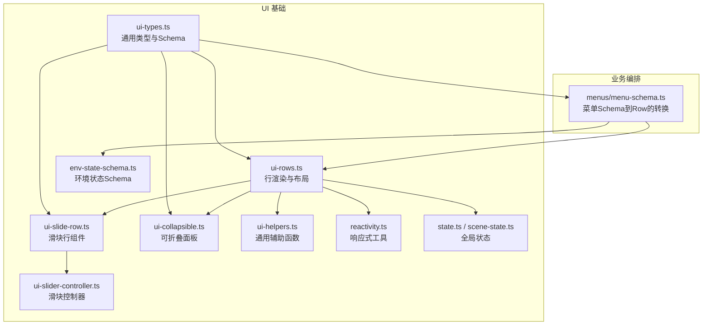
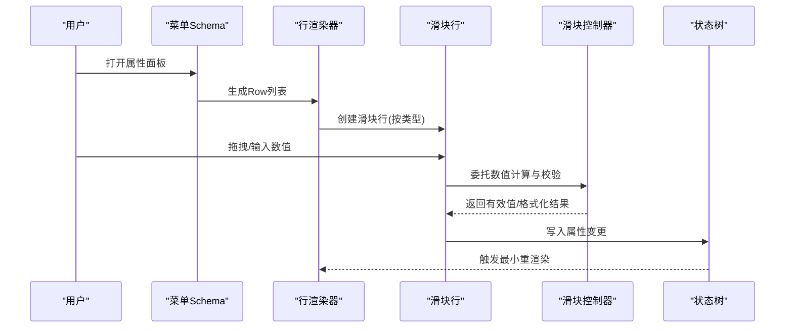
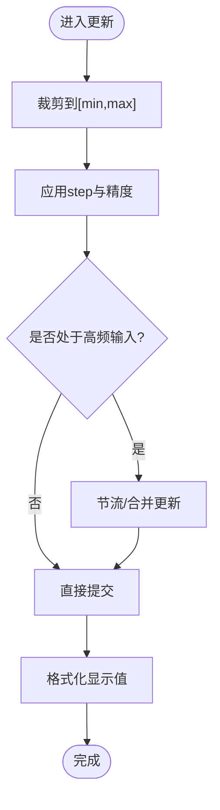
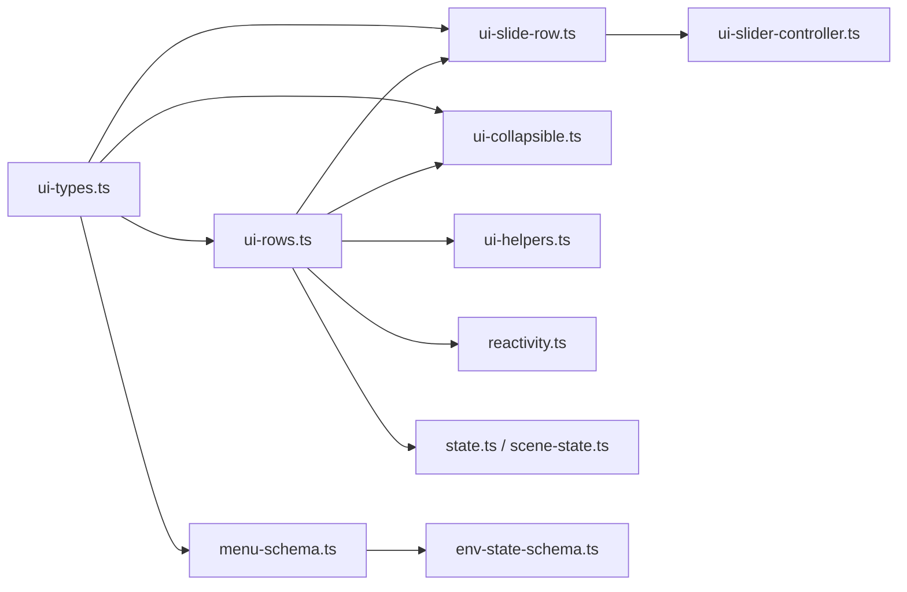

# 属性编辑器

<cite>
**本文引用的文件**   
- [ui-types.ts](file://frontend/src/core/ui-types.ts)
- [ui-rows.ts](file://frontend/src/core/ui-rows.ts)
- [ui-slide-row.ts](file://frontend/src/core/ui-slide-row.ts)
- [ui-slider-controller.ts](file://frontend/src/core/ui-slider-controller.ts)
- [ui-collapsible.ts](file://frontend/src/core/ui-collapsible.ts)
- [ui-helpers.ts](file://frontend/src/core/ui-helpers.ts)
- [reactivity.ts](file://frontend/src/core/reactivity.ts)
- [state.ts](file://frontend/src/core/state.ts)
- [scene-state.ts](file://frontend/src/core/scene-state.ts)
- [env-state-schema.ts](file://frontend/src/core/env-state-schema.ts)
- [menu-schema.ts](file://frontend/src/menus/menu-schema.ts)
- [slider-controller.test.ts](file://frontend/src/core/__tests__/slider-controller.test.ts)
</cite>

## 目录
1. [简介](#简介)
2. [项目结构](#项目结构)
3. [核心组件](#核心组件)
4. [架构总览](#架构总览)
5. [详细组件分析](#详细组件分析)
6. [依赖分析](#依赖分析)
7. [性能考虑](#性能考虑)
8. [故障排查指南](#故障排查指南)
9. [结论](#结论)
10. [附录](#附录)

## 简介
本文件面向“基于行（Row）系统”的属性编辑架构，系统性说明输入控件（滑块、颜色选择器、下拉框等）的实现与使用方式；解释可折叠面板的设计模式与展开/收起状态的持久化机制；深入解析滑块控制器的数值范围验证、实时更新与性能优化策略；并提供自定义属性控件的开发指南，包括接口规范、数据绑定机制与样式定制方法。文档同时给出代码级图示与最佳实践，帮助读者快速上手并扩展属性编辑能力。

## 项目结构
属性编辑相关的前端实现集中在 core 与 menus 两个层次：
- core 层提供通用的 UI 类型定义、行渲染框架、滑块控制器、可折叠面板、响应式工具等基础能力。
- menus 层通过声明式菜单 Schema 将业务属性映射为 Row 列表，驱动 UI 渲染与交互。

图表来源
- [ui-types.ts:1-200](file://frontend/src/core/ui-types.ts#L1-L200)
- [ui-rows.ts:1-200](file://frontend/src/core/ui-rows.ts#L1-L200)
- [ui-slide-row.ts:1-200](file://frontend/src/core/ui-slide-row.ts#L1-L200)
- [ui-slider-controller.ts:1-200](file://frontend/src/core/ui-slider-controller.ts#L1-L200)
- [ui-collapsible.ts:1-200](file://frontend/src/core/ui-collapsible.ts#L1-L200)
- [ui-helpers.ts:1-200](file://frontend/src/core/ui-helpers.ts#L1-L200)
- [reactivity.ts:1-200](file://frontend/src/core/reactivity.ts#L1-L200)
- [state.ts:1-200](file://frontend/src/core/state.ts#L1-L200)
- [scene-state.ts:1-200](file://frontend/src/core/scene-state.ts#L1-L200)
- [env-state-schema.ts:1-200](file://frontend/src/core/env-state-schema.ts#L1-L200)
- [menu-schema.ts:1-200](file://frontend/src/menus/menu-schema.ts#L1-L200)

章节来源
- [ui-types.ts:1-200](file://frontend/src/core/ui-types.ts#L1-L200)
- [ui-rows.ts:1-200](file://frontend/src/core/ui-rows.ts#L1-L200)
- [ui-slide-row.ts:1-200](file://frontend/src/core/ui-slide-row.ts#L1-L200)
- [ui-slider-controller.ts:1-200](file://frontend/src/core/ui-slider-controller.ts#L1-L200)
- [ui-collapsible.ts:1-200](file://frontend/src/core/ui-collapsible.ts#L1-L200)
- [ui-helpers.ts:1-200](file://frontend/src/core/ui-helpers.ts#L1-L200)
- [reactivity.ts:1-200](file://frontend/src/core/reactivity.ts#L1-L200)
- [state.ts:1-200](file://frontend/src/core/state.ts#L1-L200)
- [scene-state.ts:1-200](file://frontend/src/core/scene-state.ts#L1-L200)
- [env-state-schema.ts:1-200](file://frontend/src/core/env-state-schema.ts#L1-L200)
- [menu-schema.ts:1-200](file://frontend/src/menus/menu-schema.ts#L1-L200)

## 核心组件
- 行系统与类型定义
  - 统一描述属性项的元数据与行为，如标签、提示、默认值、校验规则、显示格式、联动条件等。
  - 支持多种控件类型：数字/浮点、布尔、枚举下拉、颜色、文本、路径选择等。
- 行渲染器
  - 根据类型动态创建对应控件实例，处理事件绑定、更新与撤销/重做集成。
  - 负责布局、分组、对齐、禁用态、只读态等展示逻辑。
- 滑块控制器
  - 封装拖拽/滚轮/键盘输入的统一处理，提供范围校验、步进、精度控制、防抖节流、增量计算等能力。
- 可折叠面板
  - 管理分组标题与内容区域，维护展开/收起状态，支持本地存储持久化。
- 响应式与状态
  - 将属性变更以最小粒度推送到状态树，避免不必要的重渲染。
- 菜单 Schema 到 Row 的映射
  - 在业务层用声明式配置生成 Row 列表，屏蔽底层渲染细节。

章节来源
- [ui-types.ts:1-200](file://frontend/src/core/ui-types.ts#L1-L200)
- [ui-rows.ts:1-200](file://frontend/src/core/ui-rows.ts#L1-L200)
- [ui-slide-row.ts:1-200](file://frontend/src/core/ui-slide-row.ts#L1-L200)
- [ui-slider-controller.ts:1-200](file://frontend/src/core/ui-slider-controller.ts#L1-L200)
- [ui-collapsible.ts:1-200](file://frontend/src/core/ui-collapsible.ts#L1-L200)
- [reactivity.ts:1-200](file://frontend/src/core/reactivity.ts#L1-L200)
- [menu-schema.ts:1-200](file://frontend/src/menus/menu-schema.ts#L1-L200)

## 架构总览
下图展示了从“菜单 Schema”到“行渲染”，再到“控件交互与状态更新”的整体流程。

图表来源
- [menu-schema.ts:1-200](file://frontend/src/menus/menu-schema.ts#L1-L200)
- [ui-rows.ts:1-200](file://frontend/src/core/ui-rows.ts#L1-L200)
- [ui-slide-row.ts:1-200](file://frontend/src/core/ui-slide-row.ts#L1-L200)
- [ui-slider-controller.ts:1-200](file://frontend/src/core/ui-slider-controller.ts#L1-L200)
- [state.ts:1-200](file://frontend/src/core/state.ts#L1-L200)

## 详细组件分析

### 行系统与类型定义（ui-types.ts）
- 职责
  - 定义所有属性项的公共字段与控件特定字段。
  - 提供类型守卫与默认值合并逻辑，确保渲染一致性。
- 关键设计
  - 统一的“键路径”用于定位状态树中的具体属性。
  - 校验规则与格式化函数解耦，便于复用与测试。
  - 联动条件与可见性控制，减少无关选项对用户的干扰。
- 复杂度
  - 类型合并与守卫为 O(n)，n 为字段数量，通常较小。
- 优化建议
  - 对大型表单采用懒加载与按需渲染，结合虚拟滚动。

章节来源
- [ui-types.ts:1-200](file://frontend/src/core/ui-types.ts#L1-L200)

### 行渲染器（ui-rows.ts）
- 职责
  - 遍历 Row 列表，按类型分发到具体控件组件。
  - 处理分组、分隔线、占位符、错误提示等通用 UI。
- 关键设计
  - 事件冒泡与合成事件统一处理，避免重复绑定。
  - 与响应式系统集成，仅更新受影响节点。
- 性能
  - 使用稳定 key 与最小 diff，避免整表重绘。
- 可扩展性
  - 新增控件类型只需注册一个渲染分支与对应组件。

章节来源
- [ui-rows.ts:1-200](file://frontend/src/core/ui-rows.ts#L1-L200)

### 滑块行（ui-slide-row.ts）
- 职责
  - 将滑块控制器与输入框、预览值、单位、步进等组合成完整交互。
- 关键设计
  - 输入框与滑杆双向绑定，保持视觉与状态一致。
  - 支持快捷键（如方向键微调）、鼠标滚轮缩放。
- 交互细节
  - 拖拽开始/结束分别触发不同回调，便于区分实时预览与最终提交。
  - 失焦时进行边界修正与格式化。

章节来源
- [ui-slide-row.ts:1-200](file://frontend/src/core/ui-slide-row.ts#L1-L200)

### 滑块控制器（ui-slider-controller.ts）
- 职责
  - 集中处理数值计算、范围校验、步进与精度、防抖节流、增量推导等。
- 核心算法要点
  - 范围裁剪：将输入值限制在 [min, max] 区间。
  - 步进与精度：根据 step 与小数位数四舍五入或截断。
  - 增量推导：根据指针位移与灵敏度换算为数值变化。
  - 防抖/节流：高频输入下降低状态更新频率，保证流畅度。
- 复杂度
  - 单次计算 O(1)，批量更新可通过批处理合并。
- 测试覆盖
  - 单元测试覆盖边界值、步进、精度、越界修正等场景。

图表来源
- [ui-slider-controller.ts:1-200](file://frontend/src/core/ui-slider-controller.ts#L1-L200)

章节来源
- [ui-slider-controller.ts:1-200](file://frontend/src/core/ui-slider-controller.ts#L1-L200)
- [slider-controller.test.ts:1-200](file://frontend/src/core/__tests__/slider-controller.test.ts#L1-L200)

### 可折叠面板（ui-collapsible.ts）
- 职责
  - 管理分组标题与内容区域的展开/收起。
  - 维护每个分组的展开状态，支持本地存储持久化。
- 持久化机制
  - 使用稳定的分组标识作为键，将展开状态序列化后存入本地存储。
  - 初始化时读取本地状态，恢复上次会话的布局。
- 交互
  - 点击标题切换状态，支持键盘无障碍操作。
  - 动画过渡平滑，避免抖动。

章节来源
- [ui-collapsible.ts:1-200](file://frontend/src/core/ui-collapsible.ts#L1-L200)

### 菜单 Schema 到 Row 的映射（menu-schema.ts）
- 职责
  - 将业务层的菜单配置转换为 Row 列表，供渲染器消费。
  - 根据运行时上下文（如当前选中对象、权限、语言）动态过滤与排序。
- 关键设计
  - 声明式优先：尽量通过配置表达 UI 行为，减少硬编码。
  - 条件渲染：基于可见性与启用条件动态生成 Row。
  - 国际化：标签与提示文案走 i18n 键。

章节来源
- [menu-schema.ts:1-200](file://frontend/src/menus/menu-schema.ts#L1-L200)

### 响应式与状态（reactivity.ts / state.ts / scene-state.ts / env-state-schema.ts）
- 职责
  - 提供细粒度的订阅与通知，避免全量重渲染。
  - 将属性变更写入状态树，并与持久化、撤销/重做、预设系统对接。
- 关键设计
  - 路径式访问：通过键路径精确更新目标属性。
  - 变更合并：对频繁更新进行批处理与去抖。
  - 环境状态 Schema：约束环境相关属性的结构与取值域。

章节来源
- [reactivity.ts:1-200](file://frontend/src/core/reactivity.ts#L1-L200)
- [state.ts:1-200](file://frontend/src/core/state.ts#L1-L200)
- [scene-state.ts:1-200](file://frontend/src/core/scene-state.ts#L1-L200)
- [env-state-schema.ts:1-200](file://frontend/src/core/env-state-schema.ts#L1-L200)

### 通用辅助（ui-helpers.ts）
- 职责
  - 提供常用工具函数：格式化、校验、事件包装、DOM 操作等。
- 设计原则
  - 纯函数优先，便于测试与复用。
  - 与平台差异隔离，提高跨端兼容性。

章节来源
- [ui-helpers.ts:1-200](file://frontend/src/core/ui-helpers.ts#L1-L200)

## 依赖分析
- 内聚与耦合
  - ui-types.ts 被多个组件引用，属于高内聚的基础契约。
  - ui-rows.ts 依赖 ui-types.ts 与 ui-helpers.ts，低耦合地分发到各控件。
  - ui-slide-row.ts 与 ui-slider-controller.ts 形成强协作关系。
  - ui-collapsible.ts 独立性强，主要与本地存储交互。
- 外部依赖
  - 状态与响应式系统位于 core 层内部，不引入额外 UI 框架耦合。
- 潜在循环
  - 当前分层清晰，未见循环依赖迹象。

图表来源
- [ui-types.ts:1-200](file://frontend/src/core/ui-types.ts#L1-L200)
- [ui-rows.ts:1-200](file://frontend/src/core/ui-rows.ts#L1-L200)
- [ui-slide-row.ts:1-200](file://frontend/src/core/ui-slide-row.ts#L1-L200)
- [ui-slider-controller.ts:1-200](file://frontend/src/core/ui-slider-controller.ts#L1-L200)
- [ui-collapsible.ts:1-200](file://frontend/src/core/ui-collapsible.ts#L1-L200)
- [ui-helpers.ts:1-200](file://frontend/src/core/ui-helpers.ts#L1-L200)
- [reactivity.ts:1-200](file://frontend/src/core/reactivity.ts#L1-L200)
- [state.ts:1-200](file://frontend/src/core/state.ts#L1-L200)
- [scene-state.ts:1-200](file://frontend/src/core/scene-state.ts#L1-L200)
- [env-state-schema.ts:1-200](file://frontend/src/core/env-state-schema.ts#L1-L200)
- [menu-schema.ts:1-200](file://frontend/src/menus/menu-schema.ts#L1-L200)

章节来源
- [ui-types.ts:1-200](file://frontend/src/core/ui-types.ts#L1-L200)
- [ui-rows.ts:1-200](file://frontend/src/core/ui-rows.ts#L1-L200)
- [ui-slide-row.ts:1-200](file://frontend/src/core/ui-slide-row.ts#L1-L200)
- [ui-slider-controller.ts:1-200](file://frontend/src/core/ui-slider-controller.ts#L1-L200)
- [ui-collapsible.ts:1-200](file://frontend/src/core/ui-collapsible.ts#L1-L200)
- [ui-helpers.ts:1-200](file://frontend/src/core/ui-helpers.ts#L1-L200)
- [reactivity.ts:1-200](file://frontend/src/core/reactivity.ts#L1-L200)
- [state.ts:1-200](file://frontend/src/core/state.ts#L1-L200)
- [scene-state.ts:1-200](file://frontend/src/core/scene-state.ts#L1-L200)
- [env-state-schema.ts:1-200](file://frontend/src/core/env-state-schema.ts#L1-L200)
- [menu-schema.ts:1-200](file://frontend/src/menus/menu-schema.ts#L1-L200)

## 性能考虑
- 输入节流与批处理
  - 滑块高频更新时使用节流/合并策略，降低状态更新频率。
- 最小重渲染
  - 借助响应式系统的路径式订阅，仅更新受影响的 DOM 片段。
- 虚拟化与懒加载
  - 对大量属性行采用虚拟滚动与按需渲染，减少首屏压力。
- 计算卸载
  - 复杂计算放入 Web Worker 或延迟到空闲帧执行。
- 样式与布局
  - 避免强制同步布局，合并样式更新，减少回流与重绘。

[本节为通用指导，无需源码引用]

## 故障排查指南
- 滑块数值异常
  - 检查 min/max 与 step 配置是否正确，确认越界裁剪与精度处理逻辑。
  - 查看单元测试覆盖的边界用例，复现问题后补充回归测试。
- 状态未更新
  - 确认键路径与状态树结构一致，检查响应式订阅是否生效。
  - 排查是否存在多次覆盖写入导致的状态丢失。
- 可折叠状态未持久化
  - 检查本地存储键名冲突与序列化/反序列化异常。
  - 确认初始化顺序，避免在存储就绪前读取空值。
- 菜单 Schema 不生效
  - 核对可见性与启用条件，确认国际化键存在且翻译正确。
  - 打印生成的 Row 列表，定位缺失或错误的条目。

章节来源
- [slider-controller.test.ts:1-200](file://frontend/src/core/__tests__/slider-controller.test.ts#L1-L200)
- [ui-slider-controller.ts:1-200](file://frontend/src/core/ui-slider-controller.ts#L1-L200)
- [ui-collapsible.ts:1-200](file://frontend/src/core/ui-collapsible.ts#L1-L200)
- [menu-schema.ts:1-200](file://frontend/src/menus/menu-schema.ts#L1-L200)

## 结论
基于行的属性编辑架构通过类型驱动的声明式配置，实现了高度可复用与可扩展的 UI 体系。滑块控制器提供了稳健的数值交互体验，可折叠面板则提升了信息密度与可用性。配合响应式状态与菜单 Schema，整体方案在保证性能的同时，兼顾了可维护性与可测试性。

[本节为总结，无需源码引用]

## 附录

### 自定义属性控件开发指南
- 步骤概览
  - 在类型定义中声明新的控件类型与字段。
  - 在行渲染器中增加该类型的渲染分支。
  - 实现控件组件，处理输入、校验与格式化。
  - 与状态系统对接，确保变更能写回状态树。
  - 编写单元测试，覆盖边界与异常路径。
- 接口规范
  - 输入：Row 元数据、当前值、变更回调、禁用/只读态。
  - 输出：标准化后的新值、可选的错误消息。
- 数据绑定机制
  - 使用键路径与响应式订阅，避免手动 DOM 操作。
  - 对于高频输入，采用节流/合并策略。
- 样式定制
  - 通过 CSS 变量或主题类名进行外观定制。
  - 保持语义化结构，便于无障碍与自动化测试。
- 示例参考
  - 参考现有滑块行与滑块控制器的实现，对照其职责划分与事件流。

章节来源
- [ui-types.ts:1-200](file://frontend/src/core/ui-types.ts#L1-L200)
- [ui-rows.ts:1-200](file://frontend/src/core/ui-rows.ts#L1-L200)
- [ui-slide-row.ts:1-200](file://frontend/src/core/ui-slide-row.ts#L1-L200)
- [ui-slider-controller.ts:1-200](file://frontend/src/core/ui-slider-controller.ts#L1-L200)
- [reactivity.ts:1-200](file://frontend/src/core/reactivity.ts#L1-L200)