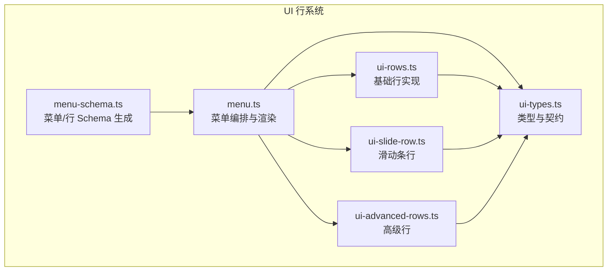
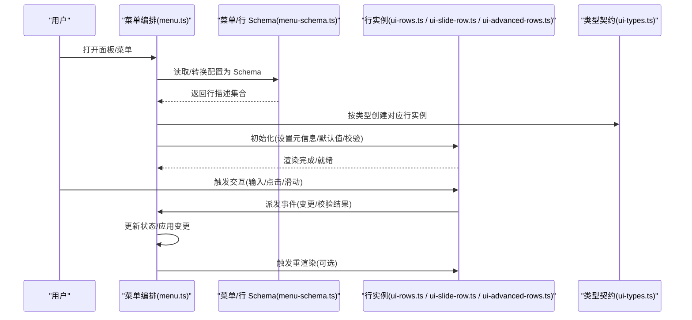
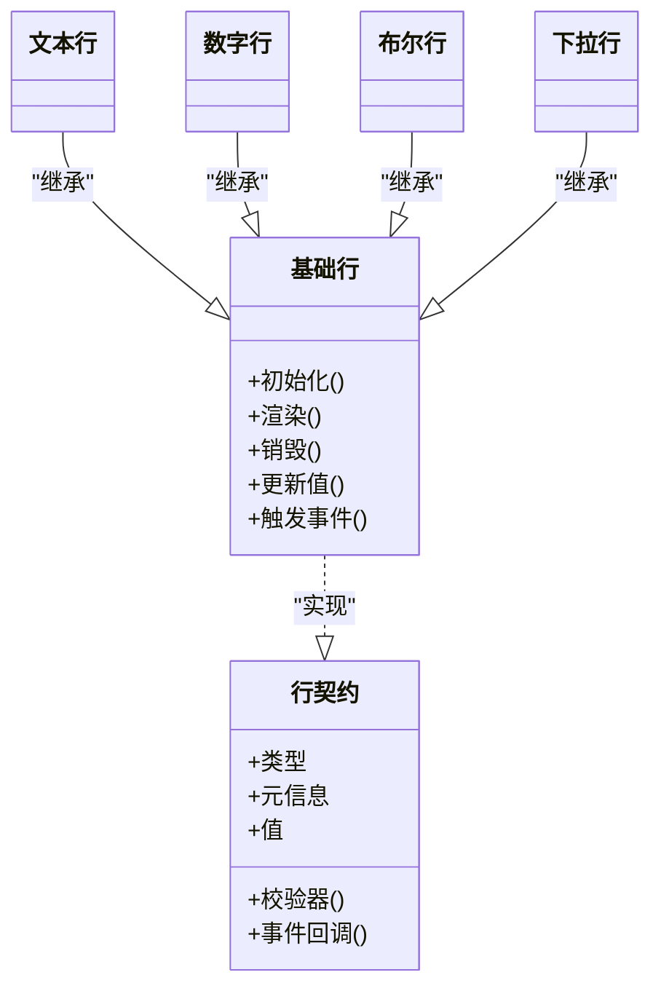
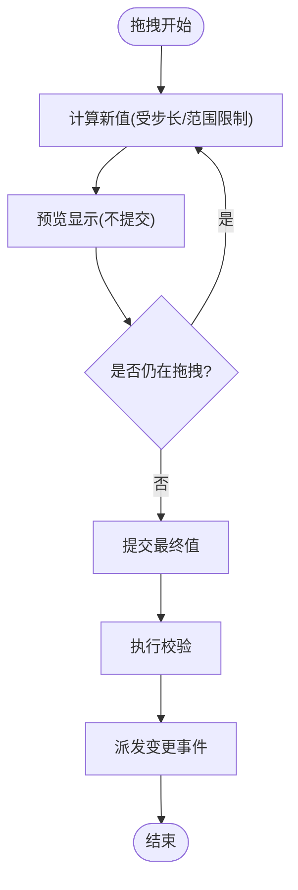
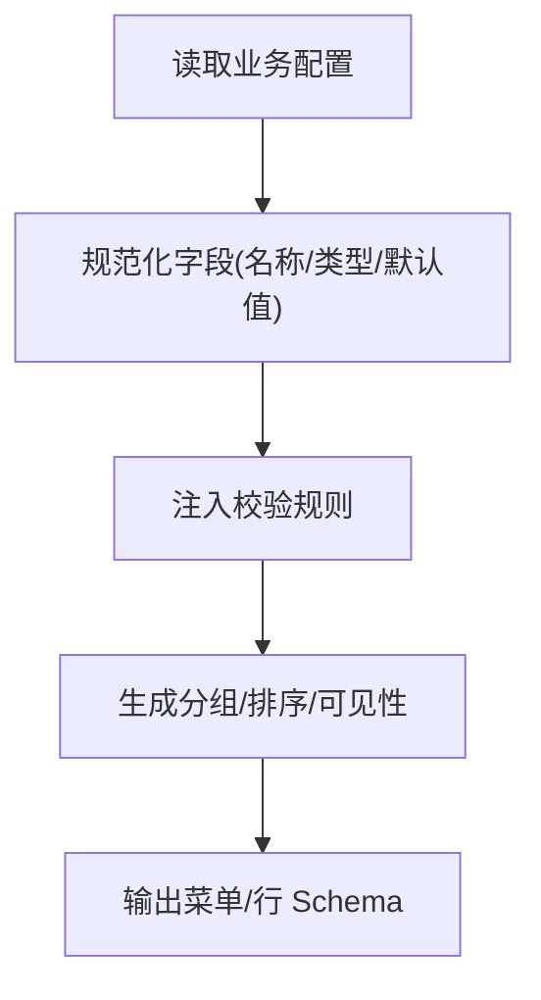
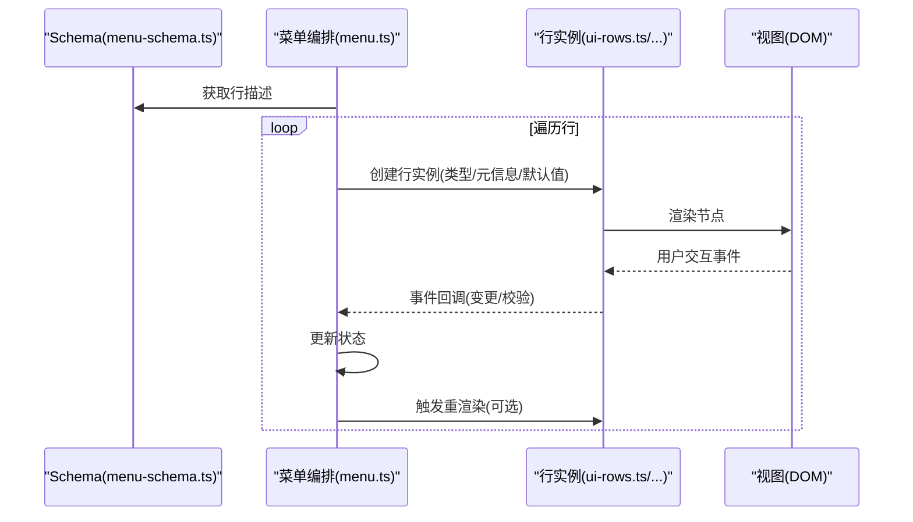
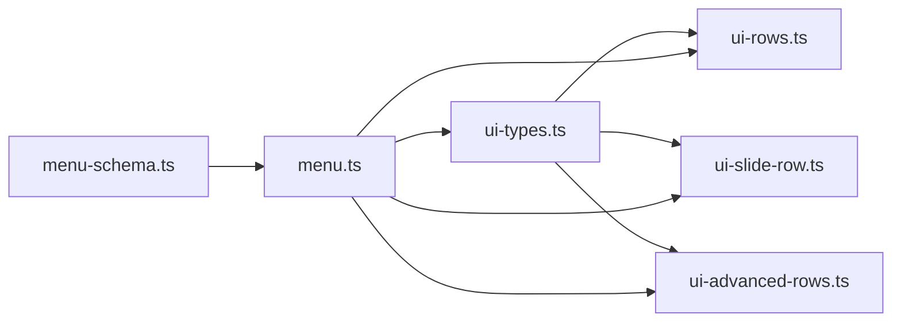

# 行系统架构

<cite>
**本文引用的文件**   
- [ui-types.ts](file://frontend/src/core/ui-types.ts)
- [ui-rows.ts](file://frontend/src/core/ui-rows.ts)
- [ui-slide-row.ts](file://frontend/src/core/ui-slide-row.ts)
- [ui-advanced-rows.ts](file://frontend/src/core/ui-advanced-rows.ts)
- [menu-schema.ts](file://frontend/src/menus/menu-schema.ts)
- [menu.ts](file://frontend/src/menus/menu.ts)
</cite>

## 目录
1. [简介](#简介)
2. [项目结构](#项目结构)
3. [核心组件](#核心组件)
4. [架构总览](#架构总览)
5. [详细组件分析](#详细组件分析)
6. [依赖关系分析](#依赖关系分析)
7. [性能考量](#性能考量)
8. [故障排查指南](#故障排查指南)
9. [结论](#结论)
10. [附录](#附录)

## 简介
本文件面向“基于行的属性编辑”子系统，系统性阐述其架构与实现：Row 基类的设计模式、属性定义接口规范、数据绑定机制；基础行、复合行、条件行等类型的工作原理；行的生命周期管理、渲染流程与事件处理；并提供自定义行类型的开发指南（继承最佳实践、验证规则实现、性能优化策略），辅以完整示例路径与实际应用场景。

## 项目结构
行系统位于前端核心 UI 层，围绕“菜单/面板 → 行描述 → 行实例 → 渲染与交互”的链路组织。关键文件职责如下：
- ui-types.ts：定义行类型枚举、通用行元信息、校验器签名、事件回调等基础类型。
- ui-rows.ts：提供基础行实现（文本、数字、布尔、下拉等）与通用行容器逻辑。
- ui-slide-row.ts：滑动条行（数值范围调节）的具体实现。
- ui-advanced-rows.ts：高级行（如颜色、资源选择、复杂对象折叠等）的实现。
- menu-schema.ts：将业务配置转换为“菜单/行”描述（Schema），负责字段映射、分组、条件显示等。
- menu.ts：菜单/面板编排与渲染入口，负责根据 Schema 构建行树并驱动渲染与事件分发。

图表来源
- [ui-types.ts](file://frontend/src/core/ui-types.ts)
- [ui-rows.ts](file://frontend/src/core/ui-rows.ts)
- [ui-slide-row.ts](file://frontend/src/core/ui-slide-row.ts)
- [ui-advanced-rows.ts](file://frontend/src/core/ui-advanced-rows.ts)
- [menu-schema.ts](file://frontend/src/menus/menu-schema.ts)
- [menu.ts](file://frontend/src/menus/menu.ts)

章节来源
- [ui-types.ts](file://frontend/src/core/ui-types.ts)
- [ui-rows.ts](file://frontend/src/core/ui-rows.ts)
- [ui-slide-row.ts](file://frontend/src/core/ui-slide-row.ts)
- [ui-advanced-rows.ts](file://frontend/src/core/ui-advanced-rows.ts)
- [menu-schema.ts](file://frontend/src/menus/menu-schema.ts)
- [menu.ts](file://frontend/src/menus/menu.ts)

## 核心组件
- 行类型与契约（ui-types.ts）
  - 定义行类型枚举、行元信息（标题、提示、可见性、禁用状态等）、值类型约束、校验器函数签名、事件回调约定。
  - 作为所有具体行实现的统一契约，确保菜单编排与渲染引擎可一致消费。
- 基础行（ui-rows.ts）
  - 提供常见输入控件的行实现（文本、数字、布尔、下拉等），封装通用的布局、标签、错误提示、只读/禁用态。
  - 暴露统一的更新接口与事件派发，供上层菜单系统订阅。
- 滑动条行（ui-slide-row.ts）
  - 在基础行之上增加拖拽/步进交互，支持范围、步长、格式化显示等。
- 高级行（ui-advanced-rows.ts）
  - 提供更复杂的交互单元（如颜色选择、资源浏览、嵌套对象折叠等），复用基础行的元信息与校验能力。
- 菜单 Schema（menu-schema.ts）
  - 将业务配置转换为“菜单/行”描述，包括分组、排序、条件显示、默认值、校验规则注入等。
- 菜单编排与渲染（menu.ts）
  - 解析 Schema，构建行树，驱动渲染与事件分发，协调不同行类型的生命周期。

章节来源
- [ui-types.ts](file://frontend/src/core/ui-types.ts)
- [ui-rows.ts](file://frontend/src/core/ui-rows.ts)
- [ui-slide-row.ts](file://frontend/src/core/ui-slide-row.ts)
- [ui-advanced-rows.ts](file://frontend/src/core/ui-advanced-rows.ts)
- [menu-schema.ts](file://frontend/src/menus/menu-schema.ts)
- [menu.ts](file://frontend/src/menus/menu.ts)

## 架构总览
行系统的整体数据流遵循“Schema → 行树 → 渲染 → 事件 → 状态更新 → 重新渲染”的闭环。

图表来源
- [menu.ts](file://frontend/src/menus/menu.ts)
- [menu-schema.ts](file://frontend/src/menus/menu-schema.ts)
- [ui-types.ts](file://frontend/src/core/ui-types.ts)
- [ui-rows.ts](file://frontend/src/core/ui-rows.ts)
- [ui-slide-row.ts](file://frontend/src/core/ui-slide-row.ts)
- [ui-advanced-rows.ts](file://frontend/src/core/ui-advanced-rows.ts)

## 详细组件分析

### 行类型与契约（ui-types.ts）
- 设计要点
  - 以强类型约束行元信息、值类型、校验器与事件回调，保证菜单系统与具体行实现之间的稳定契约。
  - 通过枚举区分行类型，便于菜单编排时进行分支处理与渲染选择。
- 关键抽象
  - 行元信息：标题、说明、可见性、禁用、占位符、格式器等。
  - 值与校验：值类型、默认值、校验器函数（同步/异步）、错误消息。
  - 事件：值变更、焦点、校验结果等回调约定。
- 复杂度与扩展性
  - 新增行类型只需实现对应渲染与事件派发，无需改动菜单编排核心。
  - 校验器可组合与复用，便于跨行共享规则。

章节来源
- [ui-types.ts](file://frontend/src/core/ui-types.ts)

### 基础行（ui-rows.ts）
- 设计模式
  - 采用“模板方法 + 工厂”的组合：公共布局、标签、错误提示由基类提供，具体输入控件由子类或工厂按需创建。
- 行为特性
  - 统一的生命周期钩子：初始化、渲染、销毁。
  - 统一的事件通道：值变更、校验失败、聚焦/失焦等。
  - 统一的状态同步：与菜单状态双向绑定，支持只读/禁用态。
- 典型行类型
  - 文本行、数字行、布尔开关、下拉选择等。

图表来源
- [ui-types.ts](file://frontend/src/core/ui-types.ts)
- [ui-rows.ts](file://frontend/src/core/ui-rows.ts)

章节来源
- [ui-rows.ts](file://frontend/src/core/ui-rows.ts)

### 滑动条行（ui-slide-row.ts）
- 功能特性
  - 在基础行基础上增加拖拽/步进交互，支持最小/最大值、步长、实时预览与格式化显示。
- 交互流程
  - 拖拽开始 → 实时更新中间值 → 释放后提交最终值 → 触发校验与事件。
- 性能考虑
  - 使用节流/防抖减少高频更新对渲染的影响。
  - 仅在必要时触发重渲染，避免整棵树刷新。

图表来源
- [ui-slide-row.ts](file://frontend/src/core/ui-slide-row.ts)
- [ui-types.ts](file://frontend/src/core/ui-types.ts)

章节来源
- [ui-slide-row.ts](file://frontend/src/core/ui-slide-row.ts)

### 高级行（ui-advanced-rows.ts）
- 典型场景
  - 颜色选择、资源选择、复杂对象折叠、多字段组合行等。
- 设计要点
  - 复用基础行的元信息与校验能力，内部维护子状态与局部渲染。
  - 对外暴露统一值接口与事件，保持与菜单编排的一致性。
- 可扩展性
  - 通过组合多个基础行或第三方控件，快速拼装出新的复杂行。

章节来源
- [ui-advanced-rows.ts](file://frontend/src/core/ui-advanced-rows.ts)

### 菜单 Schema（menu-schema.ts）
- 职责
  - 将业务配置转换为“菜单/行”描述，包含分组、排序、条件显示、默认值、校验规则注入等。
- 关键流程
  - 读取配置 → 规范化字段 → 注入校验器 → 生成行树 → 返回给菜单编排。
- 条件行
  - 通过条件表达式控制行的可见性与启用状态，支持动态切换。

图表来源
- [menu-schema.ts](file://frontend/src/menus/menu-schema.ts)
- [ui-types.ts](file://frontend/src/core/ui-types.ts)

章节来源
- [menu-schema.ts](file://frontend/src/menus/menu-schema.ts)

### 菜单编排与渲染（menu.ts）
- 职责
  - 解析 Schema，构建行树，驱动渲染与事件分发，协调不同行类型的生命周期。
- 渲染流程
  - 遍历 Schema → 按类型创建行实例 → 挂载到 DOM → 监听事件 → 更新状态。
- 事件处理
  - 统一事件总线：捕获行事件 → 路由到对应处理器 → 更新模型 → 选择性重渲染。

图表来源
- [menu.ts](file://frontend/src/menus/menu.ts)
- [menu-schema.ts](file://frontend/src/menus/menu-schema.ts)
- [ui-types.ts](file://frontend/src/core/ui-types.ts)
- [ui-rows.ts](file://frontend/src/core/ui-rows.ts)
- [ui-slide-row.ts](file://frontend/src/core/ui-slide-row.ts)
- [ui-advanced-rows.ts](file://frontend/src/core/ui-advanced-rows.ts)

章节来源
- [menu.ts](file://frontend/src/menus/menu.ts)

## 依赖关系分析
- 耦合与内聚
  - ui-types.ts 作为契约被所有行与菜单模块依赖，内聚度高且边界清晰。
  - ui-rows.ts、ui-slide-row.ts、ui-advanced-rows.ts 均依赖 ui-types.ts，彼此解耦，通过菜单编排聚合。
- 外部集成点
  - 菜单编排与业务配置（menu-schema.ts）之间通过 Schema 解耦，便于替换数据来源与渲染目标。
- 潜在循环依赖
  - 当前分层清晰，未见直接循环依赖；新增行类型时应避免反向依赖菜单编排。

图表来源
- [ui-types.ts](file://frontend/src/core/ui-types.ts)
- [ui-rows.ts](file://frontend/src/core/ui-rows.ts)
- [ui-slide-row.ts](file://frontend/src/core/ui-slide-row.ts)
- [ui-advanced-rows.ts](file://frontend/src/core/ui-advanced-rows.ts)
- [menu-schema.ts](file://frontend/src/menus/menu-schema.ts)
- [menu.ts](file://frontend/src/menus/menu.ts)

章节来源
- [ui-types.ts](file://frontend/src/core/ui-types.ts)
- [ui-rows.ts](file://frontend/src/core/ui-rows.ts)
- [ui-slide-row.ts](file://frontend/src/core/ui-slide-row.ts)
- [ui-advanced-rows.ts](file://frontend/src/core/ui-advanced-rows.ts)
- [menu-schema.ts](file://frontend/src/menus/menu-schema.ts)
- [menu.ts](file://frontend/src/menus/menu.ts)

## 性能考量
- 渲染优化
  - 局部更新：仅对发生变化的行进行重渲染，避免整树刷新。
  - 虚拟滚动：当行数量较大时，结合虚拟化技术提升滚动性能。
- 事件节流/防抖
  - 对高频事件（如滑动条拖拽、输入框实时校验）进行节流/防抖，降低主线程压力。
- 校验优化
  - 延迟校验：在用户停止输入后再执行耗时校验。
  - 缓存校验结果：对相同输入复用校验结果，避免重复计算。
- 内存管理
  - 及时销毁行实例与事件监听，防止内存泄漏。

[本节为通用指导，不涉及具体文件分析]

## 故障排查指南
- 常见问题定位
  - 行未渲染：检查 Schema 中该行的可见性与类型是否正确。
  - 值未更新：确认事件回调是否注册，以及菜单编排是否正确转发。
  - 校验不生效：检查校验器签名与返回值是否符合契约。
- 调试建议
  - 在菜单编排层打印行树与事件流，快速定位断点。
  - 为自定义行添加日志钩子，记录初始化、渲染、事件触发时机。

章节来源
- [menu.ts](file://frontend/src/menus/menu.ts)
- [ui-types.ts](file://frontend/src/core/ui-types.ts)

## 结论
行系统通过清晰的契约与分层，实现了高内聚、低耦合的属性编辑能力。基础行提供通用能力，高级行与滑动条行覆盖复杂场景，菜单 Schema 与编排将业务配置与渲染解耦。遵循本文的开发指南与优化策略，可高效扩展自定义行类型并保持良好性能与可维护性。

[本节为总结性内容，不涉及具体文件分析]

## 附录

### 自定义行类型开发指南
- 继承最佳实践
  - 明确行类型与元信息，遵循 ui-types.ts 的契约。
  - 复用基础行的生命周期与事件通道，避免重复造轮子。
- 验证规则实现
  - 实现校验器函数，返回成功/失败及错误消息。
  - 支持同步与异步校验，注意用户体验（延迟/取消）。
- 性能优化策略
  - 使用节流/防抖处理高频事件。
  - 局部更新与懒加载，避免不必要的重渲染。
- 代码示例路径
  - 参考现有行实现的结构与命名约定：
    - [基础行实现](file://frontend/src/core/ui-rows.ts)
    - [滑动条行实现](file://frontend/src/core/ui-slide-row.ts)
    - [高级行实现](file://frontend/src/core/ui-advanced-rows.ts)
    - [类型契约](file://frontend/src/core/ui-types.ts)
- 实际应用场景
  - 在菜单 Schema 中声明新行类型，并在菜单编排中自动渲染与事件绑定：
    - [菜单 Schema 生成](file://frontend/src/menus/menu-schema.ts)
    - [菜单编排与渲染](file://frontend/src/menus/menu.ts)

章节来源
- [ui-types.ts](file://frontend/src/core/ui-types.ts)
- [ui-rows.ts](file://frontend/src/core/ui-rows.ts)
- [ui-slide-row.ts](file://frontend/src/core/ui-slide-row.ts)
- [ui-advanced-rows.ts](file://frontend/src/core/ui-advanced-rows.ts)
- [menu-schema.ts](file://frontend/src/menus/menu-schema.ts)
- [menu.ts](file://frontend/src/menus/menu.ts)