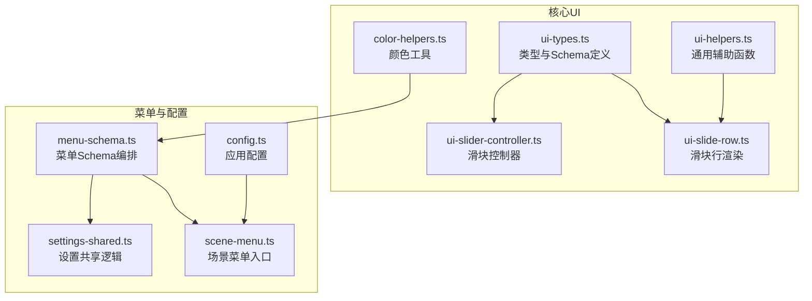
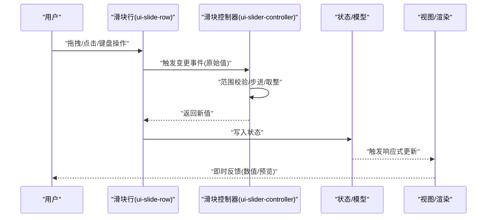
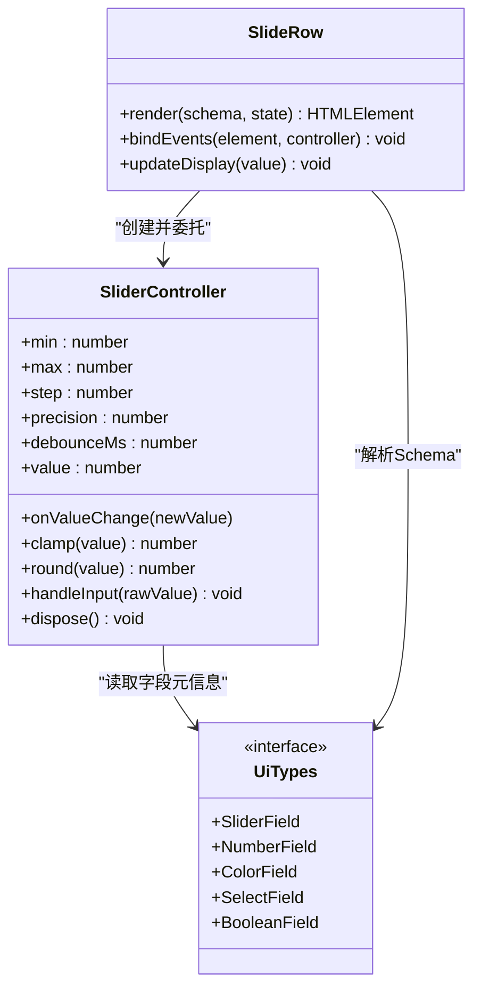
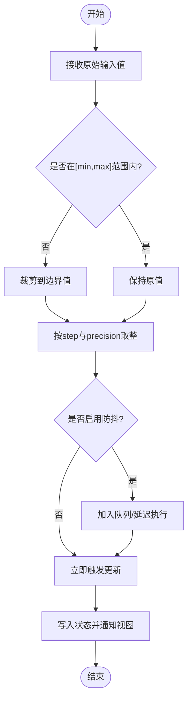
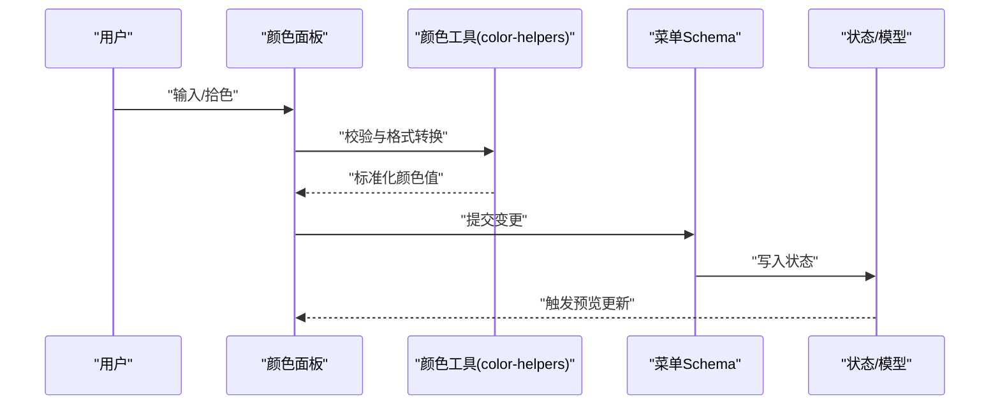
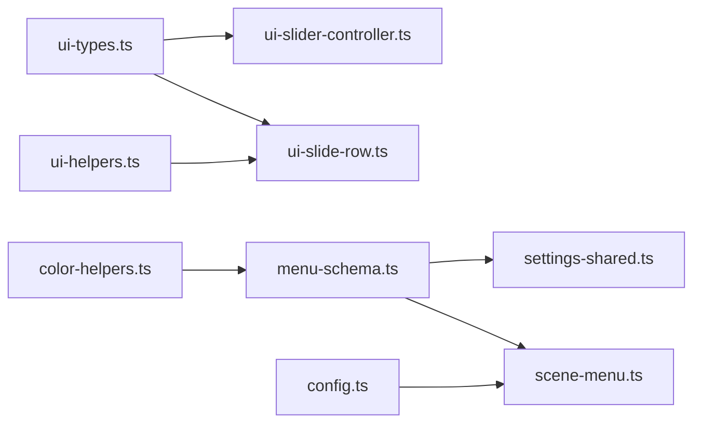

# 输入控件组件

<cite>
**本文引用的文件**   
- [ui-slider-controller.ts](file://frontend/src/core/ui-slider-controller.ts)
- [ui-slide-row.ts](file://frontend/src/core/ui-slide-row.ts)
- [ui-types.ts](file://frontend/src/core/ui-types.ts)
- [ui-helpers.ts](file://frontend/src/core/ui-helpers.ts)
- [color-helpers.ts](file://frontend/src/core/color-helpers.ts)
- [menu-schema.ts](file://frontend/src/menus/menu-schema.ts)
- [settings-shared.ts](file://frontend/src/menus/settings-shared.ts)
- [scene-menu.ts](file://frontend/src/scene-menu.ts)
- [config.ts](file://frontend/src/config.ts)
</cite>

## 目录
1. [简介](#简介)
2. [项目结构](#项目结构)
3. [核心组件](#核心组件)
4. [架构总览](#架构总览)
5. [详细组件分析](#详细组件分析)
6. [依赖关系分析](#依赖关系分析)
7. [性能考量](#性能考量)
8. [故障排查指南](#故障排查指南)
9. [结论](#结论)
10. [附录](#附录)

## 简介
本文件面向前端输入控件的使用与实现，覆盖滑块控件（Slider）、颜色选择器、文本输入框、下拉选择框、复选框等常见控件。重点深入解析滑块控制器的核心技术：数值范围验证、实时更新机制、防抖处理与性能优化策略。文档同时提供各控件的配置项、事件回调与样式定制方法，并给出使用示例与最佳实践建议，帮助读者快速构建稳定高效的参数调节界面。

## 项目结构
本项目的前端 UI 能力集中在 core 与 menus 两个层次：
- core 层提供通用 UI 基础能力与数据绑定、类型定义、工具函数等；
- menus 层基于 schema 声明式地组合这些能力，生成具体面板与表单。

图表来源
- [ui-types.ts](file://frontend/src/core/ui-types.ts)
- [ui-helpers.ts](file://frontend/src/core/ui-helpers.ts)
- [ui-slider-controller.ts](file://frontend/src/core/ui-slider-controller.ts)
- [ui-slide-row.ts](file://frontend/src/core/ui-slide-row.ts)
- [color-helpers.ts](file://frontend/src/core/color-helpers.ts)
- [menu-schema.ts](file://frontend/src/menus/menu-schema.ts)
- [settings-shared.ts](file://frontend/src/menus/settings-shared.ts)
- [scene-menu.ts](file://frontend/src/scene-menu.ts)
- [config.ts](file://frontend/src/config.ts)

章节来源
- [ui-types.ts](file://frontend/src/core/ui-types.ts)
- [ui-helpers.ts](file://frontend/src/core/ui-helpers.ts)
- [ui-slider-controller.ts](file://frontend/src/core/ui-slider-controller.ts)
- [ui-slide-row.ts](file://frontend/src/core/ui-slide-row.ts)
- [color-helpers.ts](file://frontend/src/core/color-helpers.ts)
- [menu-schema.ts](file://frontend/src/menus/menu-schema.ts)
- [settings-shared.ts](file://frontend/src/menus/settings-shared.ts)
- [scene-menu.ts](file://frontend/src/scene-menu.ts)
- [config.ts](file://frontend/src/config.ts)

## 核心组件
本节概述各类输入控件的职责与协作方式：
- 滑块控件（Slider）：由“滑块控制器”负责数值计算、范围校验、增量步进与防抖；由“滑块行”负责渲染与交互事件转发。
- 颜色选择器：通过颜色工具进行格式转换与校验，结合菜单 Schema 驱动渲染与更新。
- 文本输入框：用于字符串或自由数值输入，通常配合校验规则与格式化输出。
- 下拉选择框：基于枚举或选项列表的受控组件，支持搜索与分组。
- 复选框：布尔值开关，常用于功能开关与模式切换。

章节来源
- [ui-slider-controller.ts](file://frontend/src/core/ui-slider-controller.ts)
- [ui-slide-row.ts](file://frontend/src/core/ui-slide-row.ts)
- [ui-types.ts](file://frontend/src/core/ui-types.ts)
- [ui-helpers.ts](file://frontend/src/core/ui-helpers.ts)
- [color-helpers.ts](file://frontend/src/core/color-helpers.ts)
- [menu-schema.ts](file://frontend/src/menus/menu-schema.ts)

## 架构总览
输入控件采用“声明式 Schema + 受控组件 + 控制器”的分层架构：
- 声明层：通过 menu-schema 描述字段、类型、默认值、校验规则与展示文案。
- 渲染层：根据类型渲染对应 DOM 元素（如 input[type=range]、select、checkbox 等）。
- 控制层：对高频交互（如滑块拖动）进行节流/防抖、边界约束与增量步进，确保实时性与稳定性。

图表来源
- [ui-slide-row.ts](file://frontend/src/core/ui-slide-row.ts)
- [ui-slider-controller.ts](file://frontend/src/core/ui-slider-controller.ts)
- [ui-types.ts](file://frontend/src/core/ui-types.ts)

## 详细组件分析

### 滑块控件（Slider）
滑块控件是参数调节的核心组件，具备以下特性：
- 数值范围验证：在控制器内统一进行最小/最大值裁剪，避免越界。
- 增量步进：支持步长与小数位控制，保证数值精度与可读性。
- 实时更新：在拖动过程中即时反馈，减少用户等待。
- 防抖处理：在高频事件中合并更新，降低重排与渲染压力。
- 性能优化：批量更新、按需刷新、避免不必要的状态传播。

#### 类图（代码级）

图表来源
- [ui-slider-controller.ts](file://frontend/src/core/ui-slider-controller.ts)
- [ui-slide-row.ts](file://frontend/src/core/ui-slide-row.ts)
- [ui-types.ts](file://frontend/src/core/ui-types.ts)

#### 关键流程（范围校验与防抖）

图表来源
- [ui-slider-controller.ts](file://frontend/src/core/ui-slider-controller.ts)
- [ui-helpers.ts](file://frontend/src/core/ui-helpers.ts)

#### 使用要点与最佳实践
- 合理设置 min/max/step，避免过大范围导致精度丢失。
- 对频繁更新的属性开启防抖，必要时限制最大更新频率。
- 将显示精度与存储精度分离，提升可读性同时保证一致性。
- 为不可用态提供禁用样式与提示，增强可访问性。

章节来源
- [ui-slider-controller.ts](file://frontend/src/core/ui-slider-controller.ts)
- [ui-slide-row.ts](file://frontend/src/core/ui-slide-row.ts)
- [ui-types.ts](file://frontend/src/core/ui-types.ts)
- [ui-helpers.ts](file://frontend/src/core/ui-helpers.ts)

### 颜色选择器
颜色选择器负责颜色的输入、校验与格式转换，常以十六进制、RGB/HSV 等形式呈现。其核心职责包括：
- 输入校验：过滤非法字符，自动补全格式。
- 格式转换：在不同表示法之间安全转换，处理透明度通道。
- 联动更新：与材质、环境等系统同步预览。

图表来源
- [color-helpers.ts](file://frontend/src/core/color-helpers.ts)
- [menu-schema.ts](file://frontend/src/menus/menu-schema.ts)

章节来源
- [color-helpers.ts](file://frontend/src/core/color-helpers.ts)
- [menu-schema.ts](file://frontend/src/menus/menu-schema.ts)

### 文本输入框
文本输入框适用于短文本、标识符或自由数值的输入。典型关注点：
- 输入过滤：仅允许合法字符集。
- 格式化：千分位、单位后缀、前缀提示。
- 校验：必填、长度、正则匹配。
- 失焦保存：减少频繁写入，提高性能。

章节来源
- [ui-types.ts](file://frontend/src/core/ui-types.ts)
- [ui-helpers.ts](file://frontend/src/core/ui-helpers.ts)
- [menu-schema.ts](file://frontend/src/menus/menu-schema.ts)

### 下拉选择框
下拉选择框用于从有限集合中选择，支持搜索、分组与多选。关键点：
- 选项来源：静态枚举或动态加载。
- 搜索与去重：模糊匹配、高亮匹配片段。
- 受控更新：与状态双向绑定，避免不一致。

章节来源
- [ui-types.ts](file://frontend/src/core/ui-types.ts)
- [menu-schema.ts](file://frontend/src/menus/menu-schema.ts)

### 复选框
复选框用于布尔型开关，常用于功能开关、模式切换等。要点：
- 语义化标签与无障碍支持。
- 联动行为：打开某项时关闭互斥项。
- 即时反馈：勾选后立即生效或进入确认流程。

章节来源
- [ui-types.ts](file://frontend/src/core/ui-types.ts)
- [menu-schema.ts](file://frontend/src/menus/menu-schema.ts)

## 依赖关系分析
输入控件之间的依赖关系如下：
- ui-types.ts 提供所有字段的类型与 Schema 定义，被各控件与菜单编排模块引用。
- ui-helpers.ts 提供通用辅助函数，供滑块行与校验逻辑复用。
- ui-slider-controller.ts 依赖类型与工具函数，封装滑块业务逻辑。
- ui-slide-row.ts 负责渲染与事件绑定，委托控制器完成数值处理。
- color-helpers.ts 为颜色相关字段提供工具能力。
- menu-schema.ts 与 settings-shared.ts 组合上述能力，生成具体面板。
- scene-menu.ts 作为场景菜单入口，组织各子面板。
- config.ts 提供全局配置，影响控件行为（如默认语言、主题等）。

图表来源
- [ui-types.ts](file://frontend/src/core/ui-types.ts)
- [ui-helpers.ts](file://frontend/src/core/ui-helpers.ts)
- [ui-slider-controller.ts](file://frontend/src/core/ui-slider-controller.ts)
- [ui-slide-row.ts](file://frontend/src/core/ui-slide-row.ts)
- [color-helpers.ts](file://frontend/src/core/color-helpers.ts)
- [menu-schema.ts](file://frontend/src/menus/menu-schema.ts)
- [settings-shared.ts](file://frontend/src/menus/settings-shared.ts)
- [scene-menu.ts](file://frontend/src/scene-menu.ts)
- [config.ts](file://frontend/src/config.ts)

章节来源
- [ui-types.ts](file://frontend/src/core/ui-types.ts)
- [ui-helpers.ts](file://frontend/src/core/ui-helpers.ts)
- [ui-slider-controller.ts](file://frontend/src/core/ui-slider-controller.ts)
- [ui-slide-row.ts](file://frontend/src/core/ui-slide-row.ts)
- [color-helpers.ts](file://frontend/src/core/color-helpers.ts)
- [menu-schema.ts](file://frontend/src/menus/menu-schema.ts)
- [settings-shared.ts](file://frontend/src/menus/settings-shared.ts)
- [scene-menu.ts](file://frontend/src/scene-menu.ts)
- [config.ts](file://frontend/src/config.ts)

## 性能考量
- 防抖与节流：对高频输入（如滑块拖动）进行合并更新，避免每帧多次状态写入。
- 增量更新：仅在值发生变化时触发视图更新，减少重绘。
- 批量提交：将多个关联参数的修改合并提交，降低副作用成本。
- 懒渲染：对非可视区域或隐藏面板中的控件延迟初始化。
- 精度与步长：合理设置 step 与 precision，避免浮点误差导致的抖动。

[本节为通用指导，不直接分析具体文件]

## 故障排查指南
常见问题与定位思路：
- 滑块值越界：检查 min/max 配置与 clamp 逻辑是否正确生效。
- 数值跳动或不稳定：确认 step/precision 设置与防抖时间是否合适。
- 颜色格式异常：核对输入过滤与转换函数的容错处理。
- 下拉选项不同步：检查选项来源与去重逻辑，确保受控更新路径一致。
- 复选框无响应：确认事件绑定与状态写入链路是否完整。

章节来源
- [ui-slider-controller.ts](file://frontend/src/core/ui-slider-controller.ts)
- [ui-helpers.ts](file://frontend/src/core/ui-helpers.ts)
- [color-helpers.ts](file://frontend/src/core/color-helpers.ts)
- [menu-schema.ts](file://frontend/src/menus/menu-schema.ts)

## 结论
通过“声明式 Schema + 受控组件 + 控制器”的分层设计，输入控件在保证易用性的同时实现了良好的性能与可维护性。滑块控制器为核心，提供了稳健的范围校验、增量步进与防抖机制；颜色、文本、下拉与复选框围绕同一契约协作，形成一致的交互体验。遵循本文的最佳实践，可在复杂场景中构建高效、稳定的参数调节界面。

[本节为总结性内容，不直接分析具体文件]

## 附录
- 配置项参考：在菜单 Schema 中为每个字段声明类型、默认值、校验规则与展示文案，即可自动生成对应的输入控件。
- 事件回调：通过统一的变更回调接口，将控件值变化映射到业务状态，便于追踪与调试。
- 样式定制：借助 CSS 变量与主题系统，统一调整控件外观与动效，保持一致的品牌风格。

章节来源
- [menu-schema.ts](file://frontend/src/menus/menu-schema.ts)
- [settings-shared.ts](file://frontend/src/menus/settings-shared.ts)
- [scene-menu.ts](file://frontend/src/scene-menu.ts)
- [config.ts](file://frontend/src/config.ts)