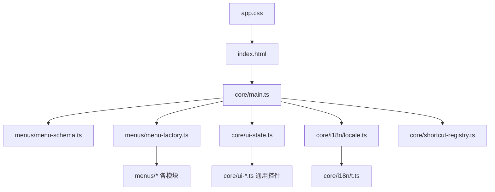
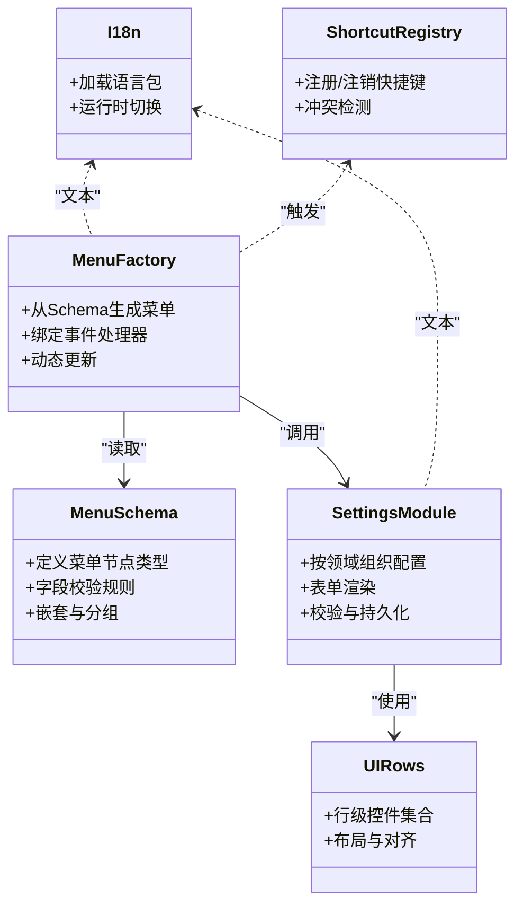
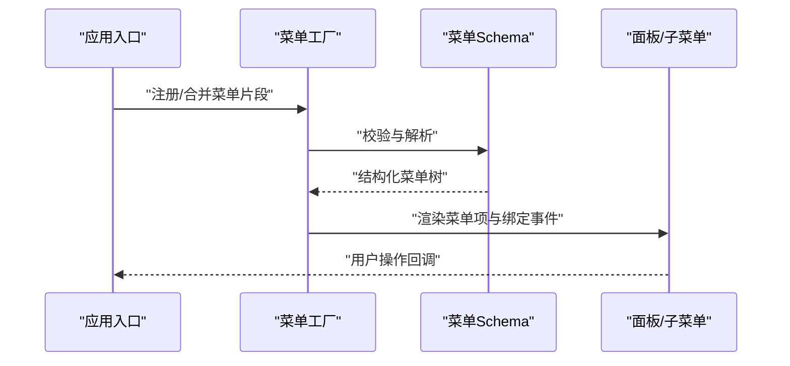
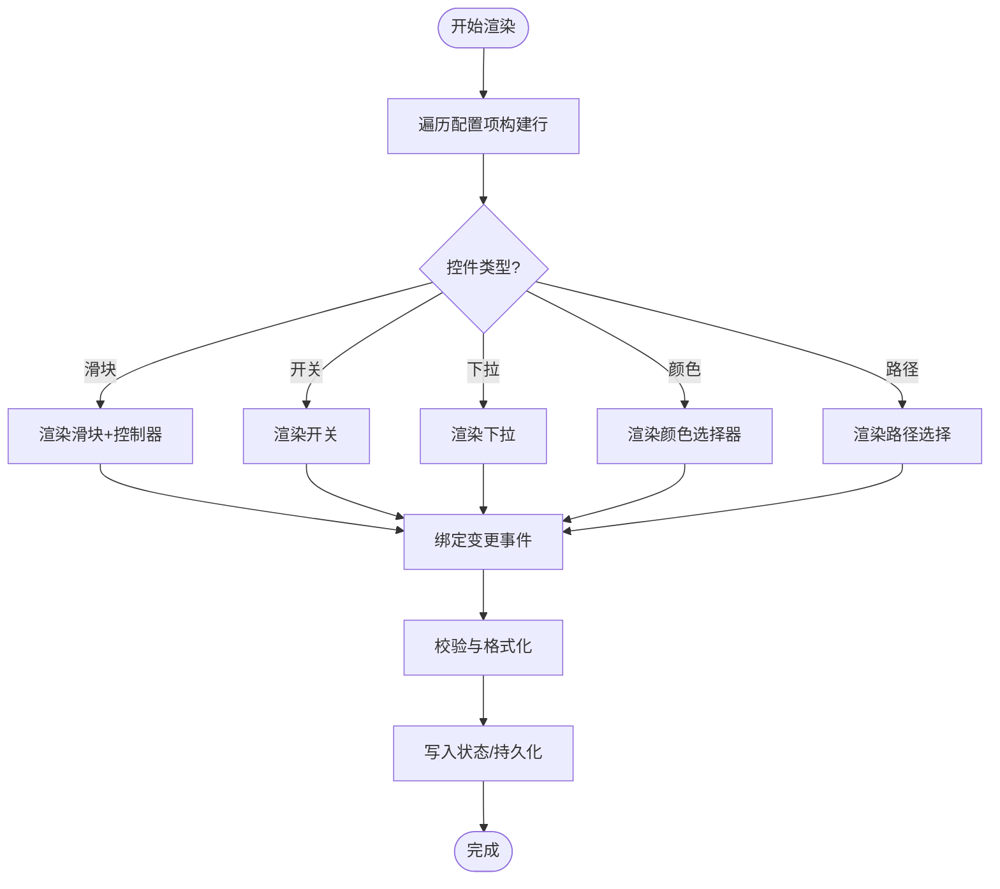
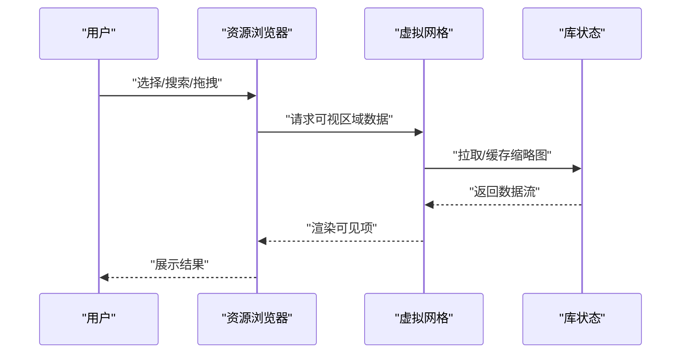
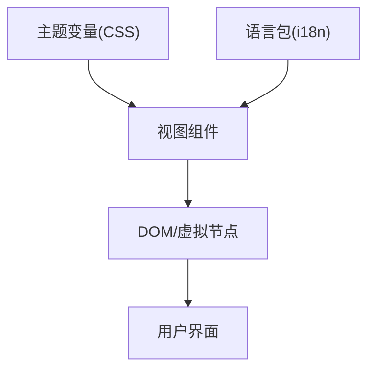
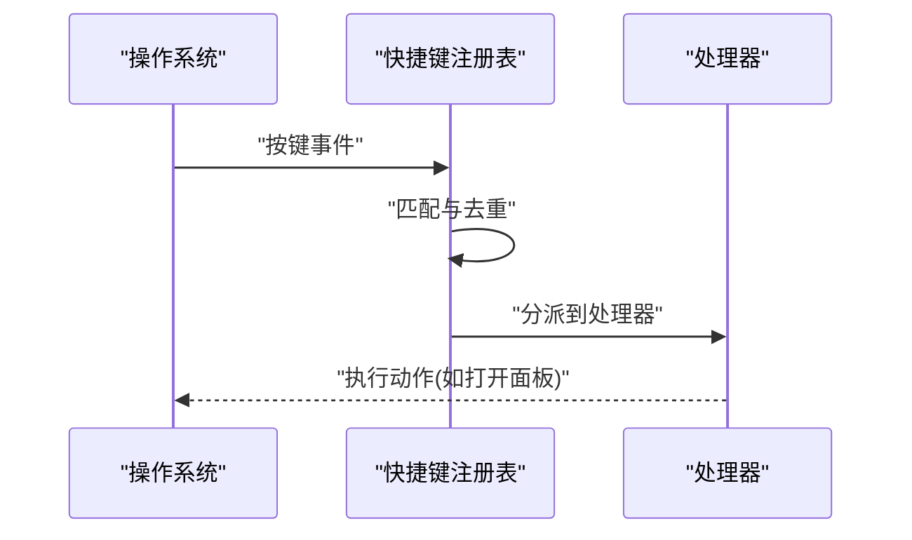
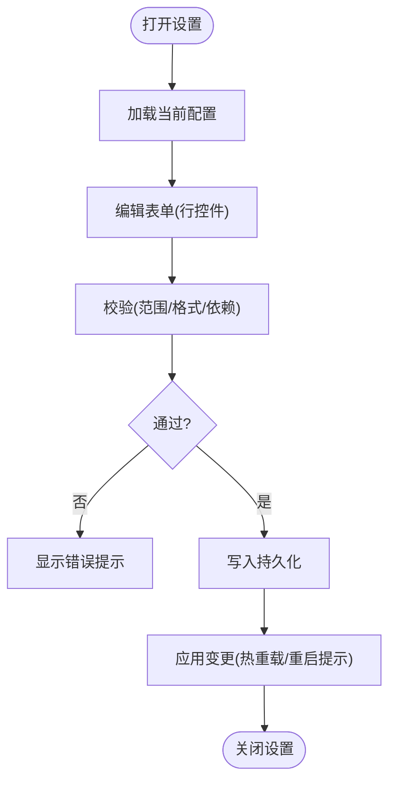
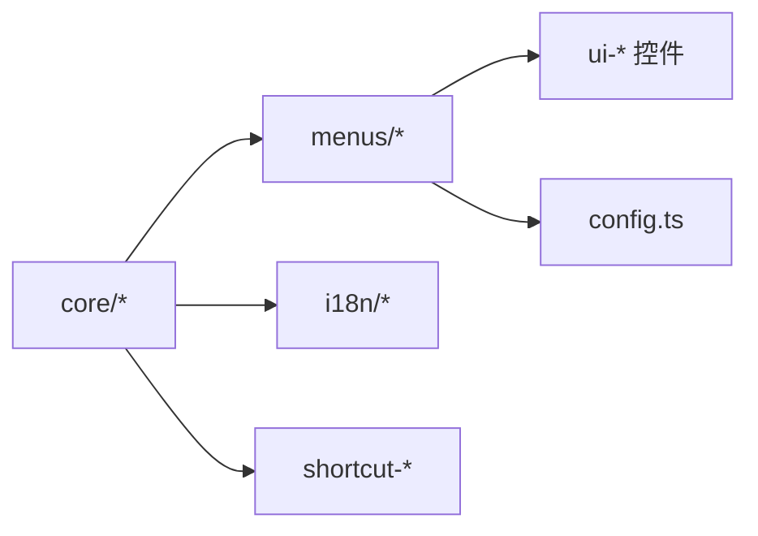

# 用户界面

<cite>
**本文引用的文件**   
- [frontend/src/core/main.ts](file://frontend/src/core/main.ts)
- [frontend/src/core/ui-types.ts](file://frontend/src/core/ui-types.ts)
- [frontend/src/core/ui-state.ts](file://frontend/src/core/ui-state.ts)
- [frontend/src/core/ui-helpers.ts](file://frontend/src/core/ui-helpers.ts)
- [frontend/src/core/ui-collapsible.ts](file://frontend/src/core/ui-collapsible.ts)
- [frontend/src/core/ui-rows.ts](file://frontend/src/core/ui-rows.ts)
- [frontend/src/core/ui-advanced-rows.ts](file://frontend/src/core/ui-advanced-rows.ts)
- [frontend/src/core/ui-slide-row.ts](file://frontend/src/core/ui-slide-row.ts)
- [frontend/src/core/ui-slider-controller.ts](file://frontend/src/core/ui-slider-controller.ts)
- [frontend/src/core/ui-virtual-grid.ts](file://frontend/src/core/ui-virtual-grid.ts)
- [frontend/src/core/ui-resource-panel.ts](file://frontend/src/core/ui-resource-panel.ts)
- [frontend/src/core/i18n/locale.ts](file://frontend/src/core/i18n/locale.ts)
- [frontend/src/core/i18n/t.ts](file://frontend/src/core/i18n/t.ts)
- [frontend/src/core/shortcut-registry.ts](file://frontend/src/core/shortcut-registry.ts)
- [frontend/src/core/shortcut-app.ts](file://frontend/src/core/shortcut-app.ts)
- [frontend/src/menus/menu-schema.ts](file://frontend/src/menus/menu-schema.ts)
- [frontend/src/menus/menu-factory.ts](file://frontend/src/menus/menu-factory.ts)
- [frontend/src/menus/menu.ts](file://frontend/src/menus/menu.ts)
- [frontend/src/menus/settings.ts](file://frontend/src/menus/settings.ts)
- [frontend/src/menus/settings-shared.ts](file://frontend/src/menus/settings-shared.ts)
- [frontend/src/menus/settings-appearance.ts](file://frontend/src/menus/settings-appearance.ts)
- [frontend/src/menus/settings-language.ts](file://frontend/src/menus/settings-language.ts)
- [frontend/src/menus/settings-shortcuts.ts](file://frontend/src/menus/settings-shortcuts.ts)
- [frontend/src/menus/settings-library.ts](file://frontend/src/menus/settings-library.ts)
- [frontend/src/menus/settings-performance.ts](file://frontend/src/menus/settings-performance.ts)
- [frontend/src/menus/settings-rendering.ts](file://frontend/src/menus/settings-rendering.ts)
- [frontend/src/menus/settings-screenshot.ts](file://frontend/src/menus/settings-screenshot.ts)
- [frontend/src/menus/settings-targets.ts](file://frontend/src/menus/settings-targets.ts)
- [frontend/src/menus/settings-software.ts](file://frontend/src/menus/settings-software.ts)
- [frontend/src/menus/settings-about.ts](file://frontend/src/menus/settings-about.ts)
- [frontend/src/menus/library.ts](file://frontend/src/menus/library.ts)
- [frontend/src/menus/library-browse.ts](file://frontend/src/menus/library-browse.ts)
- [frontend/src/menus/model-detail.ts](file://frontend/src/menus/model-detail.ts)
- [frontend/src/menus/render-menu.ts](file://frontend/src/menus/render-menu.ts)
- [frontend/src/menus/env-menu.ts](file://frontend/src/menus/env-menu.ts)
- [frontend/src/menus/motion-popup.ts](file://frontend/src/menus/motion-popup.ts)
- [frontend/src/menus/preset-list-viewer.ts](file://frontend/src/menus/preset-list-viewer.ts)
- [frontend/src/config.ts](file://frontend/src/config.ts)
- [frontend/src/app.css](file://frontend/src/app.css)
- [frontend/index.html](file://frontend/index.html)
</cite>

## 目录
1. [简介](#简介)
2. [项目结构](#项目结构)
3. [核心组件](#核心组件)
4. [架构总览](#架构总览)
5. [详细组件分析](#详细组件分析)
6. [依赖关系分析](#依赖关系分析)
7. [性能考量](#性能考量)
8. [故障排查指南](#故障排查指南)
9. [结论](#结论)
10. [附录](#附录)

## 简介
本文件面向开发者与高级用户，系统性梳理 MikuMikuAR 前端 UI 的架构与实现。重点覆盖：
- 声明式菜单系统与属性编辑器
- 资源浏览器与面板组织
- 主题系统与样式管理（含响应式与多语言）
- 交互模式（拖拽、快捷键、上下文菜单）
- 设置面板（配置校验、默认值、持久化）
- UI 组件开发规范与自定义主题制作指南

## 项目结构
前端采用“模块化 + 分层”的组织方式：
- core：UI 基础设施（状态、类型、国际化、快捷键、通用控件）
- menus：基于声明式 Schema 的菜单与面板（场景、渲染、环境、库、模型、动作、设置等）
- assets/public：静态资源（字体、纹理、图标等）
- index.html：应用入口与全局样式挂载点

图表来源
- [frontend/index.html:1-200](file://frontend/index.html#L1-L200)
- [frontend/src/core/main.ts:1-200](file://frontend/src/core/main.ts#L1-L200)
- [frontend/src/menus/menu-schema.ts:1-200](file://frontend/src/menus/menu-schema.ts#L1-L200)
- [frontend/src/menus/menu-factory.ts:1-200](file://frontend/src/menus/menu-factory.ts#L1-L200)
- [frontend/src/core/ui-state.ts:1-200](file://frontend/src/core/ui-state.ts#L1-L200)
- [frontend/src/core/i18n/locale.ts:1-200](file://frontend/src/core/i18n/locale.ts#L1-L200)
- [frontend/src/core/shortcut-registry.ts:1-200](file://frontend/src/core/shortcut-registry.ts#L1-L200)
- [frontend/src/app.css:1-200](file://frontend/src/app.css#L1-L200)

章节来源
- [frontend/index.html:1-200](file://frontend/index.html#L1-L200)
- [frontend/src/core/main.ts:1-200](file://frontend/src/core/main.ts#L1-L200)

## 核心组件
本节聚焦 UI 层的关键能力与构件：
- 声明式菜单系统：通过 Schema 描述菜单树、行为与数据绑定，由工厂统一装配与渲染
- 属性编辑器：以行（Row）为基本单元，支持滑块、开关、下拉、颜色、路径等控件
- 资源浏览器：提供库浏览、预览、选择与批量操作
- 主题与样式：CSS 变量驱动的主题切换、响应式布局、暗色/亮色模式
- 多语言：i18n 框架与键值映射，运行时切换语言
- 快捷键：集中注册、冲突检测、平台差异处理
- 设置面板：按功能域拆分，统一校验与持久化策略

章节来源
- [frontend/src/menus/menu-schema.ts:1-200](file://frontend/src/menus/menu-schema.ts#L1-L200)
- [frontend/src/menus/menu-factory.ts:1-200](file://frontend/src/menus/menu-factory.ts#L1-L200)
- [frontend/src/core/ui-rows.ts:1-200](file://frontend/src/core/ui-rows.ts#L1-L200)
- [frontend/src/core/ui-advanced-rows.ts:1-200](file://frontend/src/core/ui-advanced-rows.ts#L1-L200)
- [frontend/src/core/ui-slide-row.ts:1-200](file://frontend/src/core/ui-slide-row.ts#L1-L200)
- [frontend/src/core/ui-slider-controller.ts:1-200](file://frontend/src/core/ui-slider-controller.ts#L1-L200)
- [frontend/src/core/ui-resource-panel.ts:1-200](file://frontend/src/core/ui-resource-panel.ts#L1-L200)
- [frontend/src/core/i18n/locale.ts:1-200](file://frontend/src/core/i18n/locale.ts#L1-L200)
- [frontend/src/core/i18n/t.ts:1-200](file://frontend/src/core/i18n/t.ts#L1-L200)
- [frontend/src/core/shortcut-registry.ts:1-200](file://frontend/src/core/shortcut-registry.ts#L1-L200)
- [frontend/src/core/shortcut-app.ts:1-200](file://frontend/src/core/shortcut-app.ts#L1-L200)
- [frontend/src/menus/settings.ts:1-200](file://frontend/src/menus/settings.ts#L1-L200)
- [frontend/src/menus/settings-shared.ts:1-200](file://frontend/src/menus/settings-shared.ts#L1-L200)
- [frontend/src/config.ts:1-200](file://frontend/src/config.ts#L1-L200)

## 架构总览
整体 UI 架构遵循“声明式 + 响应式 + 可组合”的原则：
- 入口 main.ts 初始化 i18n、快捷键、主题与根菜单
- menu-schema.ts 定义菜单 Schema 的类型与约束
- menu-factory.ts 将 Schema 解析并生成具体菜单项与事件处理器
- settings 系列模块按领域组织配置项，使用 ui-rows 构建表单
- ui-* 模块提供通用控件与布局能力
- i18n 与 shortcut 作为横切关注点贯穿全栈

图表来源
- [frontend/src/menus/menu-schema.ts:1-200](file://frontend/src/menus/menu-schema.ts#L1-L200)
- [frontend/src/menus/menu-factory.ts:1-200](file://frontend/src/menus/menu-factory.ts#L1-L200)
- [frontend/src/menus/settings.ts:1-200](file://frontend/src/menus/settings.ts#L1-L200)
- [frontend/src/core/ui-rows.ts:1-200](file://frontend/src/core/ui-rows.ts#L1-L200)
- [frontend/src/core/i18n/locale.ts:1-200](file://frontend/src/core/i18n/locale.ts#L1-L200)
- [frontend/src/core/shortcut-registry.ts:1-200](file://frontend/src/core/shortcut-registry.ts#L1-L200)

## 详细组件分析

### 声明式菜单系统
- 设计目标：用数据描述菜单结构与行为，降低硬编码耦合，提升扩展性
- 关键流程：
  - 入口组装各模块的菜单片段
  - 工厂根据 Schema 生成 DOM 或虚拟节点
  - 事件分发到对应处理器（打开面板、执行命令、弹出对话框等）
- 典型用法：
  - 场景菜单、渲染菜单、环境菜单、库菜单、设置菜单均通过此机制装配

图表来源
- [frontend/src/menus/menu-schema.ts:1-200](file://frontend/src/menus/menu-schema.ts#L1-L200)
- [frontend/src/menus/menu-factory.ts:1-200](file://frontend/src/menus/menu-factory.ts#L1-L200)
- [frontend/src/menus/menu.ts:1-200](file://frontend/src/menus/menu.ts#L1-L200)

章节来源
- [frontend/src/menus/menu-schema.ts:1-200](file://frontend/src/menus/menu-schema.ts#L1-L200)
- [frontend/src/menus/menu-factory.ts:1-200](file://frontend/src/menus/menu-factory.ts#L1-L200)
- [frontend/src/menus/menu.ts:1-200](file://frontend/src/menus/menu.ts#L1-L200)

### 属性编辑器与行控件
- 行（Row）是属性编辑的最小单元，支持多种输入类型：
  - 数值滑块、步进器、布尔开关、下拉选择、颜色拾取、路径选择、富文本等
- 高级行（Advanced Rows）提供更复杂的组合控件与联动逻辑
- 滑动控制器封装了拖拽、惯性、节流等交互细节
- 折叠面板用于组织大量属性，保持界面整洁

图表来源
- [frontend/src/core/ui-rows.ts:1-200](file://frontend/src/core/ui-rows.ts#L1-L200)
- [frontend/src/core/ui-advanced-rows.ts:1-200](file://frontend/src/core/ui-advanced-rows.ts#L1-L200)
- [frontend/src/core/ui-slide-row.ts:1-200](file://frontend/src/core/ui-slide-row.ts#L1-L200)
- [frontend/src/core/ui-slider-controller.ts:1-200](file://frontend/src/core/ui-slider-controller.ts#L1-L200)
- [frontend/src/core/ui-collapsible.ts:1-200](file://frontend/src/core/ui-collapsible.ts#L1-L200)

章节来源
- [frontend/src/core/ui-rows.ts:1-200](file://frontend/src/core/ui-rows.ts#L1-L200)
- [frontend/src/core/ui-advanced-rows.ts:1-200](file://frontend/src/core/ui-advanced-rows.ts#L1-L200)
- [frontend/src/core/ui-slide-row.ts:1-200](file://frontend/src/core/ui-slide-row.ts#L1-L200)
- [frontend/src/core/ui-slider-controller.ts:1-200](file://frontend/src/core/ui-slider-controller.ts#L1-L200)
- [frontend/src/core/ui-collapsible.ts:1-200](file://frontend/src/core/ui-collapsible.ts#L1-L200)

### 资源浏览器与库面板
- 功能要点：
  - 列表/网格视图切换
  - 缩略图懒加载与缓存
  - 多选与批量操作
  - 搜索与过滤
  - 拖拽导入与排序
- 虚拟网格优化大数据量渲染性能

图表来源
- [frontend/src/core/ui-resource-panel.ts:1-200](file://frontend/src/core/ui-resource-panel.ts#L1-L200)
- [frontend/src/core/ui-virtual-grid.ts:1-200](file://frontend/src/core/ui-virtual-grid.ts#L1-L200)
- [frontend/src/menus/library.ts:1-200](file://frontend/src/menus/library.ts#L1-L200)
- [frontend/src/menus/library-browse.ts:1-200](file://frontend/src/menus/library-browse.ts#L1-L200)

章节来源
- [frontend/src/core/ui-resource-panel.ts:1-200](file://frontend/src/core/ui-resource-panel.ts#L1-L200)
- [frontend/src/core/ui-virtual-grid.ts:1-200](file://frontend/src/core/ui-virtual-grid.ts#L1-L200)
- [frontend/src/menus/library.ts:1-200](file://frontend/src/menus/library.ts#L1-L200)
- [frontend/src/menus/library-browse.ts:1-200](file://frontend/src/menus/library-browse.ts#L1-L200)

### 主题系统与样式管理
- 主题机制：
  - 通过 CSS 变量集中管理色彩、间距、圆角、阴影等
  - 支持亮色/暗色主题切换，并可按模块覆盖
- 响应式设计：
  - 基于断点的栅格与弹性布局
  - 移动端适配与触控友好控件尺寸
- 多语言：
  - i18n 框架负责语言包加载与键值替换
  - 运行时切换语言无需刷新页面

图表来源
- [frontend/src/app.css:1-200](file://frontend/src/app.css#L1-L200)
- [frontend/src/core/i18n/locale.ts:1-200](file://frontend/src/core/i18n/locale.ts#L1-L200)
- [frontend/src/core/i18n/t.ts:1-200](file://frontend/src/core/i18n/t.ts#L1-L200)

章节来源
- [frontend/src/app.css:1-200](file://frontend/src/app.css#L1-L200)
- [frontend/src/core/i18n/locale.ts:1-200](file://frontend/src/core/i18n/locale.ts#L1-L200)
- [frontend/src/core/i18n/t.ts:1-200](file://frontend/src/core/i18n/t.ts#L1-L200)

### 快捷键系统
- 设计要点：
  - 集中注册表，避免重复与冲突
  - 平台差异处理（Mac/Windows/Linux）
  - 支持组合键与修饰键
- 与菜单集成：
  - 菜单项可绑定快捷键，触发相同逻辑
  - 运行时启用/禁用特定快捷键

图表来源
- [frontend/src/core/shortcut-registry.ts:1-200](file://frontend/src/core/shortcut-registry.ts#L1-L200)
- [frontend/src/core/shortcut-app.ts:1-200](file://frontend/src/core/shortcut-app.ts#L1-L200)

章节来源
- [frontend/src/core/shortcut-registry.ts:1-200](file://frontend/src/core/shortcut-registry.ts#L1-L200)
- [frontend/src/core/shortcut-app.ts:1-200](file://frontend/src/core/shortcut-app.ts#L1-L200)

### 设置面板与配置管理
- 模块化设置：
  - 外观、语言、快捷键、库路径、性能、渲染、截图、目标平台、软件信息、关于等
- 配置校验：
  - 在保存前进行范围、格式、依赖关系校验
- 默认值管理：
  - 提供默认值与迁移策略，保证升级兼容
- 持久化：
  - 本地存储/配置文件同步，支持热重载

图表来源
- [frontend/src/menus/settings.ts:1-200](file://frontend/src/menus/settings.ts#L1-L200)
- [frontend/src/menus/settings-shared.ts:1-200](file://frontend/src/menus/settings-shared.ts#L1-L200)
- [frontend/src/menus/settings-appearance.ts:1-200](file://frontend/src/menus/settings-appearance.ts#L1-L200)
- [frontend/src/menus/settings-language.ts:1-200](file://frontend/src/menus/settings-language.ts#L1-L200)
- [frontend/src/menus/settings-shortcuts.ts:1-200](file://frontend/src/menus/settings-shortcuts.ts#L1-L200)
- [frontend/src/menus/settings-library.ts:1-200](file://frontend/src/menus/settings-library.ts#L1-L200)
- [frontend/src/menus/settings-performance.ts:1-200](file://frontend/src/menus/settings-performance.ts#L1-L200)
- [frontend/src/menus/settings-rendering.ts:1-200](file://frontend/src/menus/settings-rendering.ts#L1-L200)
- [frontend/src/menus/settings-screenshot.ts:1-200](file://frontend/src/menus/settings-screenshot.ts#L1-L200)
- [frontend/src/menus/settings-targets.ts:1-200](file://frontend/src/menus/settings-targets.ts#L1-L200)
- [frontend/src/menus/settings-software.ts:1-200](file://frontend/src/menus/settings-software.ts#L1-L200)
- [frontend/src/menus/settings-about.ts:1-200](file://frontend/src/menus/settings-about.ts#L1-L200)
- [frontend/src/config.ts:1-200](file://frontend/src/config.ts#L1-L200)

章节来源
- [frontend/src/menus/settings.ts:1-200](file://frontend/src/menus/settings.ts#L1-L200)
- [frontend/src/menus/settings-shared.ts:1-200](file://frontend/src/menus/settings-shared.ts#L1-L200)
- [frontend/src/config.ts:1-200](file://frontend/src/config.ts#L1-L200)

### 其他常用面板
- 模型详情：展示模型元数据、材质、骨骼、贴图等信息
- 渲染菜单：渲染管线、后处理、质量档位
- 环境菜单：天空盒、光照、雾效、地面、水体等
- 动作弹窗：播放控制、预设、图层与混合
- 预设列表：浏览、对比、一键应用

章节来源
- [frontend/src/menus/model-detail.ts:1-200](file://frontend/src/menus/model-detail.ts#L1-L200)
- [frontend/src/menus/render-menu.ts:1-200](file://frontend/src/menus/render-menu.ts#L1-L200)
- [frontend/src/menus/env-menu.ts:1-200](file://frontend/src/menus/env-menu.ts#L1-L200)
- [frontend/src/menus/motion-popup.ts:1-200](file://frontend/src/menus/motion-popup.ts#L1-L200)
- [frontend/src/menus/preset-list-viewer.ts:1-200](file://frontend/src/menus/preset-list-viewer.ts#L1-L200)

## 依赖关系分析
- 低耦合高内聚：
  - 菜单与设置通过 Schema 与工厂解耦
  - 通用控件独立于业务面板
- 横切关注点：
  - i18n、快捷键、日志、状态管理等被广泛复用
- 外部依赖：
  - 文件系统、WASM 模块、渲染引擎通过桥接层访问

图表来源
- [frontend/src/core/main.ts:1-200](file://frontend/src/core/main.ts#L1-L200)
- [frontend/src/menus/menu-schema.ts:1-200](file://frontend/src/menus/menu-schema.ts#L1-L200)
- [frontend/src/menus/menu-factory.ts:1-200](file://frontend/src/menus/menu-factory.ts#L1-L200)
- [frontend/src/core/i18n/locale.ts:1-200](file://frontend/src/core/i18n/locale.ts#L1-L200)
- [frontend/src/core/shortcut-registry.ts:1-200](file://frontend/src/core/shortcut-registry.ts#L1-L200)
- [frontend/src/config.ts:1-200](file://frontend/src/config.ts#L1-L200)

章节来源
- [frontend/src/core/main.ts:1-200](file://frontend/src/core/main.ts#L1-L200)
- [frontend/src/menus/menu-schema.ts:1-200](file://frontend/src/menus/menu-schema.ts#L1-L200)
- [frontend/src/menus/menu-factory.ts:1-200](file://frontend/src/menus/menu-factory.ts#L1-L200)
- [frontend/src/core/i18n/locale.ts:1-200](file://frontend/src/core/i18n/locale.ts#L1-L200)
- [frontend/src/core/shortcut-registry.ts:1-200](file://frontend/src/core/shortcut-registry.ts#L1-L200)
- [frontend/src/config.ts:1-200](file://frontend/src/config.ts#L1-L200)

## 性能考量
- 虚拟网格与懒加载：仅渲染可视区域，减少 DOM 压力
- 缩略图缓存：内存与磁盘两级缓存，避免重复 IO
- 事件节流与防抖：高频输入（滑块、滚动）降频处理
- 按需加载：菜单与面板按需初始化，减少启动开销
- 主题切换：通过 CSS 变量与类名切换，避免大规模重排

[本节为通用指导，不直接分析具体文件]

## 故障排查指南
- 多语言问题：
  - 检查语言包是否完整加载，键是否存在
  - 确认运行时切换语言后组件已重新渲染
- 快捷键冲突：
  - 查看注册表日志，定位重复注册
  - 区分平台差异，确保修饰键正确
- 设置未生效：
  - 检查校验失败原因与错误提示
  - 确认持久化写入成功与应用生效时机
- 资源加载失败：
  - 核对路径与权限，检查网络与跨域策略
  - 查看缩略图缓存命中情况

章节来源
- [frontend/src/core/i18n/locale.ts:1-200](file://frontend/src/core/i18n/locale.ts#L1-L200)
- [frontend/src/core/i18n/t.ts:1-200](file://frontend/src/core/i18n/t.ts#L1-L200)
- [frontend/src/core/shortcut-registry.ts:1-200](file://frontend/src/core/shortcut-registry.ts#L1-L200)
- [frontend/src/menus/settings-shared.ts:1-200](file://frontend/src/menus/settings-shared.ts#L1-L200)
- [frontend/src/core/ui-resource-panel.ts:1-200](file://frontend/src/core/ui-resource-panel.ts#L1-L200)

## 结论
本项目的前端 UI 以声明式菜单为核心，结合通用控件与模块化设置，形成可扩展、易维护的界面体系。通过 i18n 与主题系统，满足多语言与个性化需求；借助快捷键与资源浏览器，提升操作效率与体验。后续可在更多交互细节与可视化反馈上持续优化。

[本节为总结，不直接分析具体文件]

## 附录

### UI 组件开发指南
- 新增行控件步骤：
  - 在 ui-rows 中定义新控件类型与渲染逻辑
  - 在 ui-advanced-rows 中实现复杂联动与校验
  - 在菜单 Schema 中声明字段类型与默认值
  - 在设置模块中引用新控件并绑定状态
- 最佳实践：
  - 所有文案走 i18n 键值
  - 输入值需做边界与格式校验
  - 频繁更新的操作使用节流/防抖
  - 大列表使用虚拟网格与懒加载

章节来源
- [frontend/src/core/ui-rows.ts:1-200](file://frontend/src/core/ui-rows.ts#L1-L200)
- [frontend/src/core/ui-advanced-rows.ts:1-200](file://frontend/src/core/ui-advanced-rows.ts#L1-L200)
- [frontend/src/menus/menu-schema.ts:1-200](file://frontend/src/menus/menu-schema.ts#L1-L200)
- [frontend/src/menus/settings-shared.ts:1-200](file://frontend/src/menus/settings-shared.ts#L1-L200)

### 自定义主题制作教程
- 主题变量清单：
  - 色彩（主色、强调色、背景、文字）
  - 间距（边距、内边距、行高）
  - 形状（圆角、边框、阴影）
- 切换方式：
  - 在根元素切换主题类名
  - 通过设置面板提供主题选择
- 注意事项：
  - 保持对比度与可读性
  - 测试不同分辨率与缩放比例
  - 避免过度定制导致维护成本上升

章节来源
- [frontend/src/app.css:1-200](file://frontend/src/app.css#L1-L200)
- [frontend/src/menus/settings-appearance.ts:1-200](file://frontend/src/menus/settings-appearance.ts#L1-L200)

### 交互模式速查
- 拖拽：
  - 资源浏览器支持拖入与排序
  - 注意拖放目标与回退状态
- 快捷键：
  - 在设置中查看与修改
  - 避免与系统或浏览器默认冲突
- 上下文菜单：
  - 右键菜单与工具栏快捷入口保持一致
  - 动态启用/禁用选项

章节来源
- [frontend/src/core/ui-resource-panel.ts:1-200](file://frontend/src/core/ui-resource-panel.ts#L1-L200)
- [frontend/src/core/shortcut-registry.ts:1-200](file://frontend/src/core/shortcut-registry.ts#L1-L200)
- [frontend/src/menus/menu.ts:1-200](file://frontend/src/menus/menu.ts#L1-L200)