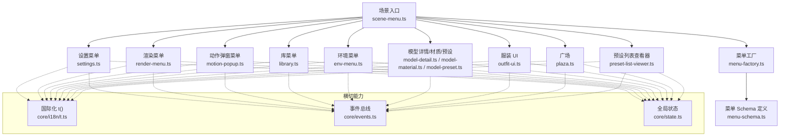
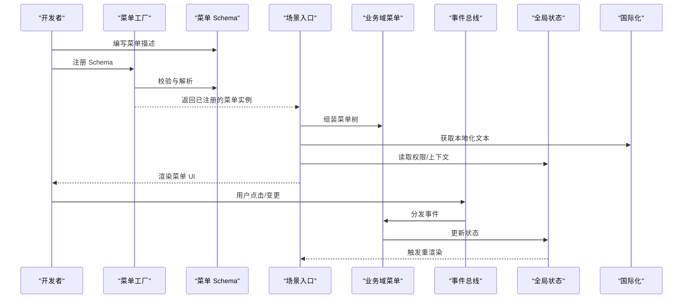
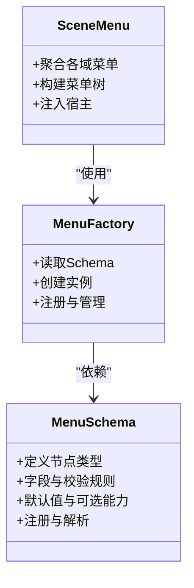
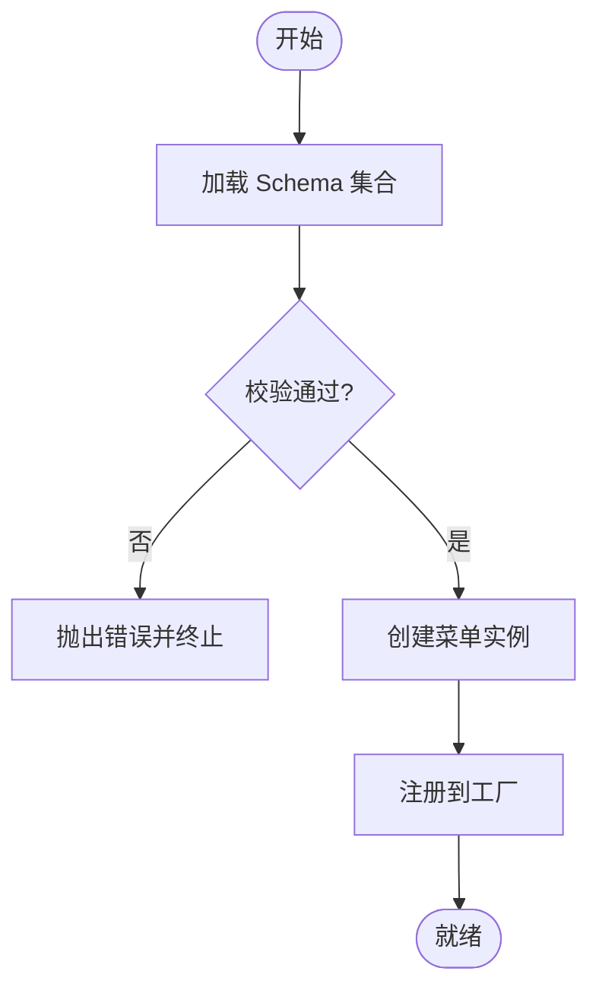
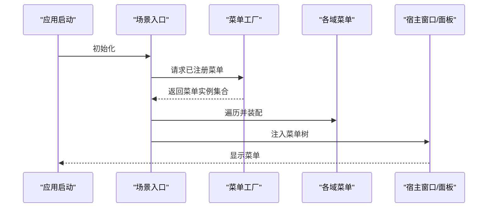
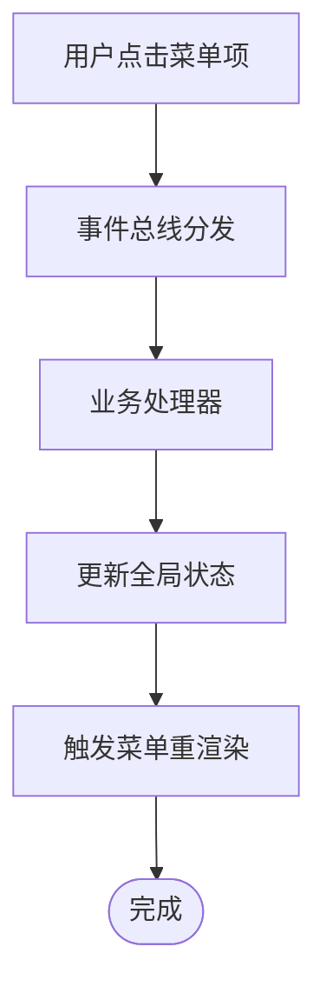
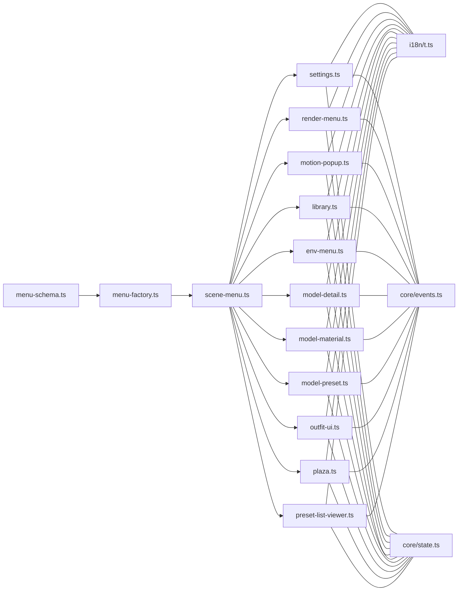

# 菜单系统

<cite>
**本文引用的文件**   
- [menu-schema.ts](file://frontend/src/menus/menu-schema.ts)
- [menu-factory.ts](file://frontend/src/menus/menu-factory.ts)
- [menu.ts](file://frontend/src/menus/menu.ts)
- [scene-menu.ts](file://frontend/src/scene-menu.ts)
- [adr-093-menu-declarative-schema.md](file://docs/adr/adr-093-menu-declarative-schema.md)
- [adr-034-menu-unification.md](file://docs/adr/adr-034-menu-unification.md)
- [settings.ts](file://frontend/src/menus/settings.ts)
- [render-menu.ts](file://frontend/src/menus/render-menu.ts)
- [motion-popup.ts](file://frontend/src/menus/motion-popup.ts)
- [library.ts](file://frontend/src/menus/library.ts)
- [env-menu.ts](file://frontend/src/menus/env-menu.ts)
- [model-detail.ts](file://frontend/src/menus/model-detail.ts)
- [model-material.ts](file://frontend/src/menus/model-material.ts)
- [model-preset.ts](file://frontend/src/menus/model-preset.ts)
- [outfit-ui.ts](file://frontend/src/menus/outfit-ui.ts)
- [plaza.ts](file://frontend/src/menus/plaza.ts)
- [preset-list-viewer.ts](file://frontend/src/menus/preset-list-viewer.ts)
- [resource-detail-helpers.ts](file://frontend/src/menus/resource-detail-helpers.ts)
- [i18n/t.ts](file://frontend/src/core/i18n/t.ts)
- [core/events.ts](file://frontend/src/core/events.ts)
- [core/state.ts](file://frontend/src/core/state.ts)
</cite>

## 目录
1. [简介](#简介)
2. [项目结构](#项目结构)
3. [核心组件](#核心组件)
4. [架构总览](#架构总览)
5. [详细组件分析](#详细组件分析)
6. [依赖关系分析](#依赖关系分析)
7. [性能考量](#性能考量)
8. [故障排查指南](#故障排查指南)
9. [结论](#结论)
10. [附录：开发指南与示例](#附录开发指南与示例)

## 简介
本文件面向“声明式菜单系统”的架构与实现，围绕以下目标展开：
- 解释声明式菜单架构的设计原理与实现机制（菜单模式定义、动态生成、层级管理）
- 说明菜单工厂模式的实现（创建、注册与管理）
- 阐述菜单与业务逻辑解耦设计（事件处理、状态同步、权限控制）
- 提供菜单开发指南（自定义菜单项、主题定制、国际化支持）

该系统的核心思想是“以数据驱动 UI”，通过统一的菜单描述语言（Schema）来声明菜单结构与行为，再由运行时引擎将其渲染为可交互的界面。

## 项目结构
菜单相关代码主要位于前端模块中，采用“分层 + 按领域拆分”的组织方式：
- 声明式 Schema 与工厂：负责菜单描述、解析与实例化
- 场景入口：负责将各功能域菜单装配到应用级菜单树
- 业务域菜单：按功能域组织（设置、渲染、动作、模型、库、环境等）
- 通用能力：国际化、事件总线、状态管理等横切关注点

图表来源
- [scene-menu.ts](file://frontend/src/scene-menu.ts)
- [menu-factory.ts](file://frontend/src/menus/menu-factory.ts)
- [menu-schema.ts](file://frontend/src/menus/menu-schema.ts)
- [settings.ts](file://frontend/src/menus/settings.ts)
- [render-menu.ts](file://frontend/src/menus/render-menu.ts)
- [motion-popup.ts](file://frontend/src/menus/motion-popup.ts)
- [library.ts](file://frontend/src/menus/library.ts)
- [env-menu.ts](file://frontend/src/menus/env-menu.ts)
- [model-detail.ts](file://frontend/src/menus/model-detail.ts)
- [model-material.ts](file://frontend/src/menus/model-material.ts)
- [model-preset.ts](file://frontend/src/menus/model-preset.ts)
- [outfit-ui.ts](file://frontend/src/menus/outfit-ui.ts)
- [plaza.ts](file://frontend/src/menus/plaza.ts)
- [preset-list-viewer.ts](file://frontend/src/menus/preset-list-viewer.ts)
- [i18n/t.ts](file://frontend/src/core/i18n/t.ts)
- [core/events.ts](file://frontend/src/core/events.ts)
- [core/state.ts](file://frontend/src/core/state.ts)

章节来源
- [scene-menu.ts](file://frontend/src/scene-menu.ts)
- [menu-factory.ts](file://frontend/src/menus/menu-factory.ts)
- [menu-schema.ts](file://frontend/src/menus/menu-schema.ts)

## 核心组件
- 菜单 Schema 定义层：集中描述菜单节点类型、字段、校验规则与默认值，保证“声明即契约”。
- 菜单工厂：根据 Schema 动态创建菜单实例，完成注册、挂载与生命周期管理。
- 场景入口：聚合各功能域的菜单，构建最终的应用菜单树并注入到宿主窗口或面板。
- 业务域菜单：每个功能域维护自身的菜单描述与交互逻辑，遵循统一接口，便于扩展与维护。
- 横切能力：国际化、事件总线、状态管理为所有菜单提供一致的能力支撑。

章节来源
- [menu-schema.ts](file://frontend/src/menus/menu-schema.ts)
- [menu-factory.ts](file://frontend/src/menus/menu-factory.ts)
- [scene-menu.ts](file://frontend/src/scene-menu.ts)

## 架构总览
声明式菜单系统的关键流程如下：
- 定义阶段：各功能域以 Schema 形式声明菜单结构、行为与约束
- 注册阶段：工厂读取 Schema，创建并注册菜单实例
- 渲染阶段：根据当前上下文（权限、状态、语言）动态生成可见菜单项
- 交互阶段：用户操作触发事件，经事件总线分发至对应处理器，更新状态并刷新 UI

图表来源
- [menu-factory.ts](file://frontend/src/menus/menu-factory.ts)
- [menu-schema.ts](file://frontend/src/menus/menu-schema.ts)
- [scene-menu.ts](file://frontend/src/scene-menu.ts)
- [core/events.ts](file://frontend/src/core/events.ts)
- [core/state.ts](file://frontend/src/core/state.ts)
- [i18n/t.ts](file://frontend/src/core/i18n/t.ts)

## 详细组件分析

### 菜单 Schema 与模式定义
- 职责：定义菜单节点的类型、字段、校验规则、默认值与可选能力（如权限、可见性、国际化键）。
- 关键点：
  - 类型安全：通过严格模式定义确保后续工厂与渲染器能稳定消费
  - 可扩展：预留扩展字段与钩子，避免频繁破坏性变更
  - 可验证：在注册期进行快速失败校验，减少运行时错误

图表来源
- [menu-schema.ts](file://frontend/src/menus/menu-schema.ts)
- [menu-factory.ts](file://frontend/src/menus/menu-factory.ts)
- [scene-menu.ts](file://frontend/src/scene-menu.ts)

章节来源
- [menu-schema.ts](file://frontend/src/menus/menu-schema.ts)

### 菜单工厂模式（创建、注册与管理）
- 职责：作为菜单实例化的唯一入口，屏蔽具体实现差异，提供统一的注册与查询 API。
- 关键点：
  - 单一职责：仅负责创建与注册，不关心渲染细节
  - 生命周期：提供初始化、销毁、热重载等能力
  - 容错：对非法 Schema 给出明确错误信息，便于定位问题

图表来源
- [menu-factory.ts](file://frontend/src/menus/menu-factory.ts)

章节来源
- [menu-factory.ts](file://frontend/src/menus/menu-factory.ts)

### 场景入口与菜单树装配
- 职责：汇总各功能域菜单，结合上下文（权限、状态、语言）生成最终菜单树并注入到宿主。
- 关键点：
  - 组合优先：通过组合而非继承复用能力
  - 上下文感知：依据当前会话、设备、权限过滤不可见项
  - 可观测：暴露必要的钩子供调试与测试

图表来源
- [scene-menu.ts](file://frontend/src/scene-menu.ts)
- [menu-factory.ts](file://frontend/src/menus/menu-factory.ts)

章节来源
- [scene-menu.ts](file://frontend/src/scene-menu.ts)

### 业务域菜单（示例：设置、渲染、动作、库、环境、模型、服装、广场、预设）
- 设置菜单：集中系统偏好、路径、快捷键、外观等配置项
- 渲染菜单：图形质量、后处理、输出截图等渲染相关选项
- 动作弹窗菜单：播放、暂停、循环、速度等动作控制
- 库菜单：资源浏览、导入、导出、搜索等
- 环境菜单：天空、光照、地面、水体等环境参数
- 模型菜单：详情、材质、预设等模型相关操作
- 服装 UI：换装、材质切换、预览等
- 广场：社区内容浏览与下载
- 预设列表查看器：预设的浏览与应用

这些域均遵循统一 Schema 与工厂协议，从而获得一致的国际化、事件与状态管理能力。

章节来源
- [settings.ts](file://frontend/src/menus/settings.ts)
- [render-menu.ts](file://frontend/src/menus/render-menu.ts)
- [motion-popup.ts](file://frontend/src/menus/motion-popup.ts)
- [library.ts](file://frontend/src/menus/library.ts)
- [env-menu.ts](file://frontend/src/menus/env-menu.ts)
- [model-detail.ts](file://frontend/src/menus/model-detail.ts)
- [model-material.ts](file://frontend/src/menus/model-material.ts)
- [model-preset.ts](file://frontend/src/menus/model-preset.ts)
- [outfit-ui.ts](file://frontend/src/menus/outfit-ui.ts)
- [plaza.ts](file://frontend/src/menus/plaza.ts)
- [preset-list-viewer.ts](file://frontend/src/menus/preset-list-viewer.ts)

### 事件处理、状态同步与权限控制
- 事件处理：通过事件总线解耦 UI 与业务逻辑，避免直接耦合
- 状态同步：菜单项的状态来源于全局状态，变化时自动刷新
- 权限控制：基于角色/会话/上下文决定是否可见或可用

图表来源
- [core/events.ts](file://frontend/src/core/events.ts)
- [core/state.ts](file://frontend/src/core/state.ts)

章节来源
- [core/events.ts](file://frontend/src/core/events.ts)
- [core/state.ts](file://frontend/src/core/state.ts)

## 依赖关系分析
- 低耦合：菜单工厂与业务域菜单之间通过 Schema 与接口约定通信，降低相互依赖
- 高内聚：每个业务域菜单内部自包含其逻辑与视图，便于独立演进
- 横切关注点：国际化、事件、状态等被抽象为共享能力，避免重复实现

图表来源
- [menu-schema.ts](file://frontend/src/menus/menu-schema.ts)
- [menu-factory.ts](file://frontend/src/menus/menu-factory.ts)
- [scene-menu.ts](file://frontend/src/scene-menu.ts)
- [settings.ts](file://frontend/src/menus/settings.ts)
- [render-menu.ts](file://frontend/src/menus/render-menu.ts)
- [motion-popup.ts](file://frontend/src/menus/motion-popup.ts)
- [library.ts](file://frontend/src/menus/library.ts)
- [env-menu.ts](file://frontend/src/menus/env-menu.ts)
- [model-detail.ts](file://frontend/src/menus/model-detail.ts)
- [model-material.ts](file://frontend/src/menus/model-material.ts)
- [model-preset.ts](file://frontend/src/menus/model-preset.ts)
- [outfit-ui.ts](file://frontend/src/menus/outfit-ui.ts)
- [plaza.ts](file://frontend/src/menus/plaza.ts)
- [preset-list-viewer.ts](file://frontend/src/menus/preset-list-viewer.ts)
- [i18n/t.ts](file://frontend/src/core/i18n/t.ts)
- [core/events.ts](file://frontend/src/core/events.ts)
- [core/state.ts](file://frontend/src/core/state.ts)

章节来源
- [menu-schema.ts](file://frontend/src/menus/menu-schema.ts)
- [menu-factory.ts](file://frontend/src/menus/menu-factory.ts)
- [scene-menu.ts](file://frontend/src/scene-menu.ts)

## 性能考量
- 延迟渲染：仅在需要时构建菜单树，避免一次性全量渲染
- 增量更新：基于状态变化最小化重绘范围
- 缓存策略：对静态菜单项与昂贵计算结果进行缓存
- 异步加载：对大型菜单或远程数据进行懒加载与分页

[本节为通用指导，无需源码引用]

## 故障排查指南
- 注册失败：检查 Schema 是否满足校验规则，确认工厂是否正确接收与解析
- 菜单不显示：核对权限与可见性条件，确认上下文状态是否符合预期
- 文本未本地化：确认国际化键是否存在且语言包已加载
- 事件无响应：检查事件名称与处理器绑定是否正确，确认事件总线是否启用

章节来源
- [menu-schema.ts](file://frontend/src/menus/menu-schema.ts)
- [menu-factory.ts](file://frontend/src/menus/menu-factory.ts)
- [i18n/t.ts](file://frontend/src/core/i18n/t.ts)
- [core/events.ts](file://frontend/src/core/events.ts)

## 结论
声明式菜单系统通过“Schema + 工厂 + 场景装配”的分层设计，实现了菜单的高内聚、低耦合与强扩展性。配合事件总线、状态管理与国际化能力，使得菜单与业务逻辑有效解耦，同时具备良好的可测试性与可维护性。

[本节为总结，无需源码引用]

## 附录：开发指南与示例

### 自定义菜单项实现步骤
- 定义 Schema：在菜单 Schema 中新增节点类型与字段
- 注册工厂：在工厂中为新类型提供创建逻辑
- 编写业务域菜单：在对应域文件中声明菜单描述与交互
- 装配到场景：在场景入口中引入并加入菜单树
- 测试与验证：覆盖边界条件与异常路径

章节来源
- [menu-schema.ts](file://frontend/src/menus/menu-schema.ts)
- [menu-factory.ts](file://frontend/src/menus/menu-factory.ts)
- [scene-menu.ts](file://frontend/src/scene-menu.ts)

### 菜单主题定制
- 主题变量：通过 CSS 变量或主题对象定义颜色、间距、字体等
- 动态切换：监听主题变更事件，按需替换样式
- 一致性：确保所有菜单项遵循同一套主题规范

章节来源
- [settings.ts](file://frontend/src/menus/settings.ts)
- [render-menu.ts](file://frontend/src/menus/render-menu.ts)

### 国际化支持
- 键命名：为所有用户可见文本定义稳定的键名
- 加载语言包：在应用启动时加载当前语言包
- 动态切换：切换语言后重新渲染菜单文本

章节来源
- [i18n/t.ts](file://frontend/src/core/i18n/t.ts)
- [settings.ts](file://frontend/src/menus/settings.ts)

### 参考文档与设计决策
- 声明式菜单架构决策记录
- 菜单统一化改造记录

章节来源
- [adr-093-menu-declarative-schema.md](file://docs/adr/adr-093-menu-declarative-schema.md)
- [adr-034-menu-unification.md](file://docs/adr/adr-034-menu-unification.md)