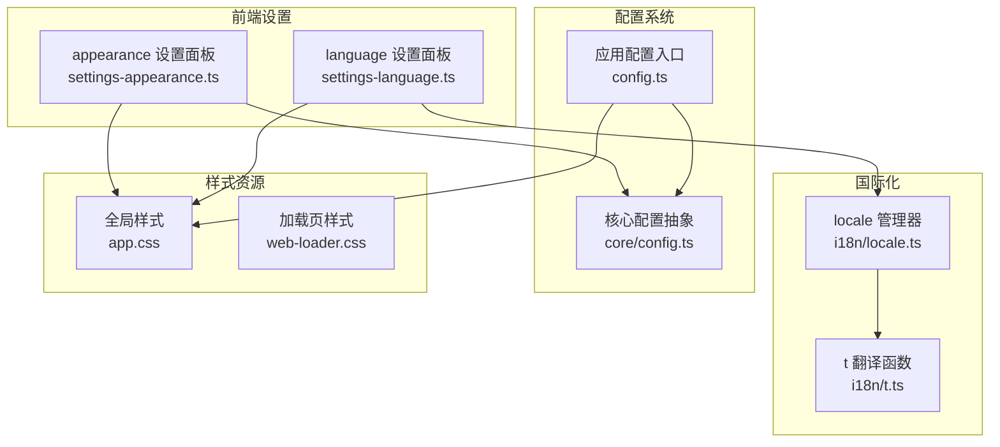
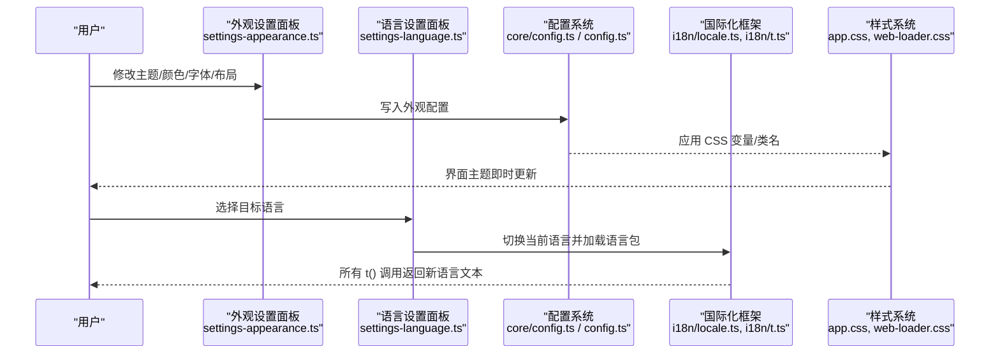
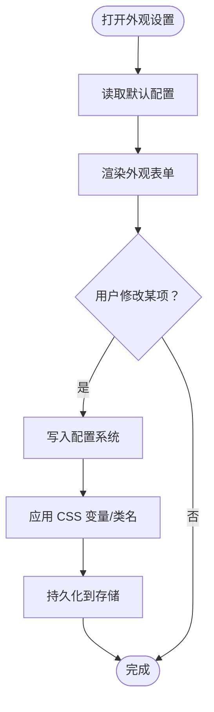
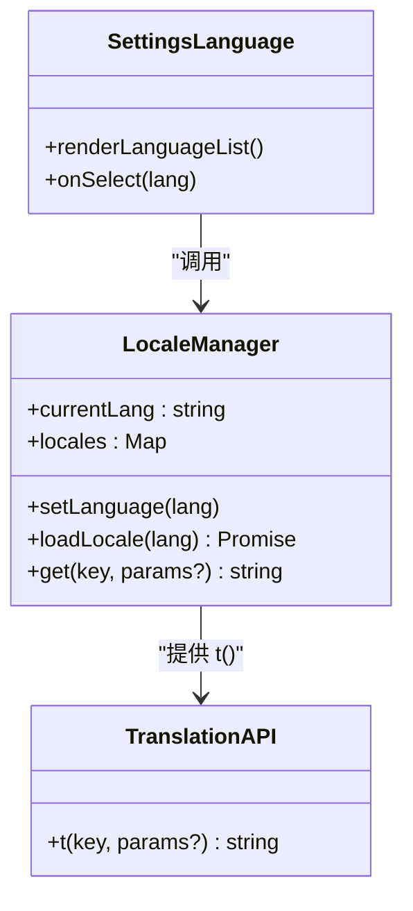
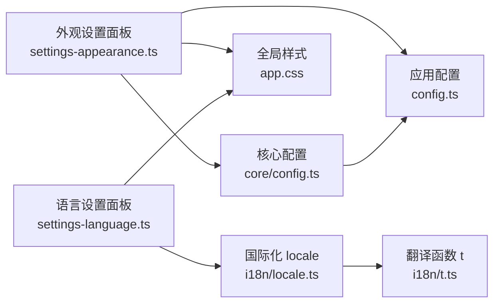

# 外观设置

<cite>
**本文引用的文件**   
- [settings-appearance.ts](file://frontend/src/menus/settings-appearance.ts)
- [settings-language.ts](file://frontend/src/menus/settings-language.ts)
- [i18n/locale.ts](file://frontend/src/core/i18n/locale.ts)
- [i18n/t.ts](file://frontend/src/core/i18n/t.ts)
- [core/config.ts](file://frontend/src/core/config.ts)
- [config.ts](file://frontend/src/config.ts)
- [app.css](file://frontend/src/app.css)
- [web-loader.css](file://frontend/src/web-loader/web-loader.css)
- [ADR-059-i18n-framework.md](file://docs/adr/adr-059-i18n-framework.md)
- [buglog/UI 硬编码中文无法切换语言.md](file://docs/buglog/UI 硬编码中文无法切换语言.md)
</cite>

## 目录
1. [简介](#简介)
2. [项目结构](#项目结构)
3. [核心组件](#核心组件)
4. [架构总览](#架构总览)
5. [详细组件分析](#详细组件分析)
6. [依赖关系分析](#依赖关系分析)
7. [性能考量](#性能考量)
8. [故障排查指南](#故障排查指南)
9. [结论](#结论)
10. [附录](#附录)

## 简介
本文件面向“外观设置”主题，系统性说明界面主题配置、多语言支持、缩放与适配机制、自定义主题创建方法，并提供使用示例与常见问题解决方案。内容覆盖颜色方案、字体设置、布局偏好、语言包管理、动态切换、本地化字符串处理、高分屏适配与响应式布局等关键方面。

## 项目结构
与外观设置直接相关的代码主要分布在以下位置：
- 前端菜单与设置面板：settings-appearance.ts、settings-language.ts
- 国际化框架：i18n/locale.ts、i18n/t.ts
- 配置持久化与默认值：core/config.ts、config.ts
- 全局样式与加载页样式：app.css、web-loader.css
- 设计决策文档与问题记录：ADR-059-i18n-framework.md、UI 硬编码中文无法切换语言.md

图表来源
- [settings-appearance.ts](file://frontend/src/menus/settings-appearance.ts)
- [settings-language.ts](file://frontend/src/menus/settings-language.ts)
- [i18n/locale.ts](file://frontend/src/core/i18n/locale.ts)
- [i18n/t.ts](file://frontend/src/core/i18n/t.ts)
- [config.ts](file://frontend/src/config.ts)
- [core/config.ts](file://frontend/src/core/config.ts)
- [app.css](file://frontend/src/app.css)
- [web-loader.css](file://frontend/src/web-loader/web-loader.css)

章节来源
- [settings-appearance.ts](file://frontend/src/menus/settings-appearance.ts)
- [settings-language.ts](file://frontend/src/menus/settings-language.ts)
- [i18n/locale.ts](file://frontend/src/core/i18n/locale.ts)
- [i18n/t.ts](file://frontend/src/core/i18n/t.ts)
- [config.ts](file://frontend/src/config.ts)
- [core/config.ts](file://frontend/src/core/config.ts)
- [app.css](file://frontend/src/app.css)
- [web-loader.css](file://frontend/src/web-loader/web-loader.css)

## 核心组件
- 外观设置面板：提供主题、颜色、字体、布局等可视化配置项的交互入口，并将用户选择写入配置系统。
- 语言设置面板：提供语言列表展示与切换操作，触发语言包加载与界面文本更新。
- 国际化框架：负责语言包注册、当前语言状态维护、字符串查找与回退策略。
- 配置系统：定义配置的默认值、读写接口与持久化策略，供外观与语言设置读取与保存。
- 样式资源：通过 CSS 变量或类名控制主题色、字体族、字号、间距等视觉表现；加载页样式用于启动阶段体验优化。

章节来源
- [settings-appearance.ts](file://frontend/src/menus/settings-appearance.ts)
- [settings-language.ts](file://frontend/src/menus/settings-language.ts)
- [i18n/locale.ts](file://frontend/src/core/i18n/locale.ts)
- [i18n/t.ts](file://frontend/src/core/i18n/t.ts)
- [config.ts](file://frontend/src/config.ts)
- [core/config.ts](file://frontend/src/core/config.ts)
- [app.css](file://frontend/src/app.css)
- [web-loader.css](file://frontend/src/web-loader/web-loader.css)

## 架构总览
外观设置的运行流程围绕“用户交互 → 配置更新 → 样式/文本即时生效”展开。语言切换会触发语言包加载与 UI 文本刷新；外观变更会更新 CSS 变量或类名以反映新主题。

图表来源
- [settings-appearance.ts](file://frontend/src/menus/settings-appearance.ts)
- [settings-language.ts](file://frontend/src/menus/settings-language.ts)
- [core/config.ts](file://frontend/src/core/config.ts)
- [config.ts](file://frontend/src/config.ts)
- [i18n/locale.ts](file://frontend/src/core/i18n/locale.ts)
- [i18n/t.ts](file://frontend/src/core/i18n/t.ts)
- [app.css](file://frontend/src/app.css)
- [web-loader.css](file://frontend/src/web-loader/web-loader.css)

## 详细组件分析

### 外观设置面板（主题、颜色、字体、布局）
- 职责
  - 提供主题模式（如浅色/深色）、主色/强调色、字体族与字号、行高与间距、侧边栏宽度、面板折叠状态等选项。
  - 将用户选择写入配置系统，并在运行时立即应用到 DOM/CSS。
- 数据流
  - 读取默认配置 → 渲染表单控件 → 监听变更 → 更新配置 → 应用样式。
- 关键点
  - 使用 CSS 变量集中管理主题色与尺寸，避免硬编码。
  - 字体与字号需考虑可读性与多语言文本长度差异。
  - 布局偏好应支持不同窗口尺寸下的响应式行为。

图表来源
- [settings-appearance.ts](file://frontend/src/menus/settings-appearance.ts)
- [core/config.ts](file://frontend/src/core/config.ts)
- [config.ts](file://frontend/src/config.ts)
- [app.css](file://frontend/src/app.css)

章节来源
- [settings-appearance.ts](file://frontend/src/menus/settings-appearance.ts)
- [core/config.ts](file://frontend/src/core/config.ts)
- [config.ts](file://frontend/src/config.ts)
- [app.css](file://frontend/src/app.css)

### 语言设置面板与国际化框架
- 职责
  - 显示可用语言列表，支持动态切换。
  - 管理语言包加载、缓存与回退策略。
  - 为 UI 提供统一的 t() 翻译函数。
- 数据流
  - 选择语言 → 触发语言包加载 → 更新当前语言状态 → 刷新所有 t() 结果 → 重绘界面文本。
- 关键点
  - 语言包按需加载，避免首屏过大。
  - 缺失键时采用回退语言或占位符，确保不出现空白。
  - 切换语言后应触发必要的重排与焦点恢复。

图表来源
- [i18n/locale.ts](file://frontend/src/core/i18n/locale.ts)
- [i18n/t.ts](file://frontend/src/core/i18n/t.ts)
- [settings-language.ts](file://frontend/src/menus/settings-language.ts)

章节来源
- [settings-language.ts](file://frontend/src/menus/settings-language.ts)
- [i18n/locale.ts](file://frontend/src/core/i18n/locale.ts)
- [i18n/t.ts](file://frontend/src/core/i18n/t.ts)
- [ADR-059-i18n-framework.md](file://docs/adr/adr-059-i18n-framework.md)

### 配置系统与持久化
- 职责
  - 定义外观与语言的默认值。
  - 提供 get/set 接口，封装存储后端（如 localStorage）。
  - 在应用启动时合并默认值与用户配置。
- 关键点
  - 配置变更事件驱动 UI 实时响应。
  - 对敏感或大型配置进行分块与懒加载。
  - 版本迁移策略保证向后兼容。

章节来源
- [core/config.ts](file://frontend/src/core/config.ts)
- [config.ts](file://frontend/src/config.ts)

### 样式系统与主题变量
- 职责
  - 通过 CSS 变量定义主题色、字体族、字号、行高、间距、圆角、阴影等。
  - 根据配置动态注入变量值或切换主题类名。
  - 为加载页提供独立样式，提升启动体验。
- 关键点
  - 变量命名遵循语义化约定，便于扩展与维护。
  - 针对高分辨率屏幕使用相对单位与媒体查询。
  - 避免在 JS 中直接操作内联样式，优先使用 CSS 变量。

章节来源
- [app.css](file://frontend/src/app.css)
- [web-loader.css](file://frontend/src/web-loader/web-loader.css)

## 依赖关系分析
外观设置与国际化、配置、样式之间的依赖如下：

图表来源
- [settings-appearance.ts](file://frontend/src/menus/settings-appearance.ts)
- [settings-language.ts](file://frontend/src/menus/settings-language.ts)
- [core/config.ts](file://frontend/src/core/config.ts)
- [config.ts](file://frontend/src/config.ts)
- [i18n/locale.ts](file://frontend/src/core/i18n/locale.ts)
- [i18n/t.ts](file://frontend/src/core/i18n/t.ts)
- [app.css](file://frontend/src/app.css)

章节来源
- [settings-appearance.ts](file://frontend/src/menus/settings-appearance.ts)
- [settings-language.ts](file://frontend/src/menus/settings-language.ts)
- [core/config.ts](file://frontend/src/core/config.ts)
- [config.ts](file://frontend/src/config.ts)
- [i18n/locale.ts](file://frontend/src/core/i18n/locale.ts)
- [i18n/t.ts](file://frontend/src/core/i18n/t.ts)
- [app.css](file://frontend/src/app.css)

## 性能考量
- 语言包按需加载与缓存，减少首屏体积与切换开销。
- 外观变更批量更新 CSS 变量，避免频繁重排。
- 使用 CSS 变量与类名切换替代大量内联样式计算。
- 对长文本与复杂布局进行测量与节流，防止卡顿。
- 高分屏下合理使用 rem/em 与媒体查询，避免过度重绘。

[本节为通用指导，无需具体文件引用]

## 故障排查指南
- 现象：切换语言后部分文本未更新
  - 检查是否遗漏对 t() 的调用或使用了硬编码字符串。
  - 确认语言包已正确加载且包含对应键。
  - 参考相关缺陷记录定位历史问题。
- 现象：主题切换无效或闪烁
  - 检查 CSS 变量是否正确注入，是否存在优先级冲突。
  - 确认样式文件被正确引入，无路径错误。
- 现象：字体显示异常或换行错乱
  - 验证字体族与字重是否可用，必要时添加 fallback。
  - 检查行高与字号在多语言下的可读性。

章节来源
- [buglog/UI 硬编码中文无法切换语言.md](file://docs/buglog/UI 硬编码中文无法切换语言.md)
- [app.css](file://frontend/src/app.css)
- [web-loader.css](file://frontend/src/web-loader/web-loader.css)

## 结论
外观设置通过“配置系统 + 样式变量 + 国际化框架”的协同工作，实现了主题、字体、布局与多语言的统一管理与即时生效。建议持续完善 CSS 变量体系、语言包质量与响应式适配，以提升用户体验与可维护性。

[本节为总结性内容，无需具体文件引用]

## 附录

### 自定义主题创建指南
- 步骤
  - 定义主题变量：在样式文件中新增一组语义化的 CSS 变量（如主题色、强调色、背景、文字、边框等）。
  - 组织主题文件：按模块拆分样式，便于维护与按需加载。
  - 接入配置系统：在配置中增加主题标识与变量映射，供外观设置面板读取与写入。
  - 实现动态加载：在切换主题时批量更新 CSS 变量或切换主题类名，确保即时生效。
- 最佳实践
  - 变量命名遵循“作用域-属性-变体”的约定。
  - 提供浅色/深色两套基础主题，再基于其派生定制主题。
  - 对字体与字号提供多语言友好的默认值与范围限制。

章节来源
- [app.css](file://frontend/src/app.css)
- [core/config.ts](file://frontend/src/core/config.ts)
- [config.ts](file://frontend/src/config.ts)
- [settings-appearance.ts](file://frontend/src/menus/settings-appearance.ts)

### 实际使用示例
- 切换主题
  - 在外观设置中选择新主题 → 配置更新 → CSS 变量刷新 → 界面主题即时变化。
- 切换语言
  - 在语言设置中选择目标语言 → 加载语言包 → 所有 t() 调用返回新语言文本 → 界面文本刷新。
- 调整字体与布局
  - 修改字体族/字号/行高/间距 → 配置更新 → 样式变量应用 → 界面排版即时调整。

章节来源
- [settings-appearance.ts](file://frontend/src/menus/settings-appearance.ts)
- [settings-language.ts](file://frontend/src/menus/settings-language.ts)
- [i18n/locale.ts](file://frontend/src/core/i18n/locale.ts)
- [i18n/t.ts](file://frontend/src/core/i18n/t.ts)
- [core/config.ts](file://frontend/src/core/config.ts)
- [config.ts](file://frontend/src/config.ts)
- [app.css](file://frontend/src/app.css)

### 高分辨率与响应式适配要点
- 使用相对单位（rem/em）与视口单位（vw/vh），配合媒体查询实现自适应。
- 图标与纹理资源提供多倍图，避免模糊。
- 布局容器采用弹性与网格布局，在小窗口下自动折行与隐藏次要信息。
- 测试不同 DPI 与窗口尺寸，确保可读性与可用性。

[本节为通用指导，无需具体文件引用]