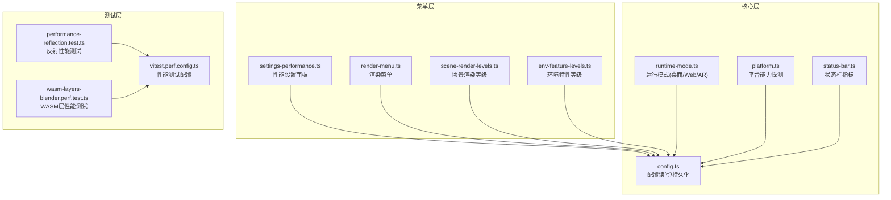
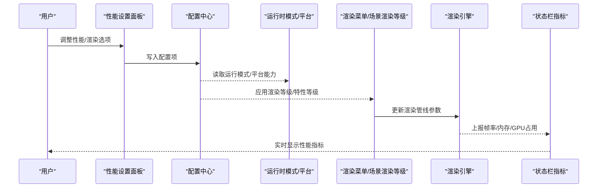
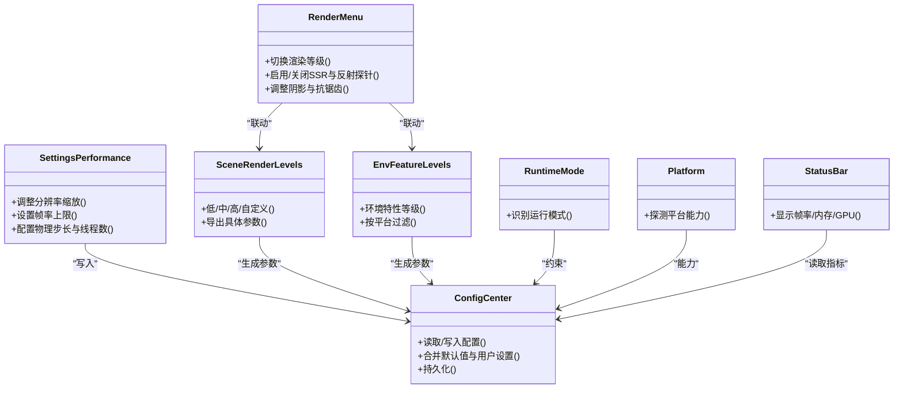

# 性能设置

<cite>
**本文引用的文件**   
- [settings-performance.ts](file://frontend/src/menus/settings-performance.ts)
- [render-menu.ts](file://frontend/src/menus/render-menu.ts)
- [scene-render-levels.ts](file://frontend/src/menus/scene-render-levels.ts)
- [env-feature-levels.ts](file://frontend/src/menus/env-feature-levels.ts)
- [config.ts](file://frontend/src/core/config.ts)
- [runtime-mode.ts](file://frontend/src/core/runtime-mode.ts)
- [platform.ts](file://frontend/src/core/platform.ts)
- [status-bar.ts](file://frontend/src/core/status-bar.ts)
- [performance-reflection.test.ts](file://frontend/src/__tests__/scene/performance-reflection.test.ts)
- [wasm-layers-blender.perf.test.ts](file://frontend/src/__tests__/wasm-layers-blender.perf.test.ts)
- [vitest.perf.config.ts](file://frontend/vitest.perf.config.ts)
- [ADR-046-render-custom-mode.md](file://docs/adr/adr-046-render-custom-mode.md)
- [ADR-024-rendering-enhancement-phase2-ssr-reflectionprobe.md](file://docs/adr/adr-024-rendering-enhancement-phase2-ssr-reflectionprobe.md)
</cite>

## 目录
1. [简介](#简介)
2. [项目结构](#项目结构)
3. [核心组件](#核心组件)
4. [架构总览](#架构总览)
5. [详细组件分析](#详细组件分析)
6. [依赖关系分析](#依赖关系分析)
7. [性能考虑](#性能考虑)
8. [故障排除指南](#故障排除指南)
9. [结论](#结论)
10. [附录](#附录)

## 简介
本文件聚焦于“性能设置”的完整说明，覆盖渲染质量调节、内存使用控制、CPU/GPU资源分配策略，以及性能监控与基准测试方法。文档同时给出桌面端、移动端和Web端的差异化调优建议，并提供针对常见硬件配置的性能优化与排障指引。

## 项目结构
与性能设置直接相关的代码主要位于前端菜单层与核心配置层：
- 菜单层：提供用户可交互的性能与渲染选项（如分辨率缩放、反射质量、环境特性等级等）
- 核心层：负责配置持久化、运行时模式识别、平台能力探测与状态栏指标展示
- 测试层：包含性能回归与基准测试用例及配置

图表来源
- [settings-performance.ts:1-200](file://frontend/src/menus/settings-performance.ts#L1-L200)
- [render-menu.ts:1-200](file://frontend/src/menus/render-menu.ts#L1-L200)
- [scene-render-levels.ts:1-200](file://frontend/src/menus/scene-render-levels.ts#L1-L200)
- [env-feature-levels.ts:1-200](file://frontend/src/menus/env-feature-levels.ts#L1-L200)
- [config.ts:1-200](file://frontend/src/core/config.ts#L1-L200)
- [runtime-mode.ts:1-200](file://frontend/src/core/runtime-mode.ts#L1-L200)
- [platform.ts:1-200](file://frontend/src/core/platform.ts#L1-L200)
- [status-bar.ts:1-200](file://frontend/src/core/status-bar.ts#L1-L200)
- [performance-reflection.test.ts:1-200](file://frontend/src/__tests__/scene/performance-reflection.test.ts#L1-L200)
- [wasm-layers-blender.perf.test.ts:1-200](file://frontend/src/__tests__/wasm-layers-blender.perf.test.ts#L1-L200)
- [vitest.perf.config.ts:1-200](file://frontend/vitest.perf.config.ts#L1-L200)

章节来源
- [settings-performance.ts:1-200](file://frontend/src/menus/settings-performance.ts#L1-L200)
- [render-menu.ts:1-200](file://frontend/src/menus/render-menu.ts#L1-L200)
- [scene-render-levels.ts:1-200](file://frontend/src/menus/scene-render-levels.ts#L1-L200)
- [env-feature-levels.ts:1-200](file://frontend/src/menus/env-feature-levels.ts#L1-L200)
- [config.ts:1-200](file://frontend/src/core/config.ts#L1-L200)
- [runtime-mode.ts:1-200](file://frontend/src/core/runtime-mode.ts#L1-L200)
- [platform.ts:1-200](file://frontend/src/core/platform.ts#L1-L200)
- [status-bar.ts:1-200](file://frontend/src/core/status-bar.ts#L1-L200)
- [performance-reflection.test.ts:1-200](file://frontend/src/__tests__/scene/performance-reflection.test.ts#L1-L200)
- [wasm-layers-blender.perf.test.ts:1-200](file://frontend/src/__tests__/wasm-layers-blender.perf.test.ts#L1-L200)
- [vitest.perf.config.ts:1-200](file://frontend/vitest.perf.config.ts#L1-L200)

## 核心组件
- 性能设置面板：提供分辨率缩放、帧率上限、阴影/反射/后处理开关与强度、物理步长与线程数等关键性能参数
- 渲染菜单：集中管理渲染管线相关选项（如SSR、反射探针、水面、体积云等）
- 场景渲染等级与环境特性等级：将复杂选项抽象为“低/中/高/自定义”预设，简化用户选择并自动推导具体参数
- 配置中心：负责读取、校验、合并与持久化所有性能相关配置项
- 运行时模式与平台探测：识别当前运行环境（桌面/Web/AR），用于限制或推荐特定功能
- 状态栏指标：在UI上实时显示帧率、GPU/CPU占用、内存等关键指标，辅助定位瓶颈

章节来源
- [settings-performance.ts:1-200](file://frontend/src/menus/settings-performance.ts#L1-L200)
- [render-menu.ts:1-200](file://frontend/src/menus/render-menu.ts#L1-L200)
- [scene-render-levels.ts:1-200](file://frontend/src/menus/scene-render-levels.ts#L1-L200)
- [env-feature-levels.ts:1-200](file://frontend/src/menus/env-feature-levels.ts#L1-L200)
- [config.ts:1-200](file://frontend/src/core/config.ts#L1-L200)
- [runtime-mode.ts:1-200](file://frontend/src/core/runtime-mode.ts#L1-L200)
- [platform.ts:1-200](file://frontend/src/core/platform.ts#L1-L200)
- [status-bar.ts:1-200](file://frontend/src/core/status-bar.ts#L1-L200)

## 架构总览
下图展示了从用户操作到渲染执行与指标采集的整体流程。

图表来源
- [settings-performance.ts:1-200](file://frontend/src/menus/settings-performance.ts#L1-L200)
- [config.ts:1-200](file://frontend/src/core/config.ts#L1-L200)
- [runtime-mode.ts:1-200](file://frontend/src/core/runtime-mode.ts#L1-L200)
- [platform.ts:1-200](file://frontend/src/core/platform.ts#L1-L200)
- [render-menu.ts:1-200](file://frontend/src/menus/render-menu.ts#L1-L200)
- [scene-render-levels.ts:1-200](file://frontend/src/menus/scene-render-levels.ts#L1-L200)
- [status-bar.ts:1-200](file://frontend/src/core/status-bar.ts#L1-L200)

## 详细组件分析

### 性能设置面板（settings-performance.ts）
- 职责：暴露分辨率缩放、帧率上限、物理步长、线程数、纹理压缩、LOD阈值等关键性能开关与滑块
- 交互逻辑：变更时即时写入配置中心，并根据运行模式进行可用性校验与提示
- 典型影响：
  - 分辨率缩放直接影响像素填充率与GPU压力
  - 物理步长与线程数影响CPU负载与稳定性
  - 纹理压缩与LOD影响显存占用与加载时间

章节来源
- [settings-performance.ts:1-200](file://frontend/src/menus/settings-performance.ts#L1-L200)

### 渲染菜单（render-menu.ts）
- 职责：统一管理渲染管线相关选项，包括SSR、反射探针、水面、体积云、阴影质量、抗锯齿等
- 联动机制：与“场景渲染等级”和“环境特性等级”联动，支持一键切换预设或进入“自定义模式”
- 重要参考：
  - ADR-046 定义了“自定义渲染模式”的能力边界与交互契约
  - ADR-024 描述了SSR与反射探针增强对性能的影响与取舍

章节来源
- [render-menu.ts:1-200](file://frontend/src/menus/render-menu.ts#L1-L200)
- [ADR-046-render-custom-mode.md:1-200](file://docs/adr/adr-046-render-custom-mode.md#L1-L200)
- [ADR-024-rendering-enhancement-phase2-ssr-reflectionprobe.md:1-200](file://docs/adr/adr-024-rendering-enhancement-phase2-ssr-reflectionprobe.md#L1-L200)

### 场景渲染等级与环境特性等级（scene-render-levels.ts / env-feature-levels.ts）
- 职责：将复杂的渲染与环境选项映射为“低/中/高/自定义”等级，便于快速调优
- 行为：
  - 低：关闭昂贵特效（如SSR、体积云），降低阴影与反射质量
  - 中：平衡画质与性能，保留必要反射与中等阴影
  - 高：开启全部高质量特性，适合桌面独显
  - 自定义：允许用户逐项微调，由配置中心保存
- 适用性：根据平台能力与运行模式动态启用/禁用某些等级或特性

章节来源
- [scene-render-levels.ts:1-200](file://frontend/src/menus/scene-render-levels.ts#L1-L200)
- [env-feature-levels.ts:1-200](file://frontend/src/menus/env-feature-levels.ts#L1-L200)

### 配置中心（config.ts）
- 职责：统一读写性能相关配置项，提供默认值、校验规则与持久化存储
- 关键点：
  - 合并策略：用户配置 > 预设等级 > 默认值
  - 平台适配：根据平台能力限制不可用选项
  - 热更新：部分参数可在运行时生效，无需重启

章节来源
- [config.ts:1-200](file://frontend/src/core/config.ts#L1-L200)

### 运行时模式与平台探测（runtime-mode.ts / platform.ts）
- 职责：识别当前运行环境（桌面/Web/AR），探测GPU/CPU/内存能力，用于限制或推荐性能选项
- 输出：
  - 运行模式：决定是否允许某些高级特性
  - 平台能力：决定可用分辨率范围、最大纹理尺寸、是否支持SSR/体积云等

章节来源
- [runtime-mode.ts:1-200](file://frontend/src/core/runtime-mode.ts#L1-L200)
- [platform.ts:1-200](file://frontend/src/core/platform.ts#L1-L200)

### 状态栏指标（status-bar.ts）
- 职责：在UI上展示帧率、内存占用、GPU/CPU占用等关键指标，帮助快速定位瓶颈
- 数据源：来自渲染循环与系统API的周期性采样

章节来源
- [status-bar.ts:1-200](file://frontend/src/core/status-bar.ts#L1-L200)

### 性能测试与基准测试
- 反射性能测试：验证不同反射质量下的帧率与显存变化
- WASM层性能测试：评估骨骼物理与程序化动作的CPU开销
- 性能测试配置：定义基准场景、指标收集与结果对比方式

章节来源
- [performance-reflection.test.ts:1-200](file://frontend/src/__tests__/scene/performance-reflection.test.ts#L1-L200)
- [wasm-layers-blender.perf.test.ts:1-200](file://frontend/src/__tests__/wasm-layers-blender.perf.test.ts#L1-L200)
- [vitest.perf.config.ts:1-200](file://frontend/vitest.perf.config.ts#L1-L200)

## 依赖关系分析
- 菜单层依赖配置中心与平台信息，确保选项可用性与一致性
- 渲染菜单与场景/环境等级共同驱动渲染管线参数
- 状态栏指标依赖渲染循环与系统API，形成闭环反馈

图表来源
- [settings-performance.ts:1-200](file://frontend/src/menus/settings-performance.ts#L1-L200)
- [render-menu.ts:1-200](file://frontend/src/menus/render-menu.ts#L1-L200)
- [scene-render-levels.ts:1-200](file://frontend/src/menus/scene-render-levels.ts#L1-L200)
- [env-feature-levels.ts:1-200](file://frontend/src/menus/env-feature-levels.ts#L1-L200)
- [config.ts:1-200](file://frontend/src/core/config.ts#L1-L200)
- [runtime-mode.ts:1-200](file://frontend/src/core/runtime-mode.ts#L1-L200)
- [platform.ts:1-200](file://frontend/src/core/platform.ts#L1-L200)
- [status-bar.ts:1-200](file://frontend/src/core/status-bar.ts#L1-L200)

## 性能考虑
- 渲染质量调节
  - 分辨率缩放：优先保证目标帧率，逐步提升直至出现卡顿
  - SSR与反射探针：在移动/低端设备上建议关闭或降级；桌面独显可开启中等质量
  - 阴影与抗锯齿：根据屏幕尺寸与观看距离调整，避免过度采样
  - 水面与体积云：仅在高端设备或固定机位下开启
- 内存使用控制
  - 纹理压缩与LOD：合理设置压缩格式与LOD阈值，减少显存峰值
  - 资源卸载与缓存：避免长时间持有大纹理与模型，及时释放
- CPU/GPU资源分配
  - 物理步长与线程数：提高步长可降低CPU抖动但可能影响稳定性；多线程需结合场景复杂度评估
  - 渲染队列与批处理：减少Draw Call，合并材质与几何体
- 平台差异
  - 桌面端：可开启高质量特性，关注GPU温度与功耗
  - 移动端：优先保证续航与发热，关闭昂贵特效，降低分辨率与刷新率
  - Web端：受浏览器与沙箱限制，谨慎使用大型纹理与复杂后处理

[本节为通用指导，不直接分析具体文件]

## 故障排除指南
- 帧率骤降
  - 检查状态栏指标，确认是否为GPU或CPU瓶颈
  - 临时关闭SSR/反射探针/体积云，观察改善情况
  - 降低分辨率缩放与阴影质量
- 内存泄漏或峰值过高
  - 检查是否存在未释放的大纹理或模型
  - 调整LOD与纹理压缩，减少显存占用
- 物理不稳定或卡顿
  - 降低物理步长，增加稳定系数
  - 减少并发物理对象数量，必要时关闭程序化动作
- 平台兼容问题
  - 通过平台探测结果限制不可用特性
  - 在Web端注意浏览器版本与WebGL/WebGPU支持

章节来源
- [status-bar.ts:1-200](file://frontend/src/core/status-bar.ts#L1-L200)
- [platform.ts:1-200](file://frontend/src/core/platform.ts#L1-L200)
- [settings-performance.ts:1-200](file://frontend/src/menus/settings-performance.ts#L1-L200)

## 结论
通过“等级+自定义”的双轨制性能设置体系，配合配置中心的统一管理与平台能力的动态适配，可以在不同设备与运行模式下实现稳定的性能表现。建议以状态栏指标为依据，采用渐进式调优策略，并在基准测试中持续验证效果。

[本节为总结性内容，不直接分析具体文件]

## 附录
- 常用术语
  - SSR：屏幕空间反射
  - LOD：细节层次
  - Draw Call：绘制调用
- 参考文档
  - ADR-046：自定义渲染模式的设计与边界
  - ADR-024：SSR与反射探针增强的性能影响

章节来源
- [ADR-046-render-custom-mode.md:1-200](file://docs/adr/adr-046-render-custom-mode.md#L1-L200)
- [ADR-024-rendering-enhancement-phase2-ssr-reflectionprobe.md:1-200](file://docs/adr/adr-024-rendering-enhancement-phase2-ssr-reflectionprobe.md#L1-L200)