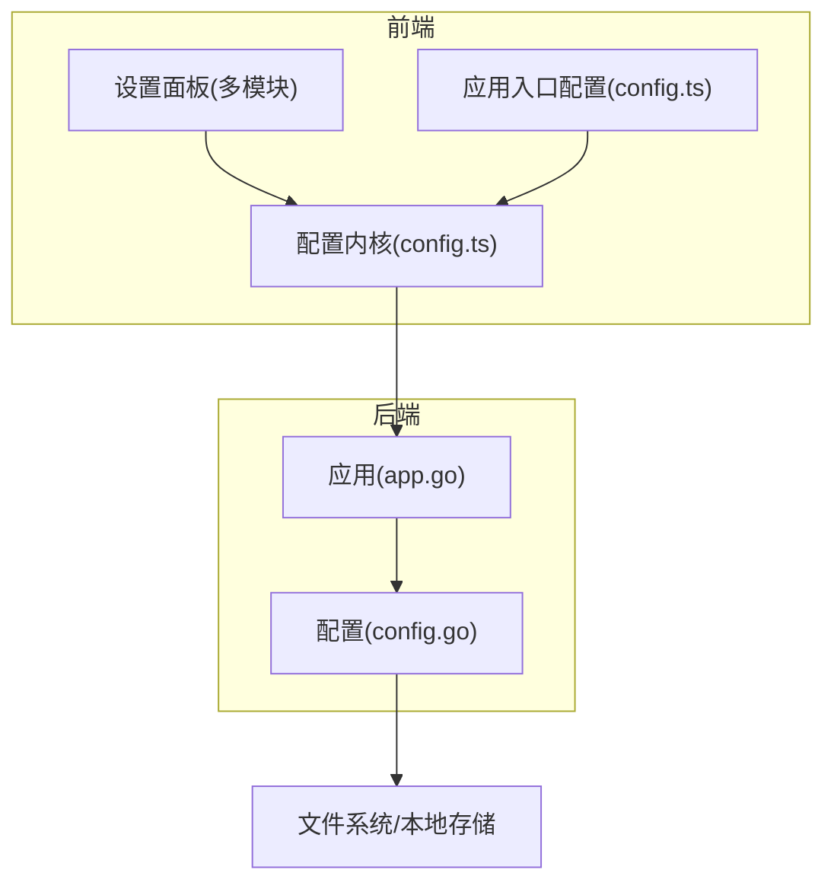
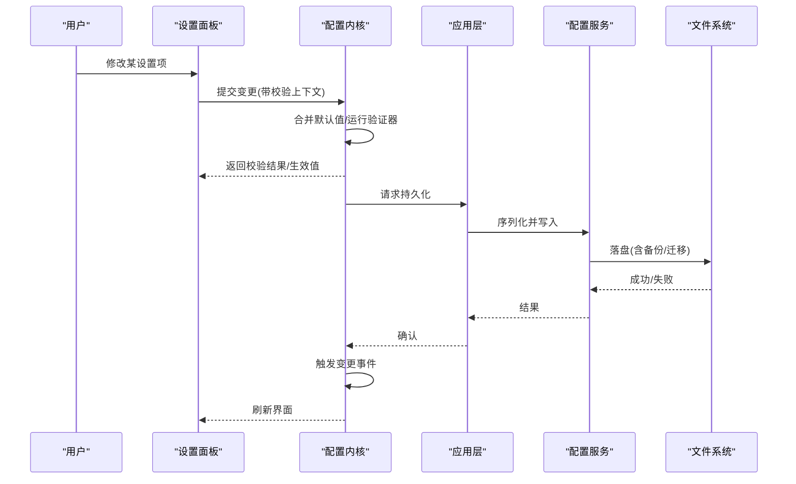
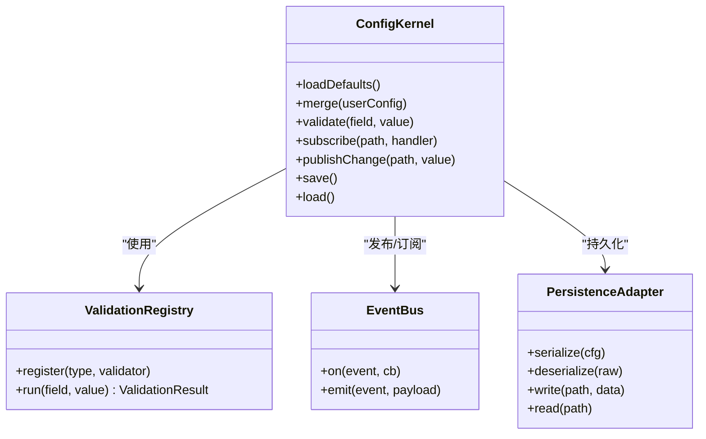
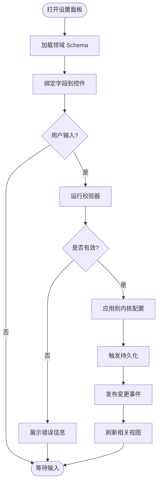
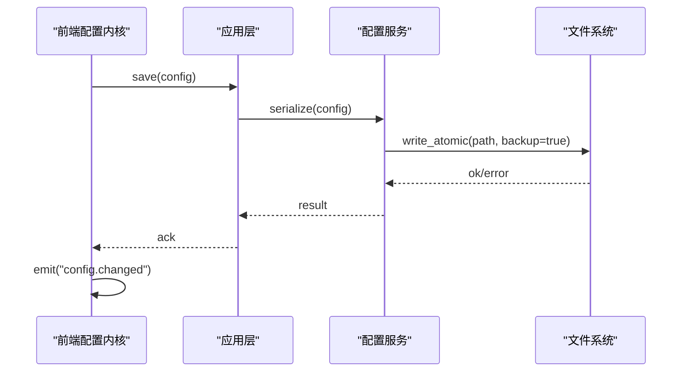
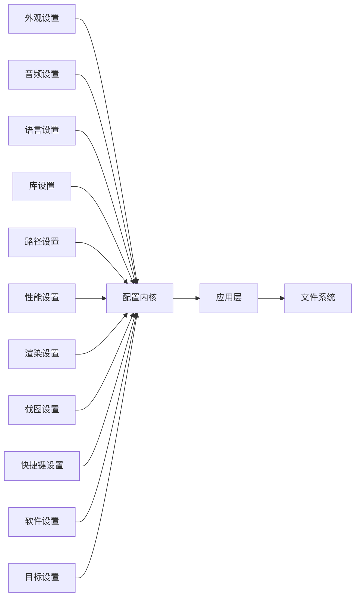

# 设置系统架构

<cite>
**本文引用的文件**   
- [config.ts](file://frontend/src/config.ts)
- [core/config.ts](file://frontend/src/core/config.ts)
- [settings.ts](file://frontend/src/menus/settings.ts)
- [settings-appearance.ts](file://frontend/src/menus/settings-appearance.ts)
- [settings-audio.ts](file://frontend/src/menus/settings-audio.ts)
- [settings-language.ts](file://frontend/src/menus/settings-language.ts)
- [settings-library.ts](file://frontend/src/menus/settings-library.ts)
- [settings-paths.ts](file://frontend/src/menus/settings-paths.ts)
- [settings-performance.ts](file://frontend/src/menus/settings-performance.ts)
- [settings-rendering.ts](file://frontend/src/menus/settings-rendering.ts)
- [settings-screenshot.ts](file://frontend/src/menus/settings-screenshot.ts)
- [settings-shared.ts](file://frontend/src/menus/settings-shared.ts)
- [settings-shortcuts.ts](file://frontend/src/menus/settings-shortcuts.ts)
- [settings-software.ts](file://frontend/src/menus/settings-software.ts)
- [settings-targets.ts](file://frontend/src/menus/settings-targets.ts)
- [ADR-047-config-persistence-coverage.md](file://docs/adr/adr-047-config-persistence-coverage.md)
- [ADR-093-menu-declarative-schema.md](file://docs/adr/adr-093-menu-declarative-schema.md)
- [ADR-141-state-split.md](file://docs/adr/adr-141-state-split.md)
- [ADR-142-with-status.md](file://docs/adr/adr-142-with-status.md)
- [ADR-050-save-callback-unification.md](file://docs/adr/adr-050-save-callback-unification.md)
- [ADR-035-settings-gap-analysis.md](file://docs/adr/adr-035-settings-gap-analysis.md)
- [ADR-002-writeconfig-split.md](file://docs/adr/adr-002-writeconfig-split.md)
- [app.go](file://internal/app/app.go)
- [config.go](file://internal/app/config.go)
</cite>

## 目录
1. [简介](#简介)
2. [项目结构](#项目结构)
3. [核心组件](#核心组件)
4. [架构总览](#架构总览)
5. [详细组件分析](#详细组件分析)
6. [依赖关系分析](#依赖关系分析)
7. [性能考量](#性能考量)
8. [故障排查指南](#故障排查指南)
9. [结论](#结论)
10. [附录](#附录)

## 简介
本文件面向“设置系统”的架构与实现，聚焦以下目标：
- 配置分组机制、验证规则框架与默认值管理策略
- 配置的持久化存储方案（本地格式、版本迁移、备份恢复）
- 设置变更的实时同步机制（状态监听、变更通知、冲突解决）
- 扩展指南（新设置项注册、自定义验证器、界面绑定模式）
- 结合仓库中的 ADR 与前端/后端代码，给出可落地的最佳实践

## 项目结构
设置系统横跨前端菜单声明式定义、前端配置内核、以及后端应用层。整体组织方式如下：
- 前端菜单层：以“声明式 schema + 面板模块”的方式组织各功能域的设置项
- 前端配置内核：提供统一的配置读写、校验、默认值合并、事件广播与持久化接口
- 后端应用层：负责跨平台路径、文件访问、配置文件的实际落盘与读取

图表来源
- [config.ts](file://frontend/src/config.ts)
- [core/config.ts](file://frontend/src/core/config.ts)
- [settings.ts](file://frontend/src/menus/settings.ts)
- [app.go](file://internal/app/app.go)
- [config.go](file://internal/app/config.go)

章节来源
- [config.ts](file://frontend/src/config.ts)
- [core/config.ts](file://frontend/src/core/config.ts)
- [settings.ts](file://frontend/src/menus/settings.ts)
- [app.go](file://internal/app/app.go)
- [config.go](file://internal/app/config.go)

## 核心组件
- 配置内核（前端）
  - 职责：统一加载默认值、合并用户配置、执行校验、触发变更事件、调用后端进行持久化
  - 关键能力：分组聚合、类型约束、默认值覆盖、错误收集、变更订阅
- 设置面板（前端）
  - 职责：按领域拆分（外观、音频、语言、库、路径、性能、渲染、截图、快捷键、软件、目标等），通过声明式 schema 驱动 UI
  - 关键能力：字段映射、即时预览、联动显示、批量保存
- 应用与配置（后端）
  - 职责：提供跨平台路径解析、文件 I/O、配置序列化/反序列化、版本迁移钩子
  - 关键能力：原子写入、回滚保护、迁移脚本编排、备份与恢复

章节来源
- [core/config.ts](file://frontend/src/core/config.ts)
- [settings-appearance.ts](file://frontend/src/menus/settings-appearance.ts)
- [settings-audio.ts](file://frontend/src/menus/settings-audio.ts)
- [settings-language.ts](file://frontend/src/menus/settings-language.ts)
- [settings-library.ts](file://frontend/src/menus/settings-library.ts)
- [settings-paths.ts](file://frontend/src/menus/settings-paths.ts)
- [settings-performance.ts](file://frontend/src/menus/settings-performance.ts)
- [settings-rendering.ts](file://frontend/src/menus/settings-rendering.ts)
- [settings-screenshot.ts](file://frontend/src/menus/settings-screenshot.ts)
- [settings-shared.ts](file://frontend/src/menus/settings-shared.ts)
- [settings-shortcuts.ts](file://frontend/src/menus/settings-shortcuts.ts)
- [settings-software.ts](file://frontend/src/menus/settings-software.ts)
- [settings-targets.ts](file://frontend/src/menus/settings-targets.ts)
- [app.go](file://internal/app/app.go)
- [config.go](file://internal/app/config.go)

## 架构总览
设置系统的端到端流程包括：UI 交互 → 配置内核校验与合并 → 后端持久化 → 变更事件广播 → 其他模块消费。

图表来源
- [core/config.ts](file://frontend/src/core/config.ts)
- [app.go](file://internal/app/app.go)
- [config.go](file://internal/app/config.go)

## 详细组件分析

### 配置内核（前端）
- 设计要点
  - 分组聚合：将不同领域的设置项按命名空间/分组聚合，便于独立加载与保存
  - 默认值管理：内置默认值与运行时覆盖，支持按需懒加载
  - 验证框架：集中式校验器注册表，支持同步/异步校验与错误收集
  - 变更同步：基于事件总线发布/订阅，避免紧耦合
  - 持久化契约：仅暴露 save/load 抽象，具体实现由后端完成
- 复杂度与性能
  - 校验阶段采用短路策略与批处理，减少无效计算
  - 大对象变更使用增量 diff，降低事件风暴风险

图表来源
- [core/config.ts](file://frontend/src/core/config.ts)

章节来源
- [core/config.ts](file://frontend/src/core/config.ts)

### 设置面板（前端）
- 设计要点
  - 声明式 Schema：每个领域一个模块，描述字段、标签、提示、范围、枚举、依赖关系等
  - 双向绑定：UI 控件与配置内核字段一一对应，自动触发校验与保存
  - 联动与条件显示：根据其他字段值动态控制可见性与可用性
  - 批量操作：支持一键重置、导入导出、差异对比
- 典型模块
  - 外观、音频、语言、库、路径、性能、渲染、截图、快捷键、软件、目标等

图表来源
- [settings-appearance.ts](file://frontend/src/menus/settings-appearance.ts)
- [settings-audio.ts](file://frontend/src/menus/settings-audio.ts)
- [settings-language.ts](file://frontend/src/menus/settings-language.ts)
- [settings-library.ts](file://frontend/src/menus/settings-library.ts)
- [settings-paths.ts](file://frontend/src/menus/settings-paths.ts)
- [settings-performance.ts](file://frontend/src/menus/settings-performance.ts)
- [settings-rendering.ts](file://frontend/src/menus/settings-rendering.ts)
- [settings-screenshot.ts](file://frontend/src/menus/settings-screenshot.ts)
- [settings-shared.ts](file://frontend/src/menus/settings-shared.ts)
- [settings-shortcuts.ts](file://frontend/src/menus/settings-shortcuts.ts)
- [settings-software.ts](file://frontend/src/menus/settings-software.ts)
- [settings-targets.ts](file://frontend/src/menus/settings-targets.ts)

章节来源
- [settings-appearance.ts](file://frontend/src/menus/settings-appearance.ts)
- [settings-audio.ts](file://frontend/src/menus/settings-audio.ts)
- [settings-language.ts](file://frontend/src/menus/settings-language.ts)
- [settings-library.ts](file://frontend/src/menus/settings-library.ts)
- [settings-paths.ts](file://frontend/src/menus/settings-paths.ts)
- [settings-performance.ts](file://frontend/src/menus/settings-performance.ts)
- [settings-rendering.ts](file://frontend/src/menus/settings-rendering.ts)
- [settings-screenshot.ts](file://frontend/src/menus/settings-screenshot.ts)
- [settings-shared.ts](file://frontend/src/menus/settings-shared.ts)
- [settings-shortcuts.ts](file://frontend/src/menus/settings-shortcuts.ts)
- [settings-software.ts](file://frontend/src/menus/settings-software.ts)
- [settings-targets.ts](file://frontend/src/menus/settings-targets.ts)

### 应用与配置（后端）
- 设计要点
  - 路径与权限：跨平台路径解析与权限检查
  - 文件 I/O：原子写入、临时文件+重命名、失败回滚
  - 序列化/反序列化：JSON/YAML 等格式的编解码
  - 版本迁移：在加载时检测版本并执行迁移脚本
  - 备份与恢复：自动备份旧版本，支持手动恢复
- 与前端协作
  - 提供 RPC/桥接方法供前端调用 save/load
  - 返回结构化结果（成功/错误码/消息）

图表来源
- [app.go](file://internal/app/app.go)
- [config.go](file://internal/app/config.go)

章节来源
- [app.go](file://internal/app/app.go)
- [config.go](file://internal/app/config.go)

## 依赖关系分析
- 前端内部
  - 设置面板模块依赖配置内核；配置内核依赖事件总线与持久化适配器
  - 各面板之间通过内核解耦，避免直接互相引用
- 前后端边界
  - 前端不直接操作文件系统，所有持久化均通过后端 API
  - 后端对文件格式、迁移、备份等细节完全封装

图表来源
- [settings-appearance.ts](file://frontend/src/menus/settings-appearance.ts)
- [settings-audio.ts](file://frontend/src/menus/settings-audio.ts)
- [settings-language.ts](file://frontend/src/menus/settings-language.ts)
- [settings-library.ts](file://frontend/src/menus/settings-library.ts)
- [settings-paths.ts](file://frontend/src/menus/settings-paths.ts)
- [settings-performance.ts](file://frontend/src/menus/settings-performance.ts)
- [settings-rendering.ts](file://frontend/src/menus/settings-rendering.ts)
- [settings-screenshot.ts](file://frontend/src/menus/settings-screenshot.ts)
- [settings-shortcuts.ts](file://frontend/src/menus/settings-shortcuts.ts)
- [settings-software.ts](file://frontend/src/menus/settings-software.ts)
- [settings-targets.ts](file://frontend/src/menus/settings-targets.ts)
- [core/config.ts](file://frontend/src/core/config.ts)
- [app.go](file://internal/app/app.go)
- [config.go](file://internal/app/config.go)

章节来源
- [core/config.ts](file://frontend/src/core/config.ts)
- [app.go](file://internal/app/app.go)
- [config.go](file://internal/app/config.go)

## 性能考量
- 校验优化
  - 对高频变更字段采用防抖/节流，避免频繁持久化
  - 复杂校验延迟到失焦或显式保存时执行
- 事件风暴治理
  - 合并多次变更再广播，限制订阅者数量与处理耗时
- 持久化策略
  - 写放大控制：仅在必要字段变化时触发保存
  - 异步写入：非阻塞 UI，失败重试与降级策略

[本节为通用指导，无需源码引用]

## 故障排查指南
- 常见问题定位
  - 校验失败：查看内核返回的错误集合，确认字段类型与约束
  - 持久化失败：检查后端返回的错误码与日志，确认文件权限与磁盘空间
  - 变更未生效：确认事件订阅是否正确注册，是否存在竞态导致覆盖
- 建议步骤
  - 启用调试日志，记录变更前后快照
  - 使用“导入/导出”功能对比差异
  - 回滚到最近一次备份，逐步定位问题

章节来源
- [core/config.ts](file://frontend/src/core/config.ts)
- [app.go](file://internal/app/app.go)
- [config.go](file://internal/app/config.go)

## 结论
本设置系统通过“声明式面板 + 配置内核 + 后端持久化”的分层架构，实现了高内聚、低耦合的可扩展设计。借助统一的验证框架与事件机制，既保证了数据一致性，又提升了开发效率。配合完善的持久化与迁移策略，系统在稳定性与可维护性方面具备良好基础。

[本节为总结，无需源码引用]

## 附录

### 配置分组机制
- 分组维度
  - 按功能域划分（外观、音频、语言、库、路径、性能、渲染、截图、快捷键、软件、目标等）
  - 每个分组对应独立的菜单模块与校验规则集
- 分组加载
  - 按需加载，减少启动开销
  - 支持分组级默认值与覆盖

章节来源
- [settings-appearance.ts](file://frontend/src/menus/settings-appearance.ts)
- [settings-audio.ts](file://frontend/src/menus/settings-audio.ts)
- [settings-language.ts](file://frontend/src/menus/settings-language.ts)
- [settings-library.ts](file://frontend/src/menus/settings-library.ts)
- [settings-paths.ts](file://frontend/src/menus/settings-paths.ts)
- [settings-performance.ts](file://frontend/src/menus/settings-performance.ts)
- [settings-rendering.ts](file://frontend/src/menus/settings-rendering.ts)
- [settings-screenshot.ts](file://frontend/src/menus/settings-screenshot.ts)
- [settings-shared.ts](file://frontend/src/menus/settings-shared.ts)
- [settings-shortcuts.ts](file://frontend/src/menus/settings-shortcuts.ts)
- [settings-software.ts](file://frontend/src/menus/settings-software.ts)
- [settings-targets.ts](file://frontend/src/menus/settings-targets.ts)

### 验证规则框架
- 规则类型
  - 类型校验、范围校验、必填校验、正则校验、业务逻辑校验
- 执行时机
  - 输入时（轻量）、失焦时（中等）、保存时（完整）
- 错误呈现
  - 字段级错误提示、全局错误汇总、国际化文案

章节来源
- [core/config.ts](file://frontend/src/core/config.ts)
- [settings-shared.ts](file://frontend/src/menus/settings-shared.ts)

### 默认值管理策略
- 默认值来源
  - 内置默认、平台默认、环境默认
- 合并顺序
  - 内置 < 环境 < 用户配置
- 覆盖与回退
  - 缺失字段自动回退到默认值
  - 支持热重载默认值（开发模式）

章节来源
- [core/config.ts](file://frontend/src/core/config.ts)

### 持久化存储方案
- 本地存储格式
  - JSON/YAML（以实际实现为准），包含元数据（版本、时间戳）
- 版本迁移机制
  - 加载时检测版本，执行迁移脚本，保证向后兼容
- 数据备份与恢复
  - 自动备份旧版本，支持手动选择恢复点

章节来源
- [config.go](file://internal/app/config.go)
- [app.go](file://internal/app/app.go)
- [ADR-047-config-persistence-coverage.md](file://docs/adr/adr-047-config-persistence-coverage.md)

### 实时同步机制
- 状态监听
  - 订阅特定路径的变更事件
- 变更通知
  - 事件携带新旧值、来源、时间戳
- 冲突解决策略
  - 最后写入优先（LWW）
  - 可选合并策略（针对复合对象）

章节来源
- [core/config.ts](file://frontend/src/core/config.ts)
- [ADR-141-state-split.md](file://docs/adr/adr-141-state-split.md)
- [ADR-142-with-status.md](file://docs/adr/adr-142-with-status.md)

### 扩展指南
- 新增设置项注册流程
  - 在对应面板模块中声明字段与校验规则
  - 在配置内核中注册默认值与持久化键名
  - 如需后端参与，添加后端处理逻辑
- 自定义验证器实现方法
  - 在验证注册表中注册函数，支持同步/异步
  - 返回结构化错误信息，便于 UI 展示
- 界面组件绑定模式
  - 使用声明式 schema 驱动控件
  - 绑定双向更新与校验回调
  - 支持联动显示与禁用

章节来源
- [settings-shared.ts](file://frontend/src/menus/settings-shared.ts)
- [core/config.ts](file://frontend/src/core/config.ts)
- [ADR-093-menu-declarative-schema.md](file://docs/adr/adr-093-menu-declarative-schema.md)
- [ADR-050-save-callback-unification.md](file://docs/adr/adr-050-save-callback-unification.md)
- [ADR-002-writeconfig-split.md](file://docs/adr/adr-002-writeconfig-split.md)
- [ADR-035-settings-gap-analysis.md](file://docs/adr/adr-035-settings-gap-analysis.md)