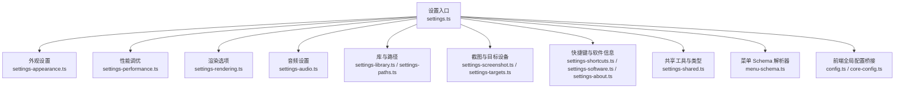
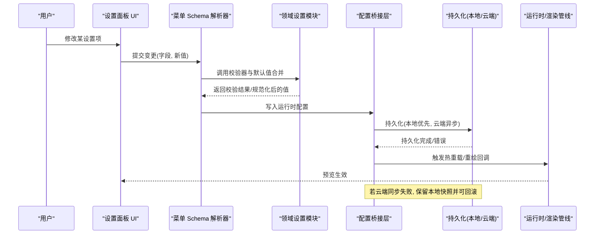
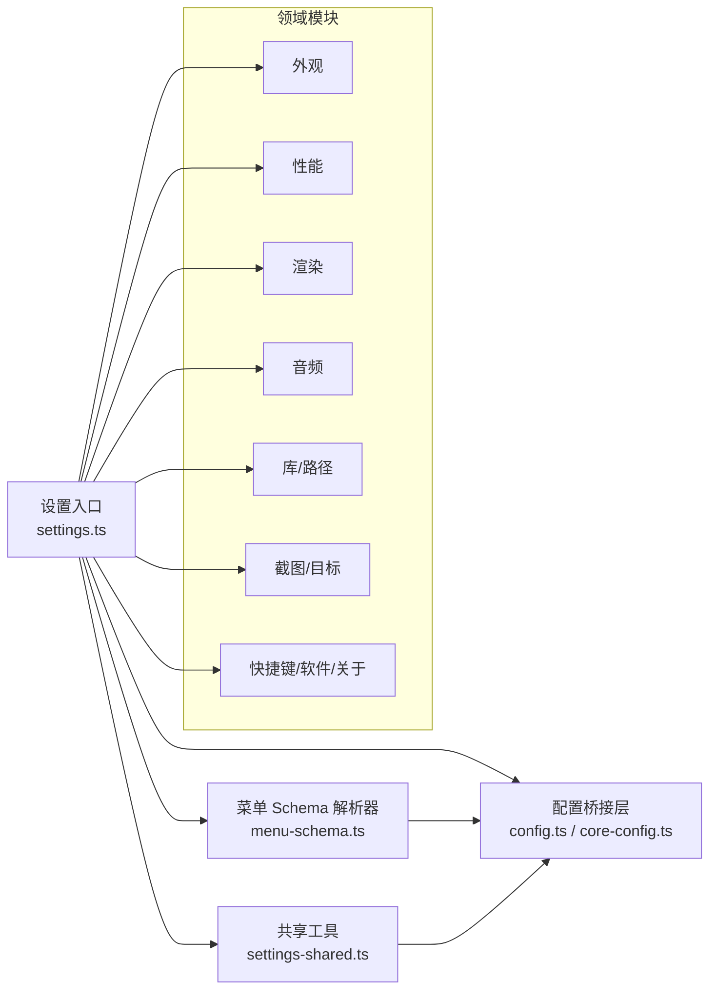

# 设置面板

<cite>
**本文引用的文件**   
- [settings.ts](file://frontend/src/menus/settings.ts)
- [settings-appearance.ts](file://frontend/src/menus/settings-appearance.ts)
- [settings-performance.ts](file://frontend/src/menus/settings-performance.ts)
- [settings-rendering.ts](file://frontend/src/menus/settings-rendering.ts)
- [settings-audio.ts](file://frontend/src/menus/settings-audio.ts)
- [settings-library.ts](file://frontend/src/menus/settings-library.ts)
- [settings-paths.ts](file://frontend/src/menus/settings-paths.ts)
- [settings-screenshot.ts](file://frontend/src/menus/settings-screenshot.ts)
- [settings-shortcuts.ts](file://frontend/src/menus/settings-shortcuts.ts)
- [settings-software.ts](file://frontend/src/menus/settings-software.ts)
- [settings-targets.ts](file://frontend/src/menus/settings-targets.ts)
- [settings-about.ts](file://frontend/src/menus/settings-about.ts)
- [settings-shared.ts](file://frontend/src/menus/settings-shared.ts)
- [menu-schema.ts](file://frontend/src/menus/menu-schema.ts)
- [config.ts](file://frontend/src/config.ts)
- [core-config.ts](file://frontend/src/core/config.ts)
- [ADR-093 菜单声明式模式.md](file://docs/adr/adr-093-menu-declarative-schema.md)
- [ADR-047 配置持久化覆盖范围.md](file://docs/adr/adr-047-config-persistence-coverage.md)
- [e2e-settings-panel-dom.spec.ts](file://frontend/e2e/settings-panel-dom.spec.ts)
</cite>

## 目录
1. [简介](#简介)
2. [项目结构](#项目结构)
3. [核心组件](#核心组件)
4. [架构总览](#架构总览)
5. [详细组件分析](#详细组件分析)
6. [依赖分析](#依赖分析)
7. [性能考虑](#性能考虑)
8. [故障排查指南](#故障排查指南)
9. [结论](#结论)
10. [附录](#附录)

## 简介
本文件面向“设置面板”子系统，系统性说明其架构设计、配置分组与验证规则、默认值管理、持久化存储机制（本地与云端同步）、版本迁移策略、实时预览与回滚（热重载与状态恢复），以及自定义设置项的开发指南。文档以代码级事实为依据，结合端到端测试与架构决策记录（ADR）进行交叉印证，帮助读者快速理解并扩展设置系统。

## 项目结构
设置面板采用“声明式菜单 + 模块化分片”的组织方式：
- 顶层入口负责注册所有设置分组与页面路由。
- 每个功能域一个独立模块文件，定义该域的字段、校验、默认值与变更回调。
- 共享的 UI 行类型、通用校验器与渲染逻辑集中在共享模块中。
- 菜单整体遵循“声明式 schema”范式，由统一解析器驱动渲染与交互。

图表来源
- [settings.ts](file://frontend/src/menus/settings.ts)
- [menu-schema.ts](file://frontend/src/menus/menu-schema.ts)
- [config.ts](file://frontend/src/config.ts)
- [core-config.ts](file://frontend/src/core/config.ts)

章节来源
- [settings.ts](file://frontend/src/menus/settings.ts)
- [menu-schema.ts](file://frontend/src/menus/menu-schema.ts)
- [config.ts](file://frontend/src/config.ts)
- [core-config.ts](file://frontend/src/core/config.ts)

## 核心组件
- 设置入口与路由：集中注册各设置分组，提供导航与页面挂载点。
- 声明式菜单 Schema：通过结构化描述定义字段、分组、校验、默认值与行为，驱动 UI 渲染与事件处理。
- 领域设置模块：按功能域拆分，分别维护各自的状态、校验与副作用。
- 共享工具：统一的行类型、校验器、UI 控件封装与国际化键映射。
- 配置桥接：将前端设置与运行时配置对象对齐，支持读取、写入与监听变更。

章节来源
- [settings.ts](file://frontend/src/menus/settings.ts)
- [menu-schema.ts](file://frontend/src/menus/menu-schema.ts)
- [settings-shared.ts](file://frontend/src/menus/settings-shared.ts)
- [config.ts](file://frontend/src/config.ts)
- [core-config.ts](file://frontend/src/core/config.ts)

## 架构总览
设置面板的整体数据流如下：用户界面通过声明式 Schema 生成表单控件；输入变更触发校验与默认值合并；随后写入运行时配置对象并持久化；必要时触发热重载或场景重绘；云端同步在后台异步执行，失败可回滚到上次有效快照。

图表来源
- [menu-schema.ts](file://frontend/src/menus/menu-schema.ts)
- [settings.ts](file://frontend/src/menus/settings.ts)
- [config.ts](file://frontend/src/config.ts)
- [core-config.ts](file://frontend/src/core/config.ts)

## 详细组件分析

### 设置入口与路由
- 职责：汇总所有设置分组，建立导航树，按需加载对应模块。
- 关键点：
  - 分组标题与图标来自共享资源。
  - 路由表与模块一一对应，便于扩展新分组。
  - 与菜单 Schema 解析器协作，确保新增分组自动参与统一渲染流程。

章节来源
- [settings.ts](file://frontend/src/menus/settings.ts)

### 外观设置（主题、语言、字体等）
- 职责：管理应用外观相关的全局偏好。
- 关键点：
  - 使用共享行类型构建下拉、开关、文本输入等控件。
  - 变更即时反映到主题引擎或 i18n 层。
  - 提供默认值与可选值枚举，避免非法输入。

章节来源
- [settings-appearance.ts](file://frontend/src/menus/settings-appearance.ts)
- [settings-shared.ts](file://frontend/src/menus/settings-shared.ts)

### 性能调优（帧率、线程、内存阈值等）
- 职责：暴露影响运行性能的参数，供高级用户微调。
- 关键点：
  - 数值型参数带范围校验与步进控制。
  - 部分参数需要重启或热重载才能生效。
  - 与渲染/物理子系统联动，变更时触发相应刷新。

章节来源
- [settings-performance.ts](file://frontend/src/menus/settings-performance.ts)
- [settings-shared.ts](file://frontend/src/menus/settings-shared.ts)

### 渲染选项（抗锯齿、阴影、后处理等）
- 职责：控制渲染管线质量与特性开关。
- 关键点：
  - 组合多个子项形成预设模式，并提供自定义覆盖。
  - 变更可能触发渲染目标重建或着色器切换。
  - 对低端设备提供降级提示与约束。

章节来源
- [settings-rendering.ts](file://frontend/src/menus/settings-rendering.ts)
- [settings-shared.ts](file://frontend/src/menus/settings-shared.ts)

### 音频设置（音量、输出设备、延迟补偿等）
- 职责：管理音频子系统相关配置。
- 关键点：
  - 动态枚举可用输出设备。
  - 低延迟模式下限制其他高开销特性。
  - 变更即时应用到音频总线。

章节来源
- [settings-audio.ts](file://frontend/src/menus/settings-audio.ts)
- [settings-shared.ts](file://frontend/src/menus/settings-shared.ts)

### 库与路径（资源根目录、缓存位置、扫描策略）
- 职责：配置资源库与文件系统访问路径。
- 关键点：
  - 路径合法性校验与权限检查。
  - 支持相对/绝对路径与平台差异处理。
  - 变更后可触发库索引重建。

章节来源
- [settings-library.ts](file://frontend/src/menus/settings-library.ts)
- [settings-paths.ts](file://frontend/src/menus/settings-paths.ts)
- [settings-shared.ts](file://frontend/src/menus/settings-shared.ts)

### 截图与目标设备（分辨率、格式、设备能力检测）
- 职责：管理截图导出与目标设备适配。
- 关键点：
  - 根据设备能力动态调整可用选项。
  - 截图路径与命名规则可配置。
  - 大分辨率下给出性能警告。

章节来源
- [settings-screenshot.ts](file://frontend/src/menus/settings-screenshot.ts)
- [settings-targets.ts](file://frontend/src/menus/settings-targets.ts)
- [settings-shared.ts](file://frontend/src/menus/settings-shared.ts)

### 快捷键与软件信息（快捷键绑定、关于页）
- 职责：提供快捷键管理与应用元信息展示。
- 关键点：
  - 快捷键冲突检测与自动修正建议。
  - 关于页显示版本、许可证与第三方声明。

章节来源
- [settings-shortcuts.ts](file://frontend/src/menus/settings-shortcuts.ts)
- [settings-software.ts](file://frontend/src/menus/settings-software.ts)
- [settings-about.ts](file://frontend/src/menus/settings-about.ts)
- [settings-shared.ts](file://frontend/src/menus/settings-shared.ts)

### 共享工具与类型
- 职责：为各设置模块提供统一的行类型、校验器、UI 控件与国际化键。
- 关键点：
  - 校验器链式组合，支持必填、范围、正则、异步校验。
  - 默认值工厂函数，支持环境感知与条件默认。
  - 提供“重置为默认”和“撤销最近更改”的通用操作。

章节来源
- [settings-shared.ts](file://frontend/src/menus/settings-shared.ts)

### 菜单 Schema 解析器
- 职责：将声明式菜单描述转换为可渲染的 UI 与事件处理器。
- 关键点：
  - 支持分组、折叠、条件可见性、联动更新。
  - 与配置桥接层对接，实现读写分离与变更订阅。
  - 提供调试视图，便于开发期定位问题。

章节来源
- [menu-schema.ts](file://frontend/src/menus/menu-schema.ts)
- [ADR-093 菜单声明式模式.md](file://docs/adr/adr-093-menu-declarative-schema.md)

### 配置桥接层
- 职责：在前端设置与运行时配置之间建立双向通道。
- 关键点：
  - 读取：启动时从持久化层加载并合并默认值。
  - 写入：变更先经校验与规范化，再落盘与同步。
  - 监听：发布变更事件，驱动热重载与预览。

章节来源
- [config.ts](file://frontend/src/config.ts)
- [core-config.ts](file://frontend/src/core/config.ts)

## 依赖分析
- 内聚性：各设置模块仅依赖共享工具与配置桥接层，耦合度低。
- 聚合点：设置入口与菜单 Schema 解析器是主要聚合点，承担路由与渲染编排。
- 外部依赖：
  - 本地持久化：浏览器/桌面存储 API。
  - 云端同步：网络请求与重试/回退策略。
  - 运行时子系统：渲染、音频、物理等通过配置桥接层间接依赖。

图表来源
- [settings.ts](file://frontend/src/menus/settings.ts)
- [menu-schema.ts](file://frontend/src/menus/menu-schema.ts)
- [settings-shared.ts](file://frontend/src/menus/settings-shared.ts)
- [config.ts](file://frontend/src/config.ts)
- [core-config.ts](file://frontend/src/core/config.ts)

章节来源
- [settings.ts](file://frontend/src/menus/settings.ts)
- [menu-schema.ts](file://frontend/src/menus/menu-schema.ts)
- [settings-shared.ts](file://frontend/src/menus/settings-shared.ts)
- [config.ts](file://frontend/src/config.ts)
- [core-config.ts](file://frontend/src/core/config.ts)

## 性能考虑
- 批量更新：对频繁变更的滑块类控件，采用节流/防抖减少重绘次数。
- 懒加载：仅在进入对应分组时初始化昂贵资源（如设备枚举）。
- 增量持久化：仅序列化变更字段，降低 IO 压力。
- 云端同步：后台队列+去重+指数退避，避免阻塞主线程。
- 降级策略：当检测到设备能力不足时，自动隐藏或禁用高风险选项。

[本节为通用指导，不直接分析具体文件]

## 故障排查指南
- 常见问题
  - 设置未保存：检查持久化层是否被拦截或权限不足。
  - 云端不同步：查看网络状态与重试日志，确认是否触发回滚。
  - 热重载无效：确认变更回调是否正确注册，是否存在循环依赖导致死锁。
  - 校验失败：核对校验器链顺序与错误消息映射。
- 诊断手段
  - 启用菜单 Schema 调试视图，观察字段状态与事件流。
  - 使用端到端测试用例复现问题，聚焦 DOM 变化与断言。
  - 对比“默认值”与“当前值”，定位异常来源。

章节来源
- [e2e-settings-panel-dom.spec.ts](file://frontend/e2e/settings-panel-dom.spec.ts)

## 结论
设置面板通过“声明式 Schema + 模块化分片 + 配置桥接层”的架构，实现了高内聚、低耦合的可扩展体系。配合完善的校验、默认值与持久化机制，既保证了易用性与稳定性，也为高级用户提供了灵活的调优空间。未来可在云端同步、多端一致性与更细粒度的热重载方面持续演进。

[本节为总结性内容，不直接分析具体文件]

## 附录

### 配置分组与默认值管理机制
- 分组组织：按功能域拆分子模块，入口统一注册。
- 默认值：
  - 静态默认值：在 Schema 中声明。
  - 动态默认值：基于环境或设备能力计算。
  - 合并策略：启动时按优先级合并（内置默认 < 本地持久化 < 云端同步）。
- 版本迁移：
  - 迁移脚本在升级时按版本号顺序执行。
  - 旧字段废弃策略：标记弃用、提供映射、逐步移除。

章节来源
- [ADR-047 配置持久化覆盖范围.md](file://docs/adr/adr-047-config-persistence-coverage.md)
- [menu-schema.ts](file://frontend/src/menus/menu-schema.ts)

### 实时预览与回滚（热重载与状态恢复）
- 实时预览：
  - 变更事件发布后，订阅者立即应用效果。
  - 对不可逆变更提供“暂存区”，允许一键回滚。
- 热重载：
  - 针对渲染/音频等子系统，采用最小化重建策略。
  - 失败时自动回退至上一次稳定配置。
- 状态恢复：
  - 会话级快照用于崩溃恢复。
  - 跨会话快照用于云端同步与多端一致性。

章节来源
- [config.ts](file://frontend/src/config.ts)
- [core-config.ts](file://frontend/src/core/config.ts)

### 自定义设置项开发指南
- 步骤概览
  1) 新建领域模块文件，定义字段、校验与默认值。
  2) 在共享工具中补充必要的行类型或校验器。
  3) 在设置入口注册新分组与路由。
  4) 编写端到端测试，覆盖关键交互与边界条件。
- 配置类型定义
  - 使用共享行类型描述字段元数据（标签、占位符、单位、步进等）。
  - 通过枚举与范围约束输入空间。
- 校验规则编写
  - 同步校验：必填、范围、格式。
  - 异步校验：远程可用性、路径可达性。
  - 组合校验：多字段联动与互斥。
- 界面绑定
  - 通过 Schema 解析器自动生成控件与事件处理器。
  - 复杂控件可复用共享 UI 组件，保持风格一致。
- 变更回调与副作用
  - 纯副作用：如刷新列表、重建索引。
  - 热重载：如切换主题、调整渲染质量。
  - 持久化：写入本地与云端，失败回滚。

章节来源
- [settings-shared.ts](file://frontend/src/menus/settings-shared.ts)
- [menu-schema.ts](file://frontend/src/menus/menu-schema.ts)
- [settings.ts](file://frontend/src/menus/settings.ts)
- [e2e-settings-panel-dom.spec.ts](file://frontend/e2e/settings-panel-dom.spec.ts)