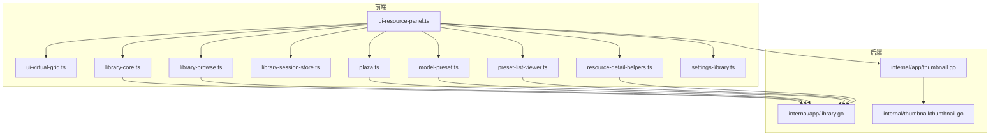
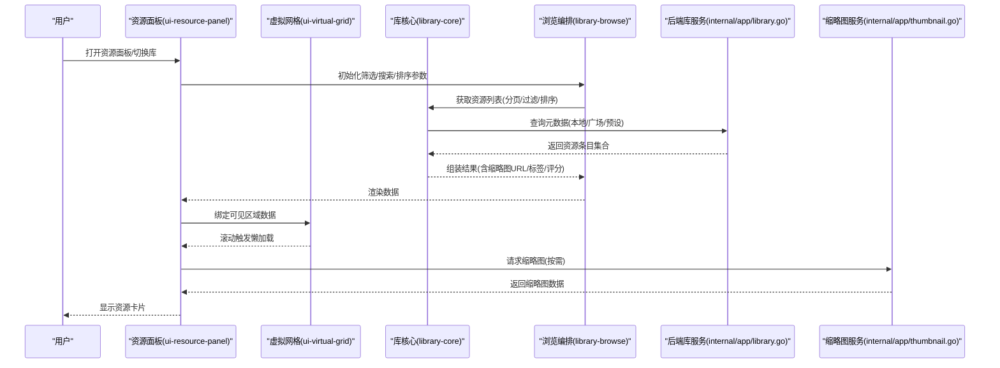
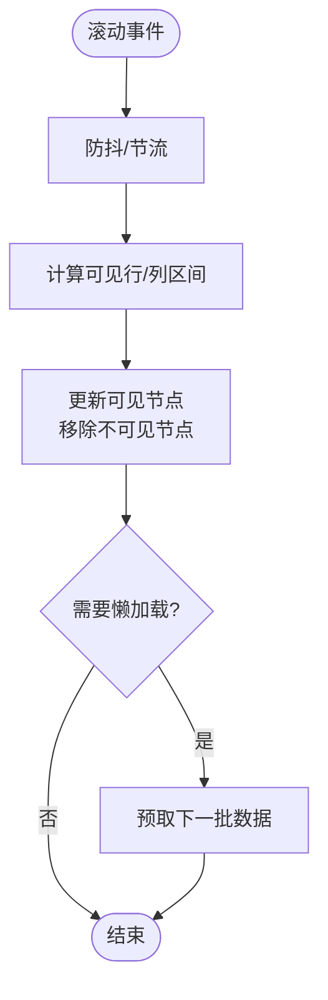
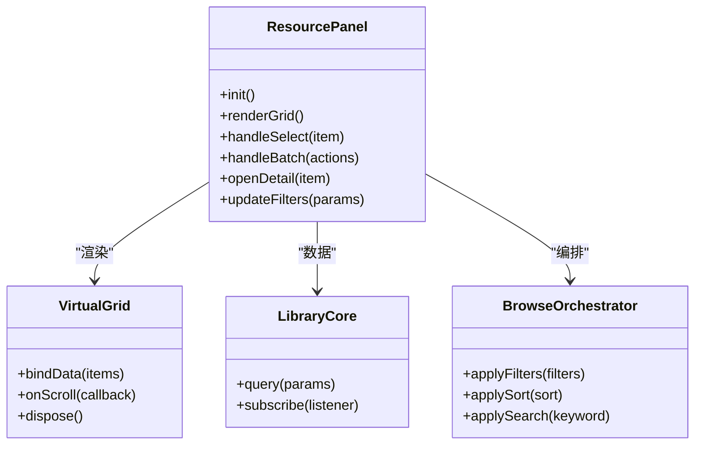
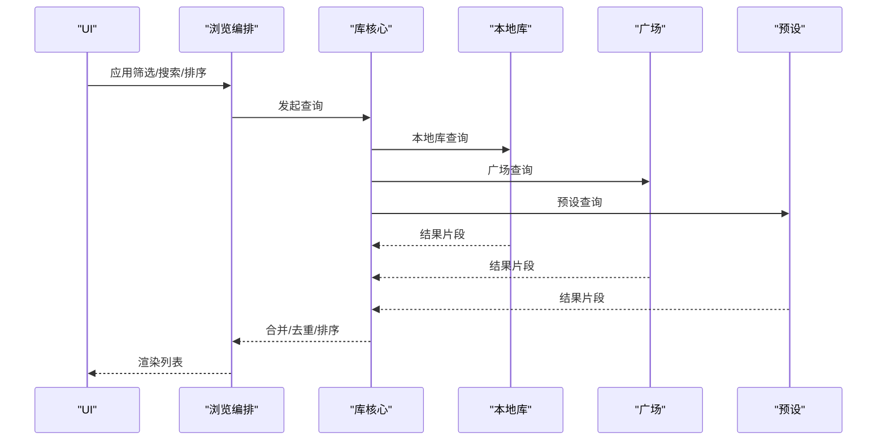
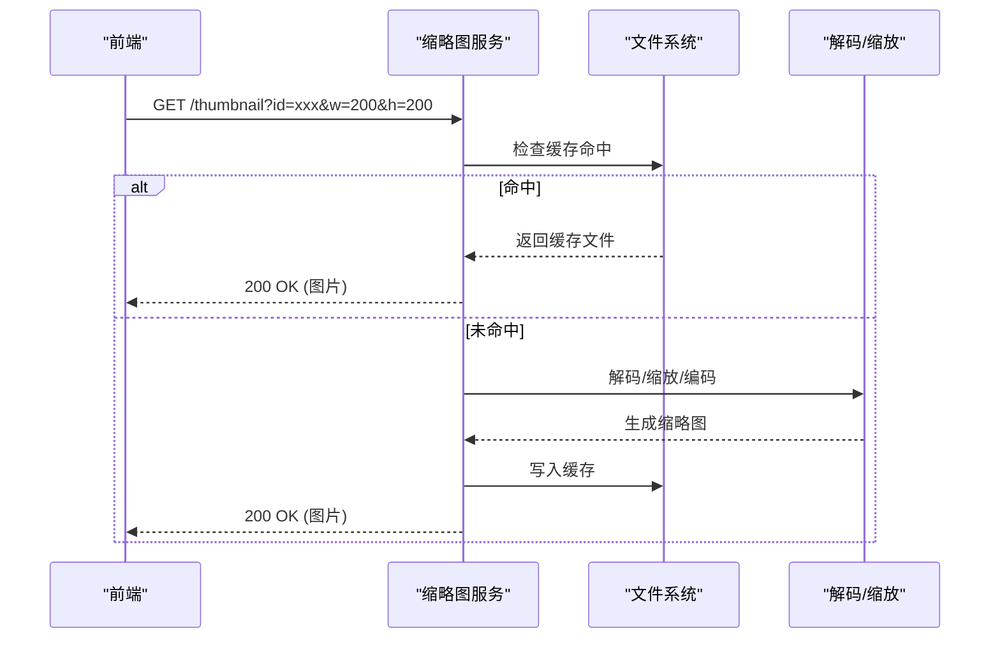
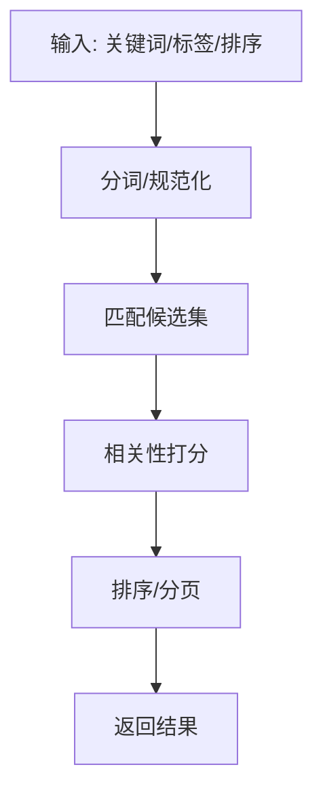
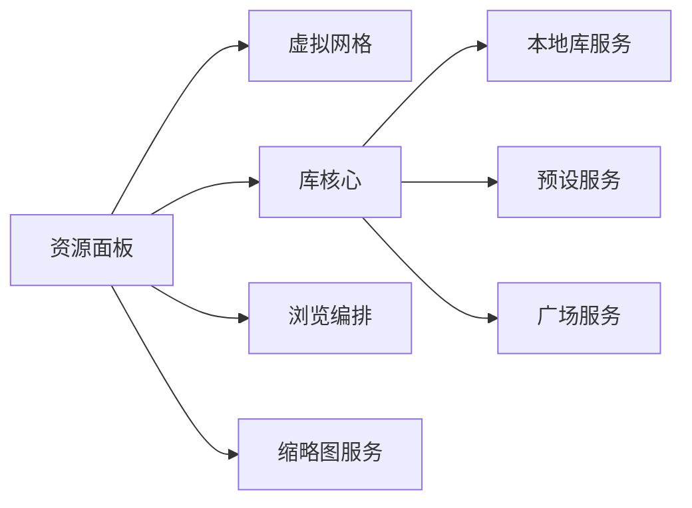

# 资源浏览器

<cite>
**本文引用的文件**   
- [frontend/src/core/ui-virtual-grid.ts](file://frontend/src/core/ui-virtual-grid.ts)
- [frontend/src/core/ui-resource-panel.ts](file://frontend/src/core/ui-resource-panel.ts)
- [frontend/src/menus/library-core.ts](file://frontend/src/menus/library-core.ts)
- [frontend/src/menus/library-browse.ts](file://frontend/src/menus/library-browse.ts)
- [internal/app/library.go](file://internal/app/library.go)
- [internal/app/thumbnail.go](file://internal/app/thumbnail.go)
- [internal/thumbnail/thumbnail.go](file://internal/thumbnail/thumbnail.go)
- [frontend/src/menus/library-session-store.ts](file://frontend/src/menus/library-session-store.ts)
- [frontend/src/menus/plaza.ts](file://frontend/src/menus/plaza.ts)
- [frontend/src/menus/plaza-sites.ts](file://frontend/src/menus/plaza-sites.ts)
- [frontend/src/menus/plaza-creators.ts](file://frontend/src/menus/plaza-creators.ts)
- [frontend/src/menus/resource-detail-helpers.ts](file://frontend/src/menus/resource-detail-helpers.ts)
- [frontend/src/menus/model-preset.ts](file://frontend/src/menus/model-preset.ts)
- [frontend/src/menus/preset-list-viewer.ts](file://frontend/src/menus/preset-list-viewer.ts)
- [frontend/src/menus/settings-library.ts](file://frontend/src/menus/settings-library.ts)
- [frontend/e2e/library-panel-dom.spec.ts](file://frontend/e2e/library-panel-dom.spec.ts)
- [frontend/e2e/model-load.spec.ts](file://frontend/e2e/model-load.spec.ts)
- [frontend/e2e/helpers.ts](file://frontend/e2e/helpers.ts)
</cite>

## 目录
1. [简介](#简介)
2. [项目结构](#项目结构)
3. [核心组件](#核心组件)
4. [架构总览](#架构总览)
5. [详细组件分析](#详细组件分析)
6. [依赖分析](#依赖分析)
7. [性能考虑](#性能考虑)
8. [故障排查指南](#故障排查指南)
9. [结论](#结论)
10. [附录](#附录)

## 简介
本文件面向“资源浏览器”子系统，系统性阐述其架构与实现要点，覆盖以下目标：
- 资源面板的虚拟网格渲染、懒加载机制与性能优化策略
- 模型库、材质库、预设库的统一浏览界面与交互流程
- 缩略图生成与缓存机制（异步加载、错误处理与重试）
- 搜索与过滤功能（关键词匹配、标签筛选、排序算法）
- 资源管理扩展指南（自定义资源类型支持、批量操作）

## 项目结构
资源浏览器由前端 UI 层、菜单/业务编排层、后端服务层构成。关键文件职责如下：
- 前端 UI 层
  - ui-virtual-grid.ts：虚拟网格容器，负责视口裁剪、行列计算、滚动与懒加载触发
  - ui-resource-panel.ts：资源面板主入口，组织视图、事件与状态
- 菜单/业务编排层
  - library-core.ts：库数据源抽象、统一查询接口、分页与排序
  - library-browse.ts：浏览页逻辑（筛选、搜索、标签、分类）
  - library-session-store.ts：会话级缓存（最近使用、选中项等）
  - plaza.ts / plaza-sites.ts / plaza-creators.ts：广场/站点/创作者聚合
  - model-preset.ts / preset-list-viewer.ts：预设相关展示与交互
  - resource-detail-helpers.ts：详情面板辅助逻辑
  - settings-library.ts：库设置（路径、刷新、缓存策略）
- 后端服务层
  - internal/app/library.go：本地库扫描、索引、元数据提供
  - internal/app/thumbnail.go：缩略图生成与缓存 API
  - internal/thumbnail/thumbnail.go：缩略图生成核心（解码、缩放、编码）

图表来源
- [frontend/src/core/ui-resource-panel.ts](file://frontend/src/core/ui-resource-panel.ts)
- [frontend/src/core/ui-virtual-grid.ts](file://frontend/src/core/ui-virtual-grid.ts)
- [frontend/src/menus/library-core.ts](file://frontend/src/menus/library-core.ts)
- [frontend/src/menus/library-browse.ts](file://frontend/src/menus/library-browse.ts)
- [frontend/src/menus/library-session-store.ts](file://frontend/src/menus/library-session-store.ts)
- [frontend/src/menus/plaza.ts](file://frontend/src/menus/plaza.ts)
- [frontend/src/menus/model-preset.ts](file://frontend/src/menus/model-preset.ts)
- [frontend/src/menus/preset-list-viewer.ts](file://frontend/src/menus/preset-list-viewer.ts)
- [frontend/src/menus/resource-detail-helpers.ts](file://frontend/src/menus/resource-detail-helpers.ts)
- [frontend/src/menus/settings-library.ts](file://frontend/src/menus/settings-library.ts)
- [internal/app/library.go](file://internal/app/library.go)
- [internal/app/thumbnail.go](file://internal/app/thumbnail.go)
- [internal/thumbnail/thumbnail.go](file://internal/thumbnail/thumbnail.go)

章节来源
- [frontend/src/core/ui-virtual-grid.ts](file://frontend/src/core/ui-virtual-grid.ts)
- [frontend/src/core/ui-resource-panel.ts](file://frontend/src/core/ui-resource-panel.ts)
- [frontend/src/menus/library-core.ts](file://frontend/src/menus/library-core.ts)
- [frontend/src/menus/library-browse.ts](file://frontend/src/menus/library-browse.ts)
- [internal/app/library.go](file://internal/app/library.go)
- [internal/app/thumbnail.go](file://internal/app/thumbnail.go)
- [internal/thumbnail/thumbnail.go](file://internal/thumbnail/thumbnail.go)

## 核心组件
- 虚拟网格渲染器
  - 基于视口尺寸与单元格大小计算可见区域，仅渲染可视行/列，滚动时增量更新 DOM
  - 通过占位容器与绝对定位实现高效重排，避免整表重绘
- 资源面板控制器
  - 协调网格、列表、筛选栏、分页控件与详情面板
  - 维护当前库上下文（本地/广场/预设）、选择状态与最近访问记录
- 库数据源与浏览编排
  - 统一查询接口：分页、排序、过滤、关键词匹配、标签筛选
  - 会话级缓存：减少重复请求，提升首屏与切换速度
- 缩略图管线
  - 后端解码与缩放生成缩略图，前端按需懒加载并缓存到内存/持久存储
  - 失败重试与降级策略，保障浏览流畅性

章节来源
- [frontend/src/core/ui-virtual-grid.ts](file://frontend/src/core/ui-virtual-grid.ts)
- [frontend/src/core/ui-resource-panel.ts](file://frontend/src/core/ui-resource-panel.ts)
- [frontend/src/menus/library-core.ts](file://frontend/src/menus/library-core.ts)
- [frontend/src/menus/library-browse.ts](file://frontend/src/menus/library-browse.ts)
- [frontend/src/menus/library-session-store.ts](file://frontend/src/menus/library-session-store.ts)
- [internal/app/thumbnail.go](file://internal/app/thumbnail.go)
- [internal/thumbnail/thumbnail.go](file://internal/thumbnail/thumbnail.go)

## 架构总览
资源浏览器的端到端调用链从 UI 事件出发，经菜单编排层路由至数据源或后端服务，最终返回结构化数据驱动视图更新。

图表来源
- [frontend/src/core/ui-resource-panel.ts](file://frontend/src/core/ui-resource-panel.ts)
- [frontend/src/core/ui-virtual-grid.ts](file://frontend/src/core/ui-virtual-grid.ts)
- [frontend/src/menus/library-core.ts](file://frontend/src/menus/library-core.ts)
- [frontend/src/menus/library-browse.ts](file://frontend/src/menus/library-browse.ts)
- [internal/app/library.go](file://internal/app/library.go)
- [internal/app/thumbnail.go](file://internal/app/thumbnail.go)

## 详细组件分析

### 虚拟网格渲染器（ui-virtual-grid.ts）
- 设计要点
  - 视口裁剪：根据容器高度、行高、列宽计算可见范围
  - 增量渲染：仅在滚动时更新可见节点，移除不可见节点以释放内存
  - 占位布局：使用透明占位元素维持滚动条长度，避免抖动
- 懒加载机制
  - 进入视口阈值触发加载回调
  - 预取相邻批次，降低滚动卡顿
- 性能优化
  - 批处理 DOM 更新
  - 防抖/节流滚动事件
  - 复用节点对象，减少 GC 压力

图表来源
- [frontend/src/core/ui-virtual-grid.ts](file://frontend/src/core/ui-virtual-grid.ts)

章节来源
- [frontend/src/core/ui-virtual-grid.ts](file://frontend/src/core/ui-virtual-grid.ts)

### 资源面板控制器（ui-resource-panel.ts）
- 职责
  - 组合网格、筛选栏、分页、详情面板
  - 维护选择状态、最近访问、批量操作上下文
  - 分发事件到库核心与浏览编排
- 交互流程
  - 点击资源项：打开详情面板，记录最近访问
  - 多选/全选：启用批量操作工具栏
  - 拖拽/右键：快捷动作（导入、替换、预览）

图表来源
- [frontend/src/core/ui-resource-panel.ts](file://frontend/src/core/ui-resource-panel.ts)
- [frontend/src/core/ui-virtual-grid.ts](file://frontend/src/core/ui-virtual-grid.ts)
- [frontend/src/menus/library-core.ts](file://frontend/src/menus/library-core.ts)
- [frontend/src/menus/library-browse.ts](file://frontend/src/menus/library-browse.ts)

章节来源
- [frontend/src/core/ui-resource-panel.ts](file://frontend/src/core/ui-resource-panel.ts)

### 库管理与统一浏览（library-core.ts, library-browse.ts）
- 统一数据源
  - 抽象本地库、广场、预设三类资源的查询接口
  - 统一分页、排序、过滤、关键词匹配
- 浏览编排
  - 标签筛选：多标签交集/并集
  - 分类导航：按类型/作者/平台/版本等维度
  - 搜索：分词、模糊匹配、权重排序
- 会话缓存
  - 最近使用、选中项、上次筛选条件
  - 快速恢复上次浏览状态

图表来源
- [frontend/src/menus/library-core.ts](file://frontend/src/menus/library-core.ts)
- [frontend/src/menus/library-browse.ts](file://frontend/src/menus/library-browse.ts)
- [internal/app/library.go](file://internal/app/library.go)

章节来源
- [frontend/src/menus/library-core.ts](file://frontend/src/menus/library-core.ts)
- [frontend/src/menus/library-browse.ts](file://frontend/src/menus/library-browse.ts)
- [internal/app/library.go](file://internal/app/library.go)

### 缩略图生成与缓存（thumbnail 管线）
- 生成流程
  - 前端请求缩略图 URL（带尺寸/质量参数）
  - 后端解码原图/模型封面，缩放至目标尺寸，编码为 WebP/JPEG
  - 写入缓存目录，返回 URL
- 缓存策略
  - 键：资源标识+尺寸+质量哈希
  - 过期：配置化 TTL 或手动清理
  - 回退：缺失时动态生成或返回占位图
- 错误处理与重试
  - 网络/IO 异常：指数退避重试
  - 解码失败：跳过该资源或降级为默认图
  - 并发控制：限制同时生成数量，避免阻塞

图表来源
- [internal/app/thumbnail.go](file://internal/app/thumbnail.go)
- [internal/thumbnail/thumbnail.go](file://internal/thumbnail/thumbnail.go)

章节来源
- [internal/app/thumbnail.go](file://internal/app/thumbnail.go)
- [internal/thumbnail/thumbnail.go](file://internal/thumbnail/thumbnail.go)

### 搜索与过滤（关键词、标签、排序）
- 关键词匹配
  - 名称/描述/标签分词，支持前缀/模糊匹配
  - 相关性打分：标题权重 > 描述权重 > 标签权重
- 标签筛选
  - 多标签组合（AND/OR），支持层级标签
  - 自动补全与热门标签推荐
- 排序算法
  - 时间、热度、评分、名称字母序
  - 自定义权重（如最近修改、下载量）

图表来源
- [frontend/src/menus/library-browse.ts](file://frontend/src/menus/library-browse.ts)
- [frontend/src/menus/library-core.ts](file://frontend/src/menus/library-core.ts)

章节来源
- [frontend/src/menus/library-browse.ts](file://frontend/src/menus/library-browse.ts)
- [frontend/src/menus/library-core.ts](file://frontend/src/menus/library-core.ts)

### 资源详情与辅助（resource-detail-helpers.ts）
- 详情面板
  - 基本信息、标签、评分、下载/安装状态
  - 关联资源推荐（同作者/同类目）
- 辅助能力
  - 批量导入/替换/删除
  - 一键预览与场景插入

章节来源
- [frontend/src/menus/resource-detail-helpers.ts](file://frontend/src/menus/resource-detail-helpers.ts)

### 预设与模型预设（model-preset.ts, preset-list-viewer.ts）
- 预设库
  - 环境预设、渲染预设、动作预设
  - 分类浏览与一键应用
- 模型预设
  - 角色外观、骨骼配置、物理参数
  - 对比预览与差异标注

章节来源
- [frontend/src/menus/model-preset.ts](file://frontend/src/menus/model-preset.ts)
- [frontend/src/menus/preset-list-viewer.ts](file://frontend/src/menus/preset-list-viewer.ts)

### 会话存储（library-session-store.ts）
- 保存最近访问、上次筛选条件、选中项
- 跨页面/会话恢复浏览上下文
- 隐私模式下的临时存储策略

章节来源
- [frontend/src/menus/library-session-store.ts](file://frontend/src/menus/library-session-store.ts)

### 设置与路径（settings-library.ts）
- 库路径管理、扫描频率、缓存大小上限
- 第三方站点/创作者白名单
- 缩略图质量与并发数配置

章节来源
- [frontend/src/menus/settings-library.ts](file://frontend/src/menus/settings-library.ts)

## 依赖分析
- 模块耦合
  - 资源面板强依赖虚拟网格与库核心；浏览编排对库核心进行组合
  - 缩略图服务独立于 UI，通过 URL 暴露
- 外部依赖
  - 后端库服务提供本地/广场/预设的统一查询
  - 文件系统用于缩略图缓存

图表来源
- [frontend/src/core/ui-resource-panel.ts](file://frontend/src/core/ui-resource-panel.ts)
- [frontend/src/core/ui-virtual-grid.ts](file://frontend/src/core/ui-virtual-grid.ts)
- [frontend/src/menus/library-core.ts](file://frontend/src/menus/library-core.ts)
- [frontend/src/menus/library-browse.ts](file://frontend/src/menus/library-browse.ts)
- [internal/app/library.go](file://internal/app/library.go)
- [internal/app/thumbnail.go](file://internal/app/thumbnail.go)

章节来源
- [frontend/src/core/ui-resource-panel.ts](file://frontend/src/core/ui-resource-panel.ts)
- [frontend/src/core/ui-virtual-grid.ts](file://frontend/src/core/ui-virtual-grid.ts)
- [frontend/src/menus/library-core.ts](file://frontend/src/menus/library-core.ts)
- [frontend/src/menus/library-browse.ts](file://frontend/src/menus/library-browse.ts)
- [internal/app/library.go](file://internal/app/library.go)
- [internal/app/thumbnail.go](file://internal/app/thumbnail.go)

## 性能考虑
- 渲染性能
  - 虚拟网格只渲染可视区域，结合防抖/节流与批处理 DOM 更新
  - 预取相邻批次，减少滚动时的等待
- 数据加载
  - 分页加载与惰性求值，避免一次性拉取大量数据
  - 会话缓存与去重，减少重复请求
- 缩略图
  - 服务端生成与缓存，前端按需请求
  - 并发限制与失败重试，避免雪崩
- 内存管理
  - 及时释放不可见节点与监听器
  - 大对象池化与对象复用

[本节为通用指导，不直接分析具体文件]

## 故障排查指南
- 常见问题
  - 缩略图不显示：检查缓存目录权限、生成任务是否被限流、解码失败日志
  - 列表卡顿：确认虚拟网格是否启用、滚动事件是否被多次绑定
  - 搜索无结果：核对分词规则、标签映射、索引是否最新
- 调试建议
  - 开启详细日志，关注请求耗时与错误码
  - 使用 E2E 用例验证关键路径（库面板、模型加载）
- 参考用例
  - 库面板 DOM 行为测试
  - 模型加载流程测试
  - 通用助手与断言

章节来源
- [frontend/e2e/library-panel-dom.spec.ts](file://frontend/e2e/library-panel-dom.spec.ts)
- [frontend/e2e/model-load.spec.ts](file://frontend/e2e/model-load.spec.ts)
- [frontend/e2e/helpers.ts](file://frontend/e2e/helpers.ts)

## 结论
资源浏览器通过虚拟网格与懒加载实现高性能浏览，借助统一的库核心与浏览编排整合本地、广场与预设资源，并以缩略图管线保障视觉体验。配合会话缓存与完善的错误处理，系统在大规模资源下仍保持流畅与稳定。未来可进一步扩展自定义资源类型与批量操作能力，以满足更丰富的创作工作流。

[本节为总结，不直接分析具体文件]

## 附录
- 扩展指南（自定义资源类型）
  - 在库核心注册新的数据源适配器，实现统一查询接口
  - 在浏览编排中增加对应筛选/排序策略
  - 为缩略图服务适配新格式解码与缓存键策略
- 批量操作
  - 在资源面板维护选中集合，提供批量导入/替换/删除
  - 使用事务式提交与回滚，确保一致性
- 最佳实践
  - 优先使用分页与懒加载
  - 合理设置缩略图并发与缓存 TTL
  - 对搜索与筛选进行单元测试与回归测试

[本节为概念性内容，不直接分析具体文件]